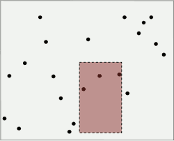
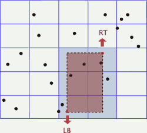
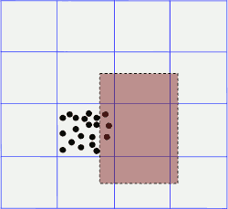
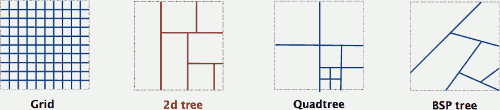
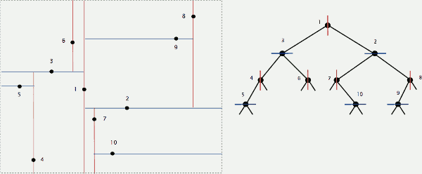
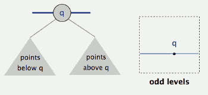

...menustart

- [2D Tree](#24e1aa2b5be033c7c0dcaacc43b2b645)
    - [Question](#a97ea56b0e00b2379736ae60869ff66a)
    - [Grid implementation](#70d1a3fb79b2abed2736ccad8427984f)
    - [Space-partitioning trees](#8e09009743774efb9c0a7dceb8721b2c)
        - [Space-partitioning trees: applications](#922b62791cfd0af7fb819dd01bf4efb6)
    - [2d tree construction](#d11bea9d4fe095af9f1ba36b85f24c9d)
    - [2d tree implementation](#740b6be09ccd4dc6bd568fd9dd316aa9)
    - [Range search in a 2d tree](#e2f4979395b274707c6c5a37cd7ed619)
        - [Range search in a 2d tree analysis](#db369429b7d2c848b75e9d11b977c8d1)
    - [Nearest neighbor search in a 2d tree](#d8734e1f289bf1794afcd19da08a8a6d)
        - [Nearest neighbor search in a 2d tree analysis](#b5df2dde1669c08bc9b0f0b1a24fb85b)
    - [实现时，需要注意的地方](#37fe8d31c8ddcdaf1d3002f5c46d9aa1)

...menuend

<h2 id="24e1aa2b5be033c7c0dcaacc43b2b645"></h2>

# 2D Tree

<h2 id="a97ea56b0e00b2379736ae60869ff66a"></h2>

## Question

 - 给定一组2维坐标点，找出所有 位于某个矩形范围的所有点

<h2 id="70d1a3fb79b2abed2736ccad8427984f"></h2>

## Grid implementation

 - Divide space into M-by-M grid of squares.
 - Create list of points contained in each square.
 - Use 2d array to directly index relevant square.
 - Insert: add (x, y) to list for corresponding square.
 - Range search: examine only squares that intersect 2d range query.

---

 - Fast, simple solution for evenly-distributed points.
 - Problem
    - "Clustering" 
        - Lists are too long, even though average length is short.
        - Need data structure that adapts gracefully to data.

<h2 id="8e09009743774efb9c0a7dceb8721b2c"></h2>

## Space-partitioning trees

Use a tree to represent a recursive subdivision of 2d space.

 - Grid. Divide space uniformly into squares.
 - 2d tree. Recursively divide space into two halfplanes. 
 - Quadtree. Recursively divide space into four quadrants. 
 - BSP tree. Recursively divide space into two regions.

<h2 id="922b62791cfd0af7fb819dd01bf4efb6"></h2>

### Space-partitioning trees: applications

- Ray tracing.
- **2d range search**
- Flight simulators.
- N-body simulation.
- Collision detection.
- Astronomical databases.
- **Nearest neighbor search**
- Adaptive mesh generation.
- Accelerate rendering in Doom.
- Hidden surface removal and shadow casting.

<h2 id="d11bea9d4fe095af9f1ba36b85f24c9d"></h2>

## 2d tree construction

 - Recursively partition plane into two halfplanes

<h2 id="740b6be09ccd4dc6bd568fd9dd316aa9"></h2>

## 2d tree implementation

 - Data structure
    - BST, but alternate using x- and y-coordinates as key.
 - Search gives rectangle containing point.
 - Insert further subdivides the plane.

 - Node in tree,  for each node , it contains
    - Point2D, the position represents the Node
    - Rectage, the rectangle it belongs to
    - Subtree lb, rt , 2 sub trees it divided into
    

<h2 id="e2f4979395b274707c6c5a37cd7ed619"></h2>

## Range search in a 2d tree

 - To find all points contained in a given query rectangle
 - start at the root and recursively search for points in ***both*** subtrees using the following ***pruning rule***: 
    - if the query rectangle does not intersect the rectangle corresponding to a node, there is no need to explore that node (or its subtrees). 
    - A subtree is searched only if it might contain a point contained in the query rectangle.
    - That is :
        - 如果 节点所在矩形 和 查询的矩形 不相交，直接返回; 
        - 否则，检查 节点位置 是否 在查询矩形内，如果是  添加节点位置到 返回结果列表;  递归检查 左右子树 

<h2 id="db369429b7d2c848b75e9d11b977c8d1"></h2>

### Range search in a 2d tree analysis

 - Typical case. R + log N.
 - Worst case (assuming tree is balanced).  R + √N.

<h2 id="d8734e1f289bf1794afcd19da08a8a6d"></h2>

## Nearest neighbor search in a 2d tree

 - To find a closest point to a given query point
 - start at the root and recursively search in ***both*** subtrees using the following ***pruning rule***: 
    - if the distance between *the closest point(some node) discovered so far* and the query point ,  is `<=` the distance between the query point and the rectangle corresponding to the checking node, there is no need to explore that node (or its subtrees). 
        - `if ( minDist <= checkingNode.rect.distanceSquaredTo( queryP )  )  return null ;`
        - 否则，计算 节点位置和 查询点的距离， 更新minDist(如果更短的话)
    - That is, a node is searched only if it might contain a point that is closer than the best one found so far. 
    - The effectiveness of the pruning rule depends on quickly finding a nearby point. 
    - To do this, organize your recursive method so that when there are two possible subtrees to go down, you always choose ***the subtree that is on the same side of the splitting line as the query point*** as the first subtree to explore -- the closest point found while exploring the first subtree may enable pruning of the second subtree.
        - 选择一个更可能存在 nearest point 的 子树，优先递归查找

<h2 id="b5df2dde1669c08bc9b0f0b1a24fb85b"></h2>

### Nearest neighbor search in a 2d tree analysis

 - Typical case. log N.
 - Worst case (even if tree is balanced). N.

---

<h2 id="37fe8d31c8ddcdaf1d3002f5c46d9aa1"></h2>

## 实现时，需要注意的地方

 - 2d tree 需要避免多次插入重复的点， 你需要在insert 的时候，过滤掉这些点，这涉及到 搜索某个特定点的问题
 - search for a particular point
    - 只有当 key ( x or y) 相等时，再判断 当前节点是否是 查找的点， 避免不需要的 equal() 判断

