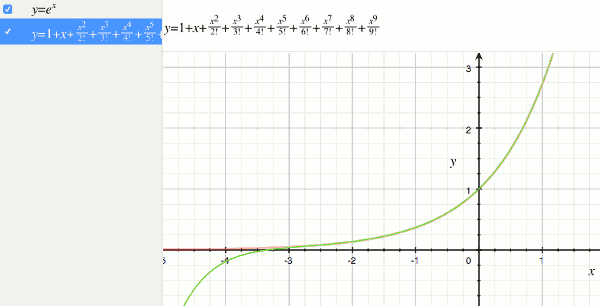
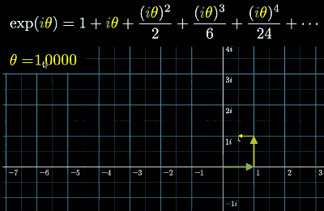
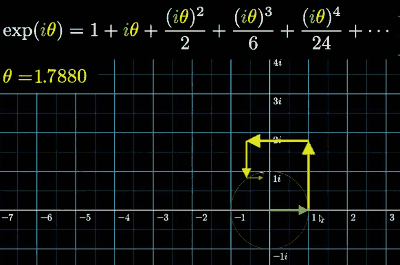
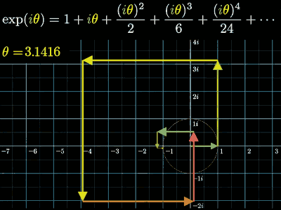
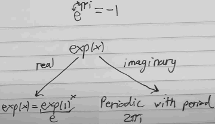

[](...menustart)

- [What is Euler's formula actually saying? | Lockdown math ep. 4](#18a0e75f9580b2706a272049017e24fd)

[](...menuend)


<h2 id="18a0e75f9580b2706a272049017e24fd"></h2>

# What is Euler's formula actually saying? | Lockdown math ep. 4

What we are going to analyze is an extension of the idea of Exponential's in a way that works in the complex plane. 

 

The illustration above is showing very leterally what the claim of Euler's formula is. 

One of the key types of complex number that we were looking at were those that existed on the unit circle. 

When you have have a number who's sitting on the unit circle , `cos(θ)+i·sin(θ)`  1 unit away from origin at some angle θ , multiplying by this number has the effect of rotating things by that angle. 

You often see this expression  in another form  : e<sup>iθ</sup>=`cos(θ)+i·sin(θ)` , known as Euler's formula.


Here I just want to remind us of a more famous variant of this expression that you often see which is basically what happens when you plugin π. 

e<sup>iπ</sup>=cos(π)+i·sin(π) = -1


- One thing maybe  misleading
    - This formula actually has nothing to do with the number *e*.  Then number *e* doesn't actually play a role in what this formula is computationally saying. 

So, what is the function  e<sup>iπ</sup> ?  The function is eˣ and we're plugging in certain imaginary inputs. A lot of people think that that refers to taking a number e and multiplying by itself some number of times  e······e.

The thing that makes the equation misleading is that that's not the function. That is not what eˣ referring to. 

eˣ ≠ e·····e 

This is NOT its convertion. Instead what has emerged in math is that we use eˣ  to be a shorthand for another function, defined to be certain polynomial.

Whenever we see the eˣ  we acutally think of it a shortant hand for a certain polynomial  exp(x) =  ∑ xᵏ/k!.



exp(x) = 1 + x + x²/2 + x³/6 + x⁴/24 + ... + xⁿ/n! + ...

Because this is a series , in practice, if you're actually computing this the denominator grows so quickly you can chop off the series pretty early to get an approximate value. 

Right away this is going to work for lots of kinds of x that we can plug in. 

This infinite polynomial seems very different from the idea of some special constant of *e* , and raising it to a power. 

```python
>>> import math
>>> def exp(x):
...     return sum( [ x**n/math.factorial(n) for n in range( 0,100 ) ] )
...
>>> exp(1)
2.7182818284590455
>>> exp(2)
7.389056098930649
>>> exp(3)
20.08553692318766
>>> exp(4)
54.598150033144265
>>> exp(3+4)
1096.6331584284578
```

One important fact  is that if I add two number in the input , that actually ends up being the same as  the multiplying the output.   exp(3+4) == exp(3)*exp(4).

```python
exp(a+b) == exp(a)·exp(b)
```

If you just look at the polynomial , this is not clear.  It's your homework.

- Q: if a function f(x) has the property that f(a+b) = f(a)f(b) , 
    - for all real numbers  a and b, which of the following is true ?
    1. f(5) = f(1)⁵
    2. f(1/2) = √f(1)
    3. f(-1) = 1/f(1)
- A: 1,2

exp(5) = exp(1+1+1+1+1) = exp(1)⁵ = *e*⁵

At the end, we give exp(1) a special name , a shorthand, let's just call it *e* for short. That is not why we call this number *e* by the way it's also not because this is what Euler's name starts with. It's just because whenever Euler was using this  the first time in a particular book  he was partial to vowels and vowel a had already been used. So *e* was just his arbitrary letter.

for the 2nd candidate answer

exp(1/2)·exp(1/2) = exp(1)  => exp(1/2) = √e 

for the 3rd candidate answer

f(x+0) = f(x)·f(0) => f(0) = 0 or 1.

exp(-1)·exp(1) = exp(0) . since exp(0) may equal 0,  f(-1) is not equal to 1/f(1)


---

So exp(x) = exp(1)ˣ = eˣ. 

But I really want to emphasize that only make sense for real numbers. Because as soon as we start introducing things like complex numbers we can's just add 1 to itself or subtract and divide and get the number i. And at math you often do even crazier things where you plug in things like matrices into this polynomial.  which seems weird but it actually a very useful for a field called differential equations which in turn is useful for physics. 

---

So I understand why we have the convention of writing this as eˣ, it make sense for real numbers but that's actually a bad convention as soon as we start extending it.

<details>
<summary>
Warm-up: power of i
</summary>

So with all of that said let's finally have some fun and plug in some complex values. 

- Q: Rember that i is defined to be a value satisfying i²=-1
    - For which values of n does iⁿ = -1
    1. All multiples of 3
    2. All positive multiples of 3
    3. All integers 1 below a multiple of 4
    4. All positive integers 1 below a multiple of 4
- A: 3

What does the negative powers mean ?  i⁻¹ = 1/i = i³ 

i⁴=1 => i³=1/i= i⁻¹

</details>

--- 

Let's crank θ on up until it equals 1.



In this case , the first term *1*, is the green vector on the bottom pointed 1 unit to the right , 

the next term *iθ* = i  ,  is pointed straight up with 1 unit , 

the 3rd term is -1/2 , is the yellow vector pointed to the left.

the 4th term is -i/6 , is pointed straight down 1/6 ...

```python
>>> exp( complex(0,1) )
(0.5403023058681397+0.8414709848078965j)
```

And in terms of our visual, see the end point of those vectos ,  the real path is a little above 0.5, and the imaginary part is about 0.84. 

So at this point we can actually think what is the claim of Euler's formula ? What is it telling use about the behavior ?

When you initially see this expression   e<sup>iθ</sup>=`cos(θ)+i·sin(θ)` , get us on the unit circle. It doesn't leave you wondering about a real pattern, it leaves you wondering what the convention is. 

However right now what we can see is what this is saying if I plug in iθ , evidently that's the same as walking around a unit. 

Now that feels very substantive there's a lot of content to be had in that expression because if we go to our visual what it's telling us is that if I crank up this value of θ , the sum of vectos converges always sits on the unit circle.



Now let's take the most famous input θ=π,  what is this actually saying ?



```python
>>> exp( complex(0,math.pi) )
(-1.0000000000000002+3.458669144327514e-16j)
```

We saw that , from θ⁴ , the vectors starts to shink, shink , and start to converge to a point.

So the *i*  in there is what's letting these vectors all turn 90° each time and give us this very pretty spiral sum. 

And the claim of Euler's formula is that , any θ that we might plug in, it puts us on a unit circle at that angle. 


- Q: Which of the following values is closest to e³ⁱ ?
    1.  0.99 + 0.14i
    2. -0.99 + 0.14i
    3.  0.14 + 0.99i
    4. -0.14 + 0.99i
- A: 2



---

- Homework 
    1. Show that when you fully expand exp(x)·exp(y) , each term has the form xᵏyᵐ/(k!·m!).
    2. Show that when you expand exp(x+y), each term has the form 1/n!·(n,k)xᵏyⁿ⁻ᵏ
        - (n,k) here means n choose  k
        - hint: look up the binomial formular
    3. Compare the 2 results above to explain why exp(x+y) = exp(x)·exp(y)
    4. Would this result still hold if x and y are complex numbers ?  What about matrices ?


