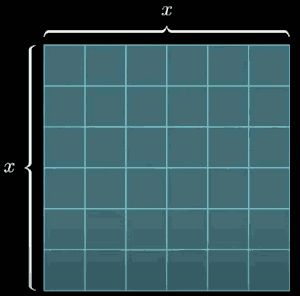
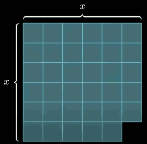
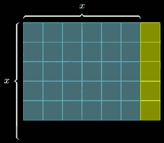

...menustart

- [The simpler quadratic formula | Lockdown math ep.1](#07ce9c8defcca1a8cf2f97556ea53127)
    - [Mental Math Tricks](#c236129fe028b8f8a5fafd195a9426c5)
    - [Quadratic Formula](#2e0557fe7fcb444a6bdded79c3f233ed)

...menuend

<h2 id="07ce9c8defcca1a8cf2f97556ea53127"></h2>

# The simpler quadratic formula | Lockdown math ep.1

<h2 id="c236129fe028b8f8a5fafd195a9426c5"></h2>

## Mental Math Tricks 

36 ≈ 35 = 5·7 ≈ 6·6

144 ≈ 143 = 11·13 ≈ 12·12

3599 = 59·61

Image we have an image of square

now take the corner off of that square

The question is to say can I rearrange the quantity that remains into some kind of rectangle. 

---

x²-1 = (x-1)(x+1)

x²-a² = (x-a)(x+a) , for example,  135 = (12-3)·(12+3) = 9·15

The more intriguing is that any 2 numbers -- r and s -- we can write that down as some midpoint *m* plus or minus a distance *d*. 

r,s = m ± d 

And what this is telling us is to think about products is always the same as thinking about a difference of squares. Which is weird because products can be very chaotic. If I just walk through the number line , and I say look at 101,102,103,104,105,... ,  and I just say take a look at all the numbers on the number line, and I want you to systematically tell me can each one of them be broken down as a product of 2 smaller whole numbers ? Well we know that what that's asking is what are the primes because only the primes can't be broken down like that.  And yes evidently that's a very similar question to say when can I walk through those numbers and say hey am I able to express you as a difference of squares? Could I add a square number to you to get another square? 

I think if you were doing some arithmetic and you has this in the back of your mind, that's a good pattern, and that's a pattern that's gonna come up later in life. For example let's say later in life you find yourself wanting to understand quadratic functions.

<h2 id="2e0557fe7fcb444a6bdded79c3f233ed"></h2>

## Quadratic Formula

ax²+bx+c=0

This is actually equivalent to rescaling everything by 1/a

x² + b'·x + c' = 0

They are different functions, but they have the same roots. 

If we are thinking of our quadratic in terms of its roots, and I say okay it's going to intersect the x-axis at r and s, another way that I could express that particular quadratic is (x-r)(x-s). And in this case if you just expand it out we will get x² -(r+s)x +r·s = 0.

let *m* be the middle point between r and s, and *d* = (s-r)/2

3 Key Facts:

1. b' = -(r+s) , prime is the re-scale coefficient
2. c' = r·s
3. c' = (m-d)(m+d) = m²-d²

Let's say that you were given a quadratic like x² +6x +7 = 0. What is the *m* ?

r,s = m±d

m = (r+s)/2 = -b'/2 = -3

d² = m² - c' = 9-7 = 2

r,s = m±d = -3±√2

In general for any quadratic , m = -b'/2 , d = √(m²-c'). All you have to do is first find *m*, and then find the *d*.

> 2次曲线在m的函数值，肯定是函数的极大/小值，所以 2m+b'=0, m=-b'/2.

