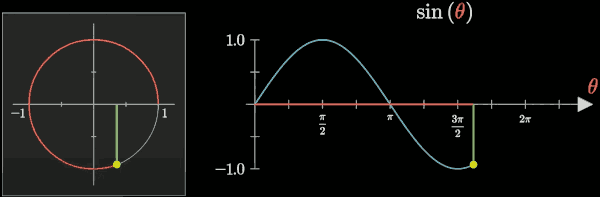
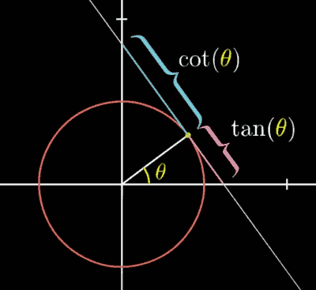
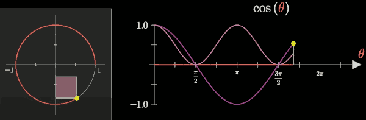
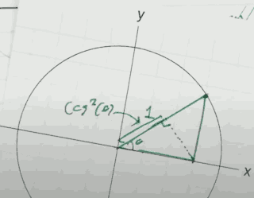
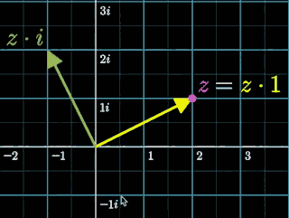

...menustart

- [Trigonometry fundamentals | Lockdown math ep. 2](#c3747e4cefb7c22e073615c8f0adcf67)
    - [cos²(x) and cos(2x)](#f481852fd11d79b842d8e4b334e679d4)
    - [Trigonometry is about circles](#526cf70cd498e0861be1d3420a6827c3)
    - [Pythagorean theorem](#d5f7765e3debfe3fa6b7dbf00ffc6f48)
    - [cos(x/2)](#73ae02540a4c988c767f6a41ed5a99e5)
- [Complex number fundamentals | Lockdown math ep. 3](#c3c421e1caa75d1788f81ac64d05fa47)
    - [Complex number and Rotation](#85ba6f123827a8e936ea9597617f42f8)
    - [Reverse operation](#c08d63b19ebc85a1011a5ef3f5925b47)
    - [relation between cos²(x) and cos(2x)](#9e719b4aef3ac4ce4b37b41a28ffea30)

...menuend


<h2 id="c3747e4cefb7c22e073615c8f0adcf67"></h2>


# Trigonometry fundamentals | Lockdown math ep. 2

<h2 id="f481852fd11d79b842d8e4b334e679d4"></h2>


## cos²(x) and cos(2x)

```
cos(x)² = (1+cos(2x)) /2
```

In particular the one thing I want you to take note of is the weird fact that, when you sqaure cos, it's not equal to but it's somewhat related to the idea of scaling up that intput

```
cos(x)² ←→  cos(2x)
```

Now if you were clever there is another function that behaves very similarly to this

```
f(x) = 2ˣ
```

Maybe, just maybe cosine is somehow related to exponents. It's not at all obvious how it is , but it absolutely is. 

We will discover the relationship at the end.

<h2 id="526cf70cd498e0861be1d3420a6827c3"></h2>


## Trigonometry is about circles

**Trigonometry Basis**: **You think its about triangles, but really it's about circles.**



Here, θ is the input, and it's going to be a measure of how far you've walked around a unit circle.  sin(θ) give you the y-axis value -- the distance between you and the x-axis.


By contrast consine is defined very similarly but it's giving you the x coordinat. 

<h2 id="d5f7765e3debfe3fa6b7dbf00ffc6f48"></h2>


## Pythagorean theorem

```
cos(x)² + sin(x)² = 1 
```

If fact this is equivalent to the Pythagorean theorem(勾股定理).

But you never see it written down like that. 

Because people don't want to write too many paranthesis , instead they write 

```
cos²(x) + sin²(x) = 1 
```

How lovely we don't have to write too many symbols, what a wonderful convention except for the fact that literally every other time in math you see something written as `f²(x)`, what that means is not `(f(x))²` ,that's almost never what it means.

instead what it's supposed to mean for most of math is taking a function and applying it to itself `f(f(x))` . 

THe idea is that it's very different from the convention in trigonometry. Trigonometry is just flying by its own rules: I understand some students will be confused but I'm trigonometry I don't care. 

<h2 id="73ae02540a4c988c767f6a41ed5a99e5"></h2>


## cos(x/2)

Now we will walk back to the very beginning , associated with cos²(θ) and cos(2θ). 

```
cos(x)² = (1+cos(2x)) /2
```

cos²(x) which looks like little scaled-down version of cosine, oscillating more quickly is the same as cos(2x) that quicker oscillation, but we had to kind of shift it and rescale it to make them equal. 

what is the cos(π/12) ?

We'll find next time is that this is actually a shadow of the fact that trigonometric functions are related to complex numbers. 

And the idea of doubling the angle (cos(2x))  correspoinding to multiplying by something twice (cos²(x)) not at all a coincidence. 

**Where is tan(θ) ?** 



It actually lies tangent to the circle, so is where the word "tan" comes from. 

**Where is cos²(θ) ?**

If we draw the graph of cos(x) and cos²(x) simultaneously 



The square of that value looks like anothe cosine wave.

Where is the cos²(x) on the unit circle ?




<h2 id="c3c421e1caa75d1788f81ac64d05fa47"></h2>


# Complex number fundamentals | Lockdown math ep. 3

```
cos(α+β) = cos(α)cos(β) - sin(α)sin(β)
sin(α+β) = cos(α)sin(β) + cos(β)sin(α)
```

It's something that's very error-prone if you're just trying to memorize it as it is. 

However if you come at it with complex numbers this is not only much less error-prone it has a very beautiful meaning and it just falls right out. 

So even if you don't necessarily believe in the reality of the √-1 , you at the very least have to admit that it's interesting that it can make other pieces of math useful that other pieces of math a little bit more understandable too. And trigonometry is just the tip of the iceberg. 

If talk to anybody who's in engineering anybody who's going into serious math they'll tell you that complex numbers are as real a part of their work in their life as real numbers are. 

But the starting point looks very strange 

- Weird assumptions:
    - **i² = -1**

The *i* does not exist on the real number line, it on the line perpendicular to it. 

<h2 id="85ba6f123827a8e936ea9597617f42f8"></h2>


## Complex number and Rotation

You have a vector (3,2),  rotated by 90 degree, you get (-2,3).  

(x,y) -> rotate 90 degree -> (-y,x)

What's result of i·(3+2i) ?  -2+3i. 

So that should give you some indication that , ok multiplying by *i* has this action of rotating things by 90 degrees. 

It turns out that if you have a number that behaves this way it gives you a computational mechanism for all of the types of rotations that you might want to do that might not necessarily be 90 degree. 



- 3 Facts about Multiplication, suppose we have a complex number
    1. z·1 = z
    2. z·i = rot 90(z)
    3. z·(c+di) = c·z + d·zi
        - we know what z is, and we also know what zi is.
        - linear combinaton of 2 perpendicular vectors z , zi 
        - 把 z, zi想象成一个rot90矩阵
        ```
        ⎡| | ⎤·⎡c⎤
        ⎣z zi⎦ ⎣d⎦
        ```

- Q: What is the complex number z, so that multiplying by z has the effect of rotating 30°, or π/6 radians, counterclockwise ?
- A: z = cos(π/6) + isin(π/6)

Most programming language has builtin complex number.

```python
>>> complex(3,-1)
(3-1j)
>>> complex(3,-1) * complex(4,2)
(14+2j)
```

You could do everthing , rotation and scale, defined in terms of complex number **in 2d graphics**, in 3d graphics it wouldn't work. However if you want to use a number system to describe rotations in 3D instead of using matrices you could use things called **quaternions**.

---

- Q: What is cos(75°) ?
- A: (√6-√2)/2
    - put cos(75°) onto the unit circle in complex system 
    - cos(75°) = cos(45°+30°)
    - ( cos(45°) + isin(45°) )·( cos(30°) + isin(30°) )
        - = ( √2/2 + √2/2·i )·( √3/2 + 1/2·i )
        - **for cosine , we need only the real part**
        - = √6/4 - √2/4


```
( cos(α)+i·sin(α) )( cos(β)+i·sin(β) ) = cos(α+β) + i·sin(α+β)
```

That is

```
cos(α)cos(β)-sin(α)sin(β) 
    + i·( cos(α)sin(β)+sin(α)cos(β) )
= cos(α+β) 
    + i·sin(α+β)
```


- Q: Find a z satisfy z²=i?
- A: √2/2 + i·√2/2 ,  单位圆上的45°旋转45° 得到 i

Another answer is -(√2/2 + i·√2/2)  (225°). 

Most positive numbers have 2 square roots, ±5=25, and in the same way that even negative numbers like -1 has 2 square roots ±i.  Even i itself has 2 square roots. 

In general everything except 0 has 2 square roots.


- Q: The equation x³=1 has one real number solution x=1. Among the complex numbers, there are two more solutions.  what are them ?
- A: cis(0°),cis(120°),cis(240°)
    - that is,  the 0°, 120°, 240°  on the unit circle.


<h2 id="c08d63b19ebc85a1011a5ef3f5925b47"></h2>


## Reverse operation

```
cis(α) = 1/cis(-α)
```

<h2 id="9e719b4aef3ac4ce4b37b41a28ffea30"></h2>


## relation between cos²(x) and cos(2x)

```
  ( cos(θ)+i·sin(θ) )² 
= cos²(θ) - sin²(θ) 
    + i·2cos(θ)sin(θ)
```

So what we've done there is basically said there is 2 ways to think about `( cos(θ)+i·sin(θ) )² ` , one of them is of course it doubles the angle, on the other hand algebraically it's equal to `cos²(θ) - sin²(θ) + i·2cos(θ)sin(θ)`. It's showing an double angle identity.

So what we found here just to summarize on the real part:

```
cos(2θ) = cos²(θ) - sin²(θ)
        = cos²(θ) - (1-cos²(θ))
        = 2cos²(θ) - 1
```

> PS. The real part is cos(2θ), while the imagary part is sin(2θ)


- Double angle formula
    - 
    ```
    cos(2θ) = cos²(θ) - sin²(θ) # 0
    cos(2θ) = 2cos²(θ) - 1     # 1
            = 1 - 2²sin(θ)     # 2
    sin(2θ) = 2sin(θ)cos(θ)    # 3
    ```

- Half-angle formula
    - 
    ```
    cos²(θ/2) = ( 1+cos(θ) )/2  # from formula #1
    sin²(θ/2) = ( 1-cos(θ) )/2  # from formula #2
    ```

---

The very last thing I want to mention I want to talk about why nobody really uses the cis notation. 

```
cis(α) = cos(α)+i·sin(α)
```

cis(α) is not really standard notation when we're talking about rotating α around the unit circle.  The reason is because you're always going to see instead e<sup>iα</sup>. Just to give an indication of why e<sup>iα</sup> might not be a totally crazy thing.

cis(α)·cis(β) = cis(α+β) , which is actually the same property the exponential function has.


