...menustart

- [Essence of linear algebra](#ab7dcbdd05408bb8c50281f539119f94)
    - [3 Linear transformations and matrices](#ebf4ed4e5dbdf709f6e2a501e1c5cbce)
    - [4. Matrix multiplication as composition](#9e3659318b7054360844875560006980)
    - [5. The determinant](#0a05f70d4501925ef20156f580f0b07d)
    - [6. Inverse matrices, column space and null space](#59e335b6a8c34e003dd810410fbf4e21)
    - [footnote. Nonsquare matrices as transformations between dimensions](#8e0c7f26d1f694558baee5ef34fe55ef)
    - [7. Dot products and duality](#04629028685253ba3138ddced808a1ce)
    - [8. Cross products](#c21e7bf7d55df7edb7e2f6a780fbccd6)
        - [Cross products in the light of linear transformations](#d6f39fcd3624e0b509757af47be8f6c5)
    - [9. Change of basis](#a08ecda2d10894d7eda0f957ef9a7ce4)
    - [10. Eigenvectors and eigenvalues](#d7095a9bb84406d5fb5ed382385c7d16)
    - [11. Abstract vector spaces](#d0019094c72f442cca76cf5e53f49e73)

...menuend


<h2 id="ab7dcbdd05408bb8c50281f539119f94"></h2>


# Essence of linear algebra

<h2 id="ebf4ed4e5dbdf709f6e2a501e1c5cbce"></h2>


## 3 Linear transformations and matrices

- Grid lines remain parallel and evenly spaced
    - 你应该把 线性变化 看作是 "保持网格线 平行，且 等距分布" 的变化
- 你应该如何用数值去描述 这些线性变化呢？
    - what formular do you give the computer , so that if you give it the coordinates of a vector, it can give you the coordinates of where that vector lands?
    - it turns out that you only need to record where the 2 basis vectors, î,ĵ, each land
    - for example , consider the vector v with coordinates (-1,2), means that  `v⃑ = -1î +2ĵ`
        - if we play some transformation, and follow where all 3 of these vectors go
        - the property that grid lines remain parallel and evenly spaced has a really important consequence:
            - the place where v lands, will be -1 times the vector where î landed, plus 2 times the vector where ĵ landed
        - in other words, it started off as a certain linear combination of î and ĵ, and it ends up is that **same** linear combination of where those 2 vectors landed. 
        - This means you can deduce where v must go based only on where  î and ĵ each land. 
        - This is why it is very useful to keep a copy of the original grid in the background
        - for the transformation shown here, we can read off that î lands on (1,-2) , ĵ lands on (3,0) , this means v⃑ ends up `-1*(1,-2) +2*(3,0) = (5,2)` 
        - 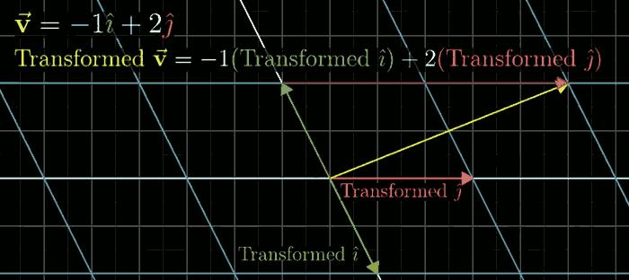
- 所以，只要记录了 变换后的 î,ĵ, 我们就可以推断出任意向量在 变化后的 位置，完全不必 观察变换本身是什么样
    ```octave
    ⎡x⎤ -> x⎡ 1⎤ +y⎡ 3⎤ = ⎡ 1x + 3y⎤
    ⎣y⎦     ⎣-2⎦   ⎣ 0⎦   ⎣-2x + 0y⎦  
    ```

- you can calculate where any transformed vector lands using this formula.
- what all of this is saying that a 2D linear transormation is completely described by just 4 numbers
    - the 2 coordinates for î lands
    - and the 2 coordinates for ĵ lands
        ```octave
        ⎡ 1 3⎤
        ⎣-2 0⎦
        ```

---

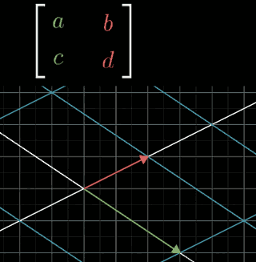


- 我们完全可以把 矩阵的列， 看作变换后的基向量; 把矩阵·向量乘法 看作它们的 线性组合。
    - 这样是不是更有趣呢？

```octave
octave:1> a = [ 1 3 ; -2 0 ]
a =

   1   3
  -2   0

octave:2> a*[-1;2]
ans =

   5
   2

octave:4> inv(a)
ans =

  -0.00000  -0.50000
   0.33333   0.16667

octave:5> inv(a)*[5;2]
ans =

  -1.0000
   2.0000
```
    
---

- 描述 逆时针旋转90度矩阵
   - î lands on (0,1), ĵ lands on (-1,0), 所以矩阵就是
        ```octave
        ⎡ 0 -1⎤
        ⎣,1  0⎦
        ```

- **记住，矩阵是空间的变换**
 

<h2 id="9e3659318b7054360844875560006980"></h2>


## 4. Matrix multiplication as composition

- Often-times you find yourself wanting to describe the effect of applying one transformation and then another. 
    - eg. maybe you want to describe what happens when you first rotate the plane 90° counterclockwise, then apply a shear.
- This new linear transformation is commonly called the "composition" of the 2 separate transformations we applied.
- Like any linear transformation , it can be described with a matrix all of its own, by following î,ĵ.
    - In this example, the final matrix is [ 1 -1 ; 1 0 ]
    - 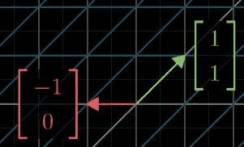
- Here's one way to think about that new matrix:
    - if you were to take some vector and pump it through the rotation then the shear 
    - the long way to compute where it ends up is to , first , multiply it on the left by the rotation matrix; then,take whatever you get and multiply that on the left by the shear matrix. 
    - this is the same as just applying only that composition matrix
- **Always remember, the multiplying 2 matrices like this has the geometric meaning of applying one transformation then another**
    - 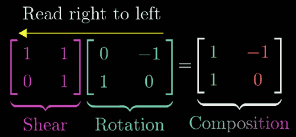
    - `f(g(x))`
- In next example, we will find the composition matrix by , just using the numberial entries in each matrix 
    - 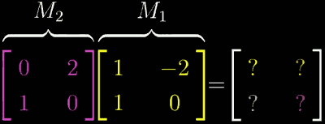
    - First , we need to figure out where î goes.
        - after applying M1 , the new coordinates of î, by definition, are given by that 1st column of M1, [1;1] 
        - to see what happenes after applying M2 , multiply the matrix for M2 by that vector : `M2*[1;1] = [2;1]`.
        - [2;1] will be the 1st column of the composition matrix
    - Likewise to ĵ, the 2nd colnmn of the composition maxtrix is [0;-2]
    - 矩阵乘法 block ?
- 证明 矩阵乘法结合律 (AB)C = A(BC) ?
    - 事实上，括号如何添加，并不会影响 A,B,C 三个变化的执行顺序, 所以最终会得到相同的结果

<h2 id="0a05f70d4501925ef20156f580f0b07d"></h2>


## 5. The determinant

- 有件事对理解各种linear transformation 很有用，那就是测量 变换 究竟对 空间有**多少** 拉伸或挤压，更具体一点，就是测量一个给定区域面积 增大或减小的比例
- This very special scaling factor , the factor by which a linear transformation changes any area, is called **the determinant of that transformation.**
    - 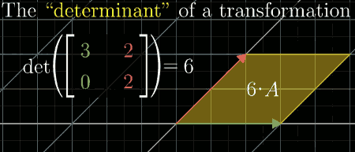
- The full concept of the determinant allows for negative values
    - what would scaling an area by a negative amount even mean ? 
    - This has to do with the idea of orientation. 
        - Feels like flipping space , any transformation that do this are said to "invert the orientation of space."
    - Another way to think about it , is in terms of î,ĵ.   
        - In their starting positions, ĵ is to the left of î. 
        - If , after a transformation, ĵ is now on the right of î, the orientation of space has been inverted.
        - 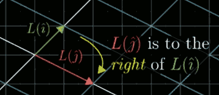
- Whenever the orientation is inverted, the determinant will be negative.
    - the absolute value of the determinant though still tells you the factor by which areas have been scaled. 
- What `det(M)<0` means in 3D ?
    - One way to describe orientation in 3D is with the right hand rule
    - 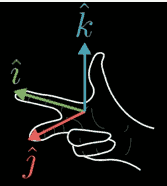
    - if you still can do it after transformation, orientation has not changed. 
- det(M₁M₂) = det(M₁)det(M₂)

<h2 id="59e335b6a8c34e003dd810410fbf4e21"></h2>


## 6. Inverse matrices, column space and null space

- Usefulness of matrices
    - 描述对空间的操纵，这对 计算机图形学 和 机器人学很有用
    - 解 线性方程组 Linear system of equations 
- rank: Number of **dimensions** in the output
    - 代表着变换后 空间的维数
    - 当变化的结果为一条直线时，我们称这个变换的 rank 为1
    - 当变化的结果为一条平面时，我们称这个变换的 rank 为2
    - 更精确的定义是 the number of dimensions in the column space.
- Column Space
    - 不管是一条直线，一个平面，还是三维空间，所有可能的变换结果的集合，is called the **Column Space** of a matrix *A*
- Null Space
    - 对一个full rank矩阵来说，唯一能变换后 落在原点上的，就是zero vector itself.
    - 但对于一个 非满秩矩阵来说，它将空间压缩到更低的维度, 也就是说会有 一系列 向量在变换后 成为零向量。
        - eg. 如果一个三维线性变换 将空间压缩到一条直线上，那么就有一整个平面上的向量在变换后落在原点。
    - 这些 变换后落在原点的向量的集合，is called the **Null Space** , or **Kernel** of the matrix 
    - In terms of the linear system of equation Ax=b , if b happens to be the zero vector, the null space gives you all of the possible solutions to the equation. 

<h2 id="8e0c7f26d1f694558baee5ef34fe55ef"></h2>


## footnote. Nonsquare matrices as transformations between dimensions

```
⎡ 2 0⎤
⎢-1 1⎥
⎣-2 1⎦
```

- 3x2 matrix
- column space is, 一个过原点的 二维平面, 但 矩阵依然是 满秩矩阵
- 这个矩阵的几何意义就是 将二维空间 映射到 三位空间上
    - 因为矩阵 有两列，表明 输入空间有 两个基向量
    - 有三行，表明 每一个基向量在 变换后 都用三个独立的坐标来描述
        ```octave
        ⎡ 3 1 4⎤
        ⎣ 1 5 9⎦
        ```

- 2x3 matrix
- 输入空间 有3个基向量
- 2 rows 表明 基向量在变换后 仅用两个坐标描述， 所以它们一定落在二维空间内
- 因此 这是一个从 三维空间 到 二维空间的变换

<h2 id="04629028685253ba3138ddced808a1ce"></h2>


## 7. Dot products and duality 

- v·w
    - 
    - 如果w的投影 与 v的方向相反，`= -(Length of projected w)(Length of v)`
    - v·w > 0 方向大致相同
    - v·w = 0 垂直
    - v·w `<` 0 方向大致相反
- 为什么 对应坐标相乘 并相加，和投影有所联系?
    - The most satisfactory answer comes from **duality**.
    - 数值计算角度, 点积 等同于 一个1x2 matrix 乘以向量
        - 1x2 matrices `<-->` 2d vectors 
        - 放倒变成矩阵, 立起变成向量
    - 从几何角度可以看到一些美妙的事情: 将向量转化为数的线性变换(matrix) 和 这个向量本身 有什么某种关系
        - copy 一份数轴，保持原点，斜放到空间中
        - 考虑这样一个 二维向量 û ， 它的终点 落在这条数轴的1上
        - 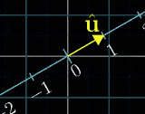
        - 如果将二维向量直接投影到这条数轴上，实际上，我们就定义了 一个从2D向量到 1D数的函数, 而且这个函数是线性的
            - 记住 虽然投影点都是数，但是û 是2D空间的一个向量，它碰巧落在这条数轴上
        - 根据这个投影，我们定义一个从 二维向量到数的线性变换。为了找到这个 1x2矩阵，我们把数轴放大看，并且需要考虑变换后 î,ĵ 的位置， 因为他们就是 矩阵的列。
        - 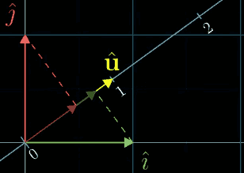
        - 下面这部分超级漂亮，我们可以通过 对称性进行推理，因为î,ĵ 都是单位向量，将î向û投影， 与û向î投影看上去完全对称。
            - 所以说，î投影后的数 ，就是û 向x轴投影得到的数 -- u的横坐标: uₓ 
            - 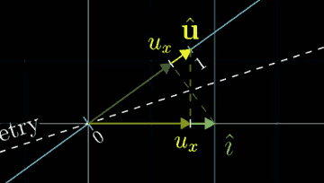
            - 以上推理过程对 ĵ 几乎一致，ĵ投影后的数，就是 u<sub>y</sub> 
        - 所以描述投影变换的1x2矩阵的两列，就分别是û的两个坐标。 而空间中任意向量经过投影变换的结果，也就是投影矩阵与这个向量相乘，和这个向量与û的点积在计算上完全相同.
            - Maxtix-vector product `<==>` Dot product
        - 这就是为什么 单位向量的点积， 可以解读为 将向量投影到 单位向量所在直线上 所得到的投影长度
    - 如果 û 是非单位向量呢？eg. ( 3uₓ , 3u<sub>y</sub>  )
        - 数值上说，它的每个坐标都被放大为原来的3倍，所以要寻找这个向量相关的投影矩阵，实际上就是之前î,ĵ 投影得到的值的3倍
        - 更普遍的说，因为这个变换是线性的，意味着这个新矩阵可以看作 将任意向量 向数轴上投影，然后将结果乘以3； 
        - 这就是为什么 向量与给定非单位向量的点积可以解读为 首先朝给定向量上投影，然后将投影的值，与给定向量长度相乘。
- 思考一下这个过程，我们有一个从二维空间到数轴的线性变换，它并不是由向量数值或点积运算定义得到的，而只是通过将空间投影到给定数轴上来定义。
    - 但是因为这个变换是线性的，所以它必然可以用某个1x2矩阵描述。又因为 1x2矩阵 与 二维向量相乘的计算过程，和求点积的计算过程相同，所以这个投影变换必然会与某个二维向量相关。
- 这里给你的启发是，你在任何时候看到一个2d-to-1d 线性变换，无论它是如何定义的，空间中会存在 唯一的向量v 与之相关，就这一意义而言，应用变换和与向量v做点积是一样的。
- 总结一下，表面上，点积是理解投影的有力几何工具；不过更进一步讲，两个向量点乘，就是将其中一个向量转化为 线性变换。
    - 一旦你真正了解向量的“个性”，有时你会意识到，不把它看作空间中的箭头，而把它看作线性变换的物质载体，会更容易理解向量。
    - 向量就仿佛是一个特定变换的概念性记号。

<h2 id="c21e7bf7d55df7edb7e2f6a780fbccd6"></h2>


## 8. Cross products

- 2D vxw = signed Area of parallelogram
    - if v is on the right of w , value is positive 
        - 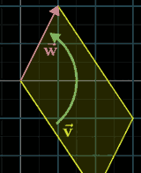
    - if v is on the left of w, value is negative 
    - vxw = -wxv
    - 如何记忆方向？ `î x ĵ = +1`  
    - computation:  vxw = det( [v w] ) 
- 严格的讲，上面描述的东西 is not cross product.
- 真正的叉积是 通过两个 三维向量a,b，生成一个新的三维向量c, 这个向量c的长度，就是a,b围成的平行四边形的面积
    - c 的方向 与平行四边形 所在面 垂直, 右手法则
    - 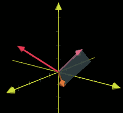
    - 
    - computation:
        - 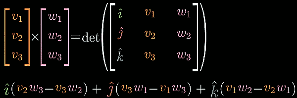
- question: 为什么 叉积的计算 和行列式这么相像？ 之间有什么必然联系？

<h2 id="d6f39fcd3624e0b509757af47be8f6c5"></h2>


### Cross products in the light of linear transformations

- Plan
    1. Define a 3d-to-1d linear transformation (3d to the number line ) in terms of v and w
    2. Associate that transformation with its "dual vector" in 3D space
    3. Show that this "dual vector" is `vxw`
- 之所以这么做，是因为理解这个变换，能够解释清楚叉积的计算过程和几何含义之间的关系。
- 回忆一下2d空间中 的计算 det([u v])。
    - 如果你不知道三维向量的叉积，并且尝试去外推，你可能会得到这样的结果 det( [u v w] ) , 当然这不是三维向量的叉积。
    - 真正的三维向量叉积 接收两个向量，并输出一个向量, 它并不是接收三个向量，并输出一个数。
    - 不过这个想法已经非常接近真实的叉积了。
    - 将第一个向量u看作可变向量，比如(x,y,z) , 而 v,w保持不变，那么我们就有一个 从三维空间到数轴的函数了:
        - 你输入一个 向量(x,y,z) ， 然后通过矩阵的行列式得到一个数。
        - 
        - 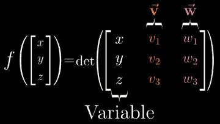
        - 这个函数的几何意义是, 对于任一输入的向量(x,y,z), 你都考虑由它和v,w 确定的平行六面体 得到它的体积，然后根据定向确定符号。
        - 这个函数是线性的，这样我就可以引入 对偶的思想了。 一旦知道它是线性的，你就知道可以通过1x3矩阵 乘法来描述这个函数。
            - 1x3 matrix encoding the 3d-to-1d linear transformation
        - 对偶性的整体思路是，从多维空间到一维空间的变换的特别之处，在于你可以将这个矩阵立起来，并且将整个变换看作与这个特定向量的点积。
            - 我们要找的，就是这个特殊的三维向量 p, 使得p与其它任一向量(x,y,z) 的点积，等于一个3x3矩阵的行列式.
            - 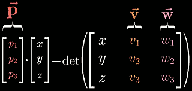
        - 现在我们来关注这个计算本身
            - 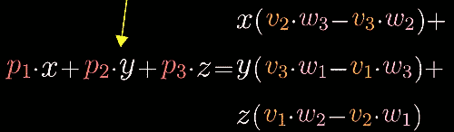
            - 因为 v,w 的坐标的特定组合，就是我们寻找的向量p的坐标
            - 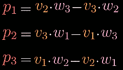
            - 等号的右侧，对于那些进行过叉积计算的人来说是很熟悉的。
- 这一切都在说明，前面奇怪的运算过程可以看作是以下问题的答案：
    - 当你将向量p和某个向量(x,y,z)点乘时，所得结果等于一个3x3矩阵的行列式，这个矩阵的第一列为 (x,y,z),其余两列为 v和w的坐标。什么样的向量p才能满足这一特殊性质?
    - 我们从几何角度再来看一下这个问题
    - 点积的几何意义是 投影的长度与p的长度相乘
    - 平行六面体的体积，等于 由v,w确定平行四边形的面积，乘以，向量(x,y,z) 垂直于平行四边形方向上的分量
        - 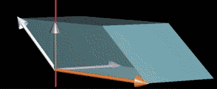
        - 换句话说，我们找到的线性函数 对于给定向量(x,y,z)的作用，是将这个向量投影到垂直于v,w的直线上，然后将投影长度与v,w张成的平行四边形的面积相乘. 但是，这和垂直于v,w且长度为平行四边形面积的向量 与(x,y,z)点乘是同一回事。
        - 更重要的是，如果你选择了合适的向量方向，点积为正的情况，就会与(x,y,z),v,w 满足右手定则的情况相吻合
- 这意味着，叉积的结果是这么一个向量p: 垂直与v,w, 且与某个向量(x,y,z)点乘时，所得结果等于 (x,y,z),v,w 构成的3x3矩阵的行列式


<h2 id="a08ecda2d10894d7eda0f957ef9a7ce4"></h2>


## 9. Change of basis
     
- 你有一个朋友詹妮弗, 她使用着一组不同的基向量 -- b1,b2. 
    - 在你使用的标准坐标系中的向量 (3,2) , 詹妮弗其实会用坐标 ( 5/3,1/3 )来描述它.
    - 更确切的说一说这里的设定，对于b1,我们会用坐标(2,1)来描述，对于b2 我们用(-1,1)来表示。但是重要的一点，从她的角度来看,在她的坐标系中，这两个向量的坐标为 (1,0) , (0,1).
    - 实际上，我们说着不同的语言。虽然我们都在关注空间中的同一个向量，但是詹妮弗用不同的语言和数字来描述它。
- 那么如何在不同的坐标系之间 进行转化呢？
    - 比如说，如果詹妮弗用坐标(-1,2) 描述一个向量，那么这个向量在我们的坐标系中如何描述？ 你如何从她的语言 转化到我们的语言？
        - 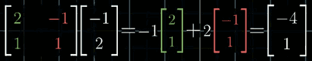
        - 这其实就是矩阵向量乘法。 这个矩阵的列 代表的是用我们的语言表达的 詹妮弗的基向量。这其实就是一个线性变换。
        - 线性变化的一个重要特性在于， 应用变换后的 向量仍旧是 相同的线性组合， 不过使用的是 新的基向量。 
    - 这个矩阵所做的，是将我们对 **詹妮弗的向量的误解** ，变换为她提到的真正向量。
        - 几何上说，这个矩阵将我们的网格变换为 詹妮弗的网格
        - 但是从数值上说，这是将 一个用她的语言来描述的向量 ， 转化为 用我们的语言来描述。
    - What about the other way around ? 
        - 之前的那个例子， 在我们的坐标系中，有一个坐标为 (3,2)的向量，如何计算出 他在詹妮弗的坐标系中的坐标为(5/3,1/3) ?
        - inverse matrix :  A⁻¹·[3;2] = [5/3;1/3]
- 考虑某个线性变化，比如 逆时针旋转90°
    - 我们在求它的矩阵的时候，我们是在跟踪 î,ĵ的去向， î,ĵ变换后的坐标，也就成了矩阵的列: P = [ 0 -1; 1 0 ]
    - 但是这种表示与我们对基向量的选择密切相关，因为我们跟踪的是 î,ĵ, 并且是在我们自己的坐标系中记录它们的去向。
    - 詹妮弗如何描述同样的空间90°旋转呢？
        - 你可能会尝试 只将旋转矩阵的列转化为 用詹妮弗的语言描述，but that is not quite right. Those columns still represent **our basis**, not **hers**, and need to describe those landing spots in here language. 
    - 这个过程的通常想想法是这样的:  
        - 从詹妮弗的语言描述的任一向量出发，say [-1;2] . 
        - 我们先不用她的语言来描述这个过程，而是用基变换矩阵 转化为用我们的语言描述
        - 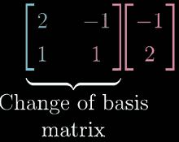
        - 然后，将所得结果 左乘 线性变换矩阵 P 
        - 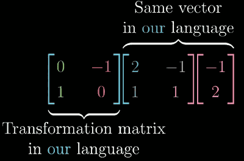
        - 上面变换后的向量， 仍然是用我们的语言来描述的，所以像之前一样，所得结果左乘 基变换矩阵的逆，从而得到的最终向量，就是用詹妮弗的语言来描述的。
        - 
        - 我们可以对 用詹妮弗语言描述的 任一向量，做同样事， 首先 基变换，然后线性变换，然后基变换的逆， 这三个矩阵的复合给出的，就是用詹妮弗怨言描述的线性变换矩阵。它接收 詹妮弗语言描述的向量，输出用詹妮弗语言描述的 变换后的向量。
- 总的来说，每当你看到这样一个表达式: A⁻¹MA , 这就暗示着一种数学上的转移作用。中间的矩阵代表一种你所见的变换，而外侧的两个矩阵代表着转移作用，也就是视角上的转化。矩阵乘积 仍然代表这同一个变换， 只不过是从其它人的角度来看的。
- 所以，固定坐标系下一个对象的变换等价于固定对象所处的坐标系变换。
    - `Ma = b`
        - 从对象变换角度说，向量a经过矩阵M所描述的变换，变成了向量b
        - 从坐标系变换角度说，有一个向量，它在坐标系M的度量下得到的度量结果向量为a，那么它在坐标系I的度量下，这个向量的度量结果是b。
            - 即 `Ma = Ib`
            - 在M为坐标系的意义下, `Ma` 可以认为是**对向量a的一个环境声明**
        
<h2 id="d7095a9bb84406d5fb5ed382385c7d16"></h2>


## 10. Eigenvectors and eigenvalues

- 考虑二维空间中的某个线性变换，关注它对一个特定向量的作用。 
- 并考虑 这个向量 张成的空间，也就是向量所在的直线。 大部分向量在变换中都离开了其张成的空间，如果向量正好落在这条直线上，感觉更像巧合。
- 不过，某些特殊向量的确 留在它们张成的空间里。 意味着矩阵对它的作用仅仅是拉伸，或者压缩而已，如同一个标量。
- 拥有这一特殊性质(留在它们张成的空间)的向量，就被成为 **变换的“特征向量”**. 每个特征向量在变换中被拉伸或压缩比例的因子，就是这个特征向量的**特征值**
- 想知道特征向量有什么用途，那就考虑一下 三维空间的旋转
    - 如果你能找到这个旋转的特征向量，那么你找到的就是旋转轴 Axis of rotation。
    - 而且把一个三维旋转看成绕某个旋转轴 转一定角度，要比考虑相应的3x3矩阵直观的多。
    - 顺便提一下，在这种情况下，相应的特征值必须为1，因为旋转并不会缩放任一向量。
- 对于任一矩阵描述的线性变换，你可以通过将矩阵的列 看作变换后的基向量来理解它，but often the better way to get the heart of what the linear transformation actually does less dependent on your particular coordinate system, is to find the **eigenvectors** and **eigenvalues**.
- overview of the computational ideas
    - Av = λv = λIv 
    - (A-λI)v = 0  
    - 剩下的就是寻找一个非零向量v，使得 这个新矩阵`A-λI` 与v相乘结果为 零向量.
    - 当且仅当 矩阵代表的变换将空间压缩到更低维度时，才会存在一个非零向量，使得矩阵和它的乘积为零向量。 
        - 而空间压缩 对应的就是矩阵的行列式为0
        - det( A-λI ) = 0 
    - 如果把λ看作一个变量，这个过程其实就是 调整λ ， 使得 矩阵代表的变换产生空间压缩的效果，从计算上看，即矩阵的行列式正好为0. 
        - 这意味着存在一个非零向量v，使得Av = λv.
        - 也就是说向量v是A的一个特征向量。
- 二维线性变换不一定有特征向量
    - 比如，旋转90°, 没有特征向量
    - shear [1 1 ; 0 1] ， 只有一个特征值1, 所有x轴上的向量都是属于特征值1的特征向量。
- 注意，可能会出现只有一个特征值，但是特征向量不止在一条直线上的情况
    - [2 0; 0 2] scale everything by 2. 
        - 唯一的特征值是2， 但是平面内的每个向量都属于这个特征A值的特征向量。 ?
- 特征基
    - 如果我们的基向量，恰好是特征向量，会发生什么？
    - it is Diagonal matrix。 所有基向量都是特征向量，对角元是它们所属的特征值.
    - 对角矩阵在很多方面都更容易处理
    - [3 0 ; 0 2]¹⁰⁰·[x;y] = [3¹⁰⁰x ; 2¹⁰⁰y]
        - 计算 非对角矩阵的100次幂是场噩梦
    - 当然，你不是经常遇到 基向量同时也是特征向量的情况，但如果你的变换有许多特征向量，多到你能选出一个张成全空间的集合，那么你就能变换你的坐标系，使得这些特征向量就是基向量。
        - n阶矩阵 需要至少n个线性无关的特征向量, S⁻¹AS = Λ 
        - 用你的特征向量，构成 基变换矩阵 A , 那么
        - (S⁻¹AS)(S⁻¹AS)...S⁻¹AS = S⁻¹AᴷS = Λᴷ 


<h2 id="d0019094c72f442cca76cf5e53f49e73"></h2>


## 11. Abstract vector spaces

- Determinant and eigenvectors don't care about the coordinate system
- There are other vectorish things... Functions
    - 从某种意义说，函数实际上是另一种向量
        - (f+g)(x) = f(x) + g(x)
        - (2f)(x) = 2f(x)
    - 所以，最初以空间中的箭头为背景考虑的线性代数的合理概念和解决问题的手段，应该能原封不动的被我取出来
        - For example, there's a perfectly reasonable notion of a linear transformation for fuctions, something that takes in on function , and turns it into another 
        - One familiar example comes from calculus: the derivative
            - d/dx( 1/9x³-x ) = 1/3x²-1
- What does it mean for a transformation of functions to be linear ? 
    - Formal definition of linearity
        - Additivity: L( v + w ) = L(v) + L(w)
        - Scaling: L(cv) = cL(v)
    - Linear transformations **perserve** addition and scalar multiplication.
    - 网格线保持平行且等距分布的概念，只是这两条性质在2D空间这一特殊情况下的体现。
    - 这两条性质的一个最终的推论是，一个线性变换可以通过它对基向量的作用来完全描述，这使得矩阵 向量乘法成为可能。这一点对函数来说同样正确。
    - 比如说，求导具有可加性和成比例性。 Derivative is linear 
        - d/dx(x³+x²) = d/dx(x³) + d/dx(x²)
        - d/dx(4x³) = 4·d/dx(x³) 
- Let's descibe the derivative with a matrix 
    - 我们现在把目光限制在多项式空间上，比如说x²+3x+5 , 或者 4x⁷-5x² 等等
    - 虽然这个空间中的每一个多项式都只有有限项，但是整个空间应该包含任意高次的多项式
        - 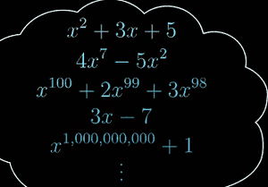
    - 首先我们要做的是给这个空间赋予坐标的含义，这需要选取一个基
        - 因为多项式已经是 数乘xⁿ 再做加和 的形式，所以我们很自然地就取x的不同次幂作为基函数
        - Basis functions
            - b₀(x) = 1
            - b₁(x) = x
            - b₂(x) = x²
            - b₃(x) = x³
            - ...
        - 基函数在这里起的作用，和 î,ĵ,k̂ 在向量世界中起到的作用类似。
        - 因为多项式的次数可以任意高，所以这个基函数集也是无穷大
            - 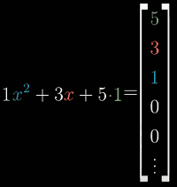
        - 在这个坐标系中，求导是用一个无限阶矩阵描述的
            - 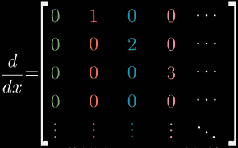
        - 其中绝大部分是零，不过次对角线上按序排列着正整数
        - 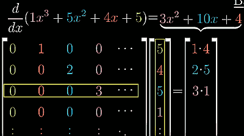
    - 求导满足线性性质使这一过程成为可能
        - 求导矩阵的构建，实际就是 求每一个 基函数的导数，然后把结果放在对应列
- 数学中有很多类似向量的事物，只要你处理的对象具有合理的数乘和相加的概念，线性代数中所有关于向量，线性变换，和其他的概念都应该使用与它。


        

          


    
 


     
  


