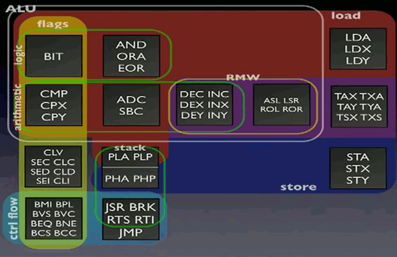
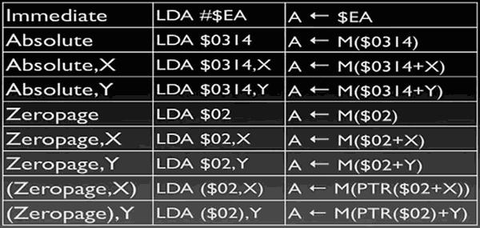

...menustart


...menuend


- stack register S
    - even it is designed as 16bit, but the upper 8bits are fixed to 0x01
 - Address Space  0x0000-0xFFFF
    - Zero page   0x0000-0x00FF
    - Stack       0x0100-0x01FF
 - Instructions
    - 
    - RMW : read-modify-write
 - Addressing Mode
    - 
    - there's a wrap around insise zero page
        - `LAD $F0,X`  , if x in this case is 16 or above , it would wrap around to zeor page.
    - the last two are special for zero page : indirect addressing 
        - we don't even have a 16-bit register at all, so what if you want to use a pointer ?
        - `(Zero page addr, X)`
            - the pointer is stored in addr+X+1:addr+X
        - `(Zero page addr), Y`
            - `LDA ($70), Y` 
            - 
            ```
            t1 = readmem( 0x70 )
            t2 = readmem( 0x70+1 )
            addr = t1 | (t2<<8)
            A = readmem( addr + Y )
            ```


