...menustart

 - [AI , CS 188](#aea7deb258843dff16f9b84b46ec1461)
 - [Introduction](#0b79795d3efc95b9976c7c5b933afce2)
     - [What is AI](#9fa835a40078a81e452b0cbb4362a6f5)
     - [Designing Rational Agents](#04052b6bc5dad6a9f6a00dfb9cd988da)
     - [Reflex Agents](#9ef57e59fc5834eb1f86775a80163590)
     - [Planning Agents](#b35ab1adff6f2f91e25f048a1f1ecfcc)
     - [Course Topics \*](#75947eb557ad99ec6bd6f19e5842e7c0)
 - [Uninformed Search](#faccc055dce5dfee94eba9a23ec379bc)
     - [Search Problems](#fc72ba154e470ee2e177ed8e75ee4de2)
     - [Search Problems Are Models](#0a9e0b58d3ed416bdb73713846200baa)
         - [Example: Traveling in Romania](#30f0fbd7fae0ee74806b20a52d15e3ee)
     - [What’s in a State Space ?](#e753d55f3a61b93cba852a33216321e0)
     - [State Space Sizes ?](#05eb0fb2a7cf700d9734545149fc43fb)
     - [Quiz: Safe Passage](#10f2374e81dfff89cef5eecf517b70ef)
     - [State Space Graphs and Search Trees](#12227407175834cc50274fb425cf4e2d)
         - [State Space Graphs](#91fa96e85b0a665a30ab89661d0137c4)
         - [Search Trees](#fa3d63f947f57a28158a9af70e100ef3)
         - [State Space Graphs vs. Search Trees](#3371ddd82f34162d684dfd1d1f40d8b3)
         - [Quiz: State Space Graphs vs. Search Trees](#76acaf4079e010db2a41f612ceae95f4)
         - [Searching with a Search Tree](#643025d557c3b9f6d43cdd62b77f5530)
         - [General Tree Search](#a23c40de844ed1e2415dc477845012af)
         - [Depth-First Search](#d292eaede65eb34e66db0db9ebb6b9bc)
             - [Search Algorithm Properties](#6dda6174af1ce92b505f3c29643504c3)
             - [Depth-First Search (DFS) Properties](#62a9189e6707b0db89f80a7a5bb6c15e)
         - [Breadth-First Search](#ae5c4b868b5b24149decba70c74165c2)
             - [Breadth-First Search (BFS) Properties](#0d9bfd747ee897d1720abf029faddae4)
             - [Iterative Deepening](#fcbd892c255445e0e3c99ceeb0dbc2e9)
         - [Cost-Sensitive Search](#ea10a2ff2bc1cbc4cb292e4f88cad9e9)
             - [Uniform Cost Search](#1bd1e9029adb17c5893239e7288210a9)
             - [Uniform Cost Search (UCS) Properties](#8fcce2120d7405462b72fce3bf1fcaaa)
             - [Uniform Cost Issue](#be3a9de1eb8b7a58870eafd5232dc9ce)
         - [The One Queue](#6fa04493ae42918af4621de6aae2ccc2)
         - [DFS vs BFS vs UCS](#46ea5fe25e20e5c9f2466692baeb1848)
     - [Search and Models](#7f1afff8243e3009eb892111dcc4413f)
     - [Graph Search VS Tree Search](#f2ef45f33145362c2a215128cc677ccc)
     - [Uniform cost search vs. Dijkstra's Algorithm](#e609c39a6581f06c0e176c5be71abfa3)
     - [Some Hints for P1](#b04314d7dafd45796af0bf245e3ae8e8)
 - [Informed Search](#29990be19ae238ca1071a838229e85f3)
     - [Search Heuristics](#fdb1b92add98d8aa548a1d33445c6a67)
         - [Example](#0a52730597fb4ffa01fc117d9e71e3a9)
     - [Greedy Search](#6f166f2a80c5f26b9e59a2ed903c09c7)
     - [A* search](#4eb045a9450d6e7de8a9b8cb2e420c89)
         - [Combining UCS and Greedy](#07e5a0c69feece254a168e7da5932151)
         - [When should A* terminate?](#9fa7d37bafbf919eec2833224d5de03c)
         - [Is A\* Optimal?](#ea311a4ecb13c55b4cd70a212419aeb9)
         - [Admissible Heuristics](#bf8f38651446764fc008980354ad6746)
         - [Optimality of A* Tree Search](#3073e988edee383f5983f6a7fc2212a2)
         - [Properties of A*](#26e3cfa1ee4375a33dca3b380348e972)
     - [Comparison](#f6c0e3a1c3cfabd32ae8d3ae741fcf0a)
     - [Creating Heuristics](#042138393e72af1a16d8c31facd84ab1)
         - [Example: 8 Puzzle](#f8097ec9827afc9065c89741a344d53f)
     - [Semi-Lattice of Heuristics  半启发式](#7e9aa2fe208a956ac44d1ee31a5035d9)
         - [Trivial Heuristics, Dominance](#30887de01fbff37aef091345781445d5)
     - [Graph Search](#00ba899c02fa6651c15e5e948a7a4aac)
         - [Tree Search: Extra Work!](#cf1432b4daa7e1fe63cecb1365185f0b)
         - [Graph Search](#00ba899c02fa6651c15e5e948a7a4aac)
         - [A* Graph Search Gone Wrong?](#9afaf22785328c0bf6267acf13add5da)
         - [Consistency of Heuristics](#cb964f845fc822953ddb83ca6d124e6b)
         - [Optimality of A* Graph Search](#ea9a7016fa68c3fd6434c9c0fb4afa3d)
         - [Optimality](#c1e81f3c2f720c3a2e3a765ba6a11d59)
     - [A*: Summary](#e418daaa73025a84fd16637fbf3b2d0d)
         - [Graph Search Pseudo-Code](#1388b32869f8288febeb18f8ec802b42)
         - [Optimality of A\* Graph Search](#53d3b2a00e84590355f57034c84cc1a0)
     - [demo code in python](#c9f86c35957917fe5e25e926f8923c75)
         - [ python graph search](#41ac4b4e9e2441a0a74f1372fbca3c52)
         - [other implementation](#65e0ab6e34746c2231d34656e5134d92)

...menuend


<h2 id="aea7deb258843dff16f9b84b46ec1461"></h2>


# AI , CS 188

http://inst.eecs.berkeley.edu/~cs188/pacman/home.html

edx , 登陆后作业

https://edge.edx.org

https://edge.edx.org/courses/BerkeleyX/CS188x-8/Artificial_Intelligence/courseware/c78976d210314651abb740912d8279bb/0460a6606a3e4630b0b4e913dd88c135/

----

2018 fa

http://inst.cs.berkeley.edu/~cs188/fa18/

video:

https://www.youtube.com/watch?v=16Dir4QqCUg&list=PLsOUugYMBBJENfZ3XAToMsg44W7LeUVhF


<h2 id="0b79795d3efc95b9976c7c5b933afce2"></h2>


# Introduction

<h2 id="9fa835a40078a81e452b0cbb4362a6f5"></h2>


## What is AI

The science of making machines that: Rational Decisions

- We’ll use the term **rational** in a very specific, technical way:
    - Rational: maximally achieving pre-defined goals
    - Rationality only concerns what decisions are made  (not the thought process behind them)
- Goals are expressed in terms of the **utility** of outcomes
- Being rational means **maximizing your expected utility**

A better title for this course would be:

- **Computational Rationality**


<h2 id="04052b6bc5dad6a9f6a00dfb9cd988da"></h2>


## Designing Rational Agents

- An **agent** is an entity that *perceives* and *acts*.
- A **rational agent** selects actions that maximize its (expected) utility.  
- Characteristics of the **percepts**, **environment**, and **action space** dictate techniques for selecting rational actions
- **This course** is about:
    - General AI techniques for a variety of problem types
    - Learning to recognize when and how a new problem can be solved with an existing technique

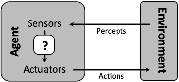

<h2 id="9ef57e59fc5834eb1f86775a80163590"></h2>


## Reflex Agents

- Reflex agents
    - Choose action based on current percept (and maybe memory)
    - May have memory or a model of the world’s current state
    - Do not consider the future consequences of their actions
    - **Consider how the world IS**
- Can a reflex agent be rational?
    - No
- Example
    - blinking your eye (not using your entire thinking capabilities)
    - vacuum cleaner moving towards nearest dirt

<h2 id="b35ab1adff6f2f91e25f048a1f1ecfcc"></h2>


## Planning Agents
 
- Planning agents
    - Ask “what if”
    - Decisions based on (hypothesized) consequences of actions
    - Must have a model of how the world evolves in response to actions
    - Must formulate a goal (test)
    - **Consider how the world WOULD BE**
- **Optimal vs. complete planning**
- **Planning vs. replanning**

<h2 id="75947eb557ad99ec6bd6f19e5842e7c0"></h2>


## Course Topics \*

- Part I: Intelligence from Computation
    - Fast search / planning
    - Constraint satisfaction
    - Adversarial and uncertain search
- Part II: Intelligence from Data
    - Bayes' nets
    - Decision theory
    - Machine learning
- Throughout: Application
    - Natural language, vision, robotics, games, ...


--------

<h2 id="faccc055dce5dfee94eba9a23ec379bc"></h2>


# Uninformed Search

- Agents that Plan Ahead
- Search Problems
- Uninformed Search Methods
    - Depth-First Search
    - Breadth-First Search
    - Uniform-Cost Search

Uninformed means that when we are exploring search tree we have no idea if we're getting closer to the goal or not. 

- i.e 在一个位置的maze中找到出口  
    - 如果已经知道 出口的位置，找一条最短的路径的话， 这种情况是可以使用预测值的，就可以使用 informed search 来处理


<h2 id="fc72ba154e470ee2e177ed8e75ee4de2"></h2>


## Search Problems

- A **search problem** consists of:
    - A state space
        - 
    - A successor function (with actions, costs)
        - 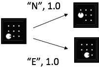
    - A start state and a goal test
- A **solution** is a sequence of actions (a plan) which transforms the start state to a goal state


<h2 id="0a9e0b58d3ed416bdb73713846200baa"></h2>


## Search Problems Are Models

<h2 id="30f0fbd7fae0ee74806b20a52d15e3ee"></h2>


### Example: Traveling in Romania

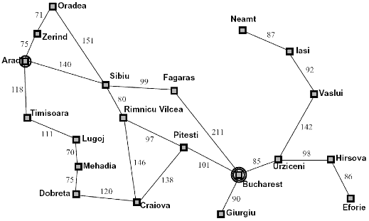

- State space
    - Cities
- Successor Fuction:
    - Roads: Go to adjacent city with cost = distance
- Start State:
    - Arad
- Goal Test
    - Is state == Bucharest ?
- Solution ?


<h2 id="e753d55f3a61b93cba852a33216321e0"></h2>


## What’s in a State Space ?

- The **world state** includes every last detail of the environment
    - 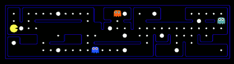 
- A **search state** keeps only the details needed for planning (abstraction)


Search State Problem | Pathing  | Eat-All-Dots
--- | --- | ---
States | (x,y) location |  {(x,y), dot booleans}
Actions | NSEW | NSEW
Successor | update location only | update location and possibly a dot boolean
Goal test | is (x,y) == END | dots all flase


<h2 id="05eb0fb2a7cf700d9734545149fc43fb"></h2>


## State Space Sizes ?

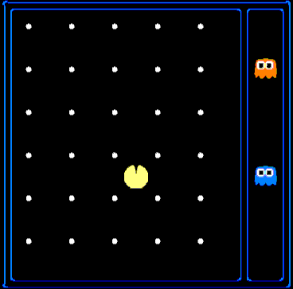

- World state
    - Agent Positions: 120  
        - 10x12
    - Food Count : 30
    - Ghost positions: 12 
        - 1x6
    - Agent facing: NSEW

- How many
    - World states ?
        - 120 x 2³⁰ x 12² x 4
        - because food's position is fixed, we only care about its state
    - State for pathing ?
        - 120
    - State for eat-all-dots ?
        - 120 x 2³⁰


<h2 id="10f2374e81dfff89cef5eecf517b70ef"></h2>


## Quiz: Safe Passage

- Problem: eat all dots while keeping the ghosts permanent-scared
    - ghosts don't respawn alive
- What does the state space have to specify?
    - (agent position, dot booleans, power pellet booleans, remaining scared time)
    - you don't care about ghost position here because you're supposed to be always keeping the ghost scared

<h2 id="12227407175834cc50274fb425cf4e2d"></h2>


## State Space Graphs and Search Trees

<h2 id="91fa96e85b0a665a30ab89661d0137c4"></h2>


### State Space Graphs

- State space graph: A mathematical representation of a search problem
    - Nodes are (abstracted) world configurations
    - Arcs represent successors (action results)
    - The goal test is a set of goal nodes (maybe only one)
- In a state space graph, each state occurs only once!
- We can rarely build this full graph in memory (it’s too big), but it’s a useful idea

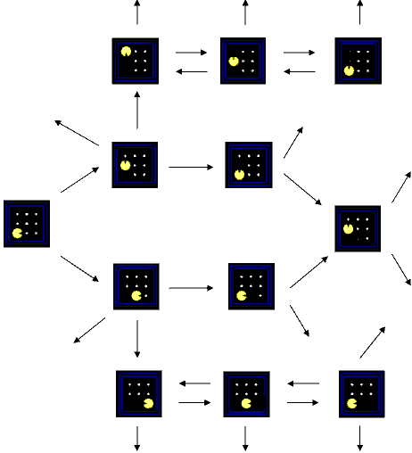

- In a search graph, each state also occurs only once!
    - This is a really small state space graph search problem, we'll use it as our running example. But keep in mind this is just to illustrative purposes. In practice, you would **never** first draw a state space graph and then solve it.

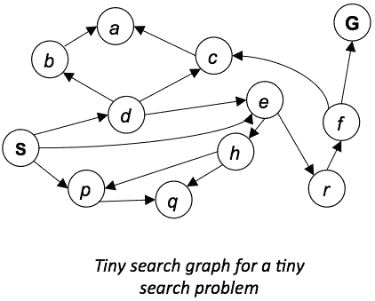

<h2 id="fa3d63f947f57a28158a9af70e100ef3"></h2>


### Search Trees

What we're actually going to build up when an algorithm runs is called a search tree. 

- A search tree:
    - A “what if” tree of plans and their outcomes
    - The start state is the root node
    - Children correspond to successors
    - Nodes show states, but correspond to PLANS that achieve those states
    - **For most problems, we can never actually build the whole tree**
        - In fact the search tree will typically be much large even than the state space graph because there might be multiple ways to get to the same state. And in that case, the search tree will have multiple occurrences of that same state.
        - but it is the underlying abstraction we're going to work with.

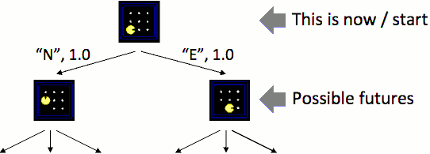


<h2 id="3371ddd82f34162d684dfd1d1f40d8b3"></h2>


### State Space Graphs vs. Search Trees

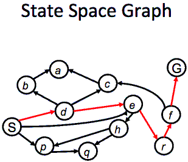  .VS.  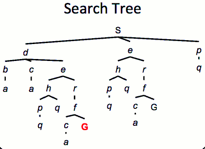

- Each NODE in in the search tree is an entire PATH in the state space graph.
    - TODO  what does `PATH` here exactly means?  算法运行的search tree并不是真实存在的, 所以需要在search tree node里保留search path?
- We construct both on demand – and we construct as little as possible.


<h2 id="76acaf4079e010db2a41f612ceae95f4"></h2>


### Quiz: State Space Graphs vs. Search Trees

Consider this 4-state graph: 

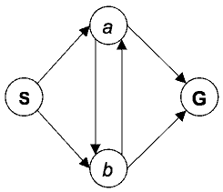

How big is its search tree (from S)?

- **∞ !**
- **Important: Lots of repeated structure in the search tree!**


<h2 id="643025d557c3b9f6d43cdd62b77f5530"></h2>


### Searching with a Search Tree

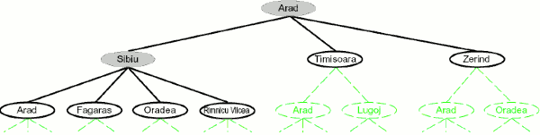

- Search
    - Expand out potential plans (tree nodes)
    - Maintain a ***fringe*** of partial plans under consideration 
        - *fringe* is the leaves of your drawing search tree
        - here, *fringe* is the nodes with white background and black font, Arad is in *fringe* 
    - Try to expand as few tree nodes as possible


<h2 id="a23c40de844ed1e2415dc477845012af"></h2>


### General Tree Search

```
function TREE-SEARCH(problem,strategy) return a solution, or failure
    initialize the fringe using the initial state of problem
    loop do
        if there are no candidates for expansion(fringe is empty) then 
            return failure
        end

        popup a node from fringe for expansion according to strategy

        if the node contain a goal state then
            return the corresponding solution
        else
            expand the node and add the resulting node to the search tree
        end
    end
end function
```

- Important ideas:
    - Fringe
        - a set of leaf nodes that are waiting to be expanded
    - Expansion
        - pick one out of the fringe and expand it.
    - Exploration strategy
        - which one of the elements in the fringe are you going to pick first to expand ?
- Main question: which fringe nodes to explore?
- PS. Tree Search does **NOT** maintain a *closed* or *visited* list


<h2 id="d292eaede65eb34e66db0db9ebb6b9bc"></h2>


### Depth-First Search

- Strategy: 
    - expand a deepest node first
- Implementation: 
    - Fringe is a LIFO stack

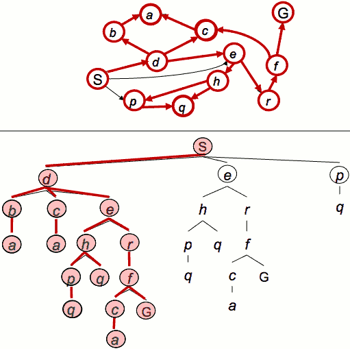

> leftmost DFS

<h2 id="6dda6174af1ce92b505f3c29643504c3"></h2>


#### Search Algorithm Properties

- **Complete**: Guaranteed to find a solution if one exists?
- **Optimal**: Guaranteed to find the least cost path?
- Time complexity?
- Space complexity?

- **Cartoon of search tree**:
    - 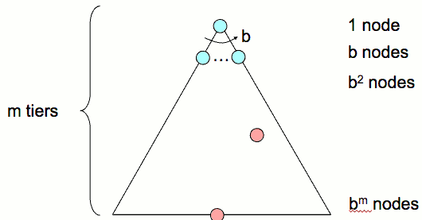
    - b is the branching factor
    - m is the maximum depth
    - solutions at various depths
- **Number of nodes** in entire tree?
    - 1 + b + b² + ... + bᵐ = O(bᵐ)


<h2 id="62a9189e6707b0db89f80a7a5bb6c15e"></h2>


#### Depth-First Search (DFS) Properties

- What nodes DFS expand?
    - 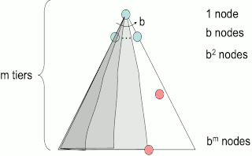
    - Some left prefix of the tree.
    - **Could process the whole tree!**
    - If m is finite, takes time **O(bᵐ)** 
- How much space does the fringe take?
    - Only has siblings on path to root, so **O(b·m)**
- Is it complete?
    - Yes. but under some assumptions that have a cycle check to avoid recursion
    - m could be infinite, so only if we prevent cycles 
- Is it optimal?
    - No, it finds the “leftmost” solution, regardless of depth or cost


<h2 id="ae5c4b868b5b24149decba70c74165c2"></h2>


### Breadth-First Search

- Strategy: 
    - expand a shallowest node first
- Implementation: 
    - Fringe is a FIFO queue

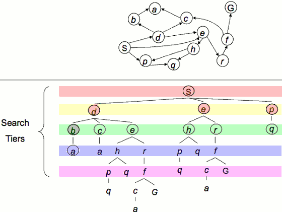


<h2 id="0d9bfd747ee897d1720abf029faddae4"></h2>


#### Breadth-First Search (BFS) Properties

- What nodes does BFS expand?
    - 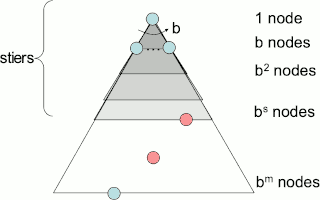
    - Processes all nodes above shallowest solution
        - go through the search tree layer by layer by layer...
    - Let depth of shallowest solution be *s*
    - Search takes time **O(bˢ)** 
- How much space does the fringe take?
    - Has roughly the last tier, so **O(bˢ)**
- Is it complete?
    - Yes. *s* must be finite if a solution exists.
- Is it optimal?
    - Only if costs are all 1 (more on costs later)


<h2 id="fcbd892c255445e0e3c99ceeb0dbc2e9"></h2>


#### Iterative Deepening

- Idea: get DFS’s space advantage with BFS’s time / shallow-solution advantages
    - Run a DFS with depth limit 1.  If no solution…
    - Run a DFS with depth limit 2.  If no solution…
    - Run a DFS with depth limit 3.  …
    - That is, you always run DFS, because that is the memory efficient one. But you cap the depth to which you're willing to search. So your first run, when you hit depth one, you stop. Your successor function is modified to say there's nothing beyond depth one. If you don't find a solution that way, then you made the cap 2. 
- Isn’t that wastefully redundant?
    - Yes there is some waste happening. 
    - Generally most work happens in the lowest level searched, so not so bad!
        - In fact, the last layer tends to be as big as all previous layers combined. And so the redundant work you do is not that much. 
    - That cartoon s kind of misleading. It looks like something that just grows linearly with depth. But in practice it grows exponentially.


Now let's switch gears to a different kink of problem formulation. What if we care about cost ?

<h2 id="ea10a2ff2bc1cbc4cb292e4f88cad9e9"></h2>


### Cost-Sensitive Search

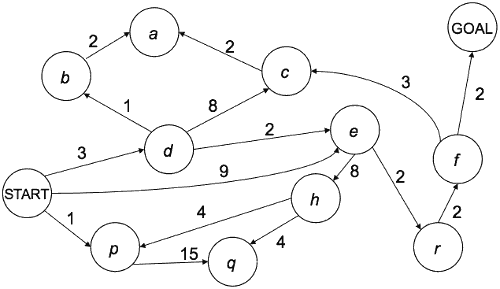

- BFS finds the shortest path in terms of **number of actions**
- It does not find the least-cost path.  
- We will now cover a similar algorithm which does find the least-cost path.


<h2 id="1bd1e9029adb17c5893239e7288210a9"></h2>


#### Uniform Cost Search

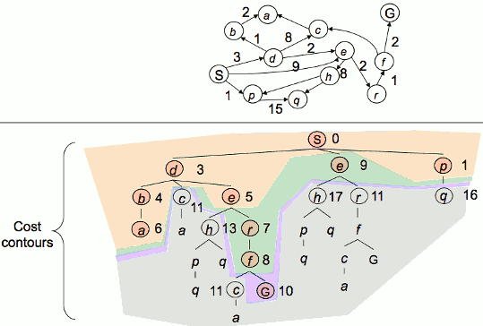

- Strategy: 
    - expand a cheapest node first:
- Fringe is a priority queue (priority: cumulative cost so far)
- **Caution**: in this example, when we expanding S->d->e->r->f ， we see the Goal sit on the fringe, the next one to pick out is **NOT** f->G **BUT** S->e. We always pick the lowest cost one. 
    - Even though the goal is there, we still pick the one with lowest cost, 9. You might say, why don't we call it quits? We see the goal we call it done we found the path. No. Because you don't know, maybe from that one with 9, there is one with cost only 0.5 that leads to the goal, and if we already declared success here(buttom *G*) with goal, we would not found that one.

<h2 id="8fcce2120d7405462b72fce3bf1fcaaa"></h2>


#### Uniform Cost Search (UCS) Properties

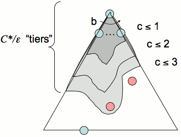

- What nodes does UCS expand?
    - Processes all nodes with cost less than cheapest solution!
    - If that solution costs C* and arcs cost at least ε , then the "effective depth" is roughly C\*/ε
    - Takes time **O(b<sup>C\*/ε</sup>)** (exponential in effective depth)
- How much space does the fringe take?
    - Has roughly the last tier, so **O(b<sup>C\*/ε</sup>)**
- Is it complete?
    - Yes. Assuming best solution has a finite cost and minimum arc cost is positive.
- Is it optimal?
    - Yes!  (Proof next lecture via A\* )


<h2 id="be3a9de1eb8b7a58870eafd5232dc9ce"></h2>


#### Uniform Cost Issue

- Remember: UCS explores increasing cost contours
- The good: UCS is complete and optimal!
- The bad:
    - Explores options in every "direction"
    - No information about goal location

<h2 id="6fa04493ae42918af4621de6aae2ccc2"></h2>


### The One Queue

- All these search algorithms are the same except for fringe strategies
    - Conceptually, all fringes are priority queues (i.e. collections of nodes with attached priorities)
    - Practically, for DFS and BFS, you can avoid the log(n) overhead from an actual priority queue, by using stacks and queues
    - Can even code one implementation that takes a variable queuing object


<h2 id="46ea5fe25e20e5c9f2466692baeb1848"></h2>


### DFS vs BFS vs UCS

 \ | DFS | BFS | UCS 
--- | --- | --- | --- 
Strategy | leftmost | shallowest | cheapest
Implementation | LIFO stack | FIFO queue | 
Completeness | Yes, only if no cycle  |  Yes | Yes, if best solution is finite , and cost is positive
optimal | No | Yes , only if cost are same | Yes
Time | O(bᵐ) |  O(bˢ)  |  O(b<sup>C\*/ε</sup>)
Space |  O(b·m) |  O(bˢ) | O(b<sup>C\*/ε</sup>)


---

<h2 id="7f1afff8243e3009eb892111dcc4413f"></h2>


## Search and Models

- Search operates over models of the world
    - Keep in mind, whenever you are doing search for real world problems, building the right models is really critical to get result.
    - The agent doesn’t actually try all the plans out in the real world!
    - Planning is all “in simulation”
    - Your search is only as good as your models


<h2 id="f2ef45f33145362c2a215128cc677ccc"></h2>


## Graph Search VS Tree Search

- The Problem Is Always a Graph
    - The distinction between tree search and graph search is not rooted in the fact whether your problem is a tree or a graph. It is always assumed you're dealing with a **graph**.
    - The distinction lies in the **traversal pattern** that is used to search through the graph, which can be graph-shaped or tree-shaped.
    - If you're dealing with a tree-shaped problem, both algorithm variants lead to equivalent results.
- Difference Between Graph and Tree Search
    - Your basic graph search algorithm looks something like the following.  Note that the following pseudo code is not correct in every aspect

- Tree Search
    - 
    ```
    open <- []
    next <- start

    while next is not goal {
        add successors of next to open
        next <- select from open
        remove next from open
    }
    return next
    ```
    - The algorithm stated above is actually called **tree search**
        - It will visit a state of the underlying problem graph multiple times, if there are multiple directed paths to it rooting in the start state
        - It is even possible to visit a state an infinite number of times if it lies on a directed loop. 
        - But each visit corresponds to a `different node` in search tree.
        - This apparent inefficiency is sometimes wanted, as explained later.


- Graph Search
    - tree search can visit a state multiple times. And as such it will explore the "sub tree" found after this state several times, which can be expensive.
    - Graph search fixes this by keeping track of all visited states in a **closed list**
        - If a newly found successor to next is already known, it won't be inserted into the open list
    - 
    ```
    open <- []
    closed <- []
    next <- start

    while next is not goal {
        add next to closed
        add successors of next not in closed to open
        remove next from open
        next <- select from open
    }
    return next
    ```

- Comparison
    - graph search requires more memory, as it keeps track of all visited states. This may compensated by the **smaller open list**, which results in improved search efficiency.
- Optimal solutions
    - Some methods of implementing *select* can guarantee to return optimal solutions - i.e. a shortest path or a path with minimal cost 
    - A common algorithm that implements this kind of select is uniform cost search, or if step costs are identical, BFS or IDDFS. 
    - IDDFS avoids BFS's aggressive memory consumption and is generally recommended for uninformed search (aka brute force) when step size is constant.
    - `A*`
        - Also the (very popular) A* tree search algorithm delivers an optimal solution when used with an *admissible heuristic*.
        - The A\* graph search algorithm, however, only makes this guarantee when it used with a *consistent (or "monotonic") heuristic* (a stronger condition than admissibility).
- More ....
    - In **Graph Search** you hold a list of explored nodes, while in **Tree Search** you don't!
    - when you have **undirected cycled** graph,these two searches produce different outputs because in Graph Search you know which node has been explored(visited) and then you don't expand it, but in Tree Search you don't know and you expand it again.
    - but this doesn't mean Tree Search is dumb because it doesn't hold such list. sometimes for example in games you have repeated states and you have to explore them again.

---

<h2 id="e609c39a6581f06c0e176c5be71abfa3"></h2>


## Uniform cost search vs. Dijkstra's Algorithm 

- Dijkstra's algorithm, which is perhaps better-known, can be regarded as a variant of uniform-cost search,
     - where there is no goal state and processing continues until all nodes have been removed from the priority queue,
     - i.e. until shortest paths to all nodes (not just a goal node) have been determined.
- Dijkstra's algorithm searches for shortest paths from root to every other node in a graph, whereas uniform-cost searches for shortest paths in terms of cost to a goal node.


<h2 id="b04314d7dafd45796af0bf245e3ae8e8"></h2>


## Some Hints for P1

- Graph search is almost always better than tree search (when not?)
- Implement your closed list as a dict or set!
- Nodes are conceptually paths, but better to represent with a state, cost, last action, and reference to the parent node

---

<h2 id="29990be19ae238ca1071a838229e85f3"></h2>


# Informed Search 

- Heuristics
- Greedy Search
- A* Search

Those 3 informed search do a lot of duplicate work and **graph search** will be our solution to that to avoid that duplicate work.


<h2 id="fdb1b92add98d8aa548a1d33445c6a67"></h2>


## Search Heuristics

The way we're going to make UCS more efficient is by infusing information about where the goal is.  This is called heuristics.

- A heuristic is:
    - A function that estimates how close a state is to a goal
    - Designed for a particular search problem
    - Examples: Manhattan distance, Euclidean distance for pathing

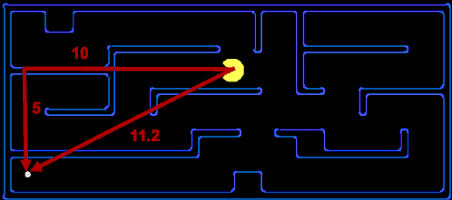

<h2 id="0a52730597fb4ffa01fc117d9e71e3a9"></h2>


### Example

For romania traveling problem:  constructor a cost table h(x) with straight-line distance to Bucharest.

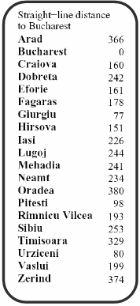

For pancake problem:

h(x) = the number of the largest pancake that is still out of place

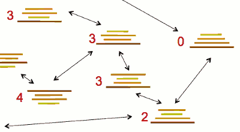

In this case, we might prefer number of the largest pancake that is still out of place over number of pancakes still out of place. 

For exmaple, the top state, which has 2 pancake still out of place, the number of largest pancake out of place is 3.  3 is better than 2 beause we can use a flip action with cost 3 to achieve the goal.

---

<h2 id="6f166f2a80c5f26b9e59a2ed903c09c7"></h2>


## Greedy Search

- Strategy: expand a node that you think is closest to a goal state
    - Heuristic: estimate of distance to nearest goal for each state
    - 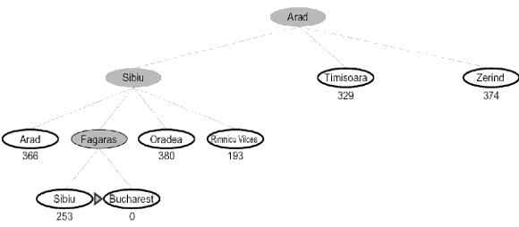
- A common case:
    - Best-first takes you straight to the (**wrong**) goal
    - Greedy Search ignores action cost.
- Worst-case: 
    - like a badly-guided DFS


---

<h2 id="4eb045a9450d6e7de8a9b8cb2e420c89"></h2>


## A* search

<h2 id="07e5a0c69feece254a168e7da5932151"></h2>


### Combining UCS and Greedy

- Uniform-cost orders by path cost, or backward cost  g(n) 
    - g is cumulate actual cost so far
- Greedy orders by goal proximity, or forward cost  h(n)
    - h is heuristic distance value to goal
- A\* Search orders by the sum: f(n) = g(n) + h(n)
    - for node X  : f = g(X) + h(X) 

- Example
    - state graph: 
        - 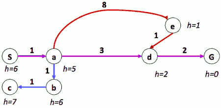
    - search tree:
        - 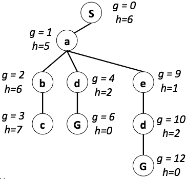

- UCS
    - S -> a -> {b,d,e}
    - S -> a -> b -> c -> {d,e}
    - S -> a -> b -> c -> d -> G , {e}
- Greedy
    - S -> a -> {b,d,e}
    - S -> a -> e -> d -> G , {b,d}
- A\*
    - S -> a -> {b,d,e}
    - S -> a -> d -> G , {b,e}


<h2 id="9fa7d37bafbf919eec2833224d5de03c"></h2>


### When should A* terminate?

- Should we stop when we enqueue a goal?
- **No: only stop when we dequeue a goal**

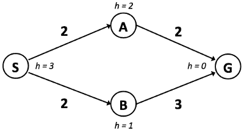

```
    S : f = h + g = 3 + 0 = 3
=>  S-A : f = h + g = 2 + 2 = 4
    S-B : f = 2 + 1 = 3
=>  S-A : f = h + g = 2 + 2 = 4
    S-B-G : f= 2 + 3 = 5
```

At this point , we put something onto the fringe that reaches the goal . If we declare success now because we found a path to the goal we did not find the optimal path to goal. The claim success right now is too soon and you know from the tree-search pseudocode it is too soon. 

We need to wait. Be patient. We need to wait till we pull it from the fringe. 

What would pull from the frige next ? This 1 over here , `S-A : f = 4` . So we pull this one from the fringe , we get `S-A-G = 4` on our fringe. 

Now we pulled this one from the fringe , we pull something from the fringe that achieves the goal at this point we want to declare success and we did indeed find the optimal path to the goal. 

<h2 id="ea311a4ecb13c55b4cd70a212419aeb9"></h2>


### Is A\* Optimal?

In general, it's not guaranteed to be optimal. Some extra conditions have to be met before that guarantee is satisfied.

So we will have that guarantee with extra conditions.

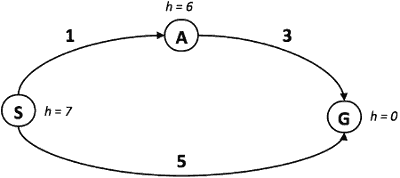

```
    S : f=0+7
=>  S-A : f=1+6
    S-G : f=5+0
```

We pull `S-G` from fringe , but it is not optimal !

- What went wrong?
    - The heuristic is too pessimistic. *h* value 6 here is too high. 
    - 6 is much higher than 3. In fact anytime it's higher than the real cost you can have this problem.
- NOT good: Actual bad goal cost < estimated good goal cost (h)
- We need estimates to be less than actual costs!


<h2 id="bf8f38651446764fc008980354ad6746"></h2>


### Admissible Heuristics

- Inadmissible (pessimistic) heuristics break optimality by trapping good plans on the fringe
    - good plan won't be expanded because the heuristic is holding it back
- Admissible (optimistic) heuristics slow down bad plans but never outweigh true costs

- A heuristic *h* is **admissible** (optimistic) if:
    - 0 <= h(n) <= h\*(n)
    - where h\*(n) is the true cost to a nearest goal
- Coming up with admissible heuristics is most of what’s involved in using A\* in practice


<h2 id="3073e988edee383f5983f6a7fc2212a2"></h2>


### Optimality of A* Tree Search

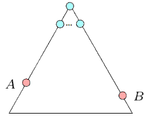

- Assume:
    - A is an optimal goal node
    - B is a suboptimal goal node
    - h is admissible
- Claim:
    - A will exit the fringe before B


**Proof:**

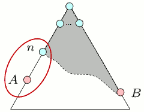

- Imagine B is on the fringe
- Some ancestor n of A is on the fringe, too (maybe A !)
- Claim: n will be expanded before B
    1. f(n) ≤ f(A)
        - f(n) = g(n) + h(n)    // definition
        - f(n) ≤ g(A)      // Admissibility of h 
        - g(A) = f(A)      // h = 0 at goal
    2. f(A) ≤ f(B)
        - g(A) < g(B)  //  B is suboptimal >
        - f(A) < f(B)  //  h = 0 at goal >
        - PS. why are we not done yet?
            - The reason we are not done yet, because we need to show that the process of how we pop things from fringe will also get a before b.
            - what this is showing here is that you go in order of f() cost. You keep expanding in order of f() cost. 
            - The reason at this point we say this is not enough is that A might be not on fringe when B is on the fringe. So we need say, when a is not on the fringe, we know an ancestor of a has to be on the fringe.
            - and then we say, well, are we guaranteed that that ancestor will be expanded before b. 
    3. n expands before B
        - f(n) ≤ f(A) ≤ f(B)
- All ancestors of A expand before B
- A expands before B
- A\* search is optimal


<h2 id="26e3cfa1ee4375a33dca3b380348e972"></h2>


### Properties of A*

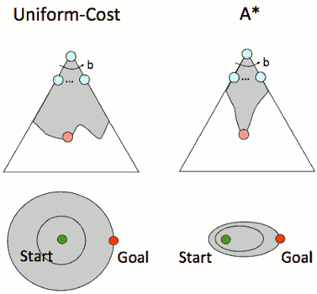


<h2 id="f6c0e3a1c3cfabd32ae8d3ae741fcf0a"></h2>


## Comparison

DFS:

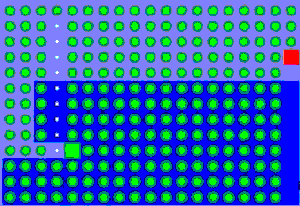

BFS:

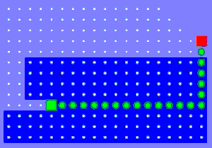

UCS:

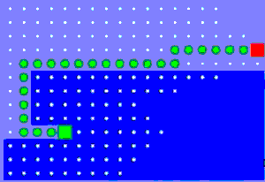

Greedy:


A\* :

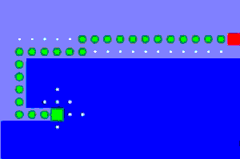


---

<h2 id="042138393e72af1a16d8c31facd84ab1"></h2>


## Creating Heuristics

Creating Admissible Heuristics

- Most of the work in solving hard search problems optimally is in coming up with admissible heuristics
- Often, admissible heuristics are solutions to *relaxed problems*, where new actions are available
- Inadmissible heuristics are often useful too
    - In the case you lose you optimality guarantee , but your A star starts to look a little more like greedy , mean that you might not find out the path to goal but you might sometimes just want to find a path to goal more quickly. 


<h2 id="f8097ec9827afc9065c89741a344d53f"></h2>


### Example: 8 Puzzle

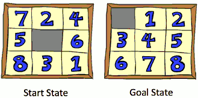

- What are the states?
- How many states?  9!
- What are the actions? 
    - you can move a tile onto the empty spot, or anther way to say you can move the empty spot around
- How many successors from the start state?
    - 4
- What should the costs be?
    - cost 1 per action take

---

- Heuristic: Number of tiles misplaced
- Why is it admissible?
    - every tile in the wrong place will need undergo an action. and likely more actions will be needed. so it's underestimate of the cost you will incur to achieve the goal state.
- h(start) = 8
- This is a *relaxed-problem* heuristic (relax: less constrained)
    - Another way to think of this heuristic is that it's a relaxed problem heuristic.
    - What do I mean with that?  One way to ensure that your heuristic is admissible  is to introduce new actions. You take your original problem, you add new actions, and in this new hypothetical problem space you find the optimal solution.  And because this is the optimal solution, in the new space we have more actions available to you, the optimal solution there will be cheaper or same as the optimal solution in the original scenario.
- How we can relax this ?
    - if you have an action available to just grab a tile and place onto the destination.

---

- What if we had an easier 8-puzzle where any tile could slide any direction at any time, ignoring other tiles?
    - How does that correspond to a relaxed problem ? 
    - It's as if you can slide the tiles without them constraining each other. So it's a relaxed problem, less constrained.
    - For Pacman, a relaxed would be something like ignoring the walls. Here it ignores the other tiles.
- Total Manhattan distance
- Why is it admissible?
    - It is admissible because it's a relaxed problem solution. 
    - Another way to think of it is every tile has to undergo at least that many steps before you can achieve the goal. 
- h(start) = 3 + 1 + 2 + … = 18


Average nodes expanded when the optimal path has…

 \ | 4 steps | 8 steps | 12 steps
--- | --- | --- | --- 
 UCS | 112  | 6300 | 3.6 * 10⁶
 TILES | 13 | 39 | 227 
 MANHATTAN | 12 | 25 | 73

---

- How about using the actual cost as a heuristic?
    - Whould it be admissible ?
        - Yes
    - Would we save on nodes expanded ?
        - Yes, a lot
    - What's wroing with it ?
        - We don't know it. If you know it, you're done ,you've already solved the problem.


- With A\* : a trade-off between quality of estimate and work per node
    - As heuristics get closer to the true cost, you will expand fewer nodes. But usually do more work per node to compute the **heuristic itself**


<h2 id="7e9aa2fe208a956ac44d1ee31a5035d9"></h2>


## Semi-Lattice of Heuristics  半启发式

So earlier we were talking about is one heuristic better than the other one and so forth. For example, for pancake flipping. Well, you can define this as follows. 

<h2 id="30887de01fbff37aef091345781445d5"></h2>


### Trivial Heuristics, Dominance


- Dominance: h<sub>a</sub> ≥ h<sub>c</sub> if
    - ∀n : h<sub>a</sub>(n ) >= h<sub>c</sub>(n)
    - You have 2 heuristics 
    - And we say h<sub>a</sub>(n) is domainating h<sub>c</sub>(n) if for all nodes h<sub>a</sub>(n) is higher that h<sub>c</sub>(n)
    - Now not all heuristics can be compared this way. Sometimes the heuristic is higher in one node lower in another node. Then they will live kind of next to each other like h<sub>b</sub>.
    - Buf if you are strickly higher in all nodes, you can put yourself above another node.
        - for example, a is above c, and all above 0. 
    - And you build this partial ordering shown in this graph here. 
        - at the bottom has the 0 heuristic, at the top has the exact. And the further you go to the top, the more informative your heruistic is but possibly more expensive to compute.
        - And one nice trick is that if you have 2 heuristics, you take the max, **double dominate them**. 
- Heuristics form a semi-lattice:
    - Max of admissible heuristics is admissible
    - h(n) = max( h<sub>a</sub>(n) , h<sub>b</sub>(n) )
    - h<sub>a</sub> , h<sub>b</sub> 有大有小，很难比较, 可以通过取最大值 合成一个 Heuristics


<h2 id="00ba899c02fa6651c15e5e948a7a4aac"></h2>


## Graph Search

So far we've done Tree Search. Now we're going to change Tree Search into Graph Search. 

Why ?

<h2 id="cf1432b4daa7e1fe63cecb1365185f0b"></h2>


### Tree Search: Extra Work! 

- Failure to detect repeated states in search-graph can cause exponentially more work.
    - 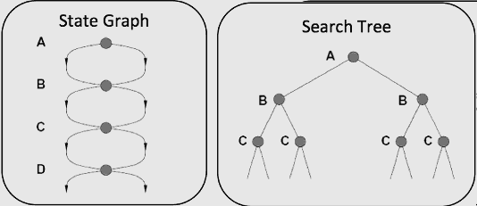


<h2 id="00ba899c02fa6651c15e5e948a7a4aac"></h2>


### Graph Search 

- Graph Search will keep track of a list of nodes you've expanded and not expand them again.

- Idea: never **expand** a state twice
- How to implement: 
    - Tree search + set of expanded states (“closed set”)
    - Expand the search tree node-by-node, but…
        - Before expanding a node, check to make sure its state has never been expanded before
        - If you have, skip it, if you haven't, call the successor function and then add it to closed set.
- Important: **store the closed set as a set**, not a list
- Can graph search wreck completeness?  Why/why not?
    - No. It's parts of the Search Tree.
- How about optimality?
    - Unfortunately close list will introduce another problem 
    - Admissible heuristic with tree search is optimal but graph search no guarantees.


<h2 id="9afaf22785328c0bf6267acf13add5da"></h2>


### A* Graph Search Gone Wrong?

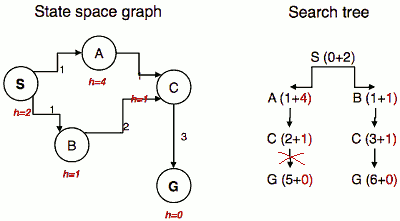

SAC can not expand because C is in closed set.

So we need to be careful in Graph Search, the first time we expand, if it is when we were there NOT an optimal way, we never do the optimal way.

The issue here is some kind of poor choice of heuristics guiding us down the wrong path. So what we need is more than Admissible Heuristics.

<h2 id="cb964f845fc822953ddb83ca6d124e6b"></h2>


### Consistency of Heuristics

- Main idea: 
    - estimated heuristic costs ≤ actual costs
    - Admissibility: heuristic cost ≤ actual cost to goal
        - h(A) ≤ actual cost from A to G
    - Consistency: heuristic “arc” cost ≤ actual cost for each arc
        - h(A) – h(C) ≤ cost(A to C)
        - Consistency will be about locally checking that things are consistent within the heuristic and the actual cost. 
- Consequences of consistency:
    - The f value along a path never decreases
        - h(A) ≤ cost(A to C) + h(C)
        - add g(A) on both side 
        - **f(A)** =g(A)+h(A) **≤** g(A)+cost(A to C)+h(C)= **f(C)**
        - Consistency implies as we expand, f will go up and up and up. f  will keep going up as we expand. And that means that if we have consistency, whenever we expand the goal state, we know we're done. Because everyting else will have a higher f on the fringe.  
        - 由公式可知，h(C) 陡然变大也是允许的，只要不破坏 admissibility ; h(C) 变小也是可以的, 只要不破坏 consistency
    - A\* graph search is optimal


PS. Admissibility graph search 存在的这个问题, 可以通过 Cost-Sensitive-Closed-Set 来解决，见最后代码. 但是会导致计算量增加。

---

<h2 id="ea9a7016fa68c3fd6434c9c0fb4afa3d"></h2>


### Optimality of A* Graph Search

- Sketch: consider what A* does with a consistent heuristic:
    - Fact 1: In tree search, A* expands nodes in increasing total f value (f-contours)
    - Fact 2: For every state s, nodes that reach ***s*** optimally are expanded before nodes that reach ***s*** suboptimally
    - Result: A* graph search is optimal


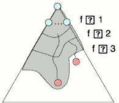

---

<h2 id="c1e81f3c2f720c3a2e3a765ba6a11d59"></h2>


### Optimality

- Tree search:
    - A* is optimal if heuristic is admissible
    - UCS is a special case (h = 0)
- Graph search:
    - A* optimal if heuristic is consistent
    - UCS optimal (h = 0 is consistent)
- Consistency implies admissibility
- In general, most natural admissible heuristics tend to be consistent, especially if from relaxed problems

---

<h2 id="e418daaa73025a84fd16637fbf3b2d0d"></h2>


## A*: Summary

- A* uses both backward costs and (estimates of) forward costs
- A* is optimal with admissible / consistent heuristics
- Heuristic design is key: often use *relaxed* problems


<h2 id="1388b32869f8288febeb18f8ec802b42"></h2>


### Graph Search Pseudo-Code

- even if same node is ***added*** to the fringe multiple times it will not be ***expanded*** more than once  as long as using consistent heuristics

```
function GRAPH-SEARCH(problem,fringe) return a solution, or failure
    closed <- an empty set
    fringe <- INSERT(MAKE-NODE(INITIAL-STATE[problem]),fringe)
    loop do
        if fringe is empty then
            return failure
        end

        node <- REMOVE-FRONT(fringe)
        if GOAL-TEST(problem,STATE[node]) then 
            return node
        end

        if STATE[node] is not in closed then
            add STATE[node] to closed
            for child-node in EXPAND(STATE[node],problem) do
                fringe <- INSERT(child-node,fringe)
            end
        end
    end
end // func
```

- Note: Some general algorithms, e.g. Dijkstra,  it was implemented by using one array to store distance, one array to store previous node.
    - in our search problem, we normally do not do that since we may have very large number of states


---

几个算法变种:

**Memory Efficient Graph Search**

如果在 add onto fringe 过程中，发现 node 已经在 fringe中存在, 比较这两个node , 如果

- new node cost < node in fringe cost ,  replace the old 1
- new node cost >= node in fringe cost , ignore it


算法唯一区别是 INSERT 方法


```
function SPECIAL-INSERT(node, fringe, closed) return fringe
    // by pass node already in closed
    if STATE[node] not in closed set then
        if STATE[node] is not in STATE[fringe] then
            // same 
            fringe <- INSERT(node,fringe)
        else if STATE[node] cost < STATE[node] cost in fringe then
            // Memory Efficient 
            fringe <- REPLACE(node,fringe)
        end
    end
end // func
```

By doing this the fringe needs less memory, however insertion becomes more computationally expensive.

**A\*-graph-search-with-Cost-Sensitive-Closed-Set**

使用这个算法，仅保证 admissible , 就可以得到最优解, 但是同一个 node 可能会多次 expand, 计算量可能会近似 tree search

```
function GRAPH-SEARCH(problem,fringe) return a solution, or failure
    closed <- an empty dictionary  // 1
    fringe <- INSERT(MAKE-NODE(INITIAL-STATE[problem]),fringe)
    loop do
        if fringe is empty then
            return failure
        end
        node <- REMOVE-FRONT(fringe)
        if GOAL-TEST(problem,STATE[node]) then 
            return node
        end
        if STATE[node] is not in closed  
            or COST[node] < COST[ closed[STATE[node]] ]   // 2 visit even if in closed set
        then
            add/update  STATE[node] to closed  // 3 maybe update an old one
            for child-node in EXPAND(STATE[node],problem) do
                fringe <- INSERT(child-node,fringe)
            end
        end
    end
end // func
```


<h2 id="53d3b2a00e84590355f57034c84cc1a0"></h2>


### Optimality of A\* Graph Search

- Consider what A\* does:
    - Expands nodes in increasing total f value (f-contours)
    - Reminder: f(n) = g(n) + h(n) = cost to n + heuristic
    - Proof idea: the optimal goal(s) have the lowest f value, so it must get expanded first
- Proof:
    - New possible problem: some n on path to G\* isn’t in queue when we need it, because some worse n’ for the same state dequeued and expanded first (disaster!)
    - Take the highest such n in tree
    - Let p be the ancestor of n that was on the queue when n’ was popped
    - f(p) < f(n) because of consistency
    - f(n) < f(n’) because n’ is suboptimal
    - p would have been expanded before n’
    - Contradiction!

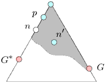


---

<h2 id="c9f86c35957917fe5e25e926f8923c75"></h2>


## demo code in python

<h2 id="41ac4b4e9e2441a0a74f1372fbca3c52"></h2>


###  python graph search

- note1:
    - for uniform search,  fringe is a priority queue , the cumulate cost is the key (  `lambda item: item[2]` )
    - for astar search , fringe is a priority queue which use  cumulate cost + heuristic(state) 
- note2:
    - we store the info of parent node (parentState,action) , and use it to rebuild the whole shortest path.

```python
# author: qibinyi
def graphSearch( problem, fringe):
    
    closed = {}

    def buildPath( last_path_info ) :
        ret = []
        while last_path_info[0] is not None:
            ret.append( last_path_info[1] ) 
            last_path_info = closed[ last_path_info[0] ]
        ret.reverse()
        return ret


    # node is a tuple: ( state , (parentState,action)  , cumulate cost )
    fringe.push( (problem.getStartState(),(None,None), 0 ) )
    while True:
        # test 
        if fringe.isEmpty():
            return []
        state , path_info  , costs  = fringe.pop()
        if problem.isGoalState(state):
            return buildPath( path_info ) 
        
        # print state , " -> "    
        # expand 
        if state not in closed :
            closed[state] = path_info
            for sucState , action, cost  in problem.getSuccessors( state ):
                fringe.push( ( sucState , (state,action) , costs + cost )  )  
                # print "\t <- " , sucState  

    return []
```

- case1: find a path to dst position in a maze
    - every game state of problem need only the position: (x,y)
- case2: reach 4 corners in a maze
    - every game state of problem need record the position , and status of visit of corners 
    - heuristic value 的设计需要注意, 要确保 admissible consistency. 
        - naive solution: number of corner unvisited
        - better solution: distance to the next corner ( key corners in clockwise order )
        - more better solution: the distance to closest corner, plus the sum of the distance between remaining corners in order.
- case3: east all food
    - naive solution: distance to next food
    - better solution: sort food in "nunu" shape, h_val = dist2closestFood + sum( distsBetweenFoods )\*0.5
    - Sometimes, even with A\* and a good heuristic, finding the optimal path through all the dots is hard.  
        -  In these cases, we'd still like to find a reasonably good path, quickly
        - eg. greedily eats the closest dot

 
<h2 id="65e0ab6e34746c2231d34656e5134d92"></h2>


### other implementation 

[_search in simpleai](https://raw.githubusercontent.com/simpleai-team/simpleai/master/simpleai/search/traditional.py)

[best_first_graph_search in aima-python](https://raw.githubusercontent.com/aimacode/aima-python/master/search.py)


---


