[](...menustart)

- [Adversarial Search](#6778eced7db02d1b66c03c39306bc708)
    - [Types of Games](#82c396e55e8a69361a547039258d0479)
    - [Deterministic Games](#cc82ac9a2727eb1d5950b8affab7d93b)
    - [Zero-Sum Games](#d821b153288450f3f70a8b5429bd79e7)
    - [Adversarial Search](#6778eced7db02d1b66c03c39306bc708)
    - [Single-Agent Trees](#06c1352495eca3c370be92255d91cc6e)
    - [Adversarial Game Trees](#d21873e6049038af1b9127a1c8220791)
    - [Minimax Values](#a4d1f6cf51517d66b29531f7e039ffb0)
    - [Tic-Tac-Toe Game Tree](#0a6312d7d59a7975900e968c851dadd1)
    - [Adversarial Search (Minimax)](#dcf0514b6a79cf87fcd3bd43487c2421)
    - [Minimax Implementation (Dispatch)](#c71419720f45dda9ca197f86de277c73)
    - [Minimax Efficiency](#86563aad0e1c5702c26fc95c039b8f5d)
    - [Minimax Properties](#41f6acef7d955252a54191e4a588c49d)
    - [Minimax Efficiency](#86563aad0e1c5702c26fc95c039b8f5d)
    - [Resource Limits](#febe674abc9aa524c322edbbd8ec668c)
    - [Depth Matters](#1d6bb0121e05033d0b24687e099f1cd7)
    - [Evaluation Functions](#374868e68849b0b659b2677c21e7e73d)
    - [Why Pacman Starves](#60f84bbd0786516b9c113184771ff9ad)
    - [Game Tree Pruning](#89d4e1dda46082b0db4e378df9ea47fa)
        - [Alpha-Beta Pruning](#358c18c4263b1fc77ce96e4af26835e5)
        - [Pruning Exampe](#c19957d4c3956796b41234017dc153e6)
        - [Alpha-Beta Implementation](#e846bcc2e55ec4d7cfa03d4713218f5b)
        - [Alpha-Beta Pruning Properties](#ec4a6665d642ea66a394cbde7e464a8d)
    - [Iterative Deepening](#fcbd892c255445e0e3c99ceeb0dbc2e9)
    - [Synergies between Evaluation Function and Alpha-Beta ?](#76ae59199372bb5d14e647a0d18b2179)
- [Expectimax and Utilities](#a45c912b3f29a85dfaf265df7e679a37)
    - [Uncertainty and Utilities](#6149fc2d88c6c1923cb69bc8cb99a646)
        - [Worst-Case vs. Average Case](#f061a414b47ce02e647fdb25d80714af)
    - [Expectimax Search](#6ecc2099b9f0d08ca4a5fe81a800cacb)
        - [Expectimax Pseudocode](#ce695dc2a23c6c72b11e27d31153eceb)
        - [Expectimax Pruning?](#b6996c09f631626a1825a6d8fac7b02c)
        - [Depth-Limited Expectimax](#ab3291e21188d4069affc1afa9072371)
        - [Example of depth-limited search](#6aaf3cf66d3305bdc35b0f67041a57dc)
    - [Probabilities](#bc078a4ec09e22213bd1e3f41d17bed5)
        - [Reminder: Probabilities](#0d8aebbdf090456382759c0b150f34e4)
        - [Reminder: Expectations](#a5d4bf7a63230c8571ac6c2e4ccbe07c)
        - [What Probabilities to Use ?](#09e97ac67711291782476420d32639a6)
        - [Quiz: Informed Probabilities](#28f9be702977991f6e9af6eac821e5bf)
    - [Modeling Assumptions](#96c41e6537362c1152d9cffd89d3ce2d)
        - [The Dangers of Optimism and Pessimism](#173903fff204e9fa2902106ecc393c8a)
        - [Assumptions vs. Reality](#5db156685ba988e993b5d79d16d83b78)
    - [Other Game Types](#36a5d8463dcd3e452a6804e1f817860e)
        - [Mixed Layer Types](#4d83149ccdc520d6725e433ae1277e06)
        - [Example: Backgammon](#eaefbf5d721da4a937661b4c220a4bbb)
        - [Multi-Agent Utilities](#3c4af92d68993b46c547310f35e6f8eb)
    - [Utilities](#ceba282b7418b7f199798b645e1cba56)
        - [Maximum Expected Utility](#eabc9c95ab9e6d9e17f2ecd517a1670b)
        - [What Utilities to Use?](#f0400acd1ae1ee97ec4a2afe860937cd)
        - [Utilities](#ceba282b7418b7f199798b645e1cba56)
        - [Utilities: Uncertain Outcomes](#84c1a66a044dc64ee4f3cf4fadc6cdb6)
    - [Preferences](#d0834fcec6337785ee749c8f5464f6f6)
    - [Rationality](#63000348f12e5505f8ea8b0b2b208698)
        - [Rational Preferences](#1e6df6b0bb22997a095d015d4ac31630)
        - [MEU Principle](#6128ac98c4876851331c1db2897f6253)
        - [Utility Scales](#21657c7363e3c0a908c10915dce59712)
        - [The utility of money](#bdd76b2b194dadbe5e0a331ee46a45fd)
        - [Example: Insurance](#dad93deae38068bd9b575b9c56b23afe)
    - [Example: Human Rationality ?](#f0a715611d4f38f774d419d0be398be6)

[](...menuend)


<h2 id="6778eced7db02d1b66c03c39306bc708"></h2>

# Adversarial Search

<h2 id="82c396e55e8a69361a547039258d0479"></h2>

## Types of Games

- Axes
    - Deterministic or stochastic?
    - One, two, or more players?
    - Zero sum?
    - Perfect information (can you see the state)?

 
 We will talk about zero sum and deterministic games. They are games of perfect information.

Think about how this is different from search. 

In search I gave you the search problem , and what you gave me back is a plan or path it is a sequences of actions that executed and it was guaranteed to succeed.

That's not going to work here because we don't control our opponent. So we can't just give a plan that guarantes to succeed. What we need to do is we need a function which tells us in any given state what to do . That is the **policy** in the game case it's often called strategy. 


<h2 id="cc82ac9a2727eb1d5950b8affab7d93b"></h2>

## Deterministic Games

- Many possible formalizations, one is:
    - States: S (start at s₀)
    - Players: P={1...N} (usually take turns)
        - Defines which player has the move in a state.
    - Actions: A (may depend on player / state)
        - Retums the set of legal moves in a state.
    - Transition Function: SxA →S
        - the result of a move.
    - Terminal Test: S →{t,f}
        - which is true when the game is over and false otherwise. 
        - States where the game has ended are called ***terminal states*** .
    - Terminal Utilities: SxP →R
        - every outcome of the game will be socred.
        - defines the final numeric value for a game that ends in terminal state ***s*** for a player ***p***
        - This tell us for an end-state how much it is worth to each of the players.
        - In chess, the outcome is a win, loss, or draw, with values +1, 0, or -1
- Solution for a player is a **policy**: S → A
    - the solution to a game like this is a policy which map states to actions.


<h2 id="d821b153288450f3f70a8b5429bd79e7"></h2>

## Zero-Sum Games

 Zero-Sum Games | General Games
--- | --- 
 Agents have opposite utilities (values on outcomes) | Agents have independent utilities (values on outcomes)
 Lets us think of a single value that one maximizes and the other minimizes | Cooperation, indifference, competition, and more are all possible
 Adversarial, pure competition | More later on non-zero-sum games


<h2 id="6778eced7db02d1b66c03c39306bc708"></h2>

## Adversarial Search

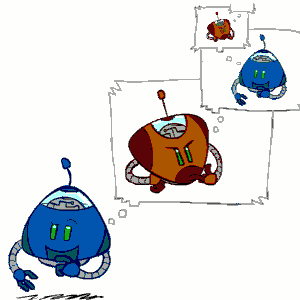

we're going to have an agent is trying to figure out what to do. Just like a regular single-agent search. 

Before the way you're going to decide what to do is we're going to think about consquences of our actions. 

The differences rather than thinking about sequence of actions that I can perform , I need think about my opponent. 

So I imagine taking an action and then I imagine my opponent will then be in the situation of thinking about the "opponent" should do.  And they're going to imagine that they're taking an action which I will respond. It will get this enbedded interleaving of our future states. 


---

<h2 id="06c1352495eca3c370be92255d91cc6e"></h2>

## Single-Agent Trees

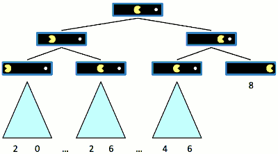

some of these paths go forever , some of these paths end because it meet the last of the game terminates. 

And what we actually do ? 

We image there is  associated values with this. Let's say this is the best possible outcome where I go straight to the dot ate it. And there are various other outcomes buried further in the other trees and I can associate numbers with them.

In the case of single-agent , I get to pick any outcome I like.  In this  actual search case , showed as the pic , we should make that value-8 outcome happen.


For terminal state the value is known. What about the other ones? for example, the previous state of the state with value 8.

well in this state I have a choice I can get 8 or I can get whatever is down below the left path (4-n-6). So I can write the value of the state is defined to be the maximum over the values of its children. 

In single-agent case, we choose maximum value.

- Value of a state: The best achievable outcome (utility) from that state
    - 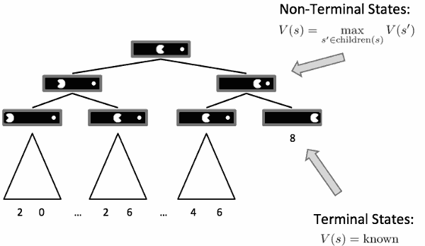


---

<h2 id="d21873e6049038af1b9127a1c8220791"></h2>

## Adversarial Game Trees

Let's think about the case where we have an adversary . 

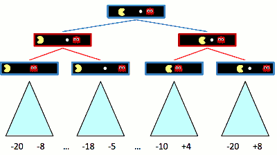

In the state of root , we can still do the same thought : move left or move right. 

The difference now is in each of these possible futures the ghost can move left or right. So there's still the tree of of possible futures. 

So we need to think about now what a value is in the case of an adversary. This is going to give us the idea of a ***minimax*** value. 


<h2 id="a4d1f6cf51517d66b29531f7e039ffb0"></h2>

## Minimax Values

The following example is a very small game. The pacman take a turn, then the ghost take a turn. And then the game ends.

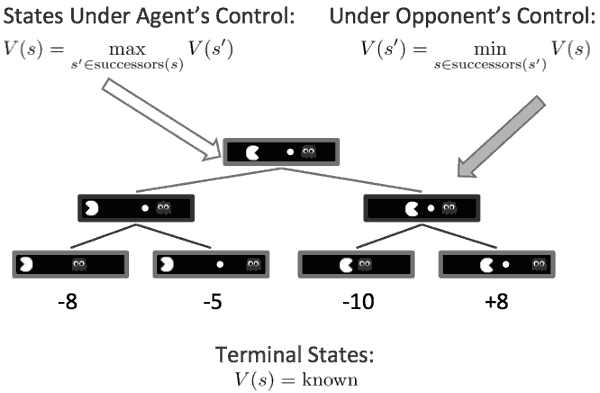

8 is still gonna be the best outcome we can achieve under perfect play against an optimal adversary. 

We still know the value of Terminal States. For a state that is under my opponents control I imagine that this ghost is out there to minimize my value , so it will be -10.

---


<h2 id="0a6312d7d59a7975900e968c851dadd1"></h2>

##  Tic-Tac-Toe Game Tree

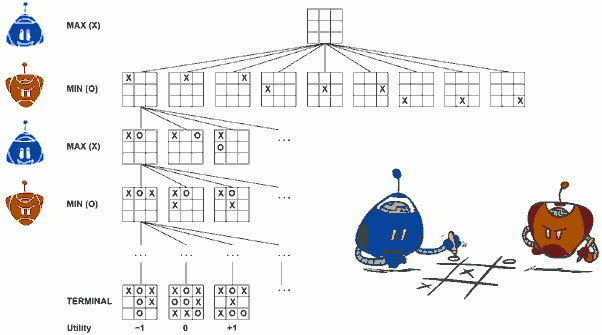

Blue one moves first. 

The value of root will be one of { -1,1,0 }.

- From the initial state, MAX has nine possible moves. 
- Play alternates between MAX 's placing an `x` and MIN's placing an `o` until we reach leaf nodes corresponding to terminal states . 
- The number on each leaf node indicates the utility value of the terminal state from the point of view of MAX: high values are assumed to be good for MAX and bad for MIN
- For tic-tac-toe the game tree is relatively small—fewer than 9! = 362, 880 terminal nodes.
- But for chess there are over 10⁴⁰ nodes, so the game tree is best thought of as a theoretical construct that we cannot realize in the physical world. 
- But regardless of the size of the game tree, it is MAX's job to search for a good move. We use the term search tree for a tree that is superimposed on the full game tree, and examines enough nodes to allow a player to determine what move to make.
- if both players play optimally, the value of root should will 0.


<h2 id="dcf0514b6a79cf87fcd3bd43487c2421"></h2>

## Adversarial Search (Minimax)

- Deterministic, zero-sum games:
    - Tic-tac-toe, chess, checkers
    - One player maximizes result
    - The other minimizes result

- Minimax search:
    - A state-space search tree
    - Players alternate turns
    - Compute each node’s minimax value: the best achievable utility against a rational (optimal) adversary

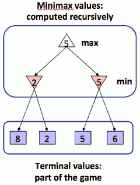

<h2 id="c71419720f45dda9ca197f86de277c73"></h2>

## Minimax Implementation (Dispatch)

```python
def value(state):
    if the state is a terminal state: return the state’s utility
    if the next agent is MAX: return max-value(state)
    if the next agent is MIN: return min-value(state)
```

- Minimax Implementation  

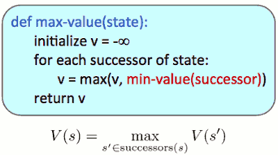

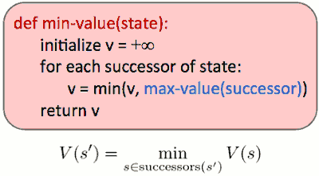


具体实现时，max-value / min-valu 直接调用 value 方法，在value方法中作分发。

---


<h2 id="86563aad0e1c5702c26fc95c039b8f5d"></h2>

## Minimax Efficiency

- How efficient is minimax?
    - Just like (exhaustive) DFS.
        - traversing the entire tree, not skiping anything, not prioritizing anything 
        - just going successor by successor, going deeper, deeper, deeper before its coming back up.
    - Time: O(bᵐ)
    - Space: O(bm)
- Pacma mple: For chess, b ≈35, m ≈100
    - Exact solution is completely infeasible
    - But, do we need to explore the whole tree?


<h2 id="41f6acef7d955252a54191e4a588c49d"></h2>

## Minimax Properties

If you play against a perfect player  you want to use minimax but if you are not playing against a player move random  then minimax is going to be overly pessimistic. 

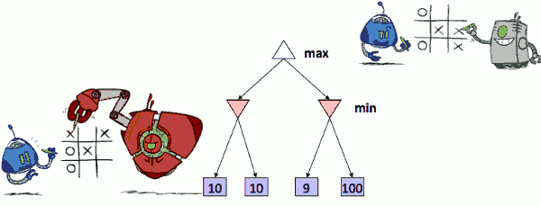

And so, if just periodically they were to make a mistake, it's worth to going the right way ( 9-100 ). So now we're doing some probability calculation really. It's like what's the chances that they might make a mistake.


<h2 id="86563aad0e1c5702c26fc95c039b8f5d"></h2>

## Minimax Efficiency

- How efficients is minimax?
    - Just like (exhaustive) DFS
    - Time: O(bᵐ)
    - Space: O(bm)
- Example: For chess, b≈35, m≈100
    - Exact solution is completely infeasible
    - But, do we need to explore the whole tree?


<h2 id="febe674abc9aa524c322edbbd8ec668c"></h2>

## Resource Limits

- Problem: In realistic games, cannot search to leaves!
- Solution: Depth-limited search
    - Instead, search only to a limited depth in the tree
    - Replace terminal utilities with an evaluation function for non-terminal positions
- Example:
    - Suppose we have 100 seconds, can explore 10K nodes / sec
    - So can check 1M nodes per move
    - α-β reaches about depth 8 – decent chess program
- Guarantee of optimal play is ***gone***
- More plies makes a BIG difference
- Use iterative deepening for an anytime algorithm

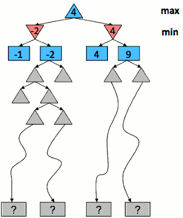


For a chess game, we can't possibly search the whole game tree. Essentially we've got resource limits in this case time. That tell us we can only look forward so far into the tree before the exponential growth of the tree gets this.

So we can only search just some limited depth from the tree. Now the problem is we get to the end of our search we don't have terminal utilities because we are not actually at the end of the game. 

So we need to replace the terminal utilities in the minimax algorithm with what's called evaluation function, which takes a non-terminal position and gives us some estimate of what the terminal utility under that tree would be under minimax plan.


--- 

具体实现上，一般你需要:

 1. 一个返回当前 合法 action 的方法
    - 如果 合法 action 为 空，说明没有后续状态了,eg. win/lost ，返回 状态的 evaluationFunction 值
 2. 一个根据 action -> successor game state 的方法, 
 3. 可以跟踪的迭代 depth，到达搜索 depth-limit后，返回 状态的evaluationFunction 值


---

<h2 id="1d6bb0121e05033d0b24687e099f1cd7"></h2>

## Depth Matters

- Evaluation functions are always imperfect
- The deeper in the tree the evaluation function is buried, the less the quality of the evaluation function matters
- An important example of the tradeoff between complexity of features and complexity of computation


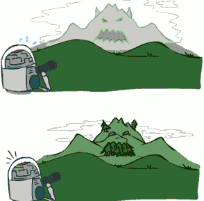


----

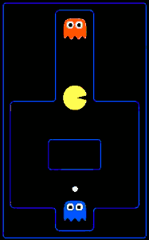

For this example , if we look forward just a couple steps , we're going to need know it won't be able to see actually eating of the dot or any future collisions with the ghost.  We can not see whether or not we can be closer or farther from the dot. But we have to have an evaluation function that says that. 

If we can see all the way into the future , we can see the whole game play out on this board. The critical thing is that the blue ghost is going to go somewhere and once it goes somewhere it's committed. So what we should do now is moving towards the orange ghost because we are still not in any danger.  If you look deeply enough into the tree you see that what this allows you to do is force the blue ghost to make a decision before you have to.


<h2 id="374868e68849b0b659b2677c21e7e73d"></h2>

## Evaluation Functions

A function takes a non-terminal state and return some number,just like the heuristic value in Astar search . 

In this case we want that number to return the actual minimax value of that position. That is not going to happen. In practice what peaple do is they try to come up with some function which on average is positive when the minimax value is positive , is negative when the minimax value is negative. 

- Evaluation functions score non-terminals in depth-limited search
    - 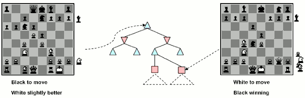
- Ideal function: returns the actual minimax value of the position
- In practice: typically weighted linear sum of features:
    - Eval(s)=w₁f₁(s) + w₂f₂(s) + ... + w<sub>n</sub>f<sub>n</sub>(s)
    - eg. f₁(s)=(num white queens – num black queens), etc.


---

<h2 id="60f84bbd0786516b9c113184771ff9ad"></h2>

## Why Pacman Starves

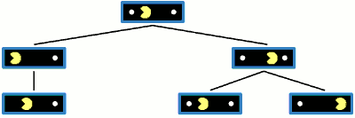


Earning 10 points for eating a dot.

issue  : starve ( loop in a range  )

danger of replanning agents

the plan they have in their head does not really have to be consistent. Every step you do a new plan. 


The problem is if we take the right branch , look at that state ( right,  2nd level ) , it's just like the state of the root . (1 is a bit left, another is a bit of right) 

so we trash.  


- A danger of replanning agents!
    - He knows his score will go up by eating the dot now (west, east)
    - He knows his score will go up just as much by eating the dot later (east, west)
    - There are no point-scoring opportunities after eating the dots (within the horizon, two here)
    - Therefore, waiting seems just as good as eating: he may go east, then back west in the next round of replanning!


solution: closer to a dot  score point as well.


---

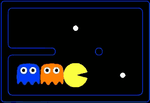

What's going on here each agent is separately doing their own searches. But they see that the other one constrols , they treat it like min node (???). So even though each agent is actually doing its own search because they are both assuming the other one shares its evaluation function that is also minimax agent. We're goint to see cooperation emerge.

This shows you how you can get cooperation without programming it in, simply they're both trying to achieve the same goal. 


---


<h2 id="89d4e1dda46082b0db4e378df9ea47fa"></h2>

## Game Tree Pruning 


<h2 id="358c18c4263b1fc77ce96e4af26835e5"></h2>

### Alpha-Beta Pruning

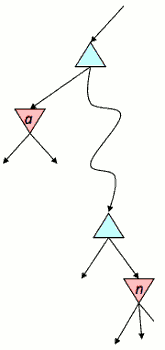

This figure shows the general case for alpha–beta pruning: If ***α*** is better than ***n*** for Player, we will never get to ***n*** in play.

- General configuration (MIN version)
    - We’re computing the MIN-VALUE at some node n
    - We’re looping over n’s children
    - n’s estimate of the childrens’ min is dropping
    - Who cares about n’s value?  MAX
    - Let α be the best value that MAX can get at any choice point along the current path from the root
    - If n becomes worse than α, MAX will avoid it, so we can stop considering n’s other children (it’s already bad enough that it won’t be played)
- MAX version is symmetric

PS: 采用了 pruning 算法, 节点的取值可能就不是 最大／最小值了

<h2 id="c19957d4c3956796b41234017dc153e6"></h2>

### Pruning Exampe


- 第2层 - 
- 最左节点, min-value 计算的 3
- 中间节点
    - 1st successor is 2 , than means the min value of parent is ≤ 2. 
    - so the value of rest successor is not important now, because they will not influence the choice of max-value ,calculated by the first level node
    - computation break

For a minimizer node *m* , pruning its children is possible , when both of the following conditions are met:

 1. the value of another child of *m* has been determined
    - leftmost children can not be pruned
 2. somewhere on the path from *m* to the root node, there is a maximizer node *M* for which an alternative option has already been explored

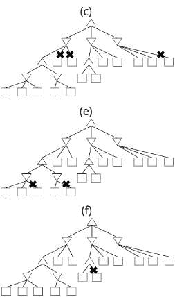

so all pruning shape showed in above pic will not be achieved.

<h2 id="e846bcc2e55ec4d7cfa03d4713218f5b"></h2>

### Alpha-Beta Implementation

- α: MAX’s best option on path to root
- β: MIN’s best option on path to root

```python
def max-value(state, α, β):
    initialize v = -∞
    for each successor of state:
        v = max(v, value(successor, α, β))
        # top min-value not care what remains, if v > β
        if v > β return v  # must not prune on equality
        # update global max value
        α = max(α, v)
    return v
```

```python
def min-value(state , α, β):
    initialize v = +∞
    for each successor of state:
        v = min(v, value(successor, α, β))
        # top max-value not care what remains, if v < α
        if v < α return v # must not prune on equality
        # update global min value
        β = min(β, v)
    return v
```

***注意，alpha，beta 不能使用全局变量，而是应该一层一层值传递下去*** 。

<h2 id="ec4a6665d642ea66a394cbde7e464a8d"></h2>

### Alpha-Beta Pruning Properties


- This pruning has ***no effect*** on minimax value computed for the root!
- Values of intermediate nodes might be wrong
    - Important: children of the root may have the wrong value
    - So the most naive version won’t let you do action selection
        - so it might not give us which action we can actually take, it just tell us "ok, here's the value of game".
- 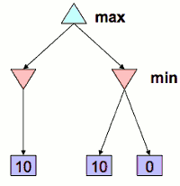
    - in the case that pic shows, the left min is 10, the value passes to root, the right min satisfied the condition ≤ 10, it will skip the rest, it may choose the right sub-tree if ties break on equality, 
    - if the algorithm will not prune on equality( change ≤ to `<` ) , then this case will no happen.
    - or you do the pruning first on the children of root node.
- So there are 3 ways to do it
    1. keep track of which one was first
    2. run pruning on the children
    3. prune on only strict inequalities
        - you lose out a lot of pruning, you will compute more nodes.
- Good child ordering improves effectiveness of pruning
    - The effectiveness of alpha–beta pruning is highly dependent on the order in which the states are examined
    - the best thing that you would be able to do is actually like try to expand the optimal play first, so at to prune a lot.
- With “perfect ordering”:
    - Time complexity drops to O(b<sup>m/2</sup>)
    - Doubles solvable depth!
    - Full search of, e.g. chess, is still hopeless…


---

<h2 id="fcbd892c255445e0e3c99ceeb0dbc2e9"></h2>

## Iterative Deepening

- Iterative deepening uses DFS as a subroutine:
    1. Do a DFS which only searches for paths of length 1 or less.  i
        - (DFS gives up on any path of length 2)
    2. If “1” failed, do a DFS which only searches paths of length 2 or less.
    3. If “2” failed, do a DFS which only searches paths of length 3 or less.
        - ... and so on.

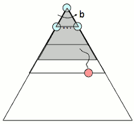


<h2 id="76ae59199372bb5d14e647a0d18b2179"></h2>

## Synergies between Evaluation Function and Alpha-Beta ?

- Alpha-Beta: amount of pruning depends on expansion ordering
    - Evaluation function can provide guidance to expand most promising nodes first ( which later makes it more likely there is already a good alternative on the path to the root )
    - somewhat similar to role of A\* heuristic , CSPs filtering
- Alpha-Beta: similar for roles of min-max swapped
    - Value at a min-node will only keep going down
    - Once value of min-node lower than better option for max along path to root, can prune
    - Hence: If evaluation function provides upper-bound on value at min-node, and upper-bound already lower than better option for max along path to root THEN can prune.


---

<h2 id="a45c912b3f29a85dfaf265df7e679a37"></h2>

# Expectimax and Utilities


<h2 id="6149fc2d88c6c1923cb69bc8cb99a646"></h2>

## Uncertainty and Utilities

<h2 id="f061a414b47ce02e647fdb25d80714af"></h2>

### Worst-Case vs. Average Case

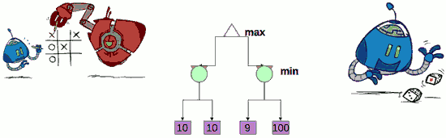

- Idea for today: 
    - Uncertain outcomes controlled by chance, not an adversary!


<h2 id="6ecc2099b9f0d08ca4a5fe81a800cacb"></h2>

## Expectimax Search 

- Why wouldn’t we know what the result of an action will be?
    - Explicit randomness: rolling dice
    - Unpredictable opponents: the ghosts respond randomly
    - Actions can fail: when moving a robot, wheels might slip
- Values should now reflect average-case (expectimax) outcomes, not worst-case (minimax) outcomes
- Expectimax search: compute the average score under optimal play
    - Max nodes as in minimax search
    - Chance nodes are like min nodes but the outcome is uncertain
    - Calculate their expected utilities
    - I.e. take weighted average (expectation) of children
- Later, we’ll learn how to formalize the underlying uncertain-result problems as **Markov Decision Processes**

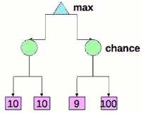

left node will be 10
for the right node ,  if 9 and 100 happens equally likely, the value will be  (100+9)/2 = 54.5. 
so we should probably take the right node. 

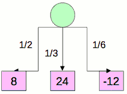

v = (1/2) (8) + (1/3) (24) + (1/6) (-12) = 10

---

<h2 id="ce695dc2a23c6c72b11e27d31153eceb"></h2>

### Expectimax Pseudocode

```python
def value(state):
    if the state is a terminal state: return the state’s utility
    if the next agent is MAX: 
        return max-value(state)
    if the next agent is EXP: 
        return exp-value(state)
```

```python
def max-value(state):
    initialize v = -∞
    for each successor of state:
        v = max(v, value(successor))
    return v
```

```python
def exp-value(state):
    initialize v = 0
    for each successor of state:
        p = probability(successor)
        v += p * value(successor)
    return v
```

实现上和 Minimax 非常接近。


<h2 id="b6996c09f631626a1825a6d8fac7b02c"></h2>

### Expectimax Pruning?

Expectimax can not apply pruning.

---

<h2 id="ab3291e21188d4069affc1afa9072371"></h2>

### Depth-Limited Expectimax

Estimate of true expectimax value (which would require a lot of work to compute)

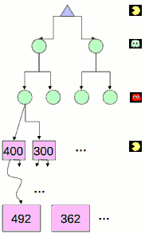

we have 2 layers corresponding to the 2 sequence of random ghost actions before pacman moves again. 


<h2 id="6aaf3cf66d3305bdc35b0f67041a57dc"></h2>

### Example of depth-limited search

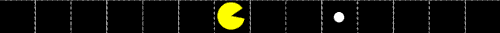

- Consider the following Pacman configuration
    - At each time step, Pacman can move either West (left) or East (right) and is using limited-depth minimax search to choose his next move
        - (where the minimizing agent does not really do anything) 
    - Pacman is 3 East moves away from the food
    - and chooses from the following state evaluation functions:
        - F1(state) = -Number of food pellets left
        - F2(state) = -Number of food pellets left + 0.5/(distance to closest food pellet + 1); distance to closest food pellet is taken as 0 when no food remains.


Normally , we say a search depth of 2 means the search considers of up to 2 actions by the maximizer (or minimizer).

- when using F1 as the state evaluation function 
    - East could be an optimal action if do 1,2,3,4,5 depth-limited search 
    - West could be an optimal action if do 1,2,    5 depth-limited search
    - For depth 1,2 , action East and West are both optimal action , there are ties 
    - For depth 3,4 , action East will be optimal because it ate the dot , while action West can not
    - For depth 5,  both are optimal because they all can eat the dot.
- when using F2 as the state evaluation function
    - East could be an optimal action if do 1,2,3,4,5 depth-limited search 
    - West could be an optimal action only if do 5 depth-limited search


---

<h2 id="bc078a4ec09e22213bd1e3f41d17bed5"></h2>

## Probabilities

<h2 id="0d8aebbdf090456382759c0b150f34e4"></h2>

### Reminder: Probabilities

- A random variable represents an event whose outcome is unknown
- A probability distribution is an assignment of weights to outcomes
- Example: Traffic on freeway
    - Random variable: T = whether there’s traffic
    - Outcomes: T in {none, light, heavy}
    - Distribution: P(T=none) = 0.25, P(T=light) = 0.50, P(T=heavy) = 0.25
- Some laws of probability (more later):
    - Probabilities are always non-negative
    - Probabilities over all possible outcomes sum to one
- As we get more evidence, probabilities may change:
    - P(T=heavy) = 0.25, P(T=heavy | Hour=8am) = 0.60
    - We’ll talk about methods for reasoning and updating probabilities later

<h2 id="a5d4bf7a63230c8571ac6c2e4ccbe07c"></h2>

### Reminder: Expectations

- The expected value of a function of a random variable is the average, weighted by the probability distribution over outcomes
- Example: How long to get to the airport?
    - 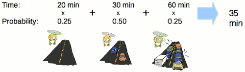


<h2 id="09e97ac67711291782476420d32639a6"></h2>

### What Probabilities to Use ?

- In expectimax search, we have a probabilistic model of how the opponent (or environment) will behave in any state
    - Model could be a simple uniform distribution (roll a die)
    - Model could be sophisticated and require a great deal of computation
    - We have a chance node for any outcome out of our control: opponent or environment
    - The model might say that adversarial actions are likely!

- For now, assume each chance node magically comes along with probabilities that specify the distribution over its outcomes

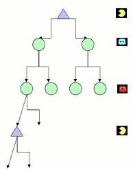

One important thing to remember is that just because we assign probabilities that reflect our believes to the outcome , does not mean that the thing on the other side of flipping a coin. 

If I think there is a 20% chance that the ghost go to left , it doesn't mean that the ghost has a random number generator. It just means that given my model which may be a simplification that's the best i can say given my evidence. 

<h2 id="28f9be702977991f6e9af6eac821e5bf"></h2>

### Quiz: Informed Probabilities

- Let’s say you know that your opponent is actually running a depth 2 minimax, using the result 80% of the time, and moving randomly otherwise
- Question: What tree search should you use?  
- Answer: Expectimax!
    - To figure out EACH chance node’s probabilities, you have to run a simulation of your opponent
    - This kind of thing gets very slow very quickly
    - Even worse if you have to simulate your opponent simulating you…
    - … except for minimax, which has the nice property that it all collapses into one game tree

In general expectimax is the more general search procedures. You should always in principle use expectimax.


<h2 id="96c41e6537362c1152d9cffd89d3ce2d"></h2>

## Modeling Assumptions

<h2 id="173903fff204e9fa2902106ecc393c8a"></h2>

### The Dangers of Optimism and Pessimism

 Dangerous Optimism | Dangerous Pessimism
 :--- | ---:
 Assuming chance when the world is adversarial. - | Assuming the worst case when it’s not likely.
  | 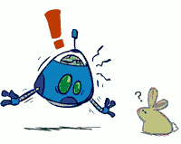

<h2 id="5db156685ba988e993b5d79d16d83b78"></h2>

### Assumptions vs. Reality

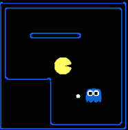

- Pacman used depth 4 search with an eval function that avoids trouble
- Ghost used depth 2 search with an eval function that seeks Pacman

---

 \\ | Adversarial Ghost | Random Ghost
--- | --- | ---
 Minimax Pacman |  Won 5/5 ,  Avg. Score: 483 | Won 5/5 ,  Avg. Score: 493
 Expectimax Pacman | Won 1/5 ,  Avg. Score: -303 | Won 5/5 ,  Avg. Score: 503

The result is not bad while an expectimax pacmas vs a random ghost.

<h2 id="36a5d8463dcd3e452a6804e1f817860e"></h2>

## Other Game Types

<h2 id="4d83149ccdc520d6725e433ae1277e06"></h2>

### Mixed Layer Types

- E.g. Backgammon
- Expectiminimax
    - Environment is an extra “random agent” player that moves after each min/max agent
    - Each node computes the appropriate combination of its children

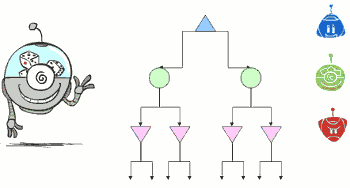

<h2 id="eaefbf5d721da4a937661b4c220a4bbb"></h2>

### Example: Backgammon

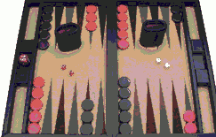

- Dice rolls increase b: 21 possible rolls with 2 dice
    - Backgammon ~ 20 legal moves
    - Depth 2 = 20 x (21 x 20)³ = 1.2 x 10⁹

- As depth increases, probability of reaching a given search node shrinks
    - So usefulness of search is diminished
    - So limiting depth is less damaging
    - But pruning is trickier 困难的…

- Historic AI: TDGammon uses depth-2 search + very good evaluation function + reinforcement learning: 
    - world-champion level play
    - 1st AI world champion in any game!


<h2 id="3c4af92d68993b46c547310f35e6f8eb"></h2>

### Multi-Agent Utilities

- What if the game is not zero-sum, or has multiple players?

- Generalization of minimax:
    - Terminals have utility tuples
    - Node values are also utility tuples
    - Each player maximizes its own component
    - Can give rise to cooperation and competition dynamically…

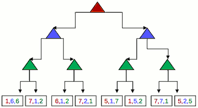

Each player has its own value of terminal node, and will optimize for their own outcome. Minimax , we kind of have that too. The maximizer had the number that we were showing, and the minimizer had the negative of that number. So there were actually 2 numbers sitting there, but it was the negative of each other, so we only showed one. Minimax is a special case of this where we just collapse those 2 opposite numbers into one number that we display. 


The leaf utilities are now written as pairs (U<sub>A</sub> , U<sub>B</sub>, U<sub>C</sub> ). In this generalized setting, A seeks to maximize U<sub>A</sub>, the first component, while B seeks to maximize U<sub>B</sub> , the second component.

In above example , the leftmost green node should be:  ***(1,6,6)***

Different things can emerge here, though these numbers are not just complementary to each other.  In the left sub tree, blue prefer to 6, can they make that happen? What will green do ? Green will choose the (1,6,6), which will happen that blue also gets 6 and gets what they want. So what have herer is actually a collaboration between blue and green.

<h2 id="ceba282b7418b7f199798b645e1cba56"></h2>

## Utilities


https://www.authorea.com/users/5754/articles/6087/_show_article

<h2 id="eabc9c95ab9e6d9e17f2ecd517a1670b"></h2>

### Maximum Expected Utility

- Why should we average utilities?  Why not minimax?
- Principle of maximum expected utility:
    - A rational agent should chose the action that **maximizes its expected utility, given its knowledge**

<h2 id="f0400acd1ae1ee97ec4a2afe860937cd"></h2>

### What Utilities to Use?

- For worst-case minimax reasoning, terminal function scale doesn’t matter
    - We just want better states to have higher evaluations (get the ordering right)
    - We call this insensitivity to monotonic transformations
    - 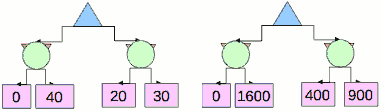
- For average-case expectimax reasoning, we need *magnitudes* to be meaningful

<h2 id="ceba282b7418b7f199798b645e1cba56"></h2>

### Utilities

- **Utilities are functions from outcomes (states of the world) to real numbers that describe an agent’s preferences**

- Where do utilities come from?
    - In a game, may be simple (+1/-1)
    - Utilities summarize the agent’s goals
    - Theorem: any “rational” preferences can be summarized as a utility function

- We hard-wire utilities and let behaviors emerge
    - Why don’t we let agents pick utilities?
        - why do we want the goal is to be the input and the optimal behavior to be the output of the computation?  why don't you just let the agent picks their own utilities? 
        - vacuum cleaner  example: the agent would like to do nothing ,and so easy to do nothing. 
    - Why don’t we prescribe behaviors?
        -  it's very hard to write down , complicated and context-defpendent.

idea: utilities go in , behavior comes out.

<h2 id="84c1a66a044dc64ee4f3cf4fadc6cdb6"></h2>

### Utilities: Uncertain Outcomes

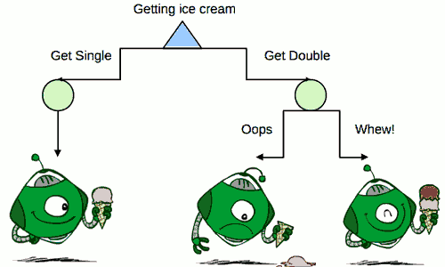


<h2 id="d0834fcec6337785ee749c8f5464f6f6"></h2>

## Preferences

- An agent must have preferences among:
    - **Prizes**: A, B, etc.
    - **Lotteries**: situations with uncertain prize
    
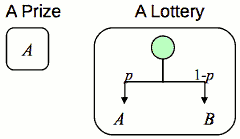s


Intuitively, the principle of Maximum Expected Utility (MEU) seems like a reasonable way to make decisions, but it is by no means obvious that it is the only rational way.

After all, why should maximizing the average utility be so special? What's wrong with an agent that maximizes the weighted sum of the cubes of the possible utilities, or tries to minimize the worst possible loss?  Could an agent act rationally just by expressing preferences between states, without giving them numeric values? Finally, why should a utility function with the required properties exist at all? 

These questions can be answered by writing down some constraints on the preferences that a rational agent should have and then showing that the MEU principle can be derived from the constraints. We use the following notation to describe an agent's preferences:

We use the following notation to describe an agent's preferences:

 NOTATION | preference 
--- | --- 
  A ≻ B  | the agent prefers A over B
  A ~ B | the agent is indifferent between A and B
  A ≻= B | the agent prefers A over B , or is indifferent between them

现在显而易见的问题是，什么样的东西是A和B? 
他们可能是世界的状态，但往往不确定的是什么是真正提供的。 例如，提供意大利面菜或鸡的航空公司,乘客不知道在锡箔盖下方潜藏着什么。

The pasta could be delicious or congealed, the chicken juicy or overcooked beyond recognition. 
We can think of the set of outcomes for each action as a ***lottery*** -- think of each action as a ticket. A lottery ***L*** with possible outcomes S₁,...,S<sub>n</sub> , that occur with probabilities p₁,...,p<sub>n</sub> is writte

```
L = [p₁,S₁; p₂,S₂; ... ; pn,Sn]
```

In general, each outcome Sᵢ of a lottery can be either an atomic state or another lottery. 

---

for example 0,1,2 ice cream scoops ,it has to have preferences among them called prizes, specific outcomes.  A and B might   be various numbers of scoops. we have to have preference among the prizes. but we also have to be able to order our preferences among the lotteries , which are situations where you're not sure which prize are going to get and not shown here. 

prizes are atomic outcomes and your lotteries which are mixtures with a certain probability. 

so there lotteries and prizes  we must have preference, means an agent has to prefer one of the other.  and the question is just other utilities that reflect those preferences.


<h2 id="63000348f12e5505f8ea8b0b2b208698"></h2>

## Rationality

<h2 id="1e6df6b0bb22997a095d015d4ac31630"></h2>

### Rational Preferences

- We want some constraints on preferences before we call them rational, such as:
    - Axiom of Transitivity: `(A≻B)∧(B≻C)⇒ (A≻C)` 


There is a wide variety of preferences that are ok : maybe the agent wants to make money, maybe the agent want to spend money , maybe agent like ice cream , maybe agent hate ice cream , these are all prefectly good preferences. 

But there are certain kinds of preferences just make no sense and so we need to constraints.  Here's one constraint the axiom of transitivity 传递性公理.This says if you prefer A to B and you prefer B to C , you better prefer A to C. 

For example : an agent with intransitive preferences can be induced to give away all of its money .
    
Suppose that the agent has the nontransitive preferences A≻B≻C≻A, where A, B, and C are goods that can be freely exchanged. If the agent currently has A, then we could offer to trade C for A plus one cent. The agent prefers C, and so would be willing to make this trade. We could then offer to trade B for C, extracting another cent, and finally trade A for B. This brings us back where we started from, except that the agent has given us three cents. We can keep going around the cycle until the agent has no money at all. Clearly, the agent has acted irrationally in this case.

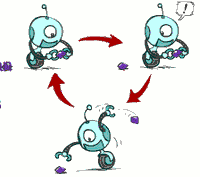


---

The primary issue for utility theory is to understand how preferences between complex lotteries are related to preferences between the underlying states in those lotteries. 
To address this issue we list six constraints that we require any reasonable preference relation to obey:


- Orderability
    - (A≻B)∨(B≻A)∨(A~B)
    - given any 2 lotteries , a rational agent must either prefer one to ther other , or else rate the two as equally preferable.
    - that is , the agent cannot avoid deciding.
- Transitivity 
    - (A≻B)∧(B≻C)⇒ (A≻C)
    - given any 3 lotteries , if an agent prefers A to B and prefers B to C , then the agent must prefer A to C
- Continuity
    - A≻B≻C ⇒ ∃p[p,A; 1-p,C] ~ B
    - if some lottery B is between A and C in preference , then there is some probability *p* for which the rational agent will be indifferent between getting B for sure and the lottery that yields A with probability *p* and C with probability *1-p* .
- Substitutability
    - A~B ⇒ [p,A; 1-p,C] ~ [p,B; 1-p,C]
    - if an agent is indifferent between two lotteries A and B , then the agent is indifferent betwwen two more complex lotteries that are the same except that B is substituted for A in one of them. This holds regardless of the probabilities and the other outcome(s) in the lotteries.
- Monotonicity 单调性
    - A≻B ⇒ (p≥q ⇔ [p,A; 1-p,B] ≻= [q,A; 1-q,B]) 
    - suppose 2 lotteries have the same two possible outcomes, A and B. If an agent prefers A to B , then the agent must prefer the lottery that has a higher probability for A (and vice versa)
    - you prefer more A in the mix

These constraints are known as the axioms of utility theory. 
 
Each axiom can be motivated by showing that an agent that violates it will exhibit patently irrational behavior in some situations. 在某些情况下违反这些公理的agent会表现出不合理的行为。 For example, we can motivate transitivity by making an agent with nontransitive preferences give us all its money. 比如上面的 robot例子。

---

- Theorem: Rational preferences imply behavior describable as maximization of expected utility

Basically if you accept these axioms there is an theorem  says all of your preferences can be described with the utiity function. 
So if you obey these axioms we give you the stamp of rationality. and that means the preferences violate these are irrational preferences and meet this irrational. 

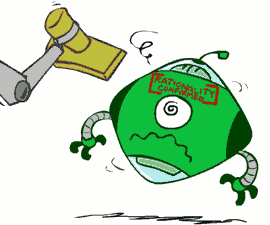

<h2 id="6128ac98c4876851331c1db2897f6253"></h2>

### MEU Principle

**Preferences lead to utility**

Notice that the axioms of utility theory are really axioms about preferences--they say nothing about a utility function. 
But in fact from the axioms of utility we can derive the following consequences :

- Existence of Utility Function
    - U(A)>U(B) ⇔ A≻B
    - U(A)=U(B) ⇔ A=B
    - U(A)≥U(B) ⇔ A≻=B
    - If an agent's preferences obey the axioms of utility, then there exists a function U such that U(A) > U(B) if and only if A is preferred to B, and U(A) = U(B) if and only if the agent is indifferent between A and B.
- Expected Utility of a Lottery:
    - `U[p₁,S₁; p₂,S₂; ... ; pn,Sn] = ΣpᵢU(Sᵢ)`.
    - The utility of a lottery is the sum of the probability of each outcome times the utility of that outcome.

In other words, once the probabilities and utilities of the possible outcome states are specified. the utility of a compound lottery involving those states is completely determined. 

- I.e. values assigned by U preserve preferences of both prizes and lotteries!

- Maximum expected utility (MEU) principle:
    - Choose the action that maximizes expected utility
    - Note: an agent can be entirely rational (consistent with MEU) without ever representing or manipulating utilities and probabilities
    - E.g., a lookup table for perfect tic-tac-toe, a reflex vacuum cleaner


<h2 id="21657c7363e3c0a908c10915dce59712"></h2>

### Utility Scales

- Normalized utilities: u+ = 1.0, u- = 0.0
- Micromorts: one-millionth chance of death, useful for paying to reduce product risks, etc.
- QALYs: quality-adjusted life years, useful for medical decisions involving substantial risk
    - QALY, or quality-adjusted life year. Patients with a disability are willing to accept a shorter life expectancy to be restored to full health. For example. kidney patients on average are indifferent between living two years on a dialysis machine and one year at full health.
- Note: behavior is invariant under positive linear transformation
    - with a positive linear transformation of leaf values , i.e., transforming a value x to ax + b where a > 0, the choice of move remains unchanged in a game tree, even when there are chance nodes.
- With deterministic prizes only (no lottery choices), only ordinal utility can be determined, i.e., total order on prizes


<h2 id="bdd76b2b194dadbe5e0a331ee46a45fd"></h2>

### The utility of money

Suppose you have triumphed over the other competitors in a television game show. 

The host now offers you a choice: either you can take the $1,000,000 prize or you can gamble it on the flip of a coin. If the coin comes up heads, you end up with nothing, but if it comes up tails, you get $2,500,000. If you're like most people, you would decline the gamble and pocket the million. Are you being irrational?

Assuming the coin is fair, the ***expected monetary value*** (EMV) of the gamble is 0.5\*($) + 0.5\*($2,500,000) = $1,250,000, which is more than the original $1,000,000. But that does not necessarily mean that accepting the gamble is a better decision. 

Suppose we use S<sub>n</sub> to denote the state of possessing total wealth $<sub>n</sub>, and that your current wealth is $<sub>k</sub>. Then the ***expected utilities*** of the two actions of accepting and declining the gamble are

- EU(Accept) = 0.5·U(S<sub>k</sub>) + 0.5·U(S<sub>k + 2,500,000</sub>)
- EU(Reject) = U(S<sub>k + 1,000,000</sub>)

To determine what to do, we need to assign utilities to the outcome states.Utility is not directly proportional to monetary value, because the utility for your **first million is very high** (or so they say), whereas the utility for an additional million is smaller.

Suppose you assign a utility of 5 to your current financial status (Sk), a 9 to the state S<sub>k + 2,500,000</sub> , and an 8 to the state S<sub>k + 1,000,000</sub> .  Then the rational action would be to decline, because the expected utility of accepting is only 7 (less than the 8 for declining). On the other hand, a billionaire 亿万富翁  would most likely have a utility function that is locally linear over the range of a few million more, and thus would accept the gamble.

----

- Money does not behave as a utility function, but we can talk about the utility of having money (or being in debt)
- Given a lottery L = [p, $X; (1-p), $Y]
    - The ***expected monetary value*** EMV(L) is p\*X + (1-p)\*Y
        - eg. L = [0.6,$0; 0.4,$100] , EMV(L) = 40
    - U(L) = p\*U($X) + (1-p)\*U($Y)
        - compute U(L) need know U($0) and U($100)
        - ***keep in mind:  U([p,A; 1-p,B]) is NOT equal U(pA + (1-p)B)***
    - Typically, U(L) < U( EMV(L) )
    - In this sense, people are risk-averse
    - When deep in debt, people are risk-prone

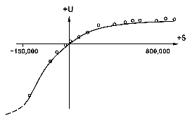

The value an agent will accept in lieu of a lottery is called the ***certainty equivalent*** of the lottery. 

Example:

Consider the utility function shown below.

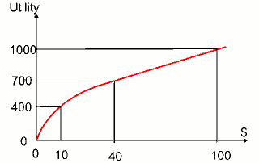

Under the above utility function, what is the certainty equivalent monetary value in dollars ($) of the lottery [0.6,$0; 0.4,$100] ?

Solve: 

- U([0.6,$0; 0.4,$100]) = 0.6 \* U($0) + 0.4 \* U($100) = 0.6 \* 0 + 0.4 \* 1000 = 400.
- because U($10) = 400 , so the certainty equivalent monetary value is **10** .

---

Function Graph of risk behavior 

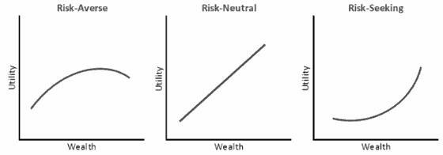

---


<h2 id="dad93deae38068bd9b575b9c56b23afe"></h2>

### Example: Insurance

- Consider the lottery [0.5, $1000;  0.5, $0]
    - What is its expected monetary value?  ($500)
    - What is its certainty equivalent?
        - Monetary value acceptable in lieu of lottery
        - $400 for most people
- Difference of $100 is the insurance premium
    - There’s an insurance industry because people will pay to reduce their risk
    - If everyone were risk-neutral, no insurance needed!
- It’s win-win: you’d rather have the $400 and the insurance company would rather have the lottery (their utility curve is flat and they have many lotteries)
    - People would rather pay a small insurance premium than gamble the price of their house against the chance of a fire.
    - From the insurance company's point of view, the price of the house is very small compared with the firm's total reserves. This means that the insurer's utility curve is approximately linear over such a small region, and the gamble costs the company almost nothing.


<h2 id="f0a715611d4f38f774d419d0be398be6"></h2>

## Example: Human Rationality ?

Decision theory is a **normative theory**: it describes how a rational agent should act.

A descriptive theory, on the other hand, describes how actual agents -- for example, humans really do act. 

The application of economic theory would be greatly enhanced if the two coincided, but there appears to be same experimental evidence io the contrary.
The evideine suggests that humans are "predictably irrational".

The best-known problem is the Allais paradox (Allais, 1953). People are given a choice between lotteries A and B and thcn between C and D, which have the following prizes:

```
A : 80% chance of $4000     C : 20% chance of $4000 
B : 100% chance of $3000    D : 25% chance of $3000
```

Most people consistently prefer B over A (taking the sure thing), and C over D (taking the higher EMV).  The normative analysis disagrees? 

In that case, then B ≻ A implies that U($3000) > 0.8 U($4000), whereas C ≻ D implies exactly the reverse. In other words, there is no utility function that is consistent with these choices.

One explanation for the apparently irrational preferences is the **certainty effect** : people are strongly attracted to gains that are certain. There are several reasons why this may be so.

First, people may prefer to reduce their computational burden; by choosing certain outcomes, they don't have to compute with probabilities. But the effect persists even when the computations involved are very easy ones. Second, people may distrust the legitimacy of the stated probabilities. 
Third, people may be accounting for their emotional state as well as their financial state. People know they would experience regret if they gave up a certain reward (B) for an 80% chance at a higher reward and then lost. In other words, if A is chosen, there is a 20% chance of getting no money and feeling like a complete idiot, which is worse than just getting no money. 

So perhaps people who choose B over A and C over D are not being irrational; they are just saying that they are willing to give up $200 of F.MV to avoid a 20% chance of feeling like an idiot.


