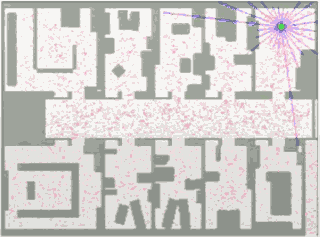
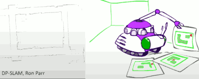
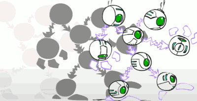
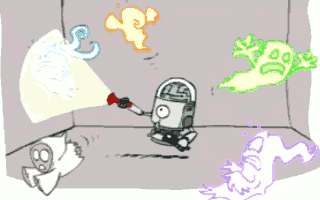
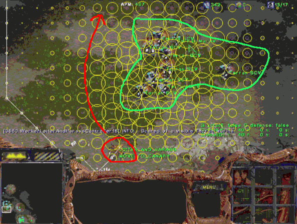
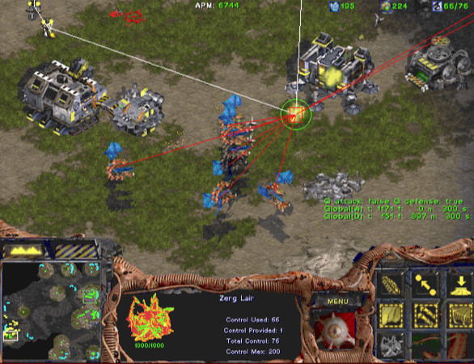
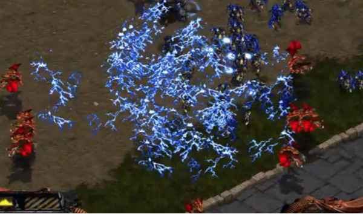
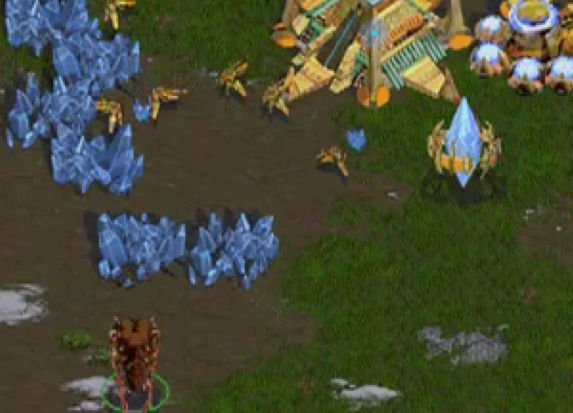

...menustart

- [Application](#e498749f3c42246d50b15c81c101d988)
    - [Robot Localization](#cb8f3326ecf05b343100368b1fce61b4)
    - [Robot Mapping](#456efe59f69acce2f3949ed5ec0af420)
        - [Dynamic Bayes Nets](#454b37c010b6257ca4e55d1017b11b5f)
    - [Starcraft](#8a6f8fa384efc23dcdcc19e7384bdc45)
        - [Why is Starcraft Hard?](#1fb75cfb7fe7923ca2bab57e2ebead57)
        - [The Berkeley Overmind](#8ae5d98a904e4bd489a504ec2b2154da)
        - [Search for Pathing](#b5c737bc93e07f225f5df7fc55d33245)
        - [Minimax for Targeting](#6f47e9d670285b5ac6e4db3ff10372d1)
        - [Machine Learning for Micro Control](#561c4a6fa7b27afca6a8b0eb8bf58887)
        - [Inference / VPI / Scouting](#85068d975072cc7193a0e53faa6e51ec)

...menuend

<h2 id="e498749f3c42246d50b15c81c101d988"></h2>

# Application 

<h2 id="cb8f3326ecf05b343100368b1fce61b4"></h2>

## Robot Localization

- We know the map, but not the robot's position
- Observations may be vectors of range finder readings
- State space and readings are typically continuous( works basically like a very fine grid ) and so we cannot store B(X)
- Particle filtering is a main technique.

You'll notice that **the number of particles is adaptive**. You start with a bunch of particles(40000) because you have to cover all these hypotheses (all positions). But once you basically know where you are, you can just keep a cloud of hypotheses around you. You just blanket your nearby area with random samples( 100-1000 ).

But you got to be really careful, remember that lone particle?

<h2 id="456efe59f69acce2f3949ed5ec0af420"></h2>

## Robot Mapping

- SLAM: Simultaneous Localization And Mapping
    - We do not know the map or our location
        - This is where your hypothesis is not "I'm here on a known map", but "I'm here and I think the map looks like this". So you don't know the map.
    - State consists of position AND map!
        - Each particle is a map that you are drawing with a dot on it.
        - Instead of a grid of these things, there's some high dimensional space of maps and dots on them.
    - Main techniques: Kalman filtering(Gaussian HMMs) and particle methods.

<h2 id="454b37c010b6257ca4e55d1017b11b5f"></h2>

### Dynamic Bayes Nets

- We want to track multiple variables over time, using multiple sources of evidence.
    - 
- Idea: repeat a fixed Bayes net structure at each time
- Variables from time *t* can condition on those from *t-1*.

<h2 id="8a6f8fa384efc23dcdcc19e7384bdc45"></h2>

## Starcraft

<h2 id="1fb75cfb7fe7923ca2bab57e2ebead57"></h2>

### Why is Starcraft Hard?

- The game of Starcraft is:
    - Adversarial
    - Long Horizon
    - Partially Observable
        - that's the fog of war 
    - Realtime
    - Huge branching factor
    - Concurrent
        - you have a lot of choices that you can command at the same time 
        - so your braching factor is huge for your actions because you have a lot of units that could be doing something at any given time 
    - Resource-rich
    -  …
- No single algorithm (e.g. minimax) will solve it off-the-shelf!
    

<h2 id="8ae5d98a904e4bd489a504ec2b2154da"></h2>

### The Berkeley Overmind

- Search: path planning
- CSPs: base layout
- Minimax: targeting
- Learning: micro control
- Inference: tracking units
    - sending scouts to gather evidence
- Scheduling: resources
    - think about what resources you need in which order you need to generate them to be successful 
    - it is essentially constraint satisfaction problem solving
- Hierarchical control
    - plan at different layers 
    - at a high level you plan maybe what you're going to build next and so forth
    - at a low level you then instantiate how you build it , what resources you need and so forth 

<h2 id="b5c737bc93e07f225f5df7fc55d33245"></h2>

### Search for Pathing

- you are the red unit , the greens are enemy 
- you wanna arrive to top-up screen
- What's problem here ?
    - the shortest path is very a deadly path
- this is al search , this is planning ahead , that doesn't just have a cost for length of the path, but also a cost for how dangerous 

 
<h2 id="6f47e9d670285b5ac6e4db3ff10372d1"></h2>

### Minimax for Targeting

In this game there are many things you might want to target.  There are production units can produce new unit , there are battle units that can damage you, ...  

The question is how I decide what to do ?   This is a minimax problem.  

<h2 id="561c4a6fa7b27afca6a8b0eb8bf58887"></h2>

### Machine Learning for Micro Control

Reinforcemeng learning used a policy search.

This is repreentation for path planing called "potential fields".  What you do in potential fields is that with anything that's on the map you associate a repelling cost or an attracting. So there is a repelling force or an attracting force. 

So at any given location , you can see what is the force field on you and that will pull or push you in a centain direction. 

Now it's difficult to design those force fields to behave well because you need to trade off how powerful each of these forces are how quickly they decay as a function of distance and so forth.

That's a lot like learning a set of ways for a feature vector.  So your policy is encoded as a force field there's a weighting between the different contributions to the force filed and then you can run reinforcement learning to learn the weighting that gives you the best performance.  So you multiple runs you have certain weighting and see what happends then you change the weighting a little bit. If the result are better  you keep the new weighting, if the result are worse you go back to the old weighting and keep repeating this. 

<h2 id="85068d975072cc7193a0e53faa6e51ec"></h2>

### Inference / VPI / Scouting

It's really interesting to know what the other units what the other player is doing. So what you want to build depends on what the enemy builds.  

You never get to see their plan because you can not see in their mind. But you might see some information  about what they're doing. 

---

