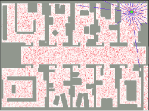
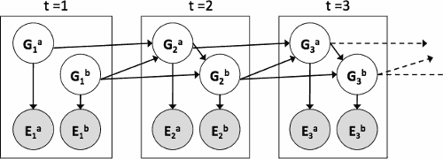
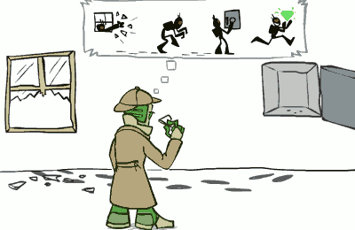
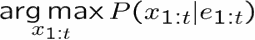
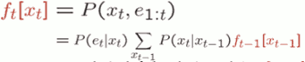
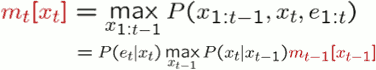

- [Application Of HMM](#707c429b9c8c69d66ffa62008078d67c)
    - [Robot Localization](#cb8f3326ecf05b343100368b1fce61b4)
    - [Robot Mapping](#456efe59f69acce2f3949ed5ec0af420)
    - [Dynamic Bayes Nets (DBNs)](#e2237c4bb83f0a39f439746f01a1814f)
        - [DBN Particle Filters](#8b6016f7e9c11348859d14b1b2968de6)
    - [Most Likely Explanation](#acde5ccfd9d402faf86e320b802cdf2e)
        - [HMMs: MLE Queries](#a6f1a19a2e48162ea4decdd5eebe0d71)
        - [State Trellis](#9505b7524724df56002d7434a8ab6d4d)
        - [Forward / Viterbi Algorithms](#d1b64f8404dac1019eb7a414a8e5f21c)

<h2 id="707c429b9c8c69d66ffa62008078d67c"></h2>

# Application Of HMM

<h2 id="cb8f3326ecf05b343100368b1fce61b4"></h2>

## Robot Localization 

- We know the map, but not the robot’s position
- Observations may be vectors of range finder readings
- State space and readings are typically continuous (works basically like a very fine grid) and so we cannot store B(X)
- Particle filtering is a main technique

You'll notice that **the number of particles is adaptive**. You start with a bunch of particles(40000) because you have to cover all these hypotheses (all positions). But once you basically know where you are, you can just keep a cloud of hypotheses around you. 

That is , With more evidence collected, a large number of particles are gathered in one place, then the number of particles can be reduced during resample.

You just blanket your nearby area with random samples( 100-1000 ).

But you got to be really careful, remember that lone particle?

<h2 id="456efe59f69acce2f3949ed5ec0af420"></h2>

## Robot Mapping

- SLAM: Simultaneous Localization And Mapping
    - We do not know the map or our location
        - This is where your hypothesis is not "I'm here on a known map", but "I'm here and I think the map looks like this". So you don't know the map.
    - State consists of position AND map!
        - Each particle is a map that you are drawing with a dot on it.
        - Instead of a grid of these things, there's some high dimensional space of maps and dots on them.
    - Main techniques: Kalman filtering(Gaussian HMMs) and particle methods.

---

<h2 id="e2237c4bb83f0a39f439746f01a1814f"></h2>

## Dynamic Bayes Nets (DBNs)

DBNs are a special form of HMM. At each time it can be **more than one variable** that's in the **state** and **more than one variable** that's in the **evidence**. 

So you could have 2 ghosts , each of them has own state variable -- their location, and each of them has their own evidence variable -- something noise about where they might be. 

Then as time passes somehow the way to transition to next time where they might be is related. Ghost B might decide where to go based on where ghost A is. Same for ghost A. 

---

- We want to track multiple variables over time, using multiple sources of evidence
- Idea: Repeat a fixed Bayes net structure at each time
- Variables from time t can condition on those from t-1
- Dynamic Bayes nets are a generalization of HMMs

You can think Gtª , Gtᵇ combined as a big state, and think Etª , Etᵇ combined as a big evidence , then it would be a HMM again. But you would be ignoring the structure that's underneath.  And exploiting structure underneath allows you to become additonally more efficient.

<h2 id="8b6016f7e9c11348859d14b1b2968de6"></h2>

### DBN Particle Filters

You can again run particle filtering in these. 

- A particle is a complete sample for a time step
    - you don't have a particle per ghost , you have **a particle for the entire state**. there's 2 ghosts , one particle encodes location of both ghosts.
- Initialize: Generate prior samples for the t=1 Bayes net
    - Example particle: G₁ª = (3,3) G₁ᵇ = (5,3)
- Elapse time: Sample a successor for each particle 
    - Example successor: G₂ª = (2,3) G₂ᵇ = (6,3)
- Observe: Weight each ***entire*** sample by the likelihood of the evidence conditioned on the sample
    - Likelihood: P(E₁ª |G₁ª ) * P(E₁ᵇ |G₁ᵇ ) 
- Resample: Select prior samples (tuples of values) in proportion to their likelihood

Why is it important that your particles contain both ghost at once? You can imagine running 2 separate particle filtering, one for ghost A, one for ghost B. If you were to do that then you can not model the dependency. Your distribution will not represent the joint between the two ghosts. 

---

<h2 id="acde5ccfd9d402faf86e320b802cdf2e"></h2>

## Most Likely Explanation

New technique that actually in practice can be quite important. It's a different way of doing inference. 

So far what we've looked at is something that computes the distribution over possible states at the current time , given all the evidence we've seen so far.

Sometimes what you want to do is you see all the evidence, and based on all the evidence you've seen, you want to reconstruct the most likely sequence of events that explains that whole sequence of evidence.  What is the most likely sequence of states given the evidence I have observed ?

<h2 id="a6f1a19a2e48162ea4decdd5eebe0d71"></h2>

### HMMs: MLE Queries

- HMMs defined by
    - States X
    - Observations E
    - Initial distribution: P(X₁)
    - Transitions: P(X | Xx-1)
    - Emissions: P(E|X)

We're given an HMM still , and the query is what's the most likely explanation of the evidence we have observed. 

- New query: most likely explanation:
    - 
    - we're trying to find what the most likely sequence of X variables. 
- New method: the Viterbi algorithm

<h2 id="9505b7524724df56002d7434a8ab6d4d"></h2>

### State Trellis

- State trellis: graph of states and transitions over time
    - ![][1]
    - evidence does not showed on this picture
- Each arc represents some transition: xt-1 → xt
- Each arc has weight: P( xt|xt-1 )·P(et | xt )
    - the weight of red arc is : P(rain|sun)·P(e₂|rain)
- Each path is a sequence of states
    - then you can start looking at path in this graph.
    - each path encodes the sequence of states , there are many many paths
- The product of weights on a path is that **sequence’s probability** along with the evidence
    - if you multiply the weights, to put each of these edges together, for a given path, that gives us the probability of that particular state sequence jointly with the evidence. 
    - the path with highest probability, is the most likely explanation of the sequence of evidence we observe
- Forward algorithm computes sums of paths, Viterbi computes best paths

There are many paths 2ᴺ. So we don't want to do this naive enumeration of all paths. I wanna do something more efficient, and it'll be very similar to the forward algorithm. But in principle the naive approach would find you the correct solution just expensive.

<h2 id="d1b64f8404dac1019eb7a414a8e5f21c"></h2>

### Forward / Viterbi Algorithms

![][1]

- Forward Algorithm (Sum)
    - 
    - recursive computation 
    - we keep track of the probability of xt jointly with all the evidence so far. We could compute that from the same form at the previous time as **ft-1[xt-1]**
- Viterbi Algorithm (Max)
    - 
    - changed ∑ to max

---

 [1]: ../imgs/cs188_hmm_app_state_trellis.png

