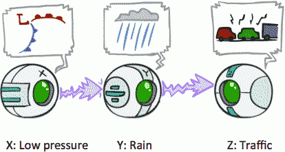
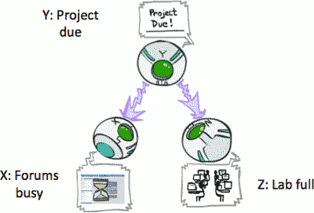
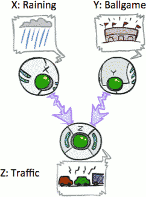
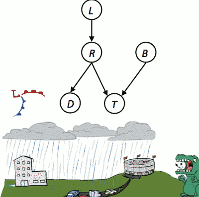
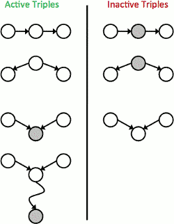
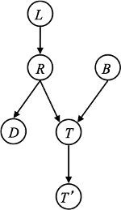
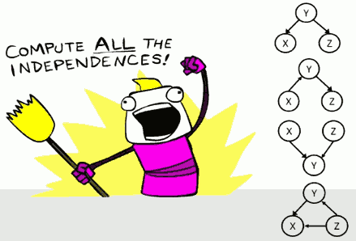
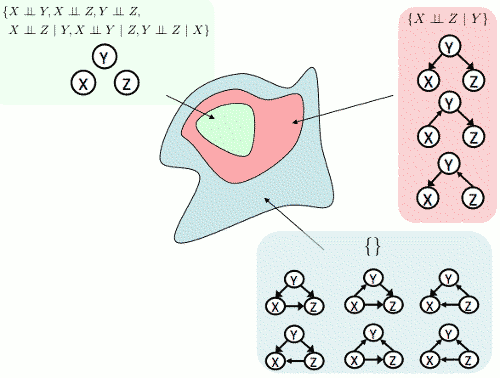
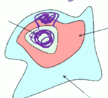

...menustart

 - [Bayes' Nets II : Independence](#ce3bc4fb33b241d8ecb14566e3cb7ce0)
     - [Recap: Bayes’ Nets](#e2dd24943ffa85789b54e75a83bbe8bd)
     - [Bayes’ Net Semantics](#4dbc391a5b44f9e161311a3fba175cc0)
     - [Size of a Bayes’ Net](#964508d9edbdf6c01844d69c96708106)
     - [Bayes Nets: Assumptions](#ef1a928c977906877d6b80e2a41e9438)
         - [Example](#0a52730597fb4ffa01fc117d9e71e3a9)
     - [Independence in a BN](#f10bd0a1b1e91ed5409df88f9b43513f)
     - [D-separation: Outline](#b744fe0bc9612fbfbc259a06f0dbd29b)
         - [Causal Chains](#ccca6bb2b201caf52ba8662d28af0169)
         - [Common Cause](#c4b2f358e8026aa99cbd43e765359c00)
         - [Common Effect](#b014052dfbaa594c59ecbab983631e40)
         - [The General Case](#e4467b9c25f4f5fa7e82de809d585fae)
             - [Reachability](#c79782e896e55b3bb238bb9a5e5b3403)
             - [Active / Inactive Paths](#12e81e928621fbaa77f76f16a1b95f98)
     - [D-separation](#f4700a89b684ee2885763c02ec03ddb8)
         - [Example](#0a52730597fb4ffa01fc117d9e71e3a9)
     - [Structure Implications](#31d6deec4e1ea27b89ee3c34bbe706d8)
     - [Topology Limits Distributions](#3a8cd9d38bf713649aa6025704704c78)
     - [Bayes Nets Representation Summary](#f3beb40b43acd62d29efb20ba1bf53d1)

...menuend


<h2 id="ce3bc4fb33b241d8ecb14566e3cb7ce0"></h2>


# Bayes' Nets II : Independence

<h2 id="e2dd24943ffa85789b54e75a83bbe8bd"></h2>


## Recap: Bayes’ Nets

 - A Bayes’ net is an efficient encoding of a probabilistic model of a domain
 - Questions we can ask:
    - Inference: given a fixed BN, what is P(X | e)?
    - Representation: given a BN graph, what kinds of distributions can it encode?
    - Modeling: what BN is most appropriate for a given domain?

<h2 id="4dbc391a5b44f9e161311a3fba175cc0"></h2>


## Bayes’ Net Semantics

 - A directed, acyclic graph, one node per random variable
 - A conditional probability table (CPT) for each node
    - A collection of distributions over X, one for each combination of parents’ values
    - P(X|a₁...a<sub>n</sub>)
 - Bayes’ nets implicitly encode joint distributions
    - As a product of local conditional distributions
    - To see what probability a BN gives to a full assignment, multiply all the relevant conditionals together:
        - P(x₁,x₂,...,x<sub>n</sub>) = ∏ⁿ<sub>i=1</sub> P(xᵢ|parent(Xᵢ) )

<h2 id="964508d9edbdf6c01844d69c96708106"></h2>


## Size of a Bayes’ Net

 - How big is a joint distribution over N Boolean variables?
    - 2ᴺ
 - How big is an N-node net if nodes have up to k parents?
    - O(N \* 2ᵏ⁺¹)
 - Both give you the power to calculate joint distribution
 - BNs: Huge space savings!  Also easier to elicit local CPTs
    - Also faster to answer queries (coming)    

<h2 id="ef1a928c977906877d6b80e2a41e9438"></h2>


## Bayes Nets: Assumptions

 - Assumptions we are required to make to define the Bayes net when given the graph:
    - P(xᵢ |x₁,...,x<sub>i-1</sub>) = P(xᵢ|parent(Xᵢ) ) 
 - Beyond above “chain rule → Bayes net” conditional independence assumptions 
    - Often additional conditional independences
    - They can be read off the graph
 - Important for modeling: understand assumptions made when choosing a Bayes net graph

<h2 id="0a52730597fb4ffa01fc117d9e71e3a9"></h2>


### Example

 - (X) → (Y) → (Z) → (W)
 - Conditional independence assumptions directly from simplifications in chain rule:
    - P(X,Y,Z,W) 
        - = P(X)·P(Y|X)·P(Z|X,Y)·P(W|X,Y,Z) 
        - = ***P(X)·P(Y|X)·P(Z|Y)·P(W|Z)*** 
    - from the fomular , we get:
        - Z⫫X |Y
        - W⫫(X,Y) |Z
 - Additional implied conditional independence assumptions?
    - W⫫X |Y

P(W|X,Y) =?= P(W|Y) ?

 P(W,X,Y)/P(X,Y) 

= ∑<sub>z</sub> **P(X)·P(Y|X)**·P(Z|Y)·P(W|Z) / **P(X)·P(Y|X)** 

= ∑<sub>z</sub> P(Z|Y)·P(W|Z)    // 和Z无关项 约分约掉

= ∑<sub>z</sub> P(Z **|Y**)·P(W|Z, **Y**)  // ?

now Y shared everywhere.  product rule 的 |Y 版本  

= ∑<sub>z</sub> P(Z,W|Y) 

= P(W|Y) . Proof!

---

Math proof is annoying !  So what we're going to look at now is a way to read it off directly from the graph structure. 

---

<h2 id="f10bd0a1b1e91ed5409df88f9b43513f"></h2>


## Independence in a BN

 - Important question about a BN:
    - Are two nodes independent given certain evidence?
    - If yes, can prove using algebra (tedious in general)
    - If no, can prove with a counter example
    - Example: (X) → (Y) → (Z)  
 - Question: are X and Z necessarily independent?
    - Answer: no.  Example: low pressure causes rain, which causes traffic.
    - X can influence Z, Z can influence X (via Y)
    - Addendum: they ***could*** be independent: how?
        - independence is possible , just by a special choice. eg. flip coin.  always be a uniform distribution.
        - but the question is : Is independence guaranteed ?

<h2 id="b744fe0bc9612fbfbc259a06f0dbd29b"></h2>


## D-separation: Outline

 - Study independence properties for triples
 - Analyze complex cases in terms of member triples
 - D-separation: a condition / algorithm for answering such queries

<h2 id="ccca6bb2b201caf52ba8662d28af0169"></h2>


### Causal Chains 

 - This configuration is a “causal chain”
    - 
    - P(x,y,z) = P(x)P(y|x)P(z|y)
 - Guaranteed X independent of Z ?   **No!**
 - Guaranteed X independent of Z given Y?  **Yes!**
    - **Evidence along the chain “blocks” the influence** !

```
P(z|x,y) = P(x,y,z) / p(x,y)
         = P(x)P(y|x)P(z|y) / ( P(x)P(y|x) )
         = P(z|y)
```

<h2 id="c4b2f358e8026aa99cbd43e765359c00"></h2>


### Common Cause

 - This configuration is a “common cause”
    - 
    - P(x,y,z) = P(y)P(x|y)P(z|y) 
 - Guaranteed X independent of Z ?   **No!**
 - Guaranteed X and Z independent given Y?  **Yes!**
    - **Observing the cause blocks influence between effects**.

```
P(z|x,y) = P(x,y,z) / p(x,y)  
         = P(y)P(x|y)P(z|y) / ( P(y)P(x|y) )
         = P(z|y)  
```

<h2 id="b014052dfbaa594c59ecbab983631e40"></h2>


### Common Effect

 - Last configuration: two causes of one effect (v-structures)
    - 

 - Are X and Y independent?
    - **Yes**: the ballgame and the rain cause traffic, but they are not correlated
    - that is the basic assumptions of BNs : Xᵢ is independent of its preceding variables X₁ ... X<sub>i-1</sub> , except its parents Pa(X₁) , given its parents | Pa(X₁)
    - for X,Y,Z , Y is independent of it's preceding variables, which is X , minus its parents , wich is ∅ , so Y is independent of X and then given the parents , which is empty set ∅ 
        - Y⫫X | ∅

P(x,y,z) = P(x)P(y)P(z|x,y)

∑<sub>z</sub> P(x,y,z) = ∑<sub>z</sub> P(x)P(y)P(z|x,y) 

∑<sub>z</sub> P(x,y,z) = P(x)P(y) · ∑<sub>z</sub> P(z|x,y) 

∑<sub>z</sub> P(x,y,z) = P(x)P(y) · 1

--- 

 - Are X and Y independent given Z?
    - **No**: seeing traffic puts the rain and the ballgame in competition as explanation.
    - 如果有 traffic , 如果 没下雨，那很高概率有球赛, 如果下雨了，有球赛的概率就会下降
 - **This is backwards from the other cases**
    - Observing an effect **activates** influence between possible causes.


<h2 id="e4467b9c25f4f5fa7e82de809d585fae"></h2>


### The General Case

 - General question: in a given BN, are two variables independent (given evidence)?
 - Solution: analyze the graph
 - Any complex example can be broken into repetitions of the three canonical cases

<h2 id="c79782e896e55b3bb238bb9a5e5b3403"></h2>


#### Reachability



 - Recipe: shade evidence nodes, look for paths in the resulting graph
 - Attempt 1: if two nodes are connected by an undirected path not blocked by a shaded node, they are conditionally independent
    - to check whether there is a path between 2 variables
    - then we check whether that path is blocked by something being observed along the path 
 - Almost works, but not quite
    - Where does it break?
    - Answer: the v-structure at *T* (RBT) doesn’t count as a link in a path unless “active”


<h2 id="12e81e928621fbaa77f76f16a1b95f98"></h2>


#### Active / Inactive Paths


- Question: Are X and Y conditionally independent given evidence variables {Z}?
    - Yes, if X and Y “d-separated” by Z
    - Consider all (undirected) paths from X to Y
    - No active paths = independence!
- A path is active if each triple is active:
    - Causal chain A → B → C where B is unobserved (either direction)
    - Common cause A ← B → C where B is unobserved
    - Common effect (aka v-structure)
        - A → B ← C where B or **one of its descendents** is observed
        - for last one of active triples, if the children are just deterministic copies of their parents , then observing the variable at the bottom is the same as observing the the variable up there. 
        - so we're in the same scenario we've shown that influence can propagate.
- All it takes to block a path is a single inactive segment




- Typically, when a node is shaded, it'll block the path. But the exception is when it's one of those V-structures. where it will actually activate the path rather than block it.

- Look the bottom *active* one
    - This one is saying, if I have a common effect, or there's multiple things that could cause something, it's not just the case that influence can travel in the above scenario  `X-> evidence <-Y`, but the evidence that we observe can also be much further down.

- for a long path
    - we look at every triple along the path 
    - if every triple along the path is active , we have an active path
    - if one of the triples along the path is not active , we have an inactive path. 
    - eg. (A) → (B) → (C) → (D) → (E) → (F)
        - you should check all possible triples 
        - ABC, BCD, CDE , DEF
        - then check the middle point in every triple

---

<h2 id="f4700a89b684ee2885763c02ec03ddb8"></h2>


## D-separation

 - Query: Xᵢ ⫫ Xⱼ | { X<sub>k1</sub> , ... , X<sub>kn</sub> } ?
 - Check all (undirected!) paths between Xᵢ and Xⱼ 
    - If one or more active, then independence not guaranteed
        - Xᵢ not ⫫ Xⱼ | { X<sub>k1</sub> , ... , X<sub>kn</sub> } 
    - Otherwise (i.e. if all paths are inactive), then independence is guaranteed
        - Xᵢ ⫫ Xⱼ | { X<sub>k1</sub> , ... , X<sub>kn</sub> } 

<h2 id="0a52730597fb4ffa01fc117d9e71e3a9"></h2>


### Example 



 - L ⫫ T' | T   **Yes** 
    - LR(T)  this triple doesn't matter.
    - LR(T)T'  
 - L ⫫ B    **Yes**
    - LRT 
    - RTB is inactive , make that whole path inactive 
 - L ⫫ B | T 
    - LR(T) , this is a triple where the 3rd node is observed. that actually doesn't matter. we look at triples all that matters the middle node observed or not.
        - the triple LR(T) , we talked about the influence propagating through R or not. We're not worring abouth these side nodes.
        - so here the influence will propagate to R , the causal chain is active. 
    - R(T)B is active
 - L ⫫ B | T' 
    - LRT  active
    - RTB ~ (T')  active 
 - L ⫫ B | T,R   **Yes**
    - L(R)(T)   inactive
    - no need to check the 2nd triple 
 
<h2 id="31d6deec4e1ea27b89ee3c34bbe706d8"></h2>


## Structure Implications

We now have an algorithm called d-separation, which we step through in our heads and on the slides. But in principle, you can code in a computer program. You could write a computer program that given a Bayes net structure, and the graph finds al the paths, along each path checks the triplets and then checkes whether or not each triple is active. And the Bayes Net decides whether or not there exists an active path. And if there is an active path, then it says, can not claim anything. If there is no active path, it says independence.

- Given a Bayes net structure, can run d-separation algorithm to build a complete list of conditional independences that are necessarily true of the form
    - Xᵢ ⫫ Xⱼ | { X<sub>k1</sub> , ... , X<sub>kn</sub> } 
- This list determines the set of probability distributions that can be represented 
    - What it actually does, the list that we can generate this way, if we try to look at all of them, is a list of assumptions we make by choosing a specific Bayes net struction.
    - Here is a few Bayes net structures. Let's compute all the independencies that we can claim for each of those Bayes net structures.
        - 
    - How about the 1st one ? What independencies are present there ?
        - only 1. { X ⫫ Z | Y }
    - the 2nd one
        - only 1. { X ⫫ Z | Y }
    - the 3rd one
        - { X ⫫ Z }
    - the last one
        - {} None. Because every node has all the previous nodes in the ordering as its parents.
- So one interesting thing already comes up here. If you look at these 2 bayes nets, the 1st and the 2nd, they actually end up with the same set of independencies.
    - What that means is that if you want to represent a distribution over 3 variables X,Y, and Z, that represents something in the real world, whether you use the 1st one or the 2nd one, you'll be equally capable of capturing that distribution.
    - If somebody represents it with the 1st one, you can turn that into a new Bayes net structured like the 2nd one that represents the exact same distribution.
        - Because the assumptions you make by using the structure is the same. So they can represent the same distributions, they are effectively equivalent structures. 
    - On the other hand, if somebody gives you a distribution represented by the bottom Bayes net over here, that Bayes net makes no assumptions. So it's very unlikely that if you get such a distribution, you can then represent it by any of the other Bayes nets ?
- Why do we even have both versions (the 1st and 2nd ones) if they can represent the same distributions anyway ?
    - Sometimes it's easier to specify one than the other.


<h2 id="3a8cd9d38bf713649aa6025704704c78"></h2>


## Topology Limits Distributions 

So taking a further step back,  let's look at distributions over 3 variables.




You can think of a distribution as a point in the space here.  So this space here is any point corresponds to a distribution.


- the green set (middle area) , is a subset of all distribtuions are the ones that satisfy complete independence. 
    - X,Y,Z, 0 connections.
    - where a different point in that set corresponds to a different distribution. Like maybe one distribution has probably 0.5,0.5 for each of X,Y,Z; anther onbe might be a biased coin flip for X, maybe 0.9,0.1,  and Y and Z still be 0.5,0.5; ... So any such choices will be representable by this Bayes net here and live in that small cell.
- the red set is yet something else we have one conditional dependence assumption. 
    - for any one of those three, you get the same conditional independence assumption, only 1.
    - it's also the same distributions. Any distribution represented by this first one, you can re-formulate as represented by the second one or the third one. It's interchangeable from a mathematical point of view, even if from a practical point of view, you often will still prefer one structure over another one.
- the blue set represent all distributions that is no conditional dependencies at all 
    - These are all Bayes nets that make 0 assumptions.
    - So if you use any of these Bayes net structures, you're not forced to make any assumptions. And you can represent any distribution over the 3 variables.
    - How come there is 6 of them ? It corresponds to the 6 possible ways of ordering those variables. It's like chain rule.

- Question: 
    - How about a V-shaped model ?  `X -> Y <- Z`   { X⫫Z }
    - Answer:
        - `X -> Y <- Z` { X⫫Z }, we may call it purple set,  makes less assumptions that the green set.
        - So everything that lives in the green set, purple can handle.
        - How about everything in red? This is kind of a different assumption here. These assumptions are not directly comparable.
        - So what's going to happen here is that you're going to have a purple set that have all the green included.  But we wouldn't want it to overlap with the red one. It's hard to draw. We may earse part of the red area , and colored with purple.
        - 
    - The blue one will always have them all included. Because the blue one makes no assumptions. So it can capture everything any Bayes net with less edges can represent.
        - Essentially, whenever you remove an edge, you make an assumption. When you have all the edges, you've made no assumptions.


---

- Given some graph topology G, only certain joint distributions can be encoded
- The graph structure guarantees certain (conditional) independences
- (There might be more independence)
- Adding arcs increases the set of distributions, but has several costs
- Full conditioning can encode any distribution

--

<h2 id="f3beb40b43acd62d29efb20ba1bf53d1"></h2>


## Bayes Nets Representation Summary

- Bayes nets compactly encode joint distributions
- Guaranteed independencies of distributions can be deduced from BN graph structure
- D-separation gives precise conditional independence guarantees from graph alone
- A Bayes’ net’s joint distribution may have further (conditional) independence that is not detectable until you inspect its specific distribution
    - It is possible to have independencies that your d-separation algorithm does not find, what I mean with that is that d-separation will only find the independencies that are true, no matter what numbers you put in the conditional tables. But if you put in very speical numbers in the tables, there might be additional independenciese that you cannot read off from your grap structure. Such as if you put 0.5 everywhere, then there will be complete independence, and you won't be able to read it off from your graph structure. Because the graph structure doesn't tell you there is 0.5 everywhere, it just shows you the structure of the Bayes net.
    - The trivial example to keep in mind there is every distribution uniform , where effectively you shouldn't have any parents , everything is independent. 


