...menustart

 - [Bayes' Nets: Inference](#38e014f1208386f021d316fdc47cc05e)
     - [Recap: Bayes' Net Representation](#c08ae97044cb96965599bb540763c91f)
     - [Recap: Example: Alarm Network](#93e93ad719ade4a5e39433beadf3956a)
     - [Inference](#bfc7647fbfe6e589911d2da73377b475)
     - [Inference by Enumeration](#314fa4378b3b188832e3f68fd46ac015)
     - [Inference by Enumeration in Bayes’ Net](#501eae82a1dd02d9d72cb6f324e1d35d)
     - [Inference by Enumeration vs. Variable Elimination](#703eaeb1dc68923979993136c3c56afe)
     - [Factor Zoo](#4913febebac60df104885a8b6794a63d)
         - [Factor Zoo I](#650e1a19d06f2dc4cb2b7f794e7467b2)
         - [Factor Zoo II](#ebe6338e5d98d7cb0ce41e0f40711330)
         - [Factor Zoo III](#3ab7f86e66f7b2bcc38510b416009292)
         - [Factor Zoo Summary](#b865584c7b554987faf8a85c0ecd151d)
         - [Example : Traffic Domain](#4d406eeb866d87e85043283df1c17bc7)
     - [Inference by Enumeration: Procedural Outline](#2d4159dc7049bf54b99ed3854ab30d54)
         - [Operation 1: Join Factors](#fde6f197d1413b145c1cb24a10ed58b2)
             - [Example: Multiple Joins](#44dc9c3cb61be07661f0b59c4c5eeeb7)
         - [Operation 2: Eliminate](#7e886379f4ade029f5799405307898de)
             - [Multiple Elimination](#3821c17868fa87d7f5cae10cccc3fa7e)
         - [Thus Far: Multiple Join, Multiple Eliminate (= Inference by Enumeration)](#a0254600f083a94ddd9ca563bed0427b)
         - [Marginalizing Early (= Variable Elimination)](#b82050c7b2c9df624ba985a4e613ee9f)
         - [Example:  Traffic Domain again](#cc0dd64e1b254202b05fe8934cc5e2ef)
         - [Marginalizing Early! (aka VE)](#76d28d073a991c878d917deb0c0ef923)
         - [Evidence](#c7b2a4d55fbea4d044644cf5b2b45d29)
     - [General Variable Elimination](#29338145e918c543db5115601ceedae4)
         - [Example](#0a52730597fb4ffa01fc117d9e71e3a9)
         - [Same Example in Equations](#fac810843510c673799014b64bd703d5)
         - [Another Variable Elimination Example](#60b0a3c9ae175891ccee2e70e11f5141)
     - [Variable Elimination Ordering](#7ace6202153b69d2eaaee232c913dc52)
     - [VE: Computational and Space Complexity](#e7a5369a94522ddbfba1d7c3f326d981)
         - [Worst Case Complexity?](#c2d228ff5891fce6cd51dc9df9953ed6)
     - [Polytrees](#3210fceb43cd33c7a8871b75e98de3ee)
     - [Quiz](#ab458f4b361834dd802e4f40d31b5ebc)
     - [Quiz BN2-2](#25d7ce91a9821147da689c3a48401fb1)
     - [Quiz BN2-3](#74e6f31ec1cddabd42e093bb90394707)

...menuend


<h2 id="38e014f1208386f021d316fdc47cc05e"></h2>


# Bayes' Nets: Inference


<h2 id="c08ae97044cb96965599bb540763c91f"></h2>


## Recap: Bayes' Net Representation

- A directed, acyclic graph, one node per random variable
- A conditional probability table (CPT) for each node
    - A collection of distributions over X, one for each combination of parents’ values
        - P(X|a₁,...,a<sub>n</sub>)
- Bayes' nets implicitly encode joint distributions
    - As a product of local conditional distributions
    - TO see what probability a BN gives to a full assignment, multiply all the relevant conditionals together.
        - 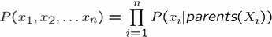


<h2 id="93e93ad719ade4a5e39433beadf3956a"></h2>


## Recap: Example: Alarm Network

![][1]

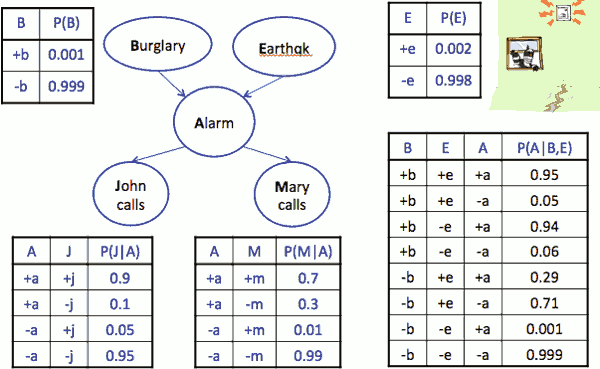

You build up the local little piececs, CPT,  and then you can answer questions of the whole distribution by assembling it from the BN.

```
  P(+b,-e,+a,-j,+m) 
= P(+b)P(-e)P(+a |+b,-e)P(-j|+a)P(+m|+a)
= 0.001 x 0.998 x 0.94 x 0.1 x 0.7
```

<h2 id="bfc7647fbfe6e589911d2da73377b475"></h2>


## Inference

- Inference: calculating some useful quantity from a joint probability distribution
    - So you image the given is some collection of probabilites. 
    - Maybe it's the whole joint probability table in all its exponential size glory. More often, it'a a bunch of conditional probabilities that define a Bayes' Net.
    - Some examples of things you might calculate from those givens are the canonical thing is a posterior probability.
    - Another classic canonical query you might do is a most likely explanation query, where you say, I have some evidence, I would like to know the most likely value of a one or more variables given that evidence.
- Examples:
    - Posterior probability
        - P( Q| E₁=e₁,...,E<sub>k</sub>=e<sub>k</sub> )
        - computing the posterior probability of some set of query variables conditioned on some evidence having been observed 
        - I care about variable Q. There's a bunch of evidence variables whose values I know and unfortunately there's going to be a bunch of other variables called hidden variables that I don't care about, and I also don't observe. And we're going to have to sum them out, and that creates a lot of time complexity.
    - Most likely explanation
        - argmax<sub>q</sub> P( Q=q | E₁=e₁...)
        - given some evidence has bee observed, what's the most likely association of some query variables.

<h2 id="314fa4378b3b188832e3f68fd46ac015"></h2>


## Inference by Enumeration

- General case
    - All variables: X₁,X₂,...,X<sub>n</sub>
        - Evidence variables: E₁,...,E<sub>k</sub> = e₁,...,e<sub>k</sub>
        - Query<sup>\*</sup> variable: Q
        - Hidden variables: H₁, ..., Hᵣ


- the first type of inference is the naive type of inference is inference by enumeration
- we have some query , and the query has 
    - some evidence variables E₁...E<sub>k</sub> , 
    - some query variables Q , the ones which we want to distribution given the evidence variables.
    - some hidden variables. H₁...H<sub>r</sub> , the ones that are not query variables , not query variables, but yet still are in our joint distribution.
        - we have to deal with them, you will have to sum them out effectively to get rid of them.
- see details in [Probability](AI_CS188_Probability.md)
- Problem with this algorithm:
    1. we don't have the giant joint distribution, we've got a Bayes Net
    2. while we could, in principle, build the giant joint distribution would be a waste of space and time.


<h2 id="501eae82a1dd02d9d72cb6f324e1d35d"></h2>


## Inference by Enumeration in Bayes’ Net

- Given unlimited time, inference in BNs is easy
    - 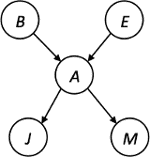
- Reminder of inference by enumeration by example:
    - P(B|+j,+m) 
        - ∝<sub>B</sub> P(B,+j,+m)
            - proportional to
            - this says these 2 things are almost equal, not actually equal.
            - but they'd be euqal if we summed up the values over b, and multiply by the inverse.
            - And so what this says if you want a conditional probability, you compute the equivalent joint probability, and then normalize.
        - = ∑<sub>e,a</sub> P(B,e,a,+j,+m)
            - now we can use the definition if the joint distribution as its specified through the Bayes net :
        - = ∑<sub>e,a</sub> P(B)P(e)P(a|B,e)P(+j|a)P(+m|a)
        - = P(B)P(+e)P(+a|B,+e)P(+j|+a)P(+m|+a) + P(B)P(+e)P(-a|B,+e)P(+j|-a)P(+m|-a) + P(B)P(-e)P(+a|B,-e)P(+j|+a)P(+m|+a) + P(B)P(-e)P(-a|B,-e)P(+j|-a)P(+m|-a)

- if we have 100 variables in the BNs , 50 of them are evidence variables,  means 50 of them not evidence variables that will look at 2⁵⁰ entries 
    - it gets very expensive,  exponential in a number of non-evidence variables ,  unless almost everything is evidence
- It's not ideal to do it this way

<h2 id="703eaeb1dc68923979993136c3c56afe"></h2>


## Inference by Enumeration vs. Variable Elimination

 - Why is inference by enumeration so slow?
    - You join up the whole joint distribution before you sum out the hidden variables
    - 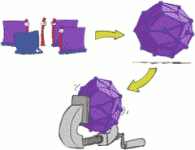
 - Idea: interleave joining and marginalizing!
    - Called "Variable Elimination"
    - Still NP-hard, but usually much faster than inference by enumeration
    - 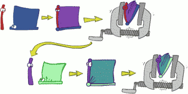
    - we'll find a way to interleave joining CPTs together and summing out over hidden variables. 
    - keep in mind it's not a silver bullet. Inference in BNs is np-hard. There are BNs where no matter what you do to compute the answer to the query is equivalent to solving a SAP(storage assignment problem) problem which is known that nobody has a efficient solution for. 
    - First we’ll need some new notation: factors

<h2 id="4913febebac60df104885a8b6794a63d"></h2>


## Factor Zoo

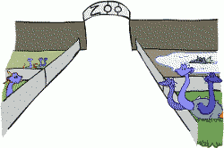

<h2 id="650e1a19d06f2dc4cb2b7f794e7467b2"></h2>


### Factor Zoo I 


- Joint distribution: P(X,Y)
    - Entries P(x,y) for all x, y
    - Sums to 1

Example: P (T,W)

T | W | P
--- | --- | --- 
hot | sun | 0.4
hot | rain | 0.1
cold | sun | 0.2
cold | rain | 0.3


- Selected joint: P(x,Y)
    - A slice of the joint distribution
    - Entries P(x,y) for fixed x, all y
    - Sums to P(x)
        - factors don't have to sum to 1

Example: P( cold , W)

T | W | P
--- | --- | --- 
cold | sun | 0.2
cold | rain | 0.3

- **Number of capitals = dimensionality of the table**
    - P(T,W) is a 2D array
    - P(cold,W) is a 1D array
    - p(cold,sun),it's still a joint probability, but now it's a 1D object as a scalar.
    - That's important. We can reduce the size of data structure without changing the semantics of what's in it.
 - So as we work in this variable elimination process , the game will be one of trying to keep the number of capitialized variables small in our factor. 

<h2 id="ebe6338e5d98d7cb0ce41e0f40711330"></h2>


### Factor Zoo II 

- Single conditional: P(Y | x)
    - Entries P(y | x) for fixed x, all y
    - Sums to 1
    - 


Example: P(W|cold)

T | W | P
--- | --- | ---
cold | sun | 0.4
cold | rain | 0.6

- Family of conditionals: P(X |Y)
    - Multiple conditionals
    - Entries P(x | y) for all x, y
    - Sums to |Y|
    - 
    - a little weird. This is distributions over Y, but it's one for every value of x , not a fixed x. It's got a value for every value of x and every value for y, If you add them up, each little distribution over Y adds up to 1, and there are many of x. So this whole thing together sums to more than 1.


Example : P(W|T)

T | W | P 
--- | --- | ---
hot | sun | 0.8
hot | rain | 0.2
cold | sun | 0.4
cold | rain | 0.6

<h2 id="3ab7f86e66f7b2bcc38510b416009292"></h2>


### Factor Zoo III 

Now we get to the weird stuff.

<center>


</center>

- Specified family: P( y | X )
    - Entries P(y | x) for fixed y, but for all x
    - Sums to … who knows!


<center>

Example: P(rain | T)

T | W | P
--- | --- | ---
hot | rain | 0.2
cold | rain | 0.6

</center>

- It's not a distribution over rain and sun, it's a bunch of probability of rains.
    - This is no longer a distribution. It's no longer a family of distributions. It's a 1D array, each of those entries is the conditional probability of some particular value for Y, which is usually an evidence value.
- How do we get these things. We get these things because somebody hands us little pieces of Bayes' Net. We're going to selecting the value of the evidence, and then we're gonna to start multiplying things together. So we're going to get all kinds of stuff.

<h2 id="b865584c7b554987faf8a85c0ecd151d"></h2>


### Factor Zoo Summary

 - In general, when we write P(Y₁ … Y<sub>N</sub> | X₁ … X<sub>M</sub>)
    - It is a “factor,” a multi-dimensional array
    - Its values are P(y₁ … y<sub>N</sub> | x₁ … x<sub>M</sub>)
    - Any assigned (=lower-case) X or Y is a dimension missing (selected) from the array

<h2 id="4d406eeb866d87e85043283df1c17bc7"></h2>


### Example : Traffic Domain 

 - R → T → L 
 - Random Variables
    - R: Raining
    - T: Traffic
    - L: Late for class!

<center>

P(R)

+r | 0.1
--- | ---
-r | 0.9

P(T|R), family of conditional distributions

+r | +t | 0.8
--- | --- | ---
+r | -t | 0.2
-r | +t | 0.1
-r | -t | 0.9

P(L|T)

+t | +l | 0.3
--- | --- | ---
+t | -l | 0.7
-t | +l | 0.1
-t | -l | 0.9

</center>


 - query: P(L) = ?
    - for inference enumertation:
    - P(L) = ∑<sub>r,t</sub> P(r,t,L) 
    - = ∑<sub>r,t</sub> P(r)P(t|r)P(L|t)

<h2 id="2d4159dc7049bf54b99ed3854ab30d54"></h2>


## Inference by Enumeration: Procedural Outline

 - Track objects called factors
 - Initial factors are local CPTs (one per node)
    - 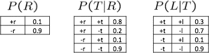
 - Any known values are selected
    - E.g. if we know L = +l  , the initial factors are
    - 
 - Procedure: Join all factors, then eliminate all hidden variables

<h2 id="fde6f197d1413b145c1cb24a10ed58b2"></h2>


### Operation 1: Join Factors


 - First basic operation: ***joining factors***
 - Combining factors:
    - Just like a ***database join***
    - Get all factors over the joining variable
    - Build a new factor over the union of the variables involved
 - Example: Join on R
    - 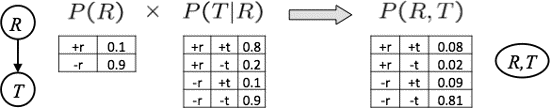
 - Computation for each entry: pointwise products
    - ∀<sub>r,t</sub> : P(r,t) = P(r)·P(t|r)

<h2 id="44dc9c3cb61be07661f0b59c4c5eeeb7"></h2>


#### Example: Multiple Joins

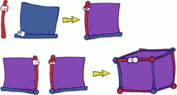

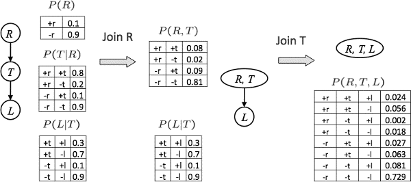
 
 - we call "Join on R" means that you grab all tables that have `R` in them. 

<h2 id="7e886379f4ade029f5799405307898de"></h2>


### Operation 2: Eliminate

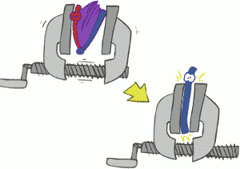

 - Second basic operation: ***marginalization***
 - Take a factor and sum out a variable
    - Shrinks a factor to a smaller one
    - A ***projection*** operation
        - get rid of the variables that don't matter -- the hidden variables
        - why do we even have hidden variables ? 
            - the reason we have it because we started with a joint distribution that was over more than the variables that appear in our query. 
 - Example:
    - 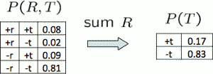

 
<h2 id="3821c17868fa87d7f5cae10cccc3fa7e"></h2>


#### Multiple Elimination

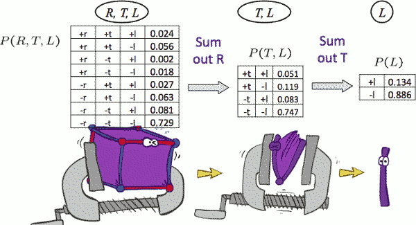


<h2 id="a0254600f083a94ddd9ca563bed0427b"></h2>


###  Thus Far: Multiple Join, Multiple Eliminate (= Inference by Enumeration)

<center>


</center>

<h2 id="b82050c7b2c9df624ba985a4e613ee9f"></h2>


###  Marginalizing Early (= Variable Elimination)

<center>

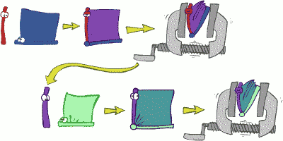

</center>

- switch the some order of join/eliminate 
- intuition
    - if you want to eliminate a variable , you can not do this until you have joined on that variable.  

<h2 id="cc0dd64e1b254202b05fe8934cc5e2ef"></h2>


### Example:  Traffic Domain again

 - R → T → L 
 - P(L) = ?
    - Inference by Enumeration
        - 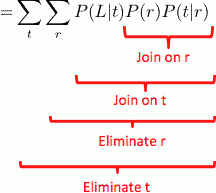
    - Variable Elimination
        - 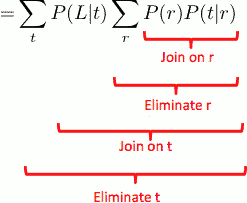

<h2 id="76d28d073a991c878d917deb0c0ef923"></h2>


### Marginalizing Early! (aka VE)

- P(L) = ?

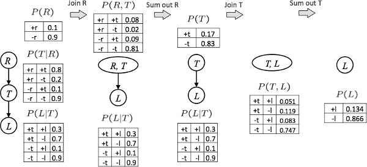

- so that is variable elimination .
- what if your evidence ?
    - just like with the inference by enumeration , when there is evidence you just look at your tabels and you only retain those entries consistent with your evidence. 
- Q: why sum out R in the 1st step?
    - Actually we are eliminating a hidden variable, we are hunting down the hidden variables.

<h2 id="c7b2a4d55fbea4d044644cf5b2b45d29"></h2>


### Evidence

- If evidence, start with factors that select that evidence
    - No evidence  looks like this : uses these initial factors
        - 
    - with evidence looks like this: computing P(L|+r) the initial factors become
        - 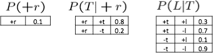
- We eliminate all vars other than query + evidence
- Result will be a selected joint of query and evidence
    - E.g. for P(L | +r), we would end up with:
    - 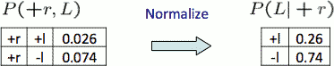
- To get our answer, just normalize this!
- That's it!


---

<h2 id="29338145e918c543db5115601ceedae4"></h2>


## General Variable Elimination

- Query: P( Q| E₁=e₁,...,E<sub>k</sub>=e<sub>k</sub> )
- Start with initial factors:
    - Local CPTs (but instantiated by evidence) 
- While there are still hidden variables (not Q or evidence):
    - Pick a hidden variable H
        - any ordering of hidden variables is valid
        - but some orderings will lead to very big factors being generated along the way 
        - and some orderings might be able to keep the factors generated along the way very small 
    - Join all factors mentioning H
    - Eliminate (sum out) H
- Join all remaining factors and normalize

<h2 id="0a52730597fb4ffa01fc117d9e71e3a9"></h2>


### Example 

![][1]

- P(B|j,m) ∝ P(B,j,m)
- Somebody comes along and says, hey, I want the probability of burglary given that John and Mary are both calling. 
    - after introducing evidence , we have following factors:
    - P(B) , P(E) , P(A|B,E) , P(j|A) , P(m|A) 

---

- Choose *A* 
    - 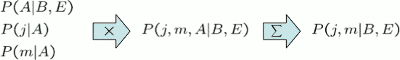
    - the size of the tables generated along the way is 2³,  in this case it wasn't too bad , it's possible to handle. but if you have a very large BNs you need to be careful about your ordering to make sure you keep it low. 
    - Now these 3 things, P(A|B,E) , P(j|A) , P(m|A), have been replaced by P(j,m|B,E), and we got:
        - P(B) , P(E) , P(j,m|B,E)
- Choose *E*
    - 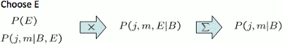
    - P(B) , P(j,m|B)
- Finish with B
    - 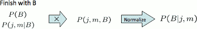
 

<h2 id="fac810843510c673799014b64bd703d5"></h2>


### Same Example in Equations

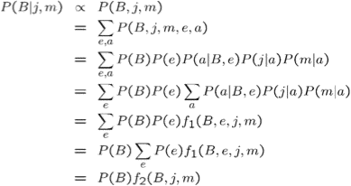

- Do not process the slide! Don't do it. The slide is simply saying that instead of working with these factors, I could have worked all that out using products, and sums, and laws of distribution, and all of that.

- equations from top to bottom 
    1. marginal can be obtained from joint by summing out
    2. use Bayes' net joint distribution expression
    3. use `x*(y+z) = xy + xz`
    4. joining on *a* , and then summing out give f₁
    5. use `x*(y+z) = xy + xz` 
    6. joining on *e* , and then summing out give f₂
- **All we are doing is exploiting uwy + uwz + uxy + uxz + vwy + vwz + vxy +vxz = (u+v)(w+x)(y+z) to improve computational efficiency** !
- how do you decide which variables to pick first ?
    - suggestion here was **a variable with very few connections** .  Connections means that it is participating in a factor. 

<h2 id="60b0a3c9ae175891ccee2e70e11f5141"></h2>


### Another Variable Elimination Example

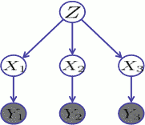

- Query: P(X₃|Y₁=y₁,Y₂=y₂,Y₃=y₃)
- Start by inserting evidence , which gives the following initial factors:
    - p(Z),p(X₁|Z),p(X₂|Z),p(X₃|Z),p(y₁|X₁),p(y₂|X₂),p(y₃|X₃)
- Eliminate X₁, this introduce the factor f₁(Z,y₁) = ∑ₓ₁ p(x₁|Z)p(y₁|x₁) , and we are left with 
    - p(Z),f₁(Z,y₁),p(X₂|Z),p(X₃|Z),p(y₂|X₂),p(y₃|X₃)
- Eliminate X₂, this introduce the factor f₂(Z,y₂) = ∑ₓ₂ p(x₂|Z)p(y₂|x₂) , and we are left with 
    - p(Z),f₁(Z,y₁),f₂(Z,y₂),p(X₃|Z),p(y₃|X₃)
 - Eliminate Z, this introduces the factor f₃(y₁,y₂,X₃) = ∑<sub>z</sub> p(z)f₁(Z,y₁)f₂(Z,y₂)p(X₃|z) , and we are left:
    - p(y₃|X₃),f₃(y₁,y₂,X₃)
    - quiz: why there is a factor p(X₃|z) ? why not the other ones , like p(X₃,z) or P(Z,y) ?
        - X₃ is the query variable, the query variable doesn't go through the elimination process, the same way as a hidden variable 
- No hidden variables left. Join the remaining factors to get 
    - f₄(y₁,y₂,y₃, X₃) = p(y₃|X₃)·f₃(y₁,y₂,X₃)
- Normalizing over X₃ gives P(X₃|y₁,y₂,y₃)

---

<h2 id="7ace6202153b69d2eaaee232c913dc52"></h2>


## Variable Elimination Ordering

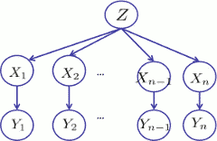

 - For the query P(X<sub>n</sub>|y₁,…,y<sub>n</sub>) work through the following two different orderings as done in previous slide: Z, X₁, …, X<sub>n-1</sub> and X₁, …, X<sub>n-1</sub>, Z.  What is the size of the maximum factor generated for each of the orderings?
 - Answer: 2ⁿ⁺¹ versus 2² (assuming binary)
 - In general: the ordering can greatly affect efficiency.  

--- 

 - start from X₁ , we get f₁(Z,y₁) , then X₂, we get f₂(Z,y₂) , then ... f<sub>n-1</sub>(Z,y<sub>n-1</sub>)
    - not X<sub>n</sub>  , X<sub>n</sub>  is query variable 
 - now we eliminate Z , we get f( y₁ , ... , y<sub>n-1</sub> , ... X<sub>n</sub> ) , also only 2 variables


---

<h2 id="e7a5369a94522ddbfba1d7c3f326d981"></h2>


## VE: Computational and Space Complexity

 - The computational and space complexity of variable elimination is determined by the largest factor
 - The elimination ordering can greatly affect the size of the largest factor.  
    - E.g., previous slide’s example 2ⁿ vs. 2
 - Does there always exist an ordering that only results in small factors?
    - **No!**
    - There are BNs and we'll see one in next slides where no matter which ordering you pick it's going to generate large factors along the way. 

---


<h2 id="c2d228ff5891fce6cd51dc9df9953ed6"></h2>


### Worst Case Complexity?

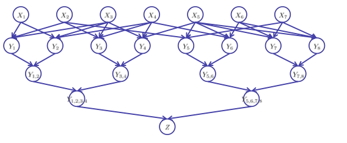

 - CPS
    - a 3-Sat problem, a special kind of CSP 
    - 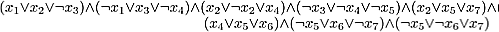
    - there are 7 variables , X₁ ... X₇, I want to find an assignment to these 7 variables , such that this clause is true
        - the clause is saying : x₁ or x₂ or not x₃ has to be true ,  and not x₁ or x₃ or not x₄ has to be true , and ... so forth   
    - P(Xᵢ=0) = P(Xᵢ=1) = 0.5
    - Y₁ = X₁ v X₂ v ¬V₃  , ... , Y₈ = ¬X₅ v X₆ v V₇
    - Y₁‚₂ = Y₁ ∧ Y₂ , ... , Y₇‚₈ = Y₇ ∧ Y₈
    - Y₁‚₂‚₃‚₄ = Y₁‚₂ ∧ Y₃‚₄ ,  Y₅‚₆‚₇‚₈ = Y₅‚₆ ∧ Y₇‚₈
    - Z = Y₁‚₂‚₃‚₄ ∧ Y₅‚₆‚₇‚₈ 
 - why we use so many Y variables here ?
    - BNs where variable has many parents is a large BNs , it's not very compact 
    - those Y variables gives us a BNs where every variables has at most 3 parents. So it's a very small BNs. 
 - If we can answer P(z) equal to zero or not, we answered whether the 3-SAT problem has a solution.
 - Hence inference in Bayes’ nets is NP-hard.  No known efficient probabilistic inference in general.

---

<h2 id="3210fceb43cd33c7a8871b75e98de3ee"></h2>


## Polytrees

There are  atrist special graph structures of BNs , where inference can be done efficiently.  One example is Ploytree.

 - A polytree is a directed graph with no undirected cycles 
    - so directed acyclic graph can have undirected cycles.
    - but if you don't allow those undirected cycles,  you have a poly tree. 
 - For poly-trees you can always find an ordering that is efficient 
    - Try it!!
 - Cut-set conditioning for Bayes’ net inference
    - Choose set of variables such that if removed only a polytree remains
    - Exercise: Think about how the specifics would work out!


---

<h2 id="ab458f4b361834dd802e4f40d31b5ebc"></h2>


## Quiz 

- Alarm Network
    - 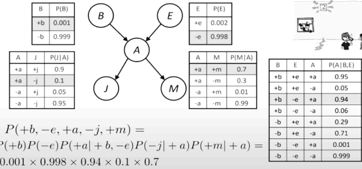


<h2 id="25d7ce91a9821147da689c3a48401fb1"></h2>


## Quiz BN2-2

 - BNs
    - 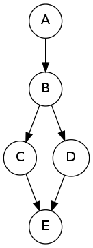
 - Query: P(C |e=1)
 - we have the following probability tables
    - 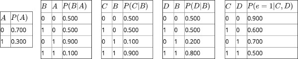

 - Step 1: eliminate A
    - so we get the factor A→B : f₁(B) = ∑ₐ P(a)P(B|a)

B    |   A  | P(A,B)
--- | --- | ---
0 |  0 |  0.35
1 |  0 |  0.35
0 |  1 |  0.27
1 |  1 |  0.03

sum out A, we get 

B | f₁(B)
--- | ---
0 | 0.62
1 | 0.38

 - Step 2: eliminate B.
    - so we get the factor C←B→D :  f₂(C,D) = ∑<sub>b</sub> P(C|b)P(D|b)f₁(b)  

f₁(B)  | C |    D  | P(f₁(B) ,C,D)
--- | --- | --- | --- 
0 |0 |0  |0.155     
0 |1 |0  |0.155
0 |0 |1  |0.155 
0 |1 |1  |0.155     
1 |0 |0  |0.0076
1 |1 |0  |0.0684    
1 |0 |1  |0.0304
1 |1 |1  |0.2736

sum out B, we get 

C | D | f₂(C,D)
--- | --- | --- 
0 | 0 |  0.1626
1 | 0 |  0.2234
0 | 1 |  0.1854
1 | 1 |  0.4286

 - Step 3: eliminate D.
    - so we get factor C→E←D: f₃(C,e=1) = ∑<sub>d</sub> P(e=1|C,d)f₂(C,d)

C   |    D |  e=1 | P( f₂(C,D) , e=1 )
--- | --- | --- | ---
0   |0   |1    |0.900\*0.1626
1   |0   |1    |0.600\*0.2234
0   |1   |1    |0.700\*0.1854
1   |1   |1    |0.500\*0.4286

sum out D , we get 

C | f₃(C,e=1)
--- | --- 
0 | 0.27612 
1 | 0.34834

 - After getting the final factor f₃(C,e=1), a final renormalization step needs be carried out to obtain the conditional probability P(C|e=1).

C | P(C\|e=1)
--- | ---
0 | 0.44217404
1 | 0.55782596


<h2 id="74e6f31ec1cddabd42e093bb90394707"></h2>


## Quiz BN2-3

 - BNs
    - 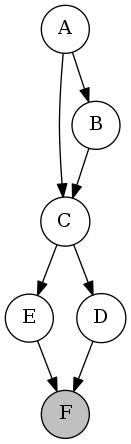
 - Query : P(A|+f)
 - we run variable elimination with the following ordering: E,D,C,B. 
 - After introducing evidence, we have the following factors:
    - P(A) , P(B|A), P(C|A,B), P(D|C), P(E|C), P(+f|E,D) 

 - Step 1: 
    - After joining on E and summing out over E, we have generated a new factor f₁ over the following variables and/or evidence 
        - **C,D,+f**
            - factors contain variable E are P(E|C), P(+f|E,D) 
            - which  contain variables: C,D,E,+f, 
            - and note E is not included after summing out over 
    - After this step, the remaining factors are:
        - **P(A) , P(B|A), P(C|A,B), P(D|C), f₁**
            - P(E|C), P(+f|E,D) which contain variable E does not availabel any more
            - and new factor f₁ comes in
 - Step 2: 
    - After joining on D and summing out over D, we have generated a new factor f₂ over the following variables and/or evidence     
        - **C,+f**
    - After this step, the remaining factors are:
        - **P(A) , P(B|A), P(C|A,B),  f₂**  
            - P(D|C) not available now
            - f₁ was comsumed
            - f₂ comes in
 - Step 3: 
    - After joining on C and summing out over C, we have generated a new factor f₃ over the following variables and/or evidence 
        - **A,B,+f**
    - After this step, the remaining factors are:  
        - **P(A) , P(B|A),  f₃**  
 - Step 4: After joining on B and summing out over 
    - **A,+f**
    - **P(A) , f₄**  


 


--- 

 [1]: ../imgs/cs188_BNs_inference_example_BNgraph_alarm_network.png


