...menustart

 - [Approximate inference: Sampling](#cc9a4c958f31f481f18fcc2449a18506)
     - [Sampling](#1d07814d12178c958e4233501cb0bdc7)
     - [Sampling in Bayes’ Nets](#7bdab2b4b6b4f6a48cbf1e07f48c7f94)
     - [Prior Sampling](#d9850ac369194d66ab390de368f1cf63)
         - [Example](#0a52730597fb4ffa01fc117d9e71e3a9)
     - [Rejection Sampling](#da3112458f911630996b5661ccd81e9d)
         - [Sampling Example](#c6947b6b4431fade42a12cf65b3c9a80)
     - [Likelihood Weighting](#6e0d79ed12bd0076ebad0fc27629611e)
         - [Example Likelihood Weighting](#3eb57101576ca6e2a3251b14ff38ce8f)
     - [Likelihood Weighting Cont.](#6d927b96f874f88bd5461de8ac4b040a)
     - [Gibbs Sampling](#16169430c0295688db141ebd3163baf5)
         - [Gibbs Sampling Example: P( S | +r)](#a4d4a785b477b26309b7ec181f443a28)
         - [Efficient Resampling of One Variable](#5fb1b8f1b2e4f8b4d7772cae296c4642)
         - [Further Reading on Gibbs Sampling](#e71302c1ea74db4751ea7bc9282430c5)

...menuend


<h2 id="cc9a4c958f31f481f18fcc2449a18506"></h2>


# Approximate inference: Sampling 

A way of doing interence really, really fast, any maybe getting the wrong answer.

<h2 id="1d07814d12178c958e4233501cb0bdc7"></h2>


## Sampling

 - Sampling is a lot like repeated simulation
    - Predicting the weather, basketball games, …
 - Basic idea
    - Draw N samples from a sampling distribution S
    - Compute an approximate posterior probability
    - Show this converges to the true probability P
 - Why sample?
    - Learning: get samples from a distribution you don’t know
    - Inference: getting a sample is faster than computing the right answer (e.g. with variable elimination)

--- 

 - Sampling from given distribution
    - Step 1: Get sample *u* from uniform distribution over \[0, 1)
        - E.g. random() in python
    - Step 2: Convert this sample *u* that lies in \[0,1) interval  into an outcome from the distribution that we want a sample from

---

C | P(C)
--- | --- 
red | 0.6
green | 0.1
blue | 0.3

---
 
 - Example 
    - 0 ≤ u ≤ 0.6, → C = red
    - 0.6 ≤ u ≤ 0.7, → C = green
    - 0.7 ≤ u ≤ 1 , → C = blue
    - If random() returns u = 0.83, then our sample is C = blue
    - E.g, after sampling 8 times:
        - 5 reds , 2 blues , 1 green 
        - so what's the probability of blue ?  2/8 = 0.25 , that's our estimate of the probability of blue give this set of samples. 

---

<h2 id="7bdab2b4b6b4f6a48cbf1e07f48c7f94"></h2>


## Sampling in Bayes’ Nets

 - Prior Sampling
 - Rejection Sampling
 - Likelihood Weighting
 - Gibbs Sampling

In the order from simple to complex. Often you want end up using those last 2. 

<h2 id="d9850ac369194d66ab390de368f1cf63"></h2>


## Prior Sampling 

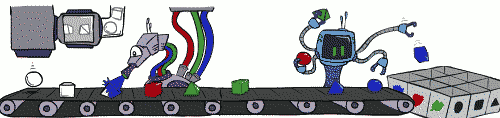

We have a BNs, and we want to generate samples of the full joint distribution ,but without building full joint distribution. 

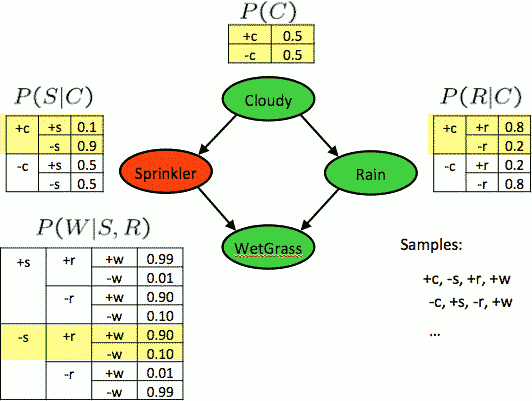

 - ordering: C → S → R → W , or  C → R → S → W 
 - we start with the 1st variable in the ordering **C** 
    - we generate the number in \[0,1) , then map it to +c , or -c. 
    - this case , we got +c 
 - then we pick up next variable , this case *S* 
    - C is already sampled as +c, so we just consider the highlighted part of this table. 
    - again we generate a number, and map it into either +s , or -s
    - this case , we got -s
 - next we have to proceed with R 
    - we can not proceed W yet, because W depends on both S and R 
    - this case , we got +r 
 - Now we can sample W 
    - this case , we got +w 
    - this generated our first sample from this BNs.   +c,-s,+r,+w
 - repeat this process , and build up a set of samples from this BNs distribution here.   
 - algorithm to generate 1 sample : 

```
// single sample
For i=1,2,...,n
    Sample xᵢ from P(Xᵢ| Parents(Xᵢ))
return (x₁,x₂,...,xn)
```

---

 - Question: are we sampling from the correct distribution ?
 - This process generates samples with probability:
    - 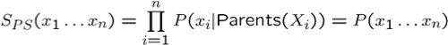
    - S<sub>PS</sub> : sampling distribution *S* using prior sampling 
    - i.e. the BN’s joint probability
 - Let the number of samples of an event be
    - N<sub>PS</sub> (x₁,x₂,...,x<sub>n</sub>)
 - if the number of samples goes to infinity then the number of samples you get for a particular event divided by N will converge to the actual probability for that event.
    -  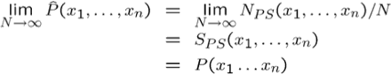
 - I.e., the sampling procedure is ***consistent***.

---

<h2 id="0a52730597fb4ffa01fc117d9e71e3a9"></h2>


### Example 

 - We’ll get a bunch of samples from the BN: (let's say we ended up with following samples)
    - +c, -s, +r, +w
    - +c, +s, +r, +w
    - -c, +s, +r, -w
    - +c, -s, +r, +w
    - -c, -s, -r, +w
 - If we want to know P(W)
    - We have counts :   +w:4 , -w:1
    - Normalize to get P(W) = `<+w:0.8, -w:0.2>`
    - This will get closer to the true distribution with more samples
    - Can estimate anything else, too
    - What about P(C| +w)?   P(C| +r, +w)?  P(C| -r, -w)?
        - P(+c|+w) = 3/4 , P(-c|+w) = 1/4
        - P(+c|+r,+w) = 1
        - P(-c|-r,-w) : not computable from the samples we have.  
    - Fast: can use fewer samples if less time 
        - what’s the drawback?  the accuracy of course. 

---

<h2 id="da3112458f911630996b5661ccd81e9d"></h2>


## Rejection Sampling 

Now we're going to look at a way to speed this up a little bit if we know ahead of time what the queries that were asked.


 - Let’s say we want P(C)
    - No point keeping all samples around
    - Just tally counts of C as we go
        - we know we sampled top down through BNs, so we know once we sampled C and if later all interesting is counting how often we have +c/-c 
        - there's no need to still sample S,R and W. 
        - we just stop sampling after we got C. 
 - Let’s say we want P(C| +s)
    - Same thing: tally C outcomes, but ignore (reject) samples which don’t have S=+s
        - when you sampled -s , there is no point in continuing.
        - that sample is going to be going unused when you answer your query 
    - This is called rejection sampling
    - It is also consistent for conditional probabilities (i.e., correct in the limit)

```
// single sample 
IN: evidence instantiation
For i=1, 2, …, n
    Sample xᵢ from P(Xᵢ| Parents(Xᵢ))
    If xᵢ not consistent with evidence
        Reject: Return, and no sample is generated in this cycle
Return (x1, x2, …, xn)
```

 - Quiz: BNs has 5 randomes, you sampled 5 times, 
    - 4 rejected , 1 accepted . 
    - And that accepted samples satisfy my query , say, eg. P(C=1|B=1,E=1)..
 - so what is answer of that query ?
    - 1.0 
    - 在符合 B=1,E=1 的 样本中，计算 C=1的概率


---

<h2 id="c6947b6b4431fade42a12cf65b3c9a80"></h2>


### Sampling Example 

 - There are 2 cups
    - The frist contains 1 penny and 1 quarter
    - Then second contains 2 quaters
 - Say I pick a cup uniformly at random, then pick a coin randomly from that cup. It's a quarter ( yes!). 
    - What is the probability that the other coin in that cup is also a quarter ? 

 - One way to answer this question is to use essentially BNs inference to find the answer
 - another way to do it is to just run sampling : 2/3

---

<h2 id="6e0d79ed12bd0076ebad0fc27629611e"></h2>


## Likelihood Weighting

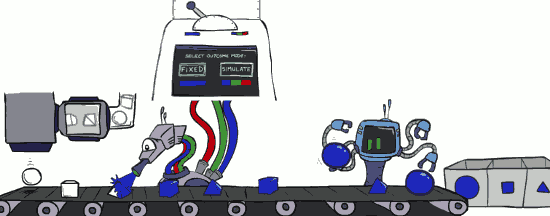

Again, we know the query ahead of time, and see if we can further improve the procedure beyond what we did for a rejection sampling. 
 
 - Problem with rejection sampling:
    - If evidence is unlikely, rejects lots of samples
        - 证据发生的概率很低
    - Evidence not exploited as you sample
        - if the evidence variable are very deep in your BNs, you might have done all that work 
        - reach all the way to the bottom of you BNs, you sample your evidence variable , you sample it the wrong way , now you reject -- that sample can not use . 
    - Consider P(Shape|blue)
        - Shape → Color
            - ~~pyramid, green~~
            - ~~pyramid, red~~
            - sphere , blue
            - ~~cube, red~~
            - ~~sphere, green~~ 

 - Idea: fix evidence variables and sample the rest
    - 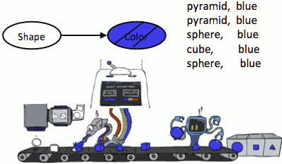
    - Problem: sample distribution not consistent!
    - Solution: weight by probability of evidence given parents
        - you instantiated some shape to be blue, and the probability for blue was 0.2 for that shape 
        - you now weight that particular sample by a factor 0.2. 

<h2 id="3eb57101576ca6e2a3251b14ff38ce8f"></h2>


### Example Likelihood Weighting

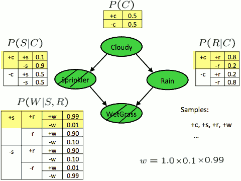

 - evidence is +s , +w
 - we start with Cloudy , we got +c 
    - weight is 1.0
 - next we go to Sprinkler,  it is instantiated to be +s, we have weight P(+s|+c) = 0.1 
    - now weight is 1.0\*0.1 
 - next we look at rain, we sample , we got +r 
    - weight is still 1.0\*0.1  
 - last is WetGrass , it is instantiated to be +w , we weight it P(+w|+s,+r) = 0.99
    - now the weight is 1.0\*0.1\*0.99 = 0.099
 - so this sample +c,+s,+r,+w has weigth 0.099

---

 - Quiz2:
    - 5 Likelihood Weighting samples
        - weight 0.32 , satisfy the query P(C=1|B=1,E=1)
        - weight 0.24 , not satisfy the query
        - weight 0.16 , satisfy the query
        - weight 0.32 , satisfy the query
        - weight 0.32 , satisfy the query
    - P(C=1|B=1,E=1) = ?
        - [ 0.24, 0.32 + 0.16 + 0.32 + 0.32 ]
        - normalize: [ 0.17647059, 0.82352941]
        - P(C=1|B=1,E=1) = 0.82352941

         


<h2 id="6d927b96f874f88bd5461de8ac4b040a"></h2>


## Likelihood Weighting Cont.

```
// single sample
IN: evidence instantiation
w = 1.0
for i=1, 2, …, n
    if Xᵢ is an evidence variable
        Xᵢ = observation xᵢ for X
        Set w = w * P(xᵢ | Parents(Xᵢ))
    else
        Sample xᵢ from P(Xᵢ | Parents(Xi))
Return (x1, x2, …, xn) , w
```

Are we still doing the right thing ?  Are we sampling from the right distribution ?

 - Proof:  ignore

---

 - Likelihood weighting is good
    - We have taken evidence into account as we generate the sample
        - E.g. here, W’s value will get picked based on the evidence values of S, R
    - More of our samples will reflect the state of the world suggested by the evidence
 - Likelihood weighting doesn’t solve all our problems
    - Evidence influences the choice of downstream variables, but not upstream ones (C isn’t more likely to get a value matching the evidence)
        - if you look at how the evidence comes into play , it only comes into play once it's been encountered in the BNs
        - so you walk through your BNs top-down, once you encounter the evidence variable , you fix it and everything that comes after it will know that it took on that value and will be conditioning on that value.
        - but things than came before an evidence variable are not influenced by the evidence variable. 
        - so things have come before the evidence variable are still samples from a prior that doesn't involve the evidence 
        - so it's possible that you are sampling things at the top of your BNs that end up being very inconsistent with what happens at the bottom in terms of evidence. 
        - let's say you get to observe some evidence that's extremely unlikely a priori , you measure very unlikely sensor measurement. Then as you sampling from top-down  you're not aware of that unlikely measurement that will be incorporated in the future only. And you just sampling from the prior, and going on, and then you encounter your evidence variable. It'll be really unlikely . You'll set it to that really unlikely value and your weight will be really low for your sample. 
        - The quality of your samples is influenced by their weight. So you can effectively think of the weight as quantifying how valuable your sample is.
            - In prior sampling , they're all equally valuable, they are all valid samples from your distribution. 
        - so if you always encounter this evidence variable at the very end and it's very unlikely , then you will get samples that are not informative yet. You'll have to wait a really long time till you finally sample this really unlikely cause of  this really unlikely observation. When you finally sample that really unlikely cause ,finally we'll have a sample with a high weight and that'll give you a good esimate of the distribution. 
 - We would like to consider evidence when we sample every variable
    - -> Gibbs sampling

---

<h2 id="16169430c0295688db141ebd3163baf5"></h2>


## Gibbs Sampling


 - *Procedure*: 
    - keep track of a full instantiation x₁, x₂, …, x<sub>n</sub>.   
        - it might remind you of something like hill climbing what we had for solving CSPs. we has a full association and then work from there to get something better. This is going to be very similar.  
    - Start with an arbitrary instantiation consistent with the evidence.  
        - we already account for the evidence, the other variables are arbitrarily instantiated.
    - Sample one variable at a time, conditioned on all the rest, but keep evidence fixed.  
        - do not pick evidence variable, evidence variables stay fixed
        - the other variables we cycle through in some way in a random cycling procedure. And when we look at that variable we uninstantiated and sample it condition on them all the other variables in our instantiation. 
        - we have a distriution, a conditional distribution , compute that distribution and then sample from that conditional distribution.  
        - we haven't yet looked at what it takes to compute that conditional distribution but in principle you could compute a conditional distribution for one variable given all other variables being instantiated , and then sample from that. 
    - Keep repeating this for a long time.
 - *Property*: in the limit of repeating this infinitely many times the resulting sample is coming from the correct distribution
    - P( unobserved variables | evidence variables )
    - so we're not going to have to weight samples anymore. We're going to directly get samples from the conditional distribution.  
 - *Rationale*: both upstream and downstream variables condition on evidence.
 - In contrast: likelihood weighting only conditions on upstream evidence, and hence weights obtained in likelihood weighting can sometimes be very small.  Sum of weights over all samples is indicative of how many “effective” samples were obtained, so want high weight.


<h2 id="a4d4a785b477b26309b7ec181f443a28"></h2>


### Gibbs Sampling Example: P( S | +r)

We're going to generate one sample from our BNs. Our evidence is +r. 

 - Step 1: Fix evidence
    - R = +r
    - 
 - Step 2: Initialize other variables 
    - Randomly
        - say we pick +c, -s, -w
    - 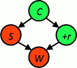
 - Steps 3: Repeat
    - Choose a non-evidence variable X
        - this choice here is also supposed to be random 
        - so you randomly pick one of your non-evidence variables as your current variable , that you're going to update  
    - Resample X from P( X | all other variables)
    - 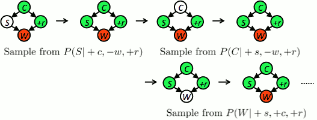
        - we picked S , we uninstantiated it
            - now we compute the conditional distribution for S : P(S|+c,+r,-w) 
                - this distribution can answer some query very efficiently 
            - sample from that distribution ,  and we happen to sample +s 
        - again, we randomly pick C 
            - we compute the conditinal distribution for C : P(C|+s,+r,-w) 
            - sample from that distribution ,  this case we got +c 
        - now we uninstantiate W 
            - we compute the conditinal distribution for W : P(W|+s,+c,+r) 
            - sample from that distribution ,  this case we got -w 
        - keep going 
            - we can look at properties of your BNs, you can infer how long -- how many steps --  you might need to sample  

This is just giving you the very basic idea of how Gibbs Sampling works. And you can make it work this way , but if you used it in practice , you'd want to use a lot of methods to make it more efficient. 

<h2 id="5fb1b8f1b2e4f8b4d7772cae296c4642"></h2>


### Efficient Resampling of One Variable

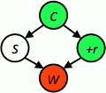

 - Sample from P(S | +c, +r, -w)    
    - 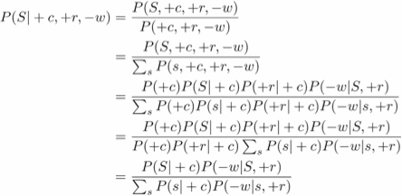
 - Many things cancel out – only CPTs with S remain!
 - More generally: only CPTs that have resampled variable need to be considered, and joined together


<h2 id="e71302c1ea74db4751ea7bc9282430c5"></h2>


### Further Reading on Gibbs Sampling

 - Gibbs sampling produces sample from the query distribution P( Q | e ) in limit of re-sampling infinitely often
 - Gibbs sampling is a special case of more general methods called Markov chain Monte Carlo (MCMC) methods 
    - Metropolis-Hastings is one of the more famous MCMC methods (in fact, Gibbs sampling is a special case of Metropolis-Hastings) 
 - You may read about Monte Carlo methods – they’re just sampling

   
     


