...menustart

 - [Constraint Satisfaction Problems I](#8c8072703357c878142be0f423e13a69)
     - [What is Search For?](#6135abe1c86a58db9f536d2f0279d4b1)
     - [Constraint Satisfaction Problems](#ff7da4833835bc7f3506b068905f376c)
     - [CSP Example: Map Coloring](#7c497b01fb991be051180f4dd6bc4dfd)
     - [Exampe: N-Queens](#aee23a02cf0a428f8a3380804926c5ba)
     - [Constraint Graphs](#5e3fadab67cd58dfc836b52e0eec6403)
         - [Example : Cryptarithmetic](#e4f09537d31b275d624175f497d7a7a0)
         - [Example: Sudoku](#1b0c55d7a4c5a4fc32c6095016869b4e)
         - [Example: The Waltz Algorithm](#de9c82c8eb4d71f6d701b657ce8528b9)
     - [Varieties of CSPs and Constraints](#b9434fb596306e69d9867441d7d9fa5f)
         - [Varieties of CSPs](#62e238fa7cf63ce3e6bcd9fe1ebead89)
         - [Varieties of Constraints](#03a54c9ac014bf6015d74f7b0468f36c)
     - [Solving CSPs](#c7847ab059ee8aebf6d6b477f0c5c5a3)
         - [Standard Search Formulation](#8aac949f2dcb8f35a610fe421087b36d)
         - [Backtracking Search](#fe6282319a2be73c021b58a6d190368e)
         - [Improving Backtracking](#b9b8d3f554a684894d60e5c3a7cdcf8e)
         - [Filtering](#9a588db8471730dbfebac65cd5467ad8)
             - [Forward Checking](#2dc9675ac8062df94ad72d42c57f68e1)
             - [Constraint Propagation](#7e161a29d4c082578ae409a87a8988f0)
             - [Consistency of A Single Arc](#4a6018d8655776208482f8b34d58f268)
             - [Arc Consistency of an Entire CSP](#0ca5bb56dad2fa5871eec95372182139)
             - [Enforcing Arc Consistency in a CSP](#a579dbdec94528eb11f12d92e857c911)
             - [Limitations of Arc Consistency](#86e7f886811c7ef1bc00bf5730d39c8b)
         - [Ordering](#12ad9074a51088cf63b8e33236d8cc13)
             - [Ordering: Minimum Remaining Values (Variable)](#04b8f33966ef671d2d1c0293a74a75d4)
             - [Ordering: Least Constraining Value](#f03154f0f61b618719c8b5dc67557aaf)
 - [Constraint Satisfaction Problems II](#1dff507c8d0411804d4fbae07a040c72)
     - [Reminder: CSPs](#acc9764e38986d7c5f932a1db3eaf43d)
     - [K-Consistency](#8bba60b06aea42c1d4246dd17c987e0b)
         - [Strong K-Consistency](#b2f18a946e39a98cdff46b0f465f22db)
     - [Structure](#dc4c71563b9bc39a65be853457e6b7b6)
     - [Tree-Structured CSPs](#28db87697415187402d34b1a3b3d0de3)
     - [Improving Structure](#709ac339582a9376bc2eeca7e10d07cc)
         - [Nearly Tree-Structured CSPs](#130b46626de2ded14ad9027586d218d2)
         - [Cutset Conditioning](#c81f59e20d96cc96fb1a78af50455703)
         - [Tree Decomposition](#15a6670cc8efa82fc50198c0cce30f04)
     - [Iterative Improvement](#4dbd4d648c894941f112d1a8d83cae25)
         - [Iterative Algorithms for CSPs](#846761c44202fc6587390df7e27e33f8)
         - [Example: 4-Queens](#d0813c5b61b7d928b7b0bd53bc40b3e2)
         - [Performance of Min-Conflicts](#e9c367ec703849cbd55be1cc17396330)
     - [Summary: CSPs](#240e072c49e1269d63abd125b0dd5ede)
     - [Local Search](#e1ea5bc107355233f10e2288fe7fc0ae)
         - [Hill Climbing](#3b09835fc58a6f4c68cdf9d702bb59c6)
         - [Hill Climbing Diagram](#6d905a5baf3b8995646bc1c96ff9bae4)
         - [Simulated Annealing 退火](#d675d0b56bdafe850c953b589d02838d)
         - [Genetic Algorithems](#0a02d3b8f5cb85d83848b73ba2b78219)
             - [Example: N-Queens](#e8cba6398fc6216fef8e64d0a854ea7f)

...menuend


<h2 id="8c8072703357c878142be0f423e13a69"></h2>


# Constraint Satisfaction Problems I


<h2 id="6135abe1c86a58db9f536d2f0279d4b1"></h2>


## What is Search For?

- Assumptions about the world:  
    - a single agent
    - deterministic actions
    - fully observed state
         - you KNOW the configuration that you start in
         - and then you plan about exactly how the world will evolve
    - discrete state space

- Planning: sequences of actions
    - The path to the goal is the important thing
    - Paths have various costs, depths
    - Heuristics give problem-specific guidance

- Identification: assignments to variables
    - The goal itself is important, **not the path**
    - All paths at the same depth (for some formulations)
    - CSPs are specialized for identification problems

<h2 id="ff7da4833835bc7f3506b068905f376c"></h2>


## Constraint Satisfaction Problems

- Standard search problems:
    - State is a “black box”: arbitrary data structure
        - The only thing you can do on a state is calling `getSuccessor` and `isGoal`. That's your whole API.
    - Goal test can be any function over states
    - Successor function can also be anything
- Constraint satisfaction problems (CSPs):
    - A special subset of search problems
    - State is defined by ***variables Xᵢ***  with values from a ***domain D*** (sometimes D depends on i)
    - Successor functions now are things like assign a new variable.
    - Goal test is a ***set of constraints*** which specify allowable combinations of values for subsets of variables
- Allows useful general-purpose algorithms with more power than standard search algorithms

<h2 id="7c497b01fb991be051180f4dd6bc4dfd"></h2>


## CSP Example: Map Coloring

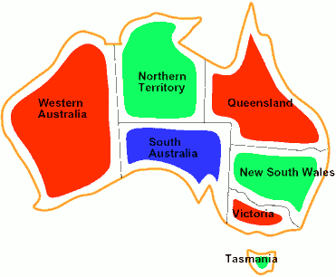

- Variables: WA, NT, Q, NSW, V, SA, T
- Domains: D = {red, green, blue}
- Constraints: adjacent regions must have different colors
    - Implicit: WA ≠ NT 
    - Explicit: (WA, NT) ∈ { (red,green),(red,blue), ... }
- Solutions are assignments where every variable takes value on the domain that satisfies all constraints, e.g.
    - {WA=red, NT=green, Q=red, NSW=green, V=red, SA=blue, T=green}

<h2 id="aee23a02cf0a428f8a3380804926c5ba"></h2>


## Exampe: N-Queens

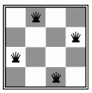

Formulation 1:

- Variables: Xᵢⱼ
- Domains: {0,1}
- Constraints
    - ∀i,j,k (Xᵢⱼ, X<sub>ik</sub>) ∈ { (0,0), (0,1), (1,0) }
    - ∀i,j,k (Xᵢⱼ, X<sub>kj</sub>) ∈ { (0,0), (0,1), (1,0) }
    - ∀i,j,k (Xᵢⱼ, X<sub>i+k, j+k</sub>) ∈ { (0,0), (0,1), (1,0) }
    - ∀i,j,k (Xᵢⱼ, X<sub>i+k, j-k</sub>) ∈ { (0,0), (0,1), (1,0) }
    - Σ Xᵢⱼ = N


Formulation 2:

- Variables: Q<sub>k</sub>
    - in each row , the value is going to be where the Queen for that row is.
- Domains: {1,2,3, ... , N } 
- Constraints:
    - Implicit: ∀i,j non-threatening(Qᵢ,Qⱼ) 
    - Explicit: (Q₁,Q₂) ∈ { (1,3),(1,4), ... } , ...


<h2 id="5e3fadab67cd58dfc836b52e0eec6403"></h2>


## Constraint Graphs

![][1]


- Binary CSP: 
    - each constraint relates (at most) two variables
- Binary constraint graph: 
    - nodes are variables, arcs show constraints
- General-purpose CSP algorithms use the graph structure to speed up search. 
    - E.g., Tasmania is an independent subproblem!


<h2 id="e4f09537d31b275d624175f497d7a7a0"></h2>


### Example : Cryptarithmetic

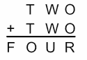

- Variables:
    - F T U W R O X₁ X₂ X₃
- Domains:
    - { 0,1,2,3,4,5,6,7,8,9 }
- Constraints:
    - all diff ( F T U W R O  )
    - O + O = R + 10·X₁   进位
    - ...

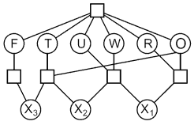

there are boxes which are constraints and the boxes are connected to all of the variables that participate in that constraints. 

<h2 id="1b0c55d7a4c5a4fc32c6095016869b4e"></h2>


### Example: Sudoku

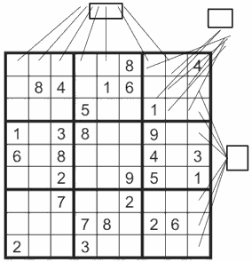

- Variablels:
    - Each (open) square
- Domains:
    - { 1,2, ... , 9 }
- Constraints:
    - 9-way alldiff for each columen
    - 9-way alldiff for each row
    - 9-way alldiff for each region
    - (or can have a bunch of pairwise inequality constraints)


<h2 id="de9c82c8eb4d71f6d701b657ce8528b9"></h2>


### Example: The Waltz Algorithm


- The Waltz algorithm is for interpreting line drawings of solid polyhedra as 3D objects
- An early example of an AI computation posed as a CSP 
 
- 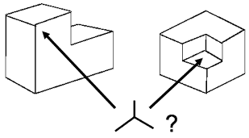
    - those 3 dimensional-ish drawing here ,
    - the left 1 is outie , the right 1 is innie

Approach:
 
- Each intersection is a variable
    - the values are sort of going to be things like it's an outie verusu it's an innie
- Adjacent intersections impose constraints on each other
    - the constraints are something like that if 2 things are connected, you can't have 1 convex and the other is concave ? 
- Solutions are physically realizable 3D interpretations

<h2 id="b9434fb596306e69d9867441d7d9fa5f"></h2>


## Varieties of CSPs and Constraints

<h2 id="62e238fa7cf63ce3e6bcd9fe1ebead89"></h2>


### Varieties of CSPs

- Discrete Variables
    - Finite domains
        - Size d means O(dⁿ) complete assignments
        - E.g., Boolean CSPs, including Boolean satisfiability (NP-complete)
    - Infinite domains (integers, strings, etc.)
        - E.g., job scheduling, variables are start/end times for each job
        - Linear constraints solvable, nonlinear undecidable

- Continuous variables
    - E.g., start/end times for Hubble Telescope observations
    - Linear constraints solvable in polynomial time by LP methods (see cs170 for a bit of this theory)

<h2 id="03a54c9ac014bf6015d74f7b0468f36c"></h2>


### Varieties of Constraints

- Varieties of Constraints
    - Unary constraints involve a single variable (equivalent to reducing domains), e.g.:
        - SA ≠ green
    - Binary constraints involve pairs of variables, e.g.:
        - SA ≠ WA
    - Higher-order constraints involve 3 or more variables: 
        - e.g., cryptarithmetic column constraints

- Preferences (soft constraints):
    - E.g., red is better than green
    - Often representable by a cost for each variable assignment
    - Gives constrained optimization problems
    - (We’ll ignore these until we get to Bayes’ nets)

<h2 id="c7847ab059ee8aebf6d6b477f0c5c5a3"></h2>


## Solving CSPs

<h2 id="8aac949f2dcb8f35a610fe421087b36d"></h2>


### Standard Search Formulation

- Standard search formulation of CSPs
- States defined by the values assigned so far (partial assignments)
    - Initial state: 
        - the empty assignment, {}
    - Successor function: 
        - assign a value to an ***unassigned*** variable
    - Goal test: 
        - the current assignment is complete and satisfies all constraints

We’ll start with the straightforward, naïve approach, then improve it

- What would BFS do ?
    - will expand all levels
    - the worst possible case because 
- What would DFS do ?
    - going to look everywhere where they aren't first. 

<h2 id="fe6282319a2be73c021b58a6d190368e"></h2>


### Backtracking Search 

- Backtracking search is the basic ***uninformed*** algorithm for solving CSPs
- Idea 1: One variable at a time
    - Variable assignments are commutative, so fix ordering
    - I.e., [WA = red then NT = green] same as [NT = green then WA = red]
    - Only need to consider assignments to a single variable at each step

- Idea 2: Check constraints as you go
    - I.e. consider only values which do not conflict previous assignments
    - Might have to do some computation to check the constraints
    - “Incremental goal test”

- Depth-first search with these two improvements
    is called backtracking search (not the best name)

- Can solve n-queens for n `<= 25`

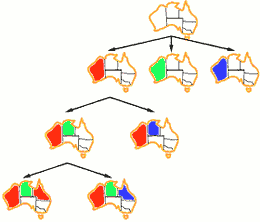

```python
function BACKTRACKING-SEARCH( csp ) return solution/failure
    return RECURSIVE-BACKTRACKING( {} , csp )

function RECURSIVE-BACKTRACKING( assignment, csp ) return soln/failure
    if assignment is complete then return assignment
    // a choice point
    var <- SELECT-UNASSIGNED-VARIABLE( VARIABLES[csp], assigment, csp )

    // for each value in that values , you loop through them in some order , it is going to be another choice point
    for each value in ORDER-DOMAIN-VALUES( var, assignment , csp ) do
        // for each of those values you check if
        // this variable takes this new value did I break a constraint.
        if value is consistent with assigment given CONSTRAINTS[csp] then
            add {var = value} to assignment
            result <- RECURSIVE-BACKTRACKING( assignment , csp )
            if result ≠ failure then return result
            // result is failure
            remove {var = value} from assignment
    return failure
```

- It's often implementedd recursively

- Backtracking = DFS + variable-ordering + fail-on-violation
- What are the choice points?


<h2 id="b9b8d3f554a684894d60e5c3a7cdcf8e"></h2>


### Improving Backtracking

- General-purpose ideas give huge gains in speed
- Ordering:
    - Which variable should be assigned next?  变量顺序
    - In what order should its values be tried?  值选择顺序
- Filtering: 
    - Can we detect inevitable failure early?
- Structure: 
    - Can we exploit the problem structure?
    - Do things like notice tasmanis separate and solve it separately

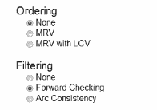

<h2 id="9a588db8471730dbfebac65cd5467ad8"></h2>


### Filtering

Filtering is about ruling out suspects.

Keep track of domains for unassigned variables and cross off bad options.

 
<h2 id="2dc9675ac8062df94ad72d42c57f68e1"></h2>


#### Forward Checking

Cross off values that violate a constraint when added to the existing assignment.


Idea : keep track of all of the unassigned variables , keep track of what values they might reasonably take when we finally get to them.

In forward checking every time I assign a variable which collapses its domain to a single choice for now, I checkto see whether there are other unassigned variables that have some illegal values when I take into account that new assignment. 


example 

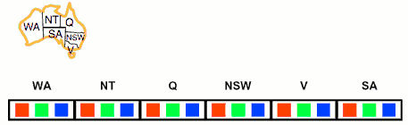

If we assigned red to WA , we should remove red choice from NT , SA.

so that basic idea when I assigned something I look at its ***neighbors*** in the graph and cross things off, that's called forward checking. So the neighbors of WA would lose red. 

forward checking doesn't check interactions between unassigned variables just checks interactions between assigned variables and their neighbors.  Anything further is thinking too hard for forward checking.

<h2 id="7e161a29d4c082578ae409a87a8988f0"></h2>


#### Constraint Propagation

Forward checking propagates information from assigned to unassigned variables, but doesn't provide early detection for all failures:

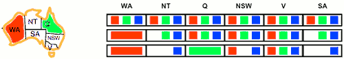

NT and SA cannot both be blue! Why didn’t we detect this yet?

Constraint propagation: propagate from constraint to constraint.

<h2 id="4a6018d8655776208482f8b34d58f268"></h2>


#### Consistency of A Single Arc

The idea of checking single arcs:

so far we talked about checking an assignment against its neighbors, here we were talking out checking between two unassigned variables.

- 2 things
    1. for every edge on the graph, there are actually 2 arcs you could check: a to b, and b to a . We can check whether it's satisfied in both directions. 
    2. conceptually, you can check an arc between 2 things that are't connected by a constraint. 

What does it mean to check an arc ? And we say that arc is consistent , intuitively, it's consistent if there's no constraint violation along that arc.  But formally, it's sort of half of that.

An arc X → Y is consistent iff for every x in the tail ( not arrow ) there is some y in the head which could be assigned without violating a constraint. That is,  for everything in the tail, there is at least one OK option in the head.

无论 X 选什么值，Y 都有相应的选择满足约束。 这样无论以后Y 怎么赋值，都不会破坏 X → Y 约束关系。


<details>
<summary>
So let's do some examples.
</summary>

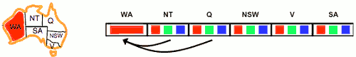

Here WA is assigned. The NT is not assigned, but I can still look at the 2 of them and check if this arc is consistent.  So let's do it, we check everything in the tail. So we look at the NT and we say, is there anything in you remaining domain which would have no continuation into the head ? So we say, well, if I assigned you blue, it would be ok.  Green ? it would be ok. Red ? not ok. So red is something in the tail for which there is no assignments in the head which doesn't cause a constraint violation. So this arc is not constraint.

We can however, make it consistent. We can remove things from the tail, the red in NT. 

So now we can check other consistencies, let's try Q->WA. These two are not actually connected by a constraint, so it sould be easy to check. This is arc is already consistent.

</details>

In general, there's a question of how do you remember this ?

<details>
<summary>
Here's How I remember it.
</summary>

Remember, the constraints are like rules, and these algorithms are like police. They're going to go and enforce the rules. And you can imagine this arc is going to get pulled over by your algorithm, which is the CSP police. And what do they do when they pull the arc over? Right they pop open the trunk and they look for anything that's illegal. They are going to take anything bad out. 

All these algorithms have the same shape. You pull over an arc, you fish around in its trunk and cross the bad thing off. That's enforcing the consistency of a single arc. 


Now we're going to have to do a whole bunch of arcs in order to get a filtering algorithm.

</details>

Forward checking: Enforcing consistency of arcs pointing to each new assignment

<h2 id="0ca5bb56dad2fa5871eec95372182139"></h2>


#### Arc Consistency of an Entire CSP

- A simple form of propagation makes sure ***all*** arcs are simultaneously consistent:

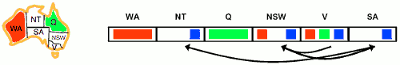

<details>
<summary>
Let's see this example.
</summary>

WA and Q have been assigned , red and green.  NT,NSW,SA have had their domain reduced by some previous pruning. 

I can go visit arcs. First we check V->NSW.  We notice they are neighbors. All right, this is the first time we're checking the consistency of an arc that doesn't point to an assignment. So I go through and I check the tail V , blue is find, red is fine, green is fine too. 

Let's look SA->NSW.  SA and NSW are adjacent, so I'm going to look at SA. What is in the tail ? Blue, it is fine.

BUT, let's check the arc in the other direction. So now I look at NSW , is red ok ? Yes.  Is blue ok? NO.  So we erase blue from NSW. Not it's consistent.

There's a tricky case. We just check V->NSW. We just declared it consistent, but that was on the basis of having blue and red available in the head at NSW.  And one of those is gone, so the consistency may no longer hold. 

So I have to go back to V, and I have to check V->NSW again. Red now is no longer ok.  Erasing red from V. 

So any time do delete a value fomr a domain, every arc pointing into it need be rechecked. 

So I keep doing this. The whold reason to do this is acutally a completely different arc, SA->NT, neither of which is assigned. You noticed that you have to delete the blue from SA, which results in an empty domain , and an empty domain means a detected failure, which means backtracking. 

</details>

***Remember: Delete from  the tail!***

- Important: If X loses a value, neighbors of X need to be rechecked!
- Arc consistency **detects failure earlier** than forward checking
    - what forward checking think a little harder, arc consistency will expose this. 
- Can be run as a preprocessor, or more commonly after each assignment 
    - you are still in a backtracking search
    - must return after each assignment !
    - you run it after every assignment at every step in the backtracking search
- What's the downside of enforceing arc consistency ?
    - runtime is bad. 
    - so there's a trade-off between doing more filtering and just making the core search run faster. 
    - In general , this is a very powerful method. 


<h2 id="a579dbdec94528eb11f12d92e857c911"></h2>


#### Enforcing Arc Consistency in a CSP

- So far , we only talk about binary CSPs. 

```python
function AC-3(csp) return the CSP, possibly with reduced domains
    inputs: csp // a binary CSP with variables {X₁, X₂, ... ,Xn}
    local variables: queue // a queue of arcs, initially all the arcs in csp
    while queue is not empty do
        (Xᵢ, Xⱼ) <- REMOVE-FIRST(queue)
        if REMOVE-INCONSISTENT-VALUES(Xᵢ, Xⱼ) then
            for each X_k in NEIGHBORS[Xᵢ] do
                add (X_k, Xᵢ) to queue
end func

function REMOVE-INCONSISTENT-VALUES(Xᵢ, Xⱼ) returns true iff succeeds
    removed <- false
    for each x in DOMAIN[Xᵢ] do
        if no value y in DOMAIN[Xⱼ] allows (x,y) to satisfy the constraint Xᵢ <-> Xⱼ
            then delete x from DOMAIN[Xᵢ]; removed <- true
    return removed
end func
```

- Runtime: O(n²d³), can be reduced to O(n²d²)
    - after you do all this filtering, you'r going to do an assignment. and start the filtering again. 
    - this is something you run once for every single node in you search tree. 
- but detecting all possible future problems is NP-hard 

---

- some tips on enforcing arc consistency
    1. Unary Constraints at first
    2. avoid adding duplicate arc to queue while enforcing a binary arc 
        - 注意： binary 约束是双向的，都需要 enforce, 因为node的赋值要求不依赖顺序 

If arc consistency had resulted in all domains having a single value left, we would have already found a solution. Otherwise we need to start searching.


<h2 id="86e7f886811c7ef1bc00bf5730d39c8b"></h2>


#### Limitations of Arc Consistency

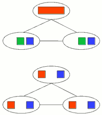

- After enforcing arc consistency:
    - Can have one solution left
    - Can have multiple solutions left
    - Can have no solutions left 
- Arc consistency still runs inside a backtracking search!
- The reason why our consistency in this bottom case  wasn't sufficient to discorve the inevitable failures because it only looks at parents. So you might think maybe we need a stronger notion in our consistency , maybe we need to look beyond Paris 


<h2 id="12ad9074a51088cf63b8e33236d8cc13"></h2>


### Ordering

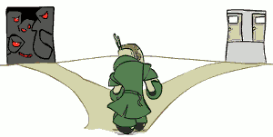

<h2 id="04b8f33966ef671d2d1c0293a74a75d4"></h2>


#### Ordering: Minimum Remaining Values (Variable)

- Variable Ordering:  Minimum remaining values (MRV):
    - Choose the variable with the fewest legal left values in its domain
- Why min rather than max?
    - “Fail-fast” ordering
    - Also called “most constrained variable”
- **hardest variable**

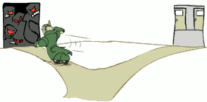

--- 

<h2 id="f03154f0f61b618719c8b5dc67557aaf"></h2>


#### Ordering: Least Constraining Value 

- Value Ordering: Least Constraining Value
    - Given a choice of variable, choose the least constraining value
    - I.e., the one that rules out the fewest values in the remaining variables
    - Note that it may take some computation to determine this!  (E.g., rerunning filtering)
- To choose which value is the least-constraining value, enforce arc consistency for each value (on a scratch piece of paper). 
    - For each value, count the total number of values remaining over all variables.
- **easiest value**
    - we want the one that has the least impact on the rest of the graph
- Why least rather than most?
    - because it's a CSP, and in CSP, you have to do every variable. Sooner or later, you have to do it. You don't have to do every value.
    - So you might as well do the hard variables first, but if you're picking values, you want to pick the ones that are likely to work out, and maybe you don't even have to try the hard ones.
- Combining these ordering ideas makes 1000 queens feasible

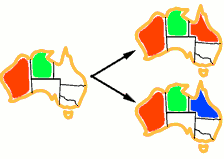

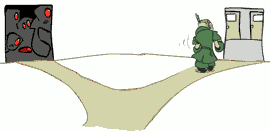

---

So here are steps for solving CPS with enforcing arc consistency:

 1. Unary Constraints at first
 2. do enforce arc consistency
 3. got solution ?
    - solved, stop : 
        - filtered domains of all of the not yet assigned variables each having exactly one value left
    - unsolved , do backtrack search
        - filtered domains of one of the not yet assigned variables having more than one value left
        - filtered domains of one of the not yet assigned variables is empty 
 4. MRV + LCV , assign a value to a variable
 5. After assigning a variable, backtrack search with arc consistency 
    - enforces arc consistency before proceeding to the next variable.


---------

<h2 id="1dff507c8d0411804d4fbae07a040c72"></h2>


# Constraint Satisfaction Problems II

<h2 id="acc9764e38986d7c5f932a1db3eaf43d"></h2>


## Reminder: CSPs

- CSPS:
    - Variables
    - Domains
    - Constraints
         - Implicit ( provide code to compute )
         - Explicit ( provide a list of the legal tuples )
         - Unary / Binary / N-ary
- Goals:
    - Here : find any solution
    - Also:  find all , find best , etc.


<h2 id="8bba60b06aea42c1d4246dd17c987e0b"></h2>


## K-Consistency

- Increasing degrees of consistency
    - 1-Consistency (Node Consistency): Each single node’s domain has a value which meets that node’s unary constraints
        - sometimes called node-consistency.
        - every node's domain has at least one value that meets that node's consitraints
        - basically just means you enfore unary constraints
    - 2-Consistency (Arc Consistency): For each pair of nodes, any consistent assignment to one can be extended to the other
    - K-Consistency: For each k nodes, any consistent assignment to k-1 can be extended to the kth node.
        - Arc-consistency says, if you can get one assigned, you can get 2 assigned
        - K-consistency says , if you can get k-1 assigned, then you can get  k assigned. It's sort of mathematically a little weird, because it assumes that you can get to k-1, but who says you actually can? There is a stronger notion called strong k-consistency.
- Higher k more expensive to compute
- (You need to know the k=2 case: arc consistency)

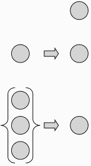

<h2 id="b2f18a946e39a98cdff46b0f465f22db"></h2>


### Strong K-Consistency

- Strong k-consistency: also k-1, k-2, … 1 consistent
- Claim: **strong n-consistency means we can solve without backtracking**!
- Why?
    - Choose any assignment to any variable
    - Choose a new variable
    - By 2-consistency, there is a choice consistent with the first
    - Choose a new variable
    - By 3-consistency, there is a choice consistent with the first 2
    - …
- Lots of middle ground between arc consistency and n-consistency!  (e.g. k=3, called path consistency)


<h2 id="dc4c71563b9bc39a65be853457e6b7b6"></h2>


## Structure

So far the big ways we have accelerated are csp solvers , have been to exploit ordering , filtering. Now we can do something very different. We can look at the structure of the CSP.

Sometimes you look at a CSP that you're trying to solve and you see it has some special graph structure and based on that graph structuer there will be some technique available to you that allows you to solve it in a particularly efficient way and we're going to see a couple examples.

So for example if your CSP involved this giant criminal robot network you might think you should go after that guy in the center. That would be an example of exploiting structure.


---

So here is the constraint graph for the problem of map coloring Australia and an extreme case of problems structure is when you look at your constraint graph. Remember the constraint graph tells you which variables have constraints it doesn't tell you what those are. We know in this particular case any inequality ??? constraints but the constraint graph doesn't tell you that.

![][1]


In particular case we look at it we see that this graph is broken into two pieces. There's the mainland and then there is the tiny little CSP of a single node for Tasmania . That's an extreme case of structure where we have independent subproblems. Independent problems are great because you can solve them separately , you know devide and conquer.

How do we tell we have independence to solve problems ? You can do a connected component analysis of it. For example started some nodes and you search and when you have multiple connected components then they can be solved independently. 


This is RARE to actually see separate subproblems. So let's see if we can come up with some methods that are more broadly applicable.

- Extreme case: independent subproblems
    - Example: Tasmania and mainland do not interact
- Independent subproblems are identifiable as connected components of constraint graph
- Suppose a graph of n variables can be broken into subproblems of only c variables:
    - Worst-case solution cost is O((n/c)(d<sup>c</sup>)), linear in n
    - E.g., n = 80, d = 2, c =20
    - 2⁸⁰ = 4 billion years at 10 million nodes/sec
    - (4)(2²⁰) = 0.4 seconds at 10 million nodes/sec


<h2 id="28db87697415187402d34b1a3b3d0de3"></h2>


## Tree-Structured CSPs

Here is a case where your graph doesn't have to be broken into pieces but it's still simple in some way and this is a very important case that will see coming up over and over in this class. That's the case where you constraint graph it's not separated into pieces but it's not a general graph either.

Here is a case of a constraint graph has tree structure which means no loops, no cycles in the constraint graph . 

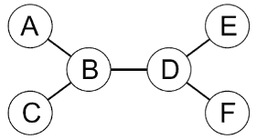

It is a theorem that if the constraint graph has no loops then the CSP can be solved in time that is linear in the size of graph and quadratic in the size of domains.  That's so much better thatn general CSPs worst exponential.

- Theorem: if the constraint graph has no loops, the CSP can be solved in O(n·d²) time
    - Compare to general CSPs, where worst-case time is O(dⁿ)
- This property also applies to probabilistic reasoning (later): 
    - an example of the relation between syntactic restrictions and the complexity of reasoning

---

- Algorithm for solving a tree-structured CSPs:
    1. Order: Choose a root variable, order variables so that parents precede children
        - the first step is to take this tree structure and order it.
        - It means you pick a root variable , any variable works , so you grab the CSP by some root variable you gotta pick up by its anchor and that everything else hanging down. (拎住A 提起来)
        - 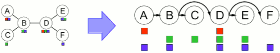
    2. Remove backward: For i := n to 2, apply RemoveInconsistent(Parent(Xᵢ),Xᵢ)
        - once you've ordered it, we do a backwards path. 
        - we start at F, and we go leftward. And for each node in this pass, we are going to make the arc which pointing to that node consistent.
    3. Assign forward: For i := 1 to n, assign Xᵢ consistently with Parent(Xᵢ)

- Runtime: O(n·d²) 


<details>
<summary>
Example: Let's make there arcs consistent !
</summary>

We will start with F , and we will work our way leftward.  When we visit F, we gonna say what arcs comes into you , how many arcs can come into F ?  1 , because it's a tree , ***VERY IMPORTANT*** !

So I look at D->F , so I remove blue in D.

Now we go to E , D->E , that arc is already consistent.

Now I go to D,  B->D ,that arc is already consistent.

B->C ,  remove green in B.

A->B , remove blue in A.

Now start assigning. When assigning , everything is safe. 

</details>

This algorithm guarantees you that in this forward assignment phase there will always be a consistent solution at each point you pick it and you move on. Which means ***no backtracking*** and so this whole thing was pretty efficient.

---

Am I sure it is enough just kind of enforce consistency of the arcs once ?

- Claim 1: After backward pass, all root-to-leaf arcs are consistent
- Proof: Each X→Y was made consistent at one point and Y’s domain could not have been reduced thereafter (because Y’s children were processed before Y)
    - 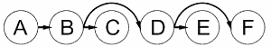
- Claim 2: If root-to-leaf arcs are consistent, forward assignment will not backtrack
- Proof: Induction on position
- This algorithm will not work with cycles in the constraint graph
- Note: we’ll see this basic idea again with Bayes’ nets


<h2 id="709ac339582a9376bc2eeca7e10d07cc"></h2>


## Improving Structure

So we can use this great algorithm on tree-structured CSP.  But CSP is probably not tree-structured either. So we need some way of taking graphs which are not in these wonderful configurations but or maybe closer. 

<h2 id="130b46626de2ded14ad9027586d218d2"></h2>


### Nearly Tree-Structured CSPs

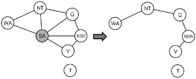

What are we gonna do about SA to get rid of it. This technique called conditioning. 

We are going to assign a value to it . Once we've assigned a value to it and we imagine that  that value we assigned to SA is fixed. Then kind of the rest of the graph can forget that variable exists , and you can strengthen existed on an arc touching SA  can now turn into a unary constraint on the other end.

If we assign SA red, the constraint says essentially the WA , NT , ... ,  can't be red .  So we can remove SA from the graph and add a unary constraint placed on WA.

So we get a simple graph once we instantiate SA and then remove it. 

So the algorithm we have for making something that is nearly tree-structured into a tree structure is called  ***cut-set*** conditioning.

- Conditioning: 
    - instantiate a variable, prune (修剪) its neighbors' domains
- Cutset conditioning: 
    - instantiate (in all ways) a set of variables such that the remaining constraint graph is a tree
- Cutset size c gives runtime O( (d<sup>c</sup>) (n-c) d² ), very fast for small c


<h2 id="c81f59e20d96cc96fb1a78af50455703"></h2>


### Cutset Conditioning 

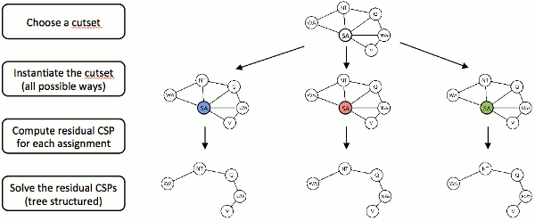


Finding smallest cut-set is np-hard !

<h2 id="15a6670cc8efa82fc50198c0cce30f04"></h2>


### Tree Decomposition

Tree Decomposition is another approach :

- Idea: create a tree-structured graph of mega-variables
- Each mega-variable encodes part of the original CSP
- Subproblems overlap to ensure consistent solutions

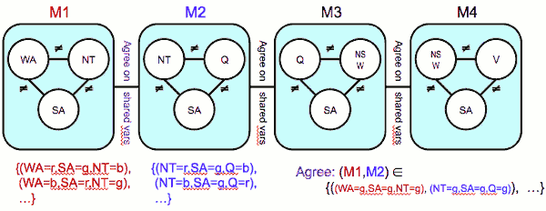

---

<h2 id="4dbd4d648c894941f112d1a8d83cae25"></h2>


## Iterative Improvement

<h2 id="846761c44202fc6587390df7e27e33f8"></h2>


### Iterative Algorithms for CSPs

- Local search methods typically work with “complete” states, i.e., all variables assigned
- To apply to CSPs:
    - Algorithm starts by assigning some value to each of the variables
        - ignoring the constraints when doing so
    - No fringe!  Live on the edge.
    - 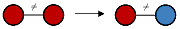
- while at least one constraint is violated,  repeat: 
    - Variable selection: 
        - randomly select any conflicted variable
    - Value selection: min-conflicts heuristic:
        - Choose a value that violates the fewest constraints( among all possible selections of values in its domain )
        - I.e., hill climb with h(n) = total number of violated constraints

<h2 id="d0813c5b61b7d928b7b0bd53bc40b3e2"></h2>


### Example: 4-Queens

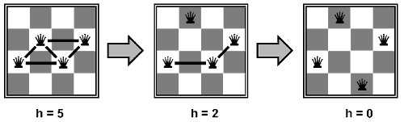

- States: 
    - 4 queens in 4 columns (4⁴ = 256 states)
- Operators: move queen in column
- Goal test: no attacks
- Evaluation: c(n) = number of attacks

---


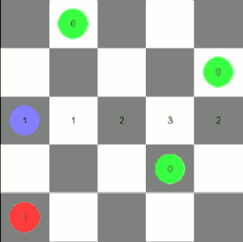

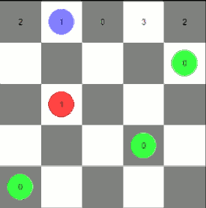

---

<h2 id="e9c367ec703849cbd55be1cc17396330"></h2>


### Performance of Min-Conflicts

- Given random initial state, can solve n-queens in almost constant time for arbitrary n with high probability (e.g., n = 10,000,000)!
- The same appears to be true for any randomly-generated CSP except in a narrow range of the ratio
- 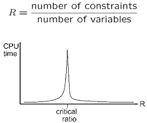

Very few constraints  and ver many  constraints are both great.  There's a magical critical ratio where things suddenly get really really hard because it's kind of just constrained and often just really tough. 

But you got your problem ,your prolbem probably not randomly generated : you were there (critical ratio) too.

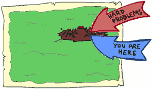

---

<h2 id="240e072c49e1269d63abd125b0dd5ede"></h2>


## Summary: CSPs

- CSPs are a special kind of search problem:
    - States are partial assignments
    - Goal test defined by constraints
- Basic solution:  backtracking search
- Speed-ups:
    - Ordering
    - Filtering 
    - Structure
- ***Iterative min-conflicts is often effective in practice***


<h2 id="e1ea5bc107355233f10e2288fe7fc0ae"></h2>


## Local Search


- Tree search keeps unexplored alternatives on the fringe (ensures completeness)
    - So far the search algorithms we've talked about is not local. They have a fringe where you trying some particular branch of the tree and effective workout you went back to the fringe and you tried your other backup strategies.  The fringe is a safety net.
- Local search: improve a single option until you can’t make it better (no fringe!)
    - In local search you don't have the safety net.  You got one position that you are currently at and you're trying to hill climb in some way. 
- New successor function: local changes
    - You have a new idea of a successor function. The successor function now does not take a plan and extend the plan , instead it takes a complete assignment of some kind and modifies it.  Your successor function is more about modification than about extension.
    - 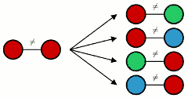
- Generally much faster and more memory efficient (but incomplete and suboptimal)

<h2 id="3b09835fc58a6f4c68cdf9d702bb59c6"></h2>


### Hill Climbing

- Simple, general idea:
    - Start wherever
    - Repeat: move to the best neighboring state
    - If no neighbors better than current, quit
- What’s bad about this approach?
    - Complete ? No. 
    - Optimal ? No.
    - may reach local maximum.
- What’s good about it?
    - you can start anywhere you can do the best you can and there are a wide range of problems in the real world where kind of any solution will work , and you'd like to make it as good as possible and you know you can't get to the optimal solution.

<h2 id="6d905a5baf3b8995646bc1c96ff9bae4"></h2>


### Hill Climbing Diagram

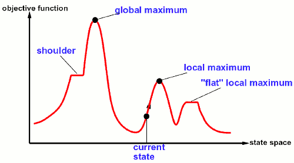

<h2 id="d675d0b56bdafe850c953b589d02838d"></h2>


### Simulated Annealing 退火

You have some current state just like any local search algorithm and you're going to look at the successors just like any local search algorithm. The difference is you have this other concept of a temperature. And the idea is when the temperature is high you're bouncing around like crazy and essentially you're going to go to a neighbor whether it's better than you or not. So what you do is you pick a random successor not the best success. You figure out is it better or worse than me . It's better than me I'll take it. If it's worse than me maybe I'll take it. I'll take it when the temperature is high . So you just kinds of bouncing around like crazy. 

You lower the temperature and you take these downhill steps less and less often. But if it's only one downhill step away from making huge progress you know you'll sit there bouncing around for a while eventually escaped and continue going.


You will spend more times at higher places on the mountain. So essentially *e* here is your fitness function. If the fitness function is high you'll spend more time up there because it takes you longer to bounce.  As the temperature decreases you tend to get stuck where you are.  You get the beautiful guarantee that such as T goes to 0 you got to do it right then you will converge to the optimal state. And you will spend kind of infinitely much time . 


- Idea:  Escape local maxima by allowing downhill moves
    - But make them rarer as time goes on


- Theoretical guarantee:
    - Stationary distribution:  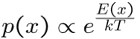
    - If T decreased slowly enough, will converge to optimal state!
- Sounds like magic, but reality is reality:
    - The more downhill steps you need to escape a local optimum, the less likely you are to ever make them all in a row
    - People think hard about ridge operators which let you jump around the space in better ways


<h2 id="0a02d3b8f5cb85d83848b73ba2b78219"></h2>


### Genetic Algorithems

Genetic algorithms are kind of local search in this case not one hypothesis but a bunch of hypothesis. And rather than just locally improving all of them , it is just mutation.

You keep the best hypotheses at each step . In adition to just keeping the best one, you find pairs and you do cross-over , you made them (2 robots -> big robot ).

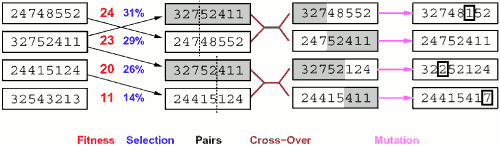

- Genetic algorithms use a natural selection metaphor
    - Keep best N hypotheses at each step (selection) based on a fitness function
    - Also have pairwise crossover operators, with optional mutation to give variety
- Possibly the most misunderstood, misapplied (and even maligned) technique around


<h2 id="e8cba6398fc6216fef8e64d0a854ea7f"></h2>


#### Example: N-Queens

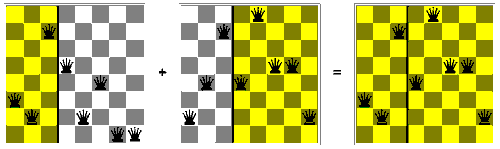


---


  [1]: ../imgs/cs188_constraints_graph.png
