...menustart

- [Decision Diagrams / Value of Perfect Information](#bcce11f51a8ba9f718e13496df69ff75)
    - [Decision Networks](#4110b017c078c49b44248d46eddf6146)
        - [Simple Example](#ecaa6de7751a679c6478caccd8dd7a12)
        - [Ghostbusters Decision Network](#a457e316cc82b392c5e0160e69e95ab0)
    - [Value of Information](#b2d66baefeea18631d1b722cc43aaba2)
        - [VPI Example: Weather](#6b03d15ebadf245e2baef29c08855d20)
    - [Value of Information Cont.](#260873a6e0aea26253ac70a3ed980cd0)
    - [VPI Properties](#8d5bce627e9558ab88dbe1e4a4657365)
    - [Quick VPI Questions](#910d92a2d65cc89a6ef483dd86990ade)
    - [Value of Imperfect Information?](#d4bc3ccdbc840b465ba352eb224292e4)
    - [VPI Question](#dd719415208cb58777d2b82621b8ad0b)
    - [POMDPs](#c5d83905dcd5413dcd5f7fbc5f944126)
        - [Example: Ghostbusters](#dfd2620b95a7eff322bbdc48f2efa51a)
    - [More Generally](#2bc124c39197760014dd5558b073785b)

...menuend

<h2 id="bcce11f51a8ba9f718e13496df69ff75"></h2>

# Decision Diagrams / Value of Perfect Information

<h2 id="4110b017c078c49b44248d46eddf6146"></h2>

## Decision Networks

DNs are way of graphically connecting Bayes nets and actions and utilities.

DNs will be a lot like BNs, but there will be more types of nodes rather than just random variable nodes. 

**In a Bayes Net, the whole point is to query Posterior probability, in a Decision Network, the whold point is to decide which action is best.**

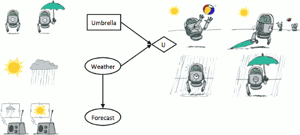

 - New node types:
    - ![][1] Chance nodes (just like BNs)
        - we have random variable for weather ,which could be sunny or rainy 
        - with a random variable for forecase , tends to be a noisy version of actual weather
        - 这部分其实就是 BNs
    - ![][2] Actions (rectangles, cannot have parents, act as observed evidence)
        - you have a choice here 
        - you can either take your umbrella with you , or you can leave it at home 
        - so this is something you get to set
    - ![][3] Utility node (diamond, depends on **action** and **chance** nodes)
        - dislike the utility we met before, this node is not a number ,but a function , a table 
        - it tells you for every possible combination of its parent values , what is the utility for experiencing that combination of parent values. 
        - over there, there are 2 parents: umbrella and weather.   It could be that 
            - it's sunny , you left your umbrella at home , now you get to play with the beach ball , probably have high utility
            - it's sunny , but you brought you umbrella , and now you don't get to play the beach ball , we get to carry umbrella around ,you are not so happy
            - it's rainy , you didn't bring an umbrella, that's the worst case
            - it's rainy , but you brought your umbrella, at least you have a way to protect yourself from the rain. 
        - all 4 of these will have a number associated with them , the utility for that particular outcome .
        - **if there is only 1 agent , where will only be one utility node, if there's more than 1 agent there could be more than 1 utility node.**

What are we going to be doing ?  We are still going to be maximizing expected utility. 

 - **MEU: choose the action which maximizes the expected utility given the evidence**
 - Can directly operationalize this with decision networks
    - Bayes nets with nodes for utility and actions
    - Lets us calculate the expected utility for each action
 - What will we do with a network like above ?
    - We'll look at every possible action we might take, compute the expected utility  if we were to take that action and then pick the action that maximizes the expected utility. 

---

So how do you select an action ?

 - Action selection
    - Instantiate all evidence
    - Set action node(s) each possible way
        - loop over all possible choices for the actions 
    - Calculate posterior for all **parents of utility node**, given the evidence
        - this case you would compute the conditional distribution of Weather, given the evidence. 
        - if weather itself is evidence it's very easy ,  if there's no evidence then it's just a prior for Weather
        - if there is some forecase you will essentially apply Bayes rule to find out P(weather | forecase)
    - Calculate expected utility for each action
    - Choose maximizing action

<h2 id="ecaa6de7751a679c6478caccd8dd7a12"></h2>

### Simple Example 

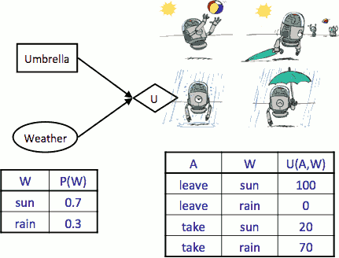

There are part of the problem specificaton of course.   If you are designing a robot to be deployed somewhere ,you would decide for that robot what the utilities are such that when the robot maximizes expected utility it does what you want it to try to achieve. 

- we need to loop over all possible actions , the Umbrella 
    - Umbrella = leave
        - what is the expected utility ?  Sum over all possible outcomes for Weather 
        - EU(leave) = ∑w P(w)U(leave, w) = 0.7 * 100 + 0.3 * 0 = 70
    - Umbrella = take 
        - EU(take) = ∑w P(w)U(take, w) = 0.7 * 20 + 0.3 * 70 = 35
- Optimal decision = leave
    - MEU(∅) = maxₐ EU(a) = 70
        - ∅ means no evidence.   

This is a lot like expectimax tree. 

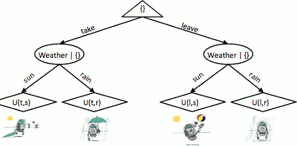

- Almost exactly like expectimax / MDPs
- What’s changed?
    - when we did expectimax, we have the probability 
    - when in DNs, here, when we say, what's the probability of weather given the forecast, we actually have to do computation to figure out the probabilities from that expectation node. We shall do that by running Bayes Net inference.

---

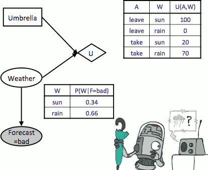

We listened to the forecast and the forecast is bad.  

- So in this kind of computations we compute the conditional distribution of the parents given evidence.
    - P(W|F=bad)
    - Bayes net provides the CPT P(F|W), we need to compute P(W|F=bad).
- loop
    - Umbrella = leave  
        - EU(leave|bad) = ∑w P(w|bad)U(leave, w) = 0.34 * 100 + 0.66 * 0 = 34
    - Umbrella = take 
        - EU(take|bad) = ∑w P(w|bad)U(take, w) = 0.34 * 20 + 0.66 * 70 = 53
- Optimal decision = take
    - MEU(F=bad) = maxₐ EU(a|bad) = 53

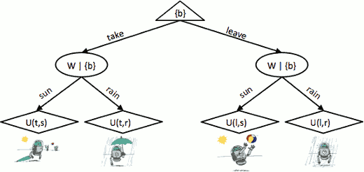

<h2 id="a457e316cc82b392c5e0160e69e95ab0"></h2>

### Ghostbusters Decision Network

- you receive -1 at every time step
- you receive 250 if you buster the ghost
- you receive 0 and game over if you buster and miss

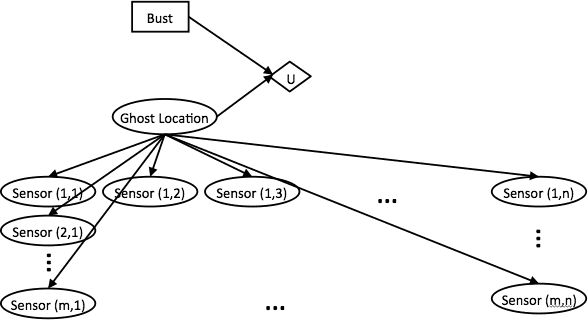

- The top part (Bust) says I can bust.
    - and the bust action has some large number of actions.
    - for now, let's just imagine it's time to bust. Bust now is an action where there is a value of that action for each square on the board.

<h2 id="b2d66baefeea18631d1b722cc43aaba2"></h2>

## Value of Information

What we're interested in now is what is the value of information. How many utility points is it worth if I reveal this variable to you?

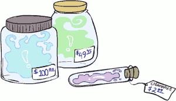

You have these sensors, how much would you be willing to pay to get an access to a sensor and measure its value. 

---

- Idea: compute value of acquiring evidence
    - Can be done directly from decision network
    - What's that mean?
        - *Well remember, if I put DNs in front of you and say, all right, decision time. Are you taking the umbrella or not? You can say, ok, hold on a second, calculate, calculate, calculate. I'm going to take the umbrella, and my MEU is going to be 53. We can then talk hypothetically about what would happen if I showed you variable. You'd make better decisions, and you get higher utilities.*
- Example: buying oil drilling rights
    - Two blocks A and B, exactly one has oil, worth k
    - You can drill in one location
    - Prior probabilities 0.5 each, & mutually exclusive
    - Drilling in either A or B has EU = k/2, MEU = k/2
    - 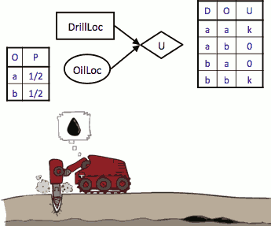
- Question: what’s the **value of information** of O?
    - Value of knowing which of A or B has oil.
        - if you know the oil location (somebody tells you) , then your MEU is k. 
        - before, your MEU is k/2
        - the difference is k/2, so rationally you're willing to pay k/2 to get ot know where the oil is.
    - Value is expected gain in MEU from new info
    - Survey may say “oil in a” or “oil in b,” prob 0.5 each
    - If we know OilLoc, MEU is k (either way)
    - Gain in MEU from knowing OilLoc?
    - VPI(OilLoc) = k/2
        - value of **perfect** information
        - That is the difference between the MEU whether or not taking the action with the variable.
    - Fair price of information: k/2

<h2 id="6b03d15ebadf245e2baef29c08855d20"></h2>

### VPI Example: Weather

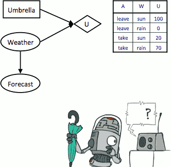

We can observe only Forecast. Question is how valuable is it to observe the forecast. 

 - MEU with no evidence
    - MEU(∅) = 70
 - MEU if forecast is bad
    - MEU(F=bad) = 53
 - MEU if forecast is good
    - MEU(F=good) = 95
 - Forecast distribution
    - P(F=good) = 0.59, P(F=bad) = 0.41
        - P(F) is not in BNs. We can compute by running inference in BNs
    - 0.59·95 + 0.41·53 - 70 = 7.8 
    - in this case 7.8 means that you would be willing to pay 7.8 to get to listen to the forecast.
 - 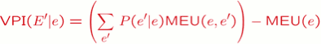
    - we have the VPI of a particular variable or set of variables E' given that you already observed another set of variables *e* which could be the empty set.
    - in our example *e* was the empty set , E' was equal to forecast. 
      

<h2 id="260873a6e0aea26253ac70a3ed980cd0"></h2>

## Value of Information Cont.

 - Assume we have evidence E=e.  Value if we act now:
    - 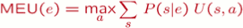
    - 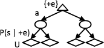
        - you have initial evidence +e, so choose an action, that point the chance node kick in ,which will instantiate the parent variables of the utility node and then you have your utility nodes.
 - Assume we see that E’ = e’.  Value if we act then:
    - 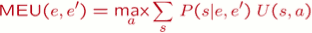
    - 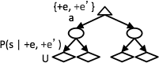
        - after you observe both {+e,+e' }, you take an action, and then the chance nodes kick in and then the utility nodes.
 - BUT **E’ is a random variable whose value is unknown**, so we don’t know what e’ will be.
    - So we need to have to prediction about what e' will be in order to compute how valuable that information is to us. 
 - Expected value if E’ is revealed and then we act:
    - 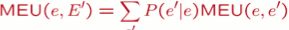
        - *the missing image part is `e'`*
    - 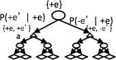
        - now we have an extra chance node
        - you were to get to observe evidence but you don't know yet what the evidence is going to be.  You start with chance node. 
        - first thing that happens is the evidence e' will be observed. you don't know yet what it's going to be, could be +e' or -e'.
        - after that get instantiated you get to choose your action, after that more chance nodes will kick in for the parent variables of the utility node after which utility nodes kick in. 
 - Value of information: how much MEU goes up by revealing E’ first then acting, over acting now:
    - 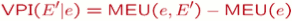

<h2 id="8d5bce627e9558ab88dbe1e4a4657365"></h2>

## VPI Properties

 - Nonnegative
    - ∀E',e : VPI(E'|e) ≥ 0
    - more information will always help you . **on the average** , when you don't know yet what the information is going to be, it is good to get information. But again some informaction could be negative for you -- things get worse you just unlucky scenario. 
 - Nonadditive  (think of observing Eⱼ twice)
    - VPI(Eⱼ,Ek |e) ≠ VPI(Eⱼ |e) + VPI(Ek |e)
    - that VPI(Eⱼ,Ek |e)  is not the same as the sum of the individual VPI.
 - Order-independent
    - VPI(Eⱼ,Ek |e) = VPI(Eⱼ |e) + VPI(Ek |e , Eⱼ )
    -   = VPI(Ek |e) + VPI( Eⱼ |e , Ek  )
    - a lot like the chain rule 

 - The following statements are true:
    - VPI is guaranteed to be nonnegative (≥0).
    - The MEU after observing a node could potentially be less than the MEU before observing that node.
    - VPI is guaranteed to be exactly zero for any node that is conditionally independent (given the evidence so far) of all parents of the utility node.

<h2 id="910d92a2d65cc89a6ef483dd86990ade"></h2>

## Quick VPI Questions

 - The soup of the day is either clam chowder or split pea, but you wouldn’t order either one.  What’s the value of knowing which it is?
    - 0
 - There are two kinds of plastic forks at a picnic.  One kind is slightly sturdier.  What’s the value of knowing which?
    - somewhat positive.  can not really put a number on it this.
 - You’re playing the lottery.  The prize will be $0 or $100.  You can play any number between 1 and 100 (chance of winning is 1%).  What is the value of knowing the winning number?
    - 99$

<h2 id="d4bc3ccdbc840b465ba352eb224292e4"></h2>

## Value of Imperfect Information?

What if somebody offers you some imperfect, slightly decayed information?

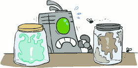

 - No such thing( as we formulate it )
    - *in our formulation, there is no imperfect information.*
 - Information corresponds to the observation of a node in the decision network
    - Information is revealing the value of a random variable in your network.
    - observing means you know what the value is
 - If data is “noisy” that just means we don’t observe the original variable, but another variable which is a noisy version of the original one
    - e.g. we observe forcast, not weather.

<h2 id="dd719415208cb58777d2b82621b8ad0b"></h2>

## VPI Question

 

 - we addd an extra variable : Scouting Report
    - so now it's possible that a scout reports on where the oil location might be. 
    - it's going to be a noisy version of the actual oil location 
    - but they might have some kind of measurement tools in which they can get some report back and then the scout could be one of many scouts. some of them might be good, some of them might be bad.  So which one you get might influence the quality of the report .

--- 

 - VPI(OilLoc) ?
    - saw that before, that is still k/2
 - VPI(ScoutingReport) ?
    - [0,k/2]
    - can not put the number on this. 
 - VPI(Scout) ?
    - for knowning what scout is doing the scouting report
    - = 0
    - if we observe evidence that does not change the distribution for the parent variables , it will not change our decision, it will not change our expected utility. 
    - Scout is independent of OilLoc with no other evidence. So knowing the Scout is not affecting the distribution  of parent variables , hence not affecting our MEU. 
 - VPI(Scout | ScoutingReport) ?
    - > 0 
 - Generally: 
    - If Parents(U) ⊥ Z | CurrentEvidence
    - Then VPI( Z | CurrentEvidence) = 0 
    - that is , VPI is guaranteed to be exactly zero for any node that is conditionally independent (given the evidence so far) of all parents of the utility node.

<h2 id="c5d83905dcd5413dcd5f7fbc5f944126"></h2>

## POMDPs

Partially observable Markov Decision Processes.

- MDPs have:
    - States S
    - Actions A
    - Transition function P(s’|s,a) (or T(s,a,s’))
    - Rewards R(s,a,s’)
    - 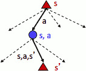
    - **the thing that was uncertain was the outcome of taking action A in state S**.
- POMDPs add:
    - *not only am I not sure what my actions will do, but also what state I'm actually in.* 
        - *You're a robot, and you're moving around and you have actions like drive left, drive right. But you're not really even entirely sure where you are. You may have a belief distribution over where you are. But in general, you don't even know the state of the world for sure. The only thing you really know is your observations over that state.*
    - Observations O
    - Observation function P(o|s) (or O(s,o))
    - 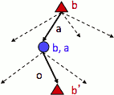
    - POMDP is a partially observalbe MDP. Partially observable means that you don't observe all the variables that are in play , only some are observed. 
    - When chance trasitions happens what changes is you get to observe a new variable which then in turn changes your distribution. 
        - your believe *b*  is something initially  
        - you take an action
        - then chance kicks in ( b,a ) 
        - and then you have a new distribution *b'* after that

- **POMDPs are MDPs over belief states b (distributions over S)**
- We’ll be able to say more in a few lectures

<h2 id="dfd2620b95a7eff322bbdc48f2efa51a"></h2>

### Example: Ghostbusters

- In (static) Ghostbusters:
    - Belief state determined by evidence to date {e}
        - b is a distribution over actual states, it's my distribution over ghost location. That's a function of all the sensor readings. 
    - Tree really over evidence sets
    - Probabilistic reasoning needed to predict new evidence given past evidence
    - 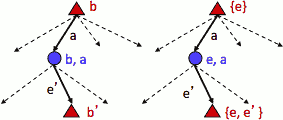
        - there 2 are equivalent , the right one explicitly keeps track of the evidence bariabels. The left one keeps track of the probabilities of the beliefs that actually matter in these computations.
- Solving POMDPs
    - POMDPs are really hard.
    - One way: use truncated expectimax to compute approximate value of actions
    - What if you only considered busting or one sense followed by a bust?
    - You get a VPI-based agent!
    - 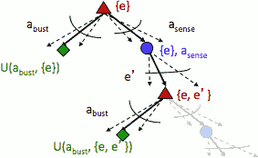
        - so you have some evidence initially {e}  (red)
        - you can take a buster action abust  (black)
            - for each of the possible locations you could bust that, there is some utility, you can compute the expected utility .   U( abust ,{e} )  (green)
        - then there is a possibility to sense, after you senser you would get more evidence {e,e'}  (red). 
        - after that you might take the bust action. 
        - so you now get a tree where you get to decide between a sense action and bust action at the first step. 
        - if you run expectimax in this tree what you get out is a way to make decisions about information gathering VS. taking physical actions. 
 
<h2 id="2bc124c39197760014dd5558b073785b"></h2>

## More Generally

- General solutions map belief functions to actions
    - Can divide regions of belief space (set of belief functions) into policy regions (gets complex quickly)
    - Can build approximate policies using discretization methods
    - Can factor belief functions in various ways
- Overall, POMDPs are very (actually PSACE-) hard
- Most real problems are POMDPs, but we can rarely solve then in general!

---

 [1]: ../imgs/cs188_DM_chance_node.png
 [2]: ../imgs/cs188_DM_action_node.png
 [3]: ../imgs/cs188_DM_utility_node.png

