...menustart

- [Hidden Markov Model](#70359ede2a47ed4a3c8ca9b6521d7629)
    - [Pacman-Sonar (P4)](#e134a8fe2a3d65ce80a1a1ec8fd98778)
    - [Markov Models (Recap)](#978327ecd03dbcbb86123b16a4a31213)
        - [Conditional Independence (Recap)](#8d531d5e630e66648acaf2c680a347b7)
    - [Hidden Markov Models](#94d2b6fed9dd768fe2edec7e6c85546f)
        - [Example : Weather HMM](#c7624bc33d3af36dde93578541120635)
        - [Example: GhostBusters HMM](#29e2fd6f91ff2c795e0611725208492a)
        - [HMM Conditional Independence](#70edd3baf536c5134e73a1c0aa1b5e9d)
        - [HMM example](#1bebd9da99c29add41fd9b5f55b647e0)
        - [Real HMM Examples](#a28d273e7e37d7b9dac9b8648afa65c2)
    - [Filtering / Monitoring](#7d5a5544b159698a3c0d234ed796ab6c)
        - [Example:  Robot Localization](#8eb802f81a304b8d30bbde98a9341934)
    - [Inference: Base Cases](#6cdd6a9a5085ef26dcbe01cba728e9fa)
    - [Passage of Time  (base case 2)](#a5335b4e1f44edbd59567e52c2e1b023)
        - [Example: Passage of Time](#25cfc18fb11a92c7484035257a6e5d7d)
    - [Observation  (base case 1)](#e4e6a729de1544729d52e53710929278)
        - [Example of Observation](#22a77e6cdda4b68b0d0175942f8c991b)
        - [Example: Weather HMM](#75fc03589b48053de414b7e5d43b25a6)
    - [The Forward Algorithm](#6dbc07cd7c694bd7ba7917098b848d8b)
    - [Online Belief Updates](#dec94cde56942725d8a224ed9c065de2)
    - [Example : Ghost Buster](#dc8ab069265738c8965ed6fe1ffb2ea5)

...menuend


<h2 id="70359ede2a47ed4a3c8ca9b6521d7629"></h2>


# Hidden Markov Model 

<h2 id="e134a8fe2a3d65ce80a1a1ec8fd98778"></h2>


## Pacman-Sonar (P4)

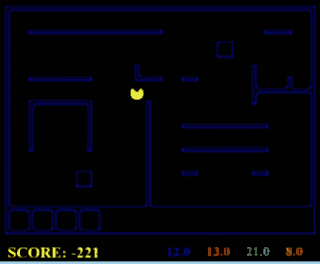

This pacman can eat ghost but first he has to find them. So soon as pacman start moving , you will see in the bottom colored numbers , which are kind of noisy readings of how far the ghosts are. 

Now let's say I want to eat the orange ghost. If you could somehow take these numbers over time and combine them with your model of how the world works --  means where are the walls, where are the maze -- and also your model of how the ghosts move , and figure out where they are. 

The ghosts' location is falling in Markov model, but we're also having measurements, and these measurements we don't have in the Markov model. 

Once we have a hidden Markov model, we'll also have measurements.

<h2 id="978327ecd03dbcbb86123b16a4a31213"></h2>


## Markov Models (Recap)

- A **Markov Model** is a chain-structured Bayes' net (BN)
    - Each node is identically distributed (stationarity)
    - Value of X at a given time is called the **state**
        - 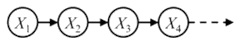
    - As a Bayes' net
        - P(X₁)
        - P(X<sub>t</sub> | X<sub>t-1</sub>)
    - Parameters: called **transition probability** or dynamics, specify how the state evolves over time (also, initial state probabilities)
        - this is the model how the world changes
    - Stationarity assumption: transition probabilities the same at all times
        - this means transition probabilities P(x<sub>t</sub> | x<sub>t-1</sub> ) don't depend on time, they are always the same. 
    - Same as MDP transition model , but no choice of action
        - here is no action, you just watching 


<h2 id="8d531d5e630e66648acaf2c680a347b7"></h2>


### Conditional Independence (Recap)

- Basic conditional independence:
    - Past and future independent given the present
        - Bayes Net D-separation
    - Each time step only depends on the previous
        - to predict what happens at the next time, just knowing the current time is the best thing. Knowing more things about the past is not going to help you.
    - This is called the (first order) Markov property
        - You might say, well, what if it doesn't apply in my situation? What if my situation, the state of the next time, depends on the state of the current time and the state of the previous time?
        - Well, to still be able to fit in this format and to really fit the notion of state, you should then combine the state of the current time and the state of the previous time in one bigger state variable that you now call your state.
- Note that the chain is just a (growable) BN
    - We can always use generic BN reasoning on it if we truncate the chain at a fixed length. But in this chapter we will use some variations of this algorithm that are easy to derive from first principles for Markov models, and that have equivalance simplifications of the sampling and variable elimination algorithms.

---


<h2 id="94d2b6fed9dd768fe2edec7e6c85546f"></h2>


## Hidden Markov Models

A Markov model can talk about how the world changes , but if I forecast into the future sooner or later I just don't know anything anymore. 

But hidden Markov model says 2 things: I know how the world changes in a time step which let me figure out roughly what's gonna happen in the absense of evidence and at every time step I also getting some kind of reading -- I got some evidence that helps me sharpen my belief about what's happening. So as the same time that time passes ,evidence also comes in. The robot moves and takes another sonar reading.


---

- Markov chains not so useful for most agents 
    - need observations to update your beliefs
- Hidden Markov models (HMMs)
    - Underlying Markov chain over states *S*
    - You observe outpus (effects) at each time step
    - As a Bayes' net :
        - 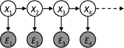
        - structure:  1 hidden variable(X) , and 1 observed variable(E)
        - in HMM, we don't get to observe the hidden state -- X, but the hope is that by observing the evidence variables, we can somehow infer a posterior distribution over the hidden states that allows us to do something interesting.
        - what we're gonna have is that every time there's ganna be a hidden variable. that structure like a markov chain and each time the evidence depends only on the state unobserved but only on the state at that time (E | X) ( Bayes net D-separation )

---

<h2 id="c7624bc33d3af36dde93578541120635"></h2>


### Example : Weather HMM 

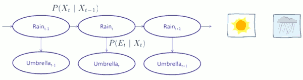

The sad grad student HMM. 

There's a grad student. He is just in the basement at all times. They don't come out of that basement. But luck has it, every now and then Professor stops by and say hi to them. And sometimes, professor has an umbrella, sometimes not. And that, for the grad student, is a way to extract information about whether today might be a sunny day or a rainy day.

- hidden variable: where or not it's raining -- True or False
- observed variable: an umbrella

- Now, there's mulitple distributions involved.
    - the initial state distribution 
        - initially sunny or rainy
    - a distribution of for next day
        - like we saw in the Markov Model, the transition model.
    - a distribution for evidence given current state
        - the probability of various evidence values given the underlying state , which we then used to predict the opposite -- something about X.


- So an HMM is defined by:
    - **Initial distribution:  P(X₁)**
    - **Transitions:  P(X<sub>t</sub>|X<sub>t-1</sub>)**
    - **Emissions:   P(E<sub>t</sub>|X<sub>t</sub>)**


So what do we need to define the HMM ? 
 
- we need 1 function which says how rain on one day depends on the previous day. 
    - 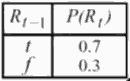
    - This is the rain to sun transition probability 
- we also need a function says given rain and separately given sun, what's probability of seeing an umbrella
    - 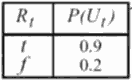
    - That is called emission model. This tells you what probability of seeing various evidences values is  for each underlying state. 
    - In this case it says that when it's raining you see the umbrella 90% of time , but when it's not raining you still see it 20% of time. 
- equivalent to 
    - 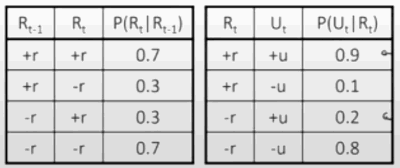
- We have HMM:
    - 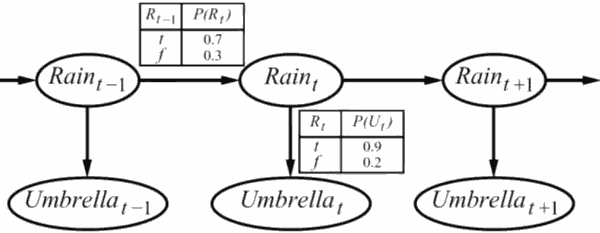

So from a single observation of an umbrella you don't know very much , but if day after day you're seeing the umbrella you start to kind of gain some confidence.

---

<h2 id="29e2fd6f91ff2c795e0611725208492a"></h2>


### Example: GhostBusters HMM

- P(X₁) = uniform
    - 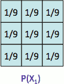
    - in the course demo, it is  0.02 that you see everywhere on map.
- P(X|X') = usually move clockwise, but sometimes move in a random direction or stay in place
    - 
    - 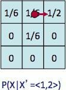
        - for that red square , it's 50% precent probability of moving right , 1/6 probability that you'll stand, 1/6 probability to go in other direction.
    - Where do these conditional probabilities come from ?
        - This is your assumptions about the world , you might learn them from data, for now that's just an input.
    - That's what happens from that one state.  **But you generally don't know what state you're in**, and you need to sum over all the options , that's  the forward algorithm was about.
- P(Rᵢⱼ|X) = same sensor model as before: red means close, green means far away.
    - somewhere there has to be specified precisely the probability of reading at a certain position given the underlying state. 
    - 
    - so it might say if you read at (3,3) and the ghost is there , your probability of getting red is 0.9. Those facts live in the emission model , they say how the evidence directly relates to the state at that time. 
    - 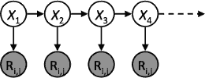

- The dynamics of HMM: alternation between *time passing* and *measurement*, *time passing* and *measurement*, ...
    - Time passes
        - which tends to diffuse where the ghost probability mass is
    - measurement
        - which tends to help us concentrate where the ghosts might be.
    - This is the HMM process in action.

---

<h2 id="70edd3baf536c5134e73a1c0aa1b5e9d"></h2>


### HMM Conditional Independence 

Let's think about the independence assumptions we make in this model.

- HMMs have 2 import independence properties
    - Markov hidden process:  future depends on past via the present 
        - that is, knowing a state at a given time separates past from future.
        -  same as MM. 
    - Current observation independent of all else given current state
        - given X₃ , E₃ is independent of all anything else we could find out once we know X₃. It's just X₃ directly influences our measurement, and nothing else has any influence anymore.
- Quiz: does this mean that evidence variables are guaranteed to be independent ?
    - If I don't observe anything I could say : Is the evidence I see at time₁ independent of the evidence I see at time₂ ? 
    - It is like the umbrella on tuesday is independent of the umbrella on Wednesday. 
    - So It seems like it shouldn't be. The evidence variables are absolutely not independent. They're only conditionally independent. 
    - for example, from E₁ to E₄, there is an active path, it consist of a common cause , and a causal chains. And nothing is observed in-between.


---

<h2 id="1bebd9da99c29add41fd9b5f55b647e0"></h2>


### HMM example


<details>
<summary>
Not used in CS188 Fall 2018 lecture
</summary>

The prior probability P(X₀), dynamics model P(X<sub>t+1</sub>|X<sub>t</sub> ), and sensor model P(E<sub>t</sub>|X<sub>t</sub>) are as follows:

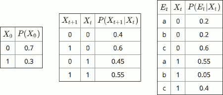

We perform a first dynamics update ,and fill in the resulting belief distribution B'(X₁) 

 X₁ | B'(X₁) 
--- | --- 
 0 | 0.415
 1 | 0.585

- 0.415 = 0.7\*0.4+0.3\*0.45

We incorporate the evidenc E₁=b. We fill in the evidence-weighted distribution P(E₁=b|X₁)·B'(X₁), and and the (normalized) belief distribution B(X₁).

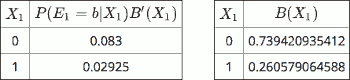

</details>

---

<h2 id="a28d273e7e37d7b9dac9b8648afa65c2"></h2>


### Real HMM Examples

For every HMM there is a hidden state -- which is usually the thing you want to figure out -- , and an evidence variable -- which is the thing you got to observe. 

You get the evidence at every time and you usually want to figure out the state at every time.  

- Speech recognition HMMs:
    - Observations are acoustic signals (continuous valued)
    - States are specific positions in specific words (so, tens of thousands)

- Machine translation HMMs:
    - Observations are words (tens of thousands)
    - States are translation options

- Robot tracking:
    - Observations are range readings (continuous)
    - States are positions on a map (continuous)

---

<h2 id="7d5a5544b159698a3c0d234ed796ab6c"></h2>


## Filtering / Monitoring

Now we are going to talk about how to keep track of what you believe about a variable X -- the state variable -- as evidence comes it and time passes, and from this we'll build up the full-forward algorithm. 


- Filtering, or monitoring, is the task of tracking the distribution B<sub>t</sub>(X) = P<sub>t</sub>(X<sub>t</sub> | e₁, …, e<sub>t</sub>) (the belief state) over time
    - B<sub>t</sub>(X) : belief state over state , which is a conditional of X<sub>t</sub> given all evidence up to time t.
- We start with B₁(X) in an initial setting, usually uniform
- As **time passes**, or we **get observations**, we update B(X)
- The Kalman filter was invented in the 60’s and first implemented as a method of trajectory estimation for the Apollo program

---

<h2 id="8eb802f81a304b8d30bbde98a9341934"></h2>


### Example:  Robot Localization

The robot doesn't know where it is . It knows the map -- somebody gave blueprints . 

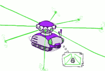

It is going down the corridor and all do is shoot out lasers in each direction and see how close they bounced off a wall. 

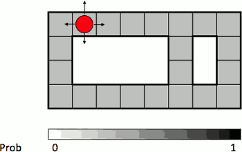

- Sensor model: can read in which directions there is a wall or not, it makes at most 1 error.
- Motion model: may not execute action with small prob.


So it knows there's a wall right here, but no wall in front of me. And if it gets a reading that says there's wall on my left and right but not in front or behind, then suddenly it shouldn't think it's anywhere in this building.  Where should I think it is? It is kind of think it's in the corridors, corridors look like that. It's the sensor model , formly is conditioned on my current position, I need say a distribution over readings.  Let's image that instead of the continuous readings , the readings are wall or not in each direction.

---

We first do a sensor reading.

So if I sense that is a wall above and below I should have pretty high probability of my belief distribution of being in the dark gray squares. I should have some smaller probability of being in the lighter grey square.  

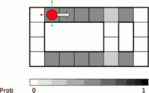

- t=1
- Lighter grey: was possible to get the reading, but less likely b/c required 1 mistake

Then the robot will move to the right. We'll have a transtion model for that. It't not guaranteed to move one to the right, but with high probability, it will.

Then we get another sensor reading.

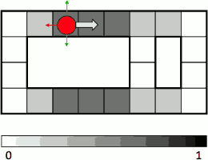

- t=2

---

Then moves again, also does a sensory update, 
 
Time passes. 

As I continue reading north and south walls , what will happen is there will be fewer and fewer places which are consistent with my history of readings.


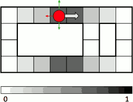

- t=3

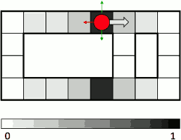

- t=4

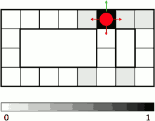

- t=5

---

<h2 id="6cdd6a9a5085ef26dcbe01cba728e9fa"></h2>


## Inference: Base Cases

So, what are the base cases ?

Inference in Markov model is acutally the approximate inference .

Let's do the base cases. There's really 2 things that happen in HMMs. 

1. One is time passes.
    - You go from X<sub>t</sub> to X<sub>t+1</sub> to.  
2. The other thing happens you see evidence.

There things are interleaved. 

---

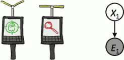


But if all you had was a single time slice, you had X₁ and you saw evidence at time₁ E₁ , and you want to compute what's probability over my hidden state X₁ given my evidence E₁. So you just want to compute this conditional probability : P(X₁|e₁).

- I know P(X₁) , this is what before I see the evidence. 
- I also know a distribution that tells me how the evidence relates to X₁ : P( E₁|X₁ ). 
 
That's not quite what I want. What I want is P(X₁|e₁). 


```bash
P(X₁|e₁) = P(X₁,e₁)/P(e₁)
         = P(e₁|X₁)·P(X₁) /P(e₁) 
```

We're interested over X₁. e₁ is not a variable. Anything that does not involve X₁ we can just remove if it's just multiplied in, because this constant *e₁* is present for each value of x₁. It say it's proportional to this.

And I can do the computation being off by that constant and then renormalize at the end.

```bash
P(x₁|e₁) = P(x₁,e₁)/P(e₁)
         ∝ P(x₁,e₁)
         = P(x₁)·P(e₁|x₁)
```

That says for each value X, they get weighted by the probability of the evidence given that underlying state.

What would be the result of this calculation ?

x₁ | ∝ P(x₁,e₁)A | P(x₁)
--- | ---  | ---
0  | 0.2 |  0.4
1  | 0.3 |  0.6


I'm instead going to compute P( X₁,e₁ ) and normalize in the end. I know how to compute it -- `P(X₁,e₁) = P(e₁|X₁)·P(X₁)`. So I compute all of these products: current probability times evidence probability. And then once I have that whole vector of those I re-normalize and now I have the conditional distribution of P(X₁|e₁). That is what happens when you incorporate evidence: you take your current vector of probabilities P(X₁) ,you multiply each one by the appropriate evidence factor and then you **renormalize** it. 

---

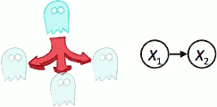

The other base case is transition over time. This is the markov model update.


You have a distribution over X₁ and rather than seeing evidence , time passes by one step. Well in this case I know P(X₁) , and I know P(X₂|X₁) . But I want is P(X₂).

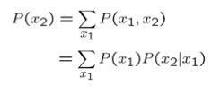

That's exactly what we've been doing in the first half of lecture.

---

- Those 2 pieces assembled to do everything you need in HMMs. 

---

<h2 id="a5335b4e1f44edbd59567e52c2e1b023"></h2>


## Passage of Time  (base case 2)

- **Assume we have current belief P(X | evidence to date)**
    - B(X<sub>t</sub>) = P(X<sub>t</sub>|e<sub>1:t</sub>)
- **Then, after one time step passes:**
    - 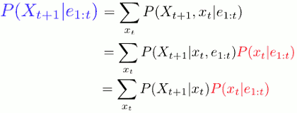
        - step1: The reason we bring in x<sub>t</sub> is because we assume recursively that we already know the B(X<sub>t</sub>). So by bringing in x<sub>t</sub>, we might be able to build us something we already have.
            - **so I can introduce x<sub>t</sub>, and sum it out at the same time. This is just introducing a variable.**
        - step2: conditional chain rule
        - step3: independent. 
            - We don't have the all of these available -- the red one we already have available, the black one we don't. What do we need to do? We need to somehow make an assumption. The HMM gives us the assumption: P(X<sub>t+1</sub> | x<sub>t</sub>, e<sub>1:t</sub>) does not depend on evidence e<sub>1:t</sub>. So we can get rid of that.
            - Now we have quantities we know. P(x<sub>t</sub>|e<sub>1:t</sub>) recursively comes from the previous computaion B(X<sub>t</sub>), P(X<sub>t+1</sub> | x<sub>t</sub>) is in our dynamics model.
    - you take your input P(X<sub>t</sub>|e<sub>1:t</sub>),  which is your current beliefs. You take them multiply by the transition probabilities,  and then you sum out all the sources and now you have the probabilities over all of the targets. 
- **Or, compactly :**
    - 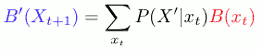
    - it says: you want to know the probability tomorrow of being at some particular X<sub>t+1</sub>. You consider how likely it is to get to X<sub>t+1</sub> from each locations (X'). So you want to know how likely it is that I'll end up at this particular X<sub>t+1</sub> , you consider all the places that could get you there , in one time step. and you say : what's the probability of being , here at A and then moving there , what's the probability ? and whatelse if at B, C, ... 
        - 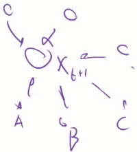
    - that is this, you  summer(∑) all of the places you could have been , you look how likely it is that you were there ( B(x<sub>t</sub>) ) to begin with , times how likely it is had you been there to get to X'.  
- **Basic idea: beliefs get “pushed” through the transitions**
    - With the “B” notation, we have to be careful about what time step t the belief is about, and what evidence it includes

---

<h2 id="25cfc18fb11a92c7484035257a6e5d7d"></h2>


### Example: Passage of Time

- **As time passes, uncertainty “accumulates”**
    - 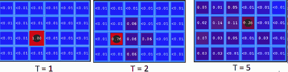
    - (Transition model: ghosts usually go clockwise)

That's basically your robot knows what's going on today and sooner or later if you never get any more evidence , the robot will become more and more confused until it has no idea what's going on. 

- 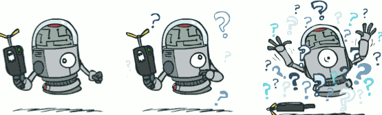


--- 

<h2 id="e4e6a729de1544729d52e53710929278"></h2>


## Observation  (base case 1)


- Assume we have current belief before the evidence P(X | previous evidence):
    - B'(X<sub>t+1</sub>) = P(X<sub>t+1</sub>|e<sub>1:t</sub>)
    - I have a belief vector that says here's my probability distribution over what's going on at a centain time BEFORE I see my evidence. 
- Then , after the evidence tomorrow comes in: 
    - 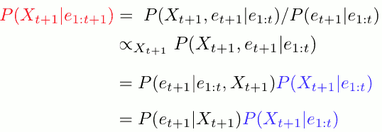
    - step1: conditional probability rule
    - step3: chain rule
    - step4: conditional independent
    - the evidence e<sub>t+1</sub> does not depend on any past evidence if we know X<sub>t+1</sub>. That's an assumption.
    - so the blue thing is your probability before you saw your evidence, your current belief 
        - the black thing is our measurement model 
        - you weighted by the evidence, and then this vector doesn't add to 1 anymore. So you re-normalized it now it adds up to 1 again , now the red thing is including the evidence you just saw. 
- Or:
    - 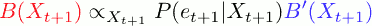
    - if the evidence is very compatible with the next state, then the probability mass will go up for that next state, otherwise it goes down.
    - you take your vector (blue) , you do point product with the evidence vector, and you normalize them.  Now you have your new beliefs.
- Basic idea: beliefs “reweighted” by likelihood of evidence
- **Unlike passage of time, we have to renormalize**

---

<h2 id="22a77e6cdda4b68b0d0175942f8c991b"></h2>


### Example of Observation 

- As we get observations, beliefs get reweighted, uncertainty “decreases”
- 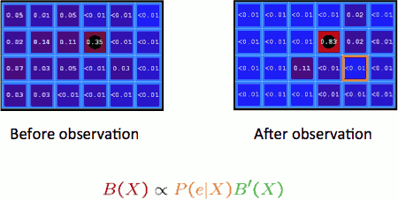

---

<h2 id="75fc03589b48053de414b7e5d43b25a6"></h2>


### Example: Weather HMM

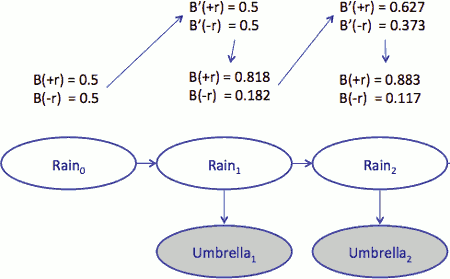

There's another way to write this, in one big update.


---

<h2 id="6dbc07cd7c694bd7ba7917098b848d8b"></h2>


## The Forward Algorithm

Rather than doing a time update and doing an evidence update, I'm going to just do one update.

- We are given evidence at each time and want to know
    - B<sub>t</sub> (X) = P(X<sub>t</sub>|e<sub>1:t</sub>)
- We can derive the following updates:
    - 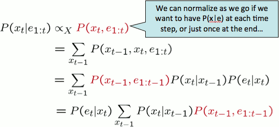
    - step1: get rid of */P(e<sub>1:t</sub>)*
    - step2: bring in x<sub>t-1</sub> and sum out. because we want a recursive update equation as a function of what we had at the previous time.
    - step3: decompose into transition model and measurement model.
        - P( x<sub>t-1</sub>, x<sub>t</sub>, e<sub>1:t</sub> )
        - = P( x<sub>t-1</sub>, e<sub>1:t-1</sub> )P( x<sub>t</sub>, e<sub>t</sub> | x<sub>t-1</sub>, e<sub>1:t-1</sub> ) = P( x<sub>t-1</sub>, e<sub>1:t-1</sub> )P( x<sub>t</sub>, e<sub>t</sub> | x<sub>t-1</sub> )
        - = P( x<sub>t-1</sub>, e<sub>1:t-1</sub> )P( e<sub>t</sub> | x<sub>t-1</sub>, x<sub>t</sub> )P( x<sub>t</sub> | x<sub>t-1</sub> )
        - = P( x<sub>t-1</sub>, e<sub>1:t-1</sub> )P( e<sub>t</sub> | x<sub>t</sub> )P( x<sub>t</sub> | x<sub>t-1</sub> )
    - step4: reorganize a little bit

- This is exactly variable elimination with order X₁,X₂,...

The forward algorithm is a dynamic program for computing at each time slice , the distribution over the state at that time given all the evidence to date. 

---

<h2 id="dec94cde56942725d8a224ed9c065de2"></h2>


## Online Belief Updates

Online belief update, which is most common, is where you would essentially just do these thing.

- Every time step, we start with current P(X | evidence)
- We update for time:
    - 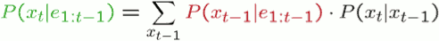
- We update for evidence:
    - 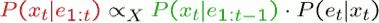
- The forward algorithm does both at once (and doesn’t normalize)

<h2 id="dc8ab069265738c8965ed6fe1ffb2ea5"></h2>


## Example : Ghost Buster 

- model
    - state X:  cell in tiled map , eg.(2,3)
    - transition model: P(X' | X )
        - Pr( ghost is at position p at time t + 1 | ghost is at position oldPos at time t )
        - probability of ghost move from state X to state X'
    - sensor reading: noisyDistance 
        - estimated Manhattan distance to the ghost
        - that is , how close ghost is
    - emission model: P( noisyDistance | TrueDistance )
- Observation : got a sensor reading
    - for each position *p* (it a state )  in all legal positions 
        - calculate pacman's  manhattan distance  to *p* state -- *trueDistance*
        - newBelief[p] = self.beliefs[p] * emissionModel[trueDistance] 
    - eventually , re-normalize , and update self.beliefs 
        - newBelief.normalize()  
        - self.beliefs = newBelief   
- Time Elapse: the ghost may move
    - note: you don’t know exactly where is the ghost , you need compute the distribution , for all possible positions
    - for each position *oldPos* (it a state )  in all legal positions 
        - you may get the distribution : newPostDist  -- P( newPos | oldPos )
        - then for every newPostion, you update the part of its new belief 
             - newBelief[ newPos ] += prob * self.beliefs[ oldPos  ]
             - Note !!!  here is not update 1 belief ! it update part of serveral beliefs !!!!  
    - self.beliefs = newBelief     


