...menustart

 - [Markov Decision Processes](#1ccc83e0a393554a640bc1e194680b67)
     - [Example : Grid World](#92a5227a1ada900fd758bfb60872e6a2)
     - [Grid World Actions](#7b549072ca47e93fb374c9eb1a430bca)
     - [Markov Decision Processes](#1ccc83e0a393554a640bc1e194680b67)
     - [What is Markov about MDPs ?](#1713fea7ca38d867ec082e94dcc902e8)
     - [Policies](#9e476387322a5c250893cf9c5c4ce78c)
     - [Optimal Policies](#d115341e528ef1f1b013adbf6f075f21)
     - [Example: Racing](#b2f5ac1e017207a93a053f4d77b1c9b3)
         - [Racing Search Tree](#91f1e32998454ca46d598646f7260d3c)
     - [MDP Search Trees](#b92430f9047d02bbe1a11b4118967089)
     - [Utilities of Sequences](#e25373331ca3b1a3b334be0d44204fd0)
     - [Discounting](#339bfa7ae181495413ac7e41d61c714c)
     - [Stationary Preferences](#945d15839357ecf3965c8cfb2f679995)
     - [Infinite Utilities ?!](#1148a36cad988c80eafafde4e7a9daf0)
     - [Recap: Defining MDPs](#37aad9792c79680719c1e086fd0c815a)
     - [Solving MDPs](#b2bfba9db087cb6ccda7abec663dd720)
         - [Optimal Quantities](#60dc1ec3b23db40849df64de46bcd91a)
     - [Values of States](#80597d513b9a36fc1e61e869000ff30f)
         - [Racing Search Tree](#91f1e32998454ca46d598646f7260d3c)
     - [Time-Limited Values](#50ca9febbd3c1377d708c024f60310fc)
     - [Computing Time-Limited Values](#24539dd5879397f8300a78d2bebba208)
     - [Value Iteration](#4b0084dc52868eb35410667a6679229a)
         - [Example: Value Iteration](#d5cac644e6c3bb194c235c0b55977d1d)
     - [Convergence](#8645457c64703c956325a6f44824acdb)
         - [Value Iteration Convergence](#9223390b107c103d49be9c7fbe9cc601)
     - [Recap: MDPs](#61640a53698e261681c172ef08db4f13)
     - [Policy Methods](#0d2fefe88e5d008dbb325c962c5b6f0e)
     - [Policy Evaluation](#abdad08f23e1ad71d82cbdd56cfcdd30)
         - [Fixed Policies](#30112022d9cb040ec9e1b2b577503981)
         - [Utilities for a Fixed Policy](#bfb9b9e2f445011c32315f61f81634c5)
         - [Example : Policy Evaluation](#1a1b5dffe87b8d0f61d62897935810f1)
         - [Policy Evaluation](#abdad08f23e1ad71d82cbdd56cfcdd30)
     - [Policy Extraction](#51f9aace37db4e0d0e8573fee03ea997)
         - [Computing Actions from Values](#34833eb820b21cf1bc001e77769ade32)
         - [Computing Actions from Q-Values](#6fcb06d49e1d3878ae11e06deb275042)
     - [Policy Iteration](#93eb2ac210d009dea486d01934ca6116)
         - [Problems with value iteration](#d9622bd26a30e7e2d9272dc2488415cd)
     - [policy iteration](#adafb823f7939e061bf30caad4dddbae)
     - [Comparison](#f6c0e3a1c3cfabd32ae8d3ae741fcf0a)
     - [Summary: MDP Algorithms](#ae6ed616074a489e9415c789beb2b2b2)
     - [Double Bandits](#c4f36742c324ffd3a65b06a71c7ae8cd)
     - [Offline Planning](#0dc48d869913049d654fb802ff0093d2)
         - [Lets play](#ffd944085fd77275ec8af19385faca8c)
         - [What Just Happened?](#7553726584ed6f80e379b6e8190ec1bc)
     - [Asynchronous Value Iteration \*](#8343234e23eeed284d9f9c00356c8219)

...menuend

<h2 id="1ccc83e0a393554a640bc1e194680b67"></h2>

# Markov Decision Processes

MDP : the way of formalizing the idea of non-deterministic search which is search when your actions outcomes are uncertain.

why would we be unsure what the outcomes of our actions is going to be ?  Well, maybe we've got a robot on a ledge and we take the action across the ledge, what's gonna happen ? Maybe we'll cross the ledge ,maybe we will fall into the fire pit. We're not sure we can commit to the action. But of course the outcome is entirely under our control. 

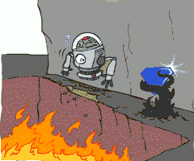

maybe you're a can opener robot and you take the can and you open it , and what's underneath ? More can! 

<h2 id="92a5227a1ada900fd758bfb60872e6a2"></h2>

## Example : Grid World 

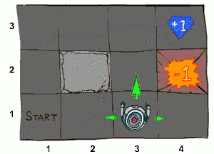

 - Noisy movement: actions do not always go as planned
    - 80% of the time, the action North takes the agent North ( if there is no wall there)
    - 10% of the time, North takes the agent West; 10% East
    - If there is a wall in the direction the agent would have been taken, the agent stays put
    - similar rules for the other 3 directions
 - The agent receives rewards each time step
    - Small “living” reward each step (can be negative)
        - this is sometimes called a living reward or a living penalty based on whether it's positive or negative.
    - Big rewards come at the end (good or bad)
        - terminal utilities, shown as the plus 1 and minus 1(also the exit to game end).
 - Goal: maximize sum of rewards 
    - in general the agent is going to involve getting to a big reward and taking it. 

<h2 id="7b549072ca47e93fb374c9eb1a430bca"></h2>

## Grid World Actions

you're not sure what the results gonna be. 

if you take north , you may move left, and it's bad.  So when you plan you're gonna have to take these outcomes into account. 

<h2 id="1ccc83e0a393554a640bc1e194680b67"></h2>

## Markov Decision Processes

 - An MDP is defined by:
    - A set of states s ∈ S
    - A set of actions a ∈ A
    - A transition function T(s, a, s’)
        - Probability that *a* from *s* leads to *s’*, i.e., P(s’| s, a)
        - Also called the model or the dynamics
    - A reward function R(s, a, s’) 
        - Sometimes just R(s) or R(s’)
    - A start state
    - Maybe a terminal state

 - MDPs are non-deterministic search problems
    - One way to solve them is with expectimax search
    - We’ll have a new tool soon

MDP is a lot like a search problem. 

**UNLIKE** : 

 - successor function  (unlike) 
    - unlike in search , we're going to take the successor function and break it into a few pieces. 
    - We're going to have an idea of actions which are the actions you take like north ,south, east, west. We're then gonna have a transition function . 
    - T(s,a,s')  :  in some state *s* , you take some action *a* , *s'* is a ***possible*** result. The function T(s,a,s')  tells you how likely that result is and in that sense it's a conditional probability. 
    - The transition function is basically the successor function. The differences is now there are lots of differents s's that can happen and they all have various probabilities t associated with them. 

 - Reward function (unlike)  
    - R(s,a,s')  means you get a reward that depends on the state you are in , the action you took, and the outcome. 
    - You might not know your actual reward until you see whether or not you fell into the pit.  
    - In some formulations R will only depend on s and s'. What is this ?  This is basically the cost function from search. In seach the cost would be small and in the case of MDPs in general we want the rewards to be big. 

 - Terminal state (unlike)     
    - another import difference between MDPs and search problems is  MDP's very ofren go on forever .

MDP is basically taking search that we know and love , and adding the necessary machinery to support the idea that actions can have multiple outcomes. 

<h2 id="1713fea7ca38d867ec082e94dcc902e8"></h2>

## What is Markov about MDPs ?

 - “Markov” generally means that given the present state, the future and the past are independent
 - For Markov decision processes, “Markov” means action outcomes depend only on the current state
    - P(St+1 = s' | St=st,At=at,St-1=st-1,At-1=at-1,..., S₀=s₀) = P(St+1 = s' | St=st,At=at)
 - This is just like search,the probability distribution over your outcomes depends only on the current state and action , not on the whole histroy of how you got there. 

 
So this is important property in MDP is to make sure that you define your transition function and your state in such a way that the transition probabilities depend only on the current state and action. 

<h2 id="9e476387322a5c250893cf9c5c4ce78c"></h2>

## Policies

 - In deterministic single-agent search problems, we wanted an optimal plan, or sequence of actions, from start to a goal
    - but it does not work for MDPs. because we don't know what actions are gonna to do.  
    - The relevant idea is not a plan now but a policy. Policy is a mapping from states to actions and tells  in each state what action to take. 
 - For MDPs, we want an optimal policy π\* : S → A
    - A policy π gives an action for each state, like a recommendation action
    - An optimal policy is one that maximizes expected utility if followed
    - An explicit policy defines a reflex agent
 - Expectimax didn’t compute entire policies
    - It computed the action for a single state only
     
Expectimax didn't really compute an explicit policy in this sense. What expectimax did for these kinds of problems is from a given state it did a forward-thinking computation that produced one entry of the policy which you then took and wherever you land and you run expectimax again. 

So on one hand expectimax is a way of solving these problems and on the other hand it doesn't compute an explicit policy. That chould be a good thing or bad thing. It can be bad because you might redo a lot of work if you keep in the same state. It could be good because there are so many states you coundn't write down an explicit policy anyway. 

<h2 id="d115341e528ef1f1b013adbf6f075f21"></h2>

## Optimal Policies

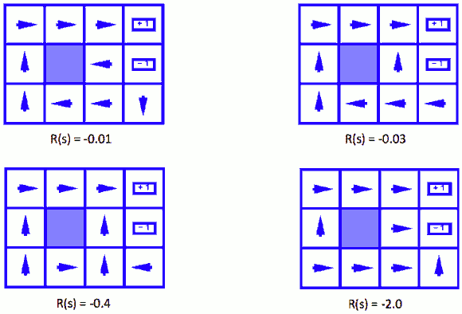

See the pic where R(s) = -0.01: 

The funny thing is the square left to "-1" squre. It's going into the wall. Why is it going into the wall?  This is an example of we feed the rules of the game in , we compute the optimal behavior , sometimes the behavior is not what we expected but it's still optimal. In this example, if you did anything else you would risk the pit. The agaent is pressing its check against the wall and justing waiting waiting waiting until it gets out of this scary situation safely. So this agent is very very conservative because each time step cost very little. 

What happens if we make this living penalty more severe ? check those rest 3 cases!
 

<h2 id="b2f5ac1e017207a93a053f4d77b1c9b3"></h2>

## Example: Racing

 - A robot car wants to travel far, quickly
 - Three states: Cool, Warm, Overheated
 - Two actions: Slow, Fast
 - Going faster gets double reward

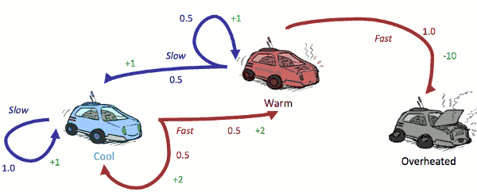

<h2 id="91f1e32998454ca46d598646f7260d3c"></h2>

### Racing Search Tree

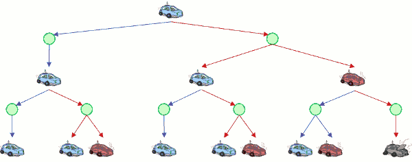

Any MDP is defining a search tree. So if you're in some particular state , for example if you're in the state where the car is cool, you have 2 actions: slow or fast. 

It's very like an expectimax tree but we'll see very shortly why we might not want to use expectimax to solve it. You can already see hints of it : it's a big tree but it's kinds of same blue and red stuff over and over again. There's just not that many states. This is the case where expectimax will do a lot of work. 

<h2 id="b92430f9047d02bbe1a11b4118967089"></h2>

## MDP Search Trees

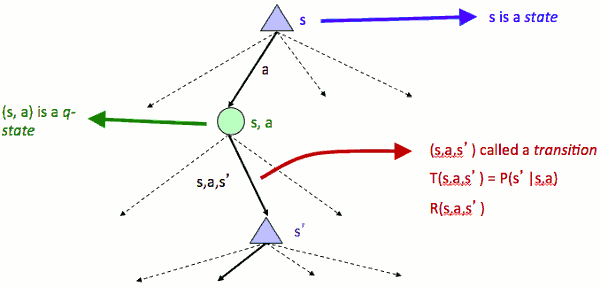

 - Each MDP state projects an expectimax-like search tree
    - That is kind of expectimax tree except ...
        1. the probabilities are given to you by the transition function and 
        2. the rewards instead of *being at the bottom* are smeared throughout the tree, they **come to you step-by-step**.
 - Queue State: 
    - when I'm in a state and I take an action I end up in a queue state (green circle) , which you can think of as kind of the pair of the state and the action where I've committed to the action but I haven't done it yet. 
 
 

<h2 id="e25373331ca3b1a3b334be0d44204fd0"></h2>

## Utilities of Sequences

In a MDP the rewards come to you step-by-step , we need to figure out what our utility function acutally is. In the simplest case you just add up the rewards but it can be little more subtle than that.

For example shown here 

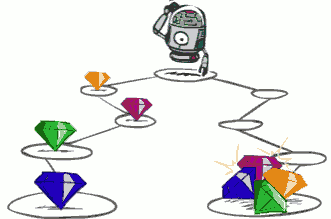

you might care whether or not you get these 4 gems step-by-step or all at the end in one big prize. This raises a general question for MDPs: what preferences or utilities should an agent have for rewards sequences. 

 - What preferences should an agent have over reward sequences?
 - More or less?  [1,2,2]  or  [2,3,4]
 - Now or later?  [0,0,1]  or  [1,0,0]

<h2 id="339bfa7ae181495413ac7e41d61c714c"></h2>

## Discounting 

 - It’s reasonable to maximize the sum of rewards
 - It’s also reasonable to prefer rewards now to rewards later
 - One solution: values of rewards decay exponentially
    - worth now: 1
    - worth next step : γ
    - worth in two steps : γ²

---

 - How to discount?
    - Each time we descend a level, we multiply in the discount once
 - Why discount?
    - Sooner rewards probably do have higher utility than later rewards
    - Also helps our algorithms converge
 - Example: discount of 0.5
    - U([1,2,3]) = 1\*1 + 0.5\*2 + 0.25\*3
    - `U([1,2,3]) < U([3,2,1])`

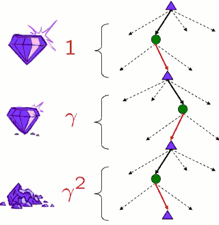

不合理的 discount 可能会阻止你找到optimal solution. 过小的 discount 会更倾向于 short-term rewards. Iff the MDP's transition model is deterministic and the MDP has zero rewards everywhere, except for a single transition at the goal with a positive reward,  optimal policy will still be found regardless discount value .

<h2 id="945d15839357ecf3965c8cfb2f679995"></h2>

## Stationary Preferences

What we want from an agent that looks at sequences of rewards in order to consider it kind of reasonable. 

stick the same reward in front of both 

if I liked A better than B now I should like it better shifted into the future as well and vice versa. 

 - Theorem: if we assume **stationary preferences**:
    - [a₁,a₂,...] ≻  [b₁,b₂,...]  `<=>` [r, a₁,a₂,...] ≻  [r, b₁,b₂,...] 
 - Then: there are only two ways to define utilities
    - Additive utility:    U( [r₀,r₁,r₂,...] ) = r₀ + r₁ + r₂ + ...
    - Discounted utility:  U( [r₀,r₁,r₂,...] ) = r₀ + γ·r₁ + γ²·r₂ + ... 
     

<h2 id="1148a36cad988c80eafafde4e7a9daf0"></h2>

## Infinite Utilities ?!

 - Problem: What if the game lasts forever?  Do we get infinite rewards?
 - Solutions:
    - Finite horizon: (similar to depth-limited search)
        - Terminate episodes after a fixed T steps (e.g. life)
        - Gives nonstationary policies ( π depends on time left)
    - Discounting: use 0 < γ < 1
        - U( [r₀,r₁,r₂,...] ) = r₀ + γ·r₁ + γ²·r₂ + ... <= Rmax/(1-γ)
        - Smaller γ means smaller “horizon” – shorter term focus
    - Absorbing state: guarantee that for every policy, a terminal state will eventually be reached (like “overheated” for racing)
 
Here are multiple possible solutions, in general we're gonna have discounts that usually saves us. 

<h2 id="37aad9792c79680719c1e086fd0c815a"></h2>

## Recap: Defining MDPs

 - Markov decision processes:
    - Set of states S
    - Start state s₀
    - Set of actions A
    - Transitions P(s’|s,a) (or T(s,a,s’))
    - Rewards R(s,a,s’) (and discount γ )
 - MDP quantities so far:
    - Policy = Choice of action for each state
    - Utility = sum of (discounted) rewards

<h2 id="b2bfba9db087cb6ccda7abec663dd720"></h2>

## Solving MDPs

<h2 id="60dc1ec3b23db40849df64de46bcd91a"></h2>

### Optimal Quantities 

![][1]    

 - The value (utility) of a state s:
    - V\*(s) = expected utility starting in s and acting optimally
    - what the star means is  this is the value under optimal action.
 - ***The value (utility) of a q-state (s,a):***
    - Q\*(s,a) = expected utility starting out having taken action a from state s and (thereafter) acting optimally
    - Each action do have a Q-value
 - The optimal policy:
    - π\*(s) = optimal action from state s

---

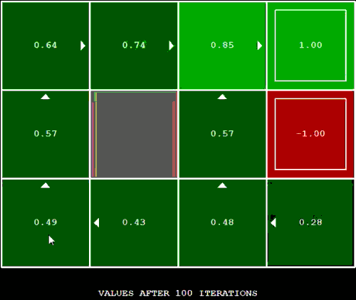

Look at the left-bottom square with 0.49. The arrow is the policy.  What's that 0.49?  That is if you started in this square  and you ran this game over and over again and sometimes you slipped, and sometimes you didn't , and you added up all of those utilities on average you would get 0.49, and you will achieve it by trying to go north whenever you're in the square. 

You can see it's better to be at 0.85 square by the exit than it is to be over here 0.49 square. Why ? Because if you're over here you have to pay that living reward and some discount to even get to the exit. The best thing is to actually be in the exit. 

Similarly you can see if you're essentially 2 steps from the exit, it's better to be at 0.74 square than at 0.57 next to the pit , because when something goes wrong , .74  is not a big deal, while .57 you fall into the pit and lose.

---

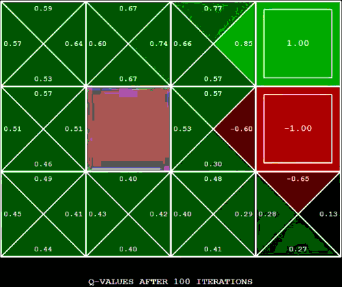

This shows the Q values. From each state , except for the exit state , you got 4 choices of actions . If you are in the 0.57 state next to the pit, and the action you've committed to is north , then you get that same .57. 

---

<h2 id="80597d513b9a36fc1e61e869000ff30f"></h2>

## Values of States 

So we want to be able to compute these values. We'd like to be able to take an MDP and compute these expectimax values for a state and actully we usually do with these algorithms we compute the values for all of the states. We'll see that there are ways to save time by doing all the states at once provided your MDP is small enough that you can actually go through all the states. 

 - Fundamental operation: compute the (expectimax) value of a state
    - Expected utility under optimal action
    - Average sum of (discounted) rewards
    - This is just what expectimax computed!
 - Recursive definition of value:
    - 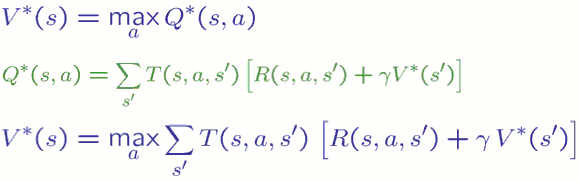
    - Q 可以分解为两部分
        1. reward的期望值 R(s,a), 加上
        2. γ·V(s') 的期望值

<h2 id="91f1e32998454ca46d598646f7260d3c"></h2>

### Racing Search Tree

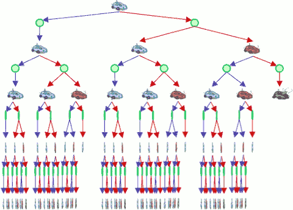

 - We’re doing way too much work with expectimax!
 - Problem: States are repeated 
    - Idea: Only compute needed quantities once
 - Problem: Tree goes on forever
    - Idea: Do a depth-limited computation, but with increasing depths until change is small
    - Note: deep parts of the tree eventually don’t matter if γ < 1
    

<h2 id="50ca9febbd3c1377d708c024f60310fc"></h2>

## Time-Limited Values

 - Key idea: time-limited values
 - Define Vk(s) to be the optimal value of *s* if the game ends in *k* more time steps
    - Equivalently, it’s what a depth-k expectimax would give from s
    - 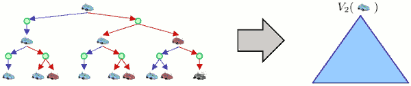

What's a time step ? It's a reward. 

Example: 

 - PS: when you achieve the exit, you must take extra "exit" action to end game and get the reward.

---

 - iteraction 0:
    - 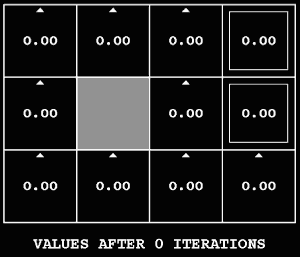
    - zeroes everywhere , because exit action need 1 step
 - iteraction 1:
    - 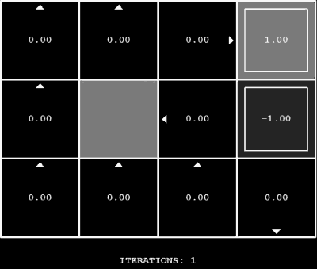
 - iteration 2:  
    - 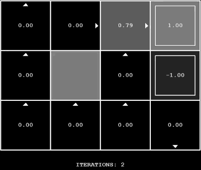
    - from the squre between wall and pit, I have time to do very stupid things -- going to the pit and receive a negative -- but that's not the optimal.  The optimal thing is kind of anything else. So I have zero. But if it allowed 3 steps I can get some rewards even from there. 
 - iteration 3:
    - 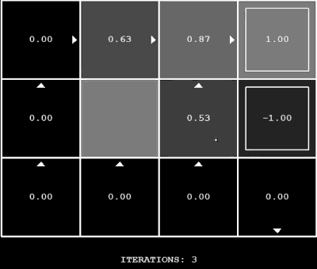
 - iteraction 5:
    - 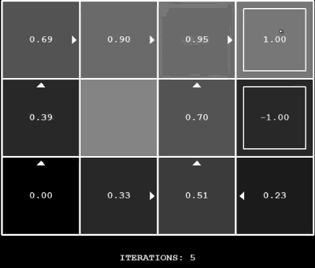

 - iteration 6: 
    - 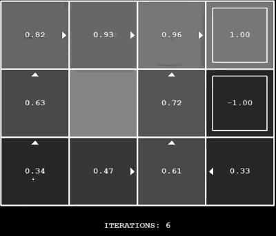
    - from left-bottom square , I am now possible to  get to a positive reward.
 - iteration 7: 
    - 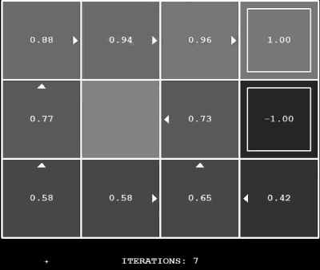
    - from left-bottom square , I can not only get there in the lucky way where nothing goes wrong I can also get there in various ways where something goes wrong once. 
 - iteration 100: 
    - 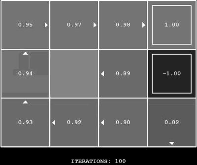
    - most of the states are pretty good. 
    - In right-top square (1.0) , where the only action available is to exit. Upon which you immediately receive a reward of +1, you value is +1. 
    - In left-bottom square (0.49) , you're not usually gonna get 0.49. Sometimes you get more, sometimes you get less. This is the long-term average you're going to get. That average bakes in a lot of things. It bakes in the fact that you're going to get a small penelty each step until you get to the exit and if your actions mess up you might get that penalty more. It bakes in the fact that the +1 is far away and by the time you get there  it will be discounted. It bakes in all of the probabilities in the transition function. If you act optimally you'll get .49 as your ***average*** score. 

**Very important points**  about there values and rewards: 

 - rewards are for one time step  
 - value are from that point forward to the end of the game or forever if the game doesn't end.
 - reward are instantaneous , values are cumulative.

<h2 id="24539dd5879397f8300a78d2bebba208"></h2>

## Computing Time-Limited Values

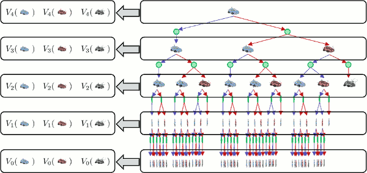

assuming it's a whole tree.

in the bottom , there's a lot of repeat status. It's terminal state, nothing else happens.  So no more rewards. That means I got lots of copies of V₀ -- lots of depth-0 expectimax , and in fact we know it be 0, 0 for any state.

Now what's in this layer upon the bottom ?  Each one of these computations is a depth-1 expectimax computation. Which means in fact all we have is a whole bunch of copies of V₁ in this layer. 

Then at the very top where only computing one value but conceptually this top layer is well represented by the collection of V₄ .

So you see at the bottom even though the tree has grown immensely it's still only 3 values, and each layer is Vk for K . So this actually gives us an idea of how we can compute these values in an efficient way where we don't get the explosion in depth because you can see at the bottom it's no worse than at the top. That's now going called value iteration.

<h2 id="4b0084dc52868eb35410667a6679229a"></h2>

## Value Iteration

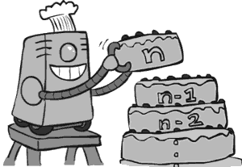

---

 - Start with V₀(s) = 0: no time steps left means an expected reward sum of zero
 - Given vector of Vk(s) values, do one ply of expectimax from each state:
    - ![][2]
 - Repeat until convergence
 - Complexity of each iteration: O(S²A)
    - the number of states is the key of computation
 - Theorem: will converge to unique optimal values
    - Basic idea: approximations get refined towards optimal values
    - Policy may converge long before values do

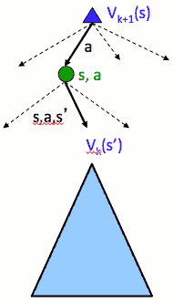

---

You can think of this as basically building your computation from bottom up all the way up to the top where you will receive the computation that expectimax would have done but with a whole lot less work assuming we have a small number of states.

V₀(s)   what's this actually look like in code ?  It's a vector. There is 0 for every state in this vector. This is different than expectimax which you think about is computing for one state -- this is all states , the vector of zeroes. 

To compute Vk+1 , we will recurse into a expectimax tree Vk that we've already computed, We already have that entire vector for every state. 

( 每个 iteraton 计算所有state 的 Vk , 这样下次迭代  Vk+1 就不需要再计算任何 Vk 了 )

So what does this actually do ? It goes from 0 to 1 , to 2 , and we keep going until we decide to stop. When are we gonna stop ? What is that magic value K ? Because we're going bottom-up we can keep doing this until it converges. 

Complexity of each iteration: O(S²A).  It's good in that it doesn't grow with the number of iterations like expectimax grows with the depth. It's bad in that expectimax doesn't have to touch every state if it doesn't go to deep, this always touches every state.  So it's all about the trade-off of how many states you have and how connected they are and how deep you need to into the tree. 

Actually , Value iteration will converge to the same vector of values (V\*) no matter what values we use to initialize V.

<h2 id="d5cac644e6c3bb194c235c0b55977d1d"></h2>

### Example: Value Iteration 

Assume no discount!

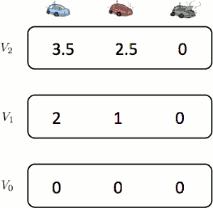

So what we see ?  

 1. As I go further up the numbers are increasing and that make sense becaues as I have more time steps in this MDP I can get more rewards
 2. I also see that every layer it's better to be in the cool state than to be in the warm state.
    - of course it's better because you can then safely go fast. 

Now you can look at this, you can probably figure out the optimal policy. 

The optimal policy is if you're cool go fast and once you warm up you go slow and you never risk overheating. Now that optimal policy is actually already found at V₁ . These number 2,1,0 already reflect it. But it takes longer for the values to actually figure out how good that is . In general , V₁ is not enough to find the vest policy and in particular in this MDP because there's no discount the Vs aren't going to converge. 
 
<h2 id="8645457c64703c956325a6f44824acdb"></h2>

## Convergence 

How do we know ?

 - How do we know the Vk vectors are going to converge?
    - First of all we don't. Because if there's no discount and the rewards are all positive and the game never going to end like for racing the values are infinite and you're never going to get there.  

But there are cases where we can show that it will converge. 

 - Case 1: If the tree has maximum depth M, then VVM holds the actual untruncated values
 - Case 2: If the discount is less than 1
    - as k increases, the values converge
    - Proof: pass

---

<h2 id="9223390b107c103d49be9c7fbe9cc601"></h2>

### Value Iteration Convergence

 - 1 action: go
 - transitioning to each of the next states is equally likely
    - once you are in state with no outgoing arrows , you stay in them for all future times. 
 - reward: 1 for each transition 
    - staying in state with no outgoing arrows   gets a reward of zero
 - discount factor = 0.5
 - initialize the value of each state to 0.

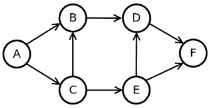

 - After how many iterations of value iteration will the value for state F have become exactly equal to the true optimum? (Enter inf if the values will never become equal to the true optimal but only converge to the true optimal.)
    - 0
 - After how many iterations of value iteration will the value for state A have become exactly equal to the true optimum? (Enter inf if the values will never become equal to the true optimal but only converge to the true optimal.)
    - 4
 - How many iterations of value iteration will it take for the values of all states to converge to the true optimal values? (Enter inf if the values will never become equal to the true optimal but only converge to the true optimal.)
    - 4

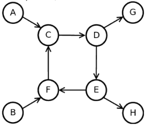

 - After how many iterations of value iteration will the value for state B have become exactly equal to the true optimum? (Enter inf if the values will never become equal to the true optimal but only converge to the true optimal.)
    - inf
 - After how many iterations of value iteration will the value function have become exactly equal to the true optimal values? (Enter inf if the values will never become equal to the true optimal but only converge to the true optimal)
    - inf

---

<h2 id="61640a53698e261681c172ef08db4f13"></h2>

## Recap: MDPs

Values:  the value of a state is what you expect your future utility to be under optimal action. So remember that when we talk about the value of state it's not the next reward you're gonna receive. It's not a certain number --  I know I'm going to get 10 points -- because you don't know what your actions will do. This is an average outcome under optimal action. 

What you often think about is for any given state *s* what is this notion of value. It's not what I'm definitely going to achieve, It can't be that because I don't control my actions perfectly. 

For MDP, sometimes we were interested in the values, but usually were interested in policies.

---

Value iteration is just a fixed point method of solving this system of equations. This system of equations is hard to solve because it's got averages and also max's. So it's not a linear thing. And we have to solve it somehow. Value iteration is one way to do it. Expected max is really another way to do it. And they have trade offs to which one is actually more efficient. 

Now in value iteration the vectors Vk themselves were  interpretable as time-limited values.

<h2 id="0d2fefe88e5d008dbb325c962c5b6f0e"></h2>

## Policy Methods

finding optimal policies that work over the policies themselves and make the policies better rather than simply working over the values trying to make the values better. 

<h2 id="abdad08f23e1ad71d82cbdd56cfcdd30"></h2>

## Policy Evaluation

You got a policy in your hand, maybe it's good meybe it's bad . What you want to know is for this policy ,which is presumably suboptimal , how good is it ? How will I perform if I follow it. For each state what will the value be not under optimal action but under this specific policy. 

<h2 id="30112022d9cb040ec9e1b2b577503981"></h2>

### Fixed Policies

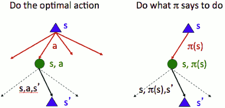

If I have a policy π which tells me what action to take , I no longer have all of these choices a , the tree looks like the right picture.

Right now I'm only doing what π tells me -- not the optimal thing. That means the *max* node  just got a whole lot simpler rather than having a whole set of actions that they have to consider. There's only one action permitted that whatever π says to do and so the tree doesn't branch at the *max* node. Of course it's still branches of the chance node because we don't know what's gonna happen when we execute the action.  But from state *s* there's only one action allowed, it's π(s).  That makes the tree simpler and it means the computing are going to be simpler and faster. 

Of course the value at the root is presumably going to be worse unless the π(s) is in fact the optimal policy. 

 - Expectimax trees max over all actions to compute the optimal values
 - If we fixed some policy π(s), then the tree would be simpler – only one action per state
    - … though the tree’s value would depend on which policy we fixed

<h2 id="bfb9b9e2f445011c32315f61f81634c5"></h2>

### Utilities for a Fixed Policy 

 - Another basic operation: compute the utility of a state s under a fixed (generally non-optimal) policy
    - To compute the utility for a fixed policy  is easy.

So we imagine we've got some policy π , it presumably bad but we're stuck with it. We're trying to do is compute for every state *s* what score I will get on average if I follow π.  

 - Define the utility of a state s, under a fixed policy π:
    - Vπ(s) : = expected total discounted rewards ***starting in s and following π***
    - the π indicates that we're following π , it used to be a star which meant we were acting optimally.
 
 - Recursive relation (one-step look-ahead / Bellman equation):
    - it's the same kind of bellman equation but the "maximum" is gone, and the action *a* replace by π(s)

π : the function π is a policy. it takes a state and returns an action. It has no information about past or future . So far it is a function from states to actions. What is actually living inside the implementation of π ? It could be a lookup table, or it could be a snippet of code which executes expectimax. Now π is implemented by on-demand expectimax computations which is not what value iteration does. 

<h2 id="1a1b5dffe87b8d0f61d62897935810f1"></h2>

### Example : Policy Evaluation

2 policies:

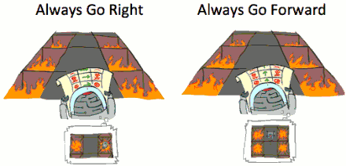

In fact go-forward policy is probably the optimal policy but when you have this policy in front you don't actually know that right now. All you know is you've got some policy and you're supposed to evaluate it. 

So you look in your head and you think what will happen if i use this policy? And presumably the outcomes will be better and therefore the values will be higher. So here are 2 policies and I can compare them. For example if one had higher values I can choose it if this were a choice I had to make. 

So what are the actual values under these policies ? 

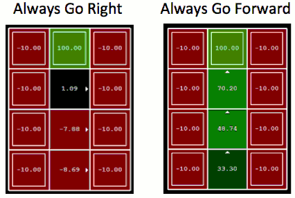

These are all the states on a grid world where basically the kind of center corridor is a bridge where you can move safely , there's a reward at the end of the top. If you fall to the left or the right then you receive a negative 10 when you fall into the fire pit. 

You can see the policy "always go right" , it's not so bad if you're on the exit where you have no choice but to exit.  But anywhere else is pretty bad. It's not a very good policy. But it has values. 

It's super-important : states have optimal values and they also have values -- just higher or low for any specific policy. 

Why do we evaluate policies ?

Sometimes we actually have a policy we just want to know how good it is but we're going to see important algorithms that let us come up with better policies by starting with one , evaluating it , and looking for ways to improve it.  

<h2 id="abdad08f23e1ad71d82cbdd56cfcdd30"></h2>

### Policy Evaluation

 - How do we calculate the V’s for a fixed policy π
 - Idea 1: Turn recursive Bellman equations into updates (like value iteration)
    - Efficiency: O(S²) per iteration
 - Idea 2: Without the maxes, the Bellman equations are just a linear system
    - Solve with Matlab (or your favorite linear system solver)

 

<h2 id="51f9aace37db4e0d0e8573fee03ea997"></h2>

## Policy Extraction

Policy evaluation was about taking a policy and figuring out for each state how good it was. 

Now we're going to look at the opposite direction : what happens if I give you the values and I asked you the question what policy should I use if these values are correct. 

<h2 id="34833eb820b21cf1bc001e77769ade32"></h2>

### Computing Actions from Values 

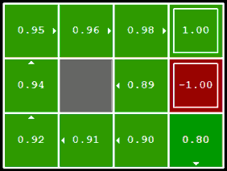

see that pic , there are the optimal values. Then we can ask questions like how should I act ? 

for example , let's look at the 0.89 square. What should I do ? Should I take the action north ? Should I choose the action west ? 

The values let you figure out that the square to the north of you is better than you but they don't tell you how to get there. 

So it's actually not obvious at all.  How would you figure out from optimal values how to act ? 

The answer is basically you've got to do expectimax.  I need basically unroll and expertimax one layer and do a one-step lookahead. 

So what I'll do is to consider every action *a* from state *s* and figure out which is the good one. So I need to consider every action *a* , and then for each action I need to consider all of the results s' that action could have. Now for each action *a*, we know the score is gonna be an average over the s's.  

 - Let’s imagine we have the optimal values V\*(s)
 - How should we act?
    - It’s not obvious!
 - We need to do a mini-expectimax (one step)
    - 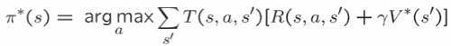
    - *argmax* means consider all the values , rather than taking the maximum , give me the action  *a* which achieved the maximum. 
    - Luckily the discounted future I've assumed I actually have already (V\*(s)). So this is all the expectimax I need to do. 
        - 对每个action， 计算 K+1 的q-value
 - This is called **policy extraction** , since it gets the policy implied by the values
    - Action selection from values is kind of a pain. This process by which I take values which maybe optimal or may not and I computer a one-step lookahead policy according to them is called **policy extraction**. Because what is does is it digs out the policy that those values imply. It requires a one-step expectimax from every state to reconstruct. 

<h2 id="6fcb06d49e1d3878ae11e06deb275042"></h2>

### Computing Actions from Q-Values

What about Q-Values ?  Q-Values is kind of weird.  

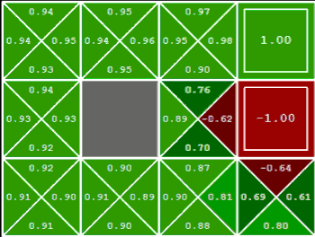

 - Let’s imagine we have the optimal q-values:
 - How should we act ?
    - The Q-values make it super easy to decide actions. 
    - Completely trivial to decide !
    - π\*(s) = argmaxₐ Q\*(s,a)
 - Important lesson: actions are easier to select from q-values than values!

<h2 id="93eb2ac210d009dea486d01934ca6116"></h2>

## Policy Iteration 

***Policy Iteration*** combines the idea of evaluating one policy , with the idea of improving that policy on the basis of those values. 

You can think of policy iteration as you've got a policy in front of you and you're constantly trying to make it better.

<h2 id="d9622bd26a30e7e2d9272dc2488415cd"></h2>

### Problems with value iteration

Just think about why value iteration is not always the the best solution.

What value iteration does is essentially mimics 模仿 the bellman updates. You have iteractions where K gets larger and larger starting at 0. For each iteration you visit each state and for each state you look at each action and for each action you look at each outcome. 

 - Problem 1: It’s slow – O(S²A) per iteration
    - The reason it's slow is each iteration not only looks at every kind of source and target state , so is s² , but also it has to consider each action each time and there're often may actions. 

 - Problem 2: The “max” at each state rarely changes
    - Although you've considered all of these actions the maximum often doesn't change. 
 
 - Problem 3: The policy often converges long before the values

Example (TODO):

1. arrows eventually stop changing after 8-9 iteractions.
2. the number of lower-left changes , but it takes a while before the changes become large enough that they impact one of the arrows.

The maximum -- the best action you got -- usually doesn't change. So you wasted all that time if you have a hundred actions checking the other 99 that weren't very good. Last round they're still not good but you still check them all. 

Policy tends to finish long before the values converge. 

So what can we do?  The idea herer is an algorithm called **policy iteration**. 

<h2 id="adafb823f7939e061bf30caad4dddbae"></h2>

## policy iteration

Policy iteration is an alternative approach and the basic sketch is we're going to have 2 steps that we alternate. 

 - Alternative approach for optimal values:
    - **Step 1: Policy evaluation**: calculate utilities for some fixed policy (not optimal utilities!) until convergence
        - It's generally not going to be an optimal policy , but we're going to figure out it's values using policy evaluation. 
    - **Step 2: Policy improvement**: update policy using one-step look-ahead with resulting converged (but not optimal!) utilities as future values
        - Then we take those values and we extract a better policy from them. That called policy improvement. 
    - **3: Repeat steps until policy converges** 

 - This is policy iteration
    - It’s still optimal!
    - Can converge (much) faster under some conditions

--- 

 - Evaluation: For fixed current policy π,  find values with policy evaluation:
    - Iterate until values converge:
    - 
 - Improvement: For fixed values, get a better policy using policy extraction
    - One-step look-ahead:
    - 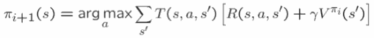

Step 1 is evaluation. So I fix some policy π and I'm going to compute Vπ. So I do this simplified update where I don't maximum over the actions. I assume that my policy π is fixed, and I only do the averaging of the chance nodes. So this thing is fast because I don't consider all the actions. 

Once the thing converges or gets close enough I then stopped and I say let's give the actions a chance to change because we've done enough of this evaluation that maybe by now some of the actions need to change.  So again we're going to do a one-step look ahead and just unroll that expected max one layer and say the new policy is the action that I would get if I did a one-step expectimax , and then plugged in the values -- not optimal values but the values computed -- against my old policy. 

That's a little weird. We do one stop of actual expectimax and our truncation function is our old policy. Now why should that be better ? Maybe the old policy was good or maybe the old policy was bad. But whatever it was good or bad we just pushed it one step into the future and that step where we did that one-layer expectimax -- that layer in so far as a layer can be optimal -- did the optimal computation.  We've got one layer of real optimal expectimax and then the truncation function is the old values.

Every time we do this we push the old stuff farther and father into the future and thereby make progress. 

If you think about this it actually turns out the improvement step is just like value iteraction we loop over all the actions and for each action we loop over all of the results of s'. 

So the improvement step isn't going to be particularly fast. It's essentially the evaluation step where we get a big speed up over value iteration. Because the evaluation step happends many times before we allow an improvement step we got a big speed up. 

Another way of looking at this algorithm is thinking that we're doing value iteration but on most rounds we just go with the last action that optimized for this state rather than considering them all. 

<h2 id="f6c0e3a1c3cfabd32ae8d3ae741fcf0a"></h2>

## Comparison 

 - Both value iteration and policy iteration compute the same thing (all optimal values)
 - In value iteration:
    - Every iteration updates both the values and (implicitly) the policy
    - We don’t track the policy, but taking the max over actions implicitly recomputes it
 - In policy iteration:
    - We do several passes that update utilities with fixed policy (each pass is fast because we consider only one action, not all of them)
    - After the policy is evaluated, a new policy is chosen (slow like a value iteration pass)
    - The new policy will be better (or we’re done)
 - Both are dynamic programs for solving MDPs
 - Why would you ever do value iteration ? 
    - It's simpler and in cases where there are a small number of actions you might do it. 

<h2 id="ae6ed616074a489e9415c789beb2b2b2"></h2>

## Summary: MDP Algorithms

 - So you want to….
    - Compute optimal values: use value iteration or policy iteration
    - Compute values for a particular policy: use policy evaluation
    - Turn your values into a policy: use policy extraction (one-step lookahead)
 - These all look the same!
    - They basically are – they are all variations of Bellman updates
    - They all use one-step lookahead expectimax fragments
    - They differ only in whether we plug in a fixed policy or max over actions

<h2 id="c4f36742c324ffd3a65b06a71c7ae8cd"></h2>

## Double Bandits

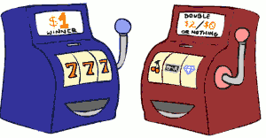

Blue: a good machine, when you pull the handle you get 1$.
Red: you pull the handle and you're either gonna get 2$(P=75%) or 0$(P=25%).
You can think this is a MDP.  It's actually a super boring won the state structure isn't very interesting. The interesting thing is the actions.  

 - Actions: Blue, Red
 - States: Win, Lose
 - No discount
    -100 time steps
    - Both states have the same value

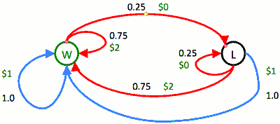

There's 2 states in this. But there really shouldn't be. In essence you're always in the same state which is what should I do.  The reason why we have 2 states in this formalization is because in order to actually make this idea workout that you might get 0$ or 2$. It's a little tricky because the rewards so far haven't been non-deterministic. 

So in order to have different rewards for winning and losing I need different states for winning. 

So here's one way to formalize this MDP: the actions are blue and red, the states are I just won or I just lost the last pull. 

Let's first look at the blue action. Blue slot machine always wins with probability 1 you get a dollar and transition to the WON state. 

The red-bandit wins 75% and give you 2$ and losses 25% and give 0$.  So this transition structure relfects that.  It's a little redundant because the reaction does the same thing whether you just one or just lost. That's the kind of independence that you can't see from the diagram here. 

Which state to start ?

It doesn't matter which state you're at because the actions do the same thing from the states. 

<h2 id="0dc48d869913049d654fb802ff0093d2"></h2>

## Offline Planning

 - Solving MDPs is offline planning
    - You determine all quantities through computation
    - You need to know the details of the MDP
    - You do not actually play the game!

We're gonna solve this MDP in head. 

what's the value for playing blue?  You always get 1$ and if you only play blue -- that's a policy -- and play 100 times you get 100$.  So assuming dollars here are the utilities for this agent,  the value of the play blue policy is 100. The value of the play red policy is a 150. 

Yet I know the values I know the optimal policy : always play red.  

<h2 id="ffd944085fd77275ec8af19385faca8c"></h2>

### Lets play

We played 10 times. $2, $2, $0, $2, $2, $2, $2, $0, $0, $0.

So we just played our policy how did we do ? 

Looks like we got 12$. What the values suggest we would get ? One average we should have gotten 15 so we're a little bit unlucky but not ridiculously unlucky. Here it's very important we solved it offline in our heads we actually played in the real world using the policy that we determined to be optimal in our heads. 

Let's change the rules. We don't know the probabilities of red machine.  What's the optimal policy ? What should I do ? 

I don't know.  We don't know the MDP and if you don't know the MDP you can't figure out the values in your head , and you can't figure out whether playing red or playing blue is the better policy. 

This is a different setting where there is an MDP that you know red has a payoff but you don't know what it is.  So in essence there's an MDP but you don't know its parameters. how are you going to figure out what to do ? 

<h2 id="7553726584ed6f80e379b6e8190ec1bc"></h2>

### What Just Happened?

 - That wasn’t planning, it was learning!
    - Specifically, reinforcement learning
    - There was an MDP, but you couldn’t solve it with just computation
    - You needed to actually act to figure it out
 - Important ideas in reinforcement learning that came up
    - Exploration: you have to try unknown actions to get information
    - Exploitation: eventually, you have to use what you know
    - Regret: even if you learn intelligently, you make mistakes
    - Sampling: because of chance, you have to try things repeatedly
    - Difficulty: learning can be much harder than solving a known MDP

<h2 id="8343234e23eeed284d9f9c00356c8219"></h2>

## Asynchronous Value Iteration \*

 - In value iteration, we update every state in each iteration
 - Actually, *any* sequences of Bellman updates will converge if every state is visited infinitely often
 - In fact, we can update the policy as seldom or often as we like, and we will still converge
 - Idea: Update states whose value we expect to change:
    - if | Vᵢ₊₁(s) = Vᵢ(s) | is large then update predecessors of s

  

---

[1]: ../imgs/cs188_mdp_recap.png
[2]: ../imgs/cs188_mdp_calc_formular.png

 
