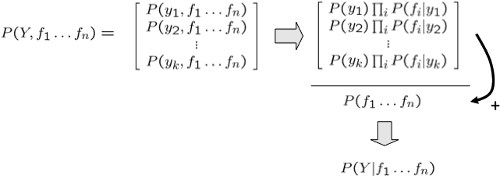
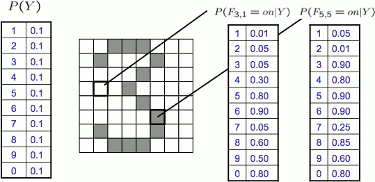
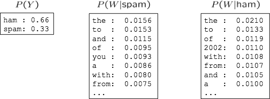
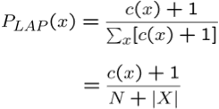
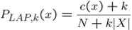
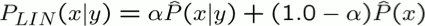

...menustart

 - [ML: Naive Bayes](#6856afc5ad38d66b5a3b6ff807def28d)
     - [Classification](#5c9335b28e6277ddbe0137f04e5e58a7)
         - [Example: Spam Filter](#a21106d371e3b781cefa4ea3fb2d4265)
         - [Example: Digit Recognition](#de03e1744be4ca06ea00adc90983e302)
     - [Model-Based Classification](#e080178592b7b3e0a141aaf2e841797e)
     - [Naïve Bayes for Digits](#f5547915f2e7052183052cf6dbad10ce)
     - [General Naïve Bayes](#e27a6ed5d3c268f25d469754df7657a9)
         - [Inference for Naïve Bayes](#56fd5f361e6690802d9a291400491091)
     - [General Naïve Bayes, Cont.](#b135ee99bc69046ed9ad6290d2554ab6)
         - [Example: Conditional Probabilities](#fd27d6138c6ef3054424479dd595b6d5)
     - [Naïve Bayes for Text](#546d1ef7d3d18b0a466e84f7792d2a0f)
         - [Example: Spam Filtering](#6b03991376723e26480509d0419c1d80)
     - [Training and Testing](#6e4505b252955533c68da1374c8a1eef)
         - [Important Concepts](#66899ae5468ceb740e26c9e451751434)
     - [Parameter Estimation](#c9880662a00c1e4f5ae91bd05c1e072b)
     - [Smoothing](#7d2f4f11883a6048b4d25e8cfaff5d03)
         - [Laplace Smoothing](#cd5ec321ae237a8948ceab20a0ed5dbe)
     - [Estimation: Linear Interpolation*](#e7cc6a9fab279f966b739b2be71b2798)
     - [Tuning](#89dd2948ecda7325c0001d8a0e51a2d8)
         - [Tuning on Held-Out Data](#bd8ac944519f42bc432e184e790e1481)
     - [Features](#98f770b0af18ca763421bac22b4b6805)
         - [Errors, and What to Do](#46a4571fe7fc8f635e1199e64c06e3c3)

...menuend

<h2 id="6856afc5ad38d66b5a3b6ff807def28d"></h2>

# ML: Naive Bayes

 - Up until now: how use a model to make optimal decisions
 - Machine learning: how to acquire a model from data / experience
    - Learning parameters (e.g. probabilities)
    - Learning structure (e.g. BN graphs)
    - Learning hidden concepts (e.g. clustering)
 - Today: model-based classification with Naive Bayes

<h2 id="5c9335b28e6277ddbe0137f04e5e58a7"></h2>

## Classification

<h2 id="a21106d371e3b781cefa4ea3fb2d4265"></h2>

### Example: Spam Filter
 
 - Input: an email
 - Output: spam/ham
 - Setup:
    - Get a large collection of example emails, each labeled “spam” or “ham”
    - Note: someone has to hand label all this data!
    - Want to learn to predict labels of new, future emails
 - Features: The attributes used to make the ham / spam decision
    - Words: FREE!
    - Text Patterns: $dd, CAPS
    - Non-text: SenderInContacts
    - ...

<h2 id="de03e1744be4ca06ea00adc90983e302"></h2>

### Example: Digit Recognition

 - Input: images / pixel grids
 - Output: a digit 0-9
 - Setup:
    - Get a large collection of example images, each labeled with a digit
    - Note: someone has to hand label all this data!
    - Want to learn to predict labels of new, future digit images
 - Features: The attributes used to make the digit decision
    - Pixels: (6,8)=ON
    - Shape Patterns: NumComponents, AspectRatio, NumLoops
    - ...

<h2 id="e080178592b7b3e0a141aaf2e841797e"></h2>

## Model-Based Classification

 - Model-based approach
    - Build a model (e.g. Bayes’ net) where both the label and features are random variables
    - Instantiate any observed features
    - Query for the distribution of the label conditioned on the features
 - Challenges
    - What structure should the BN have?
    - How should we learn its parameters?

<h2 id="f5547915f2e7052183052cf6dbad10ce"></h2>

## Naïve Bayes for Digits

 - Naïve Bayes: Assume all features are independent effects of the label
    - ![][1] 
 - Simple digit recognition version:
    - One feature (variable) Fᵢⱼ for each grid position `<i,j>`
    - Feature values are on / off, based on whether intensity is more or less than 0.5 in underlying image
    - Each input maps to a feature vector, e.g.
        - 1 -> F0,0=0, F0,1=1, ... , F15,15 =0
    - Here: lots of features, each is binary valued
 - Naïve Bayes model:
    - P(Y|F0,0 ... 15,15) ∝ P(Y)·∏i,j P(Fi,j|Y)
 - What do we need to learn?

<h2 id="e27a6ed5d3c268f25d469754df7657a9"></h2>

## General Naïve Bayes

 - A general Naive Bayes model:
    - ![][1]
    - P(Y,F₁...Fn) = P(Y)·∏ᵢP(Fᵢ|Y)
        - from |Y|x|F|ⁿ values
        - to n x |F| x |Y| parameters
 - We only have to specify how each feature depends on the class
 - Total number of parameters is linear in n
 - Model is very simplistic, but often works anyway

<h2 id="56fd5f361e6690802d9a291400491091"></h2>

### Inference for Naïve Bayes

 - Goal: compute posterior distribution over label variable Y
    - Step 1: get joint probability of label and evidence for each label
    - Step 2: sum to get probability of evidence
    - Step 3: normalize by dividing Step 1 by Step 2

<h2 id="b135ee99bc69046ed9ad6290d2554ab6"></h2>

## General Naïve Bayes, Cont.

 - What do we need in order to use Naïve Bayes?
    - Inference method (we just saw this part)
        - Start with a bunch of probabilities: P(Y) and the P(Fᵢ|Y) tables
        - Use standard inference to compute P(Y|F₁…Fn)
        - Nothing new here
    - Estimates of local conditional probability tables
        - P(Y), the prior over labels
        - P(Fᵢ|Y) for each feature (evidence variable)
        - These probabilities are collectively called the parameters of the model and denoted by θ
        - Up until now, we assumed these appeared by magic, but…
        - …they typically come from training data counts: we’ll look at this soon

<h2 id="fd27d6138c6ef3054424479dd595b6d5"></h2>

### Example: Conditional Probabilities

<h2 id="546d1ef7d3d18b0a466e84f7792d2a0f"></h2>

## Naïve Bayes for Text

 - Bag-of-words Naïve Bayes:
    - Features: Wᵢ is the word at positon i
    - As before: predict label conditioned on feature variables (spam vs. ham)
    - As before: assume features are conditionally independent given label
    - New: each Wᵢ is identically distributed
 - Generative model:
    - P(Y,W₁...Wn) = P(Y)∏ᵢ P(Wᵢ|Y)
 - “Tied” distributions and bag-of-words
    - Usually, each variable gets its own conditional probability distribution P(F|Y)
    - In a bag-of-words model
        - Each position is identically distributed
        - All positions share the same conditional probs P(W|Y)
        - Why make this assumption?
    - Called “bag-of-words” because model is insensitive to word order or reordering

<h2 id="6b03991376723e26480509d0419c1d80"></h2>

### Example: Spam Filtering

 - What are the parameters?
    - 
 - Where do these tables come from?

 - example below
    - Tot field calculate the log value of total probability
        - log( P(Y,W₁, ... Wn) ) = logP(Y) + ∑log( P(Wᵢ|Y) ) 
    - (prior) is P(Y)
    - the first word is `Gray`

Word | P(w\|spam) | P(w\|ham) | Tot Spam | Tot Ham 
--- | --- | --- | --- | --- 
(prior) | 0.33333 | 0.66666 | -1.1 | -0.4
Gary | 0.00002 | 0.00021 | -11.8 | -8.9 
world | 0.00069 | 0.00084 | -19.1 | -16.0
... | ... | ... | ... | ... 
sleep | 0.00006 | 0.00001 | -76.0 | -80.5

 - P(spam | w) = 98.9 
    - e-76.0 / ( e-76.0 + e-80.5 ) = 98.9

<h2 id="6e4505b252955533c68da1374c8a1eef"></h2>

## Training and Testing

<h2 id="66899ae5468ceb740e26c9e451751434"></h2>

### Important Concepts

 - Data: labeled instances, e.g. emails marked spam/ham
    - Training set
    - Held out set
    - Test set
 - Features: attribute-value pairs which characterize each x
 - Experimentation cycle
    - Learn parameters (e.g. model probabilities) on training set
    - (Tune hyperparameters on held-out set)
    - Compute accuracy of test set
    - Very important: never “peek” at the test set!
 - Evaluation
    - Accuracy: fraction of instances predicted correctly
 - Overfitting and generalization
    - Want a classifier which does well on test data
    - Overfitting: fitting the training data very closely, but not generalizing well
    - We’ll investigate overfitting and generalization formally in a few lectures

<h2 id="c9880662a00c1e4f5ae91bd05c1e072b"></h2>

## Parameter Estimation

 - Estimating the distribution of a random variable
 - Elicitation: ask a human (why is this hard?)
 - Empirically: use training data (learning!)

<h2 id="7d2f4f11883a6048b4d25e8cfaff5d03"></h2>

## Smoothing

<h2 id="cd5ec321ae237a8948ceab20a0ed5dbe"></h2>

### Laplace Smoothing

 - Laplace’s estimate:
    - Pretend you saw **every** outcome once more than you actually did
    - 
 - Can derive this estimate with Dirichlet priors (see cs281a)
 - for some purpose like zeor is not allowed.
 - example
    - samples: red, red, blue
    - PML(X) = ( 2/3, 1/3 )
    - PLAP(X) = ( 3/5, 2/5 )  
        - adding 1 red, 1 blue
 - Laplace’s estimate (extended):
    - Pretend you saw **every** outcome **k extra** time
    - 
    - What’s Laplace with k = 0?
    - k is the **strength** of the prior
    - PLAP,0(X) = (2/3, 1/3)
    - PLAP,1(X) = (3/5, 2/5)
    - PLAP,100(X) = (102/203, 101/203)
 - Laplace for conditionals:
    - Smooth each condition independently:
    - 

<h2 id="e7cc6a9fab279f966b739b2be71b2798"></h2>

## Estimation: Linear Interpolation* 

 - In practice, Laplace often performs poorly for P(X|Y):
    - When |X| is very large
    - When |Y| is very large
 - Another option: linear interpolation
    - Also get the empirical P(X) from the data
    - Make sure the estimate of P(X|Y) isn’t too different from the empirical P(X)
    - 
 - For even better ways to estimate parameters, as well as details of the math, see cs281a, cs288

<h2 id="89dd2948ecda7325c0001d8a0e51a2d8"></h2>

## Tuning

<h2 id="bd8ac944519f42bc432e184e790e1481"></h2>

### Tuning on Held-Out Data

 - Now we’ve got two kinds of unknowns
    - Parameters: the probabilities P(X|Y), P(Y)
    - Hyperparameters: e.g. the amount / type of smoothing to do, k, α
 - What should we learn where?
    - Learn parameters from training data
    - Tune hyperparameters on different data
    - For each value of the hyperparameters, train and test on the held-out data
    - Choose the best value and do a final test on the test data

<h2 id="98f770b0af18ca763421bac22b4b6805"></h2>

## Features

<h2 id="46a4571fe7fc8f635e1199e64c06e3c3"></h2>

### Errors, and What to Do

 - Need more features– words aren’t enough!
    - Have you emailed the sender before?
    - Have 1K other people just gotten the same email?
    - Is the sending information consistent? 
    - Is the email in ALL CAPS?
    - Do inline URLs point where they say they point?
    - Does the email address you by (your) name?
 - Can add these information sources as new variables in the NB model
 - Next class we’ll talk about classifiers which let you easily add arbitrary features more easily

    

---

 [1]: ../imgs/cs188_naive_BNs_bn4Digits.png

