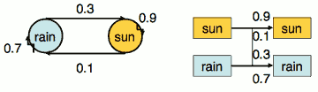

...menustart

- [Markov Models](#d656a155bed68a7dec83cd56ff973bbc)
    - [Markov Models](#d656a155bed68a7dec83cd56ff973bbc)
        - [Joint Distribution of a Markov Model](#2549029b268b93144235df84effeb97d)
        - [Chain Rule and Markov Models](#1584c0069936b81fd7e2d00d4dc7186a)
        - [Implied Conditional Independencies](#5627b13e1756dc92c82a9b3998e04960)
        - [Example Markov Chain : Weather](#a3e9d92d013e8bd559c093cbca5a7684)
        - [Mini-Forward Algorithm](#cd0df25e7ecc8f5591d125ef5318fae1)
        - [Stationary Distributions](#cff3dc4ffa629a6c5051471a4665a6c7)
    - [Application of Stationary Distribution: Web Link Analysis](#485984b095c6416cdcac20510c1c3a37)

...menuend


<h2 id="d656a155bed68a7dec83cd56ff973bbc"></h2>


# Markov Models


<h2 id="d656a155bed68a7dec83cd56ff973bbc"></h2>


## Markov Models

Markov model means sequence of random variables. 

- Value of X at a given time is called the state
    - X₁ -> X₂ -> X₃ -> X₄ -> ...
    - X₁ has an influence on X₂ going to be , X₂ has an influcence on X₃ going to be , ... 
    - P(X₁)
    - P(X<sub>t</sub> | X<sub>t-1</sub>) 

- Parameters: called ***transition probabilities*** or dynamics, specify how the state evolves over time (also, initial state probabilities)
- Stationarity assumption: transition probabilities the same at all times
    - this means transition probabilities P(x<sub>t</sub> | x<sub>t-1</sub> ) don't depend on time, they are always the same. 
- Same as MDP transition model, but no choice of action
    
<h2 id="2549029b268b93144235df84effeb97d"></h2>


### Joint Distribution of a Markov Model

This case let's look at just 4 variables. 


- Joint distribution:
    - P(X₁, X₂, X₃, X₄) = P(X₁)·P(X₂|X₁)·P(X₃|X₂)·P(X₄|X₃)
- More generally
    - P(X₁, X₂, ..., X<sub>T</sub>) = P(X₁)·P(X₂|X₁)·P(X₃|X₂)...P(X<sub>T</sub>|X<sub>T-1</sub>)
    - 
- 简化版 Chain Rule

<h2 id="1584c0069936b81fd7e2d00d4dc7186a"></h2>


### Chain Rule and Markov Models

- From the chain rule, every joint distribution over X₁, X₂, X₃, X₄ , can can be written as:
    - P(X₁, X₂, X₃, X₄) = P(X₁)·P(X₂|X₁)·P(X₃|X₁,X₂)·P(X₄|X₁,X₂,X₃)  
- Assuming that
    - X₃ ⊥ X₁|X₂  
        - What dose that mean ?  That means that once somebody tells you the value of X₂,  you write the distribution of X₃ ; somebody then tells you what X₁ is and the distribution of X₃ doesn't change -- stays the same. 
    - X₄ ⊥ X₁,X₂ | X₃ 
- results in the expression posited on the previous slide: 
    - P(X₁, X₂, X₃, X₄) = P(X₁)·P(X₂|X₁)·P(X₃|X₂)·P(X₄|X₃)

--- 

- generally
    - 


<h2 id="5627b13e1756dc92c82a9b3998e04960"></h2>


### Implied Conditional Independencies 

- We assumed : `X₃ ⊥ X₁|X₂`  , and `X₄ ⊥ X₁,X₂ | X₃` 
- We also have :  `X₁ ⊥ X₃,X₄ |X₂`
- proof:
    - 
- Additional explicit assumption
    - P(X<sub>t</sub>|X<sub>t-1</sub>) is the same for all t   // TODO  why ?


<h2 id="a3e9d92d013e8bd559c093cbca5a7684"></h2>


### Example Markov Chain : Weather


- States: X = {rain, sun}
- Initial distribution: 1.0 sun

---

 t-1 | t | P(X<sub>t</sub>\|X<sub>t-1</sub>):
--- | --- | --- 
sun | sun | 0.9
sun | rain | 0.1
rain | sun | 0.3
rain | rain | 0.7

---

- Two new ways of representing the same CPT
    - 
 
- What is the probability distribution after one step : P(X₂=sun) ?

``` 
P(X₂=sun) = P(X₂=sun,X₁=sun) + P(X₂=sun,X₁=rain)
          = P(X₂=sun|X₁=sun)·P(X₁=sun) + P(X₂=sun|X₁=rain)·P(X₁=rain)
          = 0.9·1 + 0.3·0 = 0.9
```

<h2 id="cd0df25e7ecc8f5591d125ef5318fae1"></h2>


### Mini-Forward Algorithm

- Question: What’s P(X) on some day t?
- 


<h2 id="cff3dc4ffa629a6c5051471a4665a6c7"></h2>


### Stationary Distributions

- For most chains:
    - Influence of the initial distribution gets less and less over time.
    - The distribution we end up in is independent of the initial distribution
- Stationary distribution:
    - The distribution we end up with is called the stationary distribution           of the chain
    - It satisfies  

- As the property of markov matrix , it will converge to 0.94868/0.31623 = 3:1, that means:
    - P<sub>∞</sub>(sun) = 3/4
    - P<sub>∞</sub>(rain) = 1/4 

```
octave:6> a = [ 0.9 0.3 ; 0.1 0.7 ]
a =

   0.90000   0.30000
   0.10000   0.70000

octave:7> [V,LAMBDA] = eig(a)
V =

   0.94868  -0.70711
   0.31623   0.70711

LAMBDA =

Diagonal Matrix

   1.00000         0
         0   0.60000

```

---

<h2 id="485984b095c6416cdcac20510c1c3a37"></h2>


## Application of Stationary Distribution: Web Link Analysis

- PageRank over a web graph
    - Each web page is a state
    - Initial distribution: uniform over pages
    - Transitions:
        - With prob. c, uniform jump to a random page
        - With prob. 1-c, follow a random outlink
- Stationary distribution
    - Will spend more time on highly reachable pages
        - E.g. many ways to get to the Acrobat Reader download page
    - Somewhat robust to link spam
    - Google 1.0 returned the set of pages containing all your keywords in decreasing rank, now all search engines use link analysis along with many other factors (rank actually getting less important over time)


