...menustart

 - [Bayes' Nets](#c2f3bc4be79d4a49c84b7ffb0644eff9)
     - [Probabilisitc Models](#f1f32e6fc4b6fcc5409cb5b84da30756)
     - [Conditional Independence and the Chain Rule](#6dbb065be0f855ef230490aedd47103a)
     - [Ghostbusters Chain Rule](#9660c002f8b9677254dd06f6473fe388)
     - [Bayes’Nets: Big Picture](#8755cf27c012dd862b7fafd818ebe47c)
         - [Example Bayes’ Net: Insurance](#48af1ae6f8bdf0820233428d9154139d)
     - [Graphical Model Notation](#28fa8f61771681fb87012ffe5cebe489)
         - [Example: Coin Flips](#b21fb046e03cde12d963e952806fb6e5)
         - [Example: Traffic](#fb89b5b88a6b8a1c7631833b7faa03c8)
         - [Example: Traffic II](#1b596ac7e393d4800237a4fd706e8812)
         - [Example: Alarm Network](#f768385fe8f12ac5b5067eeb09ca1399)
     - [Bayes’ Net Semantics](#4dbc391a5b44f9e161311a3fba175cc0)
     - [Probabilities in BNs](#ce8acee5cb0da810e5f01ddfa604658c)
         - [Example: Alarm Network](#f768385fe8f12ac5b5067eeb09ca1399)
         - [Example: Traffic](#fb89b5b88a6b8a1c7631833b7faa03c8)
         - [Example: Reverse Traffic](#f4b6db064e3259a2c85401269f24a90d)
     - [Causality?](#54f20fcd3def5febfad5b1407c902d3f)
     - [Bayes’ Nets](#cb30f9b4fbe788aecc363dfbb9d8a620)

...menuend

<h2 id="c2f3bc4be79d4a49c84b7ffb0644eff9"></h2>

# Bayes' Nets

Bayes' Nets, also known as graphical models, which are a technique for building probabilistic models over large numbers of random variables, in a way that is efficient to sepcify and efficient to reason over.

The development of AI stop in 80s because the difficulty of uncertainty. You can not compute such a large joint probability table with thousands variable.

Bayes' Nets wil give us a way to deal with distributions of our large sets of random variable in a meaningful way. 

<h2 id="f1f32e6fc4b6fcc5409cb5b84da30756"></h2>

## Probabilisitc Models 

 - Models describe how (a portion of) the world works
 - **Models are always simplifications**
    - May not account for every variable
    - May not account for all interactions between variables
    - “All models are wrong; but some are useful.”    – George E. P. Box
 - What do we do with probabilistic models?
    - We (or our agents) need to reason about unknown variables, given evidence
    - Example: explanation (diagnostic reasoning)
    - Example: prediction (causal reasoning)
    - Example: value of information

<h2 id="6dbb065be0f855ef230490aedd47103a"></h2>

## Conditional Independence and the Chain Rule

 - Bayes’nets / graphical models help us express conditional independence assumptions

<h2 id="9660c002f8b9677254dd06f6473fe388"></h2>

## Ghostbusters Chain Rule

In this case ,there are just 2 locations for the ghost , top or bottom.

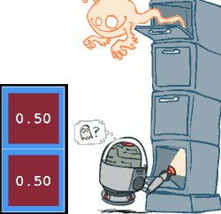

So you could have a measurement on each of these squares so each of them could give you a red measurement or not a red measurement, so those are 2 random variables. The ghost's location is another random variable , whether it is being in the top .

 - Each sensor depends only on where the ghost is
 - That means, the two sensors are conditionally independent, given the ghost position
 - T: Top square is red: 
    - B: Bottom square is red: 
    - G: Ghost is in the top
 - Givens:
    - P(+g) = 0.5
    - P(-g) = 0.5
    - P(+t | +g) = 0.8
    - P(+t | -g) = 0.4
    - P(+b | +g) = 0.4
    - P(+b | -g) = 0.8
 - In general it is not enough to specify a full joint distribution 
 - But if we're willing to assume the 2 sensor are independent given where the ghost is , then this is enough.
    - P(G,B,T) = P(G)P(T|G)P(B|G)

---

<h2 id="8755cf27c012dd862b7fafd818ebe47c"></h2>

## Bayes’Nets: Big Picture

It's a new way of representing joint distributions. It's very closely related to the chain rule. 

We've always talked about discrete random variables , and then a distribution can be a talble. If you have continuous random variables then the way to represent the distribution is commonly done using a probability density function, which effectively encodes how much probability mass is associated with each interval if it's a 1D distribution, or each volume in space was probability of landing in a certain volume of space. It turns out if you had continuous random variables you can still use Bayes Nets. And the conditional distributions that you'd be working with would then be conditional distributions that are densities rather than the discrete distributions. 

 - Two problems with using full joint distribution tables as our probabilistic models:
    - Unless there are only a few variables, the joint is WAY too big to represent explicitly
    - Hard to learn (estimate) anything empirically about more than a few variables at a time
 - **Bayes’ nets:** : a technique for describing complex joint distributions (models) using simple, local distributions (conditional probabilities)
    - More properly called **graphical models**
    - We describe how variables locally interact
    - Local interactions chain together to give global, indirect interactions
    - For about 10 min, we’ll be vague about how these interactions are specified

<h2 id="48af1ae6f8bdf0820233428d9154139d"></h2>

### Example Bayes’ Net: Insurance

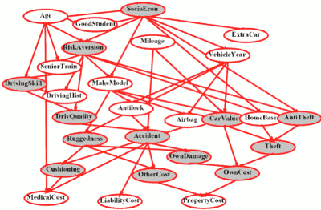

 - 27 variables
    - assuming they are binary
 - 2²⁷ ≈ 134M entries
 - 你很难去估测 所有variable 之间的联系

---

<h2 id="28fa8f61771681fb87012ffe5cebe489"></h2>

## Graphical Model Notation

 - Nodes: variables (with domains)
    - Can be assigned (observed) or unassigned (unobserved)
    - often the ones that are assigned we shade in with gray 
 - Arcs: interactions
    - Similar to CSP constraints
    - Indicate “direct influence” between variables
    - Formally: encode conditional independence (more later)

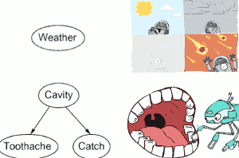

 - For now: imagine that arrows mean direct causation (in general, they don’t!)
    - it's often true, but it doesn't have to be true.

<h2 id="b21fb046e03cde12d963e952806fb6e5"></h2>

### Example: Coin Flips

 - N independent coin flips
 - No interactions between variables: **absolute independence**

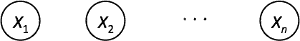

<h2 id="fb89b5b88a6b8a1c7631833b7faa03c8"></h2>

### Example: Traffic

 - Variables:
    - R: It rains
    - T: There is traffic
 - Model 2: rain causes traffic
    - R → T

<h2 id="1b596ac7e393d4800237a4fd706e8812"></h2>

### Example: Traffic II

 - Let’s build a causal graphical model!
 - Variables
    - T: Traffic
    - R: It rains
    - L: Low pressure
    - D: Roof drips
    - B: Ballgame
    - C: Cavity

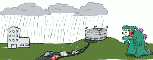

 - L → R → T 
    - - low-pressure actually does affect traffic, but it mitigated (alleviated) through 
 - Ballgame may lead to traffic , also may be cancelled when there is a lot of rain. 
 

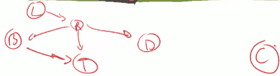

 - keep in mind that all these things are up for debate
 - whether your roof is dripping or not CAN tell you something about whether there's traffic or not ? 
    - because you see a roof dripping which tells you something about whether it's raining or not, which in turn tells you something about whether there's traffic or not because no direct arrow , because the effect is mitigated in the model we have through R.
    
<h2 id="f768385fe8f12ac5b5067eeb09ca1399"></h2>

### Example: Alarm Network

 - Variables
    - B: Burglary
    - A: Alarm goes off
    - M: Mary calls you
    - J: John calls you
    - E: Earthquake!
 - assume that you neighbors are just listening to things not watching things. 

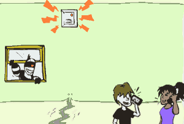

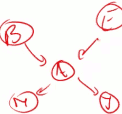

---

<h2 id="4dbc391a5b44f9e161311a3fba175cc0"></h2>

## Bayes’ Net Semantics

For a given Bayes' Net, what does it mean ? What joint probability distribution does it encode ? How do we know that ?

- A set of nodes, one per variable X
- A directed, acyclic graph
- A conditional distribution for each node
    - 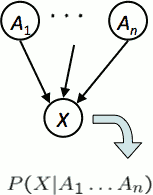
    - A collection of distributions over X, one for each combination of parents’ values
        - P(X|a₁,...,an)
    - CPT: conditional probability table
    - Description of a noisy “causal” process
        - e.g. if it rains, then there's 90% probability of traffic, if it doesn't rain, there's a 30% probability of traffic.
        - this is not part of the definition
- **A Bayes net = Topology (graph) + Local Conditional Probabilities**. 
    - a graph, plus all the little local conditional probabilities that live inside the nodes.

---

<h2 id="ce8acee5cb0da810e5f01ddfa604658c"></h2>

## Probabilities in BNs

 - Bayes’ nets ***implicitly*** encode joint distributions
    - As a product of local conditional distributions
    - To see what probability a BN gives to a full assignment, multiply all the relevant conditionals together:
        - ![][1]
    - Exampe
        - 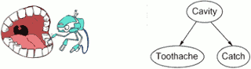
        - P(+cavity, +catch, -toothache) = P(+cavity)·P(-toothache|+cavity)·P(+catch|+cavity)

---

 - Not every BN can represent every joint distribution
    - The topology enforces certain conditional independencies

There are BNs graphs that don't make any assumptions. It's when you don't get rid of anything. 

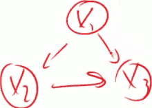

If you look at the size of these conditional distributions they'll be huge, just as big as the full joint distribution.

So you are making these assumptions , limiting the size of parent set, to have more compact representations. 

<h2 id="f768385fe8f12ac5b5067eeb09ca1399"></h2>

### Example: Alarm Network

<h2 id="fb89b5b88a6b8a1c7631833b7faa03c8"></h2>

### Example: Traffic

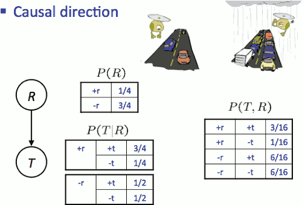

So here is the joint distribution over T and R, that is implied by the Bayes' Net on the left. Great.

<h2 id="f4b6db064e3259a2c85401269f24a90d"></h2>

### Example: Reverse Traffic

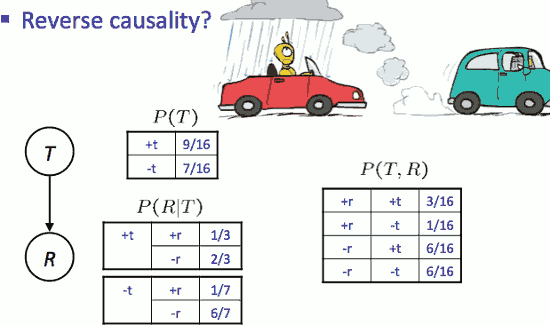

This network here, which does not match the causal process, encodes the exact same joint distribution over those varialbes as the previous one.  Now you might like the previous one better. And there's a lot of advantages to drawing these things causally. But mathematically, it is just an expansion of the chain rule.

---

<h2 id="54f20fcd3def5febfad5b1407c902d3f"></h2>

## Causality?

 - When Bayes’ nets reflect the true causal patterns:
    - Often simpler (nodes have fewer parents)
        - OFTEN we choose them to be causal , and the reason we choosing be causal is that you'll end up with fewer parents.
    - Often easier to think about
    - Often easier to elicit from experts
        - P(Traffic|Rain) is easy to get rather than P(Rain|Traffic)
 - BNs need not actually be causal
    - Sometimes no causal net exists over the domain (especially if variables are missing)
    - E.g. consider the variables Traffic and Drips
        - you don't  care about Raining any more
        - T→D may be a reasonable choice, also D→R may be a reasonable choice.  but both of them are not causal.
    - End up with arrows that reflect correlation, not causation
 - What do the arrows really mean?
    - Topology may happen to encode causal structure
    - **Topology really encodes conditional independence**
        - ![][1]
 

<h2 id="cb30f9b4fbe788aecc363dfbb9d8a620"></h2>

## Bayes’ Nets

- So far: how a Bayes’ net encodes a joint distribution
- Next: how to answer queries about that distribution
    - Today: 
        - First assembled BNs using an intuitive notion of conditional independence as causality
        - Then saw that key property is conditional independence
    - Main goal: answer queries about conditional independence and influence 
- After that: how to answer numerical queries (inference)

---

 [1]: ../imgs/cs188_BNsR_probInBNs_product.png

