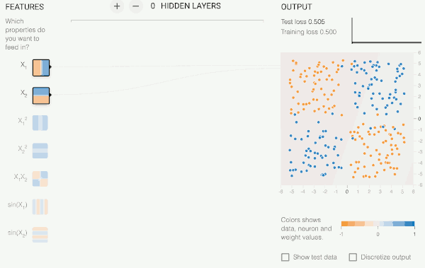
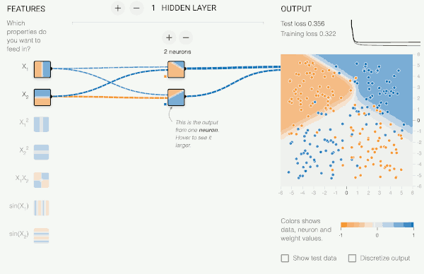
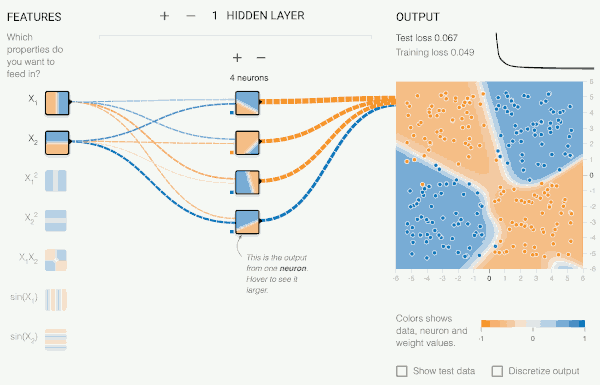
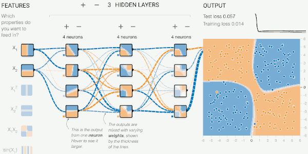
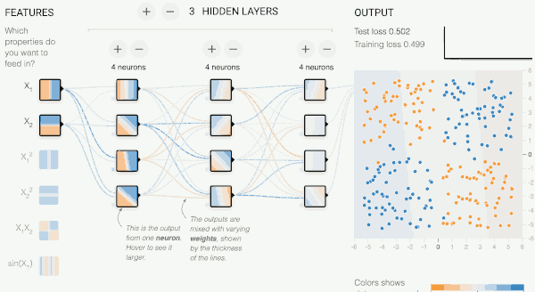
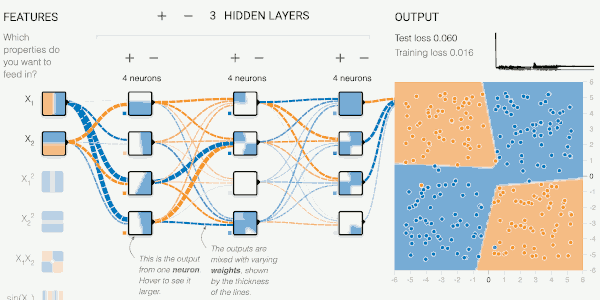
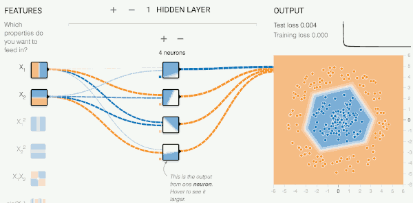
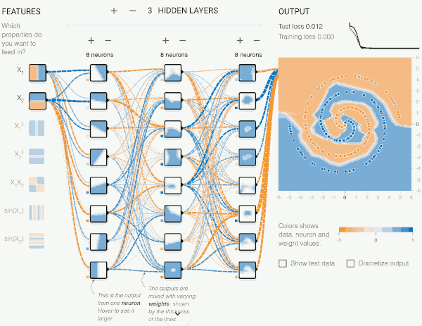

- [22 Optimiaztion and Neural Nets](#88b84e5bd0f13fb156241e3fa8290da7)

<h2 id="88b84e5bd0f13fb156241e3fa8290da7"></h2>

# 22 Optimiaztion and Neural Nets

[pdf](https://github.com/mebusy/cs188_fa18/blob/master/fa18_cs188_lectures_pdf/FA18_cs188_lecture22_optimization_and_neural_nets_1pp.pdf)

[Fun Neural Net Demo Site](http://playground.tensorflow.org/) It's a lot of fun to play around with. You get intuition for what a neural network can capture or not capture in terms of data patterns.

For this datase, what if we run logistic regression ? 

It doesn't do too well.  You see nothing is very dark blue, nothing is very dark yellow, meaning nowhere it's very confident about the lable. It's often wrong about the label.

And that's the best it can do here.

But we've seen if we have a neural network, we might be able to do something more expressive.  Let's add some layers.

Let's add a hidden layer. How many units do you want here? Let's start with 2 units.

You find something where for two of the regions it does pretty well. And then the other region , it assigns kind of a 0.5 probability it doesn't know.

(Note, each hidden layer unit split the dataset into 2 setsby the way it learned.)

Well, you've seen the universal funcion approximation theorem. It says if your network is big enough, it should be able to capure the pattern in the data.

Let's add more units.

How many neurons do you think you need to capture the pattern in this data ? 

Intuitively, 4 makes a lot of sense. 

What's this blue one doing at the bottom right corner? That's probaly overfitting.

What's happens if we make this network even bigger ?

So far the activation function is `Tanh`.  What if we changed this into linear?

The g funtion is doing nothing, just identity. What'll happen when we train?

Your prediction, hopefully, was it's not going to find a good solution, because if everything is linear, it's like having a linear classifier that has only just one layer, no hidden units.

What about `ReLU` ? which was a thing down below 0, you become 0.

---

How about circle dataset ?  Let's remove hidden layers. Let's think about what will happen when we just try to learn a linear classifier? It's not going to do too well.  What if we add hidden layers? It's able to parcel out that middle region.

What if we only have one hidden unit here?  That doesn't allow you to do much, because that one unit, effectively, is like on classifier, one linear classifier, You're saying, I'm going to first run one linear clasifier on my data. And all I get to do later is then use the result of that one linear classifier. It won't give you additional expressiveness. It's essentially still just a classifier.

---

How about the spiral datase ?  We use 3 hidden layers each has 8 units. The learning is not easy. This is a complicatd function to fit. But even though it is a very complicatd non-linear problem, haveing a network where each unit has its own local non-linearity is enough to be able to capture this. 

