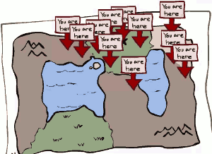
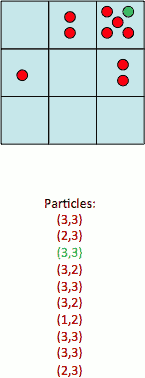
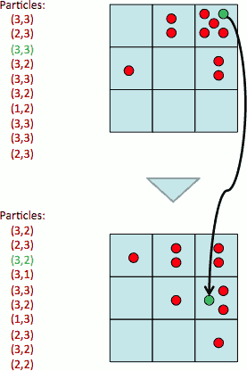
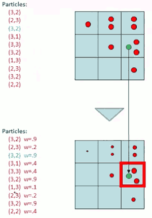
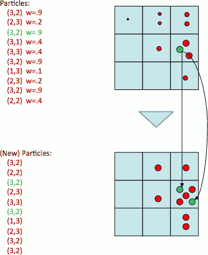
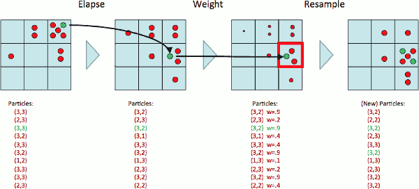
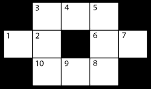

- [Particle Filtering](#410d3f5a2938bf0efb5fb0b5ef6ca702)
    - [Particle Filtering](#410d3f5a2938bf0efb5fb0b5ef6ca702)
        - [Prepresentation: Particles](#66e6211dd1d94379d2e996793264b1b9)
        - [Particle Filtering : Elapse Time](#853995ed6d9bf9986864449b043774f2)
        - [Particle Filtering: Observe](#48c6c2f783c106c655abca3552e166b3)
        - [Particle Filtering: Resample](#988c88ad650c59ea6c4f609059420535)
    - [Recap: Particle Filtering](#5d32a4d32d2126113fcc6cc88fde5a32)
    - [Implementation](#b672f52ade975e864ae6b58722c03689)
    - [Question:](#41e94aa2ea70937dbbcc787d8d5f1a2a)

<h2 id="410d3f5a2938bf0efb5fb0b5ef6ca702"></h2>

# Particle Filtering 

<I>Particle filtering is really a useful technique.</I>

HMM is basic idea of reasoning about underlying phenomenon over time on the basis of noisy observations. HMM is really important.

Particle filtering partially is something we do in the real world, because it's efficient. Especially when your event spaces are very large or continuous or infinite. It is a very powerful technique.

But it's also a really useful way of understanding what's happending in the exact case. Because sometimes, it's easier to think about tracking a particular particle or a particular sample instead of tracking the exact space in aggregate.

Let's thought about something different. Let's say you look at a HMM problem, and you say all right I get these  variable eliminations,  I can compute big tables of probability distribution over X , and I can do these online , I can do these on step-by-step update. But there's actually a couple problems. 

One question is there's enough sums and products that can kind of become a little unclear what the equations doing until you're familiar with it. That's a temporary problem but there are permanent problems as well with the exact inference. 

One is sometimes the space X is really really big and there's almost no chance that you're at anywhere except a couple locations. 

So think about you discrete tile compus down to 100 cm x 100 cm , and you have a robot that's right here . You started here and you run it for a minute but you kind of don't know if it's going to be 3 feet of 7 feet in that direction.  But youk know that it's not going to kind of be in sproul plaza. So you have the giant state-space , you're only using a small little piece of it and so somehow we like to not have to have our computation be proportional to the number of states ( O(n²) ).

Secondly there are more complicated versions of HMMs called dynamic business for which inference actually gets quite difficult. 

So what are we gonna do ?

We are going to replace the idea of a probability distribution that for each possible value of X returns your number -- was a lookup table for every state you get a numbe. Instead we're going to keep around a collection of hypotheses that may or may not be correct , and the hypotheses are going to embody a distribution as samples. So it's going to look something like this :  you got a map ,and instead of each 10cm² piece of that map,  having a tiny probability attached on it, I'm just going to have 300 places I might be. Now if I look these samples I don't exactly know where I am. Each sample says something different but I would guess that I'm somewhere in the upper right. And that's the idea.

<h2 id="410d3f5a2938bf0efb5fb0b5ef6ca702"></h2>

## Particle Filtering 

- Filtering: approximate solution
    - *Remember filtering is one name for the problem where I ask given all of my evidence, what is the current hidden variable Xt? Where is the robot now?*
- Sometimes |X| is too big to use exact inference
    - |X| may be too big to even store B(X)
    - E.g. X is continuous
- Solution: approximate inference
    - Track samples of X, not all values
        - I can't enumerate all the pairs or triples of real numbers. Instead of keeping track of a map from X to real numbers , I'm gonna keep track of a list of samples.
        - here are 10 samples each red dot is a sample 
        - and in this case my samples live on some but not all of the location on the grid. 
    - Samples are called particles
    - Time per step is linear in the number of samples
        - I'm going to do operations on these samples to give me new samples, and I'm going to do it basically by scanning over the old samples.
    - But: number needed may be large
    - In memory: list of particles, not states
- This is how robot localization works in practice
    - 
- Particle is just new name for sample

---

<h2 id="66e6211dd1d94379d2e996793264b1b9"></h2>

### Prepresentation: Particles

- Our representation of P(X) is now a list of N particles (samples)
    - Generally, `N << |X|`
    - Storing map from X to counts would defeat the point
    - 
    - here instead of writing 9 numbers which is 1 probability for each square I'm gonna have maybe 10 particles. 
        - **Each particle has a specific value of X** , eg. green particle (3,3), and it's not the only particle that represents that hypothesis , we actually have 5 completely different particle that all predicting the same state. 
        - so what's the probability of (3,3) ?   50% ! It's probably wrong but that's what the particles say.
- P(x) approximated by number of particles with value x
    - So, many x may have P(x) = 0! 
    - More particles, more accuracy
- For now, all particles have a weight of 1

---

<h2 id="853995ed6d9bf9986864449b043774f2"></h2>

### Particle Filtering : Elapse Time 

Now what do I do ?  I might start with my particles uniform or I have some particular belief and when time passes I need to move these particles around to reflect that. 

So I pick up each particle -- let's pick up the green one , a hypothesis of (3,3) -- where will it be next time ? 

Well I grab my transition model -- which might say counterclockwise motion with high probability -- , so I grap this particle and I say you're no longer a distribution, you're a single value of X, you maybe wrong but you're a single value of X and for that particular value of X. 

- Each particle is moved by sampling its next position from the transition model
    - `x' = sample( P(X'|x) )`
    - This is like prior sampling -- samples’ frequencies reflect the transition probabilities
    - Here, most samples move clockwise, but some move in another direction or stay in place
    - 
        - *I don't create particles , don't destroy particles, I picked them up 1 by 1 and I simulate what might happen to that particle in the next time step.*
        - *so there  might be 5 particles on (3,3) but they might not all get the same future because I flip a coin for each one. They might spread out in this case they do*.
- This captures the passage of time
    - If enough samples, close to exact values before and after (consistent)
    - *so someone gives me a HMM, that means they've given me the transition probabilities. I take my particles and each particle get simulated. That is like letting time pass in my model.   That's how in particle filtering time passes.*

---

<h2 id="48c6c2f783c106c655abca3552e166b3"></h2>

### Particle Filtering: Observe

What happens when I get evidence ?  It's a little tricky.

- Slightly trickier:
    - Don’t sample observation, fix it
    - Similar to likelihood weighting, downweight samples based on the evidence
        - w(x) = P(e|x)
        - B(X) ∝ P(e|X)B'(x)
- As before, the probabilities don’t sum to one, since all have been downweighted (in fact they now sum to (N times) an approximation of P(e))

Let's say here are my 10 particles . What happens when I get evidence that there's a reading of red meaning the ghost is close right here in this square (3,2).  We'll remember how evidence works in that case: I take each of my probabilities and I downweighted by the probability of the evidence.  In that analog of that here is to take each of your particles and give it a weight that reflects how likely the evidence is from that location.  So this green particle at (3,2) maybe the probability of seeing red if you actually are at (3,2) is 0.9.  So this is a reasonable hypothesis.  But this guy at top-left square has a very low probability of seeing this reading. 

So we get new samples weighted from the old samples. 

 
---

<h2 id="988c88ad650c59ea6c4f609059420535"></h2>

### Particle Filtering: Resample

- Rather than tracking weighted samples, we resample
    - we're not going to track these weighted samples, they are no good to me, because their weigths are starting to shrink. And if I do this for too long, their weights will all go to zero.

- N times, we choose from our weighted sample distribution (i.e. draw with replacement)
    - So what I'll do is to create new particles. The new particles, I sample with replacement(放回抽样) from the old weightned samples, are now equally weighted. 
    - (3,2) had a pretty high weight. So even though we get rid of all the old particles there going to be a lot of new ones which choose (3,2).

- This is equivalent to renormalizing the distribution
    - procedurally the idea is when you see evidence in your particle filter , you line up your particles , you weight them by the evidence and then you clone new particles through your old particles , and now the weights are all gone. 

- Now the update is complete for this time step, continue with the next one

---

<h2 id="5d32a4d32d2126113fcc6cc88fde5a32"></h2>

## Recap: Particle Filtering

- Particles: track samples of states rather than an explicit distribution

- You have some belief function. It is represented by a list of particles of things that might be true , and they are all kind of the particles represent your distribution at samples. 

- When time **elapsed**, you take your particles and you don't add or delete particles. For each one you pick a future for it through simulation -- you flip coin. That's like prior sampling. 

- When evidence comes in , you **weight** the particles based on a factor from the evidence , so some particles get shrunk down to almost zero, other particles that match the evidence still have a pretty substantial weight. 

- Then you decide you don't actually want these weighted particles. So you **resample** , and you get a new set of unweighted particles.

<h2 id="b672f52ade975e864ae6b58722c03689"></h2>

## Implementation

 1. Initialize particles by sampling from initial state distribution
 2. Repeat
    1. Perform time update
    2. Weight according to evidence
        - corner case: When all your particles receive zero weight based on the evidence, you should resample all particles to initial distribution
    3. Resample according to weights

---
 
- Note: for partical filtering , you no need to store beliefs,  current belief is stored in  particles
- **difference** :
    - sample
        - Forward Algorithm : you consider all possible positions
        - particle filtering :  you consider just particles.
    - time elapse
        - Forward Algorithm : you consider how likely it is to get to Xt+1 from each locations (X'). 
        - particle filtering : you just roll a dice, and move particle to next most likely position.

<h2 id="41e94aa2ea70937dbbcc787d8d5f1a2a"></h2>

## Question:

- use a particle filter to track the state of a robot that is lost in the small map below
    - 
- robot state: 1 ≤ Xt ≤ 10
- particles: approximate our belief over this state with N = 8 particles
- transition: At each timestep, the robot either stays in place, or moves to any one of its neighboring locations, all with equal probability
    - eg. if the robot starts in state Xt = 2 , the next state Xt+1 can be any element of { 1 , 2 , 3 , 10 } , and each occurs with probability 1/4 .  
- evidence: a sensor on the robot gives a reading Et ∈ {H,T,C,D}, corresponding to the type of state the robot is in. The possible types are:
    - **Hallway (H)** for states bordered by two parallel walls (4,9).
    - **Corner (C)** for states bordered by two orthogonal walls (3,5,8,10).
    - **Tee (T)** for states bordered by one wall (2,6).
    - **Dead End (D)** for states bordered by three walls (1,7).
- The sensor is not very reliable: it reports the correct type with probability 1/2 , but gives erroneous readings the rest of the time, with probability 1/6 for each of the three other possible readings.
 
---

So the Sensor Model is : (only list P(Sensor | H ))

Sensor Reading | State Type | P(Sensor \| State Type)
--- | --- | ---
H | H | 0.5
T | H | 1/6
C | H | 1/6
D | H | 1/6
H | T | 1/6
T | T | 0.5
... | ... | ...

---

step1: Initialize particles by sampling from initial state distribution, for t=0.

- sample the starting positions for our particles , by generating a random number rᵢ sampled uniformly from [ 0 , 1).

Particle | p₁ | p₂ | p₃ | p₄ | p₅ | p₆ | p₇ | p₈
--- | --- | --- | --- | --- | --- | --- | --- | ---
rᵢ | 0.914 | 0.473 |  0.679 |  0.879 |  0.212 |  0.024 | 0.458 | 0.154
Location | 10 | 5 | 7 | 9 | 3 | 1 | 5 | 2 

step2: Time update from t=0 → t=1.

- 移动每个粒子
    - eg. p₈ 在 location 2，可能的移动为 { 1 , 2 , 3 , 10 }， 产生另一个 random number ，来执行移动

Particle | p₁ | p₂ | p₃ | p₄ | p₅ | p₆ | p₇ | p₈
--- | --- | --- | --- | --- | --- | --- | --- | ---
rᵢ | 0.674 | 0.119 |  0.748 |  0.802 |  0.357 |  0.736 |  0.425 |  0.058
Location | 10 | 4 | 7 | 10 | 3 | 2 | 5 | 1 

step3: Incorporating Evidence at t = 1 : E₁ = D 

- Weight according to evidence , weight = P( e | X )
- 当证据出现时，step2 做的预测 ，可能性会出现变化

Particle | p₁ | p₂ | p₃ | p₄ | p₅ | p₆ | p₇ | p₈
--- | --- | --- | --- | --- | --- | --- | --- | ---
Weight | 1/6 | 1/6 | 0.5 | 1/6 | 1/6 | 1/6 | 1/6 | 0.5

step4: Resample according to weights 

- normalize weights 
- 计算 cumulative weights 
- 生成 uniform random ,  sample new particle

Particle | p₁ | p₂ | p₃ | p₄ | p₅ | p₆ | p₇ | p₈
--- | --- | --- | --- | --- | --- | --- | --- | ---
Location | 10 | 4 | 7 | 10 | 3 | 2 | 5 | 1 
Weight | 1/6 | 1/6 | 0.5 | 1/6 | 1/6 | 1/6 | 1/6 | 0.5
normalized weight | 1/12 | 1/12 | 0.25 | 1/12 | 1/12 | 1/12 | 1/12 | 0.25
Cumulative weight | 1/12=0.083 | 2/12=0.167 | 5/12=0.417 | 0.5 | 7/12=0.583 | 8/12=0.667 | 9/12=0.75 | 1
rᵢ  | 0.403 |  0.218 |  0.217 |  0.826 |  0.717 |  0.460 |  0.794 |  0.016
new particle (clone) | 3 | 3 | 3 | 8 | 7 | 4 | 8 | 1 
new location | 7 | 7 | 7 | 1 | 5 | 10 | 1 | 10 
 
--- 

