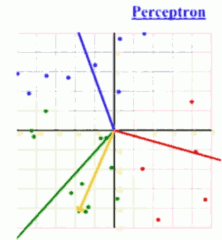

# 21. Perceptrons and Logistic Regression

The recent lectures was about probabilistic models. And if we train a probabilistic model over all variables that we might care about, we can then reuse that probabilistic model to make decisions for specific queries. For example, what's the probability of a class label y given some feature values f₁, ..., fn.

And that was one way you could reuse those models. And that's what we saw with naive Bayes for a specific type of Bayes net, you can use it to answer conditional queries about a class label.

Today we're going to look at solving that kind of problem, where we have a set of features and we want to output the decision on what class might be represented by those features. But we're **not going to learn a full probabilistic model**. We're gonna **focus on just the decision of going from features** to what the class label might be and **ignore learning a full probabilistic model**, which has some pros and cons. 

If you want a full probabilistic model you're not going to get it with the mothods from today. But if all you care about is that decision, today's method will zone in more on the particulars of that decision.

[lecture pdf](https://github.com/mebusy/cs188_fa18/blob/master/fa18_cs188_lectures_pdf/FA18_cs188_lecture21_perceptron_and_logistic_regression_1pp.pdf)

## Linear Classifiers

Q: How do we find w ?

It's going to be a little different from most things we've seen so far. We're gonna have an iterative algorithm that doesn't just look at the data and says, here is the result, but will loop over the data, look at all the data multiple times until finally it found something it's happy with.

So it will do an update, update, update, till finally it converges. A bit like the local search we did in CSPs where you wouldn't right away find a solution but try to improve it over time till finally find something good.

Q: Is this related to feature-based Q-learning?

In many ways it is. In feature-based Q learning, we had notion of the Q value is weight vector times feature vector. In Q-learning, we wanted the result of that inner product to be a Q value. Here, the way we use the resulting inner product is to make a decision as to whether it's positive or negative.  There's a lot of similarity. But the learning is very different. Because in Q-learning, we learn with an approximation to the Bellman equation based on samples, and here we learn essentially throuth supervison. So we get a lot of signal here. In Q-learning you have to bootstrap, and you were doing it based on some estimate of what the Q value would be at the next state. That was kind of approximate. Whereas here somebody tells you, this data point, this f of x, should have a positive label.

Example: multiclass decision example 

## Logistic Regression

## Summary

- Perceptron won't work on Non-Separable dataset
- Logistic Regression and probabilistic decisions
- Multiclass Logistic Regression 
    - Softmax

# 22. Optimization and Neural Nets

