...menustart

- [Summary](#290612199861c31d1036b185b4e69b75)
- [Probability](#0d2765b30694ee9f4fb7be2ae3b676dc)
    - [Uncertainty](#9df64ea44035467d4b3b1d3137556ccb)
    - [Random Variables](#8a93f7814e04aeb4a3435d0667b581d7)
    - [Probability Distribution](#65b393733707f82733184765aa503081)
    - [Joint Distributions](#7d5c8826b9086639339acd137cdef0cc)
    - [Probabilistic Models](#e4859243f072fa05a4c2f94eecfdfc4c)
    - [Marginal Distributions](#34b3d41097573990cabbad8ae1d9c969)
    - [Conditional Probabilities](#9b6ebd3c632df1c60267481ca65ec2f5)
    - [Conditional Distribution](#d22ece9f9682b018dfb17860cc5aedd7)
    - [Normalization Trick](#1a18f3ea65669c3a4a2a7eff540de62e)
    - [Probabilistic Inference](#e806b0d3eeb72e7431bb8cdb823c4517)
    - [Inference by Enumeration](#314fa4378b3b188832e3f68fd46ac015)
    - [The Product Rule](#47d0d61476b8bc9f946aba690e7193cf)
    - [The Chain Rule](#62568a512f5b51ee525d33114a235b26)
    - [Bayes' Rule](#0a5416d1f7924e7448621d5634cddd61)
        - [Inference with Bayes' Rule](#534db09beb168ffccbe6a4f375c4c83d)
        - [Quiz: Bayes's Rule](#60e78d88608536cbe1771c99e9f822ca)
    - [Ghostbusters, Revisited](#993bd13d7ce69f119a65be6a3d92b3c0)
    - [Independcence](#a64838254ea118409679a4e28005fefb)
    - [Conditional Independence](#0f1513d04ac32269de73d0f17465488e)

...menuend


<h2 id="290612199861c31d1036b185b4e69b75"></h2>


# Summary

- 


<h2 id="0d2765b30694ee9f4fb7be2ae3b676dc"></h2>


# Probability

In part 2 we will assume that the models are given to us.


demo: ghost busters

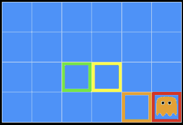

- A ghost is in the grid somewhere
- Sensor readings tell how close a square is to the ghost
    - On the ghost: red
    - 1 or 2 away: orange
    - 3 or 4 away: yellow
    - 5+ away: green
- On top of ghost, we usually get red, but we could get green.   It's a nosiy sense. 
- Sensors are noisy, but we know P(Color | Distance)

---

 P( red\|3 )| P( orange\|3 )   | P( yellow\|3 )   |P( green\|3 )
--- | --- | --- | --- 
 0.05 | 0.15 | 0.5 | 0.3 
   
---

<h2 id="9df64ea44035467d4b3b1d3137556ccb"></h2>


## Uncertainty

When we deal with an uncertainty usually we can split the random variables into 2 groups. 

- one group is the group of random variables that would get to observe. We get to measure them.
- something about the variables we don't get to measure -- the hidden variables , the unobserved variables -- and do that in some structured way. 
 
---

- General situation:
    - **Observed variables (evidence)**: 
        - Agent knows certain things about the state of the world (e.g., sensor readings or symptoms)
        - It's not uncertain anymore.
    - **Unobserved variables**: 
        - Agent needs to reason about other aspects (e.g. where an object is or what disease is present)
    - **Model**: 
        - Agent knows something about how the known variables relate to the unknown variables
- Probabilistic reasoning gives us a framework for managing our beliefs and knowledge


<h2 id="8a93f7814e04aeb4a3435d0667b581d7"></h2>


## Random Variables

- A random variable is some aspect of the world about which we (may) have uncertainty
    - R = Is it raining?
    - T = Is it hot or cold?
    - D = How long will it take to drive to work?
    - L = Where is the ghost?
- We denote random variables with capital letters
- Like variables in a CSP, random variables have domains
    - R in {true, false}   (often write as {+r, -r})
    - T in {hot, cold}
    - D in [0, ∞ )
        - could be continuous.
    - L in possible locations, maybe {(0,0), (0,1), …}


<h2 id="65b393733707f82733184765aa503081"></h2>


## Probability Distribution 

- Associate a probability with each value

**Temperature:  P(T)**

 T | P 
--- | --- 
 hot | 0.5
 cold | 0.5

**Weather: P(W)**

 W | P 
--- | --- 
 sun | 0.6
 rain | 0.1
 fog | 0.3
 memeor | 0.0


- A distribution is a TABLE of probabilities of values
- A probability (lower case value) is a single number
    - P(W = rain ) = 0.1 
    - shorthand notation: P(rain) = P(W=rain), OK if all domain entries are unique
- Must have:  ∀x P(X=x) ≥ 0 , and ∑ᵪ P(X=x) = 1
    - So **0 is allowd, but usually a BAD idea in practice**.


---


<h2 id="7d5c8826b9086639339acd137cdef0cc"></h2>


## Joint Distributions

The reason we care about joint distribution is because we want to infer things about variables we haven't observed based on observations we made of these observed variables. 

- A joint distribution over a set of random variables: X₁,X₂, ... X<sub>n</sub> specifies a real number for each assignment (or outcome): 
    - P(X₁=x₁ ,X₂=x₂ , ... , X<sub>n</sub>=x<sub>n</sub>)
    - P(x₁ ,x₂ , ... , x<sub>n</sub>)
- Size of distribution if n variables with domain sizes d :
    - dⁿ
    - For all but the smallest distributions, impractical to write out!

---

P(T,W)

T | W | P 
--- | --- | --- 
hot | sun | 0.4
hot | rain | 0.1
cold | sun | 0.2
cold | rain | 0.3 

---


<h2 id="e4859243f072fa05a4c2f94eecfdfc4c"></h2>


## Probabilistic Models

- A probabilistic model is a joint distribution over a set of random variables
    - see that ***Distribution over T,W*** in privous paragraph
- Probabilistic models:
    - (Random) variables with domains 
    - Assignments are called outcomes
    - Joint distributions: say whether assignments (outcomes) are likely
    - Normalized: sum to 1.0
    - Ideally: only certain variables directly interact
- Constraint satisfaction problems:
    - Variables with domains
    - Constraints: state whether assignments are possible
    - Ideally: only certain variables directly interact

- Sometimes the main different is that here you have true/false values saying whether it's allowed to have an association or not. 

---

***Constraint over T,W***

T | W | P          
--- | --- | ---     
hot | sun | true     
hot | rain | false    
cold | sun | false  
cold | rain | true  

---

<h2 id="34b3d41097573990cabbad8ae1d9c969"></h2>


## Marginal Distributions

corresponds to a sub-table of the original joint distribution  where you consider only a subset of the random variables.

- Marginal distributions are sub-tables which eliminate variables 
- Marginalization (summing out): Combine collapsed rows by adding

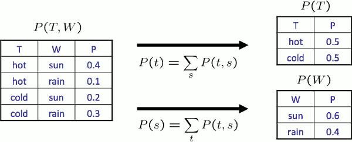


<h2 id="9b6ebd3c632df1c60267481ca65ec2f5"></h2>


## Conditional Probabilities

- A simple relation between joint and conditional probabilities
    - In fact, this is taken as the definition of a conditional probability
- `P(a|b) = P(a,b) / P(b)`


<h2 id="d22ece9f9682b018dfb17860cc5aedd7"></h2>


## Conditional Distribution

- Conditional distributions are probability distributions over some variables given fixed values of others

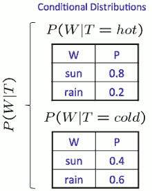

P(W|T)  is a set of tables -- one table for each value T can take on and then for a fixed value of T you get a conditional distribution table.

Each of these individual tables sums to 1. 

<h2 id="1a18f3ea65669c3a4a2a7eff540de62e"></h2>


## Normalization Trick

It's a way to go from joint distributions to conditional distributions and has slightly quicker way and also a little more mechanical. 

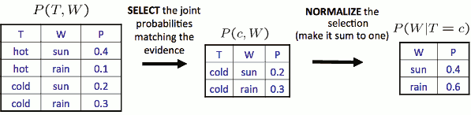

To Normalize,  all entries sum to 1.  Think about this like operations on a big database table,  you select rows, you normalize what's left.


<h2 id="e806b0d3eeb72e7431bb8cdb823c4517"></h2>


## Probabilistic Inference

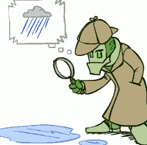

- Probabilistic inference: compute a desired probability from other known probabilities (e.g. conditional from joint)
- We generally compute conditional probabilities
    - P(on time | no reported accidents) = 0.90
    - These represent the agent’s beliefs given the evidence
- Probabilities change with new evidence:
    - P(on time | no accidents, 5 a.m.) = 0.95
    - P(on time | no accidents, 5 a.m., raining) = 0.80
    - **Observing new evidence causes beliefs to be updated**
        - That's an important part of rational intelligence.


---

<h2 id="314fa4378b3b188832e3f68fd46ac015"></h2>


## Inference by Enumeration

The general case for computing a quantity from a joint distribution is an algorithm called inference by emuneration.

It's an exponentially slow thing operating on an exponential large table. In general this is not going to be tractable.

But the algorithms that we are going to use that are often going to be more tractable.


- General case:
    - All variables: X₁,X₂,...,X<sub>n</sub>
        - Evidence variables: E₁,...,E<sub>k</sub> = e₁,...,e<sub>k</sub>
        - Query<sup>\*</sup> variable: Q
        - Hidden variables: H₁, ..., Hᵣ
    - We Want :
        P(Q | e₁,...,e<sub>k</sub> )

- Step 1: Select the entries consistent with the evidence 
    - 联合概率表中，找出 和 evidence 相符的 entry
- Step 2: Sum out H to get joint of Query and evidence
- Step 3: Normalize


That's it. Take your whole distribution, select what's consistent with your evidence, collapse out variables you don't care about. We will be left with only one demension left which is your query, and you normalize. 

What makes this hard is, often, you don't actually have the joint distribution to begin with.

--- 

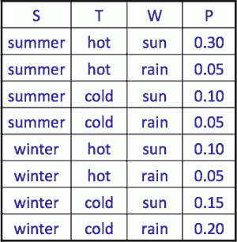

- P(W)
    - Q=W, E=∅ , H={S,T}

---

P(W) | / 
--- | ---
s   | 0.65
r   | 0.35

---


- P(W|winter)
    - Q=W, E=S , H=T

---

P(W \| winter) | /
--- | ---
s   |  0.25 / 0.5 = 0.5 
r   |  0.25 / 0.5 = 0.5

--- 

- P(W| winter ,hot)    
    - Q=W , E=winter,hot, H=∅

---

P(W \| winter ,hot) | /
--- | ---
s   |  0.10/0.15 = 2/3
r   |  o.05/0.15 = 1/3

---

- Obvious problems:
    - Worst-case time complexity O(dⁿ) 
    - Space complexity O(dⁿ) to store the joint distribution

---


<h2 id="47d0d61476b8bc9f946aba690e7193cf"></h2>


## The Product Rule

- Sometimes have conditional distributions but want the joint
- P(y) P(x|y) = P(x,y)


<h2 id="62568a512f5b51ee525d33114a235b26"></h2>


## The Chain Rule

- More generally, can always write any joint distribution as an incremental product of conditional distributions

```
P(x₁,x₂,x₃) = P(x₁)P(x₂|x₁)P(x₃|x₁,x₂)
```

P(x₁,...,x<sub>n</sub>) = ∏ᵢ P(xᵢ|x₁,...,xᵢ₋₁)


That means you have `n!` ways using the chain rule!. 


<h2 id="0a5416d1f7924e7448621d5634cddd61"></h2>


## Bayes' Rule

- Two ways to factor a joint distribution over two variables:
    - P(x,y) = P(x|y)P(y) = P(y|x)P(x)
- Dividing 
    - 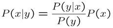
    - gives you the other conditional.
- Why is this at all helpful?
     - build one conditional from its reverse
     - Often one conditional is tricky but the other one is simple
     - Foundation of many systems we’ll see later (e.g. ASR, MT)
- In the running for most important AI equation!

- Approximate Bayesian Computation
    - ?? 

<h2 id="534db09beb168ffccbe6a4f375c4c83d"></h2>


### Inference with Bayes' Rule

It's often easier somehow elicit the conditional distribution P(effect|cause) , rather than the other way around. 

It's could be a ... sensor of center position and that sense might not be prefectly accurate. But you would do before you just need a chance to check. Well if I don't worry about where the sensor measuring a map and how much noise during that process. That's what you're correct gradual you're building this conditional P(effect|cause).

For diseases it might be that you can build statistic : when  we know a patient has certain disease -- let's say meningitis -- , how often do they have a stiff nect. That's the distribution you can build. You just look at all the people with meningitis and then having our conditional distribution. 

--- Example givens ---

Let's say when a person  have stiff neck , what's the probability he have meningitis is ?  

This is an application of bayes' rule.  One thing you'll notice that when you apply bayes' rule , usually often the thing at the bottom , P(+s), is not given to you implicitly. But you can easily compute it using total probability model.   

So Bayes' rule can help us make dicisions:  should this person see a doctor or not ?

- M: meningitis, S: stiff neck
- 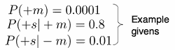
- P(+m|+s) = P(+s|+m)P(+m) / P(+s) = P(+s|+m)P(+m) / ( P(+s|+m)P(+m) + P(+s|-m)P(-m) ) = 0.8x0.0001 / (0.8x0.0001+0.01x0.999)

--- why ? ---

Because the cost of undiagnosed meningitis is really high. 


<h2 id="60e78d88608536cbe1771c99e9f822ca"></h2>


### Quiz: Bayes's Rule 

- given:
    - 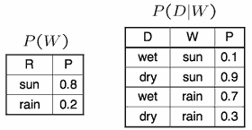
- What is P(W | dry) ? 


P( sun | dry  )  = (0.9\*0.8) / (0.9\*0.8 + 0.3\*0.2) 

P( rain | dry  ) = 1-P(sun|dry) 

---

<h2 id="993bd13d7ce69f119a65be6a3d92b3c0"></h2>


## Ghostbusters, Revisited 

- Let’s say we have two distributions:
    - **Prior distribution** over ghost location: P(G)
        - Let’s say this is uniform
        - 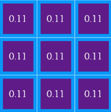
    - Sensor reading model: P(R | G)
        - Given: we know what our sensors do
        - R = reading color measured at (1,1)
        - E.g. P(R = yellow | G=(1,1)) = 0.1
- We can calculate the **posterior distribution** P(G|r) over ghost locations given a reading using Bayes’ rule:
    - P( g|r) ∝<sub>g</sub> P(r|g)P(g) 
        - ∝ : proportional to 
        - ∝<sub>g</sub> means that if compute the thing on right for each value of *g* and normalize, I'll get the things on the left. 
        - 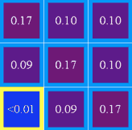


<h2 id="a64838254ea118409679a4e28005fefb"></h2>


## Independcence

- Two variables are independent `X⊥Y`  in a joint distribution if:
    - P(X,Y) = P(X)P(Y)
    - ∀<sub>x,y</sub> P(x,y) = P(x)P(y)
    - Says the joint distribution factors into a product of two simple ones
    - Usually variables aren’t independent!
- Can use independence as a modeling assumption
    - Independence can be a simplifying assumption
    - Empirical  joint distributions: at best “close” to independent


<h2 id="0f1513d04ac32269de73d0f17465488e"></h2>


## Conditional Independence 

You go to the dentist. You might have a toothache or not, you might have a cavity or not.

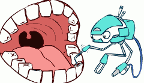

- P(Toothache, Cavity, Catch)
- If I have a cavity, the probability that the probe catches in it doesn't depend on whether I have a toothache:
    - P(+catch | +toothache, +cavity) = P(+catch | +cavity)
- The same independence holds if I don’t have a cavity:
    - P(+catch | +toothache, -cavity) = P(+catch| -cavity)
- Catch is conditionally independent of Toothache given Cavity:
    - P(Catch | Toothache, Cavity) = P(Catch | Cavity)
- Equivalent statements:
    - P(Toothache | Catch , Cavity) = P(Toothache | Cavity)
    - P(Toothache, Catch | Cavity) = P(Toothache | Cavity) P(Catch | Cavity)
    - One can be derived from the other easily
 
---

- Unconditional (absolute) independence very rare (why?)
- Conditional independence is our most basic and robust form of knowledge about uncertain environments.
- X is conditionally independent of Y given Z -- X ⊥ Y | Z 
    - if and only if:
        - ∀<sub>x,y,z</sub> : P(x,y | z) = P(x|z)P(y|z)
    - or, equivalently, if and only if:
        - ∀<sub>x,y,z</sub> : P(x | z,y) = P(x|z)
    - 当z发生时，x发生与否与y发生与否 无关


---

if X ⊥ Z | Y :

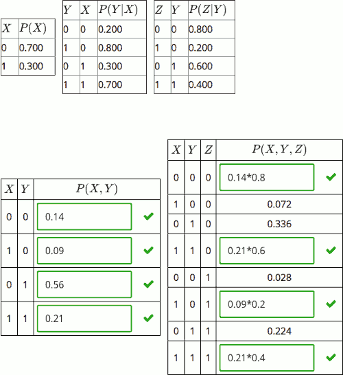


--- 

Traffic / Umbrella / Raining

What is a reasonable condition assumption in this scenario?  

There could be rain or not . The rain could result in more or less traffic. And rain could result in whether or not somebody carries an umbrella. Now if we know wheter it's raning or not , then it telling us that robot carrying  an umbrella is independent whether there will be traffic or not.

T ⊥ U | R 

---


Fire / Smoke / Alarm

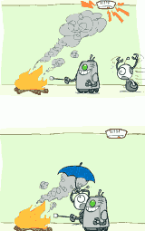

A ⊥ S|F  is not true

A ⊥ F|S  is true


 


