...menustart

 - [Reinforcement Learning I](#222b7b1e6c2303acdbfb4c0dbc31aeb8)
     - [Reinforcement Learning](#44f8995701f5e6cc074e161e0e2f6f24)
     - [Offline (MDPs) vs. Online (RL)](#fa7a57352e7766a41e16ad0c7512f002)
     - [Model-Based Learning](#59625ed88ee3303c9d5bbb05dcd878d1)
         - [Example : Model-Based Learning](#649cab67d1a5faba80f08355ba3f468b)
         - [Example: Expected Age](#ee455b40b88c7bf5b65e5d7b95ebaddc)
     - [Model-Free Learning](#873e73c28eb2e383f892a21d8ff49827)
     - [Passive Reinforcement Learning](#dd0e9af361861e9d611430c8132e7d5d)
     - [Direct Evaluation](#6be4a86e5c5f149ec4fe321811c28f03)
         - [Example: Direct Evaluation](#539ea74ae630f5a093e0d00dd1d6d4c3)
     - [Problems with Direct Evaluation](#47acc2a68b2bdf55855a781553d71aa6)
     - [Why Not Use Policy Evaluation ?](#09c2a431928cce9d30f7b080b8520765)
     - [Sample-Based Policy Evaluation ?](#1249deda865401b3c63bbe67c870bdd6)
     - [Temporal Difference Learning](#feec14513956127a8ae7c515e76e1928)
     - [Exponential Moving Average](#f014b2f80d6cee4d42ed6c19b0fdaadb)
     - [Problems with TD Value Learning](#1f7e6611a83a4f6ff38b6ad2c39e9d76)
     - [Active Reinforcement Learning](#4257de889e9b4c2ff394f77e8c8f2a3d)
     - [Detour: Q-Value Iteration](#9c44f6960e40910e0ab9dd050471404e)
     - [Q-Learning](#e4d17333d58040b1db710abe36cd5aec)
     - [Q-Learning Properties](#f87765bc4a6754139d81d47c5c59fc65)
 - [Reinforcement Learning II](#03bcb6b7c0cf2da8df829ce2604b1487)
     - [Example of RL :  Flappy Bird](#f9a4dc6ca04dd7f381391682fe726a9d)
     - [The Story So Far: MDPs and RL](#29c79992d5caf68d44b3fb65e9b012fd)
     - [Model-free (temporal difference) learning](#915129bb469e127e787304e5d49bb4d7)
     - [Exploration vs. Exploitation](#6887d347f473c82f866b53ab67baeee7)
     - [How To Explore ?](#7f41348c29c7350b667f261729b08433)
     - [Exploration Functions](#2ba1d8903e326a683ab1fb8eee1ff2cf)
     - [Regret](#3141af4744f17a254e58c913ae90281e)
     - [Approximate Q-Learning](#668619154180bf7f1109c15ddd7bb574)
         - [Generalizeing Across States](#38a0a5072b333125a17507e211474044)
         - [Example: Pacman](#1901b8793773f8b3217bebefb14159e4)
         - [Feature-Based Representations](#0b5d3ca99a43d01394248c1aa1ef3313)
         - [Linear Value Functions](#57e2e557640ea36670bca3275dc3baef)
         - [Approximate Q-Learning](#668619154180bf7f1109c15ddd7bb574)
         - [Example : Q-Pacman](#9f255bd21e3c3e685bca408fc92e97d4)
         - [Another example](#1a76030ec4ea873977b1ed0668f5f87a)
         - [总结](#25f9c7fa3b50aebe5125112ac1187777)
     - [Q-Learning and Least Squares](#dfd9c3589510f42d75cc643582c741ee)
         - [Optimization: Least Squares *](#7c2917ddb383d4aca5702f57b1bf97a6)
         - [Minimizing Error *](#431c26cfba3b0e63e31187e82c47bdd4)
         - [Overfitting : Why Limiting Capacity Can Help *](#4d834ce4e64c89be3da78e77c76c4357)
     - [Policy Search](#20e0fd886eda9402c6c8c3dd18b4bb87)
     - [Conclusion](#6f8b794f3246b0c1e1780bb4d4d5dc53)
 - [More About Reinforcement Learning](#96bbd2b31616de4e05850fa5d1d2da71)
     - [Q-Learning 的问题](#39e455faa2cee078107349ed5a79c485)
     - [Deep Q Learning](#61f0ce8542a3f21f795b45c4c133c04c)
     - [Policy Gradient](#d4680878cbefd1ce084325dd933e82f9)
     - [Deep Deterministic Policy Gradient](#60ca1673615c7ff54bc9af8925335b66)
 - [Policy Gradients](#6c11e2dd65ad60a6dd6cf3a2be08fa0c)
     - [和以往的强化学习方法不同](#241bce13578cf2fc98c72f432c5bc204)
     - [更新不同之处](#1a843b1039c85dd724a126708a375915)
     - [具体更新步骤](#edc520f80b6440121e2920f7f2caf86b)
 - [Q Learning  VS. Policy Gradient](#60e65bfe1069d9e782077a65bdd16a2a)

...menuend


<h2 id="222b7b1e6c2303acdbfb4c0dbc31aeb8"></h2>


# Reinforcement Learning I

The basic idea is you have an agent who's acting as always. The agent has actions available to it and choose an action. The environment then does what it always does which is it resolves in some way that's not entirely determined by the action. 

When the action is resolved what the agent receive back is 2 things: one is the reward , the other things is a percept -- we get a state back in the simplest formulation.

For now we take an action which we essentially submit to the environment by doing it and the environment returns to us a state which is the result and a reward which we want to maximize.   

We want to act ot maximize our rewards but we have to learn to do that , because in this setting we won't know what actions will produce rewards until we try them. 

Because we're actually trying things in the environment ,all of the learning  all of the ways we have available to us  to make decision, are mediated by what we experience -- which are samples of outcomes.  

When you take an action you see what happens but you don't see everything that might have happended.  


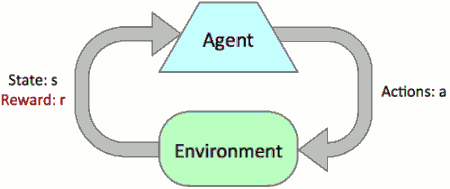


 - Basic idea:
    - Receive feedback in the form of ***rewards***
    - Agent’s utility is defined by the reward function
    - Must (learn to) act so as to ***maximize expected rewards***
    - All learning is based on observed samples of outcomes!
 

    


<h2 id="44f8995701f5e6cc074e161e0e2f6f24"></h2>


## Reinforcement Learning

We don't know the transition function , we don't know the rewards , that is even though based on my state in my action there's certain set of outcomes with a certain probability distribution , I don't know which probability and distribution it is. The only way we really know  what our actions do and where the rewards come from , is to try things out and then learn from our samples that we experience. 

Of course because we're trying things out from a state of partial information , we're gonna make some mistakes and so there is always going to be this process of trying things out not all of which work optimally. 

For the race car example -- you still know whether you'er cool , warmer, overheated, and you still know that you can move faster or slow. 

What you don't know is what fast and slow do. So far all you know fast is the best idea ever or slow is the best idea ever.  You try some things maybe you end up going too slow or maybe you overheat. And you have to try things again and slowly learn what these actions do from each state. 

 - Still assume a Markov decision process (MDP):
    - A set of states s ∈ S
    - A set of actions (per state) A
    - A model T(s,a,s’)
    - A reward function R(s,a,s’)
 - Still looking for a policy π(s)
 - New twist: ***don’t know T or R***
    - I.e. we don’t know which states are good or what the actions do
    - Must actually try actions and states out to learn
    

<h2 id="fa7a57352e7766a41e16ad0c7512f002"></h2>


## Offline (MDPs) vs. Online (RL)

 - Offline Solution
    - Offline solution is when you know what your actions will do and in computation in simulation in your head you think about consequences , you realize the jumping into the pit is a bad idea because you know it has negative reward. so you never actually do it. 
    - 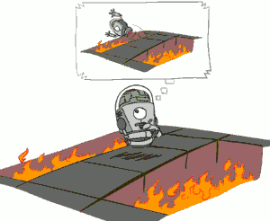
 - Online Learning
    - When you do online learning , you have to actually jump into the pit before you know it is bad. you might imagine that over time this increases the cost of the robots. 
    - 


<h2 id="59625ed88ee3303c9d5bbb05dcd878d1"></h2>


## Model-Based Learning

The question is how are we going to be able to learn how to act when we don't know what the actions do or what rewards will get. 

You might think we can just reduce this to what we had before -- we can somehow still use value iteration and expectimax. That's true. What we're gonna talk about now is model-based learning. 

In model-based learning we reduce the reinforcement learning problem to the previous case of a know MDP. 

So how do we do that ? 

When we try to build a model we try to figure out what the transitions and rewards do , and then pretend that's the truth. 
 
 - Model-based Idea:
    - Learn an approximate model based on experiences
    - Solve for values as if the learned model were correct


So first step is to learn some MDP that we can use to run things like value iteraction. How can we do that ?  We're going to at times find youself in certain state *s* and take certain action *a* -- let's not worry for now about how we decide what action to take. Whenever we're in state *s* and we take action *a* , various things happen. So we end up with various s' outcomes.

Overtime we count them up -- some of them happen more and some of them happen less. When we take those counts and normalize them we get probabilities. That is our estimate of the transition function for (s,a).  We do that for all (state , action)  pairs. In addition we discover the rewards that are associated with (s,a) and s' whenever we experience that transition.  

So we're going to act for a while , we're gonna accumulate counts of various things , we're gonna turn them into probabilities. Once that's all done we have a transition function T and a rewards function R. They're probably not correct but they are structurally what we need to run things like value iteration. So we learned a MDP. And then we solve it.

 - Step 1: Learn empirical MDP model
    - Count outcomes s' for each s, a
    - Normalize to give an estimate of T̂(s,a,s')
    - Discover each  R̂(s,a,s') when we experience (s, a, s')
 - Step 2: Solve the learned MDP
    - For example, use value iteration, as before


Now there are a lot of small points here that are very important like how do you know how to act , how do you know how many counts you need , how do you know how close you're gonna be. We're not going to get very much into those details now , we'll come back to the idea of how to learn a good model. 

<h2 id="649cab67d1a5faba80f08355ba3f468b"></h2>


### Example : Model-Based Learning 

 - Input Policy π , Assume: λ = 1
    - ![][1]
 - Observed Episodes (Training) , and  Learned Model
    - ![][2]
  

Let's say we're in a grid world , and somebody gives us this policy π and so we're going to be following this policy. I'm trying to find out how we know how to act. 

We're going to look at this policy and say 'alright we're going to do this'. We image our γ is 1 so there is no discount to make this example simple. and we have some experiences. 


4 times playing this game

for example in episode 1, we started B , we go east to C , we go east to D, and we take exit action we transition to the terminal state where the game is over , and we receive a big reward +10. In this particular case you should get a -1 living reward and +10 good exit reward. 

So those 4 episode is what we've got to work with. 

In a model-based setting what we do with all of this experience which is not everythings that could happen -- it's just what we personally have seen. What we do with this experience as we try to figure out what the transitions must be. 

So we think alright I've been in B, I've taken the action EAST , and what's happended ? So fa a 100 percent of time we've ended up C. So I'll write down. To the best of my knowledge right now -- and will be improved on future -- let's just say that east EAST from B has a 100% chance of resulting in C. That's a transition function. 

Similarly EAST from C we know that 3/4 of the time it actually went EAST into D but 1/4 time it went NORTH to A. Are those the right probabilities? Almost surely not. But they are reasonable starting point for this simplistic version. 

So what comes out ? We've learned now a model where we have transitions and reward functions. 

see  T, R in the picture.

Of course we've only learned about the things we've actually. But let's set that aside until later. 

Now we have a MDP,  maybe a wrong  MDP  , but we still know how to solve it.

---

<h2 id="ee455b40b88c7bf5b65e5d7b95ebaddc"></h2>


### Example: Expected Age 

My goal was to compute the average age of people in cs188 class. So I want to compute the expected age -- the weighted average. How would I do that. We all know how to compute expectations. For example if I know the probability distribution over ages -- how many people are each age -- then I would have a straight forward way of computing this weighted average. The way I do that is I say "well , the expectation of this random variable A , I sum over all of the possible ages weighted by its probability". Easy ! In fact this kind of expectation  is all really going on in these MDPs. 

Now what happens if we don't know the distribution. We're forced to rely on samples. We could take a few samples ,we could take a lot of samples. Obviously the more samples the more accurate these things will be.  We're going to collect samples instead of the probability distribution. 

The model-based view is  I don't know the distribution over ages but I've got samples. What do I do with the samples?  The model-based view is I use the samples to reconstruct an approximation of what I didn't know -- the empirical distrubtion over ages. Now I reduced it to the case of the known distribution and I compute the expectations. 

Why does this model-based thing work ? The reason it works is because eventually you learn the right model. 

There's something else you can do with the samples rather than trying to reconstruct the probability distribution. What could we do? 

We could do what is called "model-free" approaches here. We average the samples directly giving each sample equal weight. When I do this model-free stuff the averages are unweighted. Why does that work ? Because samples appear with the right frequencies -- ages are more frequent show up in more samples. 

This is the high level view of model-based vs model-free. In model-based you learn the probability distributions and then you reduce it the case of solving a known MDP. In model-free case we just take our sample as they come and average them together. 

 - Goal: Compute expected age of cs188 students
    - Known P(A) : E[A] =  ∑ₐ P(a)·a
    - Unknown P(A): instead collect samples [a₁, a₂, … a<sub>n</sub>]
        - Model Based
            - P̂(a) = num(a)/N
            - E[A] ≈  ∑ₐ P̂(a)·a  
        - Model Free
            - E[A] ≈ 1/N·∑ᵢ aᵢ 

<h2 id="873e73c28eb2e383f892a21d8ff49827"></h2>


## Model-Free Learning

In model-free learning we don't construct a model of the transition function. What we do is we take actions , and every time we take an action we compare what we thought was going to happen to what actually did happen. Whenever something is better or worse than what we expected we adjust our values up and down. 

So what we track in a model-free approach is the values of interest themselves , not the transition functins and the rewards.  


<h2 id="dd0e9af361861e9d611430c8132e7d5d"></h2>


## Passive Reinforcement Learning 

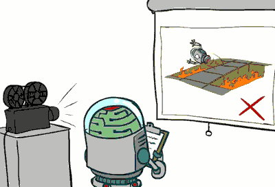


The idea is things are happening in the real world , some agent is taking actions and getting specific outcomes that are partially determined by chance. You have to learn from there samples you observe but you don't control the actions. Someone else is choosing the actions and you're just sitting there with your notebook trying to figure out based on the policy that is being followed what are the values of all the states. 

You can think about this here is this agent it's watching real things happen. It can't rewind and try something else. The things are not in the agent's control and it is just monitoring. 

So the task we're going to think about in the passive case is this simplified task -- we're not going to try to figure out how to act optimally , we're going to try to figure out essentially exactly **what policy evaluation did**. 

The input is a fixed policy. In previous example the agent is just watching some other execute this policy. but in any case it's a fixed policy. The agent does no know the transitions and the rewards. **Our goal is to learn the state values**. Of course because we're watching this policy π execute we're going to learn the values under the policy π. If π is really bad we're probably going to learn values that are also really bad. 

This is policy evaluation. We're watching or executing a fixed policy and we're trying to figure out how good each state is under that policy execution. In this case the learner is along for the ride. It doesn't get to actually control things even if it's already learned they're bad.  We have no choice about the actions , we're just executing the policy. It's still not offline planning. 

 - Simplified task: policy evaluation
    - Input: a fixed policy π(s)
    - You don’t know the transitions T(s,a,s’)
    - You don’t know the rewards R(s,a,s’)
    - ***Goal: learn the state values***
 - In this case:
    - Learner is “along for the ride”
    - No choice about what actions to take
    - Just execute the policy and learn from experience
    - This is NOT offline planning!  You actually take actions in the world.


<h2 id="6be4a86e5c5f149ec4fe321811c28f03"></h2>


## Direct Evaluation

The simplest way you could imagine doing model-free is what's called **direct evaluation**.

The idea of direct evaluation is super simple. All we're gonna do is watch action unfold. We're going to act according to π and every time we visit a state we're going to write down what the sum of discounted rewards the utility turned out to be in the end. In acting we will have been in many states , and for each one we might have been there many times , we're just going to record what happend, not in one step but all the way to the end. When we average those samples together , that will be an average achieved score for that state --that is the value. If we do it long enough we'll get the right answer. It's called direct evaluation. 

 - Goal: Compute values for each state under π
 - Idea: Average together observed sample values
    - Act according to π
    - Every time you visit a state, write down what the sum of discounted rewards turned out to be
    - Average those samples
 - This is called direct evaluation
  

<h2 id="539ea74ae630f5a093e0d00dd1d6d4c3"></h2>


### Example: Direct Evaluation 

 ![][1]

 ![][2]


Remember: this is passive reinforcement learning. We're only doing policy evaluation. 

We're going to get traning episodes again and we're going to execute them one by one. 

Episode 1:

I've been B. I know something about B. What utility did I receive from B ?  Not -1 , that was the instantaneous one-step reward. According to π and according to this episode , from B I received a total of +8. 

Episode 2:  same as 1

Episode 3: +8 from E 

Episode 4: -12 from E


---

What we learned here?  Will this process work in the end ?  Sure. We're going to execute over and over and over from every state will eventually learn that some of states are good and some of the states are bad. Eventually they'll all be right. Because each state will eventually have a bunch of executions and the averages are work out in the end. 

But at least for now we've learned something that's slightly insane. Why is that ?  What do we know E from our experience? What happens when you follow this policy from E ? You go to C EVERY TIME. What score you from E ? -2.  What score you get from C ? 4.  Umm, something doesn't compute here. How can E be bad but the state it leads to every time be reasonably good ? Similarly B looks really good , but it always leads to C which looks kind of mediocre. 

So somehow even though this is going to work in the limit , we've thrown out a huge amount of information about how the states are connected together. 

<h2 id="47acc2a68b2bdf55855a781553d71aa6"></h2>


## Problems with Direct Evaluation 

 - What’s good about direct evaluation?
    - It’s easy to understand
    - It doesn’t require any knowledge of T, R
    - It eventually computes the correct average values, using just sample transitions

They are not optimal values , they are values for the policy being executed ,  it does the right thing in the end.

 - What bad about it?
    - It wastes information about state connections
    - Each state must be learned separately
    - So, it takes a long time to learn


We waste information about how the states connect up to each other. If we know the state is good and we know another state leads to it , that state should be good as well. Because we're learning each state separately , we're failing to exploit information across episodes. 

<h2 id="09c2a431928cce9d30f7b080b8520765"></h2>


## Why Not Use Policy Evaluation ?

Policy Evaluation exploited the connections between the states , Unfortunately, we need T and R to do it!

We already know how to take averages without knowing the weights. We look at samples of the things we're average and we add up those samples with equal weight.  How can we turn that into an algorithm ?

 - Key question: how can we do this update to V without knowing T and R?
    - In other words, how to we take a weighted average without knowing the weights ?

<h2 id="1249deda865401b3c63bbe67c870bdd6"></h2>


## Sample-Based Policy Evaluation ?

 - We want to improve our estimate of V by computing these averages:
    - 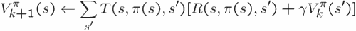
 - Idea: Take samples of outcomes s’ (by doing the action!) and average
    - maybe this approach ...
    - 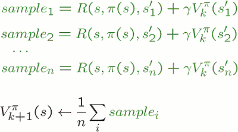

What's wrong ?

You can't get your second sample until you're back in state *s*. How do you get back to *s* ? You don't know. You don't know what's going on. This is reinforcement learning you don't even know what your actions do. How can you get back to state *s* ? You can not do this. Maybe someday you'll be *s* again but you can't just keep executing the same action from same state. Maybe if you could rewind time you could do it , but you can not. 

So what do we need to do ? We need somehow be satisfied with the one-sample we get because once we get that sample we're often some other state and who knows if we'll ever be back to state *s*. 

So that a big idea of --

<h2 id="feec14513956127a8ae7c515e76e1928"></h2>


## Temporal Difference Learning 

 - Big idea: learn from every experience!
    - Update V(s) each time we experience a transition (s, a, s’, r)
    - 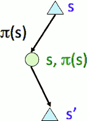
    - Likely outcomes s’ will contribute updates more often

It is a little tricky because we only get one sample of what might have happended , so we need somehow make sure that over time we accumulate the right averages. But right now we've got one sample we've got ot incorporate it and move on. 

The reason this is called temporal difference learning is because we compare our current estimate of a value with what we actually see. 

We've doing temporal difference learning right now of values. So the policy is still going to be fixed. We're still evaluating this policy. We're still not worrying about how to choose actions that will come later. The idea is we're going to move the values towards whatever we actually see happen. It's gonna be some kind of running average but we got to be careful. 

So here's the idea. We imagine we were at state s . Before we took any action we had some estimate of how good it was that encapsulates all of our knowledge to date. So we've got some estimate V(s) -- it's not correct , it's an approximation.  

From *s* we take an action -- in this case we do what π tells us -- and we land in some particular sample outcomes s'. So we get one of the many possible outcomes .   We get the reward associated with it -- R, and then we get put in a state s' for which we have an estimated future utility from s'. 

So on one hand we think we're going to get V(s) that's what our past experience has told us , on the other hand this particular time it looks like we're on track to get this sample. It looks like we're on track to get the instantaneous reward  + V<sup>π</sup>(s'). So we've got our old experiences all summarized in our value but then we have this new experience we need to incorporate which includes a real-world reward R and then an approximation that's been discoutned into the future.  

So how do we take the average of one thing ?

 - Temporal difference learning of values
    - Policy still fixed, still doing evaluation!
    - Move values toward value of whatever successor occurs: running average
    - 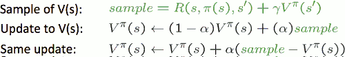

One thing we do is we keep around our old value with some weight and we average in the new thing with some weight. So we interpolate them. There's some value α called learning rate. α is usually small , like 0.1 or something like that , maybe even smaller. Every time we get a sample of the new value which is a reward + discounted future , we average it in by interpolating it with the old value esitmate . 

Why do we use α ? Why don't we keep track of every experience we've ever had ?  If we really really want an even average that would be a way to achieve it. It turns out this is not only easier but it's in fact better. 


this update it says take your value and add to it α times the difference between what you thought would happen and what actually did. You can think of that as an error. And this says whenever you see an error in your estimates adjust your estimate in the direction of the error by some small step size α. 


Demo: a = 0.5 , no time step reward.

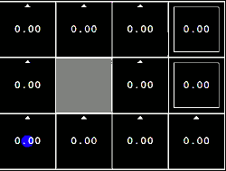

We are about to do temporal different learning of values. That means we keep a big table of values and they also offer 0 because we have no idea what's going on in this grid. 

The blue dot represens the agent. I'm going to issue commands and the agent will then watch what happends.

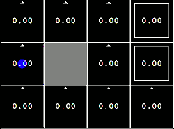
 
I went north. In this version the living reward set to 0 so that we can see how the exit rewards propagate. In this case no update happened because I thought that I was going to receive a total utility of 0 from the start state. I in fact received 0 and I landed in the state where I thought there was 0 left to come. 

So I thought I was going to get a 0 . I do seem to be on track to get 0 , nothing to do. 


Nothing interesting happens util I receive a non-zero reward which I receive not when I enter this right-top square but when I exit it. Right now I think I'm going to get a 0 total future score.  When I tack the exit action I will in fact receive a +1 and then I'll be forced to reconcile the +1 I got with the 0 I thought I was going to get and right now α was set to 0.5 and so the average value will now be 0.5 , and I update my array. 

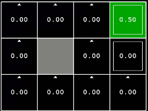

I play again. What happens when I move into the square left to top-right square ? 

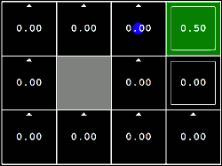

From here I'm about to move east I think I'm going to get a total score of 0. I go east. What did I receive that time step ? 0 . But I landed in the state that looks right now to be worth 0.5. On one hand I thought my total would be 0 , on the other hand this experience says I'm going to get 0 + 0.5 . I average them and I get 0.25.  That's going to continue happening as I exit here that 0.5 approaches 1 because I'm gonna get 1 every time . I is now (0.5+1) /2 = 0.75.

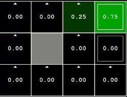

Play again, the values would be  (0+0.25)/2 = 0.13 ,  ( 0.25 + 0.75 ) /2 = 0.5 , ( 0.75+1)/2 = 0.88.

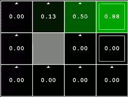

Every time we enter a non-zero square from a 0-value square, notice that we learn about the square we leave because when I leave this square I'm going to learn that my estimate of 0 isn't the best I can do. I can do better.  

So you learn about **the state you leave , not the state you land in**. 

I'm learning the values of these squares and the values under the policy that I'm executing. What would happen if I went the other way around ? ( move right from 0.13)

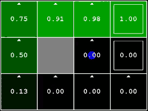

When I get to the square down to 0.98 and I go north , even I've never been in the state before and this is my first experience with it as soon as I see that going north lands me at 0.98 , I know that going north is pretty good and so I have an update (0 -> 0.49). That's exactly the effect the direct evaluation didn't have. 

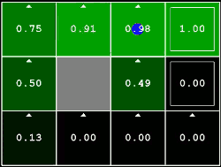

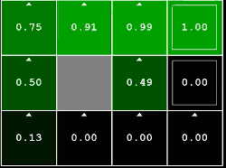

<h2 id="f014b2f80d6cee4d42ed6c19b0fdaadb"></h2>


## Exponential Moving Average 

 - Exponential moving average 
    - The running interpolation update:
        - 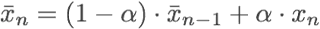
    - Makes recent samples more important:
        - 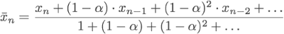
    - Forgets about the past (distant past values were wrong anyway)
 - Decreasing learning rate (alpha) can give converging averages


<h2 id="1f7e6611a83a4f6ff38b6ad2c39e9d76"></h2>


## Problems with TD Value Learning 

TD value learning is not going to work for the general problem of active reinforcement learning where we want to not only evaluate but also choose actions . 

Why is that? Well let's imagine we run this thing and we've got this big table of state values. For every state I can tell you according the policy we've been running it's worth 7.0 in total and so on. The problem is if we want to turn those values into a policy and in particular will want to turn them into a new policy which is hopefully better than the old policy. Now we're sunk. We know how to produce a policy from values but it involves one step of expectimax. We would say the policy is whatever action achieved the largest Q value for that state. But of course those Q values involve an average of their outcomes and we can't do that because again we don't have T & R. 

The idea here is that if we want to be able to do action selection as well we sould be learning not just the values as we have been but the Q values. In fact this is why we even have a notion of Q values because they're critical for choosing action as in reinforcement learning. 

This idea of learning Q values make action selection model-free as well because we just look at the Q values and choose whichever one is best. 

 - TD value leaning is a model-free way to do policy evaluation, mimicking Bellman updates with running sample averages
 - However, if we want to turn values into a (new) policy, we’re sunk:
 - Idea: learn Q-values, not values
 - Makes action selection model-free too!


<h2 id="4257de889e9b4c2ff394f77e8c8f2a3d"></h2>


## Active Reinforcement Learning 

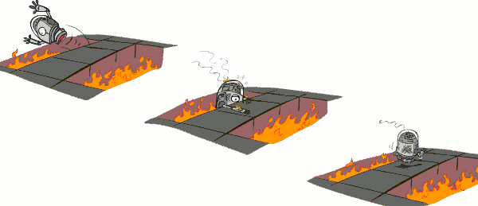

You have to try things. Sometimes when you try something bad you get a negative reward and you keep on going. You probably won't try that thing again but you paid the price. 

In full reinforcement learning we would like to be able to compute optimal policies like value iteration did. Of course we're gonna make mistakes along the way that's going to a notion ,that we'll talk about later, called regret.  But we'd like to eventually learn the optimal thing.   

---


 - Full reinforcement learning: optimal policies (like value iteration)
    - You don’t know the transitions T(s,a,s’)
    - You don’t know the rewards R(s,a,s’)
    - You choose the actions now
    - ***Goal: learn the optimal policy / values***
 - In this case:
    - Learner makes choices!
    - Fundamental tradeoff:  exploitation vs. exploration 
        - of doing things that are known to be pretty good  versus learning about things like what happens when I jump off the cliff. 
    - This is NOT offline planning!  You actually take actions in the world and find out what happens…


<h2 id="9c44f6960e40910e0ab9dd050471404e"></h2>


## Detour: Q-Value Iteration

 - Value iteration: find successive (depth-limited) values
    - Start with V₀(s) = 0, which we know is right
    - Given V<sub>k</sub>, calculate the depth k+1 values for all states:
        - 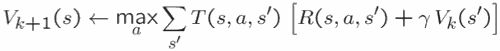

We can't do this update with samples because it's not an average but Max. And the only thing we can do with samples is computing averages of things. 

 - But Q-values are more useful, so compute them instead
    - Start with Q₀(s,a) = 0, which we know is right
    - Given Q<sub>k</sub>, calculate the depth k+1 q-values for all q-states:
        - ![][3]
        - For the part of discount of future value. I might be tempted to write (s') here , but I'm not learning values , I'm learning Q values. So I need to do 1 more layer. What is the value ? The value of the state is just the maximum of all the Q values going out of that states -- I have to maximize over all of the actions that I could take from that state.
        - The max is still there , the average is still there.  But this equation is an average and therefore this equation we can do with samples. 


---

<h2 id="e4d17333d58040b1db710abe36cd5aec"></h2>


## Q-Learning

Q-Learning is the key algorithm that allows us to do a lot of great things with reinforcement learning. 

 - Q-Learning: sample-based Q-value iteration
    - ![][3]

Every time we're in a state *s* , we take some action *a*. When we do that we're going to learning something about how good (s,a) is. So what we're going to maintain a table that looks something like this. 

For every state and every action , it's going to maintain a number which is the q-value approximation. 

We're going to get some sample on the basis of the action we picked , the key learning algorithm doesn't actually care how the action was chosen , it does the same update no matter how it was chosen.   We get a sample -- we were in *s* we choose action *a* -- we are going to learn something about Q of (s,a) -- that is how good is that action from the state.  We landed in s' this time and we received a reward *r* . 

 - Learn Q(s,a) values as you go
    - Receive a sample (s,a,s’,r)
    - Consider your old estimate: ***Q(s,a)***
    - Consider your new sample estimate:
        - 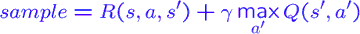
    - Incorporate the new estimate into a running average:
        - 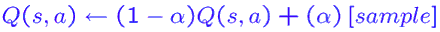


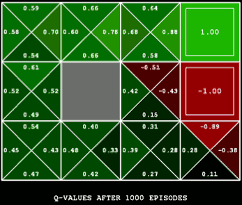


<h2 id="f87765bc4a6754139d81d47c5c59fc65"></h2>


## Q-Learning Properties 

 - Amazing result: Q-learning converges to optimal policy -- even if you’re acting suboptimally!
 - This is called ***off-policy learning***
 - Caveats:
    - You have to explore enough
    - You have to eventually make the learning rate small enough
        - … but not decrease it too quickly
        - 随着时间推移，α is decreased to 0...
    - Basically, in the limit, it doesn’t matter how you select actions (!)
        - as long as you basically try everthing all the time.


---
---


<h2 id="03bcb6b7c0cf2da8df829ce2604b1487"></h2>


# Reinforcement Learning II

<h2 id="f9a4dc6ca04dd7f381391682fe726a9d"></h2>


## Example of RL :  Flappy Bird


 - State space
    - Discretized vertical distance from lower pipe
    - Discretized horizontal distance from next pair of pipes
    - Life: Dead or Living
 - Actions
    - Click
    - Do nothing
 - Rewards
    +1 if Flappy Bird still alive
    -1000 if Flappy Bird is dead
 - 6-7 hours of Q-learning


<h2 id="29c79992d5caf68d44b3fb65e9b012fd"></h2>


## The Story So Far: MDPs and RL

 MDP | Goal |  Technique
---: | --- | ---
Known MDP: Offline Solutioin | Compute V<sup>\*</sup>, Q<sup>\*</sup>, π<sup>\*</sup> | Value/Policy Iteration
  ·    |  Evaluate a fixed policy π | Policy evaluation
Unknown MDP: Model-Based |  Compute V<sup>\*</sup>, Q<sup>\*</sup>, π<sup>\*</sup>  | VI/PI on approx. MDP
  ·    |  Evaluate a fixed policy π | PE on approx. 
Unknown MDP: Model-Free | Compute V<sup>\*</sup>, Q<sup>\*</sup>, π<sup>\*</sup>  | Q-learning
  ·    |  Evaluate a fixed policy π | Value Learning


<h2 id="915129bb469e127e787304e5d49bb4d7"></h2>


## Model-free (temporal difference) learning

 - Experience world through episodes
    - like a stream
    - (s,a,r,s',a',r',s'',a'',r'',s''',... )
 - Update estimates each transition (s,a,r,s')
 - Over time, updates will mimic Bellman updates


<h2 id="6887d347f473c82f866b53ab67baeee7"></h2>


## Exploration vs. Exploitation 

This brings us to one of the most important ideans in RL. That is because you want to do the opimal thing but you don't know what it is yet , you have the inevitable trade-off between exploration where you try things -- which may of course be disastrous -- and exploitation where you do the things which currently appear to be good.

You meet this all the time in your daily life.  Some new restaurant opens and you have a choice. You can go to your favorite place which you know will bring you good rewards or you can try the new thing which is probably bad but may be your favorite restaurant. So inevitably the outcome is you have to try some stuff and that means you have to make some mistakes. 

<h2 id="7f41348c29c7350b667f261729b08433"></h2>


## How To Explore ?

Q-learning did not specify how we select actions. It just required that they have sufficient variety to converge to the optimal policy and q values. Now we're talking about how to select actions in a way that will enable q-learning to its magic. 

 - Several schemes for forcing exploration
    - Simplest: random actions ( ε-greedy)
    - Every time step, flip a coin
    - With (small) probability ε , act randomly
    - With (large) probability 1-ε , act on current policy

 - Problems with random actions?
    - You do eventually explore the space, but keep thrashing around once learning is done
    - One solution: lower ε  over time
    - Another solution: exploration functions ( better way )

Which means we often go to our favorite place but every now and then when the coin comes up random  we try something at random. 

Example: 挖掘机学步   ε = 0.8   

It's lot exploration.  And it's not however a lot of progress. Now with this work q-larning works just fine with lots of random actions, just doesn't necessarily work quickly. 

skipped a 1M steps

Now it actually turns out that this bot has had a lot of experiences since I fast-forward it. Presumably it should have learned something. why is it not making any progress (依旧原地尝试) ?   Well we're forcing it to act randomly 80% of the time. If whenever you walk your left leg , 80% of time you flew out at some random angle , you wouldn't make fast progress. 

What happens if I turn ε down ? Turn ε to 0 --  just let it go. Be optimal .  Well it's not so bad. 

So Q-learning learned the right thing but the exploration was preventing you from doing it. There were a couple issues there. 

One issue is you do eventually explore the space you eventually learn the right thing but you still keep trashing around if you keep ε high. So you have to stop exploring so much random. Eventually you would have to stop doing so exploration and allow your self to exploit this optimal policy you learned. 

Another problem with ε-greedy is that kind of the exploration is unstructured. you try random things whether you need or not even if you know what the all actions do. If you know what all the actions do you shouldn't necessarily be exploring anymore. 

So one solution here is we just lower ε over time , and let the randomness decrease. But there are better ways. One simple one is called **exploration functions**.  

<h2 id="2ba1d8903e326a683ab1fb8eee1ff2cf"></h2>


## Exploration Functions 

 - When to explore?
    - Random actions: explore a fixed amount 
        - the kind of explore uniformly everywhere. Every state has an equal chance of doing an exploration action.  
    - Better idea: explore areas whose badness is not (yet) established, eventually stop exploring

You got food poisoning a couple times and you just stopped. On the other hand when we don't know something and our uncertainty is high it should be a pretty high priority to figure that out right now.  So when the restaurant opens you try it because your uncertainty is high. Once you've tried it a couple times , now you know.

So how can we encode this?  we'd like something that forces us to explore whose badness is not yet established but eventually stopped.  The basic idea here is "in the face of uncertainty you should have optimism".  So fly into those unknown caves and see what's in their optimism. 


---

 - Exploration function
    - Takes a value estimate u and a visit count n, and returns an optimistic utility, e.g. `f(u,n) = u + k/n`
        - Regular Q-Update:  ?
        - Modified Q-Update: 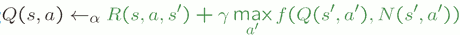 ?
            - for a q-state , number of times we've been there means the number of we've tried that action out.
    - Note: this propagates the “bonus” back to states that lead to unknown states as well!
        - Not only does it tell you that a q-state you haven't tried has higher value , but also it will propagate this bonus back. So you don't just try things that are unknown , you try things that are known to lead to states that are unknown. That's great. 

So we take the utility and we add to it a bonus that decreases as we visit the state more times *n*. 

-- example 挖掘机学步  ε = 0.1  

It's still doing a tiny tiny bit of exploration through randomness. But it's implementing a exploration function. As time goes on the exploration function will contribute less and less. That means even though at the beginning it's trying all kinds of stuff very quickly , it figures out that it actually knows what those actions do and the dominant behavior is now one of the exploitation. It's slightly weird policy but it is moving forward. Unlike the other one which had to run 1M of steps and then I had to turn its exploration off , this one is already moving after a very small number of iterations. 

This brings us the idea **regret**.

--- 

Q: in exploration function, how much is k ?
A: it's hard to know. 

---

 - ***α == 0 :  stop learning*** 
 - ***ε == 0 :  disable exploration***

--- 

使用 带 visit count 的 Exploration function, 可以合理的兼顾 exploration and exploitation.

一些指数函数也可以达到这个效果，比如：

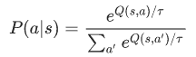

where τ is a temperature parameter that is decreased over time.

和 softmax 有点像。。。

<h2 id="3141af4744f17a254e58c913ae90281e"></h2>


## Regret 

 - Even if you learn the optimal policy, you still make mistakes along the way!

The basic idea of *regret* is even though you learn the optimal policy eventually  , because your transitions and rewards are initially unknown it's inevitable that you will make some mistakes along the way.  So you don't get to be the wise optimal robot without making some mistakes in your youth. 

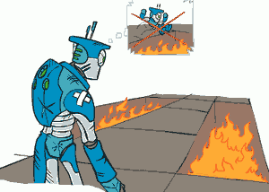

So for example here this robot it's wise it's optimal and it's remembering back to its youth where it jumped into that fire pit , now it knows not to do that and you can think of this as regret. But a certain amount of fire pit jumping is inevitable because you just had no way of knowing whether or not it was a fire pit until you try it. 

 - Regret is a measure of your total mistake cost: 
    - the difference between your (expected) rewards, including youthful suboptimality, and optimal (expected) rewards

There's this idea that there's a total volume of mistakes you made compared to having the optimal policy , we'd like to minimize that. 

We've already seen the q-learning subject to some mild conditions will eventually learn the optimal policy. You're going to be optimal in the end. So really in practice the game is minimizing your regret -- get to that optimal policy while making as few suboptimal in retrospect actions as possible. 

Minimizing regret is more than learning to be optimal. It's more like **optimally learning to be optimal**. 

 
---

<h2 id="668619154180bf7f1109c15ddd7bb574"></h2>


## Approximate Q-Learning

Now we're going to think about the problems of what you do in a game like pac-man where there are so many states that you can't learn about each one.

The basic idea we'er going to have is called approximate q-learning. And boils down to the fact when you learn that ghost is in scary -- for example through one experience. You should transfer that to all other states that similar. 

<h2 id="38a0a5072b333125a17507e211474044"></h2>


### Generalizeing Across States

So we want to be able to generalize across states because there's just so many of them. 

 - Basic Q-Learning keeps a table of all q-values

In basic q-learning -- if you think about the algorithm -- it keeps a table of all of the q-values. That looks something like this: where you have your agent and for every cell of grid world and for every action you have a number that you're storing. That's fine when there aren't too many q states. 

 - In realistic situations, we cannot possibly learn about every single state!
    - Too many states to visit them all in training
    - Too many states to hold the q-tables in memory

There are multiple reasons why we can't learn about every single state. There are too many of them to visit them all in training. You just can't get yourself in every configuration of pac-man. In addition even if you could there's too many states to even hold the q-values in memory. So even if you wanted to do exhaustive q-learning it's not an option.

In general for a game like pac-man , if you had the q tables it would just be this infinite library and that's not going to work. So we want to do is we want to generalize. 


 - Instead, we want to generalize:
    - Learn about some small number of training states from experience
    - Generalize that experience to new, similar situations
    - This is a fundamental idea in machine learning, and we’ll see it over and over again

We'd like to be able to take some small number of training examples -- our experiences -- in some small number of games and generalize them to similar situations. 

This is actually a fundamental idea of machine learning. We'll see it over and over again in this course.  You actually want to be able to generalize not just to save on time and storage but also because it's better -- you're going to learn faster if you don't have to repeat the lessons in every similar state. 

--- 

<h2 id="1901b8793773f8b3217bebefb14159e4"></h2>


### Example: Pacman

 - Let’s say we discover through experience that this state is bad:
    - 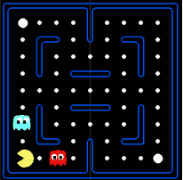
 - In naïve q-learning, we know nothing about this state:
    - 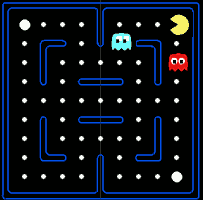
 - Or even this one!
    - 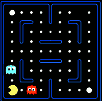
    - It's missing a dot. It's a totally different state as far as q-learning is concerned.  

Something is wrong here if you've got to learn about the ghosts in every configuration of not only ghosts but also dots. 

Q-learn may work in 2x3 pacman board , but it hardly work even in 3x5 pacman board.

---

<h2 id="0b5d3ca99a43d01394248c1aa1ef3313"></h2>


### Feature-Based Representations

So what's the solution ? You actually know the solution because you already implemented in project 2. 

The solution is to take a state , and rather than thinking about it as its own black box whose q-values are special and unlike any other states' q-values INSTEAD we say really boiled down to a small number of properties which we will call features. 


 - Solution: describe a state using a vector of features (properties)
    - Features are functions from states to real numbers (often 0/1) that capture important properties of the state
    - Example features:
        - Distance to closest ghost
        - Distance to closest dot
        - Number of ghosts
        - 1 / (dist to dot)²
        - Is Pacman in a tunnel? (0/1)
        - …… etc.
        - Is it the exact state on this slide?
    - Can also describe a q-state (s, a) with features (e.g. action moves closer to food)

So we describe the state using a vector of features.  Just like we did for evaluation function . So what features ? They take a state and they return a real number. Sometimes it's 0-1 indicating something and sometimes it's a number indicating something.  For example we might have the distance to the closest ghost , or the number of ghost , or 1 / square distance to a dot , or is pacman in a tunnel that might be a 0/1 thing -- you can learn that being in a tunnel is dangerous. 

In project 2, the thing you described with features was a state value. So you computed value for that state by taking your features and doing some weighted linear combination.  

Of course now we're going to have to describe q-states which gives us features like am I moving towards the ghost with this action. 


<h2 id="57e2e557640ea36670bca3275dc3baef"></h2>


### Linear Value Functions 

This gives you linear value functions. 

 - Using a feature representation, we can write a q function (or value function) for any state using a few weights:
    - V(s) = w₁f₁(s) + w₂f₂(s) + ... + w<sub>n</sub>f<sub>n</sub>(s) 
    - Q(s,a) = w₁f₁(s,a) + w₂f₂(s,a) + ... + w<sub>n</sub>f<sub>n</sub>(s,a) 
 - **Advantage**: our experience is summed up in a few powerful numbers
 - **Disadvantage**: states may share features but actually be very different in value!
    - for example if there are 2 ghosts close to you it matters a lot whether they're on either side of you or both on the same side. 

Ok you job is to come up with features that make sure that important differences in value are reflected in differences and features , so that the learning algorithm can do its job. 

<h2 id="668619154180bf7f1109c15ddd7bb574"></h2>


### Approximate Q-Learning

How are we going to do q-learning with these q-functions ? 

The first part of q-learning algorithm doesn't actually care where the q-value came from. It says give me a transition so that I can learn. And you do it. Then you take a difference . I say alright I thought I was going to get Q of (s,a) -- that was my old guess on one hand and on the other hand I now think I'm going to get this reward + my estimate of the value of the landing state which is max over its actions.  You compute this kind of error term -- the difference what you thought you were going to get and what you actually seem to be about to get on the basis of this one step ahead experience. 

 - Q-learning with linear Q-functions:
    - transition = (s,a,r,s')
    - 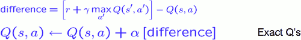
        - For an exact q-learner the update looks like this.  This is just an algebraic rewrite of the update that says take α of one and (1-α) of the other. This can delay calculation of α. 
    - `wᵢ ← wᵢ + α[difference]fᵢ(s,a)`    ( Approximate Q’s )
        - wᵢ + α[difference]·xᵢ
    - 实现上，也可能每个 (state, action) 拥有特定的feature vector
So we basically do is we keep our Q value around but we nudge it in the direction of this difference. So if we appear to be getting something a lot higher than we thought well we should raise our estimate. 

Now if your q-valuse are a big table you simple look up this entry (s,a) you see it's 9.3, you cross out the 9.3 and you replace it with 9.8. It's really easy to increment a table. 

The problem is now the only knobs we have are the weights.   You can't increment a single value in the q function. (see Approximate Q's) But what you can do is you can say all right might q-value wasn't high enough for the state so what I need to do is change the weights so that it will be higher. And the way we do that is instead of increasing the q-value directly we increase the weights.  But which way should we increase ? You increase all of them but in proportion to the feature value. So if a certain feature is off we don't change its weight. If it's negative we're actually going to decrease its weight because of the sign change. And then features that fire more strongly have a bigger effect on the update. So this is the difference. It's the same idea you compute how wrong you were and then you try to make that error less except now we're tweaking the weights rather than the q-values directly. 


That looks like you've got these sliders like how bad is a ghost. And whenever you're near a ghost and something bad happens , blame the ghost , so you write down ghosts are little worse than they were before. 


The intuitive interpretation is adjusting these weights . So if something bad happens all of the features that are active get a penalty and so on. 

 - Intuitive interpretation:
    - Adjust weights of active features
    - E.g., if something unexpectedly bad happens, blame the features that were on: disprefer all states with that state’s features
 - Formal justification: online least squares


---

<h2 id="9f255bd21e3c3e685bca408fc92e97d4"></h2>


### Example : Q-Pacman

 - dot feature
    - how close will I be to the dot if I take action *a* , and I'll take the reciprocal of that distance.
    - so a big number means I'm basically getting close to a dot.
 - ghost feature
    - similar thing , if I close to a ghost , f<sub>ghost</sub> gets bigger 

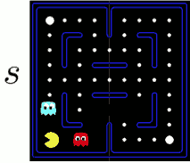

 - Q(s,a) = 4.0·f<sub>dot</sub>(s,a) - 1.0·f<sub>ghost</sub>(s,a)
 - f<sub>dot</sub>(s, NORTH) = 0.5 
    - because the closest dot is 2 away ???   , after having executed action a in state s
 - f<sub>ghost</sub>(s,NORTH) = 1.0 
    - because the closest ghost is 1 away , after having executed action a in state s
 - Q(s,NORTH) = +1
    - We compute that approximate Q is +1 for this Q state (s,NORTH).

What does that mean ? That means that according to our approximate q-value we think our score for the game from this point forward is going to be +1. Well what happens?  You move north you die.  You receive a -500 reward and you end up in a state where the game is over and therefore the Q values are 0 by definition. 

 - a = NORTH , r = -500 => 
 - 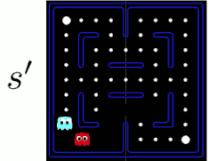   
 - 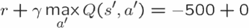
 - Q(s', . ) = 0


So now we think hard we say well I used to think before I had this experience that this state on the left was worth +1. Apparently that isn't what happened this time. This time it looks like I'm on track for the -500 I received plus a future discounted reward of 0 because the game ended. 

Alright so I compare there 2 things, it looks like I overestimated by 501 , so my difference here is -500 , and that means I should probably lower the q-value. Now remember I can't lower the q-value directly , I have to lower it via the weights. 

Ans so I do this update: the weights mostly stay the same but I move them in the appropriate direction by an amount that is proportional to my error -- the learning rate α , it's a step size here -- and the activation of the feature. 

 - difference = -501  =>
    - w<sub>dot</sub>   ←  4.0 + α·[-501]·0.5
    - w<sub>ghost</sub> ← -1.0 + α·[-501]·1.0

So the ghost feature was more active here than the dot feature. So it's gonna receive a large update. 

When I execute these updates I end up with a new Q function  which has the same functional form uses the same features but has different weights. We like dots slightly less  and we really don't like ghosts now because they were right there when all the bad stuff happended. 

 - Q(s,a) = 3.0·f<sub>dot</sub>(s,a) - 3.0·f<sub>ghost</sub>(s,a)   

Now we'll continue acting but it seems reasonable that this is what we learn. We still like the dots but now we're more scared of ghosts. Seems like a good outcome.  Let's see what happends in practice. 

What's nice about this is you learned so quickly from even 1 experience you can learn the ghosts ard bad. What you realize is the first time you eat a dot , you get a feedback that lets you learn that maybe dots are good, and the first time you hit a ghost have an opportunity to learn the ghosts are bad. So instead of that kind of error and error and error and finally after 2000 tries we master a 2 by 2 board , lets see what happens (a big board).   


<h2 id="1a76030ec4ea873977b1ed0668f5f87a"></h2>


### Another example

 - Q-function:  Q(s,a) = w₁f₁(s,a) + w₂f₂(s,a)
 - with
    - f₁(s,a) = 1/ ( manhanttan distance to nearest dot after executing action *a* in *s* )
    - f₂(s,a) = ( manhanttan distance to nearest ghost after executing action *a* in *s* ) 
 - initial w₁ = 1, w₂ = 10
 
For the state s shown below, which action should pacman take ? Assume that the red and blue ghosts are both sitting on top of a dot. 
 


So there 2 action available :

 - WEST 
    - f₁(s,West) = 1 
    - f₂(s,West) = 3
    - Q(s,West) = 1\*1 + 10\*3 = 31
 - SOUTH  
    - f₁(s,South) = 1 
    - f₂(s,South) = 1
    - Q(s,South) = 1\*1 + 10\*1 = 11

Based on this approximate Q-function , action WEST will be taken.

Now we are entering state s':

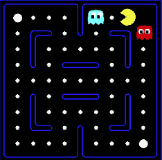

Assume γ =1 , α = 0.5.

The reward for this transition is r = +10 -1 = 9. (+10: for food pellet eating, -1 for time passed).

So far we don't know the value of this sample. We need calculate the value of state s' at first. 

In s' , 2 actions are available : 

 - Q(s' , West ) = 11
 - Q(s' , East ) = 11 
 - V(s') = 11

So the value of the sample = `r + γ·V(s') = 9 + 11 = 20`. And `difference` = 20 - Q(s, West) = -11 

 - 你猜测 Q(s,West) 可以获得 31收益， 实际并不是这样，出现了 α·-11 的收益偏差。
 - 这里计算 difference 使用了一个小技巧, 先不加入 α 的计算。 等最后更新 weights的时候，再加入α 的计算 
 - 你也可以使用 bellman update 正常计算 α[ difference ] 。
 
```
Q(s,a) = (1-α)Q(s,a) + α[ r + γV(s') ] 
       = Q(s,a) + α·Q(s,a) + α[ r + γV(s') ] 
       = Q(s,a) + α[ r + γV(s') - Q(s,a) ]
       = Q(s,a) + α[ difference ] 
```  


Now we should add the difference to weights:

 - w₁ = w₁ + α·difference· f₁(s,West) = 1 + 0.5 * -11 * 1 = -4.5
 - w₂ = w₂ + α·difference· f₂(s,West) = 10 + 0.5 * -11 * 3 = -6.5


<h2 id="25f9c7fa3b50aebe5125112ac1187777"></h2>


### 总结

 - 根据Q-function ， 可以计算出每个 state 的 Q-Value 
 - 任意 sample (s,a,r,s') , 计算 sample value 和 Q(s,a) 的差值
 - update weights by difference. 


<h2 id="dfd9c3589510f42d75cc643582c741ee"></h2>


## Q-Learning and Least Squares

Now we're going to take a quick look and see why this update make sense. I told you this intuitive explanation which was look at your error and adjust the weight so that error gets smaller. In face we can use that idean to formally justify this approximate q-learning update. And the way we do that is we think back to a more general case of least square. 

So in general we might want do some kind of linear approximation. In particular we have some feature vector maybe we've only got one feature f₁ of our input X. And we can have an prediction function which is linear *y* .  This can happen in multiple dimensions as well. 


<h2 id="7c2917ddb383d4aca5702f57b1bf97a6"></h2>


### Optimization: Least Squares *

<h2 id="431c26cfba3b0e63e31187e82c47bdd4"></h2>


### Minimizing Error * 

Really what that means is for a small step size α you take your weight and you take a step in the direction away from the derivative with us of the error with respect to the weight and that is exactly our online q update which corresponds to fiddling to this line up and down. 

Now how does it work in q-learning ? The weights are the weights , the target that you're trying to reach right is your experience from a one-step look ahead and your prediction is your linear function. So in fact this approximate q-learning that had an intuitive explanation but came out nowhere. In fact it corresponds to exactly the case of online least square. 

<h2 id="4d834ce4e64c89be3da78e77c76c4357"></h2>


### Overfitting : Why Limiting Capacity Can Help *

---


<h2 id="20e0fd886eda9402c6c8c3dd18b4bb87"></h2>


## Policy Search 

One last important thing about how these things work in practice is in general q-learning will only take you so far and what peaple often do in practice to make these really work  is something called policy Search. 

In policy search what you do is you directly try to improve the policy.

 - Problem: often the feature-based policies that work well (win games, maximize utilities) aren’t the ones that approximate V / Q best
    - E.g. your value functions from project 2 were probably horrible estimates of future rewards, but they still produced good decisions
        - So in particular and project , you wrote down `5 x dist_to_dot - 2 x dist_to_ghost` , that was almost certainly not the actual value of the state but distinguished good states from bad states. 
    - Q-learning’s priority: get Q-values close (modeling)
    - Action selection priority: get ordering of Q-values right (prediction)
    - We’ll see this distinction between modeling and prediction again later in the course


That's a general thing : 

q-learning tries to get the values close. it does not try explicitly to make the best action from a state have a higher value than the worst action from the state. It doesn't try to order the Q values. For action selection you only care about the ordering.  Of course the q values were close enough their orders would be correct as well , but were never prefect and so there's a trade-off between these things. We'll also see this in much greater detail in the second half of the course that there's a trade-off between modeling geting the values right and prediction getting the ordering right making the correct decision. 

The solution to this is to learn policies that maximize your rewards and do that directly in some way. And to not try so hard to figure out what the values that predict the rewards are , just learn the policies.

 - Solution: learn policies that maximize rewards, not the values that predict them
  

 - Policy search: start with an ok solution (e.g. Q-learning) then fine-tune by hill climbing on feature weights

So policy search in general start something "ok" solution.  

For example you might do some Q-learning for a while or if you've got like a helicopter or something that's expensive to replace you might get an initial policy based on domain kownledge or simulation and the you fine-tune by essentially hill climbing on the feature weights.  When you hill climbing  you just change the feature weights and you see whether your rewards over  time are better as opposed to just a one-step look ahead and then do a Q magnitude update. 

---

 - Simplest policy search:
    - Start with an initial linear value function or Q-function
    - Nudge each feature weight up and down and see if your policy is better than before
 - Problems:
    - How do we tell the policy got better?
    - Need to run many sample episodes!
    - If there are a lot of features, this can be impractical
 - Better methods exploit lookahead structure, sample wisely, change multiple parameters…


---

<h2 id="6f8b794f3246b0c1e1780bb4d4d5dc53"></h2>


## Conclusion

 - We’re done with Part I: Search and Planning!
 - We’ve seen how AI methods can solve problems in:
    - Search
    - Constraint Satisfaction Problems
    - Games
    - Markov Decision Problems
    - Reinforcement Learning
 - Next up: Part II: Uncertainty and Learning!


---

<h2 id="96bbd2b31616de4e05850fa5d1d2da71"></h2>


# More About Reinforcement Learning

<h2 id="39e455faa2cee078107349ed5a79c485"></h2>


## Q-Learning 的问题

 - 如果state 很多，我们维护这么大的一个 q-value table
    - Feature-Based Representations 是一个解决方法
    - 但是如果输入是一张 raw pic , 不容易从 picture 中提取 feature
 - Neural Network可以很好对图片提取特征信息，进行抽象，分类等

<h2 id="61f0ce8542a3f21f795b45c4c133c04c"></h2>


## Deep Q Learning

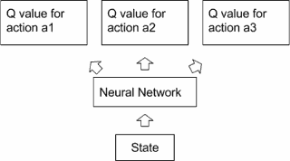

 - Deep Q Learning 依然是Q Learning , 只是用神经网络去代替了Q Table
 - 还有一种更加 End to End的方法，叫做Policy Gradient

<h2 id="d4680878cbefd1ce084325dd933e82f9"></h2>


## Policy Gradient

 - Deep Q Learning 用Ｑ网络去估计Q 表然后在规定一种策略去依据Ｑ值采取行动不同
 - Policy Gradient 的策略网络直接输出的就是策略，比如采取每一种行动的概率（对于离散控制问题），或者每一个动作的值（对于连续控制问题）。

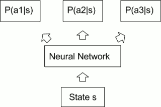

 - 优点
    - 更加的 End to End，不用借用强化学习的理论框架。
    - 可以通过直接输出动作相应的连续量处理连续的控制量
        - 比如对于汽车来说，油门的力度，刹车力度，转向角度
        - 用通过Ｑ值选动作的方法则无法处理连续量
 - 在　Policy Gradient　中我们希望学会一个策略能够达到最大的期望回馈
    - π<sub>θ</sub>(s) 表示策略 
    - θ 表示 策略网络的 weight 
    - 通过学习不断更新。目标函数可以表示为 J(θ) = E<sub>π(θ)</sub>[r] 
    - 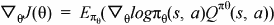
        - 由此导数，我们可以把每轮的折扣回馈 v<sub>t</sub> 看作改 state 真实价值 G<sub>t</sub> 的无偏估计
        - 利用Gradient ascent的方法 ， 不停地更新 θ 训练一个能够达到最大期望回馈的策略网络。
        - 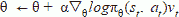

 - PG 听起来很美好 , 实践中会有很多致命的问题让它很难收敛
    - 1. 反馈分配: 反馈在大多时候都是不存在的
        - 比如赛车游戏，只有游戏结束，例如到达终点或者撞墙而亡的时候才收到反馈
        - 如何将反馈很好的和之前进行的一系列策略和动作联系到一起去是一个很大的问题
    - 2. 算法有一个内在的假设，假设所有的抽样都是独立，并且处于相同分布的(independently and identically distributed, iid )
        - 但是实际上，在游戏进行的过程中，同一时间段前后的抽样是明显具有相关性的，这个iid假设并不成立，也就会影响到学习的效果
    - 3. 反馈噪音 
        - 在我们通过获取反馈，折扣，然后ＴＤ来更新Ｑ值的方法，或者直接估计策略的方法中，这些反馈信号都有非常多的噪声，这些噪声可能会让整个网络很难收敛，甚至很容易发散。
 - 直到发现这个更加高级的方法DDPG

<h2 id="60ca1673615c7ff54bc9af8925335b66"></h2>


## Deep Deterministic Policy Gradient

 - 动作网络 Actor Network 用于直接估计动作
    - 就像低配版 Policy Gradient中的 Policy Network，输入State，给出动作值 Actions
    - 从Critic Network 对应 Actions 输入计算出的导数来进行更新。
 - 校正网络 Critic Network 用来估计Q值
    - 输入 State 的同时还输入由Actor Network 产生的 Actions，给出相应的 Q 值
    - 并不断的用 bellman equation来进行更新 
 - 动作方程 actor function 表示为: μ(s|θ<sup>μ</sup>)
 - 校正方程 critic function 表示为: Q(s,a | θ<sup>Q</sup> ) 
 - Cost function J 对于\theta的导数为：
    - 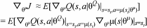
 - 这个算法将对动作的Q值估计和策略估计给分离，让 agent 能够在探索更多的同时保持对一个确定策略的学习，让整个网络学习变得更容易。
 - 其他 更有利于网络的收敛 的小技巧 （小，但是很有用）
    - Replay Buffer
        - 近乎于无限大的缓存，每次进行动作以后得到的 状态-动作-反馈- 新状态 (s<sub>t</sub>,a<sub>t</sub>, r<sub>t</sub>,s<sub>t+1</sub> ) 都会被保存到这个缓存中去
        - 不同于之前直接拿游戏进行过程中得到的 (s<sub>t</sub>,a<sub>t</sub>, r<sub>t</sub>,s<sub>t+1</sub> )  来进行训练
        - 采用了Replay Buffer 以后，训练采用的 sample 则从这个缓存中随机抽样，通过这样的方法，理论上可以打破抽样直接的相关性，解决iid假设不成立的困扰
    - Target Network
        - 在训练过程中，由于环境是相对混沌的，用于更新Q网络的反馈具有很大的噪声
        - 直接训练一个网络会非常容易让它发散而非收敛。
        - 目标网络Target Network 用来创建 Actor和Critic网络的副本, μ'(s|θ<sup>μ</sup>)  ,  Q'(s,a | θ<sup>Q</sup> ) 来计算目标值，然后以τ 的比例缓慢的跟随原网络更新
            - τθ' ← τθ + (1-τ)θ'


---


<h2 id="6c11e2dd65ad60a6dd6cf3a2be08fa0c"></h2>


# Policy Gradients

<h2 id="241bce13578cf2fc98c72f432c5bc204"></h2>


## 和以往的强化学习方法不同

 - 强化学习是一个通过奖惩来学习正确行为的机制.
    - 有学习奖惩值, 根据自己认为的高价值选行为 , 比如 Q learning, Deep Q Network,
        - 无法在 无穷多的动作中计算价值, 从而选择行为
    - 也有不通过分析奖励值, 直接输出行为的方法,   Policy Gradients 
        - 能在一个连续区间内挑选动作

<h2 id="1a843b1039c85dd724a126708a375915"></h2>


## 更新不同之处
    
 - Policy Gradients 的误差又是什么呢?
    - 没有误差! 
 - 但是他的确是在进行某一种的反向传递. 
    - 这种反向传递的目的是让这次被选中的行为更有可能在下次发生.
 - 但是我们要怎么确定这个行为是不是应当被增加被选的概率呢?
    - reward

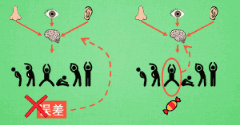

<h2 id="edc520f80b6440121e2920f7f2caf86b"></h2>


## 具体更新步骤

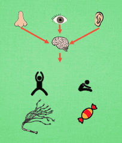

 - 观测的信息通过神经网络分析, 选出了左边的行为
 - 我们直接进行反向传递, 使之下次被选的可能性增加.
 - 但是奖惩信息却告诉我们, 这次的行为是不好的, 那我们的动作可能性增加的幅度 随之被减低.
 - 这样就能靠奖励来左右我们的神经网络反向传递
 - 再来举个例子, 假如这次的观测信息让神经网络选择了右边的行为, 
 - 右边的行为随之想要进行反向传递, 使右边的行为下次被多选一点,
 - 这时, 奖惩信息也来了, 告诉我们这是好行为, 那我们就在这次反向传递的时候加大力度, 让它下次被多选的幅度更猛烈! 这
 - 这就是 Policy Gradients 的核心思想


---

<h2 id="60e65bfe1069d9e782077a65bdd16a2a"></h2>


# Q Learning  VS. Policy Gradient

 · |  Q Learning  |  Policy Gradient
--- | --- | --- 
model-free  | off-policy model-free control | policy optimization
目的 | 求出Q\*(s, a) | 优化expected reward，并不关心Q\*(s, a).
适用场合 | 一般针对离散空间 | 针对连续场景
学习方法 | 基于值函数估计的强化学习方法 | 策略搜索强化学习方法
学习方法类比 | 可类比Naive Bayes——通过估计后验概率来得到预测 | 可类比SVM——不估计后验概率而直接优化学习目标
求解方法 | 采用值迭代方法。以value推policy | 直接在策略空间求解，泛化更好，直推policy
最优解 | 在离散状态空间中理论上可以收敛到最优策略，但收敛速度可能极慢。在使用函数逼近后（例如使用神经网络策略模型）则不一定 | Policy Gradient由于使用梯度方法求解非凸目标，只能收敛到不动点，不能证明收敛到最优策略。
存在问题 | 基于值函数的方法存在策略退化问题，即值函数估计已经很准确了，但通过值函数得到的策略仍然不是最优。使用值函数近似时，策略退化现象非常常见 |  Policy Gradient不会出现策略退化现象，其目标表达更直接，求解方法更现代，还能够直接求解stochastic policy等等优点更加实用。

---


 [1]: ../imgs/cs188_rl_grid_input_policy.png
 
 [2]: ../imgs/cs188_rl_grid_learnedmodel.png

 [3]: ../imgs/cs188_rl_q_values_calc.png

