...menustart

- [A Tour of Go](#9d752ebd00140821fbd99541fb3e69ab)
- [Interface](#3c1aac82863ed9e5a9aca8ce687f711d)
    - [Printing Weekdays](#255c6051fde52b5c98880ff4f238b5f2)
    - [Printing Durations](#0fd915eb2c995e64d21797042ede6f77)
    - [Write to a file](#4903a80e49fa578825d5927be03feeff)
    - [Write to a hash](#7ce0a8c9cfbd3bf76a99fa988cdb9de6)
    - [Print and hash , use MultiWriter](#2a4e30ab1505dee2c16ec03c422ed2b4)
    - [Hex dump](#8fc870501c8a46bebf0b5e69c49b8241)
- [Reflection](#aea1e492943ccbad7ee270ec1e064758)
    - [Printing basic types](#364365d77d8399e312d21b4e9e8b3421)
    - [Printing Structs](#cbe7019395e145c16b777bc3c7970a18)
    - [Struct to JSON](#261dd3a92a5a5d83e3ae910def810284)
    - [Struct to XML](#fce6a5dd95b5e0da61fe5ef37f4544e7)
    - [JSON to Struct](#3a7565106d5706624d77155427ccdbd2)
    - [JSON to Struct to XML](#8e2b9a5da9255a18d20bf9c987e0328d)
- [Concurrency](#3e48afddb0c5521684b8d2687b0869d6)
    - [Generator: functions that returns a channel](#8af4ce5646b68f6911f3d1a9893960e3)
    - [Restoring sequencing](#90681f29e18aa9537ab5c3b975c37262)
    - [Select](#e0626222614bdee31951d84c64e5e9ff)
    - [Timeout using select](#d3d322921184197a4cd2b4f5aa6d2a0f)
    - [Timeout for whole conversation using select](#e972c3f4a1e1f94b5f56e33b6404348d)
    - [Quit channel](#781f97628a491569c03a2b7e7010a000)
    - [Daisy-Chain](#43b8dbc062a4736f4685c543e291184b)
- [Shape your data flow](#ebf01a4b4c6b37a5b3f0b108563c3d9a)
    - [Fan-out](#3bd4e18208001e378e54469a0b8e5993)
    - [Turnout](#a60530614265b4d0c6f186bb904822dd)
        - [Quit Channel](#b2bc387526f0d4b901fd29516715e9a1)
    - [Where channels fail](#6b108b44b08b4a38ec36d02b0189ea8a)
        - [Mutexes are not an optimal solution](#10024b5119b072ac3c3901283130c685)
        - [Atomic operations](#2fd7ca192be313bd1de33af3cebab2e3)
        - [Spinning CAS](#bb67365ed820db3703c5d3d28e5fe0ed)
        - [Ticket storage](#c12d451b516c19be818cbe9d1a947891)
        - [Guidelines for non-blocking code](#ad890e62c44cb2e00f410689962f7580)
    - [Concurrency in practice](#c764966d2934770cf700a87fbbb6c400)
- [7 common mistakes](#e7d643f6ea31dde222fa239482086176)
    - [1. Not Accepting Interface](#afc52dd92900122efbd2174e416674de)
    - [2. Not using io.Reader & io.Writer](#ed144dabd32394149cf28d4a7b7e6df0)
    - [3. Requiring Broad Interfaces](#51fc84b7a5892cfab769578c835e6dce)
    - [4. Methods Vs Functions](#fda18c942bbc981e6af31db7598aed9c)
    - [5. Pointer vs Values](#5ee565fbabaaf661c451292e4fabe3b6)
        - [Pointer Receivers](#75d85d3f3f9eb82be870483a781ae521)
        - [Value Receivers](#4771583a6a71d9ccf0873a894ee2aa10)
    - [6. Thinking of Errors As Strings](#5a218a8395e0f66fe41e5bf0dcd1426c)
        - [Error is An Interface](#4b44697498c4960768206019a51929d4)
        - [Standard Errors](#1c892366e993cf2d899dbe969bd25830)
        - [Custom Errors](#a4e33f2edb2e0827280629149b1ebe02)
    - [7. To Be Safe Or Not To Be](#895c130d3c5e6375f5b8f1d2f3fc022f)
        - [Consider Concurrency](#63339530c1aae9597c14dcafc7f501df)
        - [making it safe](#177935b2b4281a7fde890ffeb7a7637a)
        - [Keeping It Unsafe](#a2ff502f00ccab58bb020576288a6ef4)

...menuend


<h2 id="9d752ebd00140821fbd99541fb3e69ab"></h2>


# A Tour of Go

<h2 id="3c1aac82863ed9e5a9aca8ce687f711d"></h2>


# Interface

<h2 id="255c6051fde52b5c98880ff4f238b5f2"></h2>


## Printing Weekdays

```go
    day := time.Now().Weekday()
    fmt.Printf( "Hello, %s (%d)\n", day ,day )
    // Hello, Saturday (6)
    // time.Weekday is an int type , and it implements Stringer.
```

<h2 id="0fd915eb2c995e64d21797042ede6f77"></h2>


## Printing Durations

```go
    start := time.Now()
    fetch("https://www.google.com/")
    fmt.Println( time.Since(start) ) 
    // 190.090717ms
    fmt.Println( "%d\n", time.Hour +  time.Since(start) ) 
    // 3600190898331
``` 

<h2 id="4903a80e49fa578825d5927be03feeff"></h2>


## Write to a file 

```go
    fmt.Fprintf( os.Stdout , "hello\n" ) 
```

<h2 id="7ce0a8c9cfbd3bf76a99fa988cdb9de6"></h2>


## Write to a hash

 - the nice thing about the writer interface of course is that you can substitute implementations besides OS files. 
 - for example hash functions in go are conventionally presented as writers 

```go
    h := crc32.NewIEEE()  // it is itself a writer
    fmt.Fprintf ( h, "hello, 世界\n" )
    fmt.Printf( "hash=%#X\n" , h.Sum32 ) // hash=0xe2ed6c48
```

<h2 id="2a4e30ab1505dee2c16ec03c422ed2b4"></h2>


## Print and hash , use MultiWriter

```go
    h := crc32.newIEEE()
    w := io.MultiWriter( h, os.Stdout ) 
    fmt.Fprintf ( w, "hello, 世界\n" )  // hello, 世界
    fmt.Printf( "hash=%#X\n" , h.Sum32 ) // hash=0xe2ed6c48
```

<h2 id="8fc870501c8a46bebf0b5e69c49b8241"></h2>


## Hex dump 

```go
    h := hex.Dumper( os.Stdout )
    defer h.Close()
    fmt.Fprintf( h, "Hello, 世界\n" )
```

---

 - fmt.Printf sport `%v` , which v means value 
 - how that works ?
 - This takes us to our 2nd topic -- **reflection**

<h2 id="aea1e492943ccbad7ee270ec1e064758"></h2>


# Reflection

 - In GO, reflection means that the implementation makes 
    - type information , basic operations available at run-time 
 - So if you have an unknown value, you can find out its type , the definition of that type, and perform the type's basic operations on that value.

<h2 id="364365d77d8399e312d21b4e9e8b3421"></h2>


## Printing basic types

```go
func main() {
    myPrint( "Hello", 42, "\n" )   
}

func myPrint( args ...interfaceP{} ) {
    for _, arg := range args {
        switch v := reflect.ValueOf(arg); v.Kind() {
        case reflect.String:
            os.Stdout.WriteString(v.String())
        case reflect.Int:
            os.Stdout.WriteString( strconv.FormatInt(v.Int(), 10) )   
        }
    }    
}
```

<h2 id="cbe7019395e145c16b777bc3c7970a18"></h2>


## Printing Structs

```go
type Lang struct {
    Name string
    Year int
    URL string     
}

func main() {
    lang := Lang{ "Go", 2009 , "https://golang.org/" }
    fmt.Printf( "%v\n" , lang )   // {Go 2009 https://golang.org/}
    fmt.Printf( "%+v\n" , lang )  // {Name:Go Year:2009 URL:https://golang.org/}  
    fmt.Printf( "%#v\n" , lang )  // main.Lang{Name:"Go" Year:"2009" URL:"https://golang.org/"}  
}
```

<h2 id="261dd3a92a5a5d83e3ae910def810284"></h2>


## Struct to JSON

```go
func main() {
    lang := Lang{ "Go", 2009 , "https://golang.org/" }
    data , err := json.Marshal(lang)
    if err != nil {
        log.Fatal(err)    
    }
    fmt.Printf( "%s\n" , data  )  // {"Name":"Go" "Year":"2009" "URL":"https://golang.org/"} 
}
```

<h2 id="fce6a5dd95b5e0da61fe5ef37f4544e7"></h2>


## Struct to XML 


```go
func main() {
    lang := Lang{ "Go", 2009 , "https://golang.org/" }
    data , err := xml.Marshal(lang)
    if err != nil {
        log.Fatal(err)    
    }
    fmt.Printf( "%s\n" , data  ) 
}

<Lang>
    <Name>Go</Name>
    <Year>2009</Year>
    <URL>https://golang.org</URL>
</Lang>
```

<h2 id="3a7565106d5706624d77155427ccdbd2"></h2>


## JSON to Struct 

```go
// this func basically implement `cat` tool
func main() {
    input, err := os.Open("lang.json")    
    if err != nil {
        log.Fatal(err)
    }
    io.Copy(os.Stdout, input)  // like mem cpy , but for I/O
}
```

```go
// decode json
func main() {
    input, err := os.Open("lang.json")    
    if err != nil {
        log.Fatal(err)
    }
    
    dec := json.NewDecoder(input)
    for {
        var Lang lang 
        err := dec.Decoder( &lang ) 
        if err != nil {
            if err == io.EOF {
                break 
            }    
            log.Fatal(err)
        }    
        fmt.Printf( "%v\n" , lang  )
    }    
}

{Python 1991 http://python.org/}
{Ruby 1995 http://www.ruby-lang.org/en/}
```

 - Abstracted version 

```go
func do( f func(Lang) ) {
    input, err := os.Open("lang.json")    
    if err != nil {
        log.Fatal(err)
    }
    
    dec := json.NewDecoder(input)
    for {
        var Lang lang 
        err := dec.Decoder( &lang ) 
        if err != nil {
            if err == io.EOF {
                break 
            }    
            log.Fatal(err)
        }    
        f(lang)
    }    
}

func main() {
    do( func( lang Lang )  {
        fmt.Printf( "%v\n" , lang )     
    }  )
}
```

<h2 id="8e2b9a5da9255a18d20bf9c987e0328d"></h2>


## JSON to Struct to XML

```go
funct main() {
    do ( func(lang Lang) )  {
        data , err := xml.MarshIndent( lang, "", "  " ) 
        if err != nil {
            log.Fatal(err)
        }      
        fmt.Printf( "%s", data  )
    })
}
```

---

<h2 id="3e48afddb0c5521684b8d2687b0869d6"></h2>


# Concurrency 

 - Goroutines let you run multiple computations simultaneously 
 - Channels let you coordinate the computations , by explicit communication
    - chanels communicate and synchronize a single operation.
    - but `Buffering` removes synchronization

<h2 id="8af4ce5646b68f6911f3d1a9893960e3"></h2>


## Generator: functions that returns a channel 

<h2 id="90681f29e18aa9537ab5c3b975c37262"></h2>


## Restoring sequencing 

(之前的例子，执行顺序乱了)

 - Send a channel on a channel , making goroutine wait its turn
 - Receive all messages, then enable them again by sending on a private channel 
 - First we define a mesage type that contains a channel for the reply

```go
type Message struct {
    str string
    wait chan bool     
}
```

 - str is the message that we want to print 
 - wait channel is like a singaler , the guy will block on the wait channel until person says, ok, I want you to go ahead

```go
waitForIt := make(chan bool)  // shared between all messages 

c <- Message{ "AAA" , waitForIt }
time.Sleep(  xxxxx  ) 
<- waitForIt 
```
 
<h2 id="e0626222614bdee31951d84c64e5e9ff"></h2>


## Select

 - all channels are evaluated 
 - selection blocks until one communication can proceed , which then dose 
     - select available 1 randomly
 - A default clause , if present, executes immediately if no channel is ready 

<h2 id="d3d322921184197a4cd2b4f5aa6d2a0f"></h2>


## Timeout using select 

 - this will timeout for every conversation

```go
for {
    select {
    case s := <-c :
        fmt.Println(s)    
    case <- time.After( 1* time.Second ) :
        fmt.Println( "you're too slow." )
        return 
    }   
}
```

<h2 id="e972c3f4a1e1f94b5f56e33b6404348d"></h2>


## Timeout for whole conversation using select 


```go
timeout := time.After(5*time.Second)
for {
    select {
    case s := <-c :
        fmt.Println(s)    
    case <- timeout:
        fmt.Println( "you're too slow." )
        return 
    }   
}
```

<h2 id="781f97628a491569c03a2b7e7010a000"></h2>


## Quit channel 

 - instead of using a timeout , we can deterministically to stop it

```go
select {
    case c <- "AAA" :
        // do nothing
    case <- quit:
        cleanup()
        // more sophisticated 
        quit <- "See you!"
        return 
}

// in main func
quit <- "Bye"
<- quit
```

<h2 id="43b8dbc062a4736f4685c543e291184b"></h2>


## Daisy-Chain

```go
func f(left, right chan int) {
    left <- 1 + <- right     
}
```

---

<h2 id="ebf01a4b4c6b37a5b3f0b108563c3d9a"></h2>


# Shape your data flow

 - Channels are streams of data 
 - Dealing with multiple streams is the true power of select 

```
Fan-out
   /
-> ->
   \
```

```
Funnel
 \
-> ->
 /
```

```Turnout
 \ /
-> ->
 / \
```

<h2 id="3bd4e18208001e378e54469a0b8e5993"></h2>


## Fan-out

 - you can use range , if you do , you will receive data all the time until the channel closed , and if it closed then the loop will discontinue and you won't process this last mesage 

```go
func Fanout( int <- chan int , OutA, OutB chan int ) {
    for data := range In { // Receive until closed
        select {  // Send to first non-blocking channel 
        case OutA <- data : 
        case OutB <- data : 
        }
    }    
}
```

<h2 id="a60530614265b4d0c6f186bb904822dd"></h2>


## Turnout

```go
func Turnout ( InA, InB <-chan int, OutA, OutB chan int  ) {
    for {
        select {   // receive from first non-blocking
            case data , more = <- InA : 
            case data , more = <- InB :    
        }    
        if !more {
            return 
        }
        select {   // send to first non-blocking 
            case OutA <- data :
            case OutB <- data :   
        }
    }   
}
```

 - if you have a closed channel in there , it tends to be chosen all the time 
 - so if you close one channel , you will always get to that case and you'll never get to the other channel which might still have data 
 - so you can use a quit channel

<h2 id="b2bc387526f0d4b901fd29516715e9a1"></h2>


###  Quit Channel 

```go
func Turnout( Quit <- chan int, InA, InB, OutA, OutB chan int   ) {
    for {
        select { 
            case data = <- InA : 
            case data = <- InB :    

            case <- Quit:   // remember : close generates a mesage 
                close(InA)  // Actually this is an anit-pattern  
                close(InB)  //    But you can argue that quit acts as a delegate
                
                Fanout( InA, OutA , OutB )  // Flush the remaining data 
                Fanout( InB, OutA,  OutB )
        }
    }
}
```

<h2 id="6b108b44b08b4a38ec36d02b0189ea8a"></h2>


## Where channels fail 

 - You can create deadlocks with channels
 - Channels pass around copies, which can impact performace
 - Passing pointers to channel can create race conditions
 - What about "naturally shared" structures lick caches or registries ? Ugly

<h2 id="10024b5119b072ac3c3901283130c685"></h2>


### Mutexes are not an optimal solution

 - Mutexes are like toilets
    - The longer you occupy them, the longer the queue gets
 - Read/Write mutexes can only *reduce* the problem
 - using multiple mutexes *will* cause deadlocks sooner or later
 - All-in-all not the solution we're looking for 

<h2 id="2fd7ca192be313bd1de33af3cebab2e3"></h2>


### Atomic operations

 - sync.atomic package
 - Store, Load, Add, Swap and CompareAndSwap 
 - Mapped to thread-safe CPU instructions
 - These instructions only work on integer types
 - Only about 10-69x slower than their non-atomic counterparts

<h2 id="bb67365ed820db3703c5d3d28e5fe0ed"></h2>


### Spinning CAS 

 - You need a **state** variable and a **free** constant 
 - Use CAS(CompareAndSwap) in a loop:
    - if state is **not free**,  try again until it is 
    - if state is **free** , set it to something else 
 - if you managed to change the state , you *own* it.
 - sync.mutex use this pattern 

```go
type Spinlock struct {
    state *int32    
}

const free = int32(0)

func( l *Spinlock ) Lock() {
    for !atomic.CompareAndSwapInt32( l.state , free, 42 )  // 42 or any other value but 0
        runtime.Gosched()                   // Poke the scheduler
    }   
}

func( l *Spinlock ) Unlock() {
    atomic.StoreInt32( l.state , free )   // Once atomic , always atomic !    
}
```

<h2 id="c12d451b516c19be818cbe9d1a947891"></h2>


### Ticket storage 

 - We need an **indexed data structure** (like a slice), a **ticket** and a **done** variable 
 - A function draws a new ticket by adding 1 to the ticket
 - Every ticket number is unique as we nerver decrement
 - Treat the **ticket as an index** to store your data
 - Increase done to extend the *ready to read* range 

```go
type TicketStore struct {
    ticket *uint64 
    done *unit64
    slots []string // for simpicity, imagine this to be infinite    
}

func (ts *TicketStore) Put(s string) {
    t := atomic.AddUint64(ts.ticket, 1) -1 // draw a ticket 
    slots[s]  = s   // store your data 
    for !atomic.CompareAndSwapUint64( ts.done, t , t+1 ) {  // increase done
        runtime.Gosched()          
    }   
}

func (ts *TicketStore) GetDone() []string {  // wait free, return immediately
    return ts.slots[ :atomic.LoadUnit64( ts.done )+1 ]   // read up to done    
}
```

<h2 id="ad890e62c44cb2e00f410689962f7580"></h2>


### Guidelines for non-blocking code

 - Don't switch between atomic and non-atomic functions
    - just always use atomic functions 
 - Target and exploit situations which enforce uniqueness 
 - Avoid changing 2 things at a time 
    - sometimes you can exploit bit operations
    - sometimes intelligent ordering can do the trick 
    - sometimes it's just not possible at all 

<h2 id="c764966d2934770cf700a87fbbb6c400"></h2>


## Concurrency in practice 

 - Avoid blocking, avoid race conditions 
    - the easiest way to do that is by using CSP 
 - Use channels to avoid shared state
    - Use select to manage channels 
 - Where channels don't work:
    - Try to use tools from the sync package first 
    - In simple case or when *really* needed: try lockless code 

---

<h2 id="e7d643f6ea31dde222fa239482086176"></h2>


# 7 common mistakes 

<h2 id="afc52dd92900122efbd2174e416674de"></h2>


## 1. Not Accepting Interface 

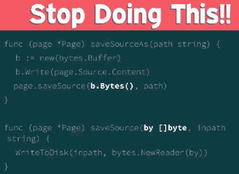

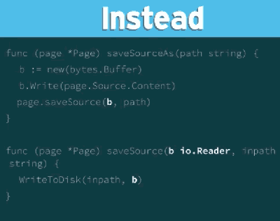

<h2 id="ed144dabd32394149cf28d4a7b7e6df0"></h2>


## 2. Not using io.Reader & io.Writer 

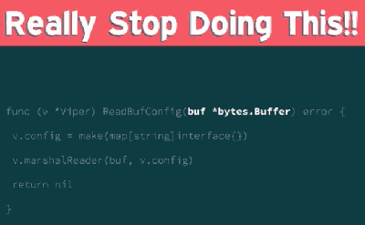

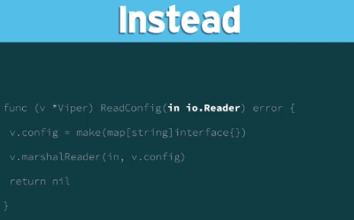


<h2 id="51fc84b7a5892cfab769578c835e6dce"></h2>


## 3. Requiring Broad Interfaces 

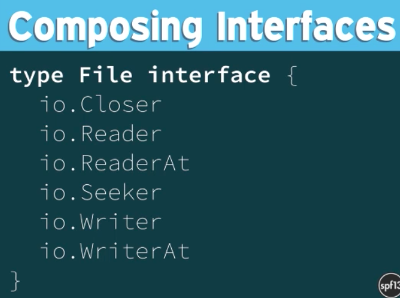

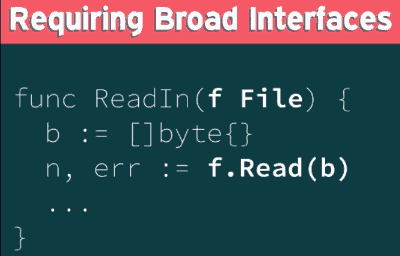

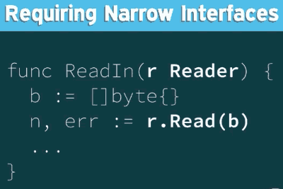


<h2 id="fda18c942bbc981e6af31db7598aed9c"></h2>


## 4. Methods Vs Functions 

 - Methods, by definition, are **bound** to a specific **type**
 - Functions can **accept interfaces** as input 


**Functions Can Be Used With Interface**

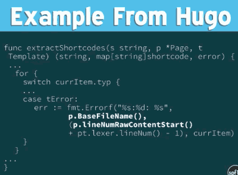

<h2 id="5ee565fbabaaf661c451292e4fabe3b6"></h2>


## 5. Pointer vs Values 

 - It's **not** a question of **performance** (generally) , but on of **shared access**
 - If you want to **share** the value with a function or method, then **use a pointer**
 - if you **don't want** to **share** it, then use **a value** (copy)

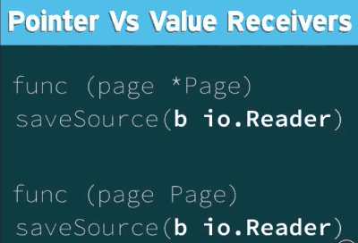

<h2 id="75d85d3f3f9eb82be870483a781ae521"></h2>


### Pointer Receivers 

 - If you want to share a value with it's method, use  a **pointer receiver**
 - Since methods commonly manage state , this is the **common usage**
 - **Not safe** for concurrent access 


<h2 id="4771583a6a71d9ccf0873a894ee2aa10"></h2>


### Value Receivers

 - If you want to share the **value copied** (not shared), use values 
 - If the type is an empty struct ( stateless, just behavior ) ... then just use value 
 - **safe**  for concurrent aceess 
 - eg. `func(t Time)`


<h2 id="5a218a8395e0f66fe41e5bf0dcd1426c"></h2>


## 6. Thinking of Errors As Strings 

<h2 id="4b44697498c4960768206019a51929d4"></h2>


### Error is An Interface 

```go
type error interface {
   Error() string   
}
```

<h2 id="1c892366e993cf2d899dbe969bd25830"></h2>


### Standard Errors 

 - `errors.New( "error here" )` is usually sufficient
 - Exported Error Variables can be **easily checked**

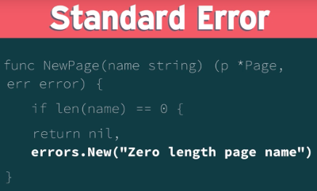

 - this is fine it works, but how do you compare that ?  usually people use string comparison and that's generally not the best way to do things 
 - so better is to export it with the variable and now we can check values 


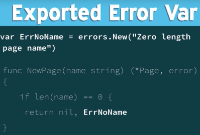

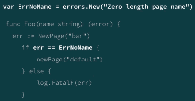

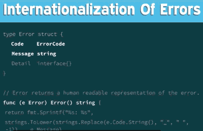

<h2 id="a4e33f2edb2e0827280629149b1ebe02"></h2>


### Custom Errors

 - Can **provide context** to guarantee consistent feedback
 - Provide a type which can be **different from the error value**
 - Can provide **dynamic values** (based on internal error state)


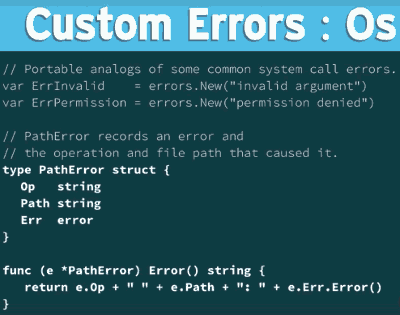

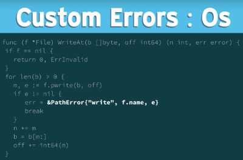

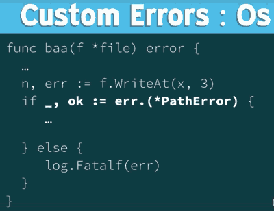

<h2 id="895c130d3c5e6375f5b8f1d2f3fc022f"></h2>


## 7. To Be Safe Or Not To Be 

<h2 id="63339530c1aae9597c14dcafc7f501df"></h2>


### Consider Concurrency

 - If you provide a library someone will use it **concurrently**
 - Data structures are **not safe** for concurrent access
 - Values aren't safe , you need to **create safe behavior** around them 

<h2 id="177935b2b4281a7fde890ffeb7a7637a"></h2>


### making it safe 

 - **sync package** provides behavior to make a value safe (Atomic/Mutex) 
 - **Channels** coordinate values across goroutines by permitting one go routinue to acces at a time

<h2 id="a2ff502f00ccab58bb020576288a6ef4"></h2>


### Keeping It Unsafe

 - **Safety comes at a cost**
 - Imposes behaviors on consumer 
 - **Proper API** allows consumers to **add safety as needed**
 - Consumers can use channels or mutexes


