...menustart

- [1.5 UNION-FIND](#36624ed78487c59c4972f2d421e985d5)
    - [dynamic connectivity](#b175d1bc18d1ee96547e64bd9a71dc50)
        - [Implementing the operations](#750643bb1af5c016a77bcd7385866166)
        - [Quick-find  \[eager approach\]](#9aae2fcda3cf71e6ba9848db8aa59566)
        - [Quick-find is too slow](#6a22536fe36f7a91891c00c8353b8b52)
    - [Quick-union \[lazy approach\]](#bb8d9b733fe7c5d5a81b14d5f15d1811)
    - [improvements](#f867a4fdb09b251cca05d0a8937af271)
        - [Improvement 1: weighting](#ffd277ffee445dabbe1a2e6e83fae275)
        - [Improvement 2: path compression](#f96ae0dc0ea4dbddd95e2813e4a8581a)
- [2.1 ELEMENTARY SORTS](#da1a466c331146a618340e89aa655b05)
    - [shuffling](#03b785186d0322e5a1a31c105fc534ee)
        - [Shuffle sort](#1e7778f2afb3096f1731d0f25daf0fd1)
        - [Knuth shuffle](#18bfcbf8d708ee9650922d916c1d595b)
    - [convex hull](#ab573f869e7d3b25f303d40501ee42dd)
        - [Convex hull: mechanical algorithm](#f7b4a7d0272cd3b9f0aa24e173a8ac02)
        - [Convex hull application: motion planning](#c8cac5868b416483f56438fb9751cfa8)
        - [Convex hull application: farthest pair](#574a49cf3281b0f2c959e58ae347a715)
        - [Convex hull: geometric properties](#f4c2d0947e883517a2af0291794043e0)
        - [Graham scan](#0e0d735e6d928983e7ce806c574de983)
        - [Implementing ccw](#63899fcbf3cd4f4fe086e6cf6229b75f)
        - [Polar Order](#53743c83882b2e0a5016648231ccb9bd)
- [2.2 MERGESORT](#0f231cf5608bbdbebfc5195f998dddf0)
    - [Two classic sorting algorithms](#7da6be45309d0c6b5cd3d0c9770ab1db)
    - [Merge Sort](#2d20788503105e07ffecf0a832e5a1d6)
    - [Mergesort: practical improvements](#f1579c6456d1081d1fb1fab0538c9fd0)
    - [Stability](#7b2970d4873d39e47447102079af953b)
    - [2.3 QUICKSORT](#0145c61a0daa592012099167c895b26f)
        - [Quicksort properties](#8d035825ac310d00799b8e0218304083)
        - [Quicksort: practical improvements](#cb0ba743125423b1e1e3bc3e08c9a02c)
    - [Quick-select](#c33b4377d843f4b615014192187f269f)

...menuend


<h2 id="36624ed78487c59c4972f2d421e985d5"></h2>


# 1.5 UNION-FIND

 - dynamic connectivity
 - quick find
 - quick union
 - improvements

<h2 id="b175d1bc18d1ee96547e64bd9a71dc50"></h2>


## dynamic connectivity

 - Given a set of N objects.
    - Union command: connect two objects.
    - Find/connected query: is there a path connecting the two objects?

<h2 id="750643bb1af5c016a77bcd7385866166"></h2>


### Implementing the operations
 
 - Find query. Check if two objects are in the same component.
 - Union command. Replace components containing two objects with their union.

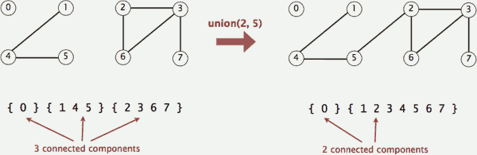


<h2 id="9aae2fcda3cf71e6ba9848db8aa59566"></h2>


### Quick-find  [eager approach]

 - Data structure.
    - Integer array id[] of length N.
    - Interpretation: p and q are connected iff they have the same id.

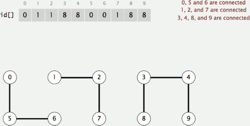

 - Find. Check if p and q have the same id.
 - Union. To merge components containing p and q, change all entries whose id equals id[p] to id[q].

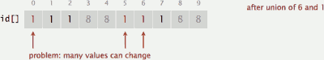


<h2 id="6a22536fe36f7a91891c00c8353b8b52"></h2>


### Quick-find is too slow

 - Cost model. Number of array accesses (for read or write).

algorithm | initialize | union | find
--- | --- | --- | --- 
quick-find | N | N | 1

 - Union is too expensive 
    - It takes N² array accesses to process a sequence of N union commands on N objects.


<h2 id="bb8d9b733fe7c5d5a81b14d5f15d1811"></h2>


## Quick-union [lazy approach]

 - Data structure.
    - Integer array id[] of length N.
    - Interpretation: id[i] is parent of i. 
        - keep going until it doesn’t change (algorithm ensures no cycles)
    - Root of i is id[id[id[...id[i]...]]].

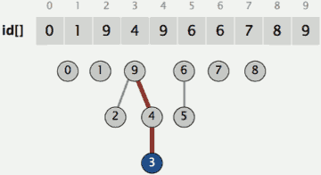

 - Find. Check if p and q have the same root.
 - Union. To merge components containing p and q, set the id of p's root to the id of q's root.
    - e.g. to connect 3 and 5 , set the 3's root (9) to 5's root (6) 
    - `id[9] = 6`

 - Cost model. Number of array accesses (for read or write).


algorithm | initialize | union | find
--- | --- | --- | --- 
quick-find | N | N | 1
quick-union | N | N⁺ | N(worst cast)

 - `⁺` includes cost of finding roots


 - Quick-find defect.
    - Union too expensive (N array accesses).
 - Quick-union defect.
    - Trees can get tall.
    - Find too expensive (could be N array accesses).

<h2 id="f867a4fdb09b251cca05d0a8937af271"></h2>


## improvements

<h2 id="ffd277ffee445dabbe1a2e6e83fae275"></h2>


### Improvement 1: weighting

 - Weighted quick-union.
    - Modify quick-union to avoid tall trees.
    - Keep track of size of each tree **(number of objects)**.
    - Balance by linking root of smaller tree to root of larger tree.
        - reasonable alternatives: p union by height or "rank"

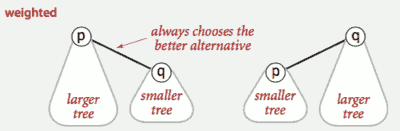

---

 - Data structure. Same as quick-union, but maintain extra array sz[i] to count number of objects in the tree rooted at i.
 - Find. Identical to quick-union.
    - `return root(p) == root(q);`
 - Union. Modify quick-union to:
    - Link root of smaller tree to root of larger tree.
    - Update the sz[] array.


 - Running time.
    - Find: takes time proportional to depth of p and q.
    - Union: takes constant time, if given roots.
 - Proposition. Depth of any node x is at most lgN.


algorithm | initialize | union | find
--- | --- | --- | --- 
quick-find | N | N | 1
quick-union | N | N⁺ | N(worst cast)
weighted QU | N | lgN⁺ | lgN

 - `⁺` includes cost of finding roots

<h2 id="f96ae0dc0ea4dbddd95e2813e4a8581a"></h2>


### Improvement 2: path compression

 - Quick union with path compression
    - Just after computing the root of p, set the id of each examined node to point to that root.

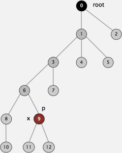

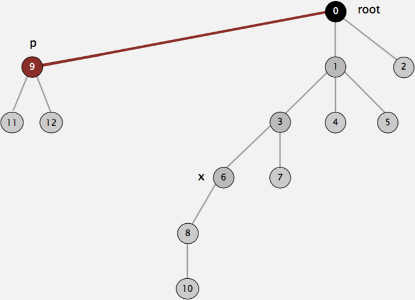


algorithm | worst case
--- | --- 
quick-find | MN
quick-union | MN 
weighted QU | N+MlgN
QU + path compression | N+MlgN
weight QU + path compression | N+Mlg<sup>\*</sup>N

 - M union-find operations on a set of N objects

 - Ex. [10⁹ unions and finds with 10⁹ objects]

---

<h2 id="da1a466c331146a618340e89aa655b05"></h2>


# 2.1 ELEMENTARY SORTS

<h2 id="03b785186d0322e5a1a31c105fc534ee"></h2>


## shuffling

 - How to shuffle an array
 - Goal. Rearrange array so that result is a uniformly random permutation.

<h2 id="1e7778f2afb3096f1731d0f25daf0fd1"></h2>


### Shuffle sort

 - Generate a random real number for each array entry.
    - useful for shuffling columns in a spreadsheet
 - Sort the array.
 - Proposition. Shuffle sort produces a uniformly random permutation of the input array, provided no duplicate values.
    - assuming real numbers uniformly at random

<h2 id="18bfcbf8d708ee9650922d916c1d595b"></h2>


### Knuth shuffle

 - In iteration i, pick integer r between 0 and i uniformly at random
 - Swap a[i] and a[r].

 - Proposition. [Fisher-Yates 1938] Knuth shuffling algorithm produces a uniformly random permutation of the input array in linear time.
    - assuming integers uniformly at random

```java
public static void shuffle(Object[] a)
{
    int N = a.length;
    for (int i = 0; i < N; i++)
    {
        // between 0 and i
        int r = StdRandom.uniform(i + 1);
        exch(a, i, r);
    }
}
```

<h2 id="ab573f869e7d3b25f303d40501ee42dd"></h2>


## convex hull

 - The **convex hull** of a set of N points is the smallest perimeter fence enclosing the points.

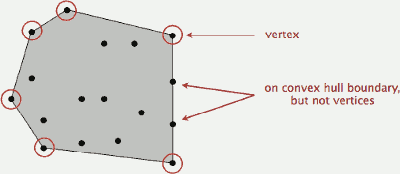

 - Convex hull output. Sequence of vertices in counterclockwise order.

<h2 id="f7b4a7d0272cd3b9f0aa24e173a8ac02"></h2>


### Convex hull: mechanical algorithm

 - Mechanical algorithm
    - Hammer nails perpendicular to plane; stretch elastic rubber band around points.

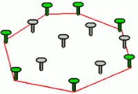


<h2 id="c8cac5868b416483f56438fb9751cfa8"></h2>


### Convex hull application: motion planning
 
 - Robot motion planning
    - Find shortest path in the plane from s to t that avoids a polygonal obstacle.
 - Fact. Shortest path is either straight line from s to t or it is one of two polygonal chains of convex hull.

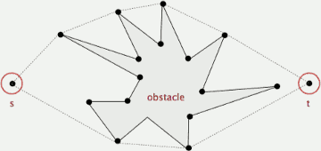

<h2 id="574a49cf3281b0f2c959e58ae347a715"></h2>


### Convex hull application: farthest pair

 - Farthest pair problem
    - Given N points in the plane, find a pair of points with the largest Euclidean distance between them.
 - Fact. Farthest pair of points are extreme points on convex hull.

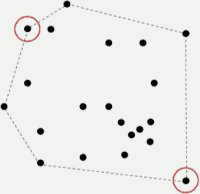

<h2 id="f4c2d0947e883517a2af0291794043e0"></h2>


### Convex hull: geometric properties

 - Fact. Can traverse the convex hull by making only counterclockwise turns.
 - Fact. The vertices of convex hull appear in increasing order of polar angle with respect to point p with **lowest y-coordinate**.

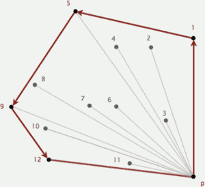

<h2 id="0e0d735e6d928983e7ce806c574de983"></h2>


### Graham scan

 - Choose point p with smallest y-coordinate.
 - Sort points by polar angle with p.
 - Consider points in order; discard unless it create a ccw turn.

<h2 id="63899fcbf3cd4f4fe086e6cf6229b75f"></h2>


### Implementing ccw

 - CCW. 
    - Given three points a, b, and c, is a → b → c a counterclockwise turn?
    - is c to the left of the ray a→b 

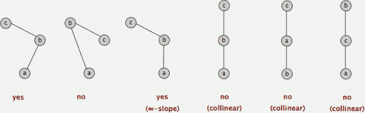

 - Lesson. Geometric primitives are tricky to implement.
    - Dealing with degenerate cases.
    - Coping with floating-point precision.
 - Determinant (or cross product) > 0 , then a → b → c is counterclockwise.


<h2 id="53743c83882b2e0a5016648231ccb9bd"></h2>


### Polar Order

 - Polar order. Given a point p, order points by polar angle they make with p.

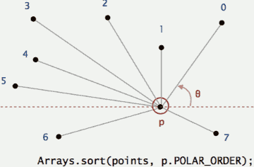

 - High-school trig solution. Compute polar angle θ w.r.t. p using atan2().
 - Drawback. Evaluating a trigonometric function is expensive.
 - A ccw-based solution.
    - If q1 is above p and q2 is below p, then q1 makes smaller polar angle.
    - If q1 is below p and q2 is above p, then q1 makes larger polar angle.
    - Otherwise, ccw(p, q1, q2) identifies which of q1 or q2 makes larger angle.

```java
private class PolarOrder implements Comparator<Point2D>A {
    public int compare(Point2D q1, Point2D q2) {
        double dy1 = q1.y - y;
        double dy2 = q2.y - y;    
        if      (dy1 == 0 && dy2 == 0) { ... }  // horizontal
        else if (dy1 >= 0 && dy2 < 0) return -1;
        else if (dy2 >= 0 && dy1 < 0) return +1;
        else return -ccw(Point2D.this, q1, q2);
    }   
}
```


---

<h2 id="0f231cf5608bbdbebfc5195f998dddf0"></h2>


# 2.2 MERGESORT

<h2 id="7da6be45309d0c6b5cd3d0c9770ab1db"></h2>


## Two classic sorting algorithms

 - Mergesort
    - Java sort for objects.
    - Perl, C++ stable sort, Python stable sort, Firefox JavaScript, ...
 - Quicksort. [next lecture]
    - Java sort for primitive types.
    - C qsort, Unix, Visual C++, Python, Matlab, Chrome JavaScript, ...

<h2 id="2d20788503105e07ffecf0a832e5a1d6"></h2>


## Merge Sort 

 1. divide into 2 parts, recursively sort each of them
 2. merge those 2 sorted array 
    - need an extra N length array to **merge**

<h2 id="f1579c6456d1081d1fb1fab0538c9fd0"></h2>


## Mergesort: practical improvements

 - Use insertion sort for small subarrays.
    - Mergesort has too much overhead for tiny subarrays.
    - Cutoff to insertion sort for ≈ 7 items.


<h2 id="7b2970d4873d39e47447102079af953b"></h2>


## Stability

 - A typical application. First, sort by name; **then** sort by section.
 - Q. Which sorts are stable?
    - A. Insertion sort and mergesort (but not selection sort or shellsort).

---

<h2 id="0145c61a0daa592012099167c895b26f"></h2>


## 2.3 QUICKSORT

 0. shuffle 
 1. partition , for some j,   left < j < right , into 2 pieces
 2. sort each piece recursively  

```java
public static void sort(Comparable[] a) {
    // shuffle before sort , 1 times
    StdRandom.shuffle(a);
    sort(a, 0, a.length - 1);
}

private static void sort(Comparable[] a, int lo, int hi) {
    if (hi <= lo) return;
    int j = partition(a, lo, hi);
    sort(a, lo, j-1);
    sort(a, j+1, hi);
}
```


<h2 id="8d035825ac310d00799b8e0218304083"></h2>


### Quicksort properties 

 - in-place  
 - not stable

<h2 id="cb0ba743125423b1e1e3bc3e08c9a02c"></h2>


### Quicksort: practical improvements

 - Insertion sort small subarrays.


<h2 id="c33b4377d843f4b615014192187f269f"></h2>


## Quick-select

 - Goal. Given an array of N items, find a k<sub>th</sub> smallest item.
 - Quick-select takes linear time on average.

---
