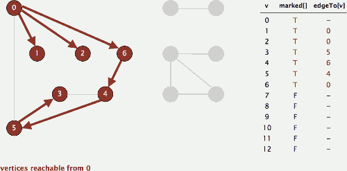
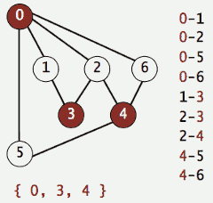
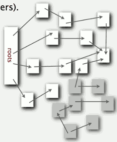
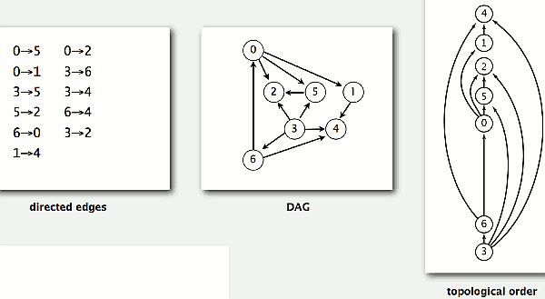
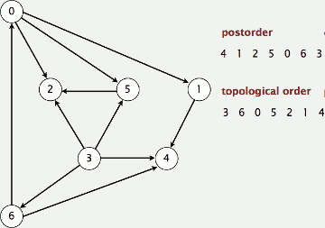
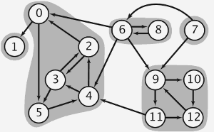
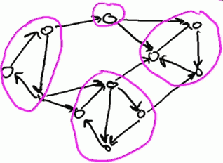
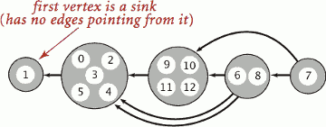

...menustart

- [Graph](#4cdbd2bafa8193091ba09509cedf94fd)
- [4.1 Undirected Graphs](#8a2c8888eec23acf4be67a33b9be6fb5)
    - [Depth-first search](#c9792b88744788472d9532827650ed61)
    - [Breadth-first search](#9f5783932f655ffe3908ff7d3410497e)
    - [connected components](#4f075a5c6b893a805fb941a4db775c4a)
    - [challenges](#6b393b6b209b981e9c552d3d3814c420)
        - [Graph-processing challenge 1](#2456b0a94d181fa5acdc222379fa31a4)
        - [Graph-processing challenge 2](#d0c6e57f517565d2345c41932e4dc87d)
        - [Graph-processing challenge 3](#a4021ddbdacdc95fe954ced6fcbb0ede)
        - [Graph-processing challenge 4](#cf914ca85d408d62a2a1516a25f8e447)
        - [Graph-processing challenge 5](#5da01db9ac6e1d4794f12d241f02b364)
        - [Graph-processing challenge 6](#5fddb61a31eb31f5def11f0602585786)
    - [Questions](#6ce3bdc39e544725038e0e87b771db1e)
        - [Diameter and center of a tree](#5b4ecf427bc18de53a5c801f386c6c91)
        - [Euler cycle.](#e587cf6e48e5962824675f4d75ae6ebb)
- [4.2 Directed Graphs](#6b40f342b24bb4dd337d6e975bc81e1b)
    - [digraph search](#fac13f50fe5cb105f583268b2e58ee49)
        - [Depth-first search in digraphs](#880d06ec2473d3c18e0271c16f4cf125)
        - [Depth-first search in digraphs summary](#8fa51b970e3f3fa377f28a3a9afa6f29)
        - [Breadth-first search in digraphs](#d45bcb0c4de24ae91cbd8c1ddaa95dc1)
    - [Topological Sort](#3f9c4755d1b2c530f17ce3f80a0fb896)
        - [Precedence scheduling](#43a816705a6096bcad303b50bf740746)
        - [Topological sort](#62ee2b89caa19cc2a566a5ea91336292)
        - [Directed cycle detection](#71fb8dfa2678cc85259174067fbb7bb2)
    - [strong components](#4c16fa64d0ac59c4e44c2b55e9a532cf)
        - [Strongly-connected components](#d0a679dff20875ea17dcf0679ddd9ae9)
        - [Kosaraju-Sharir algorithm: intuition](#78bc7c6434676c150d3fcd374edb673d)
        - [Kosaraju-Sharir algorithm](#9844834019d43e5059b822f482b610df)
        - [Digraph-processing summary: algorithms of the day](#9b34efa15d2453e1e219c449b0fbf698)
    - [Digraph question](#ea0a68eef2b9a51cdfc378ef383ff7da)

...menuend


<h2 id="4cdbd2bafa8193091ba09509cedf94fd"></h2>


# Graph

**Representation**

- In practice. Use adjacency-lists representation.
    - Algorithms based on iterating over vertices pointing from v.
    - Real-world digraphs tend to be sparse.


<h2 id="8a2c8888eec23acf4be67a33b9be6fb5"></h2>


# 4.1 Undirected Graphs

- Maze graph
    - Trémaux maze exploration
        - Unroll a ball of string
        - 

<h2 id="c9792b88744788472d9532827650ed61"></h2>


## Depth-first search

- Typical applications
    - Find all vertices connected to a given source vertex
    - Find a path between two vertices
- Goal. Find all vertices connected to s (and a corresponding path).

```
pseudo cod
To visit a vertex v :
    - Mark vertex v as visited.
    - Recursively visit all unmarked vertices adjacent to v.
```

- Data structures
    - `boolean[] marked` to mark visited vertices
    - `int[] edgeTo`  to keep tree of paths
        - (edgeTo[w] == v) means that edge v-w taken to visit w for first time
 
```java
// it is actually the `explore` method
// it explores node in a connected components
private void dfs(Graph G, int v)
{
    marked[v] = true;
    for (int w : G.adj(v))
        if (!marked[w])
        {
            dfs(G, w);
            edgeTo[w] = v;
        }
} 
```



- Proposition
    - DFS marks all vertices connected to *s* in time proportional to the sum of their degrees.
    - After DFS, can find vertices connected to *s* in constant time and can find a path to *s* (if one exists) in time proportional to its length.

```java
pubilc boolean hasPathTo(int v)
{  
    return marked[v];  
}
public Iterable<Integer> pathTo(int v)
{
    if (!hasPathTo(v)) return null;
    Stack<Integer> path = new Stack<Integer>();
    // find path node excludes source node
    for (int x = v; x != s; x = edgeTo[x])
        path.push(x);
    // add the source node to complete the path
    path.push(s);
    return path;
}
```

<h2 id="9f5783932f655ffe3908ff7d3410497e"></h2>


## Breadth-first search

```
// pseudo code
BFS (from source vertex s)
    
Put s onto a FIFO queue, and mark s as visited.
Repeat until the queue is empty:
    remove the least recently added vertex v
    add each of v's unvisited neighbors to the queue
    and mark them as visited
```

- replace `queue` with stack ,and this algorithm can work as DFS.

- Proposition
    - BFS computes shortest paths (fewest number of edges) from *s* to all other vertices in a graph in time proportional to E + V.

---

```java
private void bfs(Graph G, int s)
{
    Queue<Integer> q = new Queue<Integer>();
    q.enqueue(s);
    marked[s] = true;
    while (!q.isEmpty())
    {
        int v = q.dequeue();
        for (int w : G.adj(v))
        {
            if (!marked[w])
            {
                q.enqueue(w);
                marked[w] = true;
                edgeTo[w] = v;
            }
        } // end for
    } // end while
} // end bfs
```

**BFS,DFS的应用，一般只会访问一个节点一次; Astar这类graph search算法往往需要多次访问同一个节点**

<h2 id="4f075a5c6b893a805fb941a4db775c4a"></h2>


## connected components

- GOAL: Preprocess graph to answer queries of the form is v connected to w?  in constant time.
    - Union-Find? Not quite.
    - Depth-first search. Yes. 
- Goal: Partition vertices into connected components.

```
// pseudo code
Connected components

initialize all vertices v as unmarked.
For each unmarked vertex v, run DFS to identify all
vertices discovered as part of the same component.
```

```java
private boolean[] marked;
// id[v] = (index or ID of component)
private int[] id; 
// record component index
private int count; 

public CC(Graph G) {
    marked = new boolean[G.V()];
    id = new int[G.V()];
    for (int v = 0; v < G.V(); v++) {
        if (!marked[v])
        {
            // run DFS from one vertex
            // in each component
            dfs(G, v);
            count++; 
        } // end if
    } // end for
} // end CC

private void dfs(Graph G, int v)
{
    marked[v] = true;
    // all vertices discovered in same 
    // call of dfs have same id
    id[v] = count ;
    for (int w : G.adj(v))
        if (!marked[w])
            dfs(G, w);
}
```

<h2 id="6b393b6b209b981e9c552d3d3814c420"></h2>


## challenges

<h2 id="2456b0a94d181fa5acdc222379fa31a4"></h2>


### Graph-processing challenge 1

- Problem: Is a graph bipartite?
    - what **bipartite** means is you can divide the vertices into 2 subsets with the property that every edge connect a vertex in one subset  to a vertex in another.
    - 
    - in this caes , we can colorize 0,3,4 in red , so that each edge will connect a red vertex and a white vertex.
- simple DFS-based solution

<h2 id="d0c6e57f517565d2345c41932e4dc87d"></h2>


### Graph-processing challenge 2

- Problem. Find a cycle. 
    - does the graph exist a cycle ?
- simple DFS-based solution
- mark *visited*  later,  when exporing a node, mark it as *visiting* and mark it *visited* only when the sub-exploring done.
    - if we encouter a vertex that is in *visiting*,  that is , I want to mark it as *visiting* but it already have been , which means that we found a circle?

<h2 id="a4021ddbdacdc95fe954ced6fcbb0ede"></h2>


### Graph-processing challenge 3

- Problem. Find a (general) cycle that uses every edge exactly once.
- Bridges of Königsberg (柯尼斯堡七桥问题)
    - **Euler tour**: Is there a (general) cycle that uses each edge exactly once?
    - **Euler's theorem**
        - 欧拉路径(Euler path): 路径包括每个边恰好一次
            - the number of odd degree vertices , equals  0 or 2.
        - 欧拉回路(Euler circuit): 回路是欧拉路径 
            - A connected graph is Eulerian iff all vertices have even degree.
        - 如果连通无向图 G 有 2k 个奇顶点，那么它可以用 k 笔画成，并且至少要用 k 笔画成

<h2 id="cf914ca85d408d62a2a1516a25f8e447"></h2>


### Graph-processing challenge 4

- Problem. Find a cycle that visits every vertex exactly once.
    - traveling salesperson has to get to every city and wants to just go there once.
- Intractable
    - Hamiltonian cycle (classical NP-complete problem)

<h2 id="5da01db9ac6e1d4794f12d241f02b364"></h2>


### Graph-processing challenge 5

- Problem. Are two graphs identical except for vertex names?
    - Graph Isomorphism
- Nobody knows even how to classify this problem .
    - graph isomorphism is longstanding open problem

<h2 id="5fddb61a31eb31f5def11f0602585786"></h2>


### Graph-processing challenge 6

- Problem. Lay out a graph in the plane without crossing edges? 
- Hire an expert.
    - linear-time DFS-based planarity algorithm discovered by Tarjan in 1970s
    - too complicated for most practitioners

<h2 id="6ce3bdc39e544725038e0e87b771db1e"></h2>


## Questions 

<h2 id="5b4ecf427bc18de53a5c801f386c6c91"></h2>


### Diameter and center of a tree

- Given a connected graph with no cycles
- Diameter: design a linear-time algorithm to find the longest simple path in the graph.
    - to compute the diameter, pick a vertex s; run BFS from s; then run BFS again from the vertex that is furthest from s.
- Center: design a linear-time algorithm to find a vertex such that its maximum distance from any other vertex is minimized.
    - consider vertices on the longest path.


<h2 id="e587cf6e48e5962824675f4d75ae6ebb"></h2>


### Euler cycle.

- Design a linear-time algorithm to determine whether a graph has an Euler cycle, and if so, find one.
- use depth-first search and piece together the cycles you discover.

---

<h2 id="6b40f342b24bb4dd337d6e975bc81e1b"></h2>


# 4.2 Directed Graphs

- Some digraph problems
    - **Path**. Is there a directed path from s to t ?
    - **Shortest path**. What is the shortest directed path from s to t ?
    - **Topological sort**. Can you draw a digraph so that all edges point upwards?
    - **Strong connectivity**. Is there a directed path between all pairs of vertices?
    - **Transitive closure**. For which vertices v and w is there a path from v to w ?
    - **PageRank**. What is the importance of a web page?

<h2 id="fac13f50fe5cb105f583268b2e58ee49"></h2>


## digraph search

- Reachability
    - Problem. Find all vertices reachable from s along a directed path

<h2 id="880d06ec2473d3c18e0271c16f4cf125"></h2>


### Depth-first search in digraphs

- Depth-first search in digraphs
    - Same method as for undirected graphs.
        - Every undirected graph is a digraph (with edges in both directions).
        - DFS is a **digraph** algorithm. 
- Reachability application: program control-flow analysis
    - Every program is a digraph.
        - Vertex = basic block of instructions (straight-line program).
        - Edge = jump.
    - Dead-code elimination.
        - Find (and remove) unreachable code.
        - Infinite-loop detection.
- Reachability application: mark-sweep garbage collector
    - Every data structure is a digraph.
        - Vertex = object.
        - Edge = reference.
    - Roots. Objects known to be directly accessible by program (e.g., stack).
    - Reachable objects. Objects indirectly accessible by program (starting at a root and following a chain of pointers).
        -

<h2 id="8fa51b970e3f3fa377f28a3a9afa6f29"></h2>


### Depth-first search in digraphs summary

- DFS enables direct solution of simple digraph problems.
    - Reachability
    - Path finding
    - Topological sort
    - Directed cycle detection
- Basis for solving difficult digraph problems
    - 2-satisfiability
    - Directed Euler path
    - Strongly-connected components

<h2 id="d45bcb0c4de24ae91cbd8c1ddaa95dc1"></h2>


### Breadth-first search in digraphs

- Same method as for undirected graphs.
    - Every undirected graph is a digraph (with edges in both directions).
    - BFS is a **digraph** algorithm.
- Proposition
    - BFS computes shortest paths (fewest number of edges) from s to all other vertices in a digraph in time proportional to E + V.
- Multiple-source shortest paths
    - Given a digraph and a **set** of source vertices, find shortest path from any vertex in the set to other vertex.
    - Q. How to implement multi-source shortest paths algorithm?
        - A. Use BFS, but initialize by enqueuing all source vertices.
- Breadth-first search in digraphs application: web crawler
    - Goal. Crawl web, starting from some root web page, say www.princeton.edu.
    - Solution. [BFS with implicit digraph]
        - Choose root web page as source *s*.
        - Maintain a *Queue* of websites to explore
        - Maintain a *SET* of discovered websites
        - Dequeue the next website and enqueue websites to which it links (provided you haven't done so before).
    - Q. Why not use DFS?
        - A. One reason is you're gonna go far away in your search for the web.

<h2 id="3f9c4755d1b2c530f17ce3f80a0fb896"></h2>


## Topological Sort

<h2 id="43a816705a6096bcad303b50bf740746"></h2>


### Precedence scheduling

- Goal. Given a set of tasks to be completed with precedence constraints, in which order should we schedule the tasks?
- Digraph model
    - vertex = task
    - edge = precedence constraint
- example
    - 


<h2 id="62ee2b89caa19cc2a566a5ea91336292"></h2>


### Topological sort

- **DAG**. Directed acyclic graph.
- **Topological sort**. Redraw DAG so all edges point upwards.
- 
- Solution. DFS. 
    - What else solutions ?  might be hard to find a different way
    - just run DFS
    - but there's a particular point at which we want to take the vertices out to get the roder , and
        - what we do is when we do the DFS, when we're done with the vertex ( `done` means that vertex has no out-degree ), we put it on a stack or put it out.
            - 有 out-degree ，但是连接的 vertex 已经访问过，也算 `done`
            - then trace back to vertex 1 

    - that's called reverse DFS postorder.
    - 

```java
public class DepthFirstOrder {
    private boolean[] marked;
    private Stack<Integer> reversePost; // 1

    public DepthFirstOrder(Digraph G) {
        reversePost = new Stack<Integer>(); //2
        marked = new boolean[G.V()];
        for (int v = 0; v < G.V(); v++)
            if (!marked[v]) explore(G, v);
    }

    private void explore(Digraph G, int v) {
        marked[v] = true;
        for (int w : G.adj(v))
            if (!marked[w]) explore(G, w);
        reversePost.push(v);  // 3
    }

    // 4      
    public Iterable<Integer> reversePost() {  
        ArrayList<Integer> l = new ArrayList<Integer>() ;
        while ( reversePost.size()>0 ) {
            l.add(  reversePost.pop()  ) ;   
        }
        return l ;
    }
}
```

- **Proposition**. Reverse DFS postorder of a DAG is a topological order.
- Running Time : O(m+n)


<h2 id="71fb8dfa2678cc85259174067fbb7bb2"></h2>


### Directed cycle detection

- **Proposition**. A digraph has a topological order iff no directed cycle.
- Pf.
    - If directed cycle,  topological order impossible.
    - If no directed cycle, DFS-based algorithm finds a topological order.
- Goal. Given a digraph, find a directed cycle.
- Solution. **DFS**. What else? See textbook.
- Directed cycle detection application: precedence scheduling
    - Scheduling. Given a set of tasks to be completed with precedence constraints, in what order should we schedule the tasks?
    - Remark. A directed cycle implies scheduling problem is infeasible.
- Directed cycle detection application: cyclic inheritance
    - The Java compiler does cycle detection.


<h2 id="4c16fa64d0ac59c4e44c2b55e9a532cf"></h2>


## strong components

<h2 id="d0a679dff20875ea17dcf0679ddd9ae9"></h2>


### Strongly-connected components
 
- Def. Vertices v and w are **strongly connected** if there is both a directed path from v to w and a directed path from w to v.
- Key property. Strong connectivity is an **equivalence relation**:
    - v is strongly connected to v
    - If v is strongly connected to w, then w is strongly connected to v.
    - If v is strongly connected to w and w to x, then v is strongly connected to x.
- Def. A **strong component** is a maximal subset of strongly-connected vertices.
    - 
- 强连通图必然有环
    - so if a graph has no directed cycle, the number of SCC must equal to the number of vertices
- Strong component application: software modules
    - Vertex = software module.
    - Edge: from module to dependency.
    - Strong component. Subset of mutually interacting modules.
    - Approach 1. Package strong components together.
    - Approach 2. Use to improve design!
    


- 如上图，如果我们从 最右侧的SCC 中的任意一个 node开始查找, DFS可以找到这3个nodes 组成的SCC; 但是 如果最下面的 node开始查找, DFS会找到下方和右方两个SCC的集合; 如果我们直接从最左边的 node 开始查找，则DFS会找到整个graph.
- 可以看到，从不同的node开始DFS, 会得到不同的结果. 所以，在应用DFS之前，我们需要一步预处理: 我们需要一个正确的 node 访问顺序。

<h2 id="78bc7c6434676c150d3fcd374edb673d"></h2>


### Kosaraju-Sharir algorithm: intuition

- Reverse graph. Strong components in G are same as in Gᴿ.
    - 转置图（同图中的每边的方向相反）具有和原图完全一样的强连通分量
- Kernel DAG. Shrink each strong component into a single vertex. 
- Idea.
    - Compute topological order (reverse postorder) in kernel DAG.  (how to ?)
    - Run DFS, considering vertices in reverse topological order.



> kernel DAG of G (in reverse topological order)

<h2 id="9844834019d43e5059b822f482b610df"></h2>


### Kosaraju-Sharir algorithm

- Phase 1. run DFS on Gᴿ to compute reverse postorder .
    - 确定 phase 2 DFS 的vertex 访问顺序
- Phase 2. run DFS on G, considering vertices in order given by first DFS
    - 注意，这里我们恢复到 原图G了，我们在 原图G上执行DFS
    - it is really same as to compute CC.

```java
private boolean[] marked;
// id[v] = (index or ID of component)
private int[] id; 
// record component index
private int count; 

public SCC(Digraph G) {
    marked = new boolean[G.V()];
    id = new int[G.V()];
    // +
    DepthFirstOrder dfs = new DepthFirstOrder(G.reverse());
    // m 
    for (int v : dfs.reversePost())
    //for (int v = 0; v < G.V(); v++) 
    {
        if (!marked[v])
        {
            // run DFS from one vertex
            // in each component
            dfs(G, v);
            count++; 
        } // end if
    } // end for
} // end CC

private void dfs(Digraph G, int v)
{
    marked[v] = true;
    // all vertices discovered in same 
    // call of dfs have same id
    id[v] = count ;
    for (int w : G.adj(v))
        if (!marked[w])
            dfs(G, w);
}
```


- Compare to compute CC , there is only 2 lines different.
- PS. The DFS in the 1st phase (  to compute reverse postorder ) is crucial;  in the 2nd phase , any algorithm that marks the set of vertices reachable from a given vertex will do.  Since Strong components in G are same as in Gᴿ , you also can run DFS on Gᴿ then run DFS on G which will get the same result.

---

- Simple (but mysterious) algorithm for computing strong components.
- Proposition. Kosaraju-Sharir algorithm computes the strong components of a digraph in time proportional to E + V.
- Pf.
    - Running time: bottleneck is running DFS twice (and computing Gᴿ).
    - Implementation: easy!

<h2 id="9b34efa15d2453e1e219c449b0fbf698"></h2>


### Digraph-processing summary: algorithms of the day

problem | algorithm
---|---
single-source reachability in a digraph | DFS
topological sort in a DAG | DFS
strong components in a digraph | Kosaraju-Sharir DFS (twice)

<h2 id="ea0a68eef2b9a51cdfc378ef383ff7da"></h2>


## Digraph question

- Shortest directed cycle
    - Given a digraph G, design an efficient algorithm to find a directed cycle with the minimum number of edges.
        - The running time of your algorithm should be at most proportional to V(E+V) and use space proportional to E+V,
    - A: run BFS from each vertex.
- Hamiltonian path in a DAG
    - Given a directed acyclic graph, design a linear-time algorithm to determine whether it has a Hamiltonian path (a simple path that visits every vertex), and if so, find one.
    - A: topological sort  ( DAG 经过一个vertex 就回不去了 )
- Reachable vertex
    - DAG: Design a linear-time algorithm to determine whether a DAG has a vertex that is reachable from every other vertex, and if so, find one.
        - A: compute the outdegree of each vertex.
    - Digraph: Design a linear-time algorithm to determine whether a digraph has a vertex that is reachable from every other vertex, and if so, find one.
        - A: compute the strong components and look at the kernel DAG . Then it leads to the previous DAG problem.


