...menustart

 - [4.3 MINIMUM SPANNING TREES](#cded71731adc3237f9d3c51dd89049c0)
     - [introduction](#8800e1c9b3e22c44ba59a34db3fe4841)
         - [Example Problem](#fa051064ee16bea712664bb248654763)
     - [greedy algorithm](#a9728ca20b5c52a76d67320f3fe3ec4e)
         - [Cut property](#f027e6426815659632b54ae818592211)
         - [Greedy MST algorithm](#5d1da5f08e2888d73349900d4db5c622)
         - [Greedy MST algorithm: correctness proof](#bdd4ba94c65abf3884971d7a8b7cb542)
         - [Removing two simplifying assumptions](#3d825bc82fff7cd0178bee0eb6d5c38e)
     - [Kruskal's algorithm](#5efdc253657f5526080aea52d632d9a9)
         - [Kruskal's algorithm](#5efdc253657f5526080aea52d632d9a9)
         - [Kruskal's algorithm: correctness proof](#ea2e8ed0f2060e40803d07b642e735dd)
         - [Kruskal's algorithm: implementation challenge](#6769f30cada6dad70abd9ec0e78fab39)
         - [Kruskal's algorithm: running time](#6c146d59dece811375bd56462f359767)
     - [Prim's algorithm](#9f18a401049668114eca679e98d5f2e1)
         - [Prim's algorithm](#9f18a401049668114eca679e98d5f2e1)
         - [Prim's algorithm: proof of correctness](#38cd4863a58c575a66fc80ab33a4b1b0)
         - [Prim's algorithm: implementation challenge](#ca5d698ccb98d8b805ad4456d828f20c)
         - [Lazy Prim's algorithm: running time](#6da63afd831a4613957674b1c0c78ca5)
         - [Prim's algorithm: eager implementation](#ab84d0fc34342968251318250a1bf5d3)
             - [Indexed priority queue](#64071a409f7f87287eed62ffd412bc0e)
             - [Implementation](#b672f52ade975e864ae6b58722c03689)
     - [QA](#0ab687c6a13802a6674d5327e3d4177e)
 - [4.4 SHORTEST PATHS](#66c555dd7127e24c5dad2b9bbc2b1818)
     - [shortest-paths properties](#582ea71a838abce9407ad2a894dbea08)
         - [Data structures for single-source shortest paths](#68261b4718c4139e54fff81468a562c5)
         - [Edge relaxation](#f1800f07c216d493e8e9ff2761ccfc33)
         - [Shortest-paths optimality conditions](#a0dbfd20d8d788e69eee52223da9cc90)
         - [Generic shortest-paths algorithm](#17660e379f4dc4040c1d93faf73d5f9c)
     - [Dijkstra's algorithm](#2c3fda14bde328549c74fb448ef62d34)
         - [Dijkstra's algorithm: correctness proof (TODO)](#2880931f98f3fff633812cf6fcf35e45)
         - [Dijkstra's algorithm: Java implementation](#f1d4978722895ce40af6d3ebe0c8c6c0)
         - [Computing spanning trees in graphs](#5d21b219a367d8ca1eb434230c3f4be1)
     - [edge-weighted DAGs](#d7c7b1975f92a833609b519faa4ed829)
         - [Acyclic edge-weighted digraphs](#a2c4d444ac852b90752f7a63ec59e581)
         - [Shortest paths in edge-weighted DAGs](#fcbd840d9edcaf804b1bd65b6e72badc)
             - [Application: Content-aware resizing](#5ee07047d6bca78383a141e5e8ec77ce)
         - [Longest paths in edge-weighted DAGs](#3c55cda3adffaa472aa7490b10892ab8)
             - [Longest paths in edge-weighted DAGs: application](#2160c4ec3d4551c21c4e80c16718ad43)
             - [Critical path method](#2f8af766796a78ffe5aa21acf6f9f6b9)
     - [negative weights](#00bb6ece1156f92c2370e55696fbc73c)
         - [Shortest paths with negative weights: failed attempts](#e60a7af8652792b3d2649ee453b4c196)
         - [Negative cycles](#d05e7fb4b74623a5da219bc192056e4a)
         - [Bellman-Ford algorithm](#bc4dcba35afdbb28dfbf17b06b64e8d1)
         - [Bellman-Ford algorithm: analysis](#875643e3ddfa7b4322582d5fdb5a16d1)
         - [Bellman-Ford algorithm: practical improvement](#252d97af220bba63a2b709f462d4d19f)
         - [Single source shortest-paths implementation: cost summary](#297a63d92dca03fcf471996d66e9b44b)
         - [Finding a negative cycle](#9b60ad9b0b7957c904f64920f0bbfa7d)
         - [Negative cycle application: arbitrage detection](#5cf18acbf86bf2c1e691a77579f9c0a4)
     - [Questions](#6ce3bdc39e544725038e0e87b771db1e)
     - [Shortest paths summary](#4ccfbaa8088f52afb0f66af1fd3c0489)

...menuend


<h2 id="cded71731adc3237f9d3c51dd89049c0"></h2>


# 4.3 MINIMUM SPANNING TREES

<h2 id="8800e1c9b3e22c44ba59a34db3fe4841"></h2>


## introduction

 - Given. Undirected graph *G* with positive edge weights (connected).
 - Def. A **spanning tree** of *G* is a subgraph *T* that is both a **tree**  and **spanning** .
    - **tree** means it is connected and acyclic
    - **spanning** means it includes all of the vertices
 - Goal. Find a min weight spanning tree.

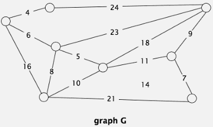


 - Brute force. Try all spanning trees?

<h2 id="fa051064ee16bea712664bb248654763"></h2>


### Example Problem

 - 有一块木板，板上钉上了一些钉子，这些钉子可以由一些细绳连接起来。假设每个钉子可以通过一根或者多根细绳连接起来，那么一定存在这样的情况，即用最少的细绳把所有钉子连接起来
 - 在某地分布着N个村庄，现在需要在N个村庄之间修路，每个村庄之前的距离不同，问怎么修最短的路，将各个村庄连接起来。
 - 以上这些问题都可以归纳为最小生成树问题


<h2 id="a9728ca20b5c52a76d67320f3fe3ec4e"></h2>


## greedy algorithm

 - Simplifying assumptions.
    - Edge weights are distinct (no two edge weights are equal).
    - Graph is connected.
 - Consequence
    - MST exists and is unique.

<h2 id="f027e6426815659632b54ae818592211"></h2>


### Cut property

 - Def. A **cut** in a graph is a partition of its vertices into two (nonempty) sets.
    - 对图切一刀，把顶点分成两份
 - Def. A **crossing edge** connects a vertex in one set with a vertex in the other.
 - Cut property. Given any cut, the crossing edge of min weight is in the MST.
    - The cut defines a set of crossing edges. 
    - The minimum weight crossing edge is in the MST.
    - Remember no two edges have the same weight so there's a single edge that has minimum weight in the crossing edges of a cut.
    - 描述了一个 cut 和 MST 的联系

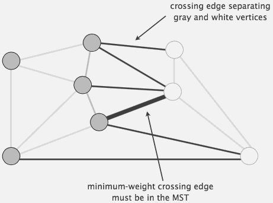

 - Proof.
    - Suppose min-weight crossing edge *e* is not in the MST.
    - Adding *e* to the MST creates a cycle.
    - Some other edge *f* in cycle must be a crossing edge.
        - Otherwise the MST wouldn't be connected
    - Removing *f* and adding *e* is also a spanning tree.
    - Since weight of *e* is less than the weight of *f*, that spanning tree is lower weight.
    - Contradiction.
 - now given that property, we can develop what's called a greedy algorithm

<h2 id="5d1da5f08e2888d73349900d4db5c622"></h2>


### Greedy MST algorithm

Easiest algorithm, we can come up with. 

 - Start with all edges colored gray.
 - Find cut with no black crossing edges; color its min-weight edge black.
    - The algorithm's going to color some of the edges black. 
    - And color the minimum-weight edge of that cut black, and just repeat the algorithm. 
    - when you cut, 避开那些已经被染黑的边
    - As we get more and more black edges it's going to be harder to find a cut with no black crossing edges. 
 - Repeat until V - 1 edges are colored black.
    - And the claim is that that's going to compute an MST. 

<h2 id="bdd4ba94c65abf3884971d7a8b7cb542"></h2>


### Greedy MST algorithm: correctness proof

 - Proposition. The greedy algorithm computes the MST.
 - Proof
    - Any edge colored black is in the MST (via cut property).
    - Fewer than V - 1 black edges => cut with no black crossing edges.
        - means, when we have fewer than v-1 black edges, there has to be a cut that has no black crossing edges. so that the algorithm doesn't get stuck.
        - the way to think about that is just take he verticies in one of the connected components ( vertices connected by black edges ), and make that the cut. Since that's a connected component , there's gonna be no black edges in the crossing edges for that cut.  
        - if you don't have an MST yet, there's going to be some cut with no black edges. 

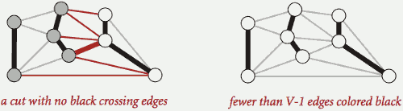

 - but how to implementations of the greedy algorithm ?
    - how we choose the cut? Which cut are we going to use? And also, how to find the minimum weight edge in the cut?
    - Those could both be expensive operations. And prohibitively expensive for huge graphs. 
 - Efficient implementations. Choose cut? Find min-weight edge?
    1. Kruskal's algorithm. [stay tuned]
    2. Prim's algorithm. [stay tuned]
    3. Borüvka's algorithm.
 - Before getting to those, what about removing the two simplifying assumptions? 

<h2 id="3d825bc82fff7cd0178bee0eb6d5c38e"></h2>


### Removing two simplifying assumptions

 - Q. What if edge weights are not all distinct?
 - A. Greedy MST algorithm still correct if equal weights are present!
    - there's multiple MSTs. 
    - 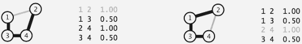
    - our correctness proof fails, but that can be fixed
 - Q. What if graph is not connected?
 - A. Compute minimum spanning forest = MST of each component.
    - 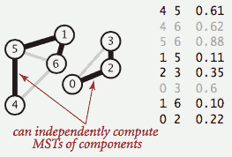

 - **Greed is good.**
    - Basically what the greedy algorithm gives us is an easy way to prove correctness for specific algorithms. 
    - And then we can prove correctness of a more complicated algorithm. 
    - In general, in algorithm design this is proven to be affective in all kinds of domains. 
    - Trying to come up with a general algorithm that you can prove works efficiently and then using that to help design 

---

<h2 id="5efdc253657f5526080aea52d632d9a9"></h2>


## Kruskal's algorithm

<h2 id="5efdc253657f5526080aea52d632d9a9"></h2>


### Kruskal's algorithm


 - Consider edges in ascending order of weight.
    - Add next edge to tree *T* unless doing so would create a cycle

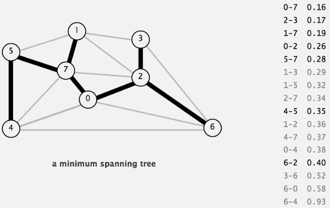

<h2 id="ea2e8ed0f2060e40803d07b642e735dd"></h2>


### Kruskal's algorithm: correctness proof

 - Proposition. *[Kruskal 1956]* Kruskal's algorithm computes the MST.
 - Proof
    - Kruskal's algorithm is a special case of the greedy MST algorithm
    - Suppose Kruskal's algorithm colors the edge `e = v–w` black.
    - Cut = set of vertices connected to *v* in tree *T*.
        - we'll define a cut. That is the set of vertices that are connected to v. 
        - So it might be just a v, but if theres any black edges connecting v to other vertices we put all of those in the cut. 
    - No crossing edge is black.
        - So for that cut there's no black crossing edge. Cuz it's a component. 
    - No crossing edge has lower weight. Why?
        - And the other thing is that there's no crossing edge with lower weight than `v-w`.
            - because we are considering the edges in increasing order of their weight. 

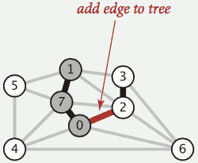


<h2 id="6769f30cada6dad70abd9ec0e78fab39"></h2>


### Kruskal's algorithm: implementation challenge

 - Challenge. Would adding edge `v–w` to tree *T* create a cycle? If not, add it.
 - How difficult?
    - E + V
    - V 
        - run DFS from v, check if w is reachable 
        - if v,w is reachable, adding edge `v-w` definitely will create a cycle.
    - logV
    - log\*V 
        - use the union-find data structure !
    - 1


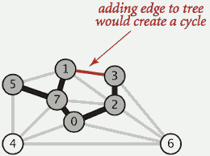


 - Efficient solution. Use the *union-find* data structure.
 
```java
public class KruskalMST {
    private Queue<Edge> mst = new Queue<Edge>();
    public KruskalMST(EdgeWeightedGraph G) {
        // build priority queue
        MinPQ<Edge> pq = new MinPQ<Edge>();
        for (Edge e : G.edges())
            pq.insert(e);

        UF uf = new UF(G.V());
        while (!pq.isEmpty() && mst.size() < G.V()-1) {
            // greedily add edges to MST
            Edge e = pq.delMin();
            int v = e.either(), w = e.other(v);
            // edge v–w does not create cycle
            if (!uf.connected(v, w)) {
                // merge sets
                uf.union(v, w);
                // add edge to MST
                mst.enqueue(e);
            }
        } 
    }
    public Iterable<Edge> edges() {  
        return mst;  
    }
}
```

<h2 id="6c146d59dece811375bd56462f359767"></h2>


### Kruskal's algorithm: running time

 - Proposition. Kruskal's algorithm computes MST in time proportional to *ElogE* (in the worst case).
 - Proof

operation | frequency | time per op
--- | --- | ---
build pq | 1 | ElogE
delete-min | E | logE
union | V | log\*V 
connected | E | log\*V 

 - Remark. If edges are already sorted, order of growth is Elog\*V.
    - recall: log\*V ≤ 5 in this universe

---

<h2 id="9f18a401049668114eca679e98d5f2e1"></h2>


## Prim's algorithm

<h2 id="9f18a401049668114eca679e98d5f2e1"></h2>


### Prim's algorithm

 - Start with vertex 0 and greedily grow tree *T*.
 - Add to *T* the min weight edge with exactly one endpoint in *T*
    - grow the tree one edge at a time, and always keeping it connected. 
 - Repeat until V-1 edges

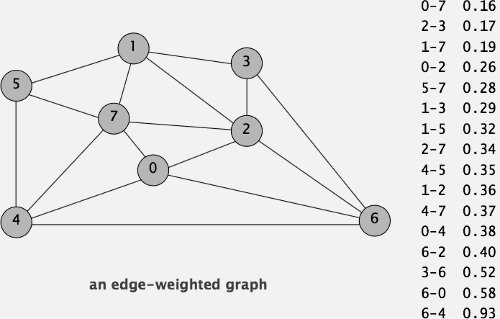

 - start from vertex 0, the minimum weight edge connect to 0 is 0-7 , so we add it, now we have a MST , it have only 2 vertices 0,7
 - now we have 7 edges connect to our MST, we add the minimum one : 1-7
 - repeat ...
 - finally MST edges: 
    - 0-7  1-7  0-2  2-3  5-7  4-5  6-2

<h2 id="38cd4863a58c575a66fc80ab33a4b1b0"></h2>


### Prim's algorithm: proof of correctness

 - Proposition. [Jarník 1930, Dijkstra 1957, Prim 1959] Prim's algorithm computes the MST.
 - Proof
    - Prim's algorithm is a special case of the greedy MST algorithm.
    - Suppose edge *e* = min weight edge connecting a vertex on the tree to a vertex not on the tree.
    - Cut = set of vertices connected on tree
    - No crossing edge is black.
    - No crossing edge has lower weight.

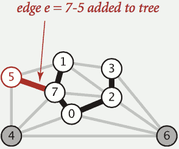

<h2 id="ca5d698ccb98d8b805ad4456d828f20c"></h2>


### Prim's algorithm: implementation challenge

 - Challenge. Find the min weight edge with exactly one endpoint in *T*.
 - How difficult?
    - E  :  try all edges
    - V 
    - logE : use a priority queue!
    - log\*E
    - 1
 - Lazy solution. Maintain a PQ of **edges** with (at least) one endpoint in *T*.
    - Key = edge; priority = weight of edge.
    - Delete-min to determine next edge `e = v–w` to add to *T*.
    - Disregard if both endpoints *v* and *w* are marked (both in *T*).
    - Otherwise, let *w* be the unmarked vertex (not in *T* ):
        - add to PQ any edge incident to *w* (assuming other endpoint not in *T*)
        - add *e* to *T* and mark *w*

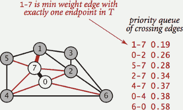

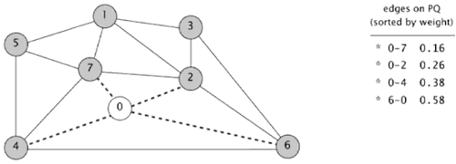

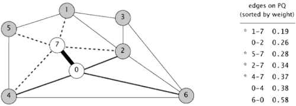

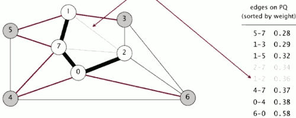

 - edge becomes obsolete ( 2-7, 1-2 ) , lazy implementation leaves on PQ.

```java
public class LazyPrimMST {
    private boolean[] marked; // MST vertices
    private Queue<Edge> mst;  // MST edges
    private MinPQ<Edge> pq;  // PQ of edges
    
    public LazyPrimMST(WeightedGraph G) {
        pq = new MinPQ<Edge>();
        mst = new Queue<Edge>();
        marked = new boolean[G.V()];
        // assume G is connected
        visit(G, 0);
        while (!pq.isEmpty() && mst.size() < G.V() - 1)
        {
            // repeatedly delete the min weight edge e = v–w from PQ
            Edge e = pq.delMin();
            int v = e.either(), w = e.other(v);
            // ignore if both endpoints in T
            if (marked[v] && marked[w]) continue;
            // add edge e to tree
            mst.enqueue(e);
            // add v or w to tree
            if (!marked[v]) visit(G, v);
            if (!marked[w]) visit(G, w);
        }
    }

    private void visit(WeightedGraph G, int v) {
        marked[v] = true;  // add v to T
        for (Edge e : G.adj(v))
            if (!marked[e.other(v)]) {
                // for each edge e = v–w, 
                // add to PQ if w not already in T
                pq.insert(e);
            }
    }

    public Iterable<Edge> mst() {  
        return mst;  
    }
}
```

<h2 id="6da63afd831a4613957674b1c0c78ca5"></h2>


### Lazy Prim's algorithm: running time

 - Proposition. Lazy Prim's algorithm computes the MST in time proportional to `ElogE` and extra space proportional to *E* (in the worst case).
 - Proof

operation | frequency | binary heap
--- | --- | --- 
delete min | E | logE
insert | E | logE

---

<h2 id="ab84d0fc34342968251318250a1bf5d3"></h2>


### Prim's algorithm: eager implementation

 - **Eager solution**
    - Maintain a PQ of vertices connected by an edge to *T*, were priority of vertex *v =* weight of shortest edge connecting *v* to *T*.
        - the Priority Queue is going to have vertices, those are vertices that are not on the tree, but are connected by an edge
        - so the PQ has at most one entry per vertex
    - Delete min vertex *v* and add its associated edge *e = v–w* to *T*.
        - show as the pic, the next step will delete vertex 2 from PQ , and add edge `0-2` to MST
    - Update PQ by considering all edges *e = v–x* incident to *v*
        - ignore if *x* is already in *T*
        - add *x* to PQ if not already on it
            - so vertex 3,6 will be added to PQ
        - **decrease priority** of *x* if *v–x* becomes shortest edge connecting x to T
            - after adding edge `0-2` to MST , the priority of vertex 3 should be decreased to 0.17 ( edge 2-3 ) , the priority of vertex 6 will be decreased to 0.40 ( edge 6-2 )

 - For this eager implementation, We're going to want the vertices that are connected to the tree by one vertex. And we're going to know the shortest edge connecting that vertex to the tree.

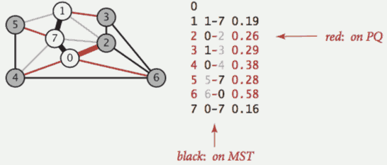


<h2 id="64071a409f7f87287eed62ffd412bc0e"></h2>


#### Indexed priority queue

 - THe problem is , we have keys that the PQ algorithm doesn't really needs to know when we change values of keys.
    - so we have to do that throught the API.
    - and what we're going to do is allow the client to change the key by specifying the index and the new key.
    - and then the implementation will take care of changing the value and updating its data structure to reflect the changed values. 

 - since we are working with vertex indexed array and graphs, the priority queue implementation might do the same. 
    - we'll just associate an index, kind of pass the idea onto the PQ, to make it allow it to implement these operations.

 - Associate an index between 0 and N - 1 with each key in a priority queue.
    - Client can insert and delete-the-minimum.
    - Client can change the key by specifying the index.


```java
public class IndexMinPQ<Key extends Comparable<Key>>

----------------
// create indexed priority queue with indices 0, 1, ..., N-1
IndexMinPQ(int N) 

// associate key with index i
void insert(int i, Key key)

// decrease the key associated with index i
void decreaseKey(int i, Key key)

// is i an index on the priority queue?
boolean contains(int i)

// remove a minimal key and return its associated index
int delMin()
```

<h2 id="b672f52ade975e864ae6b58722c03689"></h2>


#### Implementation

 - Start with same code as MinPQ.
 - Maintain parallel arrays keys[], pq[], and qp[] so that:
    - keys[i] is the priority of i
    - pq[i] is the index of the key in heap position i
    - qp[i] is the heap position of the key with index i
 - Use swim(qp[i]) implement decreaseKey(i, key).

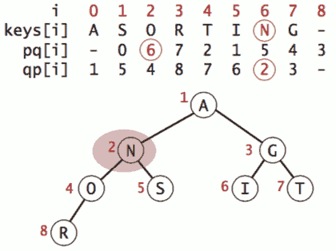

 - It's important to realize that it's possible to implement this decreased key operation in logarithmic time without ever having to search through everything,  using the idea of indexing.
 - `E + VlogV` can make a difference for a huge graph. 

<h2 id="0ab687c6a13802a6674d5327e3d4177e"></h2>


## QA

 - Q: Minimum-weight feedback edge set
    - A feedback edge set of a graph is a subset of edges that contains at least one edge from every cycle in the graph. If the edges of a feedback edge set are removed, the resulting graph is acyclic. Given an edge-weighted graph, design an efficient algorithm to find a feedback edge set of minimum weight. Assume the edge weights are positive.
 - A: If the weight function is non-negative, then the set of edges not contained in a maximum weight spanning tree is indeed a MWFES. 


---

<h2 id="66c555dd7127e24c5dad2b9bbc2b1818"></h2>


# 4.4 SHORTEST PATHS

 - Shortest paths in an edge-weighted digraph
    - Given an edge-weighted digraph, find the shortest path from *s* to *t*.
 - Shortest path variants
    - Which vertices?
        - Single source: from one vertex *s* to every other vertex
        - Source-sink: from one vertex *s* to another *t*.
        - All pairs: between all pairs of vertices.
    - Restrictions on edge weights?
        - Nonnegative weights.
        - Euclidean weights.
        - Arbitrary weights.
    - Cycles?
        - No directed cycles.
        - No "negative cycles."
 - Simplifying assumption. Shortest paths from *s* to each vertex *v* exist.

<h2 id="582ea71a838abce9407ad2a894dbea08"></h2>


## shortest-paths properties

<h2 id="68261b4718c4139e54fff81468a562c5"></h2>


### Data structures for single-source shortest paths
 
 - Goal. Find the shortest path from *s* to every other vertex.
 - Observation. A **shortest-paths tree** (SPT) solution exists. Why?
    - if no 2 paths have the same length, then certainly it's going to be such a solution
    - if you've got 2 paths to the same vertex , you can delete the last edge on one of them and keep going 
    - what we want to do is compute a tree.
 - Consequence. Can represent the SPT with two vertex-indexed arrays:
    - distTo[v] is length of shortest path from s to v.
    - edgeTo[v] is last edge on shortest path from s to v.

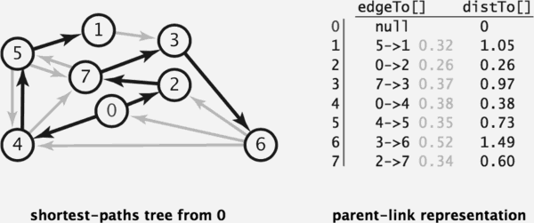

```java
public double distTo(int v) {  
    return distTo[v];  
}
public Iterable<DirectedEdge> pathTo(int v) {
   Stack<DirectedEdge> path = new Stack<DirectedEdge>();
   for (DirectedEdge e = edgeTo[v]; e != null; e = edgeTo[e.from()])
      path.push(e);
   return path;
}
```

<h2 id="f1800f07c216d493e8e9ff2761ccfc33"></h2>


### Edge relaxation

 - Relax edge *e = v→w* .
    - distTo[v] is length of shortest **known** path from s to v.
    - distTo[w] is length of shortest **known** path from s to w
    - edgeTo[w] is last edge on shortest **known** path from s to w
    - If *e = v→w* gives shorter path to w through v,  update both distTo[w] and edgeTo[w].

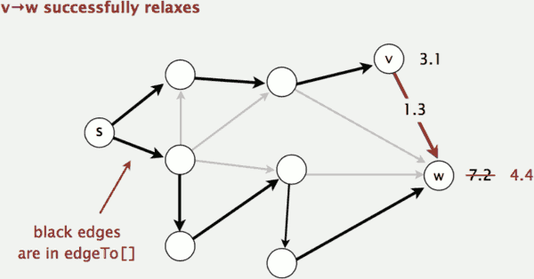

```java
private void relax(DirectedEdge e) {
    int v = e.from(), w = e.to();
    if (distTo[w] > distTo[v] + e.weight()) {
        distTo[w] = distTo[v] + e.weight();
        edgeTo[w] = e;
    }
}
```

<h2 id="a0dbfd20d8d788e69eee52223da9cc90"></h2>


### Shortest-paths optimality conditions

 - Proposition. 
    - Let G be an edge-weighted digraph. Then distTo[] are the shortest path distances from *s* iff:
        - distTo[s] = 0.
        - For each vertex *v*, distTo[v] is the length of some path from *s* to *v*.
        - For each edge *e = v→w*, distTo[w] ≤ distTo[v] + e.weight().
 - Pf. ⇐ [ necessary ]
    - Suppose that distTo[w] > distTo[v] + e.weight() for some edge *e = v→w*.
    - Then, e gives a path from s to w (through v) of length less than distTo[w].
 - Pf. ⇒ [ sufficient ]
    - Suppose that s = v0 → v1 → v2 → ... → vk = w is a shortest path from s to w.
    - Then, ( eᵢ = iᵗʰ edge on shortest path from s to w )
        - distTo[v1] ≤ distTo[v0] + e1.weight()
        - distTo[v2] ≤ distTo[v1] + e2.weight()
        - ...
        - distTo[vk] ≤ distTo[vk-1] + ek.weight()
    - Add inequalities; simplify; and substitute distTo[v0] = distTo[s] = 0:
        - distTo[w] = distTo[vk] ≤ e1.weight() + e2.weight() + ... + ek.weight()
    - Thus, distTo[w] is the weight of shortest path to w. 


<h2 id="17660e379f4dc4040c1d93faf73d5f9c"></h2>


### Generic shortest-paths algorithm

```
Generic algorithm (to compute SPT from s)
---------------------------
Initialize distTo[s] = 0 and distTo[v] = ∞ for all other vertices
Repeat until optimality conditions are satisfied:
    - Relax any edge.
```

 - Proposition. Generic algorithm computes SPT (if it exists) from s.
 - Pf sketch.
    - Throughout algorithm, distTo[v] is the length of a simple path from s to v (and edgeTo[v] is last edge on path).
    - Each successful relaxation decreases distTo[v] for some v.
    - The entry distTo[v] can decrease at most a finite number of times.

---

 - Efficient implementations. How to choose which edge to relax?
    - Ex 1. Dijkstra's algorithm (nonnegative weights).
    - Ex 2. Topological sort algorithm (no directed cycles).
    - Ex 3. Bellman-Ford algorithm (no negative cycles).


<h2 id="2c3fda14bde328549c74fb448ef62d34"></h2>


## Dijkstra's algorithm

 - Consider vertices in increasing order of distance from s ( vertex that not on the SP-tree and  with the lowest distTo[] value).
    - so , our source is 0 in the case showed as pic below, what vertices are closest to the source ?  0-1, 5.0
 - Add vertex to tree and relax all edges pointing from that vertex.

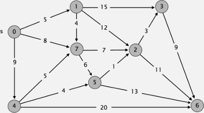

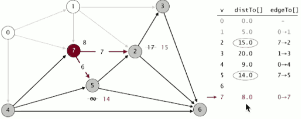

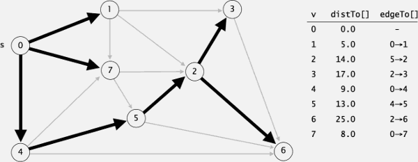


<h2 id="2880931f98f3fff633812cf6fcf35e45"></h2>


### Dijkstra's algorithm: correctness proof (TODO)

<h2 id="f1d4978722895ce40af6d3ebe0c8c6c0"></h2>


### Dijkstra's algorithm: Java implementation

```java
public class DijkstraSP {
   private DirectedEdge[] edgeTo;
   private double[] distTo;
   private IndexMinPQ<Double> pq;

   public DijkstraSP(EdgeWeightedDigraph G, int s) {
       edgeTo = new DirectedEdge[G.V()];
       distTo = new double[G.V()];
       pq = new IndexMinPQ<Double>(G.V());
       for (int v = 0; v < G.V(); v++)
           distTo[v] = Double.POSITIVE_INFINITY;
       distTo[s] = 0.0;

       pq.insert(s, 0.0);
       // relax vertices in order of distance from s
       while (!pq.isEmpty())
       {
           int v = pq.delMin();
           for (DirectedEdge e : G.adj(v))
               relax(e);
       }
   }
   private void relax(DirectedEdge e) {
       int v = e.from(), w = e.to();
       if (distTo[w] > distTo[v] + e.weight()) {
           distTo[w] = distTo[v] + e.weight();
           edgeTo[w] = e;
           // update PQ
           if (pq.contains(w)) pq.decreaseKey(w, distTo[w]);
           else                pq.insert     (w, distTo[w]);
       }    
   }
}
```

- support multi-source ? YES!
- IndexMinPQ can decrease the computation , but is only works for simple state ( for above algorim, the state is the vertex index ) 
    - it may cause memory consumption for complex state
- Note: this version Dijkstra(allows a vertex to be enqueued more than once) is correct in the presence of negative edge weights (but no negative cycles) but its running time is exponential in the worst case.  
    - using a marked[] array to mark those vertices that have been relaxed guaranteed to run in E log V time but it may yield incorrect results when there are edges with negative weights.
- [Does Dijkstra's algorithm work with negative weights](https://algs4.cs.princeton.edu/44sp/)
- [Example: Dijkstra v1 not work with negative weight](https://stackoverflow.com/questions/6799172/negative-weights-using-dijkstras-algorithm/6799344#6799344)

<h2 id="5d21b219a367d8ca1eb434230c3f4be1"></h2>


### Computing spanning trees in graphs

 - Dijkstra’s algorithm seem familiar?
    - Prim’s algorithm is essentially the same algorithm.
    - Both are in a family of algorithms that compute a graph’s spanning tree
 - Main distinction: Rule used to choose next vertex for the tree.
    - Prim’s: Closest vertex to the **tree** (via an undirected edge).
    - Dijkstra’s: Closest vertex to the **source** (via a directed path).
 - Note: DFS and BFS are also in this family of algorithms.

<h2 id="d7c7b1975f92a833609b519faa4ed829"></h2>


## edge-weighted DAGs

<h2 id="a2c4d444ac852b90752f7a63ec59e581"></h2>


### Acyclic edge-weighted digraphs

 - Q. Suppose that an edge-weighted digraph has no directed cycles. Is it easier to find shortest paths than in a general digraph?
 - A. Yes!

---

 - Algorithm
    - Consider vertices in topological order.
    - Relax all edges pointing from that vertex.

<h2 id="fcbd840d9edcaf804b1bd65b6e72badc"></h2>


### Shortest paths in edge-weighted DAGs

 - Proposition. Topological sort algorithm computes SPT in any edge- weighted DAG in time proportional to *E + V* .
 - Proof
    - TODO


```java
public class AcyclicSP {
   private DirectedEdge[] edgeTo;
   private double[] distTo;

   public AcyclicSP(EdgeWeightedDigraph G, int s) {
       edgeTo = new DirectedEdge[G.V()];
       distTo = new double[G.V()];

       for (int v = 0; v < G.V(); v++)
           distTo[v] = Double.POSITIVE_INFINITY;
       distTo[s] = 0.0;

       // new : topological order
       Topological topological = new Topological(G);
       for (int v : topological.order())
           for (DirectedEdge e : G.adj(v))
               relax(e);
   }
   private void relax(DirectedEdge e) {
       int v = e.from(), w = e.to();
       if (distTo[w] > distTo[v] + e.weight()) {
           distTo[w] = distTo[v] + e.weight();
           edgeTo[w] = e;
       }    
   }
}
```

 - E+V
    - It process the V vertices in topological order; it relaxes each fo the E edges exactly once.

<h2 id="5ee07047d6bca78383a141e5e8ec77ce"></h2>


#### Application: Content-aware resizing

 - Seam carving: [Avidan and Shamir] Resize an image without distortion for display on cell phones and web browsers.


 - To find vertical seam:
    - Grid DAG: vertex = pixel; edge = from pixel to 3 downward neighbors.
        - what we do is to build a huge directed acyclic graph.  Every pixel corresponds to a vertex in this graph. And the edges are gonna be just directed edges from every pixel to its 3 downward neighbors.
    - Weight of pixel = energy function of 8 neighboring pixels.
        - energe function is a image processing concept, it is perfect for assigning weights in this instance. 
    - Seam = shortest path (sum of vertex weights) from top to bottom.

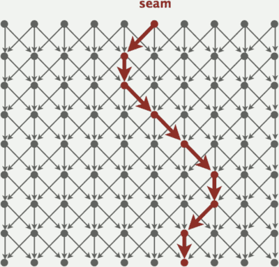


 - To remove vertical seam:
    - Delete pixels on seam (one in each row).


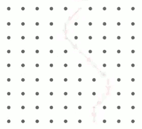

 - 实现上，并不需要显式地创建 DirectedEdge 和 EdgeWeightedDigraph 
    - 一个energy 矩阵就足够了
    - AcyclicSP 在seamCarving上 效率最高
        - 不同与 Dijkstra算法，AcyclicSP 不能中途claim we have hit the goal , AcyclicSP must finish the loop.
        - [sample implementation code](https://raw.githubusercontent.com/mebusy/codeLib/master/AlgorithmII_homework/seamCarving/SeamCarver.java)

<h2 id="3c55cda3adffaa472aa7490b10892ab8"></h2>


### Longest paths in edge-weighted DAGs

since negative weights are allowd ,we can find longest paths in the edge-weighted DAGs, just by negating all the weights. This is because topologic sort algorithm desn't care whether the weights are positve or negative . 

 - Formulate as a shortest paths problem in edge-weighted DAGs.
    - Negate all weights
    - Find shortest paths.
    - Negate weights in result
 - Key point. Topological sort algorithm works even with negative weights.

<h2 id="2160c4ec3d4551c21c4e80c16718ad43"></h2>


#### Longest paths in edge-weighted DAGs: application

 - Parallel job scheduling
    - Given a set of jobs with durations and precedence constraints, schedule the jobs (by finding a start time for each) so as to achieve the minimum completion time, while respecting the constraints.

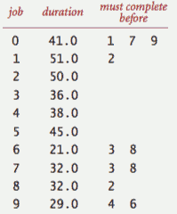

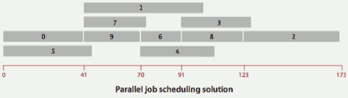

 - And so what we want to do is, find a start time for each job. That minimizes the completion time. 
 
<h2 id="2f8af766796a78ffe5aa21acf6f9f6b9"></h2>


#### Critical path method

 - CPM. To solve a parallel job-scheduling problem, create edge-weighted DAG:
    - Source and sink vertices.
        - the source is begin everything and the sync is end everything. 
    - Two vertices (begin and end) for each job.
    - Three edges for each job.
        - begin to end (weighted by duration)
        - source to begin (0 weight)
        - end to sink (0 weight)
    - One edge for each precedence constraint (0 weight)

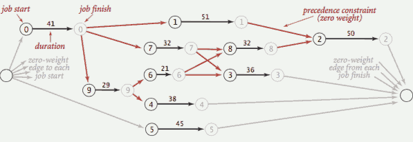

 - we took our scheduling problem and now we have a graph. 
    - And what relates this to what we've been talking about is the longest path from the source to each job. 
 - CPM. Use **longest path** from the source to schedule each job.

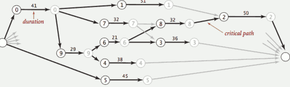

---

<h2 id="00bb6ece1156f92c2370e55696fbc73c"></h2>


## negative weights

<h2 id="e60a7af8652792b3d2649ee453b4c196"></h2>


### Shortest paths with negative weights: failed attempts

 - **Dijkstra**. Doesn’t work with negative edge weights.
    - Dijkstra selects vertex 3 immediately after 0. But shortest path from 0 to 3 is 0→1→2→3.
    - 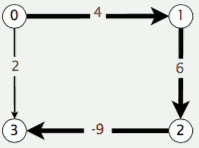
 - **Re-weighting**. Add a constant to every edge weight doesn’t work.
    - Adding 9 to each edge weight changes the shortest path from 0→1→2→3 to 0→3.
    - 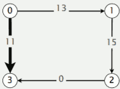
 - **Conclusion**. Need a different algorithm.

<h2 id="d05e7fb4b74623a5da219bc192056e4a"></h2>


### Negative cycles

 - Def. A **negative cycle** is a directed cycle whose sum of edge weights is negative.
 - Proposition. A SPT exists iff no negative cycles.
    - assuming all vertices reachable from s

<h2 id="bc4dcba35afdbb28dfbf17b06b64e8d1"></h2>


### Bellman-Ford algorithm

```
Bellman-Ford algorithm
------------------------------
Initialize distTo[s] = 0 and distTo[v] = ∞ for all other vertices.
Repeat V times:
    - Relax each edge.
```

```java
// repeate v times
for (int i = 0; i < G.V(); i++) {
    // go through all the edges in the graph
    // and relax each edge
    for (int v = 0; v < G.V(); v++)
        for (DirectedEdge e : G.adj(v))
            relax(e);
}
```

 - you will get a SPT after running Bellman-Ford algorithm  

<h2 id="875643e3ddfa7b4322582d5fdb5a16d1"></h2>


### Bellman-Ford algorithm: analysis

 - Proposition. Dynamic programming algorithm computes SPT in any edge-weighted digraph with no negative cycles in time proportional to *E × V*.
 - Proof idea. 
    - After pass i, found shortest path containing at most i edges.

<h2 id="252d97af220bba63a2b709f462d4d19f"></h2>


### Bellman-Ford algorithm: practical improvement

 - Observation. If *distTo[v]* does not change during pass *i*, no need to relax any edge pointing from *v* in pass *i+1*.
    - if you didn't change the distance to a vertex during one pass, Then you don't have to worry about its edges in the next pass.
 - FIFO implementation. Maintain **queue** of vertices whose distTo[] changed.
    - be careful to keep at most one copy of each vertex on queue (why?)  
    - Otherwise, you could wind up with situations where the size of the queue, blows up. 
 - Overall effect.
    - The running time is still proportional to *E × V* in worst case.
    - But much faster than that in practice

<h2 id="297a63d92dca03fcf471996d66e9b44b"></h2>


### Single source shortest-paths implementation: cost summary

algorithm | restriction | typical case | worst case | extra space
--- | --- | --- | --- | --- 
topological sort | no directed cycles | E +V | E +V | V
Dijkstra (binary heap) | no negative weights | E log V | E log V | V
Bellman-Ford | no negative cycles | EV | EV | V
Bellman-Ford (queue-based) | no negative cycles | E+V | EV | V

---

 - Remark 1. Directed cycles make the problem harder.
 - Remark 2. Negative weights make the problem harder.
 - Remark 3. Negative cycles makes the problem intractable.


<h2 id="9b60ad9b0b7957c904f64920f0bbfa7d"></h2>


### Finding a negative cycle

 - Observation. If there is a negative cycle, Bellman-Ford gets stuck in loop, updating distTo[] and edgeTo[] entries of vertices in the cycle.

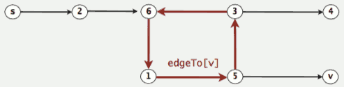

 - Proposition. If any vertex *v* is updated in phase V ( means the last phase of Bellman-Ford ), there exists a negative cycle (and can trace back edgeTo[v] entries to find it).
    - and not only that, edgeTo[v] is the last edge on that cycle. 
 - In practice. Check for negative cycles more frequently.
    - In practice actually, you don't have to wait till the last phase. 
    - You can check `distTo` entries for negative cycles, more frequently. 

<h2 id="5cf18acbf86bf2c1e691a77579f9c0a4"></h2>


### Negative cycle application: arbitrage detection

 - Negative cycle application: arbitrage detection


 - Ex. $1,000 ⇒ 741 Euros ⇒ 1,012.206 Canadian dollars ⇒ $1,007.14497.
 - Currency exchange graph.
    - Vertex = currency.
    - Edge = transaction, with weight equal to exchange rate.
    - Find a directed cycle whose product of edge weights is > 1

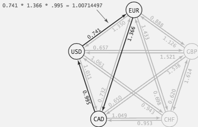

 - Challenge. Express as a negative cycle detection problem.
 - **Model as a negative cycle detection problem by taking logs**
    - Let weight of edge v→w be -ln (exchange rate from currency v to w).
        - 似乎任何底的 log函数都可以...
    - Multiplication turns to addition; > 1 turns to < 0.
    - Find a directed cycle whose sum of edge weights is < 0 (negative cycle). 

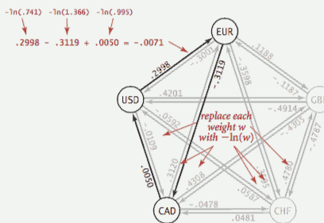

 - Remark. Fastest algorithm is extraordinarily valuable!

<h2 id="6ce3bdc39e544725038e0e87b771db1e"></h2>


## Questions 

 - Q: Monotonic shortest path
    - Given an edge-weighted digraph G, design an ElogE algorithm to find a monotonic shortest path from s to every other vertex.
    - A path is monotonic if the sequence of edge weights along the path are either strictly increasing or strictly decreasing.
 - A: relax edges in ascending order to find a best monotonically increasing path; 
    - relax edges in descending order to find a best monotonically decreasing path.

---

 - Q: Second shortest path
    - Given an edge-weighted digraph and let P be a shortest path from vertex s to vertex t. 
    - Design an ElogV algorithm to find a path other than P from s to t that is as short as possible. Assume all of the edge weights are strictly positive.
 - A: compute the shortest path distances from s to every vertex , and the shortest path distances from every vertex to t.

---
 
 - Q: Shortest path with one skippable edge. 
    - Given an edge-weighted digraph, design an ElogV algorithm to find a shortest path from s to t where you can change the weight of any one edge to zero. 
    - Assume the edge weights are nonnegative.
 - A: compute the shortest path from s to every vertex; compute the shortest path from every vertex to t; combine.


<h2 id="4ccfbaa8088f52afb0f66af1fd3c0489"></h2>


## Shortest paths summary

 - Dijkstra’s algorithm.
    - Nearly linear-time when weights are nonnegative.
    - Generalization encompasses DFS, BFS, and Prim.
 - Acyclic edge-weighted digraphs.
    - Arise in applications.
    - Faster than Dijkstra’s algorithm.
    - Negative weights are no problem.
 - Negative weights and negative cycles.
    - Arise in applications.
    - If no negative cycles, can find shortest paths via Bellman-Ford.
    - If negative cycles, can find one via Bellman-Ford.
 - Shortest-paths is a broadly useful problem-solving model.


