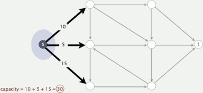
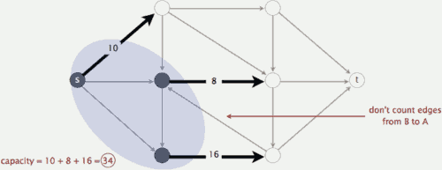
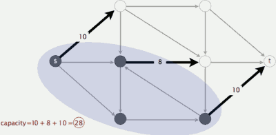
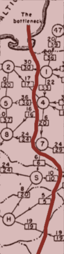
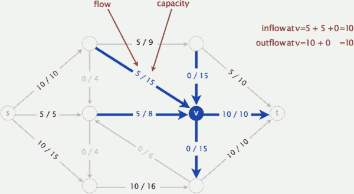
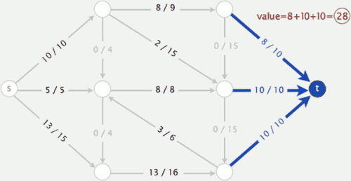
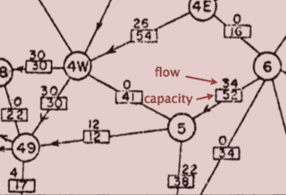

...menustart

- [6.4 MAXIMUM FLOW](#60804ce1e5e1b895af839b4ef2122a99)
- [introduction](#8800e1c9b3e22c44ba59a34db3fe4841)
    - [Mincut problem](#450389af6383415c1047574d48dd0785)
        - [Mincut application](#94a80819ddc13f6dce6240f35c75622d)
    - [Maxflow problem](#e5e9af9ecfee06cab309dca7d7623ddf)
    - [Maxflow application](#cbb1e31675bbfff18dfed42b332e08d6)
    - [Summary](#290612199861c31d1036b185b4e69b75)
- [Ford-Fulkerson algorithm](#3c8155f8b956bc76bd3865785d9cc8c1)
    - [Ford-Fulkerson algorithm](#3c8155f8b956bc76bd3865785d9cc8c1)

...menuend

<h2 id="60804ce1e5e1b895af839b4ef2122a99"></h2>

# 6.4 MAXIMUM FLOW

<h2 id="8800e1c9b3e22c44ba59a34db3fe4841"></h2>

# introduction

<h2 id="450389af6383415c1047574d48dd0785"></h2>

## Mincut problem

- Input
    - An edge-weighted digraph, source vertex s, and target vertex t
    - each edge has a positive capacity
- Def.
    - A **st-cut (cut)** is a partition of the vertices into two disjoint sets, with s in one set A and t in the other set B. 
- Def.
    - Its **capacity** is the sum of the capacities of the edges from A to B.

- **Minimum st-cut (mincut) problem**
    - Find a cut of minimum capacity

<h2 id="94a80819ddc13f6dce6240f35c75622d"></h2>

### Mincut application

- **"Free world" goal** 
    - Cut supplies (if cold war turns into real war).

> rail network connecting Soviet Union with Eastern European countries

<h2 id="e5e9af9ecfee06cab309dca7d7623ddf"></h2>

## Maxflow problem

- Input. 
    - An edge-weighted digraph, source vertex s, and target vertex t.
    - each edge has a positive capacity
- Def.
    - An **st-flow (flow)** is an assignment of values to the edges such that:
        - Capacity constraint: 0 ≤ edge's flow ≤ edge's capacity.
        - Local equilibrium: inflow = outflow at every vertex (except s and t).

- Def. The **value** of a flow is the inflow at t.
    - we assume no edge points to s or from t 
    - show as the previous picture, the value = 5 + 10 + 10 = 25.
- **Maximum st-flow (maxflow) problem**
    - Find a flow of maximum value. 

<h2 id="cbb1e31675bbfff18dfed42b332e08d6"></h2>

## Maxflow application

- **Soviet Union goal**
    - Maximize flow of supplies to Eastern Europe.
 

<h2 id="290612199861c31d1036b185b4e69b75"></h2>

## Summary

- Input. A weighted digraph, source vertex s, and target vertex t. 
- Mincut problem. Find a cut of minimum capacity.
- Maxflow problem. Find a flow of maximum value.
- Remarkable fact. These two problems are dual!

---

<h2 id="3c8155f8b956bc76bd3865785d9cc8c1"></h2>

# Ford-Fulkerson algorithm

<h2 id="3c8155f8b956bc76bd3865785d9cc8c1"></h2>

## Ford-Fulkerson algorithm

- Initialization. Start with 0 flow. 
    - all edges has 0 flow.
    - the value is 0.
- Idea: increase flow along augmenting paths
    - **Augmenting path**: Find an undirected path from s to t such that:
        - Can increase flow on forward edges (not full).
        - Can decrease flow on backward edge (not empty). ?

