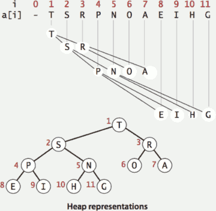
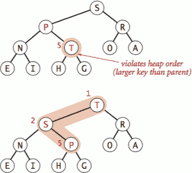
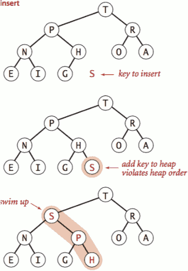
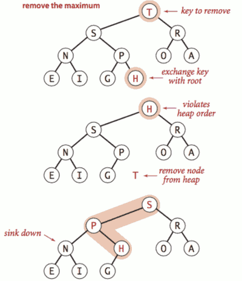

...menustart

- [2.4 PRIORITY QUEUES](#31a8f3f664a49f0116e7d7ceacaff56c)
    - [binary heaps](#01f70acef6efe0e1e07b6c8847ae493a)
        - [Complete binary tree](#45c2a6499668ae8a669f5f812b56379a)
        - [Binary heap representations](#05a360d5d6f9939aabfd6bd00823d80e)
        - [Binary heap properties](#2e582e415db1ab1e6e72b8278b9385e1)
        - [Promotion in a heap](#8bff03ac1b55987683317d94044219d1)
        - [Insertion in a heap](#cb0565d93960f3556f5f0ca7c24c3134)
        - [Demotion in a heap](#32a8207179f9f552bbec38561312becf)
        - [Delete the maximum in a heap](#34f42d75083165489f2d1288aa203637)
        - [Priority queues implementation cost summary](#dee2139d14dc9b4129086c422806e8a4)
        - [Binary heap considerations](#08fdfb23883b137987adc5a563f835b0)
    - [event-driven simulation](#2b3a9baf85c09205eff605615163f824)

...menuend


<h2 id="31a8f3f664a49f0116e7d7ceacaff56c"></h2>


# 2.4 PRIORITY QUEUES

<h2 id="01f70acef6efe0e1e07b6c8847ae493a"></h2>


## binary heaps

<h2 id="45c2a6499668ae8a669f5f812b56379a"></h2>


### Complete binary tree

- Binary tree. Empty or node with links to left and right binary trees.
- Complete tree. Perfectly balanced, except for bottom level.

<h2 id="05a360d5d6f9939aabfd6bd00823d80e"></h2>


### Binary heap representations

- Binary heap. Array representation of a heap-ordered complete binary tree.
- Heap-ordered binary tree.
    - Keys in nodes
    - Parent's key no smaller than children's key
- Array representation.
    - Indices start at 1.
    - Take nodes in **level** order
    - No explicit links needed !



<h2 id="2e582e415db1ab1e6e72b8278b9385e1"></h2>


### Binary heap properties

- Proposition. Largest key is a[1], which is root of binary tree.
- Proposition. Can use array indices to move through tree.
    - Parent of node at k is at k/2.
    - Children of node at k are at 2k and 2k+1.
    - a[0] 不使用


<h2 id="8bff03ac1b55987683317d94044219d1"></h2>


### Promotion in a heap

- Scenario. Child's key becomes **larger** key than its parent's key.
- To eliminate the violation:
    - Exchange key in child with key in parent.
    - Repeat until heap order restored.



```java
private void swim(int k) {
    // 1 is root, do not care
    // parent is smaller 
    while (k > 1 && less(k/2, k)) {
        exch(k, k/2); // swap key
        k = k/2;     // check the new violation of the upper level
    }    
}
```

- Peter principle. Node promoted to level of incompetence.
- swim/sink 都需要递归检查
    - swim 用于 insertion
    - sink 用于 delete max

<h2 id="cb0565d93960f3556f5f0ca7c24c3134"></h2>


### Insertion in a heap

- Insert. Add node at end, then swim it up.
    - 添加新node到PQ最后，然后 swim到正确位置
- Cost. At most 1 + lg N compares.



```java
public void insert(Key x) {
    // ++ first , because we don't use index 0
    pq[++N] = x;
    // swim up
    swim(N); 
}
```

<h2 id="32a8207179f9f552bbec38561312becf"></h2>


### Demotion in a heap

- Scenario. Parent's key becomes **smaller** than one (or both) of its children's.
- To eliminate the violation:
    - Exchange key in parent with key in larger child. 
        - why not the smaller one ? Power struggle. Better subordinate promoted
    - Repeat until heap order restored.
 


```java
private void sink(int k) {
    while (2*k <= N) {
        int j = 2*k;
        // child node at k are 2k,2k+1 
        // choose the largest child as j
        if (j < N && less(j, j+1)) j++;
        if (!less(k, j)) break;
        exch(k, j);
        k = j;    
    }    
}
```


<h2 id="34f42d75083165489f2d1288aa203637"></h2>


### Delete the maximum in a heap

- Delete max.
    - Exchange root with node at end, then sink it down.
    - 交换根节点 到最后一个节点， 然后新的根节点 sink 到正确位置
- Cost. At most 2 lg N compares.



```java
public Key delMax() {
    Key max = pq[1];
    // 交换，N = N-1
    exch(1, N--);
    // new root sink
    sink(1);
    // prevent loitering
    pq[N+1] = null ;
    return max;    
}
```

<h2 id="dee2139d14dc9b4129086c422806e8a4"></h2>


### Priority queues implementation cost summary

- order-of-growth of running time for priority queue with N items

implementation | insert | del max | max 
--- | --- | --- | --- 
unordered array | 1 | N | N
ordered array | N | 1 | 1
**binary heap** | log N | log N | 1
d-ary heap | logd N | d logd N | 1 
Fibonacci | 1 | log N⁺ | 1 

<h2 id="08fdfb23883b137987adc5a563f835b0"></h2>


### Binary heap considerations

- Immutability of keys
- Underflow and overflow
    - Underflow: throw exception if deleting from empty PQ
    - Overflow: add no-arg constructor and use resizing array
- Minimum-oriented priority queue
    - Replace less() with greater()
    - Implement greater().
- Other operations.
    - Remove an arbitrary item
    - Change the priority of an item
    - can implement with sink() and swim() [stay tuned]
    

- resize array
    - grow : If array is full, create a new array of twice the size, and copy items
        - `if (N == s.length) resize(2 * s.length);`
    - sink: halve size of array s[] when array is one-quarter full.
        - `if (N > 0 && N == s.length/4) resize(s.length/2);`

```java
private void resize(int capacity) {
   String[] copy = new String[capacity];
   for (int i = 0; i < N; i++)
      copy[i] = s[i];
   s = copy;
}
```


<h2 id="2b3a9baf85c09205eff605615163f824"></h2>


## event-driven simulation

Example: Particle-particle collision, event-driven simulation

- Initialization
    - fill PQ with all potential particle-vall collisions
    - fill PQ with all potential particle-particle collisions.
- Main Loop
    - Delete the impending event from PQ
    - If the event has been invalidated, ignore it.
    - handling the collision
        - Advance all particles to time t, on a straight-line trajectory.
        - Update the velocities of the colliding particle(s).
        - re-Predict future particle-wall and particle-particle collisions involving the colliding particle(s) and insert events onto PQ.

---


# 小结

## 一个中心

**动态求极值**

## 两个实现

1. 跳表
    - 
2. 二叉堆
    - 


实现 | 问题 | 解决
--- | --- | ---
有序数组 | 插队麻烦
有序链表 | 查找O(N)  | 借助索引→跳表
树 | · ｜ 二叉堆 


<details>
<summary>
Ex: 定一个二叉树，在树的最后一行找到最左边的值。
</summary>


```bash
输入:

    2
   / \
  1   3

输出:
1

输入:

        1
       / \
      2   3
     /   / \
    4   5   6
       /
      7

输出:
7
```

- solution
    1. BFS, 从右向左遍历, 遍历的最后一个节点就是**树左下角的节点**
    2. 双端队列


</details>


## 三个技巧

### 1 固定堆

固定堆的大小 k 不变，代码上可通过每 pop 出去一个就 push 进来一个来实现。

固定堆一个典型的应用就是求第 k 小的数。 这个问题 最简单的思路是建立小顶堆，将所有的数先全部入堆，然后逐个出堆，一共出堆 k 次。最后一次出堆的就是第 k 小的数。

然而，我们也可不先全部入堆，而是建立**大顶堆**，并维持堆的大小为 k 个。如果新的数入堆之后堆的size > k，则需要 pop ，维持 size == k. 此时堆顶就是我们要求的第k小的数。

**总结**: 固定一个大顶堆(k)，可以快速求 第k小数， 固定一个小顶堆(k), 可以快速求第k大数。

-  应用: 
    - 数据流的中位数: 大顶堆( (n+1)/2 )  +  小顶堆 ( n - *(n+1)/2*  )
    - 雇佣 K 名工人的最低成本

### 2 多路归并 ?

### 3 因子分解

### 4 堆排序


## 四大应用

### 1 topK

### 2 带权最短距离

使用优先队列的 BFS 实现典型的就是 dijkstra 算法。

### 3 因子分解


