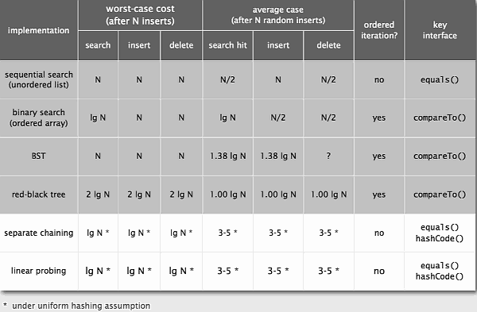
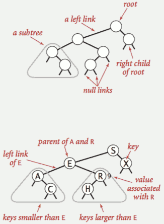
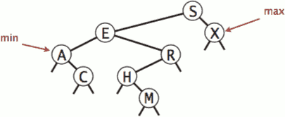
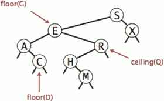
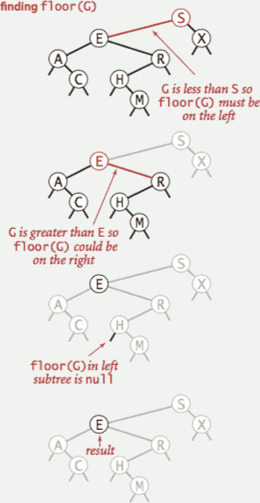
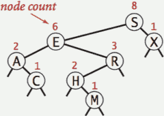
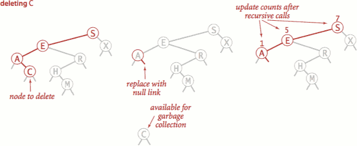
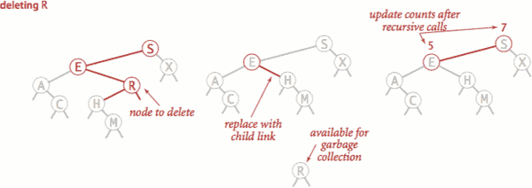
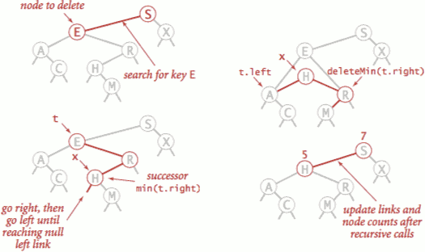
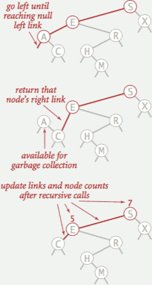

...menustart

 - [Symbol Table](#8f876a2fd3f1bcd3a16784ddd034f7da)
 - [3.2 BINARY SEARCH TREES](#5737900805643a95038c707f458e0b1f)
     - [BSTs](#084ec43276e894a559b0dc53d166f1c9)
     - [BST representation](#9f36e1029ab96d02a2626c3f8a4d4f73)
     - [Basic Operations](#b5794bba6843c21acafdd6a4bfd776be)
         - [Search](#13348442cc6a27032d2b4aa28b75a5d3)
         - [Insert](#a458be0f08b7e4ff3c0f633c100176c0)
     - [ordered operations](#e0c655699c66cbcbde00b1bf5fba638b)
         - [Minimum and maximum](#88b34cb7ae3f567e9a2b721ca192bda4)
         - [Floor and ceiling](#a5e18d49cade04fcf96644c4d2ccc0fa)
         - [Subtree counts](#15ca1a1832547a20360b31763addac4b)
         - [Rank](#021da1b20f73dc252361a54d80497ef3)
         - [Inorder traversal](#d321f84aa81593c5158baaf21e11092b)
     - [Deletion](#a1998652b01bdc9e7128734efb804780)
         - [how to Deleting the minimum ?](#79332b5aac6b50d5a6ac7f4f2982e277)
         - [code for deletion](#fdd96da59972ac64d6dacb8a6dcd5bdf)

...menuend


<h2 id="8f876a2fd3f1bcd3a16784ddd034f7da"></h2>


# Symbol Table

 - Symbol Table 有多种实现



 1. 无序链表的实现，复杂度都是 O(N)
 2. 有序数组，search的复杂度可以到 lgN
 3. 二叉搜索树，复杂度依赖于数的高度
    - 最坏情况 O(N)
    - 实践中，数节点随机插入的情况下，平均复杂度为O(lgN)
 4. 红黑树是平衡二叉搜索树的一个实现，复杂度都为 O(lgN)
 5. 哈希表，在 uniform hashing的假设下, 效率比红黑树更高

---

<h2 id="5737900805643a95038c707f458e0b1f"></h2>


# 3.2 BINARY SEARCH TREES

<h2 id="084ec43276e894a559b0dc53d166f1c9"></h2>


## BSTs

 - Definition. 
    - A BST is a **binary tree** in **symmetric order**.
 - A binary tree is either:
    - Empty.
    - Two disjoint binary trees (left and right).
 - Symmetric order.
    - Each node has a key, and every node’s key is:
        - Larger than all keys in its left subtree
        - Smaller than all keys in its right subtree



 - Proposition. 
    - If N distinct keys are inserted into a BST in **random** order, the expected number of compares for a search/insert is ~ 2 ln N.
 - Proposition. [Reed, 2003] 
    - If N distinct keys are inserted in random order, expected height of tree is ~ 4.311 ln N.


<h2 id="9f36e1029ab96d02a2626c3f8a4d4f73"></h2>


## BST representation

 - A BST is a reference to a root Node.
 - A Node is comprised of four fields:
    - A Key and a Value.
    - A reference to the left  and right subtree
        - left: smaller keys
        - right: larger keys

```java
private class Node {
    private Key key;
    private Value val;
    private Node left, right;
    public Node(Key key, Value val) {
        this.key = key;
        this.val = val;
    }    
}
```


<h2 id="b5794bba6843c21acafdd6a4bfd776be"></h2>


## Basic Operations

<h2 id="13348442cc6a27032d2b4aa28b75a5d3"></h2>


### Search

 - If less, go left; if greater, go right; if equal, search hit.

<h2 id="a458be0f08b7e4ff3c0f633c100176c0"></h2>


### Insert
    
 - If less, go left; if greater, go right; if null, insert.
     
<h2 id="e0c655699c66cbcbde00b1bf5fba638b"></h2>


## ordered operations

<h2 id="88b34cb7ae3f567e9a2b721ca192bda4"></h2>


### Minimum and maximum

 - minimum key is always at the left most offspring , so just follow the left child pointers.
 - maximum key is always at the right most offspring, so just follow the right child pointers.



<h2 id="a5e18d49cade04fcf96644c4d2ccc0fa"></h2>


### Floor and ceiling

 - Floor. Largest key ≤ a given key.
 - Ceiling. Smallest key ≥ a given key.



 - Computing the floor
    - Case 1. [k equals the key at root]
        - The floor of k is k.
    - Case 2. [k is less than the key at root] 
        - The floor of k is in the left subtree.
    - Case 3. [k is greater than the key at root]
        - The floor of k is in the right subtree (if there is any key ≤ k in right subtree);
        - otherwise it is the key in the root.



```java
Key floor(Key key) {
    Node x = floor(root, key);
    if (x == null) return null;
    return x.key;
}
private Node floor(Node x, Key key) {
    if (x == null) return null;
    int cmp = key.compareTo(x.key);
    // case 1
    if (cmp == 0) return x; // *
    // case 2
    if (cmp < 0)  return floor(x.left, key);
    // case 3
    Node t = floor(x.right, key);
    if (t != null) return t;  // *
    else           return x;  // *
}
```

<h2 id="15ca1a1832547a20360b31763addac4b"></h2>


### Subtree counts

 - In each node, we store the number of nodes in the subtree rooted at that node;
 - to implement size(), return the count at the root.



 - Remark. This facilitates efficient implementation of rank() and select().

```java
private class Node {
    ...
    private int count ;    
}

public int size() {  return size(root);  } 
private int size(Node x) {
    // ok to call when x is null
    if (x == null) return 0;
    return x.count; 
}
// when insert / update a key , 
// also update the count 
 
private Node put(Node x, Key key, Value val) {
    // insert a new node ,set count = 1 for this node
    if (x == null) return new Node(key, val, 1);    
    // update or insert
    int cmp = key.compareTo(x.key);
    if      (cmp  < 0) x.left  = put(x.left,  key, val);
    else if (cmp  > 0) x.right = put(x.right, key, val);
    else if (cmp == 0) x.val = val;
    // update count , size(left) + size(right) + 1
    x.count = 1 + size(x.left) + size(x.right);
    return x ;
}
```

<h2 id="021da1b20f73dc252361a54d80497ef3"></h2>


### Rank

 - Rank. 
    - How many keys < k ?
 - Easy recursive algorithm (3 cases!)

```java
public int rank(Key key) {  return rank(key, root);  }
private int rank(Key key, Node x) {
    if (x == null) return 0;
    int cmp = key.compareTo(x.key);
    if      (cmp  < 0) return rank(key, x.left);
    else if (cmp  > 0) return 1 + size(x.left) + rank(key, x.right);
    else if (cmp == 0) return size(x.left);
}
```

<h2 id="d321f84aa81593c5158baaf21e11092b"></h2>


### Inorder traversal

 1. Traverse left subtree.
 2. Enqueue key.
 3. Traverse right subtree.

---

 - Property. Inorder traversal of a BST yields keys in ascending order.

<h2 id="a1998652b01bdc9e7128734efb804780"></h2>


## Deletion

 - In most data structions, deletion is the most difficult operation , and in search trees there is no exception.
 - To delete a node with key k: search for node t containing key k.
    - and there are 3 cases ,  depends on the number of child

 - Case 0. [0 children] Delete t by setting parent link to null.
    - Easy case , just delete the k's node from tree
    - update counts



 - Case 1. [1 child] Delete t by replacing parent link.
    - Medium case , delete the node that you want to delete, that creates a hole in the tree, the unique child will take that hole.
    - update counts 




 - Case 2. [2 children] 
    - DIFFICULT CASE. 
    - 1. Find successor x of t.
        - x has no left child 
        - because x in right subtree of t , and t<x , if x has a left child , then there must be z so that t<z<x.
        - so it is just the min(t.right)
    - 2. Delete the minimum in t's right subtree
        - but don't garbage collect x
    - 3. Put x in t's spot. 
        - still a BST




<h2 id="79332b5aac6b50d5a6ac7f4f2982e277"></h2>


### how to Deleting the minimum ?

 - it is either case 0 , or case 1
 - To delete the minimum key:
    - Go left until finding a node with a null left link.
    - Replace that node by its right link.
    - Update subtree counts.



```java
public void deleteMin() {  root = deleteMin(root);  }
private Node deleteMin(Node x) {
    // if hit the min node, 
    // return the remain part after deletion -- x.right
    if (x.left == null) return x.right; 
    // recursively set left child as the remain part after deletion
    x.left = deleteMin(x.left);
    // update count 
    x.count = 1 + size(x.left) + size(x.right);
    // return self it not min node
    return x;
}
```

<h2 id="fdd96da59972ac64d6dacb8a6dcd5bdf"></h2>


### code for deletion 

```java
void delete(Key key) {  root = delete(root, key);  }
private Node delete(Node x, Key key) {
    if (x == null) return null;
    int cmp = key.compareTo(x.key);
    // search for key 
    if      (cmp < 0) x.left  = delete(x.left,  key);
    else if (cmp > 0) x.right = delete(x.right, key);
    else {
        // key found
        // case 0,1: 
        // at most 1 child, just remove self, return the remain part
        if (x.right == null) return x.left;
        if (x.left  == null) return x.right;

        // case 2: 2 children 
        Node t = x;
        x = min(t.right);
        x.right = deleteMin(t.right);
        x.left = t.left;
    }
    x.count = size(x.left) + size(x.right) + 1;
    return x;
}
```

---


