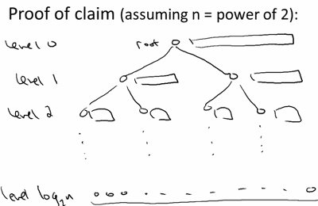
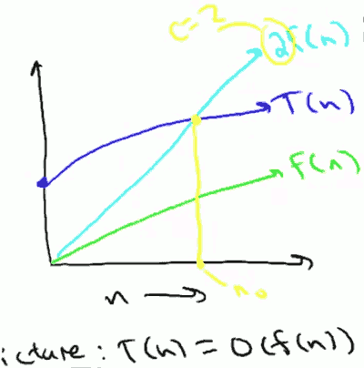
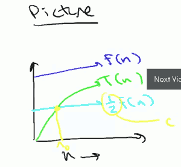
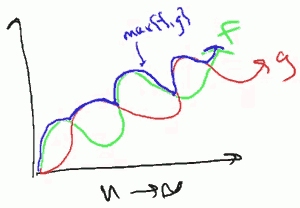
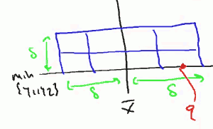
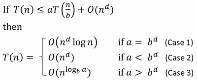
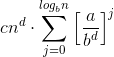
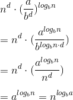

...menustart

 - [算法1,2](#db8c4fa2ffa5f5337a11c39e5c3548bf)
     - [Introduce](#19a655d3c2b379ac5f3939da282171ce)
         - [* Merge sort 归并排序](#2c25ac4f1d4c0332ec7361b4a588027c)
             - [Running time](#2dffdee1d503567d43c631986c599012)
             - [Mergesort: practical improvements](#f1579c6456d1081d1fb1fab0538c9fd0)
             - [Asymptotic analysis 渐近分析](#a3b94ca02e9a48292c9644ca761f6370)
                 - [Big-Oh](#fede0c757a997bccb043b815fae4b9c0)
                 - [Big Omega Ω](#daa4de82b37d76981d80c7ccbacabc06)
                 - [Theta Notation Θ](#f7013ee4fafd97a3dfd919d868a4e46c)
                 - [Little-Oh Notation](#fd6fd45dcd7b59f02ed1cb5a099d0c8c)
                 - [例子](#8cb94eb1990adbea3766315549a066d8)
         - [* Counting Inversions 计算逆序](#96e912ecc2f216fb4592e14b6fc0f253)
         - [* closest pairt 距离最近两个点](#a7821e54d9166580e80d347a40579b9b)
             - [Master Method](#3d588385624782d33755dbed1d2055b0)
             - [Proof Master Method](#62ba17118eebe254d98279c6b41311d1)
         - [* BinarySearch](#2eb8bb773d9f8334d49ff0ded73c5a1e)
         - [* Quick Sort](#09fa4ffc1e0ce3b966b8e18f696c808a)
     - [Linear-Time Selection](#e9bced6ef0b00f17aa977807b93dc751)
         - [* Randomized Selection](#465c2b7e3cca8883109e9929ea950b48)

...menuend


<h2 id="db8c4fa2ffa5f5337a11c39e5c3548bf"></h2>


# 算法1,2

 
<h2 id="19a655d3c2b379ac5f3939da282171ce"></h2>


## Introduce

<h2 id="2c25ac4f1d4c0332ec7361b4a588027c"></h2>


### * Merge sort 归并排序

merge sort 是分治法的应用范例。

`分治法思路:`

 1. 把输入array 拆成两部分
 2. 对两个子数组 进行递归排序(调用自己)
 3. 合并两个已排序的数组

`MergeSort 代码实现如下:`

```python
def MergeSort(lists):
    if len(lists) <= 1:  # exit condition
        return lists
    num = int( len(lists)/2 ) # (1)
    left = MergeSort(lists[:num])  #(2)
    right = MergeSort(lists[num:]) #(2)
    return Merge(left, right)  #(3)
```
  
`分析:`

可以看到, 在递归算法 在`某一级`的函数调用中:

 - (1)把array分成两个子数组,(2)是两次函数调用, 分治法中,这两部分只是概念上的东西，可以忽略它们的时间消耗; 
 - (3)需要把两个数组合并, 大量的计算都发生在这里，这是我们关心的重点。

`Merge代码（3）实现如下:`

```python
def Merge(left,right):
    r, l=0, 0
    reslut=[]
    while l<len(left) and r<len(right):
        if left[l] < right[r]:
            reslut.append(left[l])
            l += 1
        else:
            reslut.append(right[r])
            r += 1
    reslut += right[r:]
    reslut += left[l:]
    return reslut
```

<h2 id="2dffdee1d503567d43c631986c599012"></h2>


#### Running time 

`Merge 单次 Running Time:`

我们来看一下 Merge 方法执行的代码行数。函数中有一个while循环体, 循环体外是4行代码; 循环体每次执行都会执行4行代码, 共执行m次循环, m等于left,right两个数组的长度和。所以，我们可以认为 Merge方法单词调用的 running time <= 4m+4。因为m>=2, 所以 runing time <= 6m.

6m 只是 Merge方法 一次调用的时间，我们感兴趣的是 整个 Merge Sort的执行时间。


`Merge Sort total running time:`

recursion tree: 把 算法过程，用一颗`树`的结构表示出来。分治算法可以使用一颗`二叉树`来表示，为了简化，我们假设 待排序数组的长度 n为2的幂, 这样我们得到的就是一个`完整二叉数`。




我们可以知道，树的深度 levels = log₂n , 第log₂n层 的每个leave 都只有`1`个数据。

对每一层 ,level j=0,1,2,...,log₂n , 有`2ʲ`个子问题，没有子问题的数据长度是 `n/2ʲ` (数据总长度/子问题个数).

所以对于某一层 level j, 总的 running time = 子问题数*子问题的运行时间= `2ʲx6( n/2ʲ )` = 6n。非常棒，level j 的 running time 和j完全无关。

把所有level的running time相加，得:

Total Runing time = 6n x (log₂n +1) = `6n·log₂n + 6n` .

<h2 id="f1579c6456d1081d1fb1fab0538c9fd0"></h2>


#### Mergesort: practical improvements

 - Mergesort has too much overhead for tiny subarrays
 - 对于小数组，eg. len < 8 , use insertion-sort instead
 

<h2 id="a3b94ca02e9a48292c9644ca761f6370"></h2>


#### Asymptotic analysis 渐近分析

high-level idea: 忽略 低阶项 和 首项系数。

example:  Merge sort 的 `6n·log₂n + 6n` 在渐近分析中 等价与 `nlog₂n`.

Terminology 术语: Merge sort running time = `O( nlogn )`

<h2 id="fede0c757a997bccb043b815fae4b9c0"></h2>


##### Big-Oh

算法的时间复杂度是一个函数，它定量描述了该算法的运行时间。

时间复杂度常用大O符号表述，不包括这个函数的低阶项和首项系数。

一般情况下，算法的基本操作重复执行的次数是模块n的某一个函数f(n)，因此，算法的时间复杂度记做：`T(n)=O( f(n) )`

常见复杂度等级: `1，log₂n，n，nlog₂n ，n²，n³，2ⁿ，n! `

`Big-Oh Formal Definition (正式定义):`

当且仅当 存在两个常数 c , n₀ (n₀>0),  使得对于任意 n>=n₀, T(n) <= c·f(n), 则计为 `T(n)=O( f(n) )`.  简单理解，就是 fn乘上一个数，比T(n)大就行。

`O 描述T的上限`。

`注意: c 和 n₀ 不可以依赖于n`





`example 1:` 

T(n) = `aⱼuʲ`+ ... + a₁n+ a₀ , 证明 T(n) = O(`nʲ`)

证: n₀=1, c=|aⱼ| + ... + ... |a₁| + |a₀|, 对于 n>= 1, T(n)<= c·f(n)

`example 2:`

证明: 对于任意 k>=1 , nᵏ is not O( nᵏ⁻¹ )

假设存在c , n₀, 使得当 n>=n₀时, nᵏ <= c·nᵏ⁻¹ , 等式约减, 得出: n<=k 。

c , n₀ 不可以依赖于 n ，所以假设不成立。

<h2 id="daa4de82b37d76981d80c7ccbacabc06"></h2>


##### Big Omega Ω

`Ω 描述T的下限`。

当且仅当 存在两个常数 c , n₀ (n₀>0),  使得对于任意 n>=n₀, T(n) >= c·f(n), 则计为 `T(n)=Ω( f(n) )`.  简单理解，就是 fn乘上一个数，比T(n)小就行。



note:

大O符号表示函数在增长到一定程度时总小于一个特定函数的常数倍
大Ω符号则表示 总大于。

设函数f ( n )代表某一算法在输入大小为n的情况下的工作量（效率），则在n趋向很大的时候，我们将f (n)与另一行为已知的函数g(n)进行比较：

4）如果f(n)在数量级上小于或等于g(n)，则记为f (n)=O( g(n))。
5）如果f(n)在数量级上大于或等于g(n)，则记为f (n)=Ω( g(n))。


<h2 id="f7013ee4fafd97a3dfd919d868a4e46c"></h2>


##### Theta Notation Θ

Θ== T

T(n)=Θ( f(n) )  当且仅当 T(n)=O( f(n) ) and T(n)=Ω( f(n) )。

等价于: 当且仅当 存在3个常数 c₁,c₂,n₀(n₀>0),  使得对于任意 n>=n₀, c₁·f(n)<=T(n)<=c₂·f(n).


<h2 id="fd6fd45dcd7b59f02ed1cb5a099d0c8c"></h2>


##### Little-Oh Notation

和 Big-Oh 类似，只是 常数c 只能取正数。

eg. for all k>=1 , nᵏ⁻¹=o( nᵏ )


<h2 id="8cb94eb1990adbea3766315549a066d8"></h2>


##### 例子

题目: T(n)=0.5·n² + 3n , 哪些是对的？

 1. T(n)=O(n)
 2. T(n)=Ω(n)     //(n₀=1, c=0.5)
 3. T(n)=Θ(n²)    //(n₀=1, c₁=0.5, c₂=4) 
 4. T(n)=O(n³)    //(n₀=1, c=4)

答案: 2,3,4 , (问题: T(n)=O(n²)也正确? )

---

题目: 证明 2ⁿ⁺¹⁰ = O(2ⁿ)
证: c=1024, n₀=1

---

题目: 证明 2¹⁰ⁿ != O(2ⁿ)
证明: 假设 2¹⁰ⁿ = O(2ⁿ) , 则 2¹⁰ⁿ<= c·2ⁿ , 则  2⁹ⁿ<= c , c 不可以依赖于n，所以假设不成立。

---

题目: 函数f(n) , g(n) 只输出正值， 证明 max(f,g)=Θ(f(n) + g(n))



证明: 如图可知, 

因为f(n) , g(n)>0,  所以 max(f,g)<= f(n) + g(n) , eg. max(2,4) <= 2+4。

又有 2 max(f,g) >= f(n) + g(n)  , eg. 2*max(2,4) >= 2+4，

所以 max(f,g) >= 0.5( f(n) + g(n) ).

于是: 0.5( f(n) + g(n) ) <= max(f,g) <= ( f(n) + g(n) ) , 得证。


<h2 id="96e912ecc2f216fb4592e14b6fc0f253"></h2>


### * Counting Inversions 计算逆序

题: 计算一个数组中，逆序的个数, eg. (1,3,5,2,4,6) 逆序个数为 (3,2),(5,2),(5,4) 3个。

`O( n² ) 算法lua代码:`

``` lua
cnt = 0
n= 6
for i=1,n-1 do
    for j=i+1,n do
        if A[i]>A[j] then
            cnt = cnt +1
        end
    end
end
```

`O( nlogn ) 分治法算法:`

 1. 把输入array 拆成两部分
 2. 对两个子数组  计算逆序数 X,Y
 3. 计算 子数组 之间统计关系 Z , 返回 X+Y+Z
 
第3步 牵涉到两个子数组的遍历，复杂度上很难做到线性，这里我们需要参考merge sort的做法，最后处理两个有序数组会简单的多。

```python
def Sort_Count_Inv(lists):
    if len(lists) <= 1:  # exit condition
        return 0,lists
    num = int( len(lists)/2 ) 
    X,left = Sort_Count_Inv(lists[:num]) 
    Y,right= Sort_Count_Inv(lists[num:]) 
    Z,D  = Merge_Count_Inv(left, right)

    return X+Y+Z , D
```

Merge_Count_Inv 方法的关键: 如果输入array没有逆序存在，那么数组是有序的，且left array的所有元素都 '<=' right array 中的元素。merge的时候，必然是left array中的元素完全被合并光，再开始处理right array. 换句话说，当merge 每次从 right array中合并数据的时候，left array中的剩余元素,都是逆序。

```python
def Merge_Count_Inv(left,right):
    r, l=0, 0
    cnt = 0
    reslut=[]
    while l<len(left) and r<len(right):
        #这里必须改为<=
        if left[l] <= right[r]: 
            reslut.append(left[l])
            l += 1
        else:
            reslut.append(right[r])
            r += 1
            # 计算逆序
            cnt += len(left)-l

    reslut += right[r:]
    reslut += left[l:]
    return cnt , reslut  
```


<h2 id="a7821e54d9166580e80d347a40579b9b"></h2>


### * closest pairt 距离最近两个点

题：有一组点[ (x₁,y₁),(x₂,y₂),...,(xn,yn) ] ,求距离最近的两个点。

`1-D case:`

假设这些点都是1-D的, 那么只需要把这些点排序，然后遍历n找出距离最短的两个点。


`思路:`

 - 拆成两个子array
 - 计算出 两个子数组的 cloest pair : pair1,pair2
 - 计算两个子数组的 split closest pair pair3, 返回min(D(pair1),D(pair2),D(pair3))

第3部分是难点, 线性处理两个子数组，才能保证这个算法O(nlogn).

现在，可能发生两种情况

 1. 好的情况: closest pair (p,q)就在两个子数组中,这样就可以不用处理第3部分了。
 2. 坏的情况: closest pair, p在一个子数组中，q在另一个。我们需要额外的计算 closest split pair (CSP)的情况。

```python
def D( p, q ) :
    return pow( p[0]-q[0] ,2 ) + pow( p[1]-q[1] ,2 )                      
              
from itertools import combinations 
import operator                    
def ClosestPairIn3Points( l ) :    
    c = list(combinations( l , 2  ))
    dists = [ D(p,q) for p,q in c ]
    index , val = min(enumerate(dists), key=operator.itemgetter(1))
    return c[index]                
              
def ClosestPair( lists_x, lists_y ):
              
    if len(lists_x) <= 3:          
        return ClosestPairIn3Points( lists_x  )

    #分成两个子数组
    num = int( len(lists_x)/2 ) 
    left = lists_x[:num]
    right = lists_x[num:]

    # 每个子数组分别对 x,y排序，得到新数组
    left_x  = left # already sorted by x 
    left_y  = sorted(left, cmp = lambda a,b : cmp( a[1],b[1] ))

    right_x = right # already sorted by y 
    right_y = sorted(right, cmp = lambda a,b : cmp( a[1],b[1] ))

    # 每个子数组计算 closest pair
    (p1,q1) = ClosestPair( left_x, left_y )
    (p2,q2) = ClosestPair( right_x, right_y )

    def D( p, q ) :
        return pow( p[0]-q[0] ,2 ) + pow( p[1]-q[1] ,2 )

    # 获取子数组最小距离
    delta = min( D( p1,q1 ) , D( p2,q2) )
    delta = math.sqrt( delta )

    l = [ (p1,q1) ,  (p2,q2)  ]

    (p3,q3) = ClosestSplitPair( lists_x, lists_y , delta )
    #print p1,q1, ',' , p2,q2 , ',' , p3,q3 , '--'  , delta , lists_x

    if p3 and q3:
        l += [ ( p3,q3) ]

    #print "-" , lists_x
    #print l , delta

    return min( l , key=lambda a: D(a[0],a[1]) ) 
```

`计算 closest split pair (CSP) (p,q):`

令 x_mean 等于 left_x 中点最大的x, delta 等于两个子数组的closest pair的距离, 所以我们可以知道:

 1. CPS p和q 一个x in [x_mean-delta,x_mean], 一个x in (x_mean,x_mean-delta]
 2. CPS p和q y 相差< delta
 3. 以 delta/2 为单位划分, 把 2delta x delta 的矩形划为8哥部分.
 4. p 和 q 必然 一个位于一侧的4个小格中，一个位于另一侧4个小格中
 5. 每个小格最多只可能有1个点存在，因为假设同一格中存在两个点，那么他们的距离就会小于delta, 而且这两个点是同left,同right的。矛盾，假设不成立。
 6. 如果对数组做 x in [x_mean-delta,x_mean+delta] 过滤，并且新数组按y 排序, q一定会在p 后面的连续的7个位置内。



```python
def ClosestSplitPair( lists_x, lists_y , delta ):
    num = int( len(lists_x)/2 ) 
    x_mean = lists_x[num-1][0]
    #print 'l:' , lists_x[num/2-1] , lists_x
          
    # 只取 x 在 [ x_mean-delta, x_mean+delta ] 中的点，按y排序
    Sy = [ p for p in lists_y if abs( p[0] - x_mean ) <= delta ]
    #print "filter: " , num , x_mean , delta,  Sy 
          
    min_dist = delta*delta
    bestPair = ( None , None ) 
    #过滤完成后，
          
    for i in xrange(  len(Sy) -1  ):
        for j in xrange( i+1, i+1+5): # 7 -> 5 
            if j >= len(Sy):
                continue
            p = Sy[i] 
            q = Sy[j]
          
            dist =  D( p, q )
            if dist < min_dist:
                min_dist = dist 
                bestPair = ( p , q ) 
          
    return bestPair

```


<h2 id="3d588385624782d33755dbed1d2055b0"></h2>


#### Master Method

如图: 递归方法的T(n)各种情况下的时间复杂度



`a`: 子递归的数量 (>=1), 
`b`: 输入数据 拆分因子(被拆成几部分) (>1)  (注：斐波那切递归算法不满足这条)
`d`: combine step 的时间复杂度指数 

`example merge sort:`

a=2, 分成两个 子递归
b=2, 输入数据拆成了 2个 n/2  
d=1, merge sort combine step = O(n¹)

a = bᵈ , 所以 merge sort 是 case(1): O(nᵈlogn) = O(nlogn)

`example binary search:`

a=1 , 只会有1个子问题
b=2 , 输入数据对半拆分成2部分
d=0 , combine step, 数值大小比较 O(1) 

a = bᵈ , 所以 binary search 也是 case(1) , O(nᵈlogn) = O(logn)

`example 普通整数乘法:`

a=4, 拆成4个2级乘法
b=2, 数据拆成2份
d=1, combine 部分把4个运算结构移位拼接，线性 O(n)

a < bᵈ , 所以是case(3) ,  O(n²)

`Karatsuba算法:`

a=3 和普通整数乘法位移区别
b=2
d=1 

a > bᵈ , 所以是case(3) ,  O(nˡᵒᵍ₂³) ≈ O(n¹·⁵⁹)

`T(n)<= 2·T(n) + O(n²) :` 

Karatsuba算法可能想象成 combine step 的复杂度是 O(n²)的 'merge sort'

a=2
b=2
d=2

a < bᵈ , 所以是case(2) ,  O(n²)

    注：直觉上，应该是 n²logn, 但其实这样会导致 over estimated.

---

<h2 id="62ba17118eebe254d98279c6b41311d1"></h2>


#### Proof Master Method

我们看一下 recursive tree 的某一层 level j 的计算量

number of all subproblems at level j:   `aʲ`
subproblem input size at level j:       `n/bʲ`

work on each subprolbem <= `C·( n/bʲ )ᵈ` , C是为了算上递归方法外的计算消耗
work on level j <=  `aʲ * C·( n/bʲ )ᵈ` = `cnᵈ·[a/bᵈ]ʲ`

把所有层的work 相加，得到

`total work ` <= 

> a: rate of subproblem  profile action (RSP)
b: rate of work shrinkage (RWS)

可以看到，如果 RSP<RWS, 每一层的 amount work 在减少;如果 RSP<RWS,每一层的 amount work 在增加; 如果 RSP==RWS,每一层 amount work 相同。

我们来看一下 master method的三种情况：

> 1. RSP==RWS, total work <= cnᵈ·logᵦn = O(nᵈ·logn)
> 2. RSP < RWS, most work at root, less work at each level, `[a/bᵈ]ʲ`是1个几何级数 1 + x + x² + x³ + ..., 当x小与0是，最终收敛为:1/(1-x)。 所以 `Σ[a/bᵈ]ʲ`和n无关, <= constant. 所以 total work = O(nᵈ)
> 3. RSP > RWS, more work at each level,  `Σ[a/bᵈ]ʲ` <= constant * largest term (eg.1+2+4+...+128 < 256). 所以， total time = O( nᵈ·(a/bᵈ)ˡᵒᵍ𝑏ⁿ ).
    
    最终表达式，其实就是 recursive tree 的叶子数。


---

<h2 id="2eb8bb773d9f8334d49ff0ded73c5a1e"></h2>


### * BinarySearch

```python
def BinarySearch( sorted_list , lo, hi , num ):
    if lo > hi :  #protection
        return -1   # not found 

    iMid = (lo + hi) /2 

    if sorted_list[iMid]  == num:
        return iMid
    elif sorted_list[iMid]  > num:
        hi = iMid -1
        return BinarySearch( sorted_list , lo, hi , num )
    else:
        lo = iMid +1
        return BinarySearch( sorted_list , lo, hi , num )
    
    return -1
```

<h2 id="09fa4ffc1e0ce3b966b8e18f696c808a"></h2>


### * Quick Sort

> key idea: partition around a pivot

从数组中挑选一个元素作为 pivot，比如挑选第一个元素。

重新排序数组，使得 在 pivot 左边的元素，都比 pivot 小，在pivot 右边的元素，都比 pivot 大。 这样, pivot(only)就被放到最终排序数组的正确位置了。

> Description QuickSort( array A , length n ):

 - if n==1 return
 - p = ChoosePivot( A,n )
 - partition A around p
 - recursively sort  1st part
 - recursively sort  1nd part

> Partition algorithm : Partition(A,l,r)

```
choose mid element as pivot
swap pivot <-> 1st element  // 把 pivot 放到数组第一个
p:=A[l]  
i:=l+1   // i指向第一个 >p 的数据，i左边的数据,都小于p
for j:=l to r   // j 遍历 unpartitioned array
    if A[j] < p     // j 如果遍历到 <p 的元素
        swap A[j] and A[i]   // 交换 i和j的数据, 
        i++                 // 同时i 向后移动一步
swap A[l] and A[i-1]   // i 是 <p 和 >p 数据分界点，交换 l和 i-1的数据
                       // 这样p就处在了正确的位置了
```


p|... < p ...|... > p ...| ? unpartitioned
--- | --- | --- | ---
- |  | i  | j

> quicksort python 实现:

```python
# [ lo , hi ]
def QuickSort( lists , lo , hi  ):
    if hi - lo < 1 : 
        return

    iMid = random.randint(lo , hi)    # random choose  pivot
    lists[lo],lists[iMid]=lists[iMid],lists[lo]  

    p = lists[lo]

    # partition
    i = lo +1   # i will seperate the elements those <p and >p
    for j in xrange( i, hi+1 ) : # go through unpartitioned array
        if lists[j] < p:   # find a element should move 2 left
            lists[i],lists[j] = lists[j],lists[i]
            i += 1

    lists[lo] , lists[i-1] = lists[i-1] , lists[lo]

    # recursive
    QuickSort( lists , i , hi  )  # 大于 等于P的element 
    QuickSort( lists , lo , i-2  ) # 小于p的element, i-1是p,不再进行排序
```

> 算法分析:

 - bad case: 快速排序一个sorted array, 每次选 1st element as pivot, 时间复杂度 O(n²)
 - avarage case: 时间复杂度 O(nlogn) , n+(n-1)+(n-2)+...+1

---

<h2 id="e9bced6ef0b00f17aa977807b93dc751"></h2>


## Linear-Time Selection

<h2 id="465c2b7e3cca8883109e9929ea950b48"></h2>


### * Randomized Selection

 - Input: array with n size
 - Output: iᵗʰ smallest element (第i小得元素)

> Method 1: Reduction to Sorting - O(nlogn)

 1. apply merge sort
 2. return iᵗʰ element

> Method 2: partition used in QuickSort

在一个长度10的数组中，找5ᵗʰ smallest element, 假设第一次 partition pivot的位置是 3ᵗʰ,那么所求元素就是 右侧子数组的 2ᵗʰ元素。

running time 依赖于 pivot的选择，bad case O(n²), 因为随机选择 pivot的原因，一般不会 bad case， Randomized Selection 期望运行时间为Θ(n).

和 quick sort 相比，Randomized Selection `不需要对整个数组进行排序`，这是O(n)实现的关键。

```
 RSelect( array A , length n , order  )
 if n==1 return A[0]
 random choose pivot from A
 partition A around p
 let pi = new index of p (p最终在array中的位置)
 if pi==order  return p (正好是要找的)
 if pi>order  return RSelect( 1st part of A , pi-1, order )
 if pi<order  return RSelect( 2nd part of A , n-pi, order-pi )
```

```python
# param : order start from 0
# return: order-th smallest element
# Caution: will modify raw array 
def RSelect( lists , lo, hi  , order ):
    if hi - lo < 1 : 
        return lists[lo]   

    iMid =  (lo+hi)/2 #random.randint(lo , hi)    # random choose  pivot  
    lists[lo],lists[iMid]=lists[iMid],lists[lo]  

    p = lists[lo]

    # partition
    i = lo +1   # i will seperate the elements those <p and >p
    for j in xrange( i, hi+1 ) : # go through unpartitioned array
        if lists[j] < p:   # find a element should move 2 left
            lists[i],lists[j] = lists[j],lists[i]
            i += 1
            

    lists[lo] , lists[i-1] = lists[i-1] , lists[lo]

    pi = i-1  # new index of pivot

    #print pi, order 
    if pi == order:
        return p 
    elif pi > order: # too more, find in left 1st array
        return RSelect( lists, lo , pi-1, order )
    else:  # pi < order 
        # 这里我们复用原数组，所以 order 不需要变
        return RSelect( lists, i , hi , order  ) # - (i-lo) 
```

