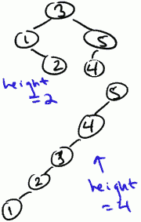
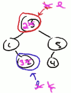
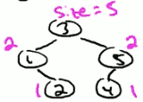
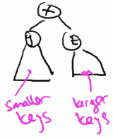
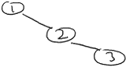
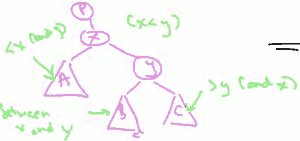
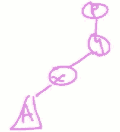
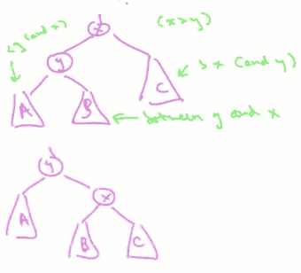
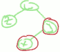

...menustart

 - [Balanced Search Trees](#9dea71a1a7eb5766489f59228ba59dd8)
     - [Operations and Applications](#6a80cb76a26187df87a7b43a12c0e0f3)
     - [Binary Search Tree Basic](#cfeaa05958915b238940497d6bb60414)
         - [BST Structure](#5704ff3f40edc371aa1479c13ccd29f8)
         - [Search Tree Property](#944904d121069fa4c08193d75edb01a6)
         - [The Height of a BST](#b19b9a37c91097b32d94e1eef44f2785)
         - [To Search for key k in Tree T](#ecc3180ec9081ee32b214c27daaae2dc)
         - [To Insert a new key k into a tree T](#4edf683a223aa31e0bce675f514dfe32)
     - [Binary Search Tree Basic 2](#9a415c4437c3ba377c4e3ef8ec6ff928)
         - [Min, Max](#ed21b107691577d1376cf244d47e82be)
         - [Predecessor , Succ](#859a60fdae4357963b77e43d7d4d3a63)
         - [In-order Traversal](#6b1caea37c6abdf318a56b83f9bfaf0b)
         - [Deletion](#a1998652b01bdc9e7128734efb804780)
         - [Select and Rank](#3328d40c5cd0a24e4d2840a65e9beb0b)
     - [Red-Black Tree](#8e1bb9c202334ab96e41eaa92392796b)
         - [Red Black Invariants](#88981d0dca5ebaf538f272ab76e80299)
         - [Height Guarantee](#b42092d6d96b1c60391092020571e2f6)
     - [Rotation](#f1a42bd417390fc63b030a519624607a)
         - [left Rotation](#ba0e5a778c4af39fa1f5490facee5426)
         - [Right Rotation](#e6ad724c551d04a2bd3b029a5758250b)
     - [Insertion in a Red-Black Tree](#8e9eda8747c50f702a6f9f95de2f381e)

...menuend


<h2 id="9dea71a1a7eb5766489f59228ba59dd8"></h2>


# Balanced Search Trees

<h2 id="6a80cb76a26187df87a7b43a12c0e0f3"></h2>


## Operations and Applications

What's balanced search Tree ?  I recommend thinking about it as a dynamic version of a sorted array.

BST likes  sorted array + fast(logarithmic) insertions and deletions.

---

RANK: how many keys stored in the data structure are less than or equal a given value.

Operation | sorted array | BST |  heap | Hash 
--- | --- | --- | --- | ---
search | θ(logn) | O(logn) | | ok
select (`iᵗʰ`) | O(1) | O(logn),up from O(1) |
min/max | O(1) | O(logn),up from O(1) | only support MIN or MAX at 1 time
pred/succ | O(1) | O(logn),up from O(1) |
RANK | O(logn) | O(logn) |
output in sorted order | O(n) |O(n) |
insertion | unacceptable |O(logn) | O(logn) | Really good
deletion | unacceptable  |O(logn) | O(logn) | Really good
 

**注意** 这里BST 的 O(lgn)算法都是 balanced search tree. 

普通的binary search tree, 这些操作都是 O(n) , 实际中 复杂度依赖于 h: heigt of the tree, and  h≈lgn if keys inserted in random order !!!
 
---

<h2 id="cfeaa05958915b238940497d6bb60414"></h2>


## Binary Search Tree Basic

<h2 id="5704ff3f40edc371aa1479c13ccd29f8"></h2>


### BST Structure 

 - exactly one node per key
 - most basic version
    each node has:
    - left child pointer
    - right child pointer 
    - parent pointer (root has null )

<h2 id="944904d121069fa4c08193d75edb01a6"></h2>


### Search Tree Property 

 - any arbitrary node of tree with key x
 - all keys in left subtree < x . (<= if duplicate key allowed)
 - all keys in right subtree > x . (>= if duplicate key allowed)


<h2 id="b19b9a37c91097b32d94e1eef44f2785"></h2>


### The Height of a BST

 - many possible search trees for a set of keys
 - height could be anywhere from ≈ logn to ≈ n 
    - height=logn , best case perfectly balanced
    - height=n, worst case a chain


    


<h2 id="ecc3180ec9081ee32b214c27daaae2dc"></h2>


### To Search for key k in Tree T

for simplicity the first think about the case where there are no duplicated keys.

```
- start at the root
- traverse left/right child pointer as need
- return node with key k or NULL
```

<h2 id="4edf683a223aa31e0bce675f514dfe32"></h2>


### To Insert a new key k into a tree T

```
- search for k (unsuccessfully because assuming no dup)
- rewire final NULL ptr to point to new node with key k
```

<h2 id="9a415c4437c3ba377c4e3ef8ec6ff928"></h2>


## Binary Search Tree Basic 2

Q: What's the worst-case running time of **Search(or Insert)** operation in a binary search tree containing n keys ?

A: θ(height)

<h2 id="ed21b107691577d1376cf244d47e82be"></h2>


### Min, Max

*To compute the minimum key of A tree*:

minimum key is always at the left most offspring , so just follow the left child pointers.

```
- start at root
- follow left child pointer 
    unitl you can't go anymore
    (return last key found)
```

maximum key is always at the right most offspring, so just follow the right child pointers.

<h2 id="859a60fdae4357963b77e43d7d4d3a63"></h2>


### Predecessor , Succ

Predecessor: given key in the tree,  find the next smallest element. eg. show as the pic above, the pred of 3 is 2.

*To compute the predecessor of key k*:

- easy case: if k's left subtree non-empty
    - return max key in left subtree
- otherwise: follow parent pointers unitl get to a key less than k

优先左子孙中查找最大的，没有则去父辈中查找第一个满足条件的。

---

Q: What's the worst-case running time of **Max** operation in a binary search tree containing n keys ?

A: θ(height)

---

<h2 id="6b1caea37c6abdf318a56b83f9bfaf0b"></h2>


### In-order Traversal

To print out keys in increasing order

```
- let r = root of BST, with subtress T_l and T_r
- recurse on T_l  #print keys in order
- print key of root
- recurse on T_r  #print keys in order
```

处理方法近似分治法的思想，每个 recursive call 实际只是 print key of the root, it n(1) , and every key will be printed only once. so the **Running time is O(n)**.

<h2 id="a1998652b01bdc9e7128734efb804780"></h2>


### Deletion

In most data structions, deletion is the most difficult operation , and in search trees there is no exception.

To delete a key from a BST


 - search for k  # find where it is
 - EASY CASE ( k's node has no children )
    - just delete the k's node from tree
 - MEDIUM CASE ( k's node has 1 child )
    - delete the node that you want to delete, that creates a hole in the tree, the unique child will take that hole. 
 - DIFFICULT CASE ( k's node has 2 children )
    - compute k's predecessor l
    - SWAP k and l , NOTE definitly new position k has no right child , now k's node has 1 or 0 child , we know how to delete it already.




Runnint time: θ(height)

<h2 id="3328d40c5cd0a24e4d2840a65e9beb0b"></h2>


### Select and Rank

IDEA: store a little bit of extra info about each tree node *about the tree itself* .

Example Augmentation:

size(x) = number of tree nodes in subtrees rooted at x.




Note: if x has children y and z , then **size(y) + size(z) + 1 equals size(x)**.

How to select iᵗʰ ordered statistic from augmented searth tree (with subtree sizes)



```
- start at root x, with children y and z
- let size_leftChild = size(y) # size_leftChild=0 if x has no left child
- if size_leftChild=i-1 return key of x  #BEST CASE
- if size_leftChild> i-1 , recursively compute iᵗʰ ordered statistic of search tree rooted at y
- if size_leftChild < i-1 recursively compute (i-1 -size_leftChild)ᵗʰ ordered statistic of search tree rooted at z
```
 
Runnint time: θ(height)

--- 

<h2 id="8e1bb9c202334ab96e41eaa92392796b"></h2>


## Red-Black Tree

红黑树（Red Black Tree） 是一种自平衡二叉查找树，是在计算机科学中用到的一种数据结构，典型的用途是实现关联数组。

红黑树和AVL树类似，都是在进行插入和删除操作时通过特定操作保持二叉查找树的平衡，从而获得较高的查找性能。

The running time of all of operations of search trees depends on the height of tree.  It's so important to have a small height.
      
IDEA: ensure the height always O(logn) [best possible] => Search / Insert / Delete / Min / Max / Pred / Succ will then run in O(logn) time [n=#keys in tree]

Example : red-black trees 

<h2 id="88981d0dca5ebaf538f272ab76e80299"></h2>


### Red Black Invariants

 1. each node red or black
 2. root is black
 3. no 2 reds in a row
    - red nodes => only black children 
 4. every path you might take from a root to a null pointer , passes through exactly the same number of black nodes.
    - root null path: like as an unsuccessful search
    - any unsuccusful search you pass through the same number of black nodes


**Claim**: a chain of length 3 can not be a RBT.




**Proof**: There is 3 nodes in the tree. The 1st has to be black, so there is 4 possible ways to color the 2nd and 3rd: BB, BR, RB, RR. But really , beacuse of the third invariant , RR is not allowd. If we color 2nd red and 3rd black, the invariant broken: when search 0, you pass through 1 black node, when search 4, you pass through 2 black nodes. Also the BB and BR will lead to same result. so proved.

<h2 id="b42092d6d96b1c60391092020571e2f6"></h2>


### Height Guarantee

**Claim*: every red-black tree with n nodes has height <= 2log(n+1).

**Proof**: 

 - size n> 2ᵏ-1 , where k = minimum #nodes of root-null path (in a binary tree).
    - => k<=log₂(n+1) 
 - Thus, in a red-black tree with n nodes, therer is a root-null path with at most log₂(n+1) black nodes.
 - By 4th invariant: **every** root-null path has <=log₂(n+1) black nodes.
 - By 3rd invariant: **every** root-null path has <= 2log₂(n+1) total nodes.
    - black nodes are a majority of nodes in the tree. So if we know the number of black nodes is small, then because you can't have two reds in a row, the number of total nodes on the path is at most twice as large (BRBRB...).

这些约束强制了红黑树的关键性质: 从根到叶子的最长的可能路径不多于最短的可能路径的两倍长。

结果是这个树大致上是平衡的。

因为操作比如插入、删除和查找某个值的最坏情况时间都要求与树的高度成比例，这个在高度上的理论上限允许红黑树在最坏情况下都是高效的，而不同于普通的二叉查找树。


<h2 id="f1a42bd417390fc63b030a519624607a"></h2>


## Rotation

当我们在对红黑树进行插入和删除等操作时，对树做了修改，那么可能会违背红黑树的性质。

为了保持红黑树的性质，我们可以通过对树进行旋转，即修改树种某些结点的颜色及指针结构，以达到对红黑树进行插入、删除结点等操作时，红黑树依然能保持它特有的性质.

 - **KEY PRIMITIVE**: Rotations
    - common to all balanced search tree implementations - red-black, AVL, B+ , etc 
 - **IDEA**: locally re-balance subtrees at a node in O(1) time.

<h2 id="ba0e5a778c4af39fa1f5490facee5426"></h2>


### left Rotation

  - left Rotation: of the parent x , and right child y


 
currently x is the parent and y is the child. We want to rewire a few pointers so that y is the parent and x is the child.  Because x<y , So if x will be a child of y, it's got to be the left child.

 - x's parent p
    - y will inherit x's parent p
 - subtrees A,B,C:
    - after y becoming x's child , there is 3 child slot left for A,B,C
    - A < x and y, so A should be x's left child (no change)
    - C > x and y, so C should be y's right child (no change)
        - 
    - B used to be y's left child, but now x is y's left child, so the only hope is to slot B into the only space we have is x's right child. Fortunately for us this acctually works.
        - 

---

<h2 id="e6ad724c551d04a2bd3b029a5758250b"></h2>


### Right Rotation




Rotation Running Time:

search tree property invariant, can implement in O(1) time.


<h2 id="8e9eda8747c50f702a6f9f95de2f381e"></h2>


## Insertion in a Red-Black Tree

**IDEA for insertion/deletion**:

proceed as in a normal binary search tree, then recolor and perform rotations until invariants are restored.

**Insert x**:

 1. insert x ans usual (make x a leaf) **y->x**
 2. try coloring x red
    - when we colorize x, it has potential to break the invariants. if we color x red, 3rd invariant may be broken; if we color x black, 4th invariant may be broken.
    - 插入黑点会增加某条路径上黑结点的数目，从而导致整棵树黑高度的不平衡
 3. if x's parent y is black , done.
 4. else y is red.
    - if y is red, it should be the root, y must have a parent, we call it ***w*** , y has a black parent ***w***.
 5. there is 2 different cases:
    - case 1: the other child z of w is also red
    - 
    - solution: recolor y,z black, w red
    - 但由于w 的父节点有可能为红色，从而违反红黑树性质。此时必须将 w节点作为新的判定点继续向上传播进行平衡操作。
    - ---
    - case 2: the other child z of w is NULL or black
    - solution: recoloring, rotations. [红黑树插入](http://blog.csdn.net/eric491179912/article/details/6179908)

