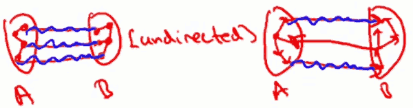
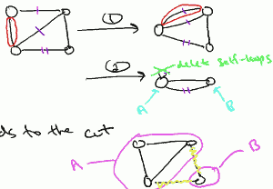
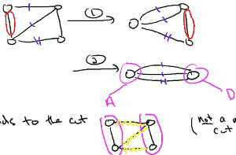

...menustart

 - [Graphs Minimum Cut](#8838f183aef5848250de4897b5cca27d)
     - [Graphs](#b1f975d5e57f73d265bd450020825183)
         - [Graphs](#b1f975d5e57f73d265bd450020825183)
         - [Cuts of Graphs](#700ca7a84453fe2e2cd6e86cf3487952)
         - [The Minimum Cut Problem](#d359711b4a2711f1b5bd1cb2df9bd593)
     - [Graph Representations](#ee3677876ffa61d1f94bf3105ebd5d59)
         - [Sparse vs. Dense Graphs 稀疏图和密集图](#ca053e50fb190468ef7a4495ab1bb8f1)
         - [The Adjacency Matrix 邻接矩阵](#2f61bb87d28860c4fceb6823a19da296)
         - [Adjacency lists 邻接表](#517f0edec32111fbc09b2c24bf45f5c4)
     - [Random Contraction Algorithm](#a52b9c1fd3cd8a0714384ab857ce49af)
         - [The 1st Iteraction](#c7a2f8ded128a3b4a7eca35d3c385c3c)
         - [The 2nd Iteraction](#fa01fad0da49c075b1a21923eb3620ed)
         - [All Iterations](#9de9247d481b4d611a7395f06f775b26)
         - [Repeated Trials](#f67eb7963d3bac1762a11b0c4ce1e2d5)
     - [The Number of Minimum Cuts](#7b0a4c5a471508b8553bba5a86c2709b)

...menuend


[TOC]


<h2 id="8838f183aef5848250de4897b5cca27d"></h2>


# Graphs Minimum Cut

<h2 id="b1f975d5e57f73d265bd450020825183"></h2>


## Graphs

<h2 id="b1f975d5e57f73d265bd450020825183"></h2>


#### Graphs

> Two ingredients:

 - vertices  ( nodes V )
 - edges (E) = pairs of vertices
 
根据vertices are `undirected` or `directed` , 图分为 `undirected graphs` and `directed graphs` .

<h2 id="700ca7a84453fe2e2cd6e86cf3487952"></h2>


#### Cuts of Graphs

> Definition:

A cut of a graph (V,E) is a partition of V into 2 non-empty set A and B.


> Definition:

The `crossing edges` of a cut(A,B) are those with :

 - one endpoint in A , one endpoint in B ( undirected )
 - tail in A, head in B ( directed )




> Question: Roughly how many cuts does a graph with n vertices have?

分组问题：A有1个顶点的情况，有n种, A有2个顶点的情况，有n*(n-1)/2种, ... ; 对于每个顶点，都有 A,B 两种情况，所以，n个顶点，有 2ⁿ 种情况。因为A，B非空，所以共 2ⁿ-2 种。

<h2 id="d359711b4a2711f1b5bd1cb2df9bd593"></h2>


#### The Minimum Cut Problem

`Input`: an undirected graph G=(V,E) , paralled edges "node ⋲⋺ node" allowd

`Goal`: find a cut with fewest number of crossing edges ( minimize )

> Application:

 - identify weakness of a phisical network
 - community detection in social network
 - image segmentation 图像分割

<h2 id="ee3677876ffa61d1f94bf3105ebd5d59"></h2>


## Graph Representations

> 如果无向图有n个顶点 都连通， no parallel edges。这个无向图，最少／最多有多少条边 ？

最少的情况，两个顶点之间只存在一条边，共 n-1 条边。

最多的情况，每个顶点，都与其他 n-1 个顶点相连，共 n·(n-1)/2 条边。

<h2 id="ca053e50fb190468ef7a4495ab1bb8f1"></h2>


#### Sparse vs. Dense Graphs 稀疏图和密集图

let n= #vertices , m= #edges , in most applications, `m=Ω(n) and O(n²)`.

 - in a 'sparse graph' , m is `Ω(n)` or close to it.
 - in a 'dense graph' , m is close to `O(n²)` 


<h2 id="2f61bb87d28860c4fceb6823a19da296"></h2>


#### The Adjacency Matrix 邻接矩阵

邻接矩阵是一个nxn 矩阵，矩阵元素 `Aᵢⱼ=1` 代表 存在 顶点 i-j 的边.

> variants 变种：

 - `Aᵢⱼ` = # i-j edges  ( if parallel edges )
 - `Aᵢⱼ` = weight of i-j edges ( if any )
 - `Aᵢⱼ` = `1` if i->j, or `-1` if i<-j  (directed)

邻接矩阵 需要的空间是 θ(n²)。
 
<h2 id="517f0edec32111fbc09b2c24bf45f5c4"></h2>


#### Adjacency lists 邻接表

`Ingredients:`

 - array of vertices
 - array of edges
 - each edge 包含两个顶点
 - each vertex point to all of the 与自己相关的 edges （有向图，只关心是tail顶点的边）.


邻接链表 需要的空间是 θ(n+m)。 分析：第一部分需要 θ(n)空间，第二部分需要θ(m)空间，第三部分，每条边需要两个顶点，所以需要再加 θ(m)，第4部分，1个顶点可能只和1条边关联，也可能和n-1条边关联。实际上，第4部分中的顶点 -> 边 的关系，总能在第三部分找到对应的 边->顶点的 关系，所以第4部分其实也是 θ(m)。

---

<h2 id="a52b9c1fd3cd8a0714384ab857ce49af"></h2>


## Random Contraction Algorithm

解决 The Minimum Cut Problem

每次迭代 从图中去掉一个顶点

```python
while there are more than 2 vertices:
- pick a random edge remains in graph, edge的两个端点称为u，v
- merge u,v into a single vertex , the merging may create parallel edges,尽管可能之前并没有; 也可能出现 self-loop （边的端点是同一个顶点）
- remove self-loop 

return cut represented by final 2 vertices
```

> example:

正确的最小切割:



不正确的最小切割:




可以看到，随机收缩算法并一定能得到正确的最小切割，结果依赖于被随机选择到的edge。 

> What Could Go Wrong?

假设图最后可以正确的最小切割成 (A,B), (A,B)之间的crossing edges 计为F。 当某次迭代，F中的某条edge(既在A中,又在B中) 被选中收缩时，算法无法正确 output (A,B)。 算法能正确的输出(A,B)的条件是， 当且仅当，只有A中的边 或 B中的边被选择收缩 。

所以: `Pr[ output is (A,B) ] = Pr[ never contracts an edges of F ]`

Let `Sᵢ` = event that an edge of F was contracted in iteration i.
Goal: compute F 不在n-2次迭代中被选中的概率:  `Pr[ ¬S₁ ∩ ¬S₂ ∩ ... ∩ ¬Sｎ-₂ ]` 

> n个顶点, m条边, minimum cut (A,B) has k crossing edges, 首次迭代 crossing edge 被选中的概率是多少？

`P[S₁] = k/m`

<h2 id="c7a2f8ded128a3b4a7eca35d3c385c3c"></h2>


#### The 1st Iteraction 

现在已知的数据是 k,m,n, k和n的计算都很清晰, 但是m就相对复杂，使用m表示概率会增加后续计算的复杂度。所以最好能够使用 k和n 来表示这个概率。

`key 1: degree of each vertex is at least k`

因为每个顶点都可以定义一个 cut: ( {v} , V-{v} ),完成一个crossing edge 小于k 的minimum cut, 跟题设想悖。所以，每个顶点的度，至少是 k。

`key 2: sum of degree of all vertices = 2m`

每条边连接两个顶点，产生2个度，所以图的度的总和为 边数的2倍。

由1,2得到边和k的关系:  `2m >= kn` => `m >= kn/2` 

由 `Pr[S₁] = k/m`   得到: `Pr[S₁] <= 2/n` , 首次迭代选中crossing edge的概率是 2/n 。

<h2 id="fa01fad0da49c075b1a21923eb3620ed"></h2>


#### The 2nd Iteraction 

第1次，第2次迭代，都没有选中 crossing egdges 概率:

Pr[ ¬S₁ ∩ ¬S₂ ] = Pr[ ¬S₁ | ¬S₂ ] · Pr[ ¬S₁ ]

由1st Iteraction 的分析可知:  `Pr[ ¬S₁ ] >= 1- 2/n`

Pr[ ¬S₁ | ¬S₂ ] = 1- k/#remainingEdges

那么经过了 1st Iteraction, 还剩下多少 edges呢？
 
从m入手很难估算。 现在图的 degrees >= k(n-1) , 可以知道  `#remainingEdges >= k(n-1)/2` (1条边2个度) , 所以 `Pr[ ¬S₁ | ¬S₂ ] >= 1- 2/(n-1)`  ( - 和 / 使大于号保持方向)

<h2 id="9de9247d481b4d611a7395f06f775b26"></h2>


#### All Iterations

因为S是独立事件，(为什么, 这里不理解)

In general: 

```
Pr[ ¬S₁ ∩ ¬S₂ ∩ ... ∩ ¬Sｎ-₂ ]
= Pr[¬S₁]·Pr[¬S₂]· ... ·Pr[¬Sｎ-₂]
= Pr[¬S₁]·Pr[¬S₂|¬S₁]·Pr[S₃|¬S₁∩¬S₂]· ... · Pr[¬Sｎ-₂| ¬S₁∩...∩¬Sn-3] 
>= (1-2/n)(1-2/(n-1))(1-2/(n-2))...( 1-2/(n-(n-4)) )( 1-2/(n-(n-3)))
= (n-2)/n · (n-3)/(n-1) · (n-4)/(n-2) ...  · 2/4 · 1/3 
= 2/(n(n-1)) 
>= 1/n²
```

可以看到, 在n-2次迭代中，crossing edges 不被选中的概率非常低！

<h2 id="f67eb7963d3bac1762a11b0c4ce1e2d5"></h2>


#### Repeated Trials

解决 Random Contraction Algorithm 糟糕的成功率的方法之一是 运行算法N(大量)次， 记录下发现的的最小切割。

那么需要重复多少次呢？

Let Tᵢ = event that the cut (A,B) is found on the `iᵗʰ` try.

由定义可以，Tᵢ's are independent , Tᵢ的概率为`1/n²` ,    所以：
```
Pr[all N trials fail] = Pr[ ¬T₁ ∩ ¬T₂ ∩ ... ∩ ¬T_N ]
= ∏Pr[¬Tᵢ]  <=  (1-1/n²)ᴺ 
```

指数形式不好直观的理解，我们借助 eˣ， 可知 `1+x < eˣ` (见微积分总览) ,  所以如果我们取 N=n²,  Pr[all fail] <= (1-1/n²)ⁿˣⁿ <= ( e^(-1/n²) )ⁿˣⁿ = `1/e` ; 如果我们去 N=n²lnn, Pr[all fail] <= `1/n`。

> running time:  Ω(n²m)

polynomiol in n and m, very slow.  算法最大的优势在于处理逻辑简单。


<h2 id="7b0a4c5a471508b8553bba5a86c2709b"></h2>


## The Number of Minimum Cuts

A graph can have multiple min cuts.

> Question: what's the largest number of min cuts that a graph with n vertices can have ?

> Answer:  n(n-1)/2  (最大 最小切割数)

Proof: TODO


