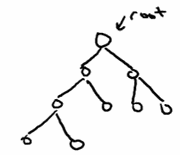
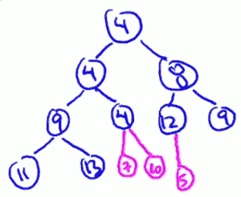
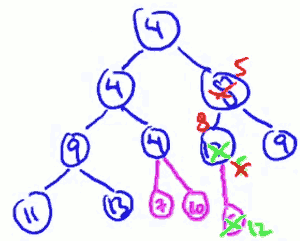
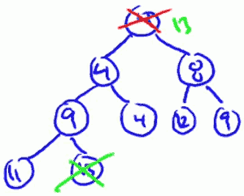
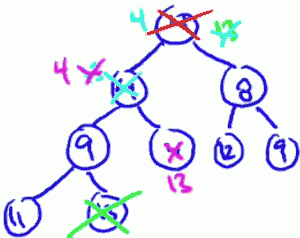

...menustart

 - [Heap](#556e9a86db9c921373c6b5097817214a)
     - [Operations and Applications](#6a80cb76a26187df87a7b43a12c0e0f3)
         - [Supported Operations](#fe48233bd336fbef597492f11f356edd)
         - [Application: Sorting](#08cd128c9ca3be690cc6651adce74187)
         - [Application: Event Manager](#d47eaadb4edbed6e7e32232a56fe6ab7)
         - [Application: Median Maintenence](#a3edde8e4fb37f8fffb3bb1638ed8c2f)
         - [Application: Speeding Up Dijkstra](#274729aa40769d044d57c22c1dc27210)
     - [Implementation Details](#c2b2b81b0d6751c1aa98cc1822ba50b1)
         - [Tree Implementation](#07a0bc991ad48c42bffcdc727ac7e1f7)
         - [Array Implementation](#0b3df9e7addfc4dc5f269bcec5350c1c)
         - [Insert and Bubble-Up](#3c7c6efe37b146b0fe72114e7b76b3d3)
             - [Implementation of Insert (given key K)](#fb9b85ad5e4b637de2cc3f9c843ecbc0)
                 - [step1: stick K at end of last level](#5a038405dd485cc75328e937e1a0e04e)
                 - [step2: Bubble-Up K until heap property is restored (eg. key of K's parent is <= k ).](#f6012bfc00a02971d91e1f780fefeca1)
         - [Extract-Min and Bubble-Donw](#5c6ff897d82e15d93c5b33b4fef2c66b)
             - [Implementation of Extract-Min](#773e70dc32cc881e63bf17c3cd0c7e78)
                 - [step1: Delete root](#41df81a127489688d43f7fafb1dce56d)
                 - [step2: move last leaf to be new root](#e1e112957103fc145d1136e58c9e68c8)
                 - [step3: Bubble-Down until heap property has be restored](#6ecc659c1121beb421ef62658552858f)

...menuend


<h2 id="556e9a86db9c921373c6b5097817214a"></h2>


# Heap

<h2 id="6a80cb76a26187df87a7b43a12c0e0f3"></h2>


## Operations and Applications

<h2 id="fe48233bd336fbef597492f11f356edd"></h2>


### Supported Operations

 - Tthe no.1 thing you should remember about a given data structure is what operations it supports
 -  and what is the running time you can expect from those operations. 

Basically , a heap supports 2 operations

 1. Insertion : add a new object to a heap
 2. Extra min : remove an object that has the minimum key value in heap
    - you also can extract the maximum key use "max heap" ; or you can just negate the sign of all of the key values before you insert them , and then extract min will actually be the max key value. But the best methods to support both case is to use another data structure, probably a binary search tree.

The running time of both heap operation are O(logn) , n = number of objects in heap.

Additional Operations:

 - Heapify ( n batched inserts in O(n) time)
    - heapify is to initialize a heap in linear time.  If you have N things, obviously you can invoke insert once per each object in O(nlogn) time. But heapify can do it in linear time. 
 - Delete any object ( O(logn) time )


<h2 id="08cd128c9ca3be690cc6651adce74187"></h2>


### Application: Sorting

 - So the most common reason to use a heap is you notice that your programm is doing repeated minimum computations. 
 - Especially via exhaustive search.
    - example for sort use heap: HeapSort , O(nlogn)

<h2 id="d47eaadb4edbed6e7e32232a56fe6ab7"></h2>


### Application: Event Manager

 - also called **priority queue** (see python `heapq`)
 - Extract min => yields the next scheduled event.

<h2 id="a3edde8e4fb37f8fffb3bb1638ed8c2f"></h2>


### Application: Median Maintenence

The way this is gonna work is that you and I gonna play a little game. So on my side , what I'm going to do is I'm going to pass you index cards, on a time,  where there's a number written on each index card. Your responsibility is to tell me at each time step the median of the number that I've passed you so far. So, after I've given you the 1st 11 numbers you should tell me as quickly as possible the sixth smallest number , after I've given 13 numbers you should tell me the 7th smallest number , and so on.

 - **I give you**: a sequeue x₁,x₂,...,xn of numbers 1 by 1
 - **You tell me**: at each step i , the median of {x₁,x₂,...,xn }
 - **Constraint**: use O(logi) time at
 - **Tips**: use 2 heap. H low supposed to extract max, H high supposed to extract min, and the key idea is to maintain the invariant that the smallest half of the numbers that you've seen so far are all in the low heap, biggest half are all in the high heap.


<h2 id="274729aa40769d044d57c22c1dc27210"></h2>


### Application: Speeding Up Dijkstra


---

<h2 id="c2b2b81b0d6751c1aa98cc1822ba50b1"></h2>


## Implementation Details

2 views of heap:

 - a tree
 - a array

<h2 id="07a0bc991ad48c42bffcdc727ac7e1f7"></h2>


### Tree Implementation

 - **Conceptually**: rooted, binary , as complete as possible
    - if it is not a completed tree, push the extra node as far to the left as possible.
    - 

- **Heap property**: 
    - every node X , the key of the object stored in X , should be no more than the keys of X's children
    - key[ X ] <= all keys of X's children
    - keys could be arranged differently and it would still be a heap.
    - The important thing is that, in any heap, the root has to have a minimum value key.
    - 

<h2 id="0b3df9e7addfc4dc5f269bcec5350c1c"></h2>


### Array Implementation

array implementation for the right side heap in above picture:

i | 1 | 2 | 3 | 4 | 5 | 6 | 7
--- | --- | --- | --- | --- | --- | --- | --- 
key | 4 | 4 | 8 | 6 | 4 | 12 | 9

The information of parent relationship is not stored in array directly:

```
parent(i) = floor(i/2)
child of i : 2i, 2i+1
```

<h2 id="3c7c6efe37b146b0fe72114e7b76b3d3"></h2>


### Insert and Bubble-Up

remember heaps are always suppose be perfectly balanced binary trees. 

平衡二叉树： 左右两颗子树的高度差不超过1，同时左右子树本身也是平衡二叉树。

So if we wanna maintain the property that this tree is perfectly balanced  is pretty only one place we can try to put the new key K and that's as the next leaf. That's is it's going to be the new righ most leaf on the bottom level.  Or in terms of the array implementation we just stick it in the first non empty slot int the array And if we keep track of the array size we're getting constant time of course know where to put the new key.


<h2 id="fb9b85ad5e4b637de2cc3f9c843ecbc0"></h2>


#### Implementation of Insert (given key K)

<h2 id="5a038405dd485cc75328e937e1a0e04e"></h2>


##### step1: stick K at end of last level



如图，当往heap上添加 7,10的时候, 我们要做的就是往最后一层上一次添加node, 并不会破坏heap's property， 但是当继续添加 5 的时候，问题出现了，key property is not satisfied. In particular, it's violated at the node 12, the key of child is less than its own key. 

Is there some way we can restore the heap property ?  A natural idea is just to swap the positions of 5 and 12 , now instead it's the 8 that has a problem.  Alright so now we just do it again. We swap the positions of 5 and 8, and now we see we've restored the order.  The only place where there could possibly be a violation of the heap property is at the root. and fortunately its new child has key 5, which is bigger than it.

So in general , as you push up this 5 up the tree, there's only going to be one possible edge that could be out of order and ths's between where the five currently resides and whatever its parent is.
        
<h2 id="f6012bfc00a02971d91e1f780fefeca1"></h2>


##### step2: Bubble-Up K until heap property is restored (eg. key of K's parent is <= k ).



Runtime: O(logn)

<h2 id="5c6ff897d82e15d93c5b33b4fef2c66b"></h2>


### Extract-Min and Bubble-Donw

It pretty much have to wipe out the root. Remember the minimum is guaranteed to be at the root. 

<h2 id="773e70dc32cc881e63bf17c3cd0c7e78"></h2>


#### Implementation of Extract-Min

<h2 id="41df81a127489688d43f7fafb1dce56d"></h2>


##### step1: Delete root

Well, there's pretty much only one node that could fill the hole without causing other problems with the tree structure. And that is the **very last node**. So the rightmost leaf at buttom level , one that simple fix is to swap that up and have that take the place of the original root. So in this case ,the 13 is going to get a massive promotion and get teleported all the way to be the new root of this tree. 

<h2 id="e1e112957103fc145d1136e58c9e68c8"></h2>


##### step2: move last leaf to be new root



We now again have a , as perfectly balanced as possible binary tree , but of course now we've totally screwed up the heap property. 

Now when you're trying to push notes down to the rightful position in the tree, there is 2 different swaps you could do, 1 for the left child, 1 for the right child.  看我这个例子，如果 交换13 和8, 那么新的 root 8 又会和 left child 4 发生冲突， 我们有制造了一个新的问题。That's a bad idea.  So we should take the smaller of the 2 children and swap the 13 with that.
    
 

<h2 id="6ecc659c1121beb421ef62658552858f"></h2>


##### step3: Bubble-Down until heap property has be restored

RunningTime: O(logn)


