...menustart

 - [Algorithm On Graphs](#311ad33f7584ac17012490ce8852f7e8)
 - [Week1 Exploring Undirected Graphs](#edbf6a2cb4c2f45a6c6f05f7981ececd)
     - [Graph Basics](#887b235eb2dfc010821effbf5b9689f7)
         - [Representing Graphs](#030495a245248ce0deed9c13f9576cd0)
     - [Exploring Undirected Graphs](#fa4ec304233cb938cae388a53fe8dc4e)
         - [Exploring Graphs](#6d620d4a966ddb637a736ea4670b6782)
             - [Explore](#1819001b72329e2ef5799fe504238035)
             - [DFS](#c1bb62b63c65be3760b715faad0bdf8d)
         - [Connectivity](#9bd9d0ebc081bd74f5bef4e136bb1aed)
             - [Connected Components](#8a4d6dec35ad6f01d54531c509cf7d37)
         - [Previsit and Postvisit Orderings](#cb7d104acd7ef78260476fb96e632beb)
             - [Previsit and Postvisit Functions](#c190b4dd3a865a419b7d42ecdded4b14)
             - [Clock](#98a892aea3359481ae30e7b66c44d7a8)
 - [Week2 Directed Graphs](#2b39565942c0c8f530d738cf53da9df6)
     - [Directed Graphs](#2b12ab1371d8f9b1ce9580a395b2e9b2)
         - [Directed Acyclic Graphs](#7a53b8f5717213d05b5a349b30218b27)
             - [Directed DFS](#82842893b1046ac7ea43887a7d4c6c97)
             - [Cycles](#d3240659659cbfa93d781d1510717a66)
             - [DAGs](#1f979bae5ccfb6a193fde8d275355540)
         - [Topological Sort](#3f9c4755d1b2c530f17ce3f80a0fb896)
             - [Finding Sink](#2f1d4122555c30fa41c0390bd028ef60)
             - [TopologicalSort Algorithm](#7325cfd5224854fdee2a8cd7f046a1f6)
         - [Strongly Connected Components](#670190ac033bf942d8013492dc8f8b0f)
             - [Metagraph](#cd4755489eca8e682b00937d8e695b98)
         - [Computing Strongly Connected Components](#b3a7569c9a7d363bd55ee91cf45641f9)
             - [Sink Components](#80d29df79dc221a3cd1b8e554a6a3828)
             - [Finding Sink Components](#57c30fe3a2297ed1dfa107e753e2752e)
                 - [Reverse Graph Components](#509d136ac9a437456bbe67dd6b003890)
             - [Algorithm](#4afa80e77a07f7488ce4d1bdd8c4977a)
 - [Week3 Shortest Path](#ebf4c5795e7e039832b0c383127c1af7)
     - [Breadth-First Search](#ae5c4b868b5b24149decba70c74165c2)
     - [Using BFS to find shortest path](#3beb167902a9a7e0fb85607fb6ae23cf)
     - [Constructing shortest-path tree](#b677abc0402df239cc73865a664d147a)
 - [Week4 Weighted Edge Graph](#f48846cfd1c263bd3b157547c127e20d)
     - [Dijkstra's Algorithm](#f5465cb36bdbaa6b373c184f42e56778)
     - [Currency Exchange](#003f976d33ac8c24e95d86528dd29140)
         - [Currency Exchange](#003f976d33ac8c24e95d86528dd29140)
             - [Reduction to shortest paths](#2aebb509894a3435926b0358757ced2b)
             - [Reduction](#9e834f13e35e4edf64863ab414a6217a)
             - [Where Dijkstra's algorithm goes wrong ?](#4da7ea452fdcf0be458d18f360167fa8)
             - [Negative weight cycles](#f976d1a3a77908d613907e00e02f40fd)
         - [Bellman-Ford Algorithm](#9297e36e7774bdfc6df3122a1161af31)
             - [Running Time](#60743dca1167fe1657b6ced5259479a0)
 - [Week 5: Minimum Spanning Tree (MST)](#efaca9e70dbf43ff2e6721b566e8c08b)
     - [Building a Network](#16c7498bf7b447bf072bee49903d8987)
         - [Properties of Trees](#4337affdb3b134ce849d1cc6650670a6)
         - [Greedy Algorithms](#b85c9288c07b7e4e4b4e27ab9591a53e)
         - [Cut Property](#e53faf4bce755256bb1dbe463ea9e25c)
         - [Kruskal's Algorithm](#deffa39808ce0c46dbed0dcdf62d8043)
             - [Implementation Details](#c2b2b81b0d6751c1aa98cc1822ba50b1)
             - [Running Time](#60743dca1167fe1657b6ced5259479a0)
         - [Prim's Algorithm](#8851972d9d159c78edf10480a6211300)
 - [Week6 Advanced Shortest Path](#1c151f86eba1a21ae18d729675bae1a3)
     - [Advanced Shortest Paths : Bidirectional Dijkstra](#8d1e9e528ac79f740265585f372cea34)
         - [Idea: Bidirectional Search](#f4cd5a835ef4f3349f9721e05565ca1a)
         - [Six Handshakes](#73bf6b749aa20e59d85d7be50e9d7319)
         - [Bidirectional Dijkstra](#e764537919e46614077b78e9e0191de1)
         - [Finding Shortest Path after Meeting in the Middle](#434270d395ff546c2f75b9a2a0b54c34)
         - [Computing Distance](#95f4770065ff47d2c8645f7997e78839)
         - [Conclusion](#6f8b794f3246b0c1e1780bb4d4d5dc53)
     - [Contraction Hierarchies](#d33433d24d9ffb9608d3e6411ec9fa2b)
         - [Highway Hierarchies and Node Importance](#233f77692f07da82132a3ae75d33127e)
             - [Highway Hierarchies](#0012bd109b088ff2cc888af51d74134f)
             - [Node Ordering](#f361803b56eb81eaabddadd949ab3ece)
             - [Shortest Paths with Preprocessing](#4520bd6310cb62fcdd381db986302036)
         - [Preprocessing](#d397d6750cedf9d79f3600af61a1641e)
             - [How Node Contraction Work ?](#867892c0bfaddd887d95f2efd5b7482a)
             - [Witness Paths](#6341d14a4b0f707c95f30884ce778d9c)

...menuend


<h2 id="311ad33f7584ac17012490ce8852f7e8"></h2>


# Algorithm On Graphs


<h2 id="edbf6a2cb4c2f45a6c6f05f7981ececd"></h2>


# Week1 Exploring Undirected Graphs

<h2 id="887b235eb2dfc010821effbf5b9689f7"></h2>


## Graph Basics 

<h2 id="030495a245248ce0deed9c13f9576cd0"></h2>


### Representing Graphs

1. Edge List
    - egdes: (A, B), (A, C), (A,D), (C,D) 
    - A,B,C,D are vertices
2. Adjacency Matrix
    - Entries 1 if there is an edge, 0 if there is not.
3. Adjacency List
    - For each vertex, a list of adjacent vertices.
    - A adjacent to B, C,D
    - B adjacent to A
    - C adjacent to A,D
    - D adjacent to A, C
    - can be implemented by a dictionary 
 
- Different operations are faster in different representations
- for many problems , we want adjacency list because a lot of operations really want to be able to find neighbors.

Op | Is Edge? | List Edge | List Nbrs 
--- | --- | --- | ---
Adj. Matrix | Θ(1) |  Θ( &#124;V&#124;²) |  Θ(&#124;V&#124;)
Edge List | Θ(&#124;E&#124;) | Θ(&#124;E&#124;) |  Θ(&#124;E&#124;)
Adj. List | Θ(deg) | Θ(&#124;E&#124;) | Θ(deg)


- Graph algorithm runtimes depend on |V| and |E|.
    - i.e. `O(|V|+|E|)`


<h2 id="fa4ec304233cb938cae388a53fe8dc4e"></h2>


## Exploring Undirected Graphs

<h2 id="6d620d4a966ddb637a736ea4670b6782"></h2>


### Exploring Graphs


- Visit Markers
    - To keep track of vertices found: Give each vertex boolean visited(v).
- Unprocessed Vertices
    - Keep a list of vertices with edges left to check.
    - This will end up getting hidden in the program stack
- Depth First Ordering
    - We will *explore new edges* in Depth First order. 


<h2 id="1819001b72329e2ef5799fe504238035"></h2>


#### Explore

- Explore(v) marks as visited exactly the vertices **reachable** from v.
- Good for adjacency list representation!

```python
def Explore(v):
    visited(v) ← true
    for w in neighbors(v):
        if not visited(w):
            Explore(w)
```

- Normaly, we are used to save parent node for each vertex, so that we can easily reconstruct the path.

```python
def Explore(v):
    visited(v) ← true
    for w in neighbors(v):
        if not visited(w):
            Explore(w)
            edgeTo[w] = v
```


<h2 id="c1bb62b63c65be3760b715faad0bdf8d"></h2>


#### DFS

- DFS to find all vertices of G, not just those reachable from v.

```python
def DFS(G):
    for all v in V : 
        mark v unvisited
    for v in V :
        if not visited(v):
            Explore(v)
```

---

<h2 id="9bd9d0ebc081bd74f5bef4e136bb1aed"></h2>


### Connectivity

<h2 id="8a4d6dec35ad6f01d54531c509cf7d37"></h2>


#### Connected Components

- Explore(v) finds the connected component of v
- Just need to repeat to find other components.
- Modify DFS to do this.
- Modify goal to **label** connected components

---- 

- Solution: We also assign the vertices a number corresponding to the connected components
- Runtime: still O(|V|+|E|)

```python
def Explore(v):
    visited(v) ← true
    # changes: cc is passed in outside
    CCnum(v) ← cc
    for w in neighbors(v):
        if not visited(w):
            Explore(w)

def DFS(G):
    for all v in V : 
        mark v unvisited
    # changes: generating connected components number
    cc ← 1
    for v in V :
        if not visited(v):
            Explore(v)
            # changes: increment cc
            cc ← cc + 1
```

---

<h2 id="cb7d104acd7ef78260476fb96e632beb"></h2>


### Previsit and Postvisit Orderings

- Need to Record Data
    - Plain DFS just marks all vertices as visited.
    - In general if we want ot make DFS useful, we need to keep track of other data to be useful,  just like how we find the connected components.
    - Adding functions to store additional information, for example, let's look at the `Explore(v)`

<h2 id="c190b4dd3a865a419b7d42ecdded4b14"></h2>


#### Previsit and Postvisit Functions


```python
def Explore(v):
    visited(v) ← true
    # changes
    previsit(v)
    for w in neighbors(v):
        if not visited(w):
            Explore(w)
    # changes
    postvisit(v)
```

So , what are those funcitons , previsit/postvisit going to be ? They could be many kind of things. 


<h2 id="98a892aea3359481ae30e7b66c44d7a8"></h2>


####  Clock

One that we might want to do is to keep track of what order are we visit vertices in.  And so one way to do this is we have a clock.

- This clock keep track of order of visits.
- Clock ticks forward once it hit a pre-/post- visit.
- Records previsit and postvisit times for each v.


- Computing Pre- and Post- Numbers
- Initialize clock to 1.

```python
def previsit(v):
    pre(v) ← clock
    clock ← clock + 1
def postvisit(v):
    post(v) ← clock
    clock ← clock + 1
```

- Previsit and Postvisit numbers tell us about the execution of DFS.
- Lemma
    - For any vertices u, v the intervals pre(u), post(u)] and [pre(v), post(v)] are either **nested** or **disjoint**.
        - nested: eg.  (1,8) , (2,5)
        - disjoint: eg.  (1,8) , (9,12)
    - that is , Interleaved is not possible
        - eg. ( 1, 8 ) , ( 5, 9  )

---

<h2 id="2b39565942c0c8f530d738cf53da9df6"></h2>


# Week2 Directed Graphs

<h2 id="2b12ab1371d8f9b1ce9580a395b2e9b2"></h2>


## Directed Graphs


<h2 id="7a53b8f5717213d05b5a349b30218b27"></h2>


### Directed Acyclic Graphs

- Directed graphs might be used to represent:
    - Streets with one-way roads.
    - Links between webpages.
    - Followers on social network.
    - **Dependencies** between tasks.


<h2 id="82842893b1046ac7ea43887a7d4c6c97"></h2>


#### Directed DFS

- Can still run DFS in directed graphs.
    - Only follow **directed** edges
    - explore(v) finds all vertices **reachable** from v.
    - Can still compute pre- and post- orderings.

<h2 id="d3240659659cbfa93d781d1510717a66"></h2>


#### Cycles

- A **cycle** in a graph G is a sequence of vertices v1, v2, . . . , vn so that
- (v1, v2),(v2, v3), . . . ,(vn−1, vn),(vn, v1) are all edges.
- 
- Theorem
    - If G contains a cycle, it cannot be linearly ordered.
- linearly ordered
    - Redraw DAG so all edges sit in a line, and all point upwards.
    -  

<h2 id="1f979bae5ccfb6a193fde8d275355540"></h2>


#### DAGs

- A directed graph G is a **Directed Acyclic Graph** (or DAG) if it has no cycles.
- Theorem
    - Any DAG can be linearly ordered
- Beiing a DAG is necessary to linearly order.
    - Is it sufficient ? 


<h2 id="3f9c4755d1b2c530f17ce3f80a0fb896"></h2>


### Topological Sort

Goal. Given a set of tasks to be completed with precedence constraints, in which order should we schedule the tasks?
 
- Learning Objectives
    1. Implement the topological sort algorithm
    2. Prove that a DAG can be linearly ordered


- Last Vertex
    - Consider the last vertex in the ordering. It cannot have any edges pointing out of it
    - 
- Sources and Sinks
    - A **source** is a vertex with no incoming edges.
    - A **sink** is a vertex with no outgoing edges
        - 


- Idea
    1. Find sink
    2. Put at end of order
    3. Remove from graph
    4. Repeat

This is all well and good, but it depends on us being able to find a sink.

<h2 id="2f1d4122555c30fa41c0390bd028ef60"></h2>


#### Finding Sink

- Question: How do we know that there is a sink?
- Follow path as far as possible v1 → v2 → . . . → vn. Eventually either:
    - Cannot extend (found sink).
    - Repeat a vertex (have a cycle).

<h2 id="7325cfd5224854fdee2a8cd7f046a1f6"></h2>


#### TopologicalSort Algorithm

- First Try
    - 
    ```
    # LinearOrder(G )
    while G non-empty:
        Follow a path until cannot extend 
        Find sink v
        Put v at end of order
        Remove v from G
    ```
- Runtime
    - O(|V|) paths
    - Each takes O(|V|) time
    - Runtime O(|V|²)
- Speed Up
    - `LinearOrder` retrace same path every time 
    - Instead only back up as far as necessary
        - This is just DFS !
        - And in particular whenever we finish the post visit block at a vertex, 
    - 
    ```python
    TopologicalSort(G)
        DFS(G)
        sort vertices by reverse post-order
    ```


<h2 id="670190ac033bf942d8013492dc8f8b0f"></h2>


### Strongly Connected Components

- Connectivity is complex in directed graph.
- Two vertices v, w in a directed graph are **connected** if you can reach v from w **AND** can reach w from v.
- Theorem
    - A directed graph can be partitioned into **strongly connected components** where two vertices are connected if and only if they are in the same component.
    - 

<h2 id="cd4755489eca8e682b00937d8e695b98"></h2>


#### Metagraph

- Once we've split our graph into connected components, they still have edges connecting these components to each other
- So one useful thing to do is to draw what's known as **metagraph**, which sort of telles us how these strongly connected components connect to one another 
    -  ,    
- Theorem
    - The metagraph of a (directed) graph G is always a DAG.
 
How to compute the strongly connected components of a graph. ?


<h2 id="b3a7569c9a7d363bd55ee91cf45641f9"></h2>


### Computing Strongly Connected Components

- Problem
    - Input: A directed graph G
    - Output: The strongly connected components of G. 

<h2 id="80d29df79dc221a3cd1b8e554a6a3828"></h2>


#### Sink Components

- Idea: 
    - If v is in a sink SCC, explore(v) finds vertices reachable from v. This is exactly the SCC **of v**.
        - 因为SCC的性质，无论你从SCC中的任何一个点node开始，你都是 explore 整个SCC
    - that also means, you will get different SCC, if you start from different node.
- Need a way to find a sink SCC.
    - why ? 
    - if you start from a source SCC, you many visit the whole graph, it won't help you.


<h2 id="57c30fe3a2297ed1dfa107e753e2752e"></h2>


#### Finding Sink Components

- Theorem
    - If C and C' are two strongly connected components with an edge from some vertex of C to some vertex of C' , 
    - then **largest** postorder in C bigger than **largest** postorder in C'  no matter you visit vertex first in C or C'.
    - 但是，最小的 postorder 不一定在 C'里
- Conclusion
    - The vertex with the largest postorder number is in a source component!
    - Problem: We wanted a sink component

<h2 id="509d136ac9a437456bbe67dd6b003890"></h2>


##### Reverse Graph Components

- Let Gᴿ be the graph obtained from G by reversing all of the edges.  
    - 
- Gᴿ and G have same SCCs.
- Source components of Gᴿ are sink components of G.  
- Find sink components of G by running DFS on Gᴿ .
    - The vertex with largest postorder in Gᴿ is in a sink SCC of G.

<h2 id="4afa80e77a07f7488ce4d1bdd8c4977a"></h2>


#### Algorithm

- Naive Implementation
    - 
    ```python
    def SCCs(G ):
        repeate:
            run DFS(Gᴿ)
            let v have largest post number 
            run Explore(v) on G
            vertices found are first SCC , Remove from G 
    ```
- Improvement
    - Don't need to rerun DFS on Gᴿ
    - Largest remaining post number comes from sink component
        - The point is, after you remove this sink component, and if you just then look for the vertex with the single largest remaining postorder, that's going to be sink component of the new graph.
- New Algorithm
    - 
    ```python
    def SCCs(G):
        run DFS(Gᴿ)
        for v ∈ V in reverse postorder:
            if not visited(v):
                Explore(v)
                mark visited vertices as new SCC
    ```

- Runtime
    - Essentially DFS on Gᴿ and then on G.  
    - Runtime O(|V| + |E|).

---


<h2 id="ebf4c5795e7e039832b0c383127c1af7"></h2>


# Week3 Shortest Path

<h2 id="ae5c4b868b5b24149decba70c74165c2"></h2>


## Breadth-First Search

[BFS algorithm](https://github.com/mebusy/notes/blob/master/dev_notes/AlgorithmII_Graph.md#9f5783932f655ffe3908ff7d3410497e)

<h2 id="3beb167902a9a7e0fb85607fb6ae23cf"></h2>


## Using BFS to find shortest path 


```python
def BFS(G,S):
    for all u∈V:
        dist[u] ← ∞, prev[u] ← nil
    dist[S] ← 0
    Q ← {S} {queue containing just S} 
    while Q is not empty:
        u ← Dequeue(Q) 
        for all (u,v)∈E:
            if dist[v] = ∞:
                Enqueue(Q , v )
                dist[v] ← dist[u] + 1
                prev[v] ← u
```

Here, we use `dist[]` to save the accumulative distance, it also servers as `visited`.

Normally the application of DFS, BFS visits each node only once.


<h2 id="b677abc0402df239cc73865a664d147a"></h2>


## Constructing shortest-path tree

By BFS, you have found the shortest path , but how you reconstuct the shortest path ? 

```python
def ReconstructPath(S, u, prev):
    result ← empty 
    while u ≠ S:
        result.append(u)
        u ← prev[u]
    return Reverse(result)
```


<h2 id="f48846cfd1c263bd3b157547c127e20d"></h2>


# Week4 Weighted Edge Graph

How to compute shortest path of a weighted edges graph ?

<h2 id="f5465cb36bdbaa6b373c184f42e56778"></h2>


## Dijkstra's Algorithm

[Java Implementation](https://github.com/mebusy/notes/blob/master/dev_notes/AlgorithmII_MST.md#f1d4978722895ce40af6d3ebe0c8c6c0)

Note: normally there are 2 versions of Dijkstra. The key difference is whether a vertex is allowed be enqueued more than once.  If re-enqueued is allowed, that version algorithm can work with negative weight.


<h2 id="003f976d33ac8c24e95d86528dd29140"></h2>


## Currency Exchange

- We've know how to find shortest path in the graph with non-negative edge weight. 
- Now we will learn to find shortest path even in the graphs where some of the edge weigths can be negative.


<h2 id="003f976d33ac8c24e95d86528dd29140"></h2>


### Currency Exchange

We will explore that using a problem about currency exchange, which doesn't seem to have anything to do with shortest paths. 

But we will soon find out it does.

- initial: $1000 
- convert it into Russian Rubles. 
- Potentially doing many conversions on the way, such that you get as many Russian rubles as you can in the end. 

- 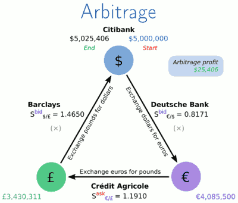
    - These triangular arbitrages exist very rarely and only due to some market inefficients.
    - But in theory, this is possible. 
- The graph edge is *conversion rate*.

<h2 id="2aebb509894a3435926b0358757ced2b"></h2>


#### Reduction to shortest paths 

- use 2 standard approaches 
    1. Replace product with sum by taking log() of weights
    2. Negate weights to solve minimization instead maximization
- Taking the logarithm
- xy = 2<sup>log₂(x)</sup> 2<sup>log₂(y)</sup> = 2<sup>log₂(x)+log₂(y)</sup>
- xy → max ⇔ log₂(x)+log₂(y) → max
- So, if all weights are positive , then we reduce our problem of maximizing product of some numbers to maximizing sum of some numbers. 
    - because we can not take log() of negative values, and we also can not take log() of 0. ( value of exponential function is positive )
- But we actually want minimization ... That is easy
    - is is the same as minimize the sum of *-value* 


<h2 id="9e834f13e35e4edf64863ab414a6217a"></h2>


#### Reduction 

- Finally: replace edge weights *r<sub>eᵢ</sub>* by *-log( r<sub>eᵢ</sub> )* , and find the shortest path between USD and RUR in the graph.
- Solved ?  Can we now apply Dijkstra algorithm to find the solution ?
    - NOT exactly work. 

<h2 id="4da7ea452fdcf0be458d18f360167fa8"></h2>


#### Where Dijkstra's algorithm goes wrong ?

- Dijkstra's algorithm rely on the fact that a shortest path from s to t goes only through vertices that are close to s. 
    - And this is rely on the fact that edge weights are positive
- This is no longer the case for graphs with negative edges 
    - 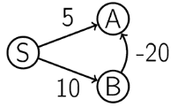
    - 注: 有两个版本的 Dijkstra, 其中 定点可以重入的版本是可以处理 negative edge的，但这样就无法保证 Dijkstra 的时间复杂度.


<h2 id="f976d1a3a77908d613907e00e02f40fd"></h2>


#### Negative weight cycles

- Worst problems in graphs with negative weights come from negative weight cycles. 
- 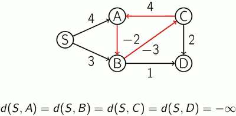


<h2 id="9297e36e7774bdfc6df3122a1161af31"></h2>


### Bellman-Ford Algorithm

- Bellman-Ford Algorithm works even for negative edges weights.
- This algorithm assumes that there are no negative weight cycles in G.
    - Otherwise it works still, but it won't return correct distances for some of the nodes. 

```python
def BellmanFord(G , S ):
    {no negative weight cycles in G} 
    for all u∈V:
        dist[u] ← ∞
        prev[u] ← nil 
    dist[S] ← 0
    repeat |V|−1 times:
        for all (u,v)∈E: 
            Relax(u, v )
```

<h2 id="60743dca1167fe1657b6ced5259479a0"></h2>


#### Running Time

- The running time of Bellman–Ford algorithm is O(|V||E|).
- During the iterations, if no edge was actually relaxed , we can just stop there and the distance will already be correct.

----

<h2 id="efaca9e70dbf43ff2e6721b566e8c08b"></h2>


# Week 5: Minimum Spanning Tree (MST)


<h2 id="16c7498bf7b447bf072bee49903d8987"></h2>


## Building a Network

- Input: A connected, **undirected** graph G = (V,E) with **positive** edge weights.
- Output: A subset of edges E′ ⊆ E of **minimum** total weight such that the graph (V , E′) is connected.

<h2 id="4337affdb3b134ce849d1cc6650670a6"></h2>


### Properties of Trees 

- A **tree** is an undirected graph that is connected and acyclic
- A tree on *n* vertices has *n*-1 edges
- Any **connected** undirected graph G(V,E)  with |E| = |V|-1 is a tree
- An undirected graph is a tree iff there is a unique path between any pair of its vertices.


<h2 id="b85c9288c07b7e4e4b4e27ab9591a53e"></h2>


### Greedy Algorithms 

Algorithm | description
--- | --- 
Kruskal  |  repeatedly add the next lightest edge if this doesn't produce a cycle 
Prim | repeatedly attach a new vertex to the current tree by a lightest edge 


- Example 
    - 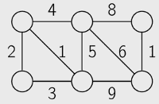
    - Kruskal's algorithm 
        1. Initially, our soulution is empty, so we just add the first lightest edge ( with weight 1)
        2. And there is also another edge with has weight 1,  so we also add it to our solution. 
        3. The next 1 is weight 2, we add it. 
        4. The next lightest available edge has weight 3, 
            - 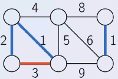
            - However, if we added it to our current solution, this would produce a cycle. So we skip this edge.
        5. The next lightest available edge has weight 4. Wee add it. 
            - 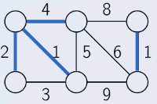
        6. Then, again, we try to add the edge with weight 5, however it produces a cycle, so we skip this edge, and instead we add the edge of weight 6.
        - This gives us a solution. 
    - Prim's algorithm 
        - It works in a different way, it repeatedly grows just 1 tree. It will select a root for this tree. At each iteration we are going to attach a new node to this tree. 
        1. 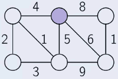
        2. 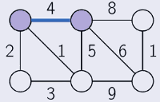
        3. 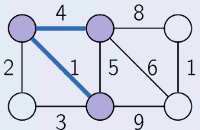
        4. 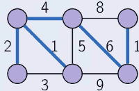


- They start with an empty solution , with an empty set of edges.  And at each iteration they expand the current set of edges by one edge. 
    - But they use different stratedies for selecting the next edge.
    - The Kruskal's Algorithm selects the next lighted edge that **doesn't produce a cycle**.
    - While the Prim's Algorithm selects the next lightest edge that attaches a **new vertex to the current tree**.


<h2 id="e53faf4bce755256bb1dbe463ea9e25c"></h2>


### Cut Property

- Let X ⊆ E be a part of a MST of G(V,E), S ⊆ V be such that no edge of X crosses between S and V − S, and e ∈ E be a lightest edge across this partition. Then X + {e} is a part of some MST.
    1. X is edges part of MST
    2. we partition all vertices into  2 parts -- S , and V-S
    3. this partition is required to satisfies the following property: 
        - no edge from X joins 2 vertices from different parts (one in S, the other one in V-S). 
        - 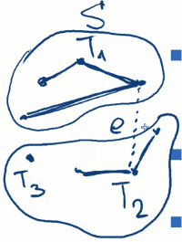
    4. *e* is the lightest edge connect the verticese across S and V-S
    5. Then if we add the edge *e* to our current X , then what we get will also be a subset of some minimum spanning tree.
        - In other words, adding *e* to X in this case is a safe move.

- Example 
    - 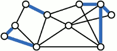
    - We are given some subset of edges of a MST, shown here in blue. It is the set X. 
        - So X is a subset of some MST.
    - Then consider some partition vertices into 2 parts 
        - no edge from X, on our picture no blue edge , joins 2 vertices from different parts. 
        - 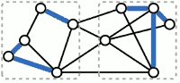
    - Next we consider the lightest edge that joins 2 vertices from different parts, assume that this edge is *e*, shown here in red 
        - 
    - Then what lemma states is that if we add this edge to our set X, then the resulting set of edges will also be a part of some MST.


<h2 id="deffa39808ce0c46dbed0dcdf62d8043"></h2>


### Kruskal's Algorithm

1. repeatedly add to X the next lightest edge *e* that doesn’t produce a cycle
2. At any point of time, the set X is a forest, that is, a collection of trees
    - a single isolated vertex is also a tree 
3. The next edge *e* connects two different trees , say, T₁ and T₂
    - if not , it produe a cycle
4. The edge *e* is the lightest between T₁ and V − T₁, hence adding *e* is safe
    - the cut property


<h2 id="c2b2b81b0d6751c1aa98cc1822ba50b1"></h2>


#### Implementation Details 

1. use **disjoint** sets data structure
2. initially, each vertex lies in a separate set
3. each set is the set of vertices of a connected component
    - that is, initially, each vertex forms a separate connected component
4. to check whether the current edge {u,v} produces a cycle, we check whether u and v belong to the same set -- in the same connected component
    - and also, if they are lie in different connected components, we need to merge the corresponding 2 trees, *union* 2 sets


```python
def Kruskal(G ):
    for all u∈V: 
        MakeSet(v )
    X ← empty set
    sort the edges E by weight
    for all {u,v}∈E in non-decreasing weight order:
        if Find(u) ≠  Find(v):
            add {u,v} to X
            Union(u, v ) 
    return X
```

<h2 id="60743dca1167fe1657b6ced5259479a0"></h2>


#### Running Time 

O(|E|·log|V|)


---

<h2 id="8851972d9d159c78edf10480a6211300"></h2>


### Prim's Algorithm 

1. X is always a subtree, grows by one edge at each iteration
2. we add a lightest edge between a vertex of the tree and a vertex not in the tree
3. very similar to Dijkstra’s algorithm
    - Prim is greedy, it does not care about the accumulative cost, it just use the edge weight for priority 


```python
def Prim(G ):
    for all u∈V:
        cost[u] ← ∞, parent[u] ← nil
    pick any initial vertex u0
    cost[u0] ← 0
    PrioQ ← MakeQueue(V ) {priority is cost} 

    while PrioQ is not empty:
        v ← ExtractMin(PrioQ) 
        for all {v,z} ∈ E:
            if z ∈ PrioQ and cost[z] > w(v, z): 
                cost[z] ← w(v, z), parent[z] ← v 
                ChangePriority(PrioQ , z , cost [z ])
```

---

<h2 id="1c151f86eba1a21ae18d729675bae1a3"></h2>


# Week6 Advanced Shortest Path

<h2 id="8d1e9e528ac79f740265585f372cea34"></h2>


## Advanced Shortest Paths : Bidirectional Dijkstra

- What problem is this algorithm solved?
    - The shortest path between source vertex *s* and a target vertex *t*.
    - Yes, we have a goal.
- Why not just Dijkstra ?
    - It is pretty fast, right ?
    - Can we even do better in the worst case ?
    - Yes, Mikkel Thorup came up with an algorithm in 19999 that solves this problem for undirected graphs in linear time. 
        - Such algorithm is still not known for directed graph. But for undirected graphs, we can definitely do better, and for directed graphs, we can do better also.
    - For a graph of USA with 20M vertices and 50M edges it will work for serveral seconds for average.
    - Millions of users of Google Maps want the result in a blink of an eye, all at the same time. 
    - Need something significantly faster

<h2 id="f4cd5a835ef4f3349f9721e05565ca1a"></h2>


### Idea: Bidirectional Search 

- Instead of going from S and growing the "search circle" until it touches point, we want to go simultaneously forward from S , and backward from T until we meet. 
- And as soon as we meet, we can find the shortest path between S and T by combining the half of the path S->Mid-point  and Mid-point->T.
- We will alternate the turns of those 2 Dijkstra.
- 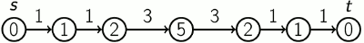
- And now, we can reconstruct the shortest path from S to T, and we can fill in the correct distances from S to all the nodes on that path.
- 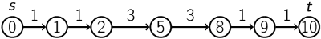

- Roughly 2x speedup
    - Good, but not great

<h2 id="73bf6b749aa20e59d85d7be50e9d7319"></h2>


### Six Handshakes

- Applying the idea of bidirectional search to social network data, we will see that it will work exceptionally well, going up to thousands of times faster. 
- But first , let's learn an interesting fact about our world. 
    - In 1929, Hungarian mathematician Frigyes Karinthy made a "Small world" conjecture :
    - Can pass a message from any person to any person in at most 6 handshakes.
    - This is close to truth according to experiments and it called a "six handshakes" or "six degrees of separation" idea.
- Meet-in-the-middle
    - More general idea, not just for graphs
    - Instead of searching for all possible objects, search for 1st halves and for 2nd halves separately
    - Then find "compatible" havles
    - √N instead of N

<h2 id="e764537919e46614077b78e9e0191de1"></h2>


### Bidirectional Dijkstra 

1. Build Gᴿ 
2. Start Dijkstra from **s** in G , and from **t** in Gᴿ
3. Alternate between Dijkstra steps in G and in Gᴿ
4. Stop when some vertex **v** is processed both in G and in Gᴿ
    - process means that it is extracted from the PQ 
5. Compute the shortest path between **s** and **t**

<h2 id="434270d395ff546c2f75b9a2a0b54c34"></h2>


### Finding Shortest Path after Meeting in the Middle

- Let *v* be the 1st vertex which is processed both in G and Gᴿ. Can we guarantee then that there exists a shortest path from *s* to *t* that goes through *v*?
- No.
    - 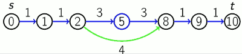
    - The middle vertex will be considered first in both forward Dijkstra and backward Dijkstra.
    - So what exactly then do we need to compute the distance? 


- Lemma
    - Let dist[u] be the distance estimate in the forward Dijkstra from *s* in G 
        - and distᴿ[u] -- the same in the backward Dijkstra from *t* in Gᴿ. 
    - After some node *v* is processed both in G and Gᴿ, 
    - there exists some shortest path from *s* to *t* passes through some node *u* which is **processed either in G, in Gᴿ, or both**, and d(s,t) = dist[u] + distᴿ[u].
    - 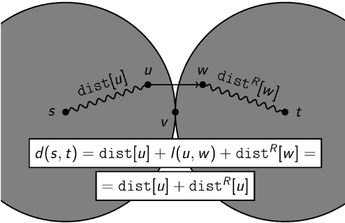

<h2 id="95f4770065ff47d2c8645f7997e78839"></h2>


### Computing Distance

- Implementation
    1. Do alternating turns of forward search and backward search , until we meet at some point *v*
        - and we remember which vertices are processed in forward search and  which are in backward search
    2. Then we take all those vertices which are processed at least in one of them , and for each of those vertices, we minimize the sum of distance estimate of d[u]+dᴿ[u],
        - and for the node for which this sum is minimal , we know that there is a shortest path going through this vertex. 
    3. And then to reconstruct the path itself
        - We can reconstruct the shorteset path from *s* to *u* in forward search, and separately we reconstruct the path from *u* to *t* in backward search.
        - and then just join those 2 parts into a single shortest path from *s* to *t*.

```python
def BidirectionalDijkstra(G , s , t ):
    Gᴿ ← ReverseGraph(G) # create reverse graph
    Fill dist,distᴿ with +∞ for each node  # init dist
    dist[s] ← 0, distᴿ [t] ← 0
    Fill prev,prevᴿ with None for each node  # prev vertex
    proc ← empty, procᴿ ← empty  # processing vertices

    while True
        v ← ExtractMin(dist) 
        Process(v , G , dist, prev, proc) 
        if v in procᴿ:
            return ShortestPath(s, dist, prev, proc, t, . . . ) 
        vᴿ ← ExtractMin(distᴿ)
        repeat symmetrically for vᴿ as for v

def Relax(u, v , dist, prev):
    if dist[v]>dist[u]+w(u,v): 
        dist[v] ← dist[u] + w(u, v) 
        prev[v] ← u

def Process(u, G , dist, prev, proc):
    for (u,v)∈E(G): 
        Relax(u, v , dist, prev)
    proc.Append(u)

def ShortestPath(s, dist, prev, proc, t, distᴿ , prevᴿ , procᴿ ):
    distance ← +∞, ubest ← None 
    for u in proc+procᴿ:  # union, at least in one set
        if dist[u]+distᴿ[u]<distance:
            ubest ← u
            distance ← dist[u] + distᴿ [u] 

    path ← empty
    last ← ubest 
    while last≠ s:
        path.Append(last)
        last ← prev[last] 
    path ← Reverse(path) 
    last ← ubest
    while last≠ t:
        last ← prevᴿ[last]
        path.Append(last) 

    return (distance,path)
```

<h2 id="6f8b794f3246b0c1e1780bb4d4d5dc53"></h2>


### Conclusion

- Worst-case running time of Bidirectional Dijkstra is the same as for Dijkstra
- Speedup in practic depends on the graph , e.g. social network graph
- Memory consumption is 2x to store G and Gᴿ

---

<h2 id="d33433d24d9ffb9608d3e6411ec9fa2b"></h2>


## Contraction Hierarchies

<h2 id="233f77692f07da82132a3ae75d33127e"></h2>


### Highway Hierarchies and Node Importance

- Bidirectional Dijkstra can be 1000s of times faster than Dijkstra for social networks
- But just 2x speedup for road network
- This lecture -- great speedup for road networks

----

- Long-distance trips go through highways 
- Less important roads merge into more important roads
- Hierarchies of roads
    - So the idea is to use the structure of the shortest paths in the real road networks,
    - this will allow us to acutally avoid scanning many small roads, many not important vertices in the graph
    - If you go from San Francisco to New York, then most probably you don't need to go through small streets somewhere in Las Vegas or Chicago. Most of the way, you'll be going through a big highway. 


<h2 id="0012bd109b088ff2cc888af51d74134f"></h2>


#### Highway Hierarchies 

- There are algorithms based on this idea
- “Highway Hierarchies” and “Transit Node Routing” by Sanders and Schultes
- Millions of times faster than Dijkstra 
- Pretty complex
- This lecture — “Contraction Hierarchies”, thousands of times faster than Dijkstra


<h2 id="f361803b56eb81eaabddadd949ab3ece"></h2>


#### Node Ordering


- Nodes can be ordered by some “importance”
    - The idea of the contraction hierarchies algorithm is to order the nodes by importance. 
- Importance first increases, then decreases back along any shortest path
- E.g., points where a highway merges into another highway
- Can use bidirectional search


<h2 id="4520bd6310cb62fcdd381db986302036"></h2>


#### Shortest Paths with Preprocessing

- Preprocess the graph
    - It can be a long process, It can take a few hours or even days. 
- Find distance and shortest path in the preprocessed graph
    - But then when you're ready , and you've saved the results of your preprocessing, you can answer the queries for distance and shortest paths much faster.
- Reconstruct the shortest path in the initial graph


<h2 id="d397d6750cedf9d79f3600af61a1641e"></h2>


### Preprocessing

- Eliminate nodes one by one in some order
    - when we eliminate the node, some of the shortest paths that existed in the initial graph can be gone because they were passing through this node.
- Add **shortcuts** to preserve distances 
    - and in this case we need to add some shortcuts so that we preserve the distance. 
    - so that the distances between any 2 nodes that are still in the graph , are the same as the distances in the initial graph.
    - so we'll add some shortcuts , some new edges to the graph
- Output: augmented graph + node order
    - that augmented graph is the graph with augmented set of edges
        - it has the same set of vertices as the initial graph. 
        - it also has all the edges of the initial graph. 
        - but apart from that it has all the added shortcuts as edges. 
    - and also we'll output the order of the nodes that we used in this preprocessing.

<h2 id="867892c0bfaddd887d95f2efd5b7482a"></h2>


#### How Node Contraction Work ?

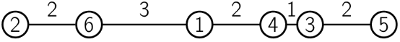

<details>
<summary>
Let's look at this very simple line graph.
</summary>


All nodes in one chain. The nodes are numbered ,and already in the order , in which we going to contract the nodes in this example. 

Let's look what happens when we contract the nodes.  First, we contract node 1,  it goes down, means that we contracted it.

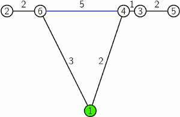

And you see that there was a path  6-1-4 ,  when we contracted it, it's no longer in the graph  . And then we need to reconstruct that path.  So we add a new edge 6-4 with length 5, which is colored in blue in the picture. 

Now what happens when we contract node 2 ?  Nothing really happens.

Now let's contract node 3.

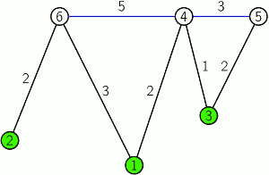

When we contract the node 4, it is the most interesting node because it already has 2 blue nodes. But nevertheless, when we contract it we remove the path between 6-4-5, and add a new edge 6-5. 

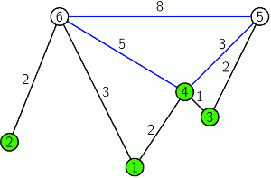

In the end we contract node 5. Nothing changes. 

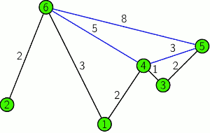

We don't need to contract node 6 because it's the last node in the graph.


</details>


You see that the nodes in the new picture are different heights. And this just symbolizes that the higher is the node, the later it was contracted. 

And the higher the node , the more important it is.  So we first contract or remove the **least** important nodes.  And the nodes which are left in the end are the most important nodes. 


<h2 id="6341d14a4b0f707c95f30884ce778d9c"></h2>


#### Witness Paths 

Now let's see what happens in general when we contract node v.

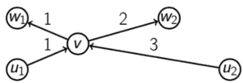


