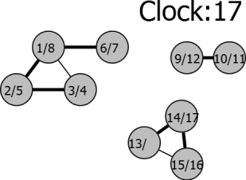
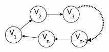
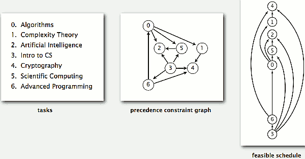
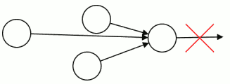
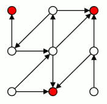
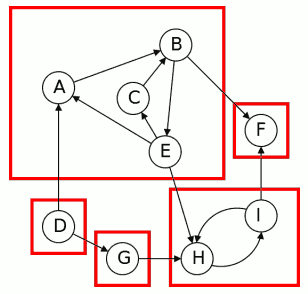
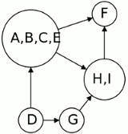
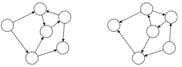
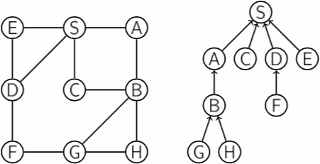

...menustart

 - [Algorithm On Graphs](#311ad33f7584ac17012490ce8852f7e8)
 - [Week1 Exploring Undirected Graphs](#edbf6a2cb4c2f45a6c6f05f7981ececd)
     - [Graph Basics](#887b235eb2dfc010821effbf5b9689f7)
         - [Representing Graphs](#030495a245248ce0deed9c13f9576cd0)
     - [Exploring Undirected Graphs](#fa4ec304233cb938cae388a53fe8dc4e)
         - [Exploring Graphs](#6d620d4a966ddb637a736ea4670b6782)
             - [Explore](#1819001b72329e2ef5799fe504238035)
             - [DFS](#c1bb62b63c65be3760b715faad0bdf8d)
         - [Connectivity](#9bd9d0ebc081bd74f5bef4e136bb1aed)
             - [Connected Components](#8a4d6dec35ad6f01d54531c509cf7d37)
         - [Previsit and Postvisit Orderings](#cb7d104acd7ef78260476fb96e632beb)
             - [Previsit and Postvisit Functions](#c190b4dd3a865a419b7d42ecdded4b14)
             - [Clock](#98a892aea3359481ae30e7b66c44d7a8)
 - [Week2 Directed Graphs](#2b39565942c0c8f530d738cf53da9df6)
     - [Directed Graphs](#2b12ab1371d8f9b1ce9580a395b2e9b2)
         - [Directed Acyclic Graphs](#7a53b8f5717213d05b5a349b30218b27)
             - [Directed DFS](#82842893b1046ac7ea43887a7d4c6c97)
             - [Cycles](#d3240659659cbfa93d781d1510717a66)
             - [DAGs](#1f979bae5ccfb6a193fde8d275355540)
         - [Topological Sort](#3f9c4755d1b2c530f17ce3f80a0fb896)
             - [Finding Sink](#2f1d4122555c30fa41c0390bd028ef60)
             - [TopologicalSort Algorithm](#7325cfd5224854fdee2a8cd7f046a1f6)
         - [Strongly Connected Components](#670190ac033bf942d8013492dc8f8b0f)
             - [Metagraph](#cd4755489eca8e682b00937d8e695b98)
         - [Computing Strongly Connected Components](#b3a7569c9a7d363bd55ee91cf45641f9)
             - [Sink Components](#80d29df79dc221a3cd1b8e554a6a3828)
             - [Finding Sink Components](#57c30fe3a2297ed1dfa107e753e2752e)
                 - [Reverse Graph Components](#509d136ac9a437456bbe67dd6b003890)
             - [Algorithm](#4afa80e77a07f7488ce4d1bdd8c4977a)
 - [Week3 Shortest Path](#ebf4c5795e7e039832b0c383127c1af7)
     - [Breadth-First Search](#ae5c4b868b5b24149decba70c74165c2)
     - [Creating MST by BFS](#e426fd50467bdd2d4e182815b0eee5ae)
     - [Constructing shortest-path tree](#b677abc0402df239cc73865a664d147a)
 - [Week4 Weighted Edge Graph](#f48846cfd1c263bd3b157547c127e20d)
     - [Dijkstra's Algorithm](#f5465cb36bdbaa6b373c184f42e56778)
         - [Implementation](#b672f52ade975e864ae6b58722c03689)
     - [Currency Exchange](#003f976d33ac8c24e95d86528dd29140)
         - [Currency Exchange](#003f976d33ac8c24e95d86528dd29140)

...menuend


<h2 id="311ad33f7584ac17012490ce8852f7e8"></h2>


# Algorithm On Graphs

content | method | graph | comments
--- | --- | --- | --- 
connected component | DFS   | indirected graph
connectivity    | DFS   | indirected graph
topology sort   | DFS | DAG  | sink vertex
strongly connected component    | DFS   | directed graph
strongly connected component    | DFS  | reverse directed graph  | sink component
shortest path | BFS   | graph
MST | BFS   | graph
MST | Dijkstra  | weighted edge


More applications 

problem | method | graph | comments
--- | --- | ---  | --- 
Is a graph bipartite  | DFS | undirected graph
does the graph exist a cycle  | DFS | graph


<h2 id="edbf6a2cb4c2f45a6c6f05f7981ececd"></h2>


# Week1 Exploring Undirected Graphs

<h2 id="887b235eb2dfc010821effbf5b9689f7"></h2>


## Graph Basics 

<h2 id="030495a245248ce0deed9c13f9576cd0"></h2>


### Representing Graphs

1. Edge List
    - egdes: (A, B), (A, C), (A,D), (C,D) 
    - A,B,C,D are vertices
2. Adjacency Matrix
    - Entries 1 if there is an edge, 0 if there is not.
3. Adjacency List
    - For each vertex, a list of adjacent vertices.
    - A adjacent to B, C,D
    - B adjacent to A
    - C adjacent to A,D
    - D adjacent to A, C
    - can be implemented by a dictionary 
 
- Different operations are faster in different representations
- for many problems , we want adjacency list because a lot of operations really want to be able to find neighbors.

Op | Is Edge? | List Edge | List Nbrs 
--- | --- | --- | ---
Adj. Matrix | Θ(1) |  Θ( &#124;V&#124;²) |  Θ(&#124;V&#124;)
Edge List | Θ(&#124;E&#124;) | Θ(&#124;E&#124;) |  Θ(&#124;E&#124;)
Adj. List | Θ(deg) | Θ(&#124;E&#124;) | Θ(deg)


- Graph algorithm runtimes depend on |V| and |E|.
    - i.e. `O(|V|+|E|)`


<h2 id="fa4ec304233cb938cae388a53fe8dc4e"></h2>


## Exploring Undirected Graphs

<h2 id="6d620d4a966ddb637a736ea4670b6782"></h2>


### Exploring Graphs


- Visit Markers
    - To keep track of vertices found: Give each vertex boolean visited(v).
- Unprocessed Vertices
    - Keep a list of vertices with edges left to check.
    - This will end up getting hidden in the program stack
- Depth First Ordering
    - We will *explore new edges* in Depth First order. 


<h2 id="1819001b72329e2ef5799fe504238035"></h2>


#### Explore

- Explore(v) marks as visited exactly the vertices **reachable** from v.
- Good for adjacency list representation!

```python
def Explore(v):
    visited(v) ← true
    for w in neighbors(v):
        if not visited(w):
            Explore(w)
```

- Normaly, we are used to save parent node for each vertex, so that we can easily reconstruct the path.

```python
def Explore(v):
    visited(v) ← true
    for w in neighbors(v):
        if not visited(w):
            Explore(w)
            edgeTo[w] = v
```


<h2 id="c1bb62b63c65be3760b715faad0bdf8d"></h2>


#### DFS

- DFS to find all vertices of G, not just those reachable from v.

```python
def DFS(G):
    for all v in V : 
        mark v unvisited
    for v in V :
        if not visited(v):
            Explore(v)
```

---

<h2 id="9bd9d0ebc081bd74f5bef4e136bb1aed"></h2>


### Connectivity

<h2 id="8a4d6dec35ad6f01d54531c509cf7d37"></h2>


#### Connected Components

- Explore(v) finds the connected component of v
- Just need to repeat to find other components.
- Modify DFS to do this.
- Modify goal to **label** connected components

---- 

- Solution: We also assign the vertices a number corresponding to the connected components
- Runtime: still O(|V|+|E|)

```python
def Explore(v):
    visited(v) ← true
    # changes: cc is passed in outside
    CCnum(v) ← cc
    for w in neighbors(v):
        if not visited(w):
            Explore(w)

def DFS(G):
    for all v in V : 
        mark v unvisited
    # changes: generating connected components number
    cc ← 1
    for v in V :
        if not visited(v):
            Explore(v)
            # changes: increment cc
            cc ← cc + 1
```

---

<h2 id="cb7d104acd7ef78260476fb96e632beb"></h2>


### Previsit and Postvisit Orderings

- Need to Record Data
    - Plain DFS just marks all vertices as visited.
    - In general if we want ot make DFS useful, we need to keep track of other data to be useful,  just like how we find the connected components.
    - Adding functions to store additional information, for example, let's look at the `Explore(v)`

<h2 id="c190b4dd3a865a419b7d42ecdded4b14"></h2>


#### Previsit and Postvisit Functions


```python
def Explore(v):
    visited(v) ← true
    # changes
    previsit(v)
    for w in neighbors(v):
        if not visited(w):
            Explore(w)
    # changes
    postvisit(v)
```

So , what are those funcitons , previsit/postvisit going to be ? They could be many kind of things. 


<h2 id="98a892aea3359481ae30e7b66c44d7a8"></h2>


####  Clock

One that we might want to do is to keep track of what order are we visit vertices in.  And so one way to do this is we have a clock.

- This clock keep track of order of visits.
- Clock ticks forward once it hit a pre-/post- visit.
- Records previsit and postvisit times for each v.



- Computing Pre- and Post- Numbers
- Initialize clock to 1.

```python
def previsit(v):
    pre(v) ← clock
    clock ← clock + 1
def postvisit(v):
    post(v) ← clock
    clock ← clock + 1
```

- Previsit and Postvisit numbers tell us about the execution of DFS.
- Lemma
    - For any vertices u, v the intervals pre(u), post(u)] and [pre(v), post(v)] are either **nested** or **disjoint**.
        - nested: eg.  (1,8) , (2,5)
        - disjoint: eg.  (1,8) , (9,12)
    - that is , Interleaved is not possible
        - eg. ( 1, 8 ) , ( 5, 9  )

---

<h2 id="2b39565942c0c8f530d738cf53da9df6"></h2>


# Week2 Directed Graphs

<h2 id="2b12ab1371d8f9b1ce9580a395b2e9b2"></h2>


## Directed Graphs


<h2 id="7a53b8f5717213d05b5a349b30218b27"></h2>


### Directed Acyclic Graphs

- Directed graphs might be used to represent:
    - Streets with one-way roads.
    - Links between webpages.
    - Followers on social network.
    - **Dependencies** between tasks.


<h2 id="82842893b1046ac7ea43887a7d4c6c97"></h2>


#### Directed DFS

- Can still run DFS in directed graphs.
    - Only follow **directed** edges
    - explore(v) finds all vertices **reachable** from v.
    - Can still compute pre- and post- orderings.

<h2 id="d3240659659cbfa93d781d1510717a66"></h2>


#### Cycles

- A **cycle** in a graph G is a sequence of vertices v1, v2, . . . , vn so that
- (v1, v2),(v2, v3), . . . ,(vn−1, vn),(vn, v1) are all edges.
- 
- Theorem
    - If G contains a cycle, it cannot be linearly ordered.
- linearly ordered
    - Redraw DAG so all edges sit in a line, and all point upwards.
    -  

<h2 id="1f979bae5ccfb6a193fde8d275355540"></h2>


#### DAGs

- A directed graph G is a **Directed Acyclic Graph** (or DAG) if it has no cycles.
- Theorem
    - Any DAG can be linearly ordered
- Beiing a DAG is necessary to linearly order.
    - Is it sufficient ? 


<h2 id="3f9c4755d1b2c530f17ce3f80a0fb896"></h2>


### Topological Sort

Goal. Given a set of tasks to be completed with precedence constraints, in which order should we schedule the tasks?
 
- Learning Objectives
    1. Implement the topological sort algorithm
    2. Prove that a DAG can be linearly ordered


- Last Vertex
    - Consider the last vertex in the ordering. It cannot have any edges pointing out of it
    - 
- Sources and Sinks
    - A **source** is a vertex with no incoming edges.
    - A **sink** is a vertex with no outgoing edges
        - 


- Idea
    1. Find sink
    2. Put at end of order
    3. Remove from graph
    4. Repeat

This is all well and good, but it depends on us being able to find a sink.

<h2 id="2f1d4122555c30fa41c0390bd028ef60"></h2>


#### Finding Sink

- Question: How do we know that there is a sink?
- Follow path as far as possible v1 → v2 → . . . → vn. Eventually either:
    - Cannot extend (found sink).
    - Repeat a vertex (have a cycle).

<h2 id="7325cfd5224854fdee2a8cd7f046a1f6"></h2>


#### TopologicalSort Algorithm

- First Try
    - 
    ```
    # LinearOrder(G )
    while G non-empty:
        Follow a path until cannot extend 
        Find sink v
        Put v at end of order
        Remove v from G
    ```
- Runtime
    - O(|V|) paths
    - Each takes O(|V|) time
    - Runtime O(|V|²)
- Speed Up
    - `LinearOrder` retrace same path every time 
    - Instead only back up as far as necessary
        - This is just DFS !
        - And in particular whenever we finish the post visit block at a vertex, 
    - 
    ```python
    TopologicalSort(G)
        DFS(G)
        sort vertices by reverse post-order
    ```


<h2 id="670190ac033bf942d8013492dc8f8b0f"></h2>


### Strongly Connected Components

- Connectivity is complex in directed graph.
- Two vertices v, w in a directed graph are **connected** if you can reach v from w **AND** can reach w from v.
- Theorem
    - A directed graph can be partitioned into **strongly connected components** where two vertices are connected if and only if they are in the same component.
    - 

<h2 id="cd4755489eca8e682b00937d8e695b98"></h2>


#### Metagraph

- Once we've split our graph into connected components, they still have edges connecting these components to each other
- So one useful thing to do is to draw what's known as **metagraph**, which sort of telles us how these strongly connected components connect to one another 
    -  ,    
- Theorem
    - The metagraph of a (directed) graph G is always a DAG.
 
How to compute the strongly connected components of a graph. ?


<h2 id="b3a7569c9a7d363bd55ee91cf45641f9"></h2>


### Computing Strongly Connected Components

- Problem
    - Input: A directed graph G
    - Output: The strongly connected components of G. 

<h2 id="80d29df79dc221a3cd1b8e554a6a3828"></h2>


#### Sink Components

- Idea: 
    - If v is in a sink SCC, explore(v) finds vertices reachable from v. This is exactly the SCC **of v**.
        - 因为SCC的性质，无论你从SCC中的任何一个点node开始，你都是 explore 整个SCC
    - that also means, you will get different SCC, if you start from different node.
- Need a way to find a sink SCC.
    - why ? 
    - if you start from a source SCC, you many visit the whole graph, it won't help you.


<h2 id="57c30fe3a2297ed1dfa107e753e2752e"></h2>


#### Finding Sink Components

- Theorem
    - If C and C' are two strongly connected components with an edge from some vertex of C to some vertex of C' , 
    - then **largest** postorder in C bigger than **largest** postorder in C'  no matter you visit vertex first in C or C'.
    - 但是，最小的 postorder 不一定在 C'里
- Conclusion
    - The vertex with the largest postorder number is in a source component!
    - Problem: We wanted a sink component

<h2 id="509d136ac9a437456bbe67dd6b003890"></h2>


##### Reverse Graph Components

- Let Gᴿ be the graph obtained from G by reversing all of the edges.  
    - 
- Gᴿ and G have same SCCs.
- Source components of Gᴿ are sink components of G.  
- Find sink components of G by running DFS on Gᴿ .
    - The vertex with largest postorder in Gᴿ is in a sink SCC of G.

<h2 id="4afa80e77a07f7488ce4d1bdd8c4977a"></h2>


#### Algorithm

- Naive Implementation
    - 
    ```python
    def SCCs(G ):
        repeate:
            run DFS(Gᴿ)
            let v have largest post number 
            run Explore(v) on G
            vertices found are first SCC , Remove from G 
    ```
- Improvement
    - Don't need to rerun DFS on Gᴿ
    - Largest remaining post number comes from sink component
        - The point is, after you remove this sink component, and if you just then look for the vertex with the single largest remaining postorder, that's going to be sink component of the new graph.
- New Algorithm
    - 
    ```python
    def SCCs(G):
        run DFS(Gᴿ)
        for v ∈ V in reverse postorder:
            if not visited(v):
                Explore(v)
                mark visited vertices as new SCC
    ```

- Runtime
    - Essentially DFS on Gᴿ and then on G.  
    - Runtime O(|V| + |E|).

---


<h2 id="ebf4c5795e7e039832b0c383127c1af7"></h2>


# Week3 Shortest Path

<h2 id="ae5c4b868b5b24149decba70c74165c2"></h2>


## Breadth-First Search

[BFS algorithm](https://github.com/mebusy/notes/blob/master/dev_notes/AlgorithmII_Graph.md#9f5783932f655ffe3908ff7d3410497e)

<h2 id="e426fd50467bdd2d4e182815b0eee5ae"></h2>


## Creating MST by BFS



```python
def BFS(G,S):
    for all u∈V:
        dist[u] ← ∞, prev[u] ← nil
    dist[S] ← 0
    Q ← {S} {queue containing just S} 
    while Q is not empty:
        u ← Dequeue(Q) 
        for all (u,v)∈E:
            if dist[v] = ∞:
                Enqueue(Q , v )
                dist[v] ← dist[u] + 1
                prev[v] ← u
```

Here, we use `dist[]` to save the accumulative distance, it also servers as `visited`.

Normally the application of DFS, BFS visits each node only once.


<h2 id="b677abc0402df239cc73865a664d147a"></h2>


## Constructing shortest-path tree

By BFS, you have found the shortest path , but how you reconstuct the shortest path ? 

```python
def ReconstructPath(S, u, prev):
    result ← empty 
    while u ≠ S:
        result.append(u)
        u ← prev[u]
    return Reverse(result)
```


<h2 id="f48846cfd1c263bd3b157547c127e20d"></h2>


# Week4 Weighted Edge Graph

What is the MST of weighted edges graph ?

<h2 id="f5465cb36bdbaa6b373c184f42e56778"></h2>


## Dijkstra's Algorithm

<h2 id="b672f52ade975e864ae6b58722c03689"></h2>


### Implementation

```python
def Dijkstra(G , S ):
    for all u∈V:
        dist[u] ← ∞, prev[u] ← nil
    dist[S] ← 0
    H ← MakeQueue(V ) {dist-values as keys} 
    while H is not empty:
        u ← ExtractMin(H) 
        for all (u,v)∈E:
            # the next 3 lines called relax edge
            if dist[v]>dist[u]+w(u,v): 
                dist[v] ← dist[u] + w(u, v) 
                prev[v] ← u 

                ChangePriority(H , v , dist [v ])
```


<h2 id="003f976d33ac8c24e95d86528dd29140"></h2>


## Currency Exchange

- We've know how to find shortest path in the graph with non-negative edge weight. 
- Now we will learn to find shortest path even in the graphs where some of the edge weigths can be negative.


<h2 id="003f976d33ac8c24e95d86528dd29140"></h2>


### Currency Exchange


