...menustart

- [Week1 Suffix Trees](#ede56b0e2be5bbfcf53933d43ef1f740)
    - [From Genome Sequencing to Pattern Matching](#a8d5f7810493a28ca313b038a21c0173)
    - [Brute Force Approach to Pattern Matching](#0bbf0b0ddc6dc0d500db46cbd60489c2)
    - [Herding Patterns into Trie](#cd82dafbae81bae40211a2c7f374942f)
    - [Herding Text into Suffix Trie](#38728a7876efba9de4422511579b2ddd)
        - [Where Are the Matches???](#e7849ccbb64da45c5b8246d6f100af54)
        - [Memory Footprint of Suffix Trie](#9f208e275122ae4c1c110416a76cfffe)
    - [From Suffix Tries to Suffix Trees](#6df9f85e12d53da5a7faab3233bbbcf3)
    - [Constructing Suffix Tree:](#eeb864ae13cd09f3fc8b2e37ef0dac43)
    - [Quiz](#ab458f4b361834dd802e4f40d31b5ebc)
- [Week2 Burrows-Wheeler Transform and Suffix Arrays](#7b4bb7010bb5cc258a877c223ce396fa)
    - [Burrows-Wheeler Transform](#c77af5b3abfc315781377fb29256c39f)
        - [Text Compression by Run-Length Encoding](#ae31601ab819806b46842f7459b1a9f1)
        - [Inverting Burrows-Wheeler Transform](#2958b02379af181c5d50fdb9eb76f1f8)
        - [Using BWT for Pattern Matching](#353b08ef75d5176db7f70fe5d2e3d617)
        - [Finding Pattern Matches Using BWT](#ad4f3a6c1f6f60c79912e399831fe50e)
        - [Searching for ana using top and buttom pointers](#577c04ac242ce1b20da613dd6aaf2a9f)
    - [Suffix Arrays](#4297164b1e2c9e6f4924b39ebdad0b14)
    - [Approximate Pattern Matching](#699b0062252bc43a8e1c97a871b1b3fd)
- [Week3: Algorithmic Challenges: Knuth-Morris-Pratt Algorithm](#a13edce40a6797ca350bb37ecae33e7d)
    - [Exact Pattern Matching](#9f189b44c5da7aabf3ba7ce283ed775c)
    - [Prefix Function](#56d24cce97717b776b1c66489991f675)
        - [Enumerating borders](#d1d75d9e4070f158aeaa17e37bc34991)
        - [Computing s(i + 1)](#7458f83cf5feb375ce613102ad4cf673)
        - [ComputePrefixFunction(P)](#52b3a75d31d9676c1ccf5234adc3347b)
    - [Knuth-Morris-Pratt Algorithm](#a27872b96c92390fbd9d96e8553f69ca)
        - [Explanation](#b72ac10807b29c77f5b7e4b80ea40414)
        - [pseudo code](#d5c1daf026b98296ae4747476c5a2b2d)
        - [Conclusion](#6f8b794f3246b0c1e1780bb4d4d5dc53)
- [Week 4](#024f2ea1afa39552cc7823dfeaeeba8c)
    - [Suffix Array](#070de002eb9fe6a242a3eea58a6b0a47)
        - [Construct Suffix Array](#b3d93ca2f2b1bae05ed120cebaaaf0c3)
        - [Storing Suffix Array](#0315a918e4426dc96ef07eca2ff9c282)
    - [General Construction Strategy](#de6482d736735d19a98b6d7a3dbfcc6d)
        - [Sorting Cyclic Shifts](#888bc7579c1220dbe1b54eb1ae879f1a)
        - [Partial Cyclic Shifts](#451551949780f6ab99bc7aef6b615713)
        - [General strategy](#15ec4eae4da6642dc613154ae7f2dfe7)
    - [Initialization](#61bcd96a2c1f8026527cbf2019d6e9a4)
        - [Sorting single characters](#220fede2d20dea1a24a2451daa5924fb)
        - [Equivalence classes](#db5dda92fb337ee173853f6dc222c5a5)
    - [Sort Doubled Cyclic Shifts](#81480019c9809a4ee289e1a7961e2976)
        - [Idea](#158d7558ee87d9a8caa77b59abcdd9ef)
        - [Sorting pairs](#45056b7535c004ef33d46e84ebe688d6)
        - [Sorting doubled cyclic shifts](#e0aa9002d2d7eaa00f7c68a2815caf65)
    - [Updating Classes](#efb4b863c9f924263ba6b0b74cf2ad5c)
    - [Full Algorithm](#fa2a8b4fe46e36086e1dd6bbdb67af76)
        - [Conclusion](#6f8b794f3246b0c1e1780bb4d4d5dc53)
- [Suffix Tree Application](#f8d40ebc6cf8e6129d70c91e882080ac)

...menuend


<h2 id="ede56b0e2be5bbfcf53933d43ef1f740"></h2>


# Week1 Suffix Trees 

<h2 id="a8d5f7810493a28ca313b038a21c0173"></h2>


## From Genome Sequencing to Pattern Matching

 - Times 杂志堆发生了爆炸，如何知道 某天的杂志说了什么？
 - 基因重组

---

 - Pattern Matching Problem:
    - Input: A string Pattern (read) and a string Text (genome).
    - Output: All positions in Text where Pattern appears as a substring.
 - Approximate Pattern Matching Problem:
    - Input: A string Pattern, a string Text, and an integer d
    - Output: All positions in Text where Pattern appears as a substring **with at most d mismatches**.
 - ***Multiple*** Pattern Matching Problem:
    - Input: A ***set of strings*** Patterns and a string Text.
    - Output: All positions in Text where a string from Patterns appears as a substring.

<h2 id="0bbf0b0ddc6dc0d500db46cbd60489c2"></h2>


## Brute Force Approach to Pattern Matching

 - Pattern drives along Text
    - 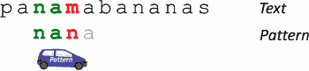
 - Brute Force Approach Is Fast!
    - running time of single Pattern: O(|Text|·|Pattern|)
    - The runtime of the Knuth-Morris-Pratt algorithm: O(|Text|)
 - Brute Force Approach is Slow for Billions of Patterns
    - running time:  O(|Text|·|Patterns|)
    - For human genome:
        - |Text|≈ 3 * 10⁹
        - |Patterns|≈ 10¹²

<h2 id="cd82dafbae81bae40211a2c7f374942f"></h2>


## Herding Patterns into Trie


⇓

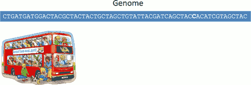

---

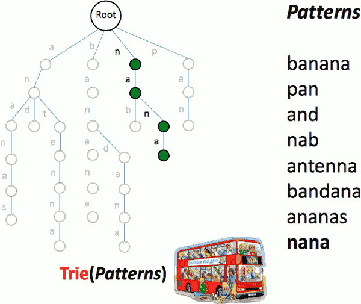

For simplicity, we assume that no pattern is a substring of another pattern.

```
TrieMatching(Text, Patterns):
    drive Trie(Patterns) along Text
    at each position of Text
        - walk down Trie(Patterns) by spelling symbols of Text
        - a pattern from Patterns matches Text each time you reach a leaf
```

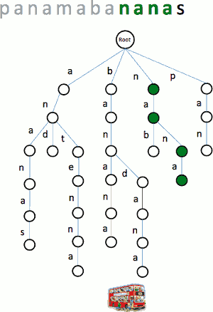

 - Our Bus Is Fast!
    - Runtime of TrieMatching: O(|Text|\* |LongestPattern|)
 - Memory Footprint of TrieMatching
    - Our trie has 30 edges
    - # edges = O(|Patterns|) !!!
    - For human genome: |Patterns|≈ 10¹²  

<h2 id="38728a7876efba9de4422511579b2ddd"></h2>


## Herding Text into Suffix Trie

New Idea: Packing Text onto a Bus

 - Generate all suffixes of Text
 - Form a trie out of these suffixes (suffix trie)
 - For each Pattern, check if it can be spelled out from the root downward in the suffix trie

 - panamabananas$
    - Adding “$” sign in the end. 

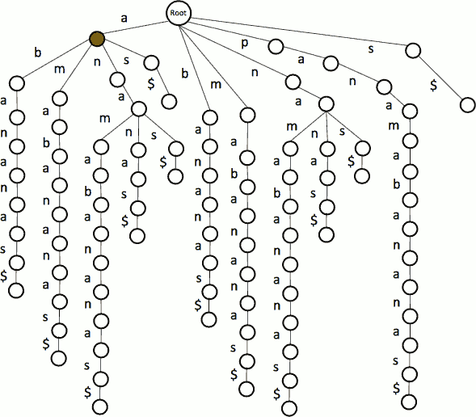

 - this tree also told us that *a* appear in the text 6 times.

<h2 id="e7849ccbb64da45c5b8246d6f100af54"></h2>


### Where Are the Matches???

Maybe we find a match :

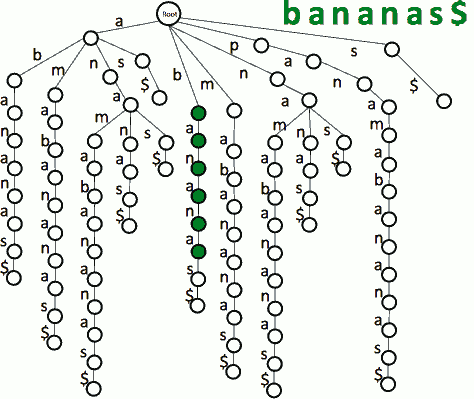

But where is the match ? What is the position of "banana" in the Text ?

 - Idea:to find the positions of matches , add some information to leaves

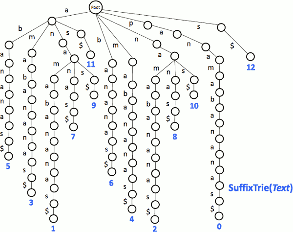

 - Walking Down to the Leaves to Find Matches
    - Once we find a match, we “walk down” to the leaf (or leaves) in order to find the starting position of the match.

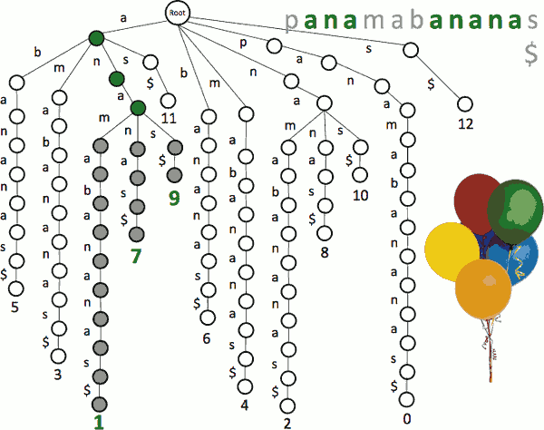

<h2 id="9f208e275122ae4c1c110416a76cfffe"></h2>


### Memory Footprint of Suffix Trie
 
 - The suffix trie is formed from |Text| suffixes with total length: 
    - |Text| \* (|Text|– 1)/2
 - For human genome:
    - |Text|≈ 3\*10⁹
 
---

<h2 id="6df9f85e12d53da5a7faab3233bbbcf3"></h2>


## From Suffix Tries to Suffix Trees

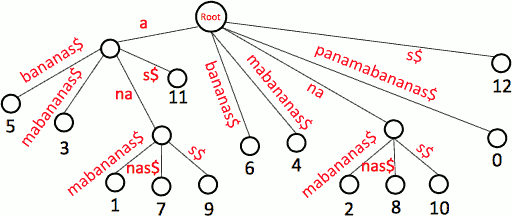

 - Since each suffix adds one leaf and at most one internal vertex to the suffix tree:
    - #vertices < 2|Text|
    - memory footprint of the suffix tree: O(|Text|)
    - Cheating!!! - how do we store all edge labels?
        - storing edge labels !
        - 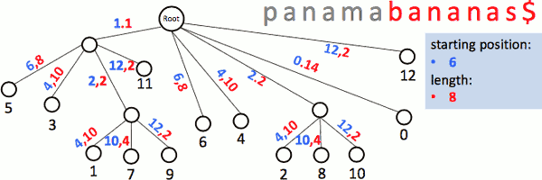

 - Why did we bother to add “$” to “panamabananas”?
    - to make sure that each suffix corresponds to a leaf
    - 单字母的情况：eg. s$
 - Why do we want to make sure that each suffix correspond to a leaf?
    - construct suffix tree for “papa”(without adding “$”) 
    - and construct suffix tree for “papa$”
    - compare it, you will get the answer.


<h2 id="eeb864ae13cd09f3fc8b2e37ef0dac43"></h2>


## Constructing Suffix Tree:

 - Naive Approach
    - Quadratic runtime: O(|Text|²)
    - O(|Genome| + |Patterns|) to find pattern matches
 - Linear-Time Algorithm
    - Linear runtime (for a constant-size alphabet): O(|Text|)
    - Linear-time algorithm (Weiner, 1973) was simplified by Ukkonen (1995) but it is still too complex to cover in this course
 
--- 

 - pseudocode for constructing a trie from a collection of patterns:
    - 
 - pseudocode for matching a collection of patterns against the text using a trie:
    - 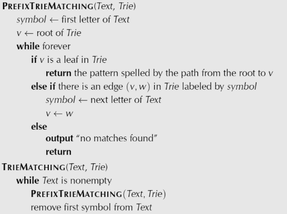

---

<h2 id="ab458f4b361834dd802e4f40d31b5ebc"></h2>


## Quiz

- Q: What is the running time and the memory consumption of exact pattern matching using suffix tree for text *Text* and a set of patterns *Patterns* with length of the text denoted by |*Text*| , and the total length of all patterns denoted by |Patterns| ?
- A: 
    - Running time: O(|Text|+|Patterns| )
    - memory consumption: O(|Text|)
- solution
    1. first we need O(|Text|) to build the suffix tree.
    2. Then for each *Pattern* in *Patterns* we need additional O(|Pattern|) to match this pattern against the *Text*
        - The total time for all the patterns is thus O(|Patterns|) 
    3. The overall running time is O(|Text|+|Patterns| ) 
    4. We only need O(|Text|) additional memory to store the suffix tree and all the positions where at least one of the *Patterns* occurs in the *Text*. 

 - However, big-O notation hides constants!
    - suffix tree algorithms has large memory footprint ~ 20 · |Text| for long texts like human genome
 - Even more importantly , We want to find mutations! 
    - it is unclear how to develop fast **Approximate** Multiple Pattern Matching using suffix trees 


---

<h2 id="7b4bb7010bb5cc258a877c223ce396fa"></h2>


# Week2 Burrows-Wheeler Transform and Suffix Arrays 

<h2 id="c77af5b3abfc315781377fb29256c39f"></h2>


## Burrows-Wheeler Transform

So our goal now is to start from the genome, apply Burrows–Wheeler transform to the genome. And we can now, hopefully, compress Burrows–Wheeler transform of the genome. And after you apply this compression, we will greatly reduce memory for storing our genome. But it totally makes sense if we can invert this transformation. 

<h2 id="ae31601ab819806b46842f7459b1a9f1"></h2>


### Text Compression by Run-Length Encoding

 - Run-length encoding compresses a run of n identical symbols:
    - GGGGGGGGGGCCCCCCCCCCCAAAAAAATTTTTTTTTTTTTTTCCCCCG
    - -> 10G11C7A15T5C1G
 - genomes don’t have lots of runs... but they do have lots of repeats:
    - ***ACTGA***CCGAA***ACTGA***GTATCCG***ACTGA***A***ACTGA***TCAGT***ACTGA***CATTGC

 - Idea: Converting Repeats to Runs
 - Forming All Cyclic Rotations of Text
    - panamabananas$
    - 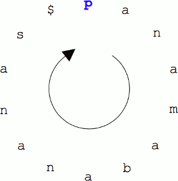

--- 

 - Cyclic Rotations
    - panamabananas$ 
    - $panamabananas 
    - s$panamabanana 
    - as$panamabanan 
    - nas$panamabana 
    - anas$panamaban 
    - nanas$panamaba 
    - ananas$panamab 
    - bananas$panama 
    - abananas$panam 
    - mabananas$pana 
    - amabananas$pan 
    - namabananas$pa 
    - anamabananas$p
 - Sorting Cyclic Rotations
    - Sort the strings lexicographically ($ comes first)
    - BWT(panamabananas$)=smnpbnn**aaaaa**$a
    - 
    - now it has many runs
 - Going Back From BWT(Genome) to Genome ? 

--- 


<h2 id="2958b02379af181c5d50fdb9eb76f1f8"></h2>


### Inverting Burrows-Wheeler Transform

 - Reconstructing banana from annb$aa
    - We know the last column of the Burrows-Wheeler matrix. 
    - We also know the first column , because the first column is simply sorting all elements of the Burrows-Wheeler transform.  排序一下可得
        - Sorting all elements of “annb$aa” gives first column of BWT matrix.
    - We now know 2-mer composition of the circular string banana$ 
        - 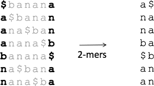
    - Sorting gives us the first 2 columns of the matrix
        - 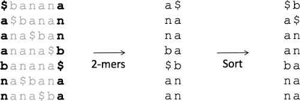
    - We now know 3-mer composition of the circular string banana$
    - Sorting gives us the first 3 columns of the matrix.
        - 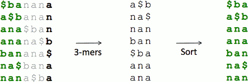
    - repeate the steps, until we reconstruct the entire matrix !
        - Symbols in the first row (after $) spell ***banana***.
 - More Memory Issues
    - Reconstructing Text from BWT(Text) required us to store |Text| cyclic rotations of |Text|.
    - Can we invert BWT(Text) with less space and without |Text| rounds of sorting?
 - A Strange Observation
    - 
    - 1st **a** in FirstColumn and 1st **a** in LastColumn are hiding at the same position along the cycle!
    - They Are Hiding at the Same Position!
 - Is It True in General?
    - 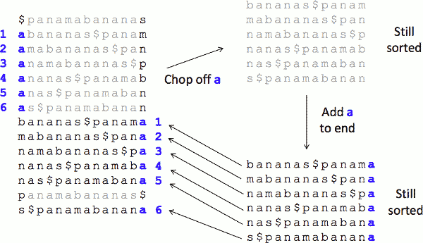
 - First-Last Property
    - the k-th occurrence of *symbol* in ***FirstColumn***
    - and the k-th occurrence of *symbol* in ***LastColumn***
    - correspond to appearance of *symbol* at the same position in ***Text***.
    - 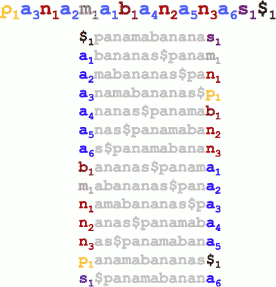

---

 - Inverting BWT again 
    - let's start with the *$* that is located in the first column first row.  It corresponds to s1 in the last column first row. 
    - we know where s1 is located in the first column. let's move there.  (red line)
        - 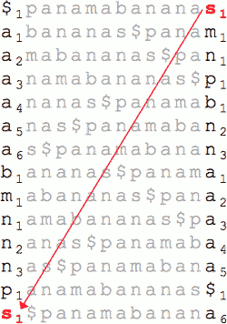
    - And s1 in the first column correspond to a6 in the last column. And we know where a6 is located in the first column , so let's move to the postion a6. 
        - 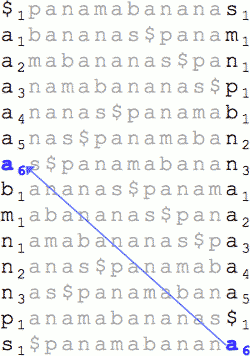
    - repeat such steps , We are done 
        - This Was Fast!
        - 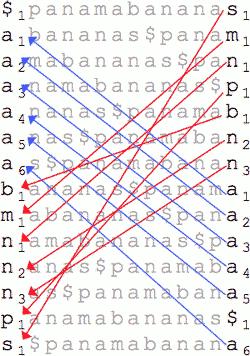
        - Memory: 2|Text|
        - Time: O(|Text|)

--- 

 - quiz:  What is the inverse of the Burrows-Wheeler Transform AGGGAA$ ?
    - 注： BWT string $并不是总在最后一位
 - A: GAGAGA$

首先列出 1st column and last colum

```
$₁ ... A₁
A₁ ... G₁
A₂ ... G₂
A₃ ... G₃
G₁ ... A₂
G₂ ... A₃
G₃ ... $₁


A₁
G₁A₁
A₂G₁A₁
G₂A₂G₁A₁
A₃G₂A₂G₁A₁
G₃A₃G₂A₂G₁A₁
```

The only question left, where is pattern matching in the Burrows-Wheeler transform ?

<h2 id="353b08ef75d5176db7f70fe5d2e3d617"></h2>


### Using BWT for Pattern Matching

 - Can we use BWT(Text) to design a more memory efficient linear-time algorithm for Multiple Pattern Matching?

<h2 id="ad4f3a6c1f6f60c79912e399831fe50e"></h2>


### Finding Pattern Matches Using BWT

 - Searching for **ana** in p**ana**mab**anana**s
    - 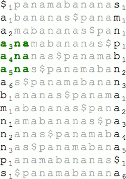
 - Lets Start by Matching the Last Symbol (a) 
    - Searching for ani**a** in panamabananas
    - 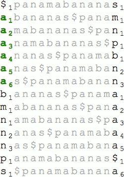
 - Matching the Last Two Symbols (na)
    - Searching for a**na** in panamabananas
    - Three Matches of na Found!
    - 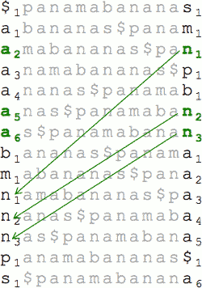
 - Matching **ana**
    - Searching for **ana** in panamabananas
    - 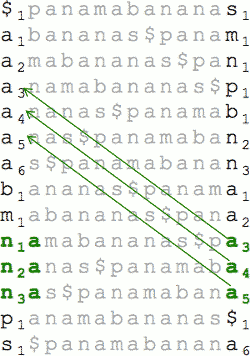


<h2 id="577c04ac242ce1b20da613dd6aaf2a9f"></h2>


### Searching for ana using top and buttom pointers 


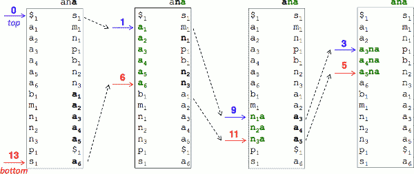


```
if positions from top to bottom in LastColumn contain symbol 
    topIndex ← first postion of symbol among position from top to bottom in LastColumn 
    bottomIndex ← lastpostion of symbol among position from top to bottom in LastColumn 
    top ← LastToFirst( topIndex )
    bottom ← LastToFirst( bottomIndex )
```


 - 1st iteration - a
    - in lastColumn[0,13]  contain *a* 
    - topIndex ← 7 in last column
    - lastIndex ← 13 in last column
    - top ← 1  in first column
    - bottom ← 6 in 1st column
 - 2nd iteration - n 
    - in lastColumn[1,6] contain *n*
    - topIndex ← 2 in last column
    - lastIndex ← 6 in last column
    - top ← 9  in first column
    - bottom ← 11 in 1st column
 - 3th iteration - a
    - in lastColumn[9,11] contain *a*
    - topIndex ← 9 in last column
    - lastIndex ← 11 in last column
    - top ← 3  in first column
    - bottom ← 5 in 1st column
 - We found  5-3+1 = 3 !!! 
 

In the 1st iteration, the range of position we are interested in is narrowed to all position where *a* appears in the 1st column (a₁-a₆) .

We are looking for the next symbol , which is *n* in *ana* , and we are looking for the 1st occurrences of this symbol in the last column , among positions from top to buttom, among rows from top to buttom.

As soon as we found the 1st and last occurrence of this symbol in this case , and the first-last property will tell us where this *n* and all n's in between are hiding in the first column.  As a result , the pointers top and buttom equal to 1 and 6 , are changing into 9 and 11, they narrow the search. 

And then we continue further, and that's how we find the positions of *ana* in the text. 

Now we have a  pattern matching algorithm based on Burrows-Wheeler Transform, and it has good memory footprint. 

The only problem , though , is that BW Mathing is very slow. It analyzes every symbol from top to bottom in the last column in each step. What should we do? 

 - BWMatching is slow
    - it analyzes every symbol from top to bottom in each step!

---     

 - The trick here is to introduce the count array. 

 - Introducing Count Array 
    - 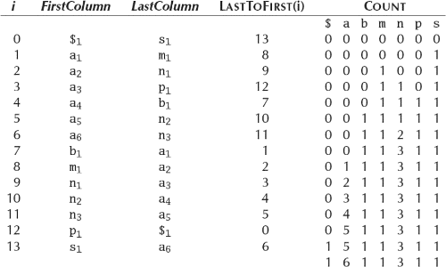
    - The count array describes the number of apearances of a given symbol 
        - the count array imply the order of sorted symbol
        - in this case , we records all count arrays **for every substring of LastColumn --  in python:  Text_Last_Column[:i] 
    - so you have the array of #occurrences for every symbol 
        - through the count array of entire LastColumn , you can calculate the index where every symbol first appear in first column(sorted) 
        - this is **FIRSTOCCURRENCE**.
 - bettern Algorithm !!!
    - Count\<symbol\>( i, LastColumn )
        - can be implemented by  2D array ?  what about the memory usage ?
        - return #occurrences of *symbol* in LastColumn[:i] -- first i position in LastColumn .

```
BetterBWMatching( FIRSTOCCURRENCE , LastColumn , Pattern , Count  )
    top ← 0
    bottom ← |LastColumn| -1
    
    while top <= bottom
        if Pattern is nonempty
            symbol ← last letter in Pattern
            remove last lettern from Pattern
            top ← FIRSTOCCURRENCE(symbol) + Count( top, LastColumn )
            bottom ← FIRSTOCCURRENCE(symbol) + Count( bottom +1 , LastColumn ) -1 
        else 
            return bottom - top +1 
    return 
end function 
```

 - top ← 0 , bottom ← 13 
 - 1st iteration 
    - symbol ← a 
    - top ← 1 + 0 = 1
    - bottom ← 1 + 6 -1 = 6
 - 2nd iteration 
    - symbol ← n 
    - top ← 9 + 0 = 9 
    - bottom ← 9 + 3 -1 = 11
 - 3th iteration
    - symbol ← a 
    - top ← 1 + 2 = 3
    - bottom ← 1 + 5 -1 = 5
 - we found 5-3+1 = 3 matching !!!! 


And as you can see, we don't need any more to explore every symbol between top and bottom indices in the last column. 

---


 - 前面主要证明了，通过 BWT form 可以做到快速matching
 - There is still one question. Where are the matches that they found ? Where do they appear in the text  ?

 - Where Are the Matches?
    - We know that ***ana*** occurs 3 times, but where does ***ana*** appear in Text???

---

<h2 id="4297164b1e2c9e6f4924b39ebdad0b14"></h2>


## Suffix Arrays

 - Suffix array  holds starting position of each suffix beginning a row.
 - panamabananas$
    - 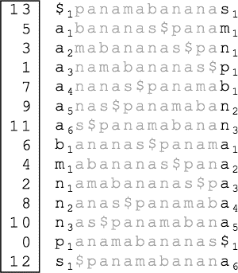
 

```python
# naive solution
def get_suffix_array(str):
    return sorted(xrange(len(str)), key=lambda i: str[i:])
```

---

 - Q: what is the suffix array of the string S = GAGAGAGA$ ?  ( raw text )
 - A: [8, 7, 5, 3, 1, 6, 4, 2, 0]
 - problem will occure if we don't have the raw text, but BWT text

```
8 $
7 A$
5 AGA$
3 AGAGA$
1 AGAGAGA$
6 GA$
4 GAGA$
2 GAGAGA$
0 GAGAGAGA$
```

 - Using the Suffix Array to Find Matches
    - suffix array of panamabananas$ : [13, 5, 3, 1, 7, 9, 11, 6, 4, 2, 8, 10, 0, 12]
    - Thus, ana occurs at positions 1, 7, 9 
        - a3 -> 1
        - a4 -> 7
        - a5 -> 9

So , when suffix array is constructed, we can very quickly answer the question where the occurrence of the part is. In this case of *ana* , our pattern appear at position 1,7,and 9. 

The challenge is how to construct the suffix array quickly. Because the naive algorithm is O(n²). 

There is a way to construct a suffix array if you're already construction a suffix tree. A suffix array is simply a depth-first traversal of the suffix tree. 

 - From Suffix Tree to Suffix Array: Depth-First Traversal
    - 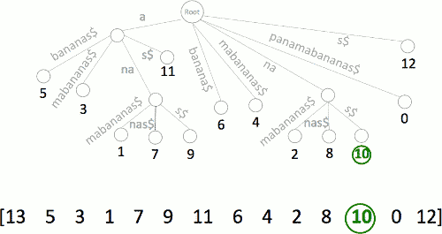
    - Indeed, you start from lead 5, continue to lead 3, , and then 1, ....  

 - Constructing Suffix Array
    - Depth-first traversal of suffix tree
        - O(|Text|) time and ~20·|Text| space
    - Manber-Myers algorithm (1990):
        - O(|Text|) time and ~4·|Text| space
    - But memory footprint is still large for human genome!
    - We will learn how to quickly construct suffix array without relying on suffix tree later in this course

 - Reducing Memory Footprint for Suffix Array
    - Can we store only a fraction of the suffix array but still do fast pattern matching?
        - 只 suffix array的一部分
    - Partial suffix array SuffixArrayK(Text) only contains values that are multiples of some integer K
        - eg. k=5 -- 0,5,10

 - Using the Partial Suffix Array to Find Matches
    - Where are these ana prefixes located in Text???
        - 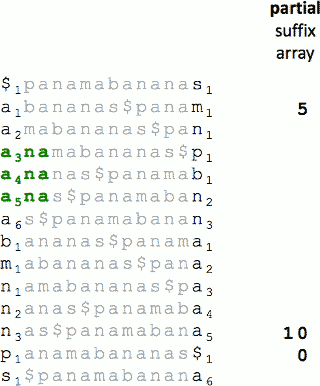
    - Focus on **a₄na**
        - Partial suffix array reveals position of a₁bana
        - 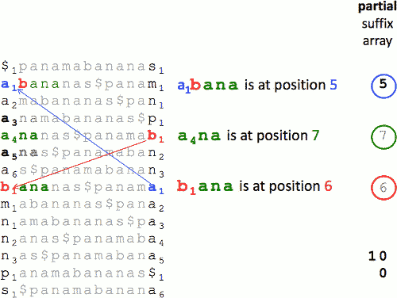


---

<h2 id="699b0062252bc43a8e1c97a871b1b3fd"></h2>


## Approximate Pattern Matching

 - Returning to Search for Mutations
    - Approximate Pattern Matching Problem:
        - Input: A string Pattern, a string Text, and an integer d.
        - Output: All positions in Text where the string Pattern  appears as a substring with at most d mismatches.
 - Revealing Mutations by Analyzing ***Billions*** of Reads
    - ***Multiple*** Approximate Pattern Matching Problem
        - Input: A ***set*** of strings Patterns, a string Text, and an integer d.
        - Output: All positions in Text where a string from Patterns appears as a substring with at most d mismatches.
 - BWT Saves the Day Again !
    - eg. *ana* with 1 mismatch
    - searching for an**a** in panamabananas
        - We will start again with finding all rows in the BW matrix that start with *a*.
        - 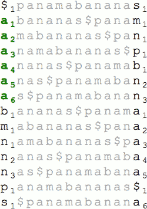
    - searching for ai**na** in panamabananas
        - Approximate matching with at most 1 mismatch
        - And among them , we want to find rows that containts *na*.  Among six rows that start with *a* , only three of them actually end with *n*, they form exact matching of the last 2 symbols of *ana* to our text.   They form exact matching of the last 2 symbols of *ana* to our text.
        - In the past , it was the only thing we interested, but now, we're actually interested in all six rows starting from *a*,  because we are interested in approximate matches as well. 
        - And to find approximate matches , we need to retain all the 6 rows, and specify the number of mismatches for each of these rows. 
        - 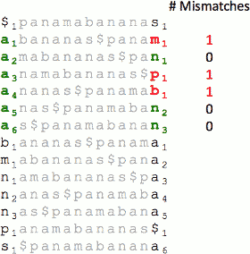 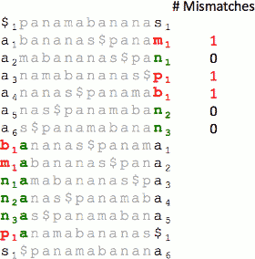 
    - searching for **ana** in panamabananas
        - This row results in a 2nd mismatch (the $), so we discard it.
        - 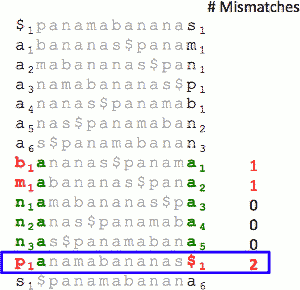
    - Five Approximate Matches Found!
        - 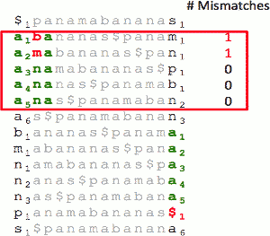
        - 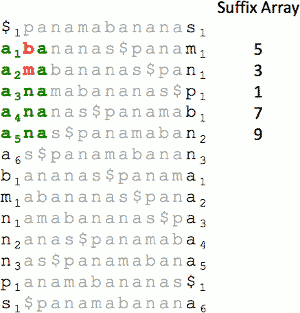
 


---

 
 - In reality, approximate pattern matching with BWT is more complex (we omitted various details)

---


<h2 id="a13edce40a6797ca350bb37ecae33e7d"></h2>


# Week3: Algorithmic Challenges: Knuth-Morris-Pratt Algorithm 

<h2 id="9f189b44c5da7aabf3ba7ce283ed775c"></h2>


## Exact Pattern Matching

 - Strings T (Text) and P (Pattern).
 - All such positions in T (Text) where P (Pattern) appears as a substring.

---
 
 - Brute Force Algorithm
    - Slide the Pattern down Text
    - Running time Θ(|T||P|)
 - Is it possible to skip some of positions while sliding the Pattern along the Text using only the information about the Pattern and the result of the comparsion of last alignment of the Pattern and the Text ?
    - Yes. 
    - 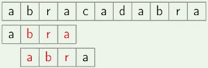
        - now we have find a matching. if we somehow pre-precessed the pattern , and know that 
        - the prefix without last character !=  the suffix without the first character ( 'bra' != 'abr' )
            - we can skip this position
        - the prefix without 2 last characters !=  the suffix without the 2 characters ( 'ra' != 'ab' )
            - we can skip this position
        - the prefix without 3 last characters ==  the suffix without the 3 characters  ( 'a'=='a' )
            - we can not skip this postion
        - so for next iteration, we can just move Pattern by |Pattern| - |'a'| = 3  position !
    - 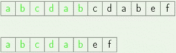
        - another example is when we don't even find the whole pattern in the text, we still can skip some of the positions 
        - in this example, the longest prefix which is common for the text and pattern consisits 6 characters , and the pattern is longer (not entirely matching)
        - So we can not compare prefixes of the pattern with suffixes of the same pattern 
        - But instead, we can do the same thing with the string marked in green -- the longest common prefix 
        - 'ab' == 'ab'
        - so for next iteration, we can just move Pattern by 6-|'ab'| =   4 position!  
    
---

 - Definition
    - **Border** of string S is a prefix of S which is equal to a suffix of S, but not equal to the whole S.
 - Example
    - *a* is a border of *arba*
    - *ab* is a border of *abcdab*
    - *abab* is a border of *ababab*
    - *ab* is **not** a border of *ab*

--- 

 - Shifting Pattern
    - 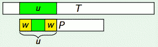
    - Find longest common prefix *u* 
    - Find *w* the longest border of *u*
    - 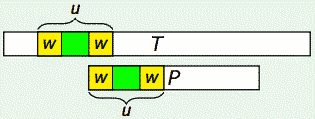
    - Move P such that prefix w in P aligns with suffix w of u in T.
 - Now you know we can skip some of the comparisons
 - But we shouldn't miss any of the pattern occurrences in the text
 - Is it *safe* to shift the pattern this way ? 

<h2 id="56d24cce97717b776b1c66489991f675"></h2>


## Prefix Function

 - Definition
    - Prefix function of a string P is a function s(i) that for each i returns the length of the longest border of the prefix **P[0..i]**.  
 - Example 
    - P abababcaab
    - S 0012340112
    - s(2) means the length of longest border of **aba**  -- *a*
    - s(5) means the length of longest border of **ababab**  -- *abab*
 - Lemma
    - P[0..i] has a border of length s(i + 1) − 1
        - ![][1]
        - P[0..i] may have several borders, does not has to be longest one
    - Corollary
        - s(i+1) ≤ s(i)+1
        - that is , the prefix function can not grow by more than 1  , from some position to next position 
        - 字符串增加一个字符，s 一般会变小，就算不变小，s 最多也就 增加1

--- 
 
<h2 id="d1d75d9e4070f158aeaa17e37bc34991"></h2>


### Enumerating borders

 - Lemma 
    - If s(i) > 0, then all borders of P[0..i] but for the longest one are also borders of P[0..s(i) − 1].
        - 对于一段字符串，非 最长 border, 本身也是 最长border的 border
        - let *u* be a border shorter than the longest border , so that |u| < s(i)
        - border *u* is both a prefix , and suffix  of the longest border : P[0..s(i)-1]
            - remark: P[0..s(i)-1] is longest border !!! 
        - 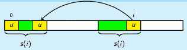
        - and *u* was also shorter than the longest border, that is *u* ≠ P[0..s(i)-1] ,  so *u* is indeed a border of P[0..s(i)-1]
 - Corollary
    - All borders of P[0..i] can be enumerated by taking the longest border **b1** of P[0..i], then the longest border **b2** of **b1**, then the longest border **b3** of **b2**, . . . , and so on.

---

<h2 id="7458f83cf5feb375ce613102ad4cf673"></h2>


### Computing s(i + 1)

Now lets think how to compute the prefix function.

 - s(0) is 0
 - now to compute s(i+1) if we already know the values of the s(i)
    - 
    - those green part is the border as prefix and suffix of string
    - if the characters right after those 2 borders are same , then 
        - s(i+1) = s(i) + 1 
        - **case 1**
        - because s(i+1) > s(i) -- we just increase the length of border , the we have learned that the prefix function can not grow by more than 1. 
    - but if the characters are different , everything is a bit more complex 
        - we know that P[0..i] has a border of length s(i + 1) − 1. 
            - ![][1]
        - So if we find that border then the next green character after it will be the same as the character in position i+1 -- 'x'
            - 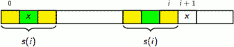
        - so what we need to is going through all the borders of the prefix ending in position i, by **decreasing** length. 
            - and as soon as we find some border that the next character after it is the same as the character at position i+1, then
            - s(i + 1) = |some border of P[0..s(i) − 1]| + 1 
            - **case 2**
    - at some point , we may come to the station that the longest border is empty , and then we'll need to compare the character in position i+1 with the character in postion 0 
        - either they are the same , and then the prefix function is 1 
            -- **case 3**
        - or they are different , and then the prefix function has the value of 0.
            -- **case 4**

--- 

 - Example :
    - P : ababcababac
    - s(0) = 0
    - s(1) = 0 , case 4
    - s(2) = 1 , case 3
    - s(3) = 2 , case 1
    - s(4) = 0 , case 2 , failed
    - s(5) = 1 , case 3
    - s(6) = 2 , case 1
    - s(7) = 3 , case 1
    - s(8) = 4 , case 1
    - s(9) = 3 , case 2 , success
    - s(10) = 0 , case 2 , failed 

--- 

<h2 id="52b3a75d31d9676c1ccf5234adc3347b"></h2>


### ComputePrefixFunction(P)

(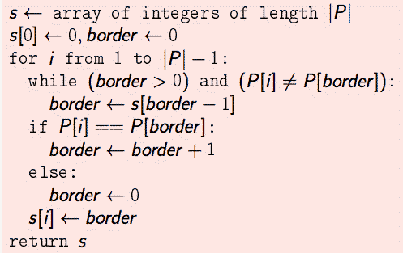

 - The running time of ComputePrefixFunction is O(|P|)
 - Now you know how to compute prefix function in linear time
 - But how to find pattern in text??


---

<h2 id="a27872b96c92390fbd9d96e8553f69ca"></h2>


## Knuth-Morris-Pratt Algorithm

 - to find all the occurrences of a pttern in the text in the time linear in terms of the length of the **pattern** and length of **text**


 - Create new string S = P + '$' + T
    - 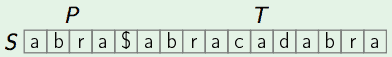
    - where '$' is just **any** special character absent from both P and T
 - Compute prefix function s for string S
    - 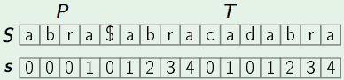
    - For all positions i such that i > |P| and s(i) = |P|, add i − 2|P| to the output
        - so we'll look at all positions i , such that i is more than length of the pattern 
            - `i > |P|` --  after the pattern and '$'
        - if the prefix function for that position i , is equal to the length of the pattern , then we know there is a occurrence of the pattern in text ending in that postion 
            - `s(i) = |P|` -- 2 positions in this case 
        - we need find all the postions where the pattern starts, so from the position where it ends , we need to compute the position where it starts in the raw TEXT 
            - `i − 2|P|` 
 - '$' can prevent the error in the cases such like:
    - Pattern = "AAA"
    - Text = "A" 
 
<h2 id="b72ac10807b29c77f5b7e4b80ea40414"></h2>


### Explanation

 - For all i, s(i) ≤ |P| because of the special character '$'
 - If i > |P| and s(i) = |P|, then P = S[0..|P| − 1] = S[i − |P| + 1..i] = T[i − 2|P|..i − |P| − 1]
 - If s(i) < |P|, no full occurrence of |P| ends in position i 

<h2 id="d5c1daf026b98296ae4747476c5a2b2d"></h2>


### pseudo code

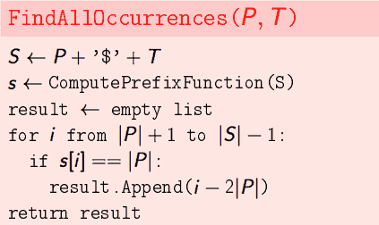

 - Lemma
    - The running time of Knuth-Morris-Pratt algorithm is O(|P| + |T|).
 - Proof
    - Building string S is O(|P| + |T|)
    - Computing prefix function is O(|S|) = O(|P| + |T|)
    - The for loop runs O(|S|) = O(|P| + |T|) iterations


<h2 id="6f8b794f3246b0c1e1780bb4d4d5dc53"></h2>


### Conclusion

 - Can search pattern in text in linear time
 - Can compute prefix function of a string in linear time
 - Can enumerate all borders of a string

---

In the next lessons, we will learn how to build suffix array and suffix tree in time O(N·lgN) , which will allow you to find many different patterns in the same text even faster than if you use algorithms like KMP.

 


---

<h2 id="024f2ea1afa39552cc7823dfeaeeba8c"></h2>


# Week 4

<h2 id="070de002eb9fe6a242a3eea58a6b0a47"></h2>


## Suffix Array

<h2 id="b3d93ca2f2b1bae05ed120cebaaaf0c3"></h2>


###  Construct Suffix Array
 
 - Input: String S
 - Output: All suffixes of S in lexicographic order
 
---
 
 - Alphabet
    - We assume the alphabet is ordered, that is, for any two different characters in the alphabet one of them is considered smaller than another. For example, in English 
        - ’a’ < ’b’ < ’c’ < · · · < ’z’ 
 - Definition
    - String S is lexicographically smaller than string T if S ≠ T and there exist such i that:
        - 0 ≤ i ≤ |S| 
        - S[0..i − 1] = T[0..i − 1]
            - (assume S[0.. − 1] is an empty string)
        - Either i = |S| (then S is a prefix of T) , or S[i] < T[i]
 - Example
    - “*a*b” < “*b*c” (i = 0)
    - “ab*c*” < “ab*d*” (i = 2)
    - “abc” < “abc*d*” (i = 3)
 - Suffix Array Example
    - S = ababaa
    - Suffixes in lexicographic order:
        - a
        - aa
        - abaa
        - ababaa
        - baa
        - babaa
 - Avoiding Prefix Rule
    - we want to avoid this case when S is a prefix of T
    - Inconvenient rule: if S is a prefix of T, then S < T
    - Append special character ‘$’ smaller than all other characters to the end of all strings
    - If S is a prefix of T, then S$ differs from T$ in position i = |S|, and $ < T[|S|], so S$ < T$
 - Example
    - S = “ababaa” -> S' = “ababaa$”
    - Suffixes in lexicographic order:
        - $
        - a$
        - aa$
        - abaa$
        - ababaa$
        - baa$
        - babaa$
    

```python
# naive solution
def get_suffix_array(str):
    return sorted(xrange(len(str)), key=lambda i: str[i:])
```


<h2 id="0315a918e4426dc96ef07eca2ff9c282"></h2>


### Storing Suffix Array

 - Total length of all suffixes is
    - 1 + 2 + · · · + |S| = Θ(|S|²)
 - Storing them all is too much memory
 - Store only the order of suffixes O(|S|) 
    - the order is just a permutation of numbers 
    - and the number of those numbers is the |S| 
    - that is what we mean by **suffix array**
 - **Suffix array** is this order 

 - Example
    - S = ababaa$
    - Suffixes are numbered by their starting positions: ababaa$ is 0, abaa$ is 2
    - Suffix array: order = [6, 5, 4, 2, 0, 3, 1]
        - we start with an empty array
            - order = []
        - So the smallest suffix is just $. 
            - order = [6] 
        - And the next one is a$  , which is numbered 5 ; and then aa$ which is numbered 4
            - order = [6,5,4]
        - eventually , we got
            - order = [6,5,4,2,0,3,1]
 - So this is the kind of array which we call suffix array
    - which is the order of all the suffixes of the initial string.
    - and we don't store the suffixes themselves
 - However if we need to look at, for example the 3rd character of the 2nd suffix in order 
    - we can fist go into the array **order** , find out which suffix is 2
    - and that will be the 1st position of that suffix in the stream , and if we then add 2 to that, we'll that get character.
    - So in theory we can look at any character of any suffix really efficiently although we don't store sufixes directly.
 - OK, you know how to store suffix array
 - But how to construct it? 


<h2 id="de6482d736735d19a98b6d7a3dbfcc6d"></h2>


## General Construction Strategy

<h2 id="888bc7579c1220dbe1b54eb1ae879f1a"></h2>


### Sorting Cyclic Shifts

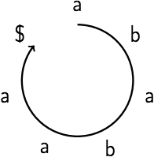

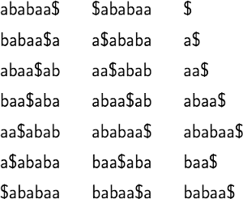

 - step1: sort 
 - step2: remove characters after '$' , the suffixes of S left. 

---

 - Lemma
    - After adding to the end of string S character $, which is smaller than all other characters,
    - sorting cyclic shifts of S and suffixes of S is equivalent

<h2 id="451551949780f6ab99bc7aef6b615713"></h2>


### Partial Cyclic Shifts

 - Definition
    - Substrings of cyclic string S are called partial cyclic shifts of S

 - Partial Cyclic Shifts Example
    - Cyclic shifts of length 4:
        - abab
        - baba
        - abaa
        - baa$
        - aa$a
        - a$ab
        - $aba

<h2 id="15ec4eae4da6642dc613154ae7f2dfe7"></h2>


### General strategy

 - Start with sorting single characters of S
 - Cyclic shifts of length L = 1 sorted
 - While L < |S|, sort shifts of length 2L
 - If L ≥ |S|, cyclic shifts of length L sort the same way as cyclic shifts of length |S|
 - 这样可以提高字符串排序的效率？


L=4 sorting : 

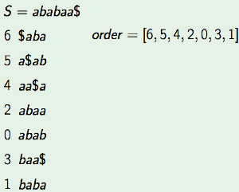


<h2 id="61bcd96a2c1f8026527cbf2019d6e9a4"></h2>


## Initialization

 - initialization phase of suffix array construction
    - sorting of the single character of the initial string 
    - computing equivalence classes of those characters

<h2 id="220fede2d20dea1a24a2451daa5924fb"></h2>


### Sorting single characters

 - Alphabet Σ has |Σ| different characters
 - Use counting sort to compute **order** of characters
    - we will use couting sort twice in the construction of the suffix array
        - in initialization phase , and in the transfer phase 

 - integer counting sort recap
    - input array: integer array A 
    - using an extra array C
        - C initialized as the array  which element C[i] means the number of the element class which equals *i* in A.
        - then the element of C turns into the next position to element class *i* in output array B 
            - from 1 to n-1, C[i] = C[i-1] + C[i]
            - C[5] = 9  means last *5* is in position 9-1 = 8
        - sorting 
            - from right to left of A
            - a = A[i]; C[a]-=1; dest_pos= C[a]; B[dest_pos] = a; 

 - Pseudo code for sorting characters. 
    - take string as input
    - return the order of the characters of that string as the output
    - 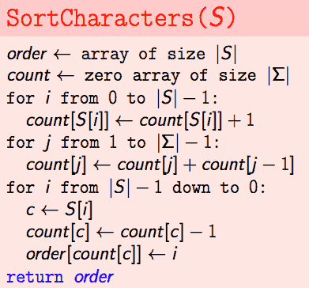

 - Lemma
    - Running time of SortCharacters is O(|S| + |Σ|).
 
<h2 id="db5dda92fb337ee173853f6dc222c5a5"></h2>


### Equivalence classes

we will also need additional information to make the following step 

 - Cᵢ -- partial cyclic shift of length L starting in i
 - Cᵢ can be equal to Cⱼ -- then they are in one equivalence class
 - Compute class[i] -- number of different cyclic shifts of length L that are strictly smaller than Ci
 - Cᵢ == Cⱼ ⇔ class[i] == class[j]

We'll need to compute this array class to increase the speed of the next phase.

And before computing this array class, we assume that we have already sorted all the cyclic shifts of the current length L. 

So how to actually compute the classes of the cyclic shifts when we already know their order ?


 - we want to assign class 0 to the smallest of the cyclic shifts of the current length.
    - which is $, which is in the position 6. 
    - so we write class[6] = 0
 - the next smallest cyclic shift is letter *a* , and it is different from the previous smallest one *$*
    - so we need a new equivalence class for *a* 
    - class[0] = 1
 - next one is also *a* , it is equal to the previous one
    - class[2] = 1
 - same , class[4] = 1, class[5] = 1
 - the next one is *b* , which is different from the previous one and so we assign new class which is bigger by 1.
    - class[1] = 2 
 - the last one is again *b*
    - class[3] = 2
 - now we know the classes of all the single character cyclic shifts.

PseudoCode :


 - Lemma: The running time of ComputeCharClasses is O(|S|).

This is all for the initialization phase of the suffix array construction. In next video , we'll learn the transition phase from the current length to twice the length of the cyclic shifts.

---

<h2 id="81480019c9809a4ee289e1a7961e2976"></h2>


## Sort Doubled Cyclic Shifts 

 - you have already sorted cyclic shifts of some length L 
 - and you know not only their order , but also their equivalence classes 
 - and you need to sort based on the cyclic shift of length 2L. 

<h2 id="158d7558ee87d9a8caa77b59abcdd9ef"></h2>


### Idea

 - Cᵢ --  cyclic shift of length L starting in i
 - Cᵢ̍ --  doubled cyclic shift starting in i
 - Cᵢ̍ == CᵢC<sub>i+L</sub> -- concatenation of strings
 - To compare Cᵢ̍ with Cⱼ̍ , it’s sufficient to compare Cᵢ with Cⱼ and C<sub>i+L</sub> with C<sub>j+L</sub>


<h2 id="45056b7535c004ef33d46e84ebe688d6"></h2>


### Sorting pairs

Now we have to think about the following problem.  We need to sort pairs of numbers basically. Because each cyclic shift of length L corresponds to its number of position in the order of all cyclic shifts of length L. 

And we first need to sort by second element of pair, and then we stable sort by the first element of pair. 

 - First sort by second element of pair
 - Then stable sort by first element of pair

Example:

 - suppose our current length is 2 , and we already sorted all the cyclic shifts of length 2
 - 
 - now for each of the cyclic shifts of length 2, let's look at the cyclic shift of length 4 ,which ends in the cyclic shift of length 2.
    - 
    - so we take the 2 previous characters and add them to the left. 
 - we get a set of cyclic shifts of length 4
    - 
 - we have highlighted in yellow the 1st elements of the pairs , which are also cyclic shifts of length 2
    - the yellow part are not sorted. but we know their starting positions.  and we know what are the correct starting positions in the sorted order. 
    - so we can reorder this list of cyclic shifts of length 4 by the order of the 1st halves of the elements in this list using the know order.  
 - after such sorting , we actually get the sorted list of cyclic shifts of length 4. 
    - 

<h2 id="e0aa9002d2d7eaa00f7c68a2815caf65"></h2>


### Sorting doubled cyclic shifts

 - Cᵢ̍ --  doubled cyclic shift starting in i
 - Cᵢ̍ is a pair ( Cᵢ, C<sub>i+L</sub> )
 - C<sub>order[0]</sub>, C<sub>order[1]</sub>, ... , C<sub>order[|S|-1]</sub> are already sorted
 - Take doubled cyclic shifts starting exactly L counter-clockwise (“to the left”)
 - C'<sub>order[0]-L</sub>, C'<sub>order[1]-L</sub>, ... , C'<sub>order[|S|-1]-L</sub> are sorted by second element of pair
 - Need a stable sort by first elements of pairs
 - Counting sort is stable!
 - We know equivalence classes of single shifts for counting sort

Pseudo Code:


 - Lemma: The running time of SortDoubled is O(|S|).

<h2 id="efb4b863c9f924263ba6b0b74cf2ad5c"></h2>


## Updating Classes

 - Pairs are sorted — go through them in order, if a pair is different from previous, put it into a new class, otherwise put it into previous class
 - `(P1, P2) == (Q1,Q2) <=> (P1 == Q1) and (P2 == Q2)`
 - We know equivalence classes of elements of pairs


 - we've already sorted the doubled cyclic shifts of length 2 -- newOrder[]
 - our initial cyclic shifts were of length 1. We have the equivalence classes of L1 -- class[]
 - along with each doubled cyclic shift, we'll also write down the pair of the equivalence classes of its havles
    - for *$a* , the equivalance class for $ is 0, for a is 1, so the equivalance class pair is (0,1) 
 - now we need to compute the equivalence classes of the doubled cyclic shifts.
    - we go through the double cyclic shifts in the sorted order , by using array **newOrder**
    - we start from the 1st 1 -- *$a* 
        - newClass[6] = 0 
    - *a$* , newClass[5] = 1
    - *aa* , newClass[4] = 2
    - *ab* , newClass[0] = 3
    - *ab* , newClass[2] = 3
    - *ba* , newClass[1] = 4 
    - *ba* , newClass[3] = 4 
    - 

Pseudo code


 - Lemma : The running time of UpdateClasses is O(|S|).
 
<h2 id="fa2a8b4fe46e36086e1dd6bbdb67af76"></h2>


## Full Algorithm


 - input : string S
 - output : the order of the suffix of string
 - we assume that S already has $ in the end , and $ is smaller than all the characters in the string 
 - Lemma: The running time of BuildSuffixArray is O(|S| log |S| + |Σ|).
 - Prrof
    - Initialization: SortCharacters in O(|S| + |Σ|) and ComputeCharClasses in O(|S|)
    - While loop iteration: SortDoubled and UpdateClasses run in O(|S|)
    - O(log |S|) iterations while L < |S|

--- 

<h2 id="6f8b794f3246b0c1e1780bb4d4d5dc53"></h2>


### Conclusion

 - Can build suffix array of a string S in O(|S| log |S|) using O(|S|) memory
 - Can also sort all cyclic shifts of a string S in O(|S| log |S|)
 - Suffix array enables many fast operations with the string
 - Next lesson you will learn to construct suffix tree from suffix array in O(|S|) time, so you will be able to build suffix tree in total O(|S| log |S|) time!


---

<h2 id="f8d40ebc6cf8e6129d70c91e882080ac"></h2>


# Suffix Tree Application

 1. 查找字符串o是否在字符串S中
    - 解法：如果S存在于o中，那么S必然是o的某一个后缀的前缀，按照Trie树搜索前缀的方法，遍历后缀树即可。
    - 复杂度为O(M)，其中M为字符串S的长度。
 2. 指定字符串T在字符串S中的重复次数
    - 解法：在字符串S后追加$ 构造包含所有后缀的完整后缀树，在其中找到T子串 的最后一个节点，以该节点为根的子树，拥有的叶子节点个数 就是重复次数
    - 复杂度为O(M)，M为T的长度。
 3. 字符串S中的 最长重复子串
    - 解法：longest path label , from the root to any internal node (non-leaf)
    - 复杂度为O(N)，N为字符串的长度。
 4. 两个字符串S1，S2的最长公共子串
    - 解法：分别 为S1、S2追加#、$作为末尾，把他们压入同一个后缀树，然后找到最深的非叶子节点，该节点的叶子节点中，既有#又有$。
    - 复杂度为构造两颗后缀树的复杂度之和，取最大即可max(O(N),O(M))，其中N、M为S1、S2的长度，假设我们以线性时间构造了后缀树
    - eg S1="xabxa#" , S2="babxba$" , This is generalized suffix tree for xabxa#babxba$ :
        - 
            - 注意: S1 和 S2的 suffix string 是独立的, 即 "#" 肯定出现在 最后一个字符
                - xabxa# , abxa# , bxa#  , xa# , a# , #
                - babxba$ , abxba$ , ... 
                - 但是 index 是整个字符串的 
        - leaves with suffix indices in [0,4] are suffixes of string xabxa
        - leaves with suffix indices in [6,11] are suffixes of string babxba
        - With this, we can see that in the generalized suffix tree figure above, there are some internal nodes having leaves below it from
            - both strings X and Y (i.e. there is at least one leaf with suffix index in [0,4] and one leaf with suffix index in [6, 11]
            - string X only (i.e. all leaf nodes have suffix indices in [0,4])
            - string Y only (i.e. all leaf nodes have suffix indices in [6,11]))
        - Following figure shows the internal nodes marked as “XY”, “X” or “Y” depending on which string the leaves belong to, that they have below themselves.
            -  
            - What these “XY”, “X” or “Y” marking mean ?  Path label from root to an internal node gives a substring of X or Y or both.
                - For node marked as XY, substring from root to that node belongs to both strings X and Y.
                - For node marked as X, substring from root to that node belongs to string X only.
                - For node marked as Y, substring from root to that node belongs to string Y only.
        - how to get common substring of X and Y ?
            - traverse the path from root to nodes marked as XY, we will get common substring of X and Y.
        - Now we need to find the longest one among all those common substrings. how to get LCS now ? 
            - The path label from root to the deepest node marked as XY will give the LCS of X and Y.
            - path label “abx” is the answer.
 5. 找出给定字符串里的最长回文
    - 

---

 [1]: ../imgs/algorithm_on_string_prefix_func_lemma_0.png


