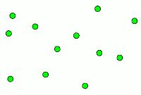
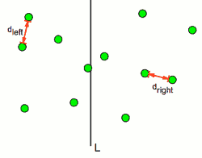
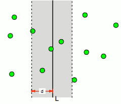
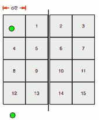
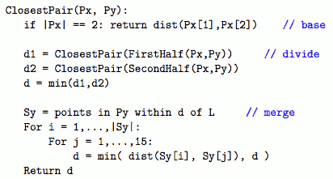

...menustart

 - [2D Closest Pair Algorithm](#257e1d9294fecbcaba498a89b62ab52a)

...menuend

<h2 id="257e1d9294fecbcaba498a89b62ab52a"></h2>

# 2D Closest Pair Algorithm

 - Problem
    - Given a set of points {p₁, ... , pn} find the pair of points {pᵢ,pⱼ} that are closest together.
    - 
 - Goal
    - in O(nlgn) time.
 - Solution:
    - Divide
        - Split the points with line L so that half the points are on each side.
        - Recursively find the pair of points closest in each half.
        - 
    - Merge: the hard case
        - Let d = min{dleft, dright}. 
        - d would be the answer, except maybe L split a close pair!
    - Region Near L
        - If there is a pair {pᵢ,pⱼ} with `dist( pᵢ,pⱼ ) < d`  that is split by the line
        - 
        - then both  pᵢ and pⱼ must be within distance *d* of L.
        - Let Sy be an array of the points in that region, sorted by decreasing y-coordinate value.
    - **Slab Might Contain All Points!**
        - Sy might contain all the points, so we can’t just check every pair inside it
    - **Theorem** 
        - Suppose Sy = p₁, ... ,pm, if dist( pᵢ,pⱼ ) < d , then `j-i≤ 15`.
        - In other words, if two points in Sy are close enough in the plane, they are close in the array Sy.
    - Proof 1:
        - Divide the region up into squares with sides of length d/2:
        - 
        - How many points in each box? 
        - At most 1. 如果 ≥2 点存在同一小格中，它们的距离就会小于 d, 与前面d的定义矛盾
    - Proof 2:
        - Suppose 2 points are separated by > 15 indices.
        - Then, at least 3 full rows separate them (the packing shown is the smallest possible).
        - But the height of 3 rows is > 3d/2, which is > d.
        - So the two points are father than d apart.
    - Linear Time Merge
        - Therefore, we can scan   Sy for pairs of points separated by < d in linear time. 
        - 
        - optimization:
            - the condition `if |Px| == 2` can be optimized by `if |Px| <=3 ` 
            - 第三部分merge 可以只考虑 pᵢ 在left array,pⱼ 在right array 的情况
                - 这样 只需要考虑 后面的 7个位置  
                - 更精确的划分，只需要 检查 后面5个位置 ？ [5 Proof](http://www.cs.mcgill.ca/~cs251/ClosestPair/ClosestPairDQ.html)

    - Total Running Time
        - Divide set of points in half each time:
            - O(log n) depth recursion
        - Merge takes O(n) time.
            - Recurrence: T(n) ≤ 2T(n/2) + cn
        - Same as MergeSort ⇒  O(n log n) time.

 - Improved  Algorithm 
    1. Divide the set into two equal sized parts by the line l, and recursively compute the minimal distance in each part.
    2. Let d be the minimal of the two minimal distances.
    3. Eliminate points that lie farther than d apart from l
    4. Sort the remaining points according to their y-coordinates
    5. Scan the remaining points in the y order and compute the distances of each point to its five neighbors.
    6. If any of these distances is less than d then update d.

