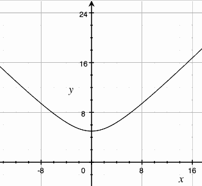

...menustart

- [Fast Distance 2D](#249f1d24d934aa496a04f61d7ec26566)

...menuend


<h2 id="249f1d24d934aa496a04f61d7ec26566"></h2>


# Fast Distance 2D


```cpp
nt FastDistance2D(int x, int y)
{
    x = abs(x);
    y = abs(y);
    int mn = MIN(x,y);
    return(x+y-(mn>>1)-(mn>>2)+(mn>>4));
}
```


- `x+y-(mn<<1)-(mn<<2)+(mn<<4)` 实际上就是 `max + min* 0.3125x` 
- 0.3125 的来历
    - let a = Max(x,y) ,  x = Min(x,y)
    - sqrt(a²+x²) 以线性函数 a+bx 来拟合，系数 b 即为待确定值 
    - a=5 时的函数图像 :
        - 
    - b 的选取应使函数在 x 的取值区间 [0,a] 内误差最小
        - 1.两函数在区间 [0,a] 的绝对差值积分最小；
        - 2.两函数在区间 [0,a] 的最大差值最小。
    - 以上两种情况代表两种对"误差最小"的不同理解，所得结果也各有利弊：
        - 第一种使得结果在大多数情况下都更为接近准确值，但在某些小范围会出现较大误差；
        - 第二种可以有效避免过大误差的出现，但结果却普遍偏大(在此例中的情况，由函数图像即可看出)
    - 按第二种算法，可以求的 b ≈  0.3284
    - 然后将 0.3284 换为二进制，得到 0.010101……，即返回的表达式为 y + x/4 + x/16 + x/64 = y + (x>>2) + (x>>4) + (x>>6) 
        - 上式最后一项影响已经很小了，舍去即可得到与原算法相同的表达式： x + y - (x>>1) - (x>>2) + (x>>4)


---

```python
def float_to_binary(num):
    exponent=0
    shifted_num=num
    while shifted_num != int(shifted_num):        
        shifted_num*=2
        exponent+=1
    if exponent==0:
        return '{0:0b}'.format(int(shifted_num))
    binary='{0:0{1}b}'.format(int(shifted_num),exponent+1)
    integer_part=binary[:-exponent]
    fractional_part=binary[-exponent:].rstrip('0')
    return '{0}.{1}'.format(integer_part,fractional_part)
```

```python
>>> float_to_binary( 0.3284 )
'0.0101010000010010000001011011110000000001101000110111'
```
