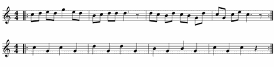
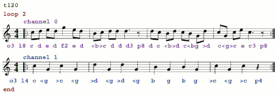
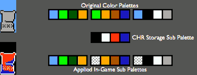
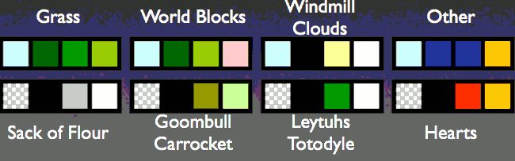

...menustart

- [CS 98-026](#05502cca8e1facce7e06ab44c849b37a)
    - [NES FQA](#4485bce575635400a3368712ac7f06f6)
    - [NES resolution](#620cb31010ef90ca556c2d510584fa9a)
    - [NES Color Palettes](#8f274476d6f19a8761307860bae6da69)
        - [NES Sub Palettes](#b8dab483a5fc8e28af74013cbe3956ae)
    - [NES Sprites](#75c135e1bd6017eb3bd137075beed6d1)
    - [Image Scaling](#1366666ff8169a1ff7b2900eb324e394)
    - [How a Game Works](#dc557cea52cf755441caa776e8c40a7c)
    - [Example nbasic Game](#f7fe9cc60c2e9d9db377c953ac2f7565)
    - [NES Registers](#0af047766b19b3a4d62eab151e3d087c)
        - [Common Registers](#8a5118136b72dd1a83d22b8efe98c51e)
        - [Joystick Input](#deb93182f0ca86302233d8d83e3bafba)
    - [Accessing PPU Memory](#d3dfa852f5198a418964c5cfd528ce2c)
    - [Drawing Sprites](#332835d479ff444201a116a967218939)
        - [Sprite Attribute Byte](#3f98440c27c210b01d837c75803242e2)
        - [Setting the Palette](#92277bb756e05b9946bd0c63c595c8be)
    - [Scrolling](#c35109c4b2f77708c1d5ab975b6c1d6a)
    - [NES Music](#57ad33e77aa0e6ad19e567d94d89d2f2)
        - [Computer Music](#c5de1abf66c5a9df2dde9bb012e6e051)
        - [NES Music Capabilities](#baf00a2e5d569db5773eb39a01ca523f)
        - [nesmus](#2f8325e8c88a2b6ca0c98e9f7367bfd4)
        - [From Score to Text](#2b8dbc469912b26f82c74e9715c6cc21)
        - [Listening](#962ef616821625a13a028ac14ac0fef8)
        - [Using nesmus Data](#9fafed9a3836703acab99b36ffc39ef0)
    - [Drawing Sprites](#332835d479ff444201a116a967218939)
        - [Sprite Tiles in the Pattern Table](#45bcc6a3f7f52fbcf1961efc5a7a2107)
        - [The Pattern Table](#c85078530f3916d2aa6c042a6568b0ed)
        - [Converting to 4 Colors](#00deb8bf51d2836e946880e785758793)
        - [Sticking it in the Game](#b4325014b3a4123b59f37c9648103fbf)
        - [In-Game Palette](#634c17f0c74ab4c1a3f4ee91327c5d1c)
        - [Picking a Palette](#929c3d7e51d288cde735d7b7adce15bb)
        - [Example Palette](#e71137076bed2bd25a863288d6fb5607)
    - [Frame Timing](#f0d1675be4acd3d8e58213fad67d3e2e)
        - [vwait](#cde6182a587983648c38b78b1469e2aa)
        - [NMI](#98ac9fa587d32240fbd819325be9beac)
        - [Sprite 0 Hit](#d526d0d1cafa5e43d9360c464ebc3805)
    - [Good nbasic Coding](#bc29e04d79d21cccdb4d00f632e4f414)
    - [Multiple Sprites](#7b71376cf646e1a50a62dad6d1ec018b)
        - [Being smart about sprite memory](#a86a99daaf060fe2bd87df8237200fa2)
        - [Main Draw Function](#7d8f79ac5318c18b0792464b62374b35)
        - [Clearing Sprites](#f555e00cf339b8a72dfe48b1adaac77d)
    - [Backgrounds](#cca65a547fe70cced505e37fca12d604)
        - [Name Tables](#6d0fcd3eda898f797e7929680076716b)
        - [Horizontal Mirroring](#df42afb929cbc14b6143c4db72a3023c)
        - [Vertical Mirroring](#3ee0e0702136af3cf5c3a5b01890da89)
        - [Attribute Table](#2293c1265225d77723970ec9cbf1d578)

...menuend


<h2 id="05502cca8e1facce7e06ab44c849b37a"></h2>


# CS 98-026

<h2 id="4485bce575635400a3368712ac7f06f6"></h2>


## NES FQA

 - http://nesdev.com/NESTechFAQ.htm

<h2 id="620cb31010ef90ca556c2d510584fa9a"></h2>


## NES resolution

 - 248x240 visible
 - From the programmer's perspective, the NES has a resolution of 256x256, 
    - but it chops off 8 pixels on each side, and 16 pixels on the bottom.


<h2 id="8f274476d6f19a8761307860bae6da69"></h2>


## NES Color Palettes

 - 64 Colors in the system palette (not fully unique)
 - 16 Colors in the background palette
 - 16 Colors in the foreground palette
 

<h2 id="b8dab483a5fc8e28af74013cbe3956ae"></h2>


### NES Sub Palettes

 - Background and Foreground palettes are split into four sub palettes of 4 colors.
 - The first entry in each background sub palette is the same **primary background color**.
    - This primary background color is usually used for the sky color
    - but it can also be used as the transparent color, in the rare event that you may wish to draw a sprite “behind” the background.
 - The first entry in each foreground sub palette is transparent.


 - Sprites and background tiles are 2-bit color (**4 colors max**).
 - Each pixel color value is a lookup index ,  into the current active sub palette for that tile
 - This allows the primary color and 3 unique colors per background sub palette.
 - Each foreground sub palette has 3 nontransparent colors.
 - The game is allowed to change the palettes and sub palettes during play, 
    - and sprites and tiles may change which sub palette they use for drawing.
 - How many colours can the NES display at once?
    - Ordinarily, the NES can display 13 different background colours, and 12 different sprite colours, giving a total of 25 colours on-screen, at once
    - However, using PPU trickery, one can display all of the NES' 64 palette values at once. 

---

<h2 id="75c135e1bd6017eb3bd137075beed6d1"></h2>


## NES Sprites


 - 8x8 or 8x16 pixels
    - However, only one size may be active at a time. 
 - May be flipped horizontally or vertically.
 - 3 colors and transparency
    - However, you may cleverly draw multiple sprites on top of each other, to create the appearance of a single sprite with more colors
 - Maximum of 64 sprites on screen at once
 - Hardware limit of 8 sprites per scanline
 - Not all emulators respect the 8 sprite limit

<h2 id="1366666ff8169a1ff7b2900eb324e394"></h2>


## Image Scaling

 - NES has a fixed resolution of 256x240
 - Your monitor is bigger
 - Playing games in a tiny window is no fun
 - hq3x seems good

<h2 id="dc557cea52cf755441caa776e8c40a7c"></h2>


## How a Game Works

 - Initialization
    - Set up graphics
    - Set initial values
 - The Game Loop
    - Draw the screen
    - Get player input
    - Calculate the next frame

<h2 id="f7fe9cc60c2e9d9db377c953ac2f7565"></h2>


## Example nbasic Game

```
start:
    gosub init_screen
    gosub init_vars
mainloop:
    gosub vwait //wait for next frame
    gosub draw_stuff //draw the new frame
    gosub handle_joystick //get input
    gosub calculate_things //game logic
    gosub update_sound //make some noise
    goto mainloop
```


<h2 id="0af047766b19b3a4d62eab151e3d087c"></h2>


## NES Registers

<h2 id="8a5118136b72dd1a83d22b8efe98c51e"></h2>


#### Common Registers

address | desc
--- | ---
$2000, $2001  | PPU Initialization
$2003, $2004  | Sprite Control
$2005  | Scrolling
$2006  | PPU Memory Address
$2007  | PPU Memory Access
$4014  | Sprite DMA
$4000-$400F  | Music Control
$4015  | Sound Setup
$4016, $4017  | Joysticks


<h2 id="deb93182f0ca86302233d8d83e3bafba"></h2>


### Joystick Input

 - Joystick 1 is register $4016
 - Joystick 2 is register $4017
 - Strobe by writing 1 then 0 to port 
    - 对$4016或$4017先写 1 后写 0，这将在游戏手柄的电路里发生个选通脉冲, 对手柄复位
    - 然后可以在$4016或$4017读取了
 - Read one byte for each button (A, B, Select, Start, Up, Down, Left, Right)
    - 每次读取将返回一个单一的按钮的状态
 - Bit 0 tells button status
    - 1 表示键被按下
 - Bit 1,2 用于扩展接口

```
// NES Joystick usage code, by Bob Rost
// Simply "gosub joystick1" to update info about player 1's controller
// nbasic automatically allocates variables joy1a, joy1b, etc.
// Similar usage for player 2.

joystick1:
    set $4016 1 //first strobe byte
    set $4016 0 //second strobe byte
    set joy1a       & [$4016] 1
    set joy1b       & [$4016] 1
    set joy1select  & [$4016] 1
    set joy1start   & [$4016] 1
    set joy1up      & [$4016] 1
    set joy1down    & [$4016] 1
    set joy1left    & [$4016] 1
    set joy1right   & [$4016] 1
    return

joystick2:
    set $4017 1 //first strobe byte
    set $4017 0 //second strobe byte
    set joy2a       & [$4017] 1
    set joy2b       & [$4017] 1
    set joy2select  & [$4017] 1
    set joy2start   & [$4017] 1
    set joy2up      & [$4017] 1
    set joy2down    & [$4017] 1
    set joy2left    & [$4017] 1
    set joy2right   & [$4017] 1
    return
```

 - 大塞车中的代码

```
LDY #$01   ; select joypad0
STY $4016
DEY 
STY $4016

LDA $4016  ; read 
AND #$03   ; 适配 扩展接口？
STA $6D    ; A键值 存入6D单元

LDA $4016  ; read 
AND #$03   ; 
STA $6E    ; B键值 存入6E单元

...
```


<h2 id="d3dfa852f5198a418964c5cfd528ce2c"></h2>


## Accessing PPU Memory

 - PPU has its own memory space, which you can access through registers
 - Write high and low byte of target PPU address to PPUADDR ($2006) 
 - Read and write PPUDATA($2007). Internal pointer auto-increments

<h2 id="332835d479ff444201a116a967218939"></h2>


## Drawing Sprites

 - Each sprite has 4 attribute bytes
    - Y coordinate
    - Tile number
    - Attribute byte
    - X coordinate
 - Set the sprite memory, through either PPU memory access or DMA

<h2 id="3f98440c27c210b01d837c75803242e2"></h2>


### Sprite Attribute Byte

 - bits 0-1 Sub palette
 - bits 2-4 unused
 - bit 5 behind background
 - bit 6 flip horizontal
 - bit 7 flip vertical

<h2 id="92277bb756e05b9946bd0c63c595c8be"></h2>


### Setting the Palette

 - Background palette has PPU address $3F00
 - Foreground palette has PPU address $3F10
 - Write the global palette indices to PPU memory

```
set $2006 $3f
set $2006 $00
set $2007 [palette 0]
...
set $2007 [palette 31]
```

<h2 id="c35109c4b2f77708c1d5ab975b6c1d6a"></h2>


## Scrolling

 - Wait for vertical retrace
 - Write horizontal scroll value to $2005
 - Write vertical scroll value to $2005


---

<h2 id="57ad33e77aa0e6ad19e567d94d89d2f2"></h2>


## NES Music

<h2 id="c5de1abf66c5a9df2dde9bb012e6e051"></h2>


### Computer Music

 - MIDI
    - Stores **note lengths**, **pitch** and **timing**
    - Instrument channels, standard patches (General MIDI)
    - One instrument, multiple notes per channel at a time
 - MOD / S3M / various others
    - Stores note lengths, pitch and timing
    - Sound channels, custom samples
    - One sample, one note per channel at a time

<h2 id="baf00a2e5d569db5773eb39a01ca523f"></h2>


### NES Music Capabilities

 - Program **note lengths**, **pitch**, **timing**, **other effects**
 - One sound per channel at a time
 - 6 Octave range
 - 5 Music Channels
    - 0: Square wave 
    - 1: Square wave 2
    - 2:Triangle wave
    - 3: Noise channe

<h2 id="2f8325e8c88a2b6ca0c98e9f7367bfd4"></h2>


### nesmus

 - Music programming language derived from QBasic
 - Code written with a standard text editor
 - Translated into a nesmus data file
 - Data may be interpreted by game

<h2 id="2b8dbc469912b26f82c74e9715c6cc21"></h2>


### From Score to Text



 - Two simultaneous parts
 - Repeat
 - 120 bpm, just for fun, (Beats per Minute) 



 - Music notation translates directly to nesmus notation
 - Now put it all together to make nesmus code
    - 注：下面的这段代码有错

```
t120
loop 2
channel 0
o3 l8 cdedf2ed <b>cddd3p8 dc<b>dc<bg>d c<g>cec3p8
channel 1
;changed to o2 so it becomes a bass part
o2 l4 c<g>c<g >d<g>d<g bgbg >c<g>cp4
end
```

<h2 id="962ef616821625a13a028ac14ac0fef8"></h2>


### Listening

 - Compile to “music.dat”, then assemble to “music.nes”

```
nesmus test.mus music.dat
...
nesasm music.asm
```


<h2 id="9fafed9a3836703acab99b36ffc39ef0"></h2>


### Using nesmus Data

 - Include nesmus binary data in your game
 - Include nesmus interpreter in your game
 - Webpage Resources section
 - RTFM

---

<h2 id="332835d479ff444201a116a967218939"></h2>


## Drawing Sprites

 - 3 colors, plus transparent
 - Multiples of 8x8 pixels, often of 8x16

<h2 id="45bcc6a3f7f52fbcf1961efc5a7a2107"></h2>


### Sprite Tiles in the Pattern Table

 - Tile pairs (8x16 sprites) must be even aligned
    - If top drawn tile is 2nᵗʰ from pattern table, matching bottom tile is (2n+1)ᵗʰ.
    - IN EASY ENGLISH:Tiles 0 and 1 can make a sprite pair.Tiles 1 and 2 can’t.

<h2 id="c85078530f3916d2aa6c042a6568b0ed"></h2>


### The Pattern Table

 - Remember, there are 256 tiles per table
 - Each tile is 8x8 pixels, max of 4 colors
 - For convenience, we use a square table 16x16 tiles, 128x128 pixels
 - Tiles are counted row order, 0 to 255
 - In 8x16 mode, all sprites must begin on even-number tiles


<h2 id="00deb8bf51d2836e946880e785758793"></h2>


### Converting to 4 Colors

 - Draw in full color for creation
 - Reduce to 4-color palette for storage
 - Apply full color palette in game




<h2 id="b4325014b3a4123b59f37c9648103fbf"></h2>


### Sticking it in the Game

 - bmp2chr
 - 128x128 pixels
 - 4 colors (black, white, red, blue)
 - Creates NES CHR ROM pattern table

<h2 id="634c17f0c74ab4c1a3f4ee91327c5d1c"></h2>


### In-Game Palette
 
 - black/white/red/blue to on-screen colors
 - Setting colors
 - Multiple sprites with different colors
 - Palette index (2nd sub palette is index )
 - Palette swapping (zelda ring, mario fire)

<h2 id="929c3d7e51d288cde735d7b7adce15bb"></h2>


### Picking a Palette

 - Choose the 3 most important colors for your character
 - Often, entry 1 for outline, entries 2 and 3 for color
 - Good general scheme:
    - one sub palette for the hero
    - two for enemies
    - one for powerups and items

<h2 id="e71137076bed2bd25a863288d6fb5607"></h2>


### Example Palette

 - Foreground has outline color for sprites
 - Consistent gradient direction allows smooth palette changes



---

<h2 id="f0d1675be4acd3d8e58213fad67d3e2e"></h2>


## Frame Timing

 - vwait
 - NMI
 - Sprite 0 Hit

<h2 id="cde6182a587983648c38b78b1469e2aa"></h2>


### vwait

 - Loop until the television begins/ends the vertical retrace (port PPUSTATUS $2002)
 - Safe to write to PPU during vwait
 - Set scroll values and PPU address to 0 by end of vblank
 - Example code in provided demos

<h2 id="98ac9fa587d32240fbd819325be9beac"></h2>


### NMI

 - Enabled by bit 7 of $2000
 - Triggered at start of vblank, program automagically jumps to a specified label
 - Use resume keyword at end of NMI

<h2 id="d526d0d1cafa5e43d9360c464ebc3805"></h2>


### Sprite 0 Hit

 - Flag cleared at end of vblank
 - Flag set when sprite 0 draws a pixel over a background pixel 
    - forground not transparent, background not primary color
 - Bit 6 of $2002
 - Split screen scrolling.Wait for clear and set

---

http://bobrost.com/nes/lectures/NES_February_11.pdf

<h2 id="bc29e04d79d21cccdb4d00f632e4f414"></h2>


## Good nbasic Coding

 - Goto and Gosub
    - Use goto for loops
    - Use goto for downward jumps within a single “function”
    - Use gosub/return everywhere else

<h2 id="7b71376cf646e1a50a62dad6d1ec018b"></h2>


## Multiple Sprites

<h2 id="a86a99daaf060fe2bd87df8237200fa2"></h2>


### Being smart about sprite memory

 - Fill sprite memory during the frame draw, DMA during the vblank
 - We should be able to support a changing number of sprites on screen
 - But drawn sprites stay onscreen until you manually clear them
 - Keep track of what you’ve drawn in the frame, then clear the rest

<h2 id="7d8f79ac5318c18b0792464b62374b35"></h2>


### Main Draw Function

 - *next_sprite* tells us the next unused piece of sprite memory.
 - *clear_end_sprites* will remove unused sprite garbage that may be left. 


```
array absolute $4014 SPRITE_DMA
array absolute $200 spritemem

draw_stuff:
    set next_sprite 0
    gosub draw_hero
    gosub draw_enemies
    gosub clear_end_sprites
    gosub vwait
    set SPRITE_DMA 2
    return
```

<h2 id="f555e00cf339b8a72dfe48b1adaac77d"></h2>


### Clearing Sprites

 - The NES always draws all 64 sprites, no matter what
 - Once you set a sprite to draw something, it will always draw that until you tell it otherwise
 - You can’t delete them, but you can make them unseen

---

 - Make sprites invisible
 - Set the tile to a blank tile, often 0 or 255
 - Problem: 8-sprite scanline limit
 - Problem:The tile may change with bank swapping

---

 - Shove them off screen!
 - The NES addresses 256 vertical pixels, but only 240 are visible
 - Set the y coordinate of unused sprites past the bottom of the screen

---

<h2 id="cca65a547fe70cced505e37fca12d604"></h2>


## Backgrounds

 - 4 Screen Buffers (Name Tables) (32x30 tiles each)
 - Horizontal vs Vertical mirroring

<h2 id="6d0fcd3eda898f797e7929680076716b"></h2>


### Name Tables

 - Similar to sprites, but for the background
 - 32x30 tiles per name table
 - Each byte in the table is a reference to a tile in the pattern table
 - Start writing PPU memory to each name table starting at the base address
 - Usually row order, but register $2000 will let you write in column order

<h2 id="df42afb929cbc14b6143c4db72a3023c"></h2>


### Horizontal Mirroring

 - The NES only has enough VRAM for 2 Name tables
 - Horizontal mirroring wires horizontally adjacent name tables together.
 - Good for vertical scroller games

<h2 id="3ee0e0702136af3cf5c3a5b01890da89"></h2>


### Vertical Mirroring

 - Wires vertically adjacent name tables together
 - Good for side scroller games, like Super Mario Bros

<h2 id="2293c1265225d77723970ec9cbf1d578"></h2>


### Attribute Table

 - 32 x 30 tiles is only 960 bytes
 - 64 more and we’ve got a full kilobyte
 - Let’s invent a difficult way to set colors in the background!

 - The attribute table determine the sub palettes of name table tiles
 - Bytes are arranged row-order
 - Each byte affects a 4x4 tile area of the background
    - Affects a 4x4 tile area of the name table
 - 8 bits per byte, 2 bits to set a sub palette.  A byte can set 4 sub palettes.
 - **Every 2 bits affects 2x2 tiles**


