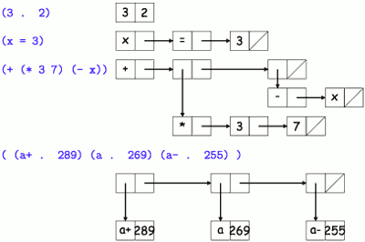
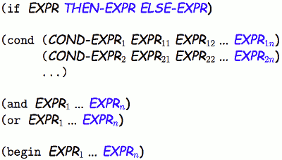

...menustart

- [CS61A sp17](#3547d9a89dde905ec32e290c69fb3c63)
- [Lecture #22: The Scheme Language](#5597bdee2f8922762420e10885a83ab2)
    - [Data Types](#637881603c973c4967d77ec4ba147e0c)
    - [Symbol notion](#ff7efcbd2c8fd9b8cba790b8fab435f9)
    - [Pairs and Lists](#cb96f9780994826abf6a3408f7583d0f)
    - [Programs](#975d1c13e7672fe6f144e3439bba958b)
    - [Quotation](#73015b3208cdee70a4497235463b63d7)
    - [Special Forms](#e6091496efcb3055adfb2de2bdc185aa)
    - [Traditional Conditionals](#da916b1bb83811aae5f1f1f82b2f3456)
    - [Symbols](#5214a8a633c296d1d9d504fc54556692)
    - [Function Evaluation](#8b17c9cbbb4c6770d9ecfb2a4942ce0b)
    - [Numbers](#cbebfa21dbe8e87e788d94a76f073807)
    - [Lists and Pair](#f0a6b9c0ea1eb163c4419272979abd5a)
        - [Built-In Procedures for Lists](#0073e9b3cffbe3e83566be73aa67e223)
    - [Binding Constructs: Let](#03936ded5131bf9088bd627617a68642)
    - [Loops and Tail Recursion](#e1a227edacf151ee8c1e87954ba4500f)
- [Lecture #27: More Scheme Programming](#d55c63328ef9a1e4b2e468b3fb6eabf7)
    - [Recursion and Iteration](#de005fb26e0da342a3bb26586fd20f60)
    - [Tail Contexts](#74dae5a65b8fd0bab9b522eb1c9c2527)
    - [Tail Contexts in Scheme](#770e07c293ee0357cd556a06bc0fc1ec)
    - [Prime Numbers](#8bb2b661f426ca5570b35c4b87fc2daf)
    - [Tail-Recursive Length?](#c8f2938a0e5021e59fd21914ce3eac47)
    - [Standard List Searches: assoc, etc.](#9996150899ad35cd585ca06bfddc23eb)
    - [Assv Solution](#52bd47777f2994f68c1c20bbca2ff51f)
    - [A classic: reduce](#6e36e4ad90a7e9796c4daa5b2b4409d8)
        - [Reduce Solution (1)](#c5f8ea94776aee3de6f29a35f216591c)
        - [Reduce Solution (2)](#07367a7ed7346ea1917889087012f66f)
    - [A Harder Case: Map](#154eda16bcdb2a849972164713956553)
        - [Making map tail recursive](#fcc0a353dd69f799df1a6e166f3d4989)
        - [And Finally, Reverse](#5a7dba29cc36ba1d802d68d560975854)
    - [Another Example](#bd13b89f1518554c9b570c210eba4081)

...menuend


<h2 id="3547d9a89dde905ec32e290c69fb3c63"></h2>


# CS61A sp17

https://inst.eecs.berkeley.edu/~cs61a/sp17/

<h2 id="5597bdee2f8922762420e10885a83ab2"></h2>


# Lecture #22: The Scheme Language

- LISP
    - Every­thing is an expression
        - 不再有语句和表达式的区别
    - Every expression is either a single value or a list
        - Single values are things like numbers and strings and hash tables。
        - The list part, however, is a big deal.
            - In a language like Python, the list is one data type within the language
            - But in Lisps, the list is more like an organizing principle for everything that happens.
                - yes, you can use the list as a data type. 
                - But a function call is also a list.
    - Functional programming.
        - functions avoid two habits common in other languages:  data mutation and relying on state.


<h2 id="637881603c973c4967d77ec4ba147e0c"></h2>


## Data Types

- **atoms**
    - The classical atoms:
        - Numbers: integer, floating-point, complex, rational.
        - Symbols.
        - Booleans: `#t`, `#f`.
        - The empty list: `()`
        - Procedures (functions).
    - Some newer-fangled, mutable atoms:
        - Vectors: Python lists.
        - Strings
        - Characters: Like Python 1-element strings
- **pairs**
    - Pairs are like **two-element** Python lists , where the elements are (recursively) Scheme values.

<h2 id="ff7efcbd2c8fd9b8cba790b8fab435f9"></h2>


## Symbol notion

- Lisp最早是被设计来处理符号数据(如公式)。这些符号通常递归的被定义( an exp = op + subexps ). 
- the notion of a symbol:
    - Essentially a constant string
    - Two symbols with the same “spelling” (string) are by default the same object (but usually, case is ignored).
- The main operation on symbols is **equality**.
    - e.g. `a bumblebee numb3rs * + / wide-ranging !?@*!!`

<h2 id="cb96f9780994826abf6a3408f7583d0f"></h2>


## Pairs and Lists

- The Scheme notation for the pair
    - (V1 . V2)
- Lists are so prevalent that there is a standard abbreviation:

Abbreviation | Means
--- | ---
(V )  | (V . ())
(V1 V2 · · · Vn) | (V1 . (V2 . (· · · (Vn . ()))))
(V1 V2 · · · Vn−1 . Vn) | (V1 . (V2 . (· · · (Vn−1 . Vn))))

- one can build practically any data structure out of pair
    - In Scheme, the main one is the (linked) list
    - 

<h2 id="975d1c13e7672fe6f144e3439bba958b"></h2>


## Programs

- Scheme expressions and programs are **instances of Lisp data structures**  (“Scheme programs are Scheme data”).
- At the bottom, numerals, booleans, characters, and strings are expressions that stand for themselves.
- Most lists (aka forms) stand for function calls:
    - `(OP E1 · · · En)`

<h2 id="73015b3208cdee70a4497235463b63d7"></h2>


## Quotation

- Since programs are data, we have a problem:
    - How do we say, eg., “Set the variable x to the three-element list (+ 1 2)” 
    - without it meaning “Set the variable x to the value 3?”
- In English, we call this a **use vs. mention distinction**
- For this, we need a special form -- a construct that does **not** simply evaluate its operands.
- `(quote E)` yields E itself as the value, without evaluating it as a Scheme expression:
    - `(quote (+ 1 2))` =>  `(+ 1 2) `
- 简化版本 `'(xxx)'`

<h2 id="e6091496efcb3055adfb2de2bdc185aa"></h2>


## Special Forms
 
- `(quote E)` is a sample of **special form** : an exception to the general rule for evaluting functional forms
- A few other special forms also have meanings that generally do not involve simply evaluating their operands:
    - `(if (> x y) x y) ; like python A if X else B`
    - `(and (integer?) (> x y) (< x z)) ; like python and `  
    - `(or (not (integer? x)) (< x L) (> x U)) ; Like Python ’or’`
    - `(lambda (x y) (/ (* x x) y)) ; Like Python lambda , yields function`
    - `(define pi 3.14159265359) ; Definition`
    - `(define (f x) (* x x)) ; Function Definition`
    - `(set! x 3) ; Assignment ("set bang")`

<h2 id="da916b1bb83811aae5f1f1f82b2f3456"></h2>


## Traditional Conditionals

- the fancy traditional Lisp conditional form: `cond`
    - cond: chains a series of tests to select a result
        - suport `else` , but a cond-clause that starts with else must be the last cond-clause.

```scheme
scm> (define x 5)
scm> (cond ((< x 1) ’small)
        ((< x 3) ’medium)
        ((< x 5) ’large)
        (#t ’big))
big
```

- which is the Lisp version of Python’s 

```python
"small" if x < 1 else "medium" if x < 3 else "large" if x < 5 else "big"
```

<h2 id="5214a8a633c296d1d9d504fc54556692"></h2>


## Symbols

- When evaluated as a program, a symbol acts like a variable name.
- Variables are bound in environments, just as in Python, although the syntax differs.
- To define a new symbol, either use it as a parameter name (later), or use the “define” special form:
    - This (re)defines the symbols in the current environment.

```python
(define pi 3.1415926)
(define pi**2 (* pi pi))
```

- To assign a new value to an existing binding, use the **set!** special form:
    - `(set! pi 3)`
    - pi must be defined (not like Python).

<h2 id="8b17c9cbbb4c6770d9ecfb2a4942ce0b"></h2>


## Function Evaluation

- Function evaluation is just like Python
- To create a new function, we use the **lambda** special form:

```scheme
scm> ( (lambda (x y) (+ (* x x) (* y y))) 3 4)
25
scm> (define fib
        (lambda (n) (if (< n 2) n (+ (fib (- n 2)) (fib (- n 1))))))
scm> (fib 5)
5
```

- 把一个lambda 赋给一个 symbol 太常见了，这么写略繁琐

```scheme
scm> (define (fib n)
    (if (< n 2) n (+ (fib (- n 2)) (fib (- n 1)))))
```

<h2 id="cbebfa21dbe8e87e788d94a76f073807"></h2>


## Numbers

```scheme
scm> (/ 5 2)
2.5
scm> (quotient 5 2) 
2
scm> (< 2 4 8)  ; chain compare like python
#t
(integer? 5)
#t
```

<h2 id="f0a6b9c0ea1eb163c4419272979abd5a"></h2>


## Lists and Pair

- Pairs (and therefore lists) have a basic constructor and accessors
    - cons : constructor
    - car : **C**ontents of the **A**ddress part of **R**egister number
    - cdr : **C**ontents of the **D**ecrement part of **R**egister number,
    - cpr : Contents of the Prefix part of Register number
    - ctr : Contents of the Tag part of Register number
    - cadr :
    - cadar : ... 
- between the first letter ('c') and the last ('r'),
    - a 'a' means "the car of" and a 'd' means "the cdr of".
    - so
        - cadr is "the car of the cdr",
        - cddr is the cdr of the cdr,
        - cadar is the "car of the cdr of the car" (thus the parameter has to be a list of list),


```scheme
scm> (cons 1 2)
(1 . 2)
scm> (cons 'a (cons 'b '()))
(a b)
scm> (define L (a b c)) ; define won'e evaluate oprands
scm> (car L)
a
scm> (cdr L)
(b c)
(cadr L) ; (car (cdr L))
b
scm> (cdddr L) ; (cdr (cdr (cdr L)))
()
```

- And one that is especially for lists:

```scheme
scm> (list (+ 1 2) 'a 4)
(3 a 4)
```

- we can use the quote form to construct a malformed list

```scheme
scm> '(1 2 3)
(1 2 3)
scm> '(1 . (2 . (3)))
(1 2 3)
scm> '(1 . (2 . 3))
(1 2 . 3)  ; malformed !
```

<h2 id="0073e9b3cffbe3e83566be73aa67e223"></h2>


### Built-In Procedures for Lists

```scheme
scm> (null? nil)
True

scm> (append '(1 2 3) '(4 5 6))
(1 2 3 4 5 6)

scm> (cons '(1 2 3) '(4 5 6))
((1 2 3) 4 5 6)

scm> (list '(1 2 3) '(4 5 6))
((1 2 3) (4 5 6))

scm> (length '(1 2 3 4 5))
5
```

<h2 id="03936ded5131bf9088bd627617a68642"></h2>


## Binding Constructs: Let

- Sometimes, you’d like to introduce local variables or named constants
- The let special form does this:

```scheme
scm> (define x 17)
scm> (let ((x 5)
        (y (+ x 2)))
        (+ x y))
24
```

- This is a derived form, equivalent to:
    - 想象 let 是在给你定义参数

```scheme
scm> ((lambda (x y) (+ x y)) 5 (+ x 2))
```

- TODO, 为什么 最后加法x 的值是17 ？

<h2 id="e1a227edacf151ee8c1e87954ba4500f"></h2>


## Loops and Tail Recursion

- In Scheme, **tail-recursive functions must work like iterations**

```scheme
(define (sum init L)
       (if (null? L) init
           (sum (+ init (car L)) (cdr L))))
```

---

<h2 id="d55c63328ef9a1e4b2e468b3fb6eabf7"></h2>


# Lecture #27: More Scheme Programming

<h2 id="de005fb26e0da342a3bb26586fd20f60"></h2>


## Recursion and Iteration

- **tail recursions** . From the reference manual:
    - Implementations of Scheme must be **properly tail-recursive**.
    - Procedure calls that occur in certain syntactic contexts called **tail contexts** are tail calls.
    - Scheme implementation is properly tail-recursive if it supports an **unbounded number of [simultaneously] active tail calls**
- First, let’s define what that means

<h2 id="74dae5a65b8fd0bab9b522eb1c9c2527"></h2>


## Tail Contexts

- Basically, an expression is in a **tail context** , if 
    - it is evaluated last in a function body  (函数中最后一个求值
    - and provides the value of a call to that function. (并为该函数提供了一个返回值))
- A function is **tail-recursive** if
    - all function calls , in its body , that can result in a recursive call on that same function , **are in tail contexts**.
- In effect, Scheme turns recursive calls of such functions into iterations   instead of simply returning
    - by **replacing** those calls with one of the function’s tail-context expressions
- This decreases the memory , devoted to keeping track of which functions are running and who called them , to a constant. 

<h2 id="770e07c293ee0357cd556a06bc0fc1ec"></h2>


## Tail Contexts in Scheme

- The “bases” are
    - (lambda (ARGUMENTS) EXPR1 EXPR2 ... **EXPRn**)
    - (define (NAME ARGMENTS) EXPR1 EXPR2 ... **EXPRn**)
- If an expression is in a tail context, then certain parts of it become tail contexts all by themselves
    - 

<h2 id="8bb2b661f426ca5570b35c4b87fc2daf"></h2>


## Prime Numbers

```scheme
(define (prime? x)
    "True iff X is prime."
)
```

```scheme
(define (prime? x)
    "True iff X is prime."
    (cond ((< x 2) #f)
        ((= x 2) #t)
        (#t ?))  ; ? is undefined
)
```

```scheme
(define (prime? x)
    "True iff X is prime."

    (define (no-factor? k lim)
        "LIM has no divisors >= K and < LIM."
        )

    (cond ((< x 2) #f)
        ((= x 2) #t)
        (#t (no-factor? 2
            (floor (+ (sqrt x) 2)))))
)
```

```scheme
(define (prime? x)
    "True iff X is prime."

    (define (no-factor? k lim)
        "LIM has no divisors >= K and < LIM."
        (cond ((>= k lim) #t)
            ((= (remainder x k) 0) #f)
            (#t ?)))

    (cond ((< x 2) #f)
        ((= x 2) #t)
        (#t (no-factor? 2
            (floor (+ (sqrt x) 2)))))
)
```

```scheme
(define (prime? x)
    "True iff X is prime."

    (define (no-factor? k lim)
        "LIM has no divisors >= K and < LIM."
        (cond ((>= k lim) #t)
            ((= (remainder x k) 0) #f)
            (#t (no-factor? (+ k 1) lim))))

    (cond ((< x 2) #f)
        ((= x 2) #t)
        (#t (no-factor? 2
            (floor (+ (sqrt x) 2)))))
)
```

<h2 id="c8f2938a0e5021e59fd21914ce3eac47"></h2>


## Tail-Recursive Length?

- On several occasions, we’ve computed the length of a linked list like this:

```scheme
;; The length of list L
(define (length L)
    (if (eqv? L '()) ; Alternative: (null? L)
        0
        (+ 1 (length (cdr L)))))
```

- but this is not tail recursive. How do we make it so?

- **Try a helper method:** 

```scheme
;; The length of list L
(define (length L)
     (define (length+ n R)
          "The length of R plus N."
          (if (null? R) n
               (length+ (+ n 1) (cdr R))))
     (length+ 0 L))
```

<h2 id="9996150899ad35cd585ca06bfddc23eb"></h2>


## Standard List Searches: assoc, etc.
 
- The functions `assq`, `assv`, and `assoc` classically serve the purpose of Python dictionaries
- An **association list** is a list of key/value pairs. The pyhton dictionary `{1:5, 3:6, 0:2}` might be represented
    - `( (1 . 5) (3 . 6) (0 . 2) )`
- The `assx` functions access this list, returning the pair whose **car** matches a key argument.
- The difference between the methods is that
    - `assq` compares using `eq?` (Python `is`).
    - `assv` uses `eqv?` (which is like Python `==` on numbers and like `is` otherwise).
    - `assoc` uses `equal?` (does “deep” comparison of lists).

<h2 id="52bd47777f2994f68c1c20bbca2ff51f"></h2>


## Assv Solution

```scheme
;; The first item in L whose car is eqv? to key, or #f if none.
(define (assv key L)
    (cond ((null? L) #f)
          ((eqv? key (caar L)) (car L))
          (else (assv key (cdr L))))
)
```

<h2 id="6e36e4ad90a7e9796c4daa5b2b4409d8"></h2>


## A classic: reduce

```scheme
;; Assumes f is a two-argument function and L is a list.
;; If L is (x1 x2...xn), the result of applying f n-1 times
;; to give (f (f (... (f x1 x2) x3) x4) ...).
;; If L is empty, returns f with no arguments.
;; [Simply Scheme version.]
;; >>> (reduce + ’(1 2 3 4)) ===> 10
;; >>> (reduce + ’()) ===> 0
```

```scheme
(define (reduce f L)
)
```

<h2 id="c5f8ea94776aee3de6f29a35f216591c"></h2>


### Reduce Solution (1)

```scheme
(define (reduce f L)
    (cond ((null? L) (f)) ; Odd case with no items
          ((null? (cdr L)) (car L)) ; One item
          (else (reduce f (cons (f (car L) (cadr L)) (cddr L))))
    )
)
```

<h2 id="07367a7ed7346ea1917889087012f66f"></h2>


### Reduce Solution (2)

```scheme
(define (reduce f L)
     (define (reduce-tail accum R)
          (cond ((null? R) accum)
                (else (reduce-tail (f accum (car R)) (cdr R)))
          )
     )
     (if (null? L) (f) ;; Special case
          (reduce-tail (car L) (cdr L)))
)
```

<h2 id="154eda16bcdb2a849972164713956553"></h2>


## A Harder Case: Map

naive solution

```scheme
(define (map2 f L)
    (if (null? L) '()
        (cons (f (car L)) (map2 f (cdr L)))))
```

- NOT tail-recursive

<h2 id="fcc0a353dd69f799df1a6e166f3d4989"></h2>


### Making map tail recursive

- Need to pass along the partial results and add to them
- Problem: `cons` adds to the **front** of a list, so we end up with a *reverse* of what we want

```scheme
(define (map2 f L)
    ;; The result of prepending the reverse of (map rest) to
    ;; the list partial-result
    (define (map+ partial-result rest)
        (if (null? rest) partial-result
            (map+ (cons (f (car rest)) partial-result) (cdr rest))
            ))
    (reverse2 (map+ '() L)))
```

- What about **reverse**

<h2 id="5a7dba29cc36ba1d802d68d560975854"></h2>


### And Finally, Reverse

- Actually, we can use the very problem that `cons` creates to solve it!
- That is, consing items from a list from left to right results in a reversed list:

```scheme
(define (reverse2 L)
    (define (reverse+ partial-result rest)
        (if (null? rest) partial-result
            (reverse+ (cons (car rest) partial-result) (cdr rest)) 
            ) )
    (reverse+ '() L)
)
```

<h2 id="bd13b89f1518554c9b570c210eba4081"></h2>


## Another Example

- Consider the problem of shuffling together two lists, L1 and L2.
    - The result consists of the first item of L1, then the first of L2, then the second of L1, etc.
    - until one or the other list has no more values.

```scheme
(define (shuffle L1 L2)
    (define (shuffle+ reversed-result L1 L2)
        (if ?))
    (shuffle+ '() L1 L2))
```


```scheme
(define (shuffle L1 L2)
    (define (shuffle+ reversed-result L1 L2)
        (if (null? L1) (reverse reversed-result)
           ?))
    (shuffle+ '() L1 L2))
```

```scheme
(define (shuffle L1 L2)
    (define (shuffle+ reversed-result L1 L2)
        (if (null? L1) (reverse reversed-result)
            (shuffle+ (cons (car L1) reversed-result) L2 (cdr L1))
            ))
    (shuffle+ '() L1 L2))
```


