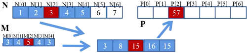
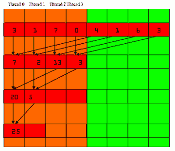
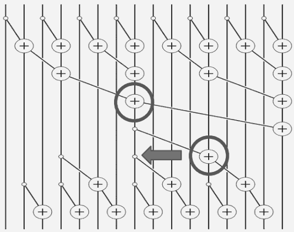

...menustart

- [并行计算key concept](#e9baed1ff669cdf45540a3cc4a489e1d)
    - [why thread block?](#7013df2804f996276490d1bd5ed46b62)
    - [Control Divergence](#e371125d3bb809b1dff55732564b5247)
    - [Tiled Parallel Algorithms：](#b48c04522007f86979cc8d0ab4bfa014)
    - [Convolution](#fa0f0ae43fdca46d1d68255409ec0b89)
    - [Reduction](#9e834f13e35e4edf64863ab414a6217a)
    - [Scan](#22efdbe132eabc102306bd7a334fb434)
    - [Histogramming](#0f39b900b08ff634a8f210cf9ea18fa2)
        - [Atomic Operations](#eaa1709ae37b41b0f052cd5eae6a14b4)
        - [Privatization technique](#64d108ae7d98c064d5d748811072d5de)
        - [DMA transfers](#98d55f70bc1bc9116f3127e60600d3ac)
        - [Task Parallelism](#002e6af863fe6857b7152c49678d364f)

...menuend

<h2 id="e9baed1ff669cdf45540a3cc4a489e1d"></h2>

# 并行计算key concept

<h2 id="7013df2804f996276490d1bd5ed46b62"></h2>

## why thread block?

 - Divide thread array into mulitple blocks. 
    - 执行同一份代码的threads 称为 thread block.
 - Threads within a block cooperate via **shared memory**(exchange data), **atomic operations** (update same variable) , and **barrier synchronization**(屏障同步 to force others to wait)
    - 线程对global memory的修改，其他线程可能无法看到 
 - Every thread has a thread index , and a thread block index. Index can be 1-3D.
 - Thread 以block的粒度被分配给 SM，每个SM能分配的thread block是有限制的。
 - 硬件设计上，每个block中的 每32-thread 作为一个**warp**, executed in SIMD.

<h2 id="e371125d3bb809b1dff55732564b5247"></h2>

## Control Divergence

 - Divergence can arise only when branch condition is a function(or condition) of **thread indices**
 - 要避免warp 中的 Divergence

<h2 id="b48c04522007f86979cc8d0ab4bfa014"></h2>

## Tiled Parallel Algorithms：

 - 把需要处理的数据 分割成 tile, 每个事件处理一个或多个 tile的计算。
 - tiled algorithm 也是为了充分利用 shared memory

<h2 id="fa0f0ae43fdca46d1d68255409ec0b89"></h2>

## Convolution

<h2 id="9e834f13e35e4edf64863ab414a6217a"></h2>

## Reduction

 - process large input data sets
    - associative: `(A*B)*C = A*(B*C)`
    - commutative: `a+b = b+a`
 

 - prevent divergence in warp

<h2 id="22efdbe132eabc102306bd7a334fb434"></h2>

## Scan

`[x₀,x₁,...,xn₋₁] => [x₀,(x₀⊕x₁),...,(x₀⊕x₁⊕...⊕xn₋₁)]`

<h2 id="0f39b900b08ff634a8f210cf9ea18fa2"></h2>

## Histogramming

 - A method for extracting notable features and patterns from large data sets
 - threads will interference when they write into their outputs
 

<h2 id="eaa1709ae37b41b0f052cd5eae6a14b4"></h2>

### Atomic Operations

<h2 id="64d108ae7d98c064d5d748811072d5de"></h2>

### Privatization technique

 - Privatization is a powerful and frequently used techniques for parallelizing applications
 - The operation needs to be associative and commutative

<h2 id="98d55f70bc1bc9116f3127e60600d3ac"></h2>

### DMA transfers

 - cudaMemcpy() is implemented as one or more DMA transfers
 - The OS could accidentally page-out the data that is being read or written by a DMA and page-in another virtual page into the same physical location
 - CPU memory that serve as the source , or destination , of a DMA transfer must be allocated as pinned memory
 
<h2 id="002e6af863fe6857b7152c49678d364f"></h2>

### Task Parallelism

 - CUDA Streams
 
