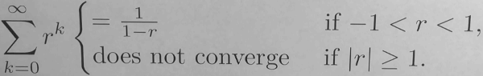

...menustart

- [Calculus 2](#cfb5ad5012e1f6f82ce9e56414cfbd86)
- [Week1 : Sequence](#62533905f258da75499c882a124b0317)
    - [What is a Sequence?](#522feab9f5dbcd13c1a017479d792f7c)
    - [What is the Limit of a Sequence ?](#b07df8cec51bd3cfbcba058e900c27e1)
        - [What is an Geometric Progression?](#8797aec0bf798842a337e6476a38df1f)
    - [What Other Properties Might a sequence Have ?](#8bc66bc54bcd58a71d77b1d929386eaf)
        - [How Do Sequences Help with the √2 ?](#136765faef7faba5481cc00c138c9b82)
        - [When is a Sequence Bounded?](#8ad7efa41f1ae075d261e52b8ab7e5d4)
        - [When is a Sequence Increasing?](#917d623ac4fa7edff8771aab97f38000)
        - [What is the Monotone Convergence Theorem?](#19362157a1374319e6e61cd62e1be839)
        - [How Can the Monotone Convergence Theorem Help?](#2df575d117dbbe347fb7082485a50ca7)
    - [How Big Can Sequence Be ?](#4cd04b7a677129602dfcabf28a3fdf67)
        - [Is There a Sequence That Includes Every Integer?](#28122fe9cdb301b433bb4545df3f2c23)
        - [Is There a Sequence That Includes Every Real Number between 0 and 1 ?](#ae1c5b5e72e7fa3e2b7599aacb6b8f1d)
- [Week2 : Series](#778c167706384d1a01268c7b5447944d)
    - [What is a Series ?  What is a Geometric Series ?](#e84d3b9b00bcc8fc5e1ccf0480017e42)
        - [What does ∑ak = L Mean ?](#79959b10f77ba428d71fbec422058280)
        - [Why does  ∑k=∞₀ (1/2)ᵏ = 2 ?](#67a81c2ddc4df11e4075c03018804f19)
        - [What is a Geometric Series?](#469e6493b0c5e2b8e190f40e8d29ec0b)
        - [What is the value of ∑k=∞m rᵏ ?](#0d5f7167ac9f8276415b82b6caf3c128)
    - [What is a Telescoping Series ?  How can I Prove That Some Series Diverge ?](#2d821f5018d90c40ac813ff4acf7212c)
        - [What is the Sum of a Telescoping Series?](#c7705221584241a23eeb71d168f89ed8)

...menuend

<h2 id="cfb5ad5012e1f6f82ce9e56414cfbd86"></h2>

# Calculus 2

<h2 id="62533905f258da75499c882a124b0317"></h2>

# Week1 : Sequence 

<h2 id="522feab9f5dbcd13c1a017479d792f7c"></h2>

## What is a Sequence?

- 1,1,2,3,5,8,...
- a₁,a₂,a₃,a₄,a₅,a₆,...
- a₆=8, a₃=2
- we use (an) represents the whole sequence

---

- "arithmetic progression"
    - a sequence with a common difference between the terms. 
    - 5,12,19,26,33,... 
        - an = a₀+dn
    - Why are these things even called arithmetic progressions? 
        - Each term Is the arithmetic mean of its neighbors. 
        - 12 == (5+19)/2 

<h2 id="b07df8cec51bd3cfbcba058e900c27e1"></h2>

## What is the Limit of a Sequence ?

<h2 id="8797aec0bf798842a337e6476a38df1f"></h2>

### What is an Geometric Progression?

- A geometric progression, is a sequence with a common ratio between the terms.
    - 3,6,12,24,...
- in a geometric progression, each term is the geometric mean of it's neighbors
- what is geometric mean ? 
    - the geometric mean of two numbers, of a and b, is defined to be the square root = √(a·b)

<h2 id="8bc66bc54bcd58a71d77b1d929386eaf"></h2>

## What Other Properties Might a sequence Have ?

<h2 id="136765faef7faba5481cc00c138c9b82"></h2>

###  How Do Sequences Help with the √2 ?

- x₁ =1
- xn+1 =  1/xn + xn/2
    - x₂ = 3/2
    - x₃ = 17/12 
    - x₅ ≈ 1.41421

<h2 id="8ad7efa41f1ae075d261e52b8ab7e5d4"></h2>

### When is a Sequence Bounded?

- an is "bounded above" means there is a real number M , so that 
    - for all n≥0, an ≤ M 
- an is "bounded below" means there is a real number M , so that 
    - for all n≥0, an ≥ M 

<h2 id="917d623ac4fa7edff8771aab97f38000"></h2>

### When is a Sequence Increasing?

- A sequence (an) is **increaseing** if whenever m > n , then am > an
- A sequence (an) is **decreaseing** if whenever m > n , then am < an
- A sequence (an) is **non-increaseing** if whenever m > n , then am ≤ an
- A sequence (an) is **non-decreaseing** if whenever m > n , then am ≥ an
- those 4 kind of sequence are  **monotone**

<h2 id="19362157a1374319e6e61cd62e1be839"></h2>

### What is the Monotone Convergence Theorem?

Here's a theorem that guarantees a sequence converges.

- If the sequence (an) is bounded and monotone, then limn→∞ an exists.

<h2 id="2df575d117dbbe347fb7082485a50ca7"></h2>

### How Can the Monotone Convergence Theorem Help?

<h2 id="4cd04b7a677129602dfcabf28a3fdf67"></h2>

## How Big Can Sequence Be ?

<h2 id="28122fe9cdb301b433bb4545df3f2c23"></h2>

### Is There a Sequence That Includes Every Integer?

Yes !

- 0,-1,1,-2,2,-3,3, ...
- cn= 
    - -(n+1)/2 , if n is odd
    - n/2 , if n is even
    - starting with index 0 

<h2 id="ae1c5b5e72e7fa3e2b7599aacb6b8f1d"></h2>

### Is There a Sequence That Includes Every Real Number between 0 and 1 ?

No!

---

<h2 id="778c167706384d1a01268c7b5447944d"></h2>

# Week2 : Series 

What is a series ?  A series is basically what you get when you add up the numbers in a sequence in order. 

<h2 id="e84d3b9b00bcc8fc5e1ccf0480017e42"></h2>

## What is a Series ?  What is a Geometric Series ?

<h2 id="79959b10f77ba428d71fbec422058280"></h2>

### What does ∑ak = L Mean ?

If limn→∞ sn = limn→∞ ∑k=ⁿ₁ ak exists and equals L , then say 

∑k=ⁿ₁ ak converges.

Otherwise, say ∑k=ⁿ₁ ak diverges.

<h2 id="67a81c2ddc4df11e4075c03018804f19"></h2>

### Why does  ∑k=∞₀ (1/2)ᵏ = 2 ?

<h2 id="469e6493b0c5e2b8e190f40e8d29ec0b"></h2>

### What is a Geometric Series?

- Geometric Series :  ∑k=∞₀ rᵏ
- let sn = ∑k=n₀ rᵏ 
- (1-r)sn = 1·(r⁰+r¹+...+rⁿ) - r·(r¹+r²+...+rⁿ+rn+1) = 1-rn+1 
- so if r≠ 1
    - sn = (1-r)sn / (1-r) = (1-rn+1 ) / (1-r)
- so limn→∞ sn = limn→∞ (1-rn+1 ) / (1-r) 
- if r>1 or r<-1 ,  limn→∞ rn+1 is infinite
    - if -1`<`r`<`1 ,  limn→∞ rn+1 = 0
- 

<h2 id="0d5f7167ac9f8276415b82b6caf3c128"></h2>

### What is the value of ∑k=∞m rᵏ ?

- C·∑k=∞₀ rᵏ  = ∑k=∞₀ C·rᵏ  
- rᵐ·∑k=∞₀ rᵏ = rᵐ/(1-r)    (|r|<1)
    - = ∑k=∞₀ rm+k

<h2 id="2d821f5018d90c40ac813ff4acf7212c"></h2>

## What is a Telescoping Series ?  How can I Prove That Some Series Diverge ?

<h2 id="c7705221584241a23eeb71d168f89ed8"></h2>

### What is the Sum of a Telescoping Series?

- ∑k=∞₁ 1/((k+1)·k)

= limn→∞ ∑k=ⁿ₁ (1/k-1/(k+1)) 

= limn→∞ ( 1-1/(n+1) ) = 1

  

 

