...menustart

- [Calculus One , Part II](#fa33d1b29e3eccffe78a5783a9d43764)
- [Week 11 Antidifferentiation](#f2b7b4d00d78e3fd5414e3486cced898)
    - [How do we handle the fact that there are many antiderivatives?](#e5f2ceb4aa78ecec5012e1f271ec48d0)
    - [How am I supposed to compute antiderivatives ?](#f3171cf7edd44fec9674414241d559a1)
        - [What is the antiderivative of a sum?](#9a774c13632f99aade9ae58467e1839b)
        - [What is an antiderivative for xⁿ ?](#2b4ad78f06a02378ecd2fb58fa1e0d88)
        - [What is the most general antiderivative of 1/x?](#9602e1d6d174f0797eea3631e85257b0)
        - [What are antiderivatives of trigonometric functions?](#ef8ce61c6eaaba0c86730eee57732a7a)
        - [What are antiderivatives of eˣ and natural log?](#f25d9687ab2a19385a54403be540b9fa)
    - [Why is this so hard ?](#884aac3316eafa26375608fe965ec95b)
        - [What is the antiderivative of f(mx+b)?](#f4ad4b23e7f189ae03e08f4479b96fad)
        - [What is an antiderivative for e^(-x²) ?](#51698d7dfac653ae45039307500ba6ed)
    - [Why would anybody want to do this ?](#eed598ddc44da35152d9cd8fa4f72500)
        - [Knowing my velocity, what is my position?](#53f3b74109dd53d0637327e1c4461353)
        - [Knowing my acceleration, what is my position?](#2d170c5dab6fbe2b16e00620d9777204)
        - [What is the antiderivative of sine squared?](#1278e0b4deef4be8e19deb27ec0db474)
        - [What is a slope field?](#4f9b1095d71cf63bce0bd635d59babae)
- [Week12 Integration](#514e1caaba7832bf708c3cbba5572912)
    - [What is summation notation ?](#5b0c78a8b489b5951d6133d512173fd2)
        - [What is the sum 1 + 2 + ... + k?](#fd783af9af00d3861d1ff94414ccb5fd)
        - [What is the sum of the first k odd numbers?](#64b7c829a64912cded7e4fb1748bf931)
        - [What is the sum of the first k perfect squares?](#bb1b3996821d028092f6f37259c6dc7d)
        - [What is the sum of the first k perfect cubes?](#9a72aabb581b21f673d346308b47b1ec)
    - [So how do we calculate area precisely ?](#4803201396fe93254689a378f4acea16)
        - [What is the definition of the integral of f(x) from x = a to b?](#a2a6a595d166557f2b5ba00e7e8f36cc)
    - [Can we compute any other integrals ?](#0b347bc298049db4ffd8970d79c31ef6)
        - [What is the integral of x^2 from x = 0 to 1?](#407504fcb5d2b2a2db97282f9349f4c6)
        - [What is the integral of x^3 from x = 1 to 2?](#6693d9715518594ce91728437de46c79)
    - [Can we understand anything conceptually about integrals ?](#267eece5a0855676c858702fe0ba61ca)
        - [What sorts of properties does the integral satisfy?](#5104183620b8440565164d50f7160ce0)
        - [When is the accumulation function increasing? Decreasing?](#adf7c6d36d552a2cdce06fa0a8c2b306)
- [Week 13 Fundamental Theorem of Calculus](#76e5d32d317a3d89cedfea3744cc9d75)
    - [What is the fundamental theorem of calculus?](#235a74dfbd48742f9c1a75862fd0c35a)
    - [How am I supposed to use this theorem ?](#15e487fe2795a4de1be5a306bf55ada9)
        - [to evaluate integrals](#53e29059931fae1bb39ae6498494625c)
        - [What is the integral of sin x dx from x = 0 to x = pi?](#44c1bf08687574267775be1feeb42efc)
        - [What is the integral of x⁴ dx from x = 0 to x = 1?](#2b221d77b3789b96e070d508881cc2fb)
    - [What else can we compute this way ?](#2354b07f92446373f273db4940266dd4)
        - [What is the area between the graphs of y = √x and y = x² ?](#c09b0bfa71c020ac859c14e57108a8b1)
    - [Bug why is the fundamental theorem true ?](#c51347a969d83291908d473077d934ca)
        - [Why does the Euler method resemble a Riemann sum?](#a4ab0b1660248f0d9e62b35341c1b1e6)
        - [In what way is summation like integration?](#2ac4f9dd2d934474613787c8f2541b2a)
        - [Physically, why is the fundamental theorem of calculus true?](#3d25e750b4fc1ef196b9f5374dfb1e5e)
        - [What is d/da integral f(x) dx from x = a to x = b?](#dd8a004feac789f359b9f1d0c411bf67)
        - [Quiz:](#db021f4670ba22ce77ef0acb0aba7ba0)
- [Week 14 : Substitution Rule](#d2c2e3f1cc8835457610b328bdcd7a82)
    - [What is the chain rule backwards ?](#fd339d56f0e61ade587ffb1a32f60377)
        - [How does the chain rule help with antidifferentiation?](#61791445b8db9f9af652e5b5faef1722)
        - [When I do u-substitution, what should u be?](#586760ec16df4dfafb1ade061114f837)
        - [How should I handle the endpoints when doing u-substitution?](#06c352fcad5ce7eb9b2691e623454640)
        - [Might I want to do u-substitution more than once?](#9bd1a0f264093d981b3c1a8170148e94)
    - [What are some tricks for doing substitutions ?](#ee830a5a4339c0b9c8e33044eb004562)
        - [What is the integral of dx / (x² + 4x + 7)?](#f817608cb35f2dc36ff3722a609c8d49)
        - [What is the integral of (x+10)(x-1)¹⁰ dx from x = 0 to x = 1?](#96c0d2032815787089715ac1c89bf6e6)
        - [What is the integral of x / (x+1)^(1/3) dx?](#ab56342063f7a7e3b701824705d1bacd)
        - [What is the integral of dx / (1 + cos x) ?](#8f940df21711cbfbefdc907d9a92ceba)
    - [What if I differentiate an accumulation function ?](#3bf470483ea31266a09b5a4fde4ed3da)
        - [What is d/dx integral sin t dt from t = 0 to t = x² ?](#e4a77f0ab697bc7b531b4444d20b1a4e)
            - [Quiz :](#285814dfce98e5f31b17fed78e7102f4)
        - [Formally, why is the fundamental theorem of calculus true?](#94f3bff1a51d9ea1dea6a80ef6c97d18)
- [Week 15: Techniques of Integration](#ec623201de625f3e9220cee3ed36bece)
    - [How do I do integration by parts](#a3efff727e311f003222e5da51002f75)
        - [What antidifferentiation rule corresponds to the product rule in reverse?](#caaef88063b48f24b4658808509d16c9)
        - [What is ∫xeˣdx ?](#02bbfedeb8eb2ccc58d29cbd11721a0b)
        - [How does parts help when antidifferentiating logx ?](#f9c1c400e6d3da0434fc23aca4c66e8b)
        - [What is an ∫eˣcosxdx ?](#914aefa422b729c23d6fafdcff73122a)
    - [How do I know when to use parts ?](#5dd205d5d25e6f560cea2d96e4bae8c2)
        - [What is an antiderivative of e^√x d?](#75332a48e4c41082ba764690eec3df2c)
    - [How do I integrate powers of sin and cos ?](#6f10e0ee98aa01caf88f44a8ddd1f9e9)
        - [What is ∫sin<sup>2n+1</sup>x·cos²ⁿxdx ?](#1594c9119beb52d6951d2a239ad13553)
        - [What is ∫<sup>π</sup>₀ sin²ⁿxdx ?](#daeff048471d45e5b694c61ba1538360)
        - [What is ∫sinⁿxdx in terms of ∫sinⁿ⁻²xdx ?](#e6c1871b792c82c40999a7da6c07c873)
- [Week 16: Applications of Integration](#879c0c1f206e5d620e7ce0bfd2a2e0b2)
    - [What can we do with integrals besides calculating area?  Volumns !](#155fe6d0ba46bf21608d4267f5431cbf)
    - [How else can I calculate area ?](#790fe246d1dd6f4d2162fc4fe4f28e61)
        - [What happens when I use thin horizontal rectangles to compute area?](#ebb665e75800b60c1affdaa77fc9e5c3)
        - [When should I use horizontal as opposed to vertical pieces?](#1eff9e402e1402bf1d1c8984c1387c61)
        - [Quiz](#ab458f4b361834dd802e4f40d31b5ebc)
    - [How I can calculate volumn ?](#6d7ddc94e89335ca03c91ea5976a39a9)
        - [What does "volume" even mean?](#50d38fafec7026a597e2116789e124d4)
        - [What is the volume of a sphere?](#2c5d1b5cc187a6c7ab03086f49434c4c)
        - [How do washers help to compute the volume of a solid of revolution?](#32c7f2421ed02a30ee7e2e4c7b45d331)
        - [What is the volume of a thin shell?](#7660cc24ddc825e2c685482bdfda7354)
        - [What is the volume of a sphere with a hole drilled in it?](#ff243addc34fe33a3b0d1d8fd1387cd8)
    - [How can I calculate length ?](#9ee7a107678b439893e2559c05a14dcc)
        - [What does "length" even mean?](#de5e7676d649c7468e2bb575b9ab93af)
        - [On the graph of y² = x³, what is the length of a certain arc?](#37a18465856958ba97dc6aeaaa06389e)

...menuend


<h2 id="fa33d1b29e3eccffe78a5783a9d43764"></h2>


# Calculus One , Part II 

<h2 id="f2b7b4d00d78e3fd5414e3486cced898"></h2>


# Week 11 Antidifferentiation

You can really think of anti-differentiation as a sort of bridge between the, the differentiation section of this course, and the integration section of this course.


<h2 id="e5f2ceb4aa78ecec5012e1f271ec48d0"></h2>


## How do we handle the fact that there are many antiderivatives?

- f(x) = 2x
    - F(x) = x²
    - G(x) = x²+ 17
    - H(x) = x²+ C

<h2 id="f3171cf7edd44fec9674414241d559a1"></h2>


## How am I supposed to compute antiderivatives ?

<h2 id="9a774c13632f99aade9ae58467e1839b"></h2>


### What is the antiderivative of a sum?

- F is an antiderivative of f 
    - `∫f(x)dx = F(x)+C`
 
---

- if ∫f(x)dx = F(x)+C ,  ∫g(x)dx = G(x)+C
- then ∫(f(x)+g(x))dx = F(x) + G(x) + C  , 
- or ∫(f(x)+g(x))dx = ∫f(x)dx + ∫g(x)dx. 
- The antiderivative of the sum is the sum of the antiderivative . 

<h2 id="2b4ad78f06a02378ecd2fb58fa1e0d88"></h2>


### What is an antiderivative for xⁿ ?

- ∫xⁿdx = xⁿ⁺¹/(n+1) + C

--- 

```
f(x) = 15x² -4x +3 
∫(15x² -4x +3)dx 
= ∫15x²dx - ∫4xdx + ∫3dx 
= 15∫x²dx - 4∫xdx + ∫3dx
= 15·x³/3 - 4·x²/2 + 3x + C
= 5x³ - 2x² + 3x + C
```

- Constant multiple rule:
    - ∫a·f(x)dx = a·∫f(x)dx

<h2 id="9602e1d6d174f0797eea3631e85257b0"></h2>


### What is the most general antiderivative of 1/x?

- The most genral antiderivative of 1/x has the form 

```
      ⎧ logx + C , if x>0
F(x)= ⎨ 
      ⎩ log(-x) + D , if x<0>
```

- for constant C and D.

---

- Suppose f is a function with **an** antiderivative F ,
- Then any another antiderivative for f has the form 
    - F(x) + C(x)
- for some **"locally constant"** function C
    - C不仅仅是一个常数，C是一个局部常值函数
    - 关键在于，这个C可以在不同的区间值不通

---

- 很不幸， Some textbooks write 
    - ∫1/xdx = log|x| + C 
- is fine **provided C is a locally constant function of x**.


<h2 id="ef8ce61c6eaaba0c86730eee57732a7a"></h2>


### What are antiderivatives of trigonometric functions?

- ∫cosxdx = sinx + C
- ∫sinxdx = -cosx + C
- ∫tanxdx = log(secx) + C
- ∫secxdx = log|secx + tanx| + C 

- anti-differentiation is HARD.


<h2 id="f25d9687ab2a19385a54403be540b9fa"></h2>


### What are antiderivatives of eˣ and natural log?

- ∫eˣdx = eˣ + C
- ∫log(x)dx = x·log(x) - x + C


<h2 id="884aac3316eafa26375608fe965ec95b"></h2>


## Why is this so hard ?

<h2 id="f4ad4b23e7f189ae03e08f4479b96fad"></h2>


### What is the antiderivative of f(mx+b)?

- if we have ∫f(x)dx = F(x) + C 
- ∫f(mx+b)dx = F(mx+b)/m + C 
- eg.
    - ∫sin(2x+1)dx = -cos(2x+1)/2 + C  
    - ∫sec²xdx = sin(x)/cos(x)+C , ∫sec²(-5x+7)dx = sin(-5x+7)/cos(-5x+7)/-5 + C = sin(5x-7)/cos(5x-7)/5 +C
     
<h2 id="51698d7dfac653ae45039307500ba6ed"></h2>


### What is an antiderivative for e^(-x²) ?

- ∫e<sup>-x²</sup>dx **can not be expressed using elementary functions**.
    - elementary function means  polynomials, trig functions, eˣ, log, etc...
- **many functions are impossible to antidifferentiate**.


<h2 id="eed598ddc44da35152d9cd8fa4f72500"></h2>


## Why would anybody want to do this ?

<h2 id="53f3b74109dd53d0637327e1c4461353"></h2>


### Knowing my velocity, what is my position?

- p(t) = position
- v(t) = velocity
- p'(t) = v(t)
- p(t) = ∫v(t)dt
- eg.
    - v(t) = 3-10t
    - p(t) = ∫(3-10t)dt = 3x - 5t² +C 
    - and now , the +C has a prefectly reasonable physical interpretation. If I know my velocity, I know my position as long as I know my initial position. 
        - p(0) = 4
        - p(t) = 3x - 5t² + 4

<h2 id="2d170c5dab6fbe2b16e00620d9777204"></h2>


### Knowing my acceleration, what is my position?

- a(t) = 8
- v(t) = ∫a(t)dt = ∫8dt = 8t + C
    - knowning my acceleration doesn't detemine my velociy, it only detemines my velocity up to some constant. 
    - it could be going really fast or really slow , but still accelerating at the same rate. 
    - C is v(0)
- p(t) = ∫v(t)dt = ∫(8t + C)dt = ∫8tdt + ∫Cdt = 4t² + Ct + D.  
    - where C is v(0) , D is p(0)


<h2 id="1278e0b4deef4be8e19deb27ec0db474"></h2>


### What is the antiderivative of sine squared?

```
  ∫sin²xdx = ∫(1-cos(2x))/2dx
= 1/2∫(1-cos(2x))dx
= 1/2( ∫1dx - ∫cos(2x)dx )
= 1/2( x - sin(2x)/2 ) + C
= x/2 - sin(2x)/4 + C 
``` 

<h2 id="4f9b1095d71cf63bce0bd635d59babae"></h2>


### What is a slope field?

There's a visual way to gain some insight into these anti-differentiation problems. 


- slop field of function x² - x
    - 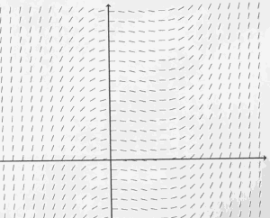
- instead of plotting a value at some height, I draw little tiny line segments with that slope.
 
--- 

- slop field of function xcosx
    - 
- 利用slop field， 可以大致画出 原函数的图像
    - 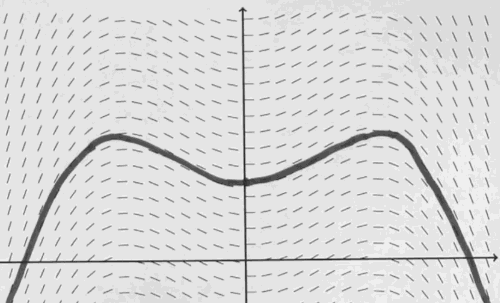
    - graph for y = xsinx + cosx 
    - +C can move graph up and down.

<h2 id="514e1caaba7832bf708c3cbba5572912"></h2>


# Week12 Integration

<h2 id="5b0c78a8b489b5951d6133d512173fd2"></h2>


## What is summation notation ?

<h2 id="fd783af9af00d3861d1ff94414ccb5fd"></h2>


### What is the sum 1 + 2 + ... + k? 

∑<sub>n=</sub>ᵏ₁ n = ?

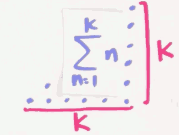

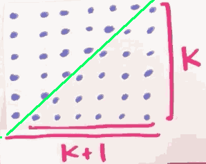


∑<sub>n=</sub>ᵏ₁ n = (k+1)·k/2

<h2 id="64b7c829a64912cded7e4fb1748bf931"></h2>


### What is the sum of the first k odd numbers?

  ∑<sub>n=</sub>ᵏ₁ (2n-1) 
  
= ∑<sub>n=</sub>ᵏ₁ 2n - ∑<sub>n=</sub>ᵏ₁ 1 

= 2·∑<sub>n=</sub>ᵏ₁ n - ∑<sub>n=</sub>ᵏ₁ 1 

= (k+1)·k - k 

= k² 


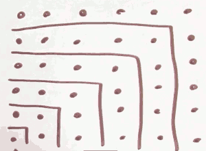

<h2 id="bb1b3996821d028092f6f37259c6dc7d"></h2>


### What is the sum of the first k perfect squares?

  ∑<sub>n=</sub>ᵏ₁ n² = 1² + 2² + ... + k² 

= k·(k+1)·(2k+1) /6


大图正好是 4个小图的 3倍。 4个小图平铺，等于大图中间部分。

- the length of buttom of big picture is `2k+1`
- the height of big picture is ∑<sub>n=</sub>ᵏ₁ n = `(k+1)·k/2`
- so the sum of small pictures is `(2k+1)·(k+1)·k/6`

<h2 id="9a72aabb581b21f673d346308b47b1ec"></h2>


### What is the sum of the first k perfect cubes?

  ∑<sub>n=</sub>ᵏ₁ n³ 

= ( ∑<sub>n=</sub>ᵏ₁ n )² 

= (k·(k+1)/2)²

= k²·(k+1)² /4

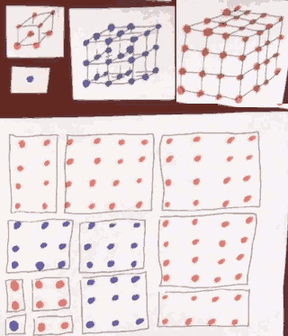


<h2 id="4803201396fe93254689a378f4acea16"></h2>


## So how do we calculate area precisely ?

<h2 id="a2a6a595d166557f2b5ba00e7e8f36cc"></h2>


### What is the definition of the integral of f(x) from x = a to b?

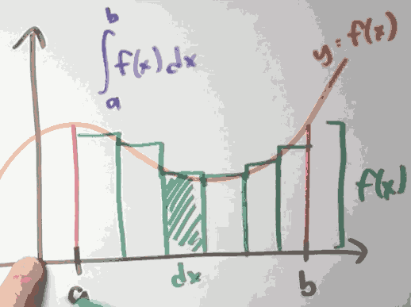

- Thm: If *f* is continuous, then *f* is integrable 
    - means ∫<sub>a,b</sub>f(x)dx  exist.
 
<h2 id="0b347bc298049db4ffd8970d79c31ef6"></h2>


## Can we compute any other integrals ?

<h2 id="407504fcb5d2b2a2db97282f9349f4c6"></h2>


### What is the integral of x^2 from x = 0 to 1?

- What is the ∫<sub>0,1</sub>x²dx ?
- We divide [0,1] into n pieces,  so each interval is 1/n

  ∫<sub>0,1</sub>x²dx 

= lim<sub>n→∞</sub> ∑<sub>i=</sub>ⁿ₁ (i/n)²·(1/n)

= lim<sub>n→∞</sub> ∑<sub>i=</sub>ⁿ₁ 1/n³·i²

= lim<sub>n→∞</sub> 1/n³·∑<sub>i=</sub>ⁿ₁ i²

= lim<sub>n→∞</sub> ( 1/n³· (n)(n+1)(2n+1)/6  )

= lim<sub>n→∞</sub> (1/n³·(2n³+3n²+n)/6)

求这个极限很简单

= 1/3

<h2 id="6693d9715518594ce91728437de46c79"></h2>


### What is the integral of x^3 from x = 1 to 2?

  ∫<sub>0,2</sub>x³dx 
  
= lim<sub>n→∞</sub> ∑<sub>i=</sub>ⁿ₁ (2/n·i)³·2/n

= lim<sub>n→∞</sub> ∑<sub>i=</sub>ⁿ₁ 16/n⁴·i³

= lim<sub>n→∞</sub> 16/n⁴· ∑<sub>i=</sub>ⁿ i³

= lim<sub>n→∞</sub> 16/n⁴· (∑<sub>i=</sub>ⁿ i)²

= lim<sub>n→∞</sub> 16/n⁴·((n)(n+1)/2)²

= lim<sub>n→∞</sub> 4·n²·(n+1)²/n⁴

= 4

repeat this same kind of calculation to deduce that: 

∫<sub>0,1</sub>x³dx  = 1/4

now we get the final answer:

∫<sub>1,2</sub>x³dx  = ∫<sub>0,2</sub>x³dx - ∫<sub>0,1</sub>x³dx = 15/4


<h2 id="267eece5a0855676c858702fe0ba61ca"></h2>


## Can we understand anything conceptually about integrals ?

<h2 id="5104183620b8440565164d50f7160ce0"></h2>


### What sorts of properties does the integral satisfy?

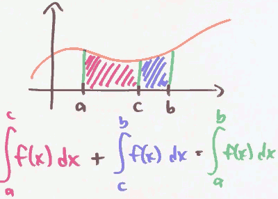

∑<sub>n=</sub>ᵐ₁ f(n) + ∑<sub>n=</sub>ᵏ<sub>m+1</sub> f(n) = ∑<sub>n=</sub>ᵏ₁ f(n)


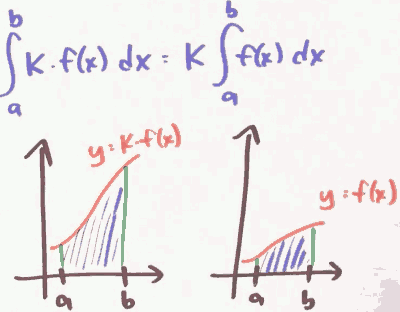

∑<sub>n=</sub>ᵇₐ k·f(n)  = k·∑<sub>n=</sub>ᵇₐf(n)


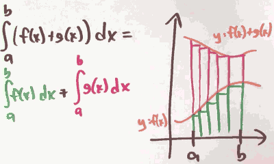

∑<sub>n=</sub>ᵇₐ (f(n)+g(n)) = ∑<sub>n=</sub>ᵇₐ f(n) + ∑<sub>n=</sub>ᵇₐ g(n)

**The derivatives have the same rules about sum !**

<h2 id="adf7c6d36d552a2cdce06fa0a8c2b306"></h2>


### When is the accumulation function increasing? Decreasing?

When is A(x) = ∫ˣₐf(t)dt increasing ? Decreasing ?

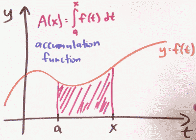

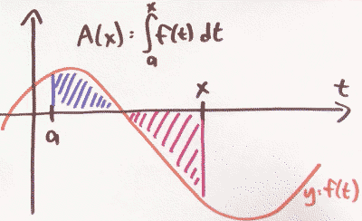

The integrals are not exactly measuring area, they're measuring **singed area**. 

- f positive
    - A(x) increasing
    - A'(x) > 0
- f negative 
    - A(x) decreasing
    - A'(x) < 0

---

- 利用函数的对称性，我们可以简化 积分计算
- ∫¹₋₁ sinxdx = 0
- ∫<sup>2π</sup>₀ cosxdx = 0 


<h2 id="76e5d32d317a3d89cedfea3744cc9d75"></h2>


# Week 13 Fundamental Theorem of Calculus

<h2 id="235a74dfbd48742f9c1a75862fd0c35a"></h2>


## What is the fundamental theorem of calculus?

- Suppose f:[a,b] → ℝ is continuous. let F be the accumulation function , given by 
    - F(x) = ∫ˣₐ f(t)dt.
- Then F is continuous on [a,b] , differntiable on (a,b) , and F'(x) = f(x) 

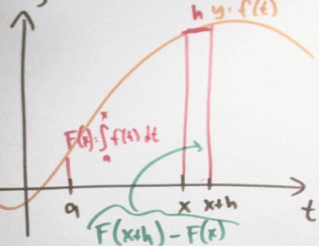

--- 


- So ∫ˣₐ f(t)dt is an **antiderivative !**

Suppose that ∫³₀ f(x)dx = 9 , and f(3) = 10 , Approximate ∫<sup>3.3</sup>₀ f(x)dx 

  ∫<sup>3.3</sup>₀ f(x)dx 

= ∫<sup>3</sup>₀ f(x)dx + ∫<sup>3.3</sup>₃ f(x)dx 

= 9 + 10\*0.3 = 12 

 
<h2 id="15e487fe2795a4de1be5a306bf55ada9"></h2>


## How am I supposed to use this theorem ?

<h2 id="53e29059931fae1bb39ae6498494625c"></h2>


### to evaluate integrals

- we don't case ∫ˣₐ , we really want to calculate ∫ᵇₐ
- F(b) = ∫ᵇₐ f(t)dt
    - F(a) = ∫ªₐ f(t)dt = 0 

---

- Suppose f:[a,b] → ℝ is continuous , and F is an antiderivative of f.
- Then ∫ᵇₐ f(x)dx = F(b) - F(a)

 
<h2 id="44c1bf08687574267775be1feeb42efc"></h2>


### What is the integral of sin x dx from x = 0 to x = pi?

- ∫<sup>π</sup>₀ sinxdx = ?
- -cos(π) - (-cos(0))  = 1 - (-1) = 2

<h2 id="2b221d77b3789b96e070d508881cc2fb"></h2>


### What is the integral of x⁴ dx from x = 0 to x = 1?

- ∫¹₀ x⁴dx = (1)⁵/5 - (0)⁵/5 = 0.2

 
<h2 id="2354b07f92446373f273db4940266dd4"></h2>


## What else can we compute this way ?

<h2 id="c09b0bfa71c020ac859c14e57108a8b1"></h2>


### What is the area between the graphs of y = √x and y = x² ?

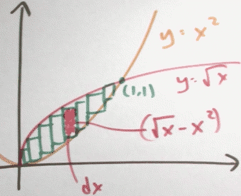

- ∫¹₀ (√x -x²)dx = [ x<sup>3/2</sup>/(3/2) - x³/3  ]¹₀ = 1/3


<h2 id="c51347a969d83291908d473077d934ca"></h2>


## Bug why is the fundamental theorem true ?

<h2 id="a4ab0b1660248f0d9e62b35341c1b1e6"></h2>


### Why does the Euler method resemble a Riemann sum?

- F(h) = F(0) + h·F'(0) = F(0) + h·f(0)
- F(2h) = F(h) + h·F'(h) = F(h) + h·f(h) = h·f(0) + h·f(h)
- F(3h) = F(2h) + h·F'(2h) = F(2h) + h·f(2h) = h·f(0) + h·f(h) + h·f(2h) 
- ...
- F(10) = h·f(0) + h·f(h) + h·f(2h) + ... +  h·f(9h)
- It's Riemann sum!


<h2 id="2ac4f9dd2d934474613787c8f2541b2a"></h2>


### In what way is summation like integration?

Integrating | differentiating 
--- | --- 
summing | *differencing* 

- 1,2,3,4,5,... -- sum -->  0,1,3,6,10,15,... 
- 0,1,3,6,10,15,...  -- calc difference --> 1,2,3,4,5,...
- So **differences** between *sum of first k numbers* and *sum of first k-1 numbers*, gives back the original list !
- d/dx ∫ˣₐ f(t)dt = f(x)


<h2 id="3d25e750b4fc1ef196b9f5374dfb1e5e"></h2>


### Physically, why is the fundamental theorem of calculus true?

- v(t) = my velocity at time t
- ∫ᵇ₀ v(t)dt = distance I traveled t=0 to t=b

---

- Summarizing , the accumulation function of velocity , is displacement
- The derivative of displacement is velocity. 

<h2 id="dd8a004feac789f359b9f1d0c411bf67"></h2>


### What is d/da integral f(x) dx from x = a to x = b?

- we know d/db ∫ᵇₐ f(t)dt = f(b)
- what happens d/da ∫ᵇₐ f(t)dt  ?
    - -f(a)

---

- The conventon:
    - ∫ᵇₐ f(x)dx  = - ∫ª<sub>b</sub> f(x)dx
 

<h2 id="db021f4670ba22ce77ef0acb0aba7ba0"></h2>


### Quiz:

- ∫<sup>6.02</sup>₆ f(x)dx = 0.1 , Approximate f(6) as well as you can given this information 
    - ∫<sup>6.02</sup>₆ f(x)dx = f(6) \* 0.02 = 0.1 
    - f(6) = 5

---

<h2 id="d2c2e3f1cc8835457610b328bdcd7a82"></h2>


# Week 14 : Substitution Rule

When we first learned about definite integrals, we learned about them as limits of Riemann sum. And in a few cases that definition was good enough. But usually that was much too hard. 

So we learned about the fundamental theorem of calculus that reduced evaluating definite integrals down to find anti derivatives. 

Now it turns out that finding anti-derivatives is also really hard to do. So we need some better techniques or just heuristics for how to find those anti-derivatives. And a big one is called U-substitution , or maybe the substitution rule.  It just running the Chain Rule in reverse. 


<h2 id="fd339d56f0e61ade587ffb1a32f60377"></h2>


## What is the chain rule backwards ?

<h2 id="61791445b8db9f9af652e5b5faef1722"></h2>


### How does the chain rule help with antidifferentiation?

∫xsin(x²)dx 

u = x² , du = 2xdx

I know you might feel kind of bad, because I don't really see a *2xdx*, I only see *xdx*. But his sort of methods going to guide use to do the right thing.

  ∫xsin(x²)dx  = 1/2·∫2xsin(x²)dx  = 1/2·∫sin(u)du 

= -1/2·cos(u) + C = -1/2·cos(x²) + C 

- **Every differentiation rule has a corresponding anti-differentiation rule**.
  
  ∫f'(g(x))·g'(x)dx , let u=g(x) du=g'(x)dx

= ∫f'(u)du  = f(u)+C  = f(g(x))+C 


<h2 id="586760ec16df4dfafb1ade061114f837"></h2>


### When I do u-substitution, what should u be?

- How to pick *u* ?
    - look for things you can grab as *du*
    - that is , try to find pieces of the integrand that look like the derivative of something.

- ∫x/(√(4-9x²))dx 
    - u = 4-9x²
- ∫1/(√(4-9x²))dx 
    - u = 3/2·x


<h2 id="06c352fcad5ce7eb9b2691e623454640"></h2>


### How should I handle the endpoints when doing u-substitution?

u-substitution is  a way to find  anti-derivatives. But anti-differentiation is just a means  to an end. The real goal, at this point in the  course, is evaluating definite integrals.

  ∫<sub>x=</sub>²₀ 2x(x²+1)dx

  u = x²+1  , du = 2xdx 

= ∫<sub>x=</sub>²₀ u³du = u⁴/4 ］<sub>x=</sub>²₀

= (x²+1)⁴/4 ］<sub>x=</sub>²₀

= (2²+1)⁴/4 - (0²+1)⁴/4 = 624/4 = 156

We did it. But I could've finished this problem off in a slightly diferent but equvalent way. 

  ∫<sub>x=</sub>²₀ u³du

= ∫<sub>u=</sub>⁵₁ u³du 

= u⁴/4  ］<sub>u=</sub>⁵₁

= 156.

- Method 1 : answer with *x*
    - ∫<sub>x=</sub>ᵇₐ f'(g(x))g'(x)dx = f(g(x)) ］<sub>x=</sub>ᵇₐ
- Method 2 : endpoints with *u*
    - ∫<sub>x=</sub>ᵇₐ f'(g(x))g'(x)dx  = ∫<sub>u=</sub><sup>g(b)</sup><sub>g(a)</sub> f'(u)du =  f(u)  ］<sub>u=</sub><sup>g(b)</sup><sub>g(a)</sub> 

<h2 id="9bd1a0f264093d981b3c1a8170148e94"></h2>


### Might I want to do u-substitution more than once?

- Sometimes you might want to do u substitution more than once. 

  ∫-2cosx sinx cos(cos²x+1)dx
 
  u= cosx ,  du = -sinxdx

= ∫2u cos(u²+1) du   

  v = u²+1  , dv = 2udu

= ∫cosvdv  = sinv + C 

= sin( u²+1  ) + C 

= sin( cos²x +1  ) + C 


---

<h2 id="ee830a5a4339c0b9c8e33044eb004562"></h2>


## What are some tricks for doing substitutions ?


<h2 id="f817608cb35f2dc36ff3722a609c8d49"></h2>


### What is the integral of dx / (x² + 4x + 7)?

We know ∫1/(1+x²)dx = atan(x) + C

The trick is completing the square. 

  x² + 4x + 7 

= (x+2)² + 3 

So :

  ∫1/(x² + 4x + 7)dx

= ∫1/((x+2)² + 3 )dx

= 1/3·∫1/(1/3·(x+2)² + 1)dx

  let u= 1/√3·(x+2) , du = 1/√3dx

= 1/√3·∫1/(1/3·(x+2)² + 1)·(1/√3)dx

= 1/√3·∫ 1/(u²+1)du

= 1/√3·atan(u) + C 

= ...

<h2 id="96c0d2032815787089715ac1c89bf6e6"></h2>


### What is the integral of (x+10)(x-1)¹⁰ dx from x = 0 to x = 1?

  ∫<sub>x=</sub>¹₀ (x+10)(x-1)¹⁰dx

  let u =x-1, du = dx , x = u+1

= ∫<sub>x=</sub>¹₀ (u+11)u¹⁰du

= ∫<sub>x=</sub>¹₀ u¹¹+11u¹⁰du

= u¹²/12 + u¹¹ ］<sub>u=</sub>⁰₋₁

= 11/12

<h2 id="ab56342063f7a7e3b701824705d1bacd"></h2>


### What is the integral of x / (x+1)^(1/3) dx?

  ∫x/∛(x+1)dx 

  let u=x+1, du=dx , x=u-1

= ∫(u-1)/∛u du

There is a more easy way to do this.

  let u = ∛(x+1) , u³=x+1,   x=u³-1 , dx = 3u²du

= ∫(u³-1)/u·3u²du

= ∫(3u⁴-3u)du   // it is polynomial 

= 3/5·u⁵ - 3/2·u² + C

- This is called **rationalizing substitution**.


<h2 id="8f940df21711cbfbefdc907d9a92ceba"></h2>


### What is the integral of dx / (1 + cos x) ?

Sometimes the best substitution to make isn't even visible until after we've  messed around with the integrand some how.

  ∫ 1/(1+cosx) dx

= ∫ 1/(1+cosx)·(1-cosx)/(1-cosx) dx

= ∫ (1-cosx)/sin²x dx

= ∫ 1/sin²xdx - ∫ cosx/sin²xdx

= -cotx - ∫ cosx/sin²xdx 

  let u = sinx, du=cosxdx

= -cotx - ∫ 1/u²du

= -cotx - 1/u +C 

= -cotx - 1/sinx +C 


---

<h2 id="3bf470483ea31266a09b5a4fde4ed3da"></h2>


## What if I differentiate an accumulation function ?

<h2 id="e4a77f0ab697bc7b531b4444d20b1a4e"></h2>


### What is d/dx integral sin t dt from t = 0 to t = x² ?

What is d/dx ∫<sup>x²</sup>₀ sintdt ?  How to deal with `x²` ? 

We know d/dx ∫<sup>x</sup>₀ sintdt = sinx. What I'm asking is what if this endpoint weren't `x` anymore , but some funtion g(x) ?  ∫<sup>g(x)</sup>₀ sintdt = ?

  f(x) = ∫<sup>x</sup>₀ sintdt 

=> f(g(x)) = ∫<sup>g(x)</sup>₀ sintdt 

=> d/dx f(g(x)) = d/dx ∫<sup>g(x)</sup>₀ sintdt 

  d/dx f(g(x)) 

= f'(g(x))·g'(x)

  f(x) = ∫<sup>x</sup>₀ sintdt 

=> f'(x) = sinx

=> d/dx f(g(x)) = sin(g(x))·g'(x)

  g(x) = x² , g'(x) = 2x

=> d/dx f(g(x)) = sin(x²)·2x


<h2 id="285814dfce98e5f31b17fed78e7102f4"></h2>


#### Quiz :

Define a functin f: ℝ → ℝ , by the rule f(t) = ∫<sup>sint</sup>₀ cosxdx. what is f'(t) ?

- (cost)(cossint)
 


<h2 id="94f3bff1a51d9ea1dea6a80ef6c97d18"></h2>


### Formally, why is the fundamental theorem of calculus true?


F(x) = ∫ˣₐf(t)dt 

F'(x) = f(x)


- a, x, t

---

<h2 id="ec623201de625f3e9220cee3ed36bece"></h2>


# Week 15: Techniques of Integration

<h2 id="a3efff727e311f003222e5da51002f75"></h2>


## How do I do integration by parts

<h2 id="caaef88063b48f24b4658808509d16c9"></h2>


### What antidifferentiation rule corresponds to the product rule in reverse?

∫d/dx(f(x)g(x))dx = ∫(f'(x)g(x) + f(x)g'(x))dx = f(x)g(x) + C 

∫f'(x)g(x)dx + ∫f(x)g'(x)dx = f(x)g(x) + C

**∫f(x)g'(x)dx = f(x)g(x) - ∫f'(x)g(x)dx**

- what this is saying ?
    - It's saying that I can do `∫f(x)g'(x)dx`  if I can do `∫f'(x)g(x)dx`

let u=f(x), dv = g'(x)dx  

    du = f'(x), v=g(x)

so we get : 

**∫udv = uv - ∫vdu**.  

This is maybe why it makes sense to call this integration by parts.

It's trading game. I'm trading ∫udv with ∫vdu. But now on part is differentiated and another part of the inner grand is antidifferentiated. 


<h2 id="02bbfedeb8eb2ccc58d29cbd11721a0b"></h2>


### What is ∫xeˣdx ?

The basic idea of integration by parts is that it lets you differentiate part of  the integrand, but only if you're willing to pay a price.  And that price is anti-differentiating the other part of the integrand.

  ∫xeˣdx

let u=x, dv=eˣdx

 so du = dx , v = eˣ , now we get

∫xeˣdx = xeˣ - ∫eˣdx = xeˣ - eˣ + C

---

Now, we can use the same trick to attack  similar integration problems. For example, let's say you want to  anti-differentiate some polynomial in x times eˣ.


<h2 id="f9c1c400e6d3da0434fc23aca4c66e8b"></h2>


### How does parts help when antidifferentiating logx ? 

  ∫logxdx 

let u=logx, dv = dx ,  so du=1/xdx , v = x 

so 

∫logxdx = xlogx - ∫x·1/xdx = xlogx - x + C 

<h2 id="914aefa422b729c23d6fafdcff73122a"></h2>


### What is an ∫eˣcosxdx ?

let u=eˣ , dv = cosxdx 

so ∫eˣcosxdx  = eˣsinx - ∫sinxeˣdx 

what is ∫sinxeˣdx  ?

let u=eˣ , dv = sinxdx

we get ∫sinxeˣdx  = -eˣcosx + ∫cosxeˣdx 

=> 

  ∫eˣcosxdx  = eˣsinx - (  -eˣcosx + ∫cosxeˣdx   )

=> 2·∫eˣcosxdx = eˣsinx + eˣcosx 

=> ∫eˣcosxdx = (eˣsinx + eˣcosx )/2 

---

<h2 id="5dd205d5d25e6f560cea2d96e4bae8c2"></h2>


## How do I know when to use parts ?

<h2 id="75332a48e4c41082ba764690eec3df2c"></h2>


### What is an antiderivative of e^√x d?

Sometimes it isn't clear that you can do integration by parts until after you  perform some substitution

  ∫e<sup>√x</sup>dx 

let u=√x , du = 1/(2√x)dx , dx = 2√xdu

  ∫e<sup>√x</sup>dx  = ∫eᵘ·2udu 

let v=2u , dw = eᵘdu ; dv = 2du , w =  eᵘ 

**注意这里的选择很重要 eᵘdu 可以极大简化运算**

= 2u·eᵘ - ∫eᵘ2du

= 2u·eᵘ - 2eᵘ

= 2√x·e<sup>√x</sup> - 2e<sup>√x</sup>

= 2e<sup>√x</sup> (√x-1)


<h2 id="6f10e0ee98aa01caf88f44a8ddd1f9e9"></h2>


## How do I integrate powers of sin and cos ?

<h2 id="1594c9119beb52d6951d2a239ad13553"></h2>


### What is ∫sin<sup>2n+1</sup>x·cos²ⁿxdx ?

- trick:  You can trade sines for cosines or vice  versa.
    - sin²x + cos²x = 1

  ∫sin³x·cos²xdx

= ∫sinx·sin²x·cos²xdx

= ∫sinx·(1-cos²x)·cos²xdx 

let u=cosx, du=-sinxdx

= -∫(1-u²)·u²du

= -( u³/3 - u⁵/5 ) + C 

= -cos³x/3 + cos⁵x/5 + C 

---

- The trick works as long as we've got an odd power on the sine, or an odd power on  the cosine.
    - the key is that you can convert that odd power to  `even power` x (sin/cos) 
    - and the `even power` can apply the rule `sin²x + cos²x = 1`


<h2 id="daeff048471d45e5b694c61ba1538360"></h2>


### What is ∫<sup>π</sup>₀ sin²ⁿxdx ?

Now we know how the handle odd power of sin/cos. But how to handle even power ?  We need the **Half·Angle Formual**.

- **Half·Angle Formual**
    - sin²x = (1-cos(2x))/2
    - cos²x = (1+cos(2x))/2 
    
---

  ∫sin⁴xdx

= ∫(sin²x)²dx

= ∫( (1-cos(2x))/2 )²dx  

= ∫( 1/4 + cos²(2x)/4 - cos(2x)/2  )dx

= ∫cos²(2x)/4dx - ∫cos(2x)/2dx + ∫1/4dx

= ∫cos²(2x)/4dx - sin(2x)/4 + 1/4x 

 apply Half·Angle Formual again

= ∫(1+cos(4x))/8dx - sin(2x)/4 + 1/4x  

= 1/8x + sin(4x)/32 - sin(2x)/4 + 1/4x +C

= 3/8x  + sin(4x)/32 - sin(2x)/4 + C

I should say that in some cases you can  get away with doing a bit less work. 

  ∫<sup>π</sup>₀ sin²ⁿxdx

// cos(2x) would integrate to 0.  but cos²(2x) doesn't !

= ∫<sup>π</sup>₀ ( 1/4 + cos²(2x)/4 - ~~cos(2x)~~/2  )dx 

= ∫<sup>π</sup>₀ ( 1/4 + (1+ ~~cos(4x)~~ )/8   ) dx 

= ∫<sup>π</sup>₀ 3/8 dx  = 3/8 π 


<h2 id="e6c1871b792c82c40999a7da6c07c873"></h2>


### What is ∫sinⁿxdx in terms of ∫sinⁿ⁻²xdx ?

  ∫<sup>π/2</sup>₀ sin³²xdx = 300540195·π / 4294967296

= 3\*3\*5\*17\*19\*23\*29\*31\* π / 2³²

Why does it factor so nicely ?

TODO

---

<h2 id="879c0c1f206e5d620e7ce0bfd2a2e0b2"></h2>


# Week 16: Applications of Integration

<h2 id="155fe6d0ba46bf21608d4267f5431cbf"></h2>


## What can we do with integrals besides calculating area?  Volumns ! 

<h2 id="790fe246d1dd6f4d2162fc4fe4f28e61"></h2>


## How else can I calculate area ?

<h2 id="ebb665e75800b60c1affdaa77fc9e5c3"></h2>


### What happens when I use thin horizontal rectangles to compute area?

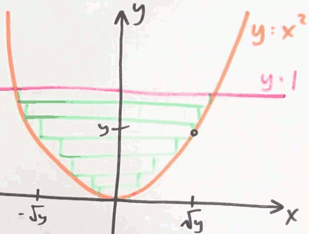

- height of rectangle : dy
- width of rectangle: 2√y 
- area = ∫¹₀ 2√ydy   (Ps. not [-1,1], [-1,1] is for ∫xxxdx  )

<h2 id="1eff9e402e1402bf1d1c8984c1387c61"></h2>


### When should I use horizontal as opposed to vertical pieces?

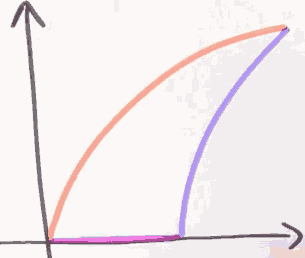

the bad news about vertical strips is that there's 2 different kinds of vertical strips.

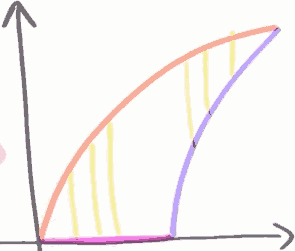

The vertical strips on the left bottom-left side touch the orange and the purple edge, and the vertical strips on the right-top touch orange and blue edge.


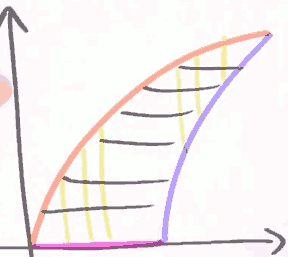

if I cut this up into horizontal strips, all of my horizontal strips have an orange side and a blue side. I have only **one type** of horizontal strip. 

---

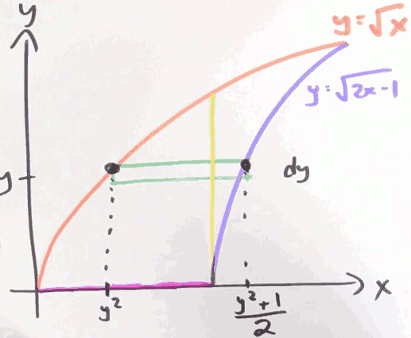

- height: dy
- width :  (y²+1)/2 - y²
- area = ∫¹₀ ((y²+1)/2 - y²) dy

<h2 id="ab458f4b361834dd802e4f40d31b5ebc"></h2>


### Quiz

Write an integral representing the area of the region bounded by the lines x=8, x=12, the function f(x)=6x+7, and the function g(x) = √(10+arctan(x)).


∫¹²₈ |√(10+arctan(x) - (6x+7))|dx    (注意绝对值号, 这里是求面积，而不是积分的有向面积)

---

<h2 id="6d7ddc94e89335ca03c91ea5976a39a9"></h2>


## How I can calculate volumn ?

<h2 id="50d38fafec7026a597e2116789e124d4"></h2>


### What does "volume" even mean?

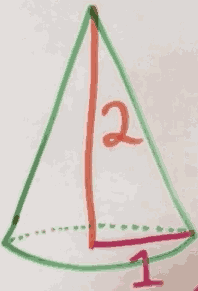

cut this thing up into slices and add up the volumes of the little slices

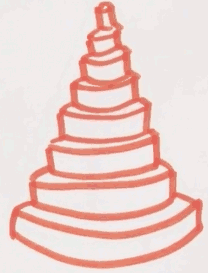

And what is the volumn of one of those slice ?

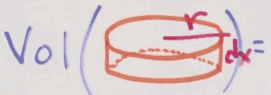

 = πr²dx

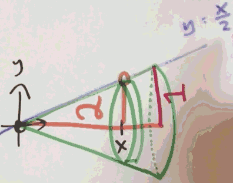

volumn = ∫ₓ₌²₀ π(x/2)²dx

= π/4·∫ₓ₌²₀ x²dx  = π/4·x³/3 ]²₀

= 2π/3

<h2 id="2c5d1b5cc187a6c7ab03086f49434c4c"></h2>


### What is the volume of a sphere?

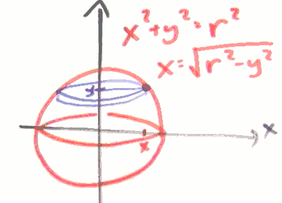


volumn = ∫ʳ₋ᵣ π(√(r²-x²))²dy

= π∫ʳ₋ᵣ (r²-x²)dy

= 2π ( r²y - y³/3 ］ʳ₀  )

= 2π ( r²r - r³/3 )

= 4/3πr³

<h2 id="32c7f2421ed02a30ee7e2e4c7b45d331"></h2>


### How do washers help to compute the volume of a solid of revolution?

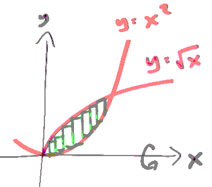

计算绿色方块所在图像，饶 x 轴旋转一周后，所形成的物体的体积。

We pick one of the green rectangle, and rotate 360' by *x*. We call this object "washer".

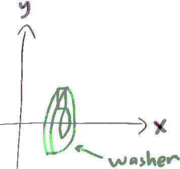

What's the volumn of a washer ?

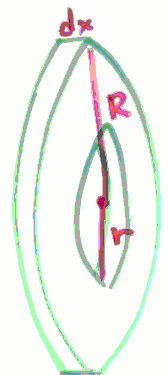

`v_washer` = π(R²-r²)dx

and we know:

R = √x , r = x²

so 

V = ∫¹₀ π(√x²-(x²)²)dx

 = π∫¹₀ (x-x⁴)dx 
 
 = π( x²/2 - x⁵/5 )¹₀
 
 = 0.3π

<h2 id="7660cc24ddc825e2c685482bdfda7354"></h2>


### What is the volume of a thin shell?


for each shell :

- h = 1-x²
- 横截面面积 s = πR²-πr² = π(R+r)(R-r) = π·2x·dx 

V = ∫¹₀ π·2x·(1-x²) dx

 = π/2

<h2 id="ff243addc34fe33a3b0d1d8fd1387cd8"></h2>


### What is the volume of a sphere with a hole drilled in it?

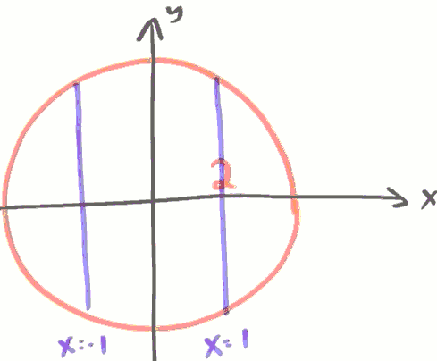

we can solve it by cutting it in shells or washers.

we use shells here.


V = ∫²₁ 2πx·2√(4-x²)dx 

 = 4π·√3

---

<h2 id="9ee7a107678b439893e2559c05a14dcc"></h2>


## How can I calculate length ?

<h2 id="de5e7676d649c7468e2bb575b9ab93af"></h2>


### What does "length" even mean?

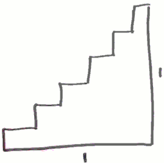

The total length of stairs is 2 . What if I make those stairs even smaller ?  still 2.

What if I make those stairs infinitely smaller ?

Let us ask another question: how to know the length of a curve y = f(x) ?

for every piece of that curve , the length is √(dx²+dy²) , after I integrate , the length of the curve is :

∫ (√(dx²+dy²))

now we pulling the dx outside 

= ∫ √(1+(dy/dx)²)dx 

So here's the formula that we're going to use ?

- the **arc length** from (a,f(a)) to (b,f(b)) along the graph of y=f(x) is :
- ∫ᵇₐ √(1+f'(x)²) dx

---

<h2 id="37a18465856958ba97dc6aeaaa06389e"></h2>


### On the graph of y² = x³, what is the length of a certain arc?

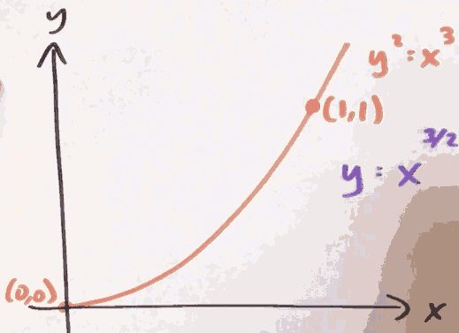

dy/dx = 3/2·x<sup>1/2</sup>

so length = ∫¹₀ √(1+(3/2·x<sup>1/2</sup>)²) dx

= ∫¹₀ √(1+9/4·x) dx

= (13·√13)/27 - 8/27


