...menustart

- [Lexical Analysis](#c9137c1c04dbfe3f1e2cd3a2c6f56ddf)
    - [3.1 The Role of the Lexical Analyzer](#503dc2cfa99223a98a1fa20ddd7aa67a)
        - [3.1.1 Lexical Analysis Versus Parsing](#cb56a27f159fc337bddaa026a491cfa6)
        - [3.1.2 Tokens, Patterns, and Lexemes](#4f54dc373bb9d6a8db7b4534ebcae01f)
        - [3.1.3 Attributes for Tokens](#b8c4a7ce665bbd5521e7531b5f56049d)
        - [3.1.4 Lexical Errors](#d401b0f8d4a56f8357ac6c0e053efe83)
    - [3.2 Input Buffering](#48d05be5115ab5c35d376d2eae488b78)
        - [3.2.1 Buffer Pairs](#b05d3f12b9ea3730efff70e2ca88648a)
        - [3.2.2 Sentinels](#fff01af6a53288aa02eb09337c31967f)
    - [3.3 Specification of Tokens](#200e4745c8f29de556808e708a402ac2)
        - [3.3.1 Strings and Languages](#74e49ac16ef34367b51793af0f048840)
        - [3.3.2 Operations on Languages](#4cbd840ba5cb383f70147e16ae7a05de)
        - [3.3.3 Regular Expressions](#fb4a5b3852381b6aadac0887d6ff4ae2)
        - [3.3.4 Regular Definitions](#9a75776dfb73fcfebabbb99bf3422851)
        - [3.3.5 Extensions of Regular Expressions](#7cedf7c26570a4666ecad1a2eb8730a0)
    - [3.4 Recognition of Tokens](#ebea52fcade7fe28010bd99d30398b5d)
        - [3.4.1 Transition Diagrams](#0503745a655577520a59327358161a9f)
        - [3.4.2 Recognition of Reserved Words and Identifiers](#ac3ab235083c381748fdce42a4c1bb54)
        - [3.4.3 Completion of the Running Example](#97611c49db1511feaedefc22ac6ada49)
        - [3.4.4 Architecture of a Transition-Diagram-Based Lexical Analyzer](#d0fb312e375ee37b45a48c9c487d131a)
    - [3.5 The Lexical-Analyzer Generator Lex](#921b7eb0390c2aa2b73abf6edb74ab44)
        - [3.5.1 Use of Lex](#d96ef03e4ef48fad67844a05f42082c8)
        - [3.5.2 Structure of Lex Programs](#657b471d853e0944613b1fc41f7988bd)
        - [3.5.3 Conflict Resolution in Lex](#cab9b67a202a7627adfcf2587ce702df)
        - [3.5.4 The Lookahead Operator](#f57723412a7038cb7392678e61a02b76)
    - [3.6 Finite Automata](#adab9833ab2dcc6edab8a39432584e49)
        - [3.6.1 Nondeterministic Finite Automata](#a46bbbffe97f741d7522f9d7eba5483b)
        - [3.6.2 Transition Tables](#2ebef3028849a4dc0909d534069b2316)
        - [3.6.3 Acceptance of Input Strings by Automata](#7de19e880b9825779ec50e33458727d7)
        - [3.6.4 Deterministic Finite Automata](#4870f1974b0dd964c769b59b181d7226)
    - [3.7 From Regular Expressions to Automata](#6fb5154a96390d272c49cb3c414c0fb4)
        - [3.7.1 Conversion of an NFA to a DFA](#178a1d8d1d4772d490da973fd009261e)
        - [3.7.2 Simulation of an NFA](#d72575cbdcfb9adb060d4493ead39c36)
        - [3.7.3 Effciency of NFA Simulation](#8906dbe3b6522fc4916054cac3ea1bf6)
        - [3.7.4 Construction of an NFA from a Regular Expression](#63ba62bd1272233558990dfb81e26ee2)
        - [3.7.5 Efficiency of String-Processing Algorithms](#d3b6cfc6bff4c4985298cd4b6ccd8806)
    - [3.8 Design of a Lexical-Analyzer Generator](#9be0f70930b6a8eaced083f8e54612e4)
        - [3.8.1 The Structure of the Generated Analyzer](#bc1a201f9c5d4a767a356a8f7c8e2539)
        - [3.8.2 Pattern Matching Based on NFA's](#591c0cef90e7cc631724a82526181aa7)
        - [3.8.3 DFA's for Lexical Analyzers](#560deab5107ca190345913cc30cdd379)
        - [3.8.4 Implementing the Lookahead Operator](#842ebc90f1674282757f47268758cd3a)
    - [3.9 Optimization of DFA-Based Pattern Matchers](#fd5afa6bcd74b9b2aa4ece82a8f4e8c2)
        - [3.9.1 Important States of an NFA](#cfa97bca3bad7182d66db81969204ef9)
        - [3.9.2 Functions Computed From the Syntax Tree](#ccaa63c1798e41e31f9f8e8a2091aac9)
        - [3.9.3 Computing *nullable*, *firstpos*, and *lastpos*](#9d510c7a831f62018cae56836a266769)
        - [3.9.4 Computing followpos](#cb99b99a4bf8d9971dafc9579d962576)
        - [3.9.5 Converting a Regular Expression Directly to a DFA](#fd0a77b3813cb5692d1689d95568daf7)
        - [3.9.6 Minimizing the Number of States of a DFA](#5f8d48865d5cddabffbed51ce176bcbb)
        - [3.9.7  State Minimization in Lexical Analyzers](#6968fda06e8f79559037d7f27f3360f9)
        - [3.9.8  Trading Time for Space in DFA Simulation](#af4e82fbb4a2e52c6d19d63130637e95)

...menuend


<h2 id="c9137c1c04dbfe3f1e2cd3a2c6f56ddf"></h2>


# Lexical Analysis

 - We begin the study of lexical-analyzer generators by introducing regular expressions. 
 - We show how this notation can be transformed, 
     - first into nondeterministic automata and then into deterministic automata. 
 - The latter two notations can be used as input to a "driver", 
     - that is, code which simulates these automata and uses them as a guide to determining the next token.
 - This driver and the specification of the automaton form the nucleus of the lexical analyzer.

---

<h2 id="503dc2cfa99223a98a1fa20ddd7aa67a"></h2>


## 3.1 The Role of the Lexical Analyzer

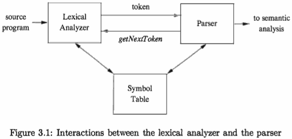

lexical analyzer may perform certain other tasks besides identification of lexemes.

 - stripping out comments and *whitespace*
 - correlating error messages generated by the compiler with the source program. 

In some compilers, the lexical analyzer makes a copy of the source program with the error messages inserted at the appropriate positions.  If the source program uses a macro-preprocessor, the expansion of macros may also be performed by the lexical analyzer.

Sometimes, lexical analyzers are divided into a cascade of two processes:

 - a) *Scanning* consists of the simple processes that do not require tokenization of the input, 
     - such as deletion of comments and compaction of consecutive whitespace characters into one.
 - b) *Lexical analysis* proper is the more complex portion, where the scanner produces the sequence of tokens as output.

---

<h2 id="cb56a27f159fc337bddaa026a491cfa6"></h2>


### 3.1.1 Lexical Analysis Versus Parsing

There are a number of reasons why the analysis portion of a compiler is normally separated into lexical analysis and parsing (syntax analysis) phases.

 1. Simplicity of design is the most important consideration. 
     - The separation of lexical and syntactic analysis often allows us to simplify at least one of these tasks. 
 2. Compiler efficiency is improved. 
     - A separate lexical analyzer allows us to apply specialized techniques that serve only the lexical task, not the job of parsing. In addition, specialized buffering techniques for reading input characters can speed up the compiler significantly.
 3. Compiler portability is enhanced. 
     - Input-device-specific peculiarities can be restricted to the lexical analyzer.

---

<h2 id="4f54dc373bb9d6a8db7b4534ebcae01f"></h2>


### 3.1.2 Tokens, Patterns, and Lexemes

When discussing lexical analysis, we use three related but distinct terms:

 - A *token* is a pair consisting of a token name and an optional attribute value. 
     - The token name is an abstract symbol representing a kind of lexical unit, e.g., a keyword, or an identifier. 
 - A *pattern* is a description of the form that the lexemes of a token may take. 
     - In the case of a keyword as a token, the pattern is just the sequence of characters that form the keyword. For identifiers and some other tokens, the pattern is a more complex structure that is matched by many strings.
 - A *lexeme* is a sequence of characters in the source program that matches the pattern for a token and is identified by the lexical analyzer as an instance of that token.


TOKEN | INFORMAL DESCRIPTION | SAMPLE LEXEMES
--- | --- | ---
**if** | characters i,f     | if
**else** | characters e,l,s,e     | else
**comparison** | < or > or <= or >= or == or != |    <=, !=
**id** | letter followed by letters and digits |  pi, score, D2
**number** | any numeric constant |    3.14159 , 6.02e23
**literal** | anything but ", surrounded by "'s  | "core dumped"

Figure 3.2: Examples of tokens

Example 3.1: 

```c
    printf("Total = %d\ ", score);
```

 - printf and score are lexemes matching the pattern for token **id**
 - "Total = %d\n" is a lexeme matching **literal**.

In many programming languages, the following classes cover most or all of the tokens:

 - One token for **each keyword**. 
     - The pattern for a keyword is the same as the keyword itself. 
 - Tokens for the **operators**, either individually or in classes such as the token comparison mentioned in Fig. 3.2.
 - One token representing all **identifiers**.
 - One or more tokens representing **constants**, such as numbers and literal strings .
 - Tokens for each **punctuation symbol**, such as left and right parentheses, comma, and semicolon.

---

<h2 id="b8c4a7ce665bbd5521e7531b5f56049d"></h2>


### 3.1.3 Attributes for Tokens

When more than one lexeme can match a pattern, the lexical analyzer must provide additional information about the par­ticular lexeme that matched, for the subsequent compiler phases. 

For example, the pattern for token **number** matches both 0 and 1, but it is extremely important for the code generator to know which lexeme was found in the source program. 

Thus, in many cases the lexical analyzer returns to the parser not only a token name, but an attribute value that describes the lexeme represented by the tokenl

The token name in­fluences parsing decisions, while the attribute value influences translation of tokens after the parse.

We shall assume that tokens have at most one associated attribute, although this attribute may have a structure that combines several pieces of information. 

The most important example is the token **id**, where we need to associate with the token a great deal of information. 

Normally, information about an identi­fier -- e.g., its lexeme, its type, and the location at which it is first found  -- is kept in the symbol table. Thus, the appropriate attribute value for an identifier is a pointer to the symbol-table entry for that identifier.

Example 3.2 : The token names and associated attribute values for the For­ tran statement

```
    E = M * C ** 2
```

are written below as a sequence of pairs.

```
<id, pointer to symbol-table entry for E> 
< assign_op>
<id, pointer to symbol-table entry for M> 
<mult_op>
<id, pointer to symbol-table entry for C> 
<exp_op>
<number, integer value 2>
```

 - in certain pairs, especially operators, punctuation, and keywords, there is no need for an attribute value. 
 - In this example, the token **number** has been given an integer-valued attribute. 
     - In practice, a typical compiler would instead store a character string representing the constant and use as an attribute value for **number** a pointer to that string. 

---

<h2 id="d401b0f8d4a56f8357ac6c0e053efe83"></h2>


### 3.1.4 Lexical Errors

It is hard for a lexical analyzer to tell, without the aid of other components, that there is a source-code error. 

For instance, if the string **fi** is encountered for the first time in a C program in the context:

```c
    fi ( a == f(x)) ...
```

a lexical analyzer cannot tell whether **fi** is a misspelling of the keyword **if** or an undeclared function identifier. Since fi is a valid lexeme for the token **id**, the lexical analyzer must return the token id to the parser and let some other phase of the compiler handle an error.

However, suppose a situation arises in which the lexical analyzer is unable to proceed because none of the patterns for tokens matches any prefix of the remaining input. 

The simplest recovery strategy is "panic mode" recovery. We delete successive characters from the remaining input, until the lexical analyzer can find a well-formed token at the beginning of what input is left. 

> 从剩下的输入中,连续删除字符，直到 lexical analyzer 找到一个合适的 token

This recovery technique may confuse the parser, but in an interactive computing environment it may be quite adequate.

Other possible error-recovery actions are:

 1. Delete one character from the remaining input.
 2. Insert a missing character into the remaining input.
 3. Replace a character by another character.
 4. Transpose two adjacent characters.

Transformations like these may be tried in an attempt to repair the input. The simplest such strategy is to see whether a prefix of the remaining input can be transformed into a valid lexeme by a single transformation. This strategy makes sense, since in practice most lexical errors involve a single character. A more general correction strategy is to find the smallest number of transforma­tions needed to convert the source program into one that consists only of valid lexemes, but this approach is considered too expensive in practice to be worth the effort.

---

<h2 id="48d05be5115ab5c35d376d2eae488b78"></h2>


## 3.2 Input Buffering

We often have to look one or more characters beyond the next lexeme before we can be sure we have the right lexeme.

We shall introduce a two-buffer scheme that handles large lookaheads safely. We then consider an improvement involving "sentinels" that saves time checking for the ends of buffers.

---

<h2 id="b05d3f12b9ea3730efff70e2ca88648a"></h2>


### 3.2.1 Buffer Pairs

Specialized buffering techniques have been developed to reduce the amount of overhead required to process a single input character.  An impor­tant scheme involves two buffers that are alternately reloaded, as suggested in Fig. 3.3.

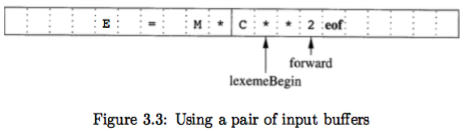

Each buffer is of the same size N , and N is usually the size of a disk block, e.g., 4096 bytes. 

Using one system read command we can read N characters into a buffer, rather than using one system call per character.  

If fewer than N characters remain in the input file, then a special character, represented by **eof**, marks the end of the source file and is different from any possible character of the source program.

Two pointers to the input are maintained:

 1. Pointer **lexemeBegin**
     - marks the beginning of the current lexeme, whose extent we are attempting to determine.
 2. Pointer **forward** 
     - scans ahead until a pattern match is found.

Once the next lexeme is determined, **forward** is set to the character at its right end. Then, after the lexeme is recorded as an attribute value of a token returned to the parser, lexemeBegin is set to the character immediately after the lexeme just found. 

Advancing **forward** requires that we first test whether we have reached the end of one of the buffers, and if so, we must reload the other buffer from the input, and move forward to the beginning of the newly loaded buffer. As long as we never need to look so far ahead of the actual lexeme that the sum of the lexeme's length plus the distance we look ahead is greater than N, we shall never overwrite the lexeme in its buffer before determining it.

---

<h2 id="fff01af6a53288aa02eb09337c31967f"></h2>


### 3.2.2 Sentinels

We must check, each time we advance forward, that we have not moved off one of the buffers; if we do, then we must also reload the other buffer. Thus, for each character read, we make two tests: 

 - one for the end of the buffer, 
 - and one to determine what character is read. 

We can combine the buffer-end test with the test for the current character if we extend each buffer to hold a sentinel character at the end. The sentinel is a special character that cannot be part of the source program, and a natural choice is the character **eof**.

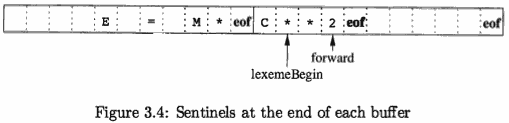

Figure 3.4 shows the same arrangement as Fig. 3.3, but with the sentinels added. 

Note that **eof** retains its use as a marker for the end of the entire input. Any **eof** that appears other than at the end of a buffer means that the input is at an end.


```java
switch ( *forward++ ) { 
case eof:
    if (forward is at end of first buffer ) { 
        reload second buffer;
        forward = beginning of second buffer;
    }else if (forward is at end of second buffer ) { 
        reload first buffer;
        forward = beginning of first buffer;
    }else /* eof within a buffer marks the end of input */ 
        terminate lexical analysis;
    break;
Cases for the other characters
}
```

Figure 3.5: Loo head code with sentinels

--- 

<h2 id="200e4745c8f29de556808e708a402ac2"></h2>


## 3.3 Specification of Tokens

Regular expressions are an important notation for specifying lexeme patterns. 

While they cannot express all possible patterns, regular expressions are very effective in specifying those types of patterns that we actually need for tokens.


---

<h2 id="74e49ac16ef34367b51793af0f048840"></h2>


### 3.3.1 Strings and Languages

An *alphabet* is any finite set of symbols. Typical examples of symbols are let­ters, digits, and punctuation. 

The set {0, 1} is the binary alphabet. ASCII is an important example of an alphabet; it is used in many software systems. 

Unicode, which includes approximately 100,000 characters from alphabets around the world, is another important example of an alphabet.

A ***string*** over an alphabet is a finite sequence of symbols drawn from that alphabet. In language theory, the terms "sentence" and "word" are often used as synonyms for "string". The length of a string s, usually written |s| . For example, ***banana*** is a string of length six. The ***empty string***, denoted ε, is the string of length zero.

A *language* is any countable set of strings over some fixed alphabet. This definition is very broad. 

Abstract languages like ∅, the empty set, or {ε}, the set containing only the empty string, are languages under this definition. 

> A *subsequence* of s is any string formed by deleting zero or more ***not necessarily consecutive*** positions of s. For example, baan is a subsequence of banana.

If x and y are strings, then the concatenation of x and y, denoted xy, is the string formed by appending y to x. For example, if x = dog and y = house, then xy = doghouse. The empty string is the identity under concatenation; that is , for any string s, εs = sε = s.

If we think of concatenation as a product, we can define the "exponentiation" of strings as follows. Define s⁰ to be ε, and for all i>0, define sⁱ to be sⁱ⁻¹s. 

Since εs = s, it follows that s¹=s. Then s²=ss, s³=sss, and so on.

---

<h2 id="4cbd840ba5cb383f70147e16ae7a05de"></h2>


### 3.3.2 Operations on Languages

In lexical analysis, the most important operations on languages are union, con­catenation, and closure, which are defined formally in Fig. 3.6. 

OPERATION | DEFINITION AND NOTATION
--- | ---
Union of L and M | L ∪ M = { s \| s is in L  or s is in M }
Concatenation of L and M | LM = { st \| s is in L  and t is in M }
Kleene closure of L | L<sup>\*</sup>  = ∪<sup>∞</sup>`ᵢ₌₀ Lⁱ`
Positive closure of L | L⁺  = ∪<sup>∞</sup>`ᵢ₌₁ Lⁱ`


---

<h2 id="fb4a5b3852381b6aadac0887d6ff4ae2"></h2>


### 3.3.3 Regular Expressions

We describe the language of C identifiers by:

```
letter_ ( letter_ | digit )*
```

 - letter_ is for any letter or the underscore

The regular expressions are built recursively out of smaller regular expres­sions, using the rules described below. 

Each regular expression r denotes a language L(r), which is also defined recursively from the languages denoted by r's subexpressions. Here are the rules that define the regular expressions over some alphabet Σ and the languages that those expressions denote.

BASIS: There are two rules that form the basis:

 1. ε is a regular expression, and L(ε) is {ε}, that is, the language whose sole member is the empty string.
 2. If *a* is a symbol in Σ ,then **a** is a regular expression, and L(**a**) = {*a*}, that is, the language with one string, of length one, with *a* in its one position. Note that by convention, we use italics for symbols, and boldface for their corresponding regular expression.

INDUCTION: There are four parts to the induction whereby larger regular expressions are built from smaller ones. 

Suppose **r** and **s** are regular expressions denoting languages L(*r*) and L(*s*), respectively.

 1. (*r*)|(*s*) is a regular expression , denoting the language L(*r*) U L(*s*).
 2. (*r*)(*s*) is a regular expression  , denoting the language L(*r*)L(*s*).
 3. (*r*)<sup>\*</sup> is a regular expression denoting (L(*r*))<sup>\*</sup>.
 4. (*r*) is a regular expression denoting L(*r*). 
     - This last rule says that we can add additional pairs of parentheses around expressions without changing the language they denote.

As defined, regular expressions often contain unnecessary pairs of paren­theses. We may drop certain pairs of parentheses if we adopt the conventions that :

 - a) The unary operator * has highest precedence and is left associative.
 - b) Concatenation has second highest precedence and is left associative.
 - c) | has lowest precedence and is left associative.

Under these conventions, for example, we may replace the regular expression `(a)|((b)*(c))` by `a|b*c`. 

A language that can be defined by a regular expression is called a *regular set*. 

> *regular set* is a language

If two regular expressions r and s denote the same regular set, we say they are *equivalent* and write r = s. For instance, `(a|b) = (b|a)`.

LAW | DESCRIPTION
--- | ---
r\|s = s\|r  |  \| is commutative
r\|(s\|t) = (r\|s)\|t  | \| is associative
r(st) = (rs)t | Concatenation is associative
r(s\|t) = rs\|rt; (s\|t)r = sr\|tr | Concatenation distributes over \|
εr = rε = r | ε is the identity for concatenation  
r<sup>* </sup> = (r\|ε)<sup>* </sup> | ε is guaranteed in a closure
r<sup>\*\*</sup> = r<sup>* </sup> | * is idempotent

Figure 3.7: Algebraic laws for regular expressions

---

<h2 id="9a75776dfb73fcfebabbb99bf3422851"></h2>


### 3.3.4 Regular Definitions

For notational convenience, we may wish to give names to certain regular ex­pressions and use those names in subsequent expressions, as if the names were themselves symbols.

If Σ is an alphabet of basic symbols, then a *regular definition* is a sequence of definitions of the form:

```
    d₁ → r₁
    d₂ → r₂ 
      ...
    dn → rn
```

where:

 1. Each dᵢ is a new symbol, not in Σ and not the same as any other of the d's, and
 2. Each rᵢ is a regular expression over the alphabet Σ U{ d₁,d₂,...,dᵢ₋₁ }·

By restricting rᵢ to Σ and the previously defined d's, we avoid recursive defini­tions, and we can construct a regular expression over Σ alone, for each rᵢ. 

We do so by first replacing uses of d₁ in r₂ (which cannot use any of the d's except for d₁ ) , then replacing uses of d₁ and d₂ in r₃ by r₁ and (the substituted) r₂ , and so on. Finally,in rn we replace each dᵢ, for i=1,2,...,n-1, by the substituted version of rᵢ , each of which has only symbols of Σ .

Example3.5: Here is a regular definition for the language of C identifiers.

```
    letter_ → A | B | ... | Z | a | b | ... | z | _
      digit → 0 | 1 | ... | 9
           id → letter_( letter_ | digit )*   
```

Example 3.6 : Unsigned numbers (integer or floating point) are strings such as 5280, 0.01234, 6.336E4, or 1.89E-4

```
             digit → 0 | 1 | ... | 9
            digits → digit digit*
  optionalFraction → . digits | ε
  optionalExponent → ( E ( +|-|ε ) digits ) | ε
              number → digits optionalFraction optionalExponent
```

 - this specification does not match `1.` 

---

<h2 id="7cedf7c26570a4666ecad1a2eb8730a0"></h2>


### 3.3.5 Extensions of Regular Expressions

 1. *One or more instances*. `+`
     - The operator + has the same precedence and associativity as the operator \*
     - Two useful algebraic laws, r\* = r+ | ε,   and r+ = rr\* = r\*r
 2. *Zero or one instance*.   `?`
     - r? is equivalent to r | ε
     - L(r?) = L(r) U {c}
     - The ? operator has the same precedence and associativity as \* and +.
 3. *Character classes*.
     - A regular expression a₁|a₂|...|an , can be replaced by the shorthand [ a₁a₂...an ]
     - More importantly, when a₁,a₂,...,an form a *logical se­quence*, we can replace them by a₁-an, that is, just the first and last separated by a hyphen '-'. 
     - Thus, [abc] is shorthand for a|b|c, and [a-z] is shorthand for a|b|...|z.

Example 3.7 : Using these shorthands, we can rewrite the regular definition of Example 3.5 as:

```
    letter_ → [A-Za-z_]
      digit → [0-9]
         id → letter_( letter | digit)*  
```

```
     digit → [0-9]
    digits → digit+
    number → digits (. digits)? ( E[+-]? digits)?
```

yacc 中 , `.` 代表的是除换行外 任意字符。


---

<h2 id="ebea52fcade7fe28010bd99d30398b5d"></h2>


## 3.4 Recognition of Tokens

 - study how to take the patterns for all the needed tokens 
 - and build a piece of code that examines the input string and finds a prefix that is a lexeme matching one of the patterns

Our discussion will make use of the following running example.

```
stmt → if expr then stmt
     | if expr then stmt else stmt 
     | ε
expr → term relop term
     | term
term → id
     | number
```

Figure 3.10: A grammar for branching statements

Example 3.8 : The grammar fragment of Fig. 3.10 describes a simple form of branching statements and conditional expressions. This syntax is similar to that of the language Pascal, in that **then** appears explicitly after conditions.

For **relop**, we use the comparison operators of languages like Pascal or SQL, where = is "equals" and <> is "not equals", because it presents an interesting structure of lexemes.

The terminals of the grammar, which are **if**, **then**, **else**, **relop**, **id**, and **number** , are the names of tokens as far as the lexical analyzer is concerned. 

The patterns for these tokens are described using regular definitions, as in Fig. 3.11 . The patterns for ***id*** and ***number*** are similar to what we saw in Example 3.7.

```
    digit → [0-9]
   digits → digit+
   number → digits (. digits)? (E [+-]? digits)?
   letter → [A-Za-z]
          id → letter( letter | digits)*
          if → if
        then → then
        else → else
       relop → < | > | <= | >= | = | <>
```

Figure 3.11: Patterns for tokens of Example 3.8

To simplify matters, we make the common assumption that keywords are also *reserved words*: that is, they are not identifiers, even though their lexemes match the pattern for identifiers.

In addition, we assign the lexical analyzer the job of stripping out white­ space, by recognizing the "token" *ws* defined by:

```
    ws → ( black | tab | newline)+
```

Token *ws* is different from the other tokens in that,  we do not return it to the parser.

Our goal for the lexical analyzer is summarized in Fig. 3.12. 

LEXEMES | TOKEN NAME | ATTRIBUTE VALUE
--- | --- | ---
Any ws | - | -
if | **if** | -
then | **then** | -
else | **else** | -
Any id | **id** | Pointer to table entry
Any number | **number** | Pointer to table entry
< | **relop** | LT
<= | **relop** | LE
= | **relop** | EQ
<> | **relop** | NE
> | **relop** | GT
>= | **relop** | GE

Figure 3.12: Tokens, their patterns, and attribute values

---

<h2 id="0503745a655577520a59327358161a9f"></h2>


### 3.4.1 Transition Diagrams

As an intermediate step in the construction of a lexical analyzer, we first convert patterns into stylized flowcharts, called "*transition diagrams*". 

In this section, we perform the conversion from regular-expression patterns to transition dia­grams by hand, but in Section 3.6, we shall see that there is a mechanical way to construct these diagrams from collections of regular expressions.

*Transition diagrams* have a collection of nodes or circles, called *states*. Each state represents a condition that could occur during the process of scanning the input looking for a lexeme that matches one of several patterns. We may think of a state as summarizing all we need to know about what characters we have seen between the *lexemeBegin* pointer and the *forward* pointer (as in the situation of Fig. 3.3).

*Edges* are directed from one state of the transition diagram to another. Each edge is *labeled* by a symbol or set of symbols. If we are in some state s, and the next input symbol is a, we look for an edge out of state s labeled by a (and perhaps by other symbols, as well).   

If we find such an edge, we advance the *forward* pointer and enter the state of the transition diagram to which that edge leads. We shall assume that all our transition diagrams are *deterministic*, meaning that there is never more than one edge out of a given state with a given symbol among its labels. 

Starting in Section 3.5, we shall relax the condition of determinism, making life much easier for the designer of a lexical analyzer, although trickier for the implementer. Some important conventions about transition diagrams are:

 1. Certain states are said to be *accepting*, of *final*. 
     - These states indicate that a lexeme has been found, although the actual lexeme may not consist of all positions between the *lexemeBegin* and *forward* pointers. We always indicate an accepting state by a double circle, and if there is an action to be taken -- typically returning a token and an attribute value to the parser -- we shall attach that action to the accepting state.
 2. In addition, if it is necessary to retract the *forward* pointer one position (i.e., the lexeme does not include the symbol that got us to the accepting state) , then we shall additionally place a \* near that accepting state. 
     - In our example, it is never necessary to retract forward by more than one position, but if it were, we could attach any number of \* 's to the accepting state.

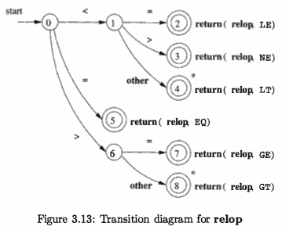

Example 3.9 : Figure 3.13 is a transition diagram that recognizes the lexemes matching the token **relop**. 

 - We begin in state 0, the start state.   
     - we see < as the first input symbol, then among the lexemes that match the pattern for **relop** we can only be looking at <, <>, or <=. 
 - We therefore go to state 1, and look at the next character. 
     - If it is =, then we recognize lexeme <=, enter state 2, and return the token **relop** with attribute LE, the symbolic constant representing this particular comparison operator. 
     - If in state 1 the next character is > , then instead we have lexeme <>, and enter state 3 to return an indication that the not-equals operator has been found. 
     - On any other character, the lexeme is <, and we enter state 4 to return that information. 
         - Note, however, *that state 4 has a * to indicate that we must retract the input one position*. 
 - On the other hand, if in state 0 the first character we see is =, then this one character must be the lexeme. We immediately return that fact from state 5.
 - The remaining possibility is that the first character is >. Then, we must enter state 6 and decide whether the lexeme is >= , or just > . 
     - Note that if, in state 0, we see any character besides <, =, or >, we can not possibly be seeing a **relop** lexeme, so this transition diagram will not be used. 


---

<h2 id="ac3ab235083c381748fdce42a4c1bb54"></h2>


### 3.4.2 Recognition of Reserved Words and Identifiers

Recognizing keywords and identifiers presents a problem. Usually, keywords like **if** or **then** are reserved, so they are not identifiers even though they look like identifiers. Thus, although we typically use a transition diagram like that of Fig. 3.14 to search for identifier lexemes, this diagram will also recognize the keywords **if** , **then**, and **else** of our running example.

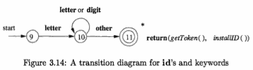

There are two ways that we can handle reserved words that look like iden­tifiers :

 1. Install the reserved words in the symbol table initially. 
     - A field of the symbol-table entry indicates that these strings are never ordinary identi­fiers, and tells which token they represent. 
     - We have supposed that this method is in use in Fig. 3.14. When we find an identifier, a call to *installID* places it in the symbol table if it is not already there and returns a pointer to the symbol-table entry for the lexeme found. 
 2. Create separate transition diagrams for each keyword; 
     - an example for the keyword **then** is shown in Fig. 3.15. 
     - 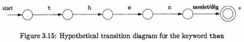
     - Note that such a transition diagram consists of states representing the situation after each successive letter of the keyword is seen, followed by a test for a "nonletter-or-digit". 


---

<h2 id="97611c49db1511feaedefc22ac6ada49"></h2>


### 3.4.3 Completion of the Running Example

The transition diagram for **id**'s that we saw in Fig. 3.14 has a simple structure. 

When we first encounter anything but a letter or digit, we go to state 11 and accept the lexeme found. Since the last character is not part of the identifier, we must retract the input one position , we enter what we have found in the symbol table and determine whether we have a keyword or a true identifier.

The transition diagram for token **number** is shown in Fig. 3.16, and is so far the most complex diagram we have seen. 

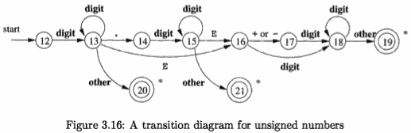

 - Beginning in state 12, if we see a digit, we go to state 13. In that state, we can read any number of additional digits. 
 - However, if we see anything but a digit or a dot, we have seen a number in the form of an integer; 
     - 123 is an example. 
     - That case is handled by entering state 20, where we return token **number** and a pointer to a table of constants where the found lexeme is entered. These mechanics are not shown on the diagram but are analogous to the way we handled identifiers.

The final transition diagram, shown in Fig. 3.17, is for whitespace. 

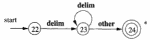

In that diagram, we look for one or more "whitespace" characters, represented by delim in that diagram -- typically these characters would be blank, tab, newline, and perhaps other characters that are not considered by the language design to be part of any token.

Note that in state 24, we have found a block of consecutive whitespace characters, followed by a nonwhitespace character. We retract the input to begin at the nonwhitespace, but we do not return to the parser. Rather, we must restart the process of lexical analysis after the whitespace.

---

<h2 id="d0fb312e375ee37b45a48c9c487d131a"></h2>


### 3.4.4 Architecture of a Transition-Diagram-Based Lexical Analyzer

There are several ways that a collection of transition diagrams can be used to build a lexical analyzer. 

Each state is represented by a piece of code. We may imagine a variable *state* holding the number of the current state for a transition diagram. A switch based on the value of state takes us to code for each of the possible states, where we find the action of that state. Often, the code for a state is itself a switch statement or multiway branch that determines the next state by reading and examining the next input character.

```
TOKEN getRelop() {
    TOKEN retToken = new(RELOP) ;
    while(1) {  /* repeat character processing until 
                a return or failure occurs */ 
    switch(state) {
        case 0: 
            c = nextChar();
            if(c =='<')state=1;
            elseif(c =='=')state=5;
            else if ( c == '>' ) state = 6;
            /* lexeme is not a relop */
            else fail() ; 
            break;
        case 1: ...
        ...
        case 8: 
            retract();
            retToken.attribute = GT;
            return(retToken);

    } // end switch
    } // end while
}
```

Figure 3.18: Sketch of implementation of **relop** transition diagram


Example 3.10 : In Fig. 3.18 we see a sketch of getRelop() , a C++ function whose job is to simulate the transition diagram of Fig. 3.13 and return an object of type TOKEN, that is, a pair consisting of the token name (**relop** in this case) and an attribute value (the code for one of the six comparison operators in this case). 

 - getRelop() first creates a new object retToken and initializes its first component to RELOP, the symbolic code for token **relop**.
 - We see the typical behavior of a state in case 0, the case where the current state is O. 
     - A function nextChar() obtains the next character from the input . 
     - If the next input character is not one that can begin a comparison operator, then a function **fail**() is called.
     - What fail() does depends on the global error­ recovery strategy of the lexical analyzer.
         - It should reset the *forward* pointer to *lexemeBegin*, in order to allow another transition diagram to be applied to the true beginning of the unprocessed input.
         - It might then change the value of state to be the start state for another transition diagram, which will search for another token. 
         - Alternatively, if there is no other transition diagram that remains unused, fail() could initiate an error-correction phase that will try to repair the input and find a lexeme, as discussed in Section 3.1.4.
 - We also show the action for state 8 in Fig. 3.18. Because state 8 bears a \* 
     - we must retract the input pointer one position (i.e., put c back on the input stream) . 
     - That task is accomplished by the function retract() . 
     - Since state 8 represents the recognition of lexeme >=, we set the second component of the returned object, which we suppose is named attribute, to GT, the code for this operator. 

To place the simulation of one transition diagram in perspective, let us consider the ways code like Fig. 3.18 could fit into the entire lexical analyzer.

 1. We could arrange for the transition diagrams for each token to be tried sequentially.  按顺序一个个尝试
     - Then, the function fail() resets the pointer *forward* and starts the next transition diagram, each time it is called. 
         - This method allows us to use transition diagrams for the individual key­words, like the one suggested in Fig. 3.15.
         - We have only to use these before we use the diagram for **id**, in order for the keywords to be reserved words.
 2. We could run the various transition diagrams "in parallel," feeding the next input character to all of them and allowing each one to make what­ ever transitions it required. 
     - If we use this strategy, we must be careful to resolve the case where one diagram finds a lexeme that matches its pattern, while one or more other diagrams are still able to process input.
    - The normal strategy is to ***take the longest prefix of the input*** that matches any pattern. 
        - That rule allows us to prefer identifier *thenext* to keyword *then*, or the operator -> to - , for example.
 3. The preferred approach, and the one we shall take up in the following sections, is to combine all the transition diagrams into one. 
     - We allow the transition diagram to read input until there is no possible next state, and then take the longest lexeme that matched any pattern. 
     - In our running example, this combination is easy, because no two tokens can start with the same character;
     - However, in general, the problem of combining transition diagrams for several tokens is more complex, as we shall see shortly.


---

<h2 id="921b7eb0390c2aa2b73abf6edb74ab44"></h2>


## 3.5 The Lexical-Analyzer Generator Lex

In this section, we introduce a tool called **Lex**, or in a more recent implemen­tation **Flex**, that allows one to specify a lexical analyzer by specifying regular expressions to describe patterns for tokens. 

 - The input notation for the Lex tool is referred to as the Lex language,  and the tool itself is the Lex compiler. 
 - Behind the scenes, the Lex compiler transforms the input patterns into a transition diagram and generates code, in a file called lex.yy.c, that simulates this tran­sition diagram. 
 - The mechanics of how this translation from regular expressions to transition diagrams occurs is the subject of the next sections; here we only learn the Lex language.

---

<h2 id="d96ef03e4ef48fad67844a05f42082c8"></h2>


### 3.5.1 Use of Lex

Figure 3.22 suggests how Lex is used. 

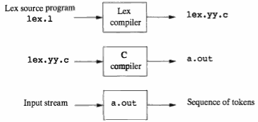

 - The normal use of the compiled C program, referred to as a.out , is as a subroutine ofthe parser. 
 - It is a C function that returns an integer ? , which is a code for one of the possible token names. 
 - The attribute value, whether it be another numeric code, a pointer to the symbol table, or nothing, is placed in a global variable **yylval**, which is shared between the lexical analyzer and parser, thereby making it simple to return both the name and an attribute value of a token.

---

<h2 id="657b471d853e0944613b1fc41f7988bd"></h2>


### 3.5.2 Structure of Lex Programs

A Lex program has the following form:

```
    declarations
    %%
    translation rules
    %%
    auxiliary functions
```

 - The *declarations* section includes declarations of 
     - variables, 
     - *manifest constants* 
         - (identifiers declared to stand for a constant, e.g., the name of a token), 
     - and regular definitions 
 - The *translation rules* each have the form
     - `Pattern { Action }`
     - Each pattern is a regular expression 
         - which may use the regular definitions of the declaration section. 
     - The actions are fragments of code, typically written in C, although many variants of Lex using other languages have been created.
 - The *auxiliary functions* holds whatever additional functions are used in the actions. 
     - Alternatively, these functions can be compiled separately and loaded with the lexical analyzer.

The lexical analyzer created by **Lex** behaves in concert with the parser as follows. 

 - When called by the parser, the lexical analyzer begins reading its remaining input, one character at a time, until it finds the longest prefix of the input that matches one of the patterns Pᵢ
 - It then executes the associated action Aᵢ. 
     - Typically, Aᵢ will return to the parser, 
     - but if it does not (e.g., because Pᵢ describes whitespace or comments), then the lexical analyzer proceeds to find additional lexemes, until one of the corresponding actions causes a return to the parser. 
 - The lexical analyzer returns a single value, the token name, to the parser, but uses the shared, integer variable **yylval** to pass additional information about the lexeme found, if needed.


Example 3.11 : Figure 3.23 is a Lex program that recognizes the tokens of Fig. 3.12 and returns the token found. 

```
%{
    /* definitions of manifest constants 
    LT, LE, EQ, NE, GT, GE,
    IF, THEN, ELSE, ID, NUMBER, RELOP */
%}
/* regular definitions */
delim     [ \t\n]
ws         {delim}+
letter     [A-Za-z]
digit     [0-9]
id         {letter} ({letter}|{digit})*
number     {digit}+ (\. {digit}+)? (E [+-]?{digit}+)?

%%

{ws}     {/* no action and no return */} 
if         {return(IF);}
then     {return(THEN);}
else     {return(ELSE);}
{id}     {yylval =(int) installID() ; return(ID);}
{number} {yylval =(int) installNum() ;return(NUMBER) ; }
"<"        {yylval = LT; return(RELOP);} 
"<="    {yylval = LE; return(RELOP);} 
"="        {yylval = EQ; return(RELOP) j} 
"<>"    {yylval = NE; return(RELOP);} 
">"        {yylval = GT; return(RELOP);} 
">="    {yylval = GE; return(RELOP);}

%%

int installID() {
    /* function to install the lexeme, 
    whose first character is pointed to by yytext,
    a d whose length is yyleng, 
    into the symbol table and 
    return a pointer thereto */
}
int installNum() {
    /* similar to installID, but puts numer­ical 
    constants into a separate table */
}
```

Figure 3.23: Lex program for the tokens of Fig. 3.12

A few observations about this code will introduce us to many of the important features of **Lex**.

 - a pair of special brackets, %{ and %}. 
     - Anything within these brackets is copied directly to the file lex.yy.c , and is not treated as a regular definition. 
     - It is common to place there the definitions of the manifest constants, using **C #define** statements to associate unique integer codes with each of the manifest constants. 
     - In our example, we have listed in a comment the names of the manifest constants, LT, IF, and so on, but have not shown them defined to be particular integers
         - If Lex is used along with Yacc, then it would be normal to define the manifest constants in the Yacc program and use them without definition in the Lex program. 
 - Also in the declarations section is a sequence of regular definitions. 
     - These use the extended notation for regular expressions. 
     - Regular definitions that are used in later definitions or in the patterns of the translation rules are surrounded by curly braces '{ }'. 
     - In the definition of ***id*** and ***number***, parentheses are used as grouping meta symbols.
 - In the auxiliary-function section, we see two such functions, installID() and installNum(). 
     - Like the portion of the declaration section that appears between %{ ... %} , everything in the auxiliary section is copied directly to file lex.yy.c, but may be used in the actions.
 - patterns and rules
     - *ws*, , has an associated empty action. If we find whitespace, we do not return to the parser, but look for another lexeme. 
     - **if**. Should we see the two letters *if* on the input, and they are not followed by another letter or digit (which would cause the lexical analyzer to find a longer prefix of the input matching the pattern for **id**) , then the lexical analyzer consumes these two letters from the input and returns the token name IF, that is, the integer for which the manifest constant IF stands. 
     - Keywords **then** and **else** are treated similarly.
 - The 5th token has the pattern defined by **id**. 
     - although keywords like **if** match this pattern as well as an earlier pattern, Lex chooses whichever pattern is listed first in situations where the longest matching prefix matches two or more patterns. 

The action taken when **id** is matched is threefold:

 1. Function installID() is called to place the lexeme found in the symbol table.
 2. This function returns a pointer to the symbol table, which is placed in global variable yylval, where it can be used by the parser or a later component of the compiler. 
     - Note that installID() has available to it two variables that are set automatically by the lexical analyzer that Lex generates :
     - (a) yytext is a pointer to the beginning of the lexeme
     - (b) yyleng is the length of the lexeme found.
 3. The token name ID is returned to the parser.


---

<h2 id="cab9b67a202a7627adfcf2587ce702df"></h2>


### 3.5.3 Conflict Resolution in Lex

We have alluded to the two rules that Lex uses to decide on the proper lexeme to select, when several prefixes of the input match one or more patterns:

 1. Always prefer a longer prefix to a shorter prefix.
 2. If the longest possible prefix matches two or more patterns, prefer the pattern listed first in the Lex program.
     - this rule makes keywords reserved

---

<h2 id="f57723412a7038cb7392678e61a02b76"></h2>


### 3.5.4 The Lookahead Operator

Lex automatically reads one character ahead of the last character that forms the selected lexeme, and then retracts the input so only the lexeme itself is consumed from the input. 

However, sometimes, we want a certain pattern to be matched to the input only when it is followed by a certain other characters. 

If so, we may use the slash in a pattern to indicate the end of the part of the pattern that matches the lexeme. What follows / is additional pattern that must be matched before we can decide that the token in question was seen, but what matches this second pattern is not part of the lexeme.

Example 3.13 : In Fortran and some other languages, keywords are not re­served. That situation creates problems, such as a statement

```Fortran
    IF(I,J) = 3
```
where IF is the name of an array, not a keyword. This statement contrasts with statements of the form

```Fortran
    IF( condition ) THEN ...
```

where IF is a keyword. 

Fortunately, we can be sure that the keyword IF is always followed by a left parenthesis, some text - the condition - that may contain parentheses, a right parenthesis and a letter. Thus, we could write a Lex rule for the keyword IF like:

```
    IF / \( .* \) {letter}
```

Note that in order for this pattern to be foolproof, we must preprocess the input to delete whitespace. We have in the pattern neither provision for whitespace, nor can we deal with the possibility that the condition extends over lines, since the dot will not match a newline character.
For instance, suppose this pattern is asked to match a prefix of input:

```Fortran
    IF(A<(B+C)*D)THEN...
```

We conclude that the letters IF constitute the lexeme, and they are an instance of token **if**.

---

<h2 id="adab9833ab2dcc6edab8a39432584e49"></h2>


## 3.6 Finite Automata

We shall now discover how **Lex** turns its input program into a lexical analyzer. 

At the heart of the transition is the formalism known as **finite automata**. These are essentially graphs, like transition diagrams, with a few differences:

 1. Finite automata are **recognizers**; they simply say "yes" or "no" about each possible input string.
 2. Finite automata come in two flavors:

    - (a) *Nondeterministic finite automata* (NFA) have no restrictions on the labels of their edges. 
        - A symbol can label several edges out of the same state, and ε, the empty string, is a possible label.
    - (b) *Deterministic finite automata* (DFA) have, for each state, and for each symbol of its input alphabet, exactly one edge with that symbol leaving that state.

Both deterministic and nondeterministic finite automata are capable of rec­ognizing the same languages -- the regular languages.


***DFA和NFA的概念***

 - 首先对于美一个正则表达式都有一个对应的DFA可以来表示 ，还有NFA 。
 - NFA对于一个字符的输入有可能存在多个以上的状态转移，而DFA对于每一个输入只存在一个选择。
     - 所以每一个NFA都可以转化为一个DFA，但是一个DFA可以转化为多个NFA。 
 - 一般实践过程中DFA的状态转移要多，所以DFA相对来说要难构造一些，同时DFA比NFA需要的内存空间更大。
 - 因为在NFA中一个状态可能向多个状态转移，在极端的情况下其效率比不过DFA。 
 - 对于NFA不同的实现, 效率会不一样
     - 一些老的Unix工具是用的 Thompson NFA算法实现 算法，比如Awk，Tcl，GNU grep等，
     - 而一些更通用的编程语言用的是基于回溯的一种NFA实现，比如Perl/Python。
     - 通过数据比较，在最坏的情况下用Thompson NFA实现的awk表现比匹配回溯的NFA要好很多倍。
         - 最坏情况下的复杂度 ，回溯NFA是O(2^N)，而Thompson的复杂度是O(N^2)。


---

<h2 id="a46bbbffe97f741d7522f9d7eba5483b"></h2>


### 3.6.1 Nondeterministic Finite Automata

A ***nondeterministic finite automaton*** (NFA) consists of:

 1. A finite set of states S
 2. A set of input symbols Σ, the *input alphabet*. 
     - We assume that ε is never a member of Σ .
 3. A *transition function* that gives, for each state, and for each symbol in Σ U {ε}, a set of *next states*.
 4. A state s₀ from S that is distinguished as the *start state* (or *initial state*) .
 5. A set of states F, a subset of S, that is distinguished as the *accepting states* (or *final states*).


We can represent either an NFA or DFA by a **transition graph**, where the nodes are states and the labeled edges represent the transition function. 

There is an edge labeled *α* from state *s* to state *t* if and only if *t* is one of the next states for state *s* and input *α* . This graph is very much like a transition diagram, except:

 - a) The same symbol can label edges from one state to several different states, and
 - b) An edge may be labeled by ε, instead of, or in addition to, symbols from the input alphabet.

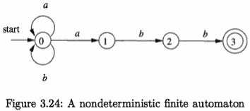

Example 3.14 : The transition graph for an NFA recognizing the language of regular expression **(a|b)\*abb** . 

---

<h2 id="2ebef3028849a4dc0909d534069b2316"></h2>


### 3.6.2 Transition Tables

We can also represent an NFA by a **transition table**, whose rows correspond to states, and whose columns correspond to the input symbols and ε. 

The entry for a given state and input is the value of the transition function applied to those arguments. If the transition function has no information about that state-input pair, we put ∅ in the table for the pair.

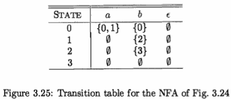

The transition table has the advantage that we can easily find the transitions on a given state and input. Its disadvantage is that it takes a lot of space, when the *input alphabet* is large, yet most states do not have any moves on most of the input symbols.

---

<h2 id="7de19e880b9825779ec50e33458727d7"></h2>


### 3.6.3 Acceptance of Input Strings by Automata

An NFA *accepts* input string x if and only if there is some path in the transition graph from the *start state* to one of the **accepting states**, such that the symbols along the path spell out x. Note that ε labels along the path are effectively ignored, since the empty string does not contribute to the string constructed along the path.

The language *defined* (or *accepted*) by an NFA is the set of strings labeling some path from the start to an accepting state. 

As was mentioned, the NFA of Fig. 3.24 defines the same language as does the regular expression **(a|b)\*abb**, that is, all strings from the alphabet {a, b} that end in *abb*. We may use L(A) to stand for the language accepted by automaton A.

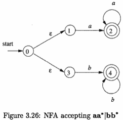

Example 3.17: Figure 3.26 is an NFA accepting L(aa\*|bb\*). String *aaa* is accepted. 

---

<h2 id="4870f1974b0dd964c769b59b181d7226"></h2>


### 3.6.4 Deterministic Finite Automata

A *deterministic finite automaton* (DFA) is a special case of an NFA where:

 1. There are no moves on input ε, and
 2. For each state S and input symbol α, there is exactly one edge out of s labeled α.

If we are using a transition table to represent a DFA, then each entry is a single state. we may therefore represent this state without the curly braces (eg.`{0,1}`)  that we use to form sets.

While the NFA is an abstract representation of an algorithm to recognize the strings of a certain language, the DFA is a simple, concrete algorithm for recognizing strings. 

It is fortunate indeed that every regular expression and every NFA can be converted to a DFA accepting the same language, because it is the DFA that we really implement or simulate when building lexical analyzers. 

The following algorithm shows how to apply a DFA to a string.

Algorithm 3.18 : Simulating a DFA.

 - INPUT: An input string x terminated by an end-of-file character **eof**. A **DFA** *D* with start state *s₀*, accepting states *F*, and transition function *move*.
 - OUTPUT: Answer "yes" if D accepts x; "no" otherwise.
 - METHOD: Apply the algorithm in Fig. 3.27 to the input string x. The function move(s, c) gives the state to which there is an edge from state s on input c. The function *nextChar* returns the next character of the input string x.

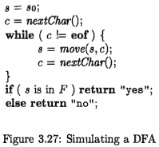

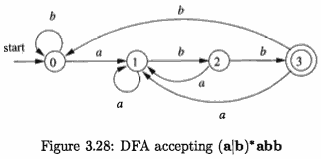

Example 3.19 : In Fig. 3.28 we see the transition graph of a DFA accepting the language **(a|b)\*abb**. Given the input string *ababb*, this DFA enters the sequence of states 0,1,2,1,2,3 and returns "yes." 

---

<h2 id="6fb5154a96390d272c49cb3c414c0fb4"></h2>


## 3.7 From Regular Expressions to Automata

Often it is important to convert an NFA to a DFA that accepts the same language.

 - We first show how to convert NFA's to DFA's. 
 - Then, we use this technique, known as "the subset construction," to give a useful algorithm for simulating NFA's directly, 
    - in situations (other than lexical analysis) where the NFA-to-DFA conversion takes more time than the direct simulation. 
 - Next, we show how to convert regular expressions to NFA's, 
    - from which a DFA can be constructed if desired. 

We conclude with a discussion of the time-space tradeoffs inherent in the various methods for implementing regular expressions, and see how to choose the appropriate method for your application.

---

<h2 id="178a1d8d1d4772d490da973fd009261e"></h2>


### 3.7.1 Conversion of an NFA to a DFA

The general idea behind the subset construction is that each state of the constructed DFA corresponds to a set of NFA states. After reading input a₁a₂...an, the DFA is in that state which corresponds to the set of states that the NFA can reach, from its start state, following paths labeled a₁a₂...an. 

It is possible that the number of DFA states is exponential in the number of NFA states, which could lead to diffculties when we try to implement this DFA.  However, part of the power of the automaton-based approach to lexical analysis is that for real languages, the NFA and DFA have approximately the same number of states, and the exponential behavior is not seen.

Algorithm 3.20 : The *subset construction* of a DFA from an NFA. 

 - INPUT: An NFA *N*.
 - OUTPUT: A DFA *D* accepting the same language as N
 - METHOD: Our algorithm constructs a transition table *Dtran* for D. 
     - Each state of D is a set of NFA states, 
         - and we construct Dtran so D will simulate "in parallel" all possible moves N can make on a given input string. 
     - Our first problem is to deal with ε-transitions of N properly. 
         - In Fig. 3.31 we see the definitions of several functions that describe basic computations on the states of N that are needed in the algorithm. 

Note that s is a single state of N, while T is a set of states of N.

OPERATION | DESCRIPTION
--- | ---
ε-closure(s) | Set of NFA states reachable from NFA state s on ε-transitions alone.
ε-closure(T) | Set of NFA states reachable from some NFA state s in set T on ε-transitions alone; = U<sub>s in T</sub> ε-closure(s).
move(T,a) | Set of NFA states to which there is a transition on input symbol α from some state s in T.

Figure 3.31: Operations on NFA states

As a basis, before reading the first input symbol, N can be in any of the states of ε-closure(s₀), where s₀ is its start state. 

For the induction, suppose that N can be in set of states T after reading input string x. If it next reads input α , then N can immediately go to any of the states in move(T, α). However, after reading α, it may also make several ε-transitions; thus N could be in any state of ε-closure(move(T, α)) after reading input xα. Following these ideas, the construction of the set of D's states, *Dstates*, and its transition function *Dtran*, is shown in Fig.3.32.

```java
while ( there is an unmarked state T in Dstates ) {
    mark T;
    for ( each input symbol a ) {
        U = ε-closure(move(T,a)); 
        if ( U is not in Dstates )
            add U as an unmarked state to Dstates; 
        Dtran[T, a] = U;
    }
}
```  

Figure 3.32: The subset construction

The start state of D is ε-closure(s₀), and the accepting states of D are all those sets of N's states that include at least one accepting state of N. To complete our description of the subset construction, we need only to show how initially, ε-closure(s₀) is the only state in Dstates, and it is unmarked; ε-closure(T) is computed for any set of NFA states T. 

This process, shown in Fig. 3.33, is a straightforward search in a graph from a set of states. In this case, imagine that only the ε-labeled edges are available in the graph.


```java
push all states of T onto stack;
initialize ε-closure(T) to T; 
while ( stack is not empty ) {
    pop t, the top element, off stack;
    for(each state u with an edge from t to u labeled ε)
        if ( u is not in ε-closure(T) ) { 
            add u to ε-closure(T);
            push u onto stack; 
        }
}
```

Figure 3.33: Computing ε-closure(T)


Example 3.21 : Figure 3.34 shows another NFA accepting **(a|b)\*abb**; it hap­pens to be the one we shall construct directly from this regular expression in Section 3.7. Let us apply Algorithm 3.20 to Fig. 3.29.

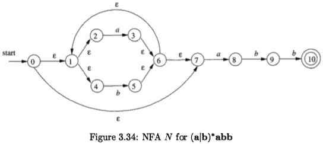

The start state A of the equivalent DFA is ε-closure(0), or A = {0, 1, 2, 4, 7}. Note that a path can have zero edges, so state 0 is reachable from itself by an ε-labeled path.

The input alphabet is {a, b}. Thus, our first step is to mark A and compute Dtran[A, a] = ε-closure( move(A, a)) and Dtran[A, b] = ε-closure(move(A, b)).

Among the states 0, 1, 2, 4, and 7, only 2 and 7 have transitions on a, to 3 and 8, respectively. Thus, move(A, a) = {3, 8}. Also, ε-closure({3, 8} = {1, 2, 3, 4, 6, 7, 8}, so we conclude

```
Dtran[A,a]= ε-closure(move(A,a))= ε-closure({3,8})= {1,2,3,4,6,7,8}
```

Let us call this set B, so Dtran[A, a] = B.


Now, we must compute Dtran[A, b]. Among the states in A, only 4 has a transition on b, and it goes to 5. Thus,

```
Dtran[A, b] = ε-closure({5}) = {1, 2, 4, **5** 6, 7}
```

Let us call the above set C, so Dtran[A, b] = C.  (注: 原书中并没有状态5， 但是按理应该有状态5)

NFA STATE | DFA STATE | a | b
--- | --- | --- | ---
{0,1,2,4,7} |  A | B| C 
{1,2,3,4,6,7,8} | B | B| D 
{1,2,4,5,6,7}  | C | B | C 
{1,2,4,5,6,7,9} | D | B| E 
{1,2,3,5,6,7,10} | E | B| C

> Figure 3.35:  Transition table Dtran for DFA D

If we continue this process with the unmarked sets B and C, we eventually reach a point where all the states of the DFA are marked. 

This conclusion is guaranteed, since there are "only" 2¹¹ different subsets of a set of eleven NFA states.

The five different DFA states we actually construct, their correspond­ing sets of NFA states.

The transition table for the DFA D are shown in Fig. 3.35, and the transition graph for D is in Fig. 3.36.


![][336]

> Figure 3.36: Result of applying the subset construction to Fig. 3.34

State A is the start state, and state E, which contains state 10 of the NFA, is the only accepting state.

Note that D has one more state than the DFA of Fig. 3.28 for the same lan­guage. States A and C have the same move function, and so can be merged. We discuss the matter of minimizing the number of states of a DFA in Section 3.9.6.

---

<h2 id="d72575cbdcfb9adb060d4493ead39c36"></h2>


### 3.7.2 Simulation of an NFA

A strategy that has been used in a number of text-editing programs is to con­struct an NFA from a regular expression and then simulate the NFA using something like an on-the-fly subset construction. The simulation is outlined below.

Algorithm 3.22 : Simulating an NFA.

 - INPUT: 
     - An input string *x* terminated by an end-of-flle character **eof**. 
     - An NFA *N* with start state s₀, accepting states *F*, and transition function *move*.
 - OUTPUT: Answer "yes" if *M* accepts *x* ; "no" otherwise.
 - METHOD: The algorithm keeps a set of current states S, those that are reached from s₀ following a path labeled by the inputs read so far. If c is the next input character, read by the function *nextChar*(), then we first compute *move*(S, c) and then close that set using ε-closure(). The algorithm is sketched in Fig.3.37.

```java
S = ε-closure(s₀);  // 1)
c = nextChar();
while( c!=eof ) {
    S = ε-closure(move(S, c)) ;  // 4)
    c = nextChar();
}
if( S ∩ F != ∅ )return "yes";
else return "no" ;
```

> Figure 3.37: Simulating an NFA

---

<h2 id="8906dbe3b6522fc4916054cac3ea1bf6"></h2>


### 3.7.3 Effciency of NFA Simulation

If carefully implemented, Algorithm 3.22 can be quite effcient.

As the ideas involved are useful in a number of similar algorithms involving search of graphs, we shall look at this implementation in additional detail. The data structures we need are:

 1. Two stacks, each of which holds a set of NFA states. 
     - One of these stacks, *oldStates*, holds the "current" set of states, 
         - i.e., S in *move*(S, c) of line (4)  
     - The second, *newStates*, holds the "next" set of states 
         - S on the left side of line (4) . Unseen is a step where, as we go around the loop of lines (3) through (6), newStates is transferred to oldStates.
 2. A boolean array *alreadyOn* 
     - indexed by the NFA states, to indicate which states are in *newStates*. 
     - While the array and stack hold the same infor­mation, it is much faster to interrogate *alreadyOn*[s] than to search for state s on the stack *newStates*. 
 3. A two-dimensional array *mover*[s,a]
     - holding the transition table of the NFA. 
     - The entries in this table, which are sets of states, are represented by linked lists.

To implement line (1) of Fig. 3.37, we need to set each entry in array *al­readyOn* to FALSE, then for each state s in ε-closure(s₀), push s onto *oldStates* and set alreadyOn[s] to TRUE.  This operation on state s, (line (4) as well) , are facilitated by a function we shall call *addState*(s).

```java
addState(s) {
    push s onto newStates;
    alreadyOn[sJ = TRUE; 
    for ( t on move[s,ε] )
        if ( ! alreadyOn(t) ) 
            addState(t) ;
}
```

> Figure 3.38: Adding a new state s, which is known not to be on newStates

This function calls itself recursively on the states in move[s,ε] in order to further the computation of ε-closure(s).

We implement line (4) of Fig. 3.37 by looking at each state s on *oldStates*.

We first find the set of states move[s, c],  and for each of those states that is not already on *newStates*, we apply *addState* to it. Note that *addState* has the effect of computing the ε-closure and adding all those states to newStates as well, if they were not already on. This sequence of steps is summarized in Fig. 3.39.

```java
for ( s on oldStates ) {   // 16
    for ( t on move[s, c] )
        if ( ! alreadyOn[t] ) 
            addState(t) ;
        pop s from oldStates;  // 20
}
for ( s on newStates ) {  // 22
    pop s from newStates; 
    push s onto oldStates; 
    alreadyOn[s] = FALSE;
}
```

> Figure 3.39: Implementation of step (4) of Fig. 3.37

---

<h2 id="63ba62bd1272233558990dfb81e26ee2"></h2>


### 3.7.4 Construction of an NFA from a Regular Expression

We now give an algorithm for converting any regular expression to an NFA that defines the same language. 

The algorithm is syntax-directed, in the sense that it works recursively up the parse tree for the regular expression. For each subexpression the algorithm constructs an NFA with a single accepting state.

Algorithm 3.23 : The McNaughton-Yamada-Thompson algorithm to convert a regular expression to an NFA.

 - INPUT: A regular expressioll *r* over alphabet Σ.  
 - OUTPUT: An NFA *N* accepting *L(r)*.
 - METHOD: Begin by parsing *r* into its constituent subexpressions. 
     - The rules for constructing an NFA &nbsp; consist of basis rules for handling subexpressios with no operators, 
     - and inductive rules for constructing larger NFA's from the NFA's for the immediate subexpressions of a given expression.

**BASIS**: For expression ε construct the NFA 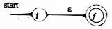

Here, *i* is a new state, the start state of this NFA, and *f* is another new state, the accepting state for the NFA.

For any subexpressiop *a* in Σ , construct the NFA 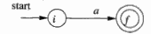

where again *i* and *f* are new states, the start and accepting states, respectively. Note that in both of the basis constructions, we construct a distinct NFA, with new states, for every occurrence of ε or some *a* as a subexpression of *r*.

**INDUCTION**: Suppose *N(s)* and *N(t)* are NFA's for regular expressions *s* and *t*, respectively.

 - a) Suppose r = s|t. Then N(r) is constructed as in Fig. 3.40.
     - 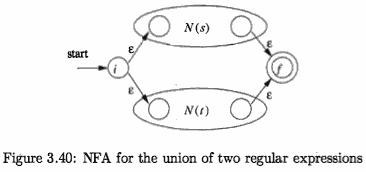
     - Here, *i* and *j* are new states, the start and accepting states of *N(r)* , respectively.
     - There are ε-transitions from *i* to the start states of *N(s)* and *N(t)*, and each of their accepting states have ε-transitions to the accepting state *j*.
     - Note that the accepting states of *N(s)* and *N(t)* are not accepting in *N(r)*.
         - Since any path from i to j must pass through either N(s) or N(t) exclusively, 
         - and since the label of that path is not changed by the ε's leaving i or entering j.
     - we conclude that *N(r)* accepts *L(s) ∪ L(t)*, which is the same as *L(r)*. That is, Fig. 3.40 is a correct construction for the union operator.
 - b) Suppose *r* = *st*. Then construct *N(r)* as in Fig. 3.41.
     - 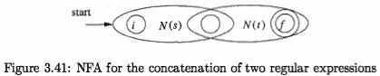
     - The start state of *N(s)* becomes the start state of *N(r)*, and the accepting state of *N(t)* is the only accepting state of *N(r)*.
     - The accepting state of *N(s)* and the start state of *N(t)* are merged into a single state.
     - A path from i to j in Fig. 3.41 must go first through N(s), and therefore its label will begin with some string in L(s). The path then continues through N(t), so the path's label  finishes with a string in L(t). 
     - As we shall soon argue, accepting states never have edges out and start states never have edges in, so it is not possible for a path to re-enter N(s) after leaving it. Thus, *N(r)* accepts exactly *L(s)L(t)*, and is a correct NFA for *r=st*.
 - c) Suppose *r* = *s\** . Then for *r* we construct the NFA *N(r)* shown in Fig. 3.42. 
     - 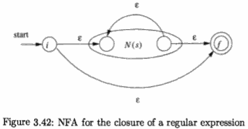
     - Here, *i* and *f* are new states, the start state and lone accepting state of *N(r)*.
     - So the entire set of strings accepted by *N(r)* is *L(s\*)*.
 - d) Finally, suppose *r* = *(s)*. Then *L(r)* = *L(s)*, and we can use the NFA *N(s)* as *N(r)*.

The method description in Algorithm 3.23 contains hints as to why the inductive construction works as it should.

We shall list several properties of the constructed NFA's 

 1. *N(r)* has at most twice as many states as there are operators and operands in *r*. 
     - This bound follows from the fact that each step of the algorithm creates at most two new states.
 2. *N(r)* has one start state and one accepting state. 
     - The accepting state has no outgoing transitions, and the start state has no incoming transitions.
 3. Each state of *N(r)* other than the accepting state has either one outgoing transition on a symbol in Σ or two outgoing transitions, both on ε. ???

Example 3.24 : Let us use Algorithm 3.23 to construct an NFA for r = **(a|b)\*abb**.

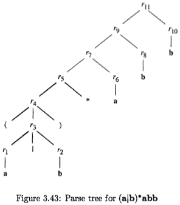

Figure 3.43 shows a parse tree for *r* that is analogous to the parse trees constructed for Arithmetic expressions in Section 2.2.3. 

For subexpression r₁ , the first a, we construct the NFA: 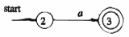

State numbers have been chosen for consistency with what follows. 

For r₂ we construct: 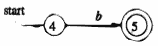

We can now combine N(r₁) and N(r₂), using the construction of Fig. 3.40 to obtain the NFA for *r₃ = r₁|r₂* :

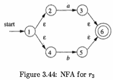

The NFA for r₄ = (r₃) is the same at that for r₃.

The NFA for *r₅ = (r₃)\** is then as shown in Fig. 3.45. We have used the construction in Fig. 3.42 to build this NFA.

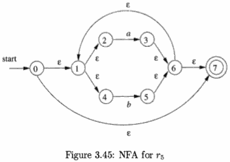

Now, consider subexpression r₆ , whlch is another **a**. We use the basis con­struction for *a* again, but we must use new states. It is not permissible to reuse the NFA we constructed for r₁ , even though r₁ and r₆ are the same expression. The NFA for r₆ is: 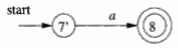

To obtain the NFA for r₇ = r₅|r₆, we apply the construction of Fig. 3.41. 

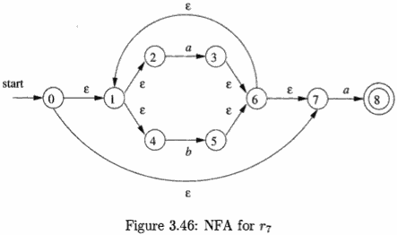

We merge states 7 and 7'. Continuing in this fashion with new NFA's for the two subexpressions b called r₈ and r₁₀ , we eventually construct the NFA for **(a|b)\*abb** that we first met in Fig. 3.34. 

---

<h2 id="d3b6cfc6bff4c4985298cd4b6ccd8806"></h2>


### 3.7.5 Efficiency of String-Processing Algorithms

We observed that Algorithm 3.18 processes a string x in time *O(|x|)*, while in Section 3.7.3 we concluded that we could simulate an NFA in time proportional to the product of *|x|* and the size of the NFA's transition graph. Obviously, it is faster to have a DFA to simulate than an NFA, so we might wonder whether it ever makes sense to simulate an NFA.

One issue that may favor an NFA is that the subset construction can exponentiate the number of states ( in worst case ). While in principle, the number of DFA states does not influence the running time of Algorithm 3.18, should the number of states become so large that the transition table does not fit in main memory, then the true running time would have to include disk I/O and therefore rise noticeably.

AUTOMATON | INITIAL | PER STRING
--- | --- | ---
NFA | O(\|r\|) | O(\|r\| x \|x\|)
DFA typical case | O(\|r\|³) | O(\|x\|)
DFA worst case | O(\|r\|²2<sup>\|r\|</sup>)  | O(\|x\|)

---

<h2 id="9be0f70930b6a8eaced083f8e54612e4"></h2>


## 3.8 Design of a Lexical-Analyzer Generator

In this section we shall apply the techniques presented in Section 3.7 to see how a lexical-analyzer generator such as **Lex** is architected. We discuss two approaches, based on NFA's and DFA's; the latter is essentially the implementation of **Lex**.

---

<h2 id="bc1a201f9c5d4a767a356a8f7c8e2539"></h2>


### 3.8.1 The Structure of the Generated Analyzer

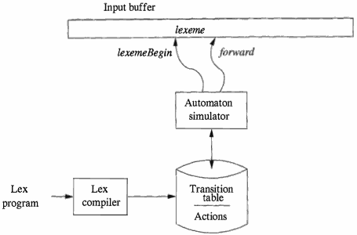

> Figure 3.49: A Lex program is turned into a transition table and actions, which are used by a finite-automaton simulator

Figure 3.49 overviews the architecture of a lexical analyzer generated by **Lex**. The program that serves as the lexical analyzer includes a fixed program that simulates an automaton; at this point we leave open whether that automaton is deterministic or nondeterministic. 

The rest of the lexical analyzer consists of components that are created from the Lex program by Lex itself.

These components are:

 1. A transition table for the automaton.
 2. Those functions that are passed directly through **Lex** to the output.
 3. The actions from the input program, which appear as fragments of code to be invoked at the appropriate time by the automaton simulator.

To construct the automaton, we begin by taking each regular-expression pattern in the **Lex** program and converting it, using Algorithm 3.23, to an NFA. 

We need a single automaton that will recognize lexemes matching any of the patterns in the program, so we combine all the NFA's into one by introducing a new start state with ε-transitions to each of the start states of the NFA's Nᵢ for pattern *pᵢ*. This construction is shown in Fig. 3.50.

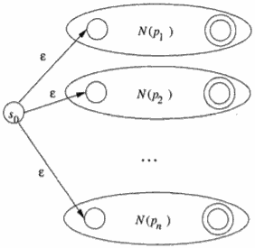

> Figure 3.50: An NFA constructed from a Lex program

Example 3.26 : We shall illustrate the ideas of this section with the following simple, abstract example:

```java
a     { action A₁ for pattern p₁ } 
abb { action A₂ for pattern p₂ } 
a*b+ { action A₃ for pattern p₃ }
```

Note that these three patterns present some conflict of the type discussed in Section 3.5.3. 

 - string **abb** matches both the second and third patterns, but we shall consider it a lexeme for pattern P₂ 
     - since that pattern is listed first in the above Lex program
 - Then, input strings such as *aabbb*... have many prefixes that match the third pattern. The Lex rule is to take the longest

Fig. 3.52 shows these three NFA's combined into a single NFA by the addition of start state 0 and three ε-transitions. 

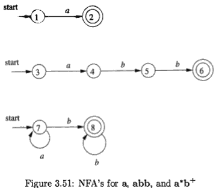

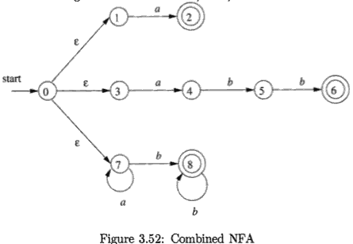

---

<h2 id="591c0cef90e7cc631724a82526181aa7"></h2>


### 3.8.2 Pattern Matching Based on NFA's

If the lexical analyzer simulates an NFA such as that of Fig. 3.52, then it must read input beginning at the point on its input which we have referred to as *lexemeBegin*. As it moves the pointer called *forward* ahead in the input, it calculates the set of states it is in at each point, following Algorithm 3.22 (Simulating an NFA).

Eventually, the NFA simulation reaches a point on the input where there are no next states. At that point, there is no hope that any longer prefix of the input would ever get the NFA to an accepting state; rather, the set of states will always be empty. Thus, we are ready to decide on the longest prefix that is a lexeme matching some pattern.

We look backwards in the sequence of sets of states, until we find a set that includes one or more accepting states. 

If there are several accepting states in that set, pick the one associated with the earliest pattern pᵢ in the list from the **Lex** program. Move the *forward* pointer back to the end of the lexeme, and perform the action Aᵢ associated with pattern pᵢ.

Example 3.27 : Suppose we have the patterns of Example 3.26 and the input begins aaba. 

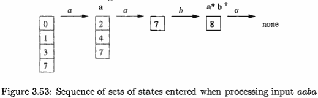

Figure 3.53 shows the sets of states of the NFA of Fig. 3.52 that we enter, 

 - starting with ε-closure of the initial state 0, which is {O, 1, 3, 7}, and proceeding from there. 
 - After reading the fourth input symbol, we are in an empty set of states, since in Fig. 3.52, there are no transitions out of state 8 on input a.

Thus, we need to back up, looking for a set of states that includes an ac­cepting state. 

Notice that, as indicated in Fig. 3.53, 

 - after reading *a* we are in a set that includes state 2 and therefore indicates that the pattern **a** has been matched. 
 - However, after reading *aab*, we are in state 8, which indicates that **a\*b+** has been matched; 

prefix *aab* is the longest prefix that gets us to an accepting state. We therefore select *aab* as the lexeme, and execute action A₃ , which should include a return to the parser indicating that the token whose pattern is P₃ = **a\*b+** has been found.

---

<h2 id="560deab5107ca190345913cc30cdd379"></h2>


### 3.8.3 DFA's for Lexical Analyzers

Another architecture, resembling the output of **Lex**, is to convert the NFA for all the patterns into an equivalent DFA, using the subset construction of Algorithm 3.20. 

Within each DFA state, if there are one or more accepting NFA states, determine the first pattern whose accepting state is represented, and make that pattern the output of the DFA state.

Example 3.28 : Figure 3.54 shows a transition diagram based on the DFA that is constructed by the subset construction from the NFA in Fig. 3.52. 

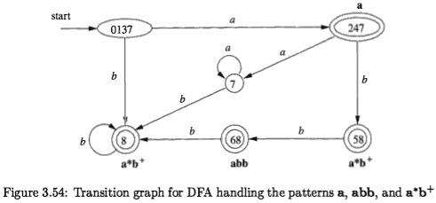

The accepting states are labeled by the pattern that is identified by that state. 

For instance, the state {6, 8} has two accepting states, corresponding to patterns **abb** and **a\*b+**. Since the former is listed first, that is the pattern associated withstate{6,8}. 

We use the DFA in a lexical analyzer much as we did the NFA. We simulate the DFA until at some point there is no next state (or strictly speaking, the next state is ∅, the *dead state* corresponding to the empty set of NFA states) . At that point, we back up through the sequence of states we entered and, as soon as we meet an accepting DFA state, we perform the action associated with the pattern for that state.

Example 3.29 : Suppose the DFA of Fig. 3.54 is given input *abba*. The se­quence of states entered is 0137, 247, 58, 68, and at the final *a* there is no tran­sition out of state 68. Thus, we consider the sequence from the end, and in this case, 68 itself is an accepting state that reports pattern p₂ = **abb**.

---

<h2 id="842ebc90f1674282757f47268758cd3a"></h2>


### 3.8.4 Implementing the Lookahead Operator

Recall from Section 3.5.4 that the **Lex** lookahead operator / in a Lex pattern r₁/r₂ is sometimes necessary, because the pattern r₁ for a particular token may need to describe some trailing context r₂ in order to correctly identify the actual lexeme.

When converting the pattern r₁/r₂ to an NFA, we treat the / as if it were ε, so we do not actually look for a / on the input. However, if the NFA recognizes a prefix *xy* of the input buffer *as matching this regular expression*, the end of the lexeme is not where the NFA entered its accepting state. Rather the end occurs when the NFA enters a state *s* such that

 1. *s* has an ε-transition on the (imaginary) /
 2. There is a path from the start state of the NFA to state *s* that spells out *x*.
 3. There is a path from state *s* to the accepting state that spells out *y*.
 4. *x* is as long as possible for any *xy* satisfying conditions 1-3.

If there is only one ε-transition state on the imaginary / in the NFA, then the end of the lexeme occurs when this state is entered for the last time as the following example illustrates. If the NFA has more than one ε-transition state on the imaginary /, then the general problem of finding the correct state *s* is much more difficult.

Example 3.30 : An NFA for the pattern for the Fortran **IF** with lookahead, from Example 3.13.

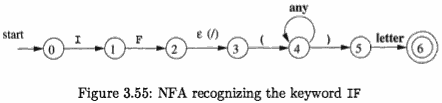

Notice that the ε-transition from state 2 to state 3 represents the lookahead operator. State 6 indicates the pres­ence of the keyword **IF**. However, we find the lexeme **IF** by scanning backwards to the last occurrence of state 2, whenever state 6 is entered.


---

**Dead States in DFA's**

Technically, the automaton in Fig. 3.54 is not quite a DFA. 

The reason is that a DFA has a transition from every state on every input symbol in its input alphabet. Here, we have omitted transitions to the dead state ∅, and we have therefore omitted the transitions from the dead state to itself on every input. Previous NFA-to-DFA examples did not have a way to get from the start state to ∅, but the NFA of Fig. 3.52 does.

However, when we construct a DFA for use in a lexical analyzer, it is important that we treat the dead state differently, since we must know when there is no longer any possibility of recognizing a longer lexeme. Thus, we suggest always omitting transitions to the dead state and elimi­nating the dead state itself. 

In fact, the problem is harder than it appears, since an NFA-to-DFA construction may yield several states that cannot reach any accepting state, and we must know when any of these states have been reached. Section 3.9.6 discusses how to combine all these states into one dead state, so their identification becomes easy. It is also inter­esting to note that if we construct a DFA from a regular expression using Algorithms 3.20 and 3.23, then the DFA will not have any states besides ∅ that cannot lead to an accepting state.

---

<h2 id="fd5afa6bcd74b9b2aa4ece82a8f4e8c2"></h2>


## 3.9 Optimization of DFA-Based Pattern Matchers

In this section we present three algorithms that have been used to implement and optimize pattern matchers constructed from regular expressions.

 1. The first algorithm is useful in a **Lex** compiler, because it constructs a DFA directly from a regular expression, without constructing an interme­diate NFA. 
     - The resulting DFA also may have fewer states than the DFA constructed via an NFA.
 2. The second algorithm minimizes the number of states of any DFA, by combining states that have the same future behavior. 
    - The algorithm itself is quite efficient, running in time O(nlogn), where n is the number of states of the DFA.
 3. The third algorithm produces more compact representations of transition tables than the standard, two-dimensional table.

---

<h2 id="cfa97bca3bad7182d66db81969204ef9"></h2>


### 3.9.1 Important States of an NFA

To begin our discussion of how to go directly from a regular expression to a DFA, we must first dissect the NFA construction of Algorithm 3.23 and consider the roles played by various states. 

We call a state of an NFA *important* if it ***has*** a non-ε out-transition. Notice that the subset construction (Algorithm 3.20) uses only the important states in a set *T* when it computes *ε-closure(move(T, a))*, the set of states reachable from *T* on input *a*. That is, the set of states *move(s, a)* is nonempty only if state *s* is important. 

During the subset construction, two sets of NFA states can be identified (treated as if they were the same set) if they:

 1. Have the same important states, and
 2. Either both have accepting states or neither does.

When the NFA is constructed from a regular expression by Algorithm 3.23, we can say more about the important states. The only important states are those introduced as initial states in the basis part for a particular symbol posi­tion in the regular expression. That is, each important state corresponds to a particular operand in the regular expression.

The constructed NFA has only one accepting state, but this state, having no out-transitions, is not an important state. By concatenating a unique right endmarker # to a regular expression *r*, we give the accepting state for *r* a transition on #, making it an important state of the NFA for (r)#. In other words, by using the *augmented* regular expression (r)#, we can forget about accepting states as the subset construction proceeds; when the construction is complete, any state with a transition on # must be an accepting state.

The important states of the NFA correspond directly to the positions in the regular expression that hold symbols of the alphabet. It is useful, as we shall see, to present the regular expression by its syntax tree, where the leaves correspond to operands and the interior nodes correspond to operators. An interior node is called a *cat-node*, *or-node*, or *star-node* if it is labeled by the concatenation operator (dot) , union operator | , or star operator \*, respectively. We can construct a syntax tree for a regular expression just as we did for arithmetic expressions in Section 2.5.1.

Example 3.31 : Figure 3.56 shows the syntax tree for the regular expression of our running example. 

![][1]

Cat-nodes are represented by circles.

Leaves in a syntax tree are labeled by ε or by an alphabet symbol. To each leaf not labeled ε , we attach a unique integer. We refer to this integer as the *position* of the leaf and also as a position of its symbol.

Note that a symbol can have several positions; for instance, *a* has positions 1 and 3 in Fig. 3.56.

The positions in the syntax tree correspond to the important states of the constructed NFA.

Example 3.32 : Figure 3.57 shows the NFA for the same regular expression as Fig. 3.56, with the important states numbered and other states represented by letters.

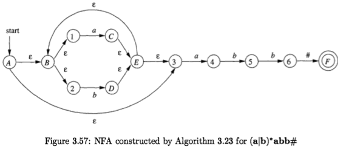

The numbered states in the NFA and the positions in the syntax tree correspond in a way we shall soon see.

---

<h2 id="ccaa63c1798e41e31f9f8e8a2091aac9"></h2>


### 3.9.2 Functions Computed From the Syntax Tree

To construct a DFA directly from a regular expression, we construct its syntax tree and then compute four functions: **nullable**, **firstpos**, **lastpos**, and **followpos**, defined as follows.

Each definition refers to the syntax tree for a particular augmented regular expression (r)#.

 1. *nullable(n)* is true for a syntax-tree node n if and only if the subexpression represented by n has ε in its language. 
     - That is, the subexpression can be "made null" or the empty string, even though there may be other strings it can represent as well.
 2. *firstpos(n)* is the set of positions in the subtree rooted at n 
     - Those positions corre­spond to the first symbol of at least one string in the language of the subexpression rooted at n.
 3. *lastpos(n)* is the set of positions in the subtree rooted at n 
     - Those positionst corre­spond to the last symbol of at least one string in the language of the subexpression rooted at n.
 4. *followpos(p)*, for a position *p*, is the set of positions *q* in the *entire syntax tree* 
     - such that there is some string x = a₁a₂...a<sub>n</sub> in L((r)#) such that for some *i*, there is a way to explain the membership of x in L((r)#) by matching aᵢ to position *p* of the syntax tree and aᵢ₊₁ to position *q*.

Example 3.33 : Consider the cat-node n in Fig. 3.56 that corresponds to the expression **(a|b)\*a**. 

We claim nullable(n) is false, since this node generates all strings of a's and b's ending in an *a*; it does not generate ε . On the other hand, the star-node below it is nullable; it generates ε along with all other strings of a's and b's.

*Firstpos(n)*= {1,2,3}. 

 - In a typical generated string like *aa*, the first position of the string corresponds to position 1 of the tree, 
 - and in a string like *ba*, the first position of the string comes from position 2 of the tree. 
 - However, when the string generated by the expression of node n is just *a*, then this a comes from position 3.

*lastpos(n)* = {3}. 

 - That is, no matter what string is generated from the expression of node n, the last position is the *a* from position 3 of the tree.

*followpos* is trickier to compute, but we shall see the rules for doing so shortly. Here is an example of the reasoning: *followpos(1)* = {1, 2, 3}. 

 - Consider a string *...ac...* , where the *c* is either *a* or *b*, and the *a* comes from position 1. That is, this *a* is one of those generated by the *a* in expression **(a|b)\*.** This a could be followed by another *a* or *b* coming from the same subexpression, in which case *c* comes from position 1 or 2. It is also possible that this a is the last in the string generated by (a|b)\*, in which case the symbol c must be the *a* that comes from position 3. Thus, 1, 2, and 3 are exactly the positions that can follow position 1.

---

<h2 id="9d510c7a831f62018cae56836a266769"></h2>


### 3.9.3 Computing *nullable*, *firstpos*, and *lastpos*

We can compute *nullable*, *firstpos*, and *lastpos* by a straightforward recursion on the height of the tree. The basis and inductive rules for *nullable* and *firstpos* are summarized in Fig. 3.58. The rules for *lastpos* are essentially the same as for firstpos, but the roles of children c₁ and c₂ must be swapped in the rule for a cat-node.

 Node n | *nullable(n)* | *firstpos(n)*
--- | --- | ---
A leaf labeled ε | true | ∅
A leaf with position i | false | {i}
An or-node n = c₁ \| c₂ | nullable(c₁) or nullable(c₂) | firstpos(c₁) ∪ firstpos(c₂)
A cat-node n = c₁c₂ | nullable(c₁) and nullable(c₂) | if(nullable(c₁))  firstpos(c₁)∪firstpos(c₂)  else firstpos(c₁)
A star-node n = c₁\* | true | firstpos(c₁)

> Figure 3.58: Rules for computing *nullable* and *firstpos*


Example 3.34 : Of all the nodes in Fig. 3.56 only the star-node is nullable. We note from the table of Fig. 3.58 that none of the leaves are nullable, because they each correspond to non-ε operands. 

 - The or-node is not nullable, because neither of its children is. 
 - The star-node is nullable, because every star-node is nullable. 
 - Finally, each of the cat-nodes, having at least one nonnullable child, is not nullable.

The computation of *firstpos* and *lastpos* for each of the nodes is shown in Fig. 3.59, with firstpos(n) to the left of node n, and lastpos(n) to its right.

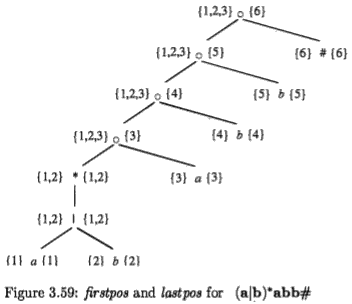

 - Each of the leaves has only itself for firstpos and lastpos, as required by the rule for non-ε leaves in Fig. 3.58. 
 - For the or-node, we take the union of firstpos at the children and do the same for lastpos. 
 - The rule for the star-node says that we take the value of firstpos or lastpos at the one child of that node.
 - Now, consider the lowest cat-node, which we shall call n. 
     - To compute firstpos(n), we first consider whether the left operand is nullable, which it is in this case. Therefore, firstpos for n is the union of firstpos for each of its children, that is {1, 2} ∪ {3} = {1, 2, 3}. 
     - The rule for lastpos does not ap­pear explicitly in Fig. 3.58, but as we mentioned, the rules are the same as for firstpos, with the children interchanged. That is, to compute lastpos(n) we must ask whether its right child (the leaf with position 3) is nullable, which it is not. Therefore, lastpos(n) is the same as lastpos of the right child, or {3}.

---

<h2 id="cb99b99a4bf8d9971dafc9579d962576"></h2>


### 3.9.4 Computing followpos

There are only two ways that a position of a regular expression can be made to follow another.

 1. If n is a cat-node with left child c₁ and right child c₂ , then for every position i in *lastpos(c₁)*, all positions in *firstpos(c₂)* are in *followpos(i)*.
 2. If n is a star-node, and i is a position in *lastpos(n)*, then all positions in *firstpos(n)* are in followpos(i).

Example 3.35: Rule 1 for *followpos* requires that we look at each cat-node, and put each position in firstpos of its right child in followpos for each position in lastpos of its left child. 

For the lowest cat-hode in Fig. 3.59, that rule says position 3 is in followpos(1) and followpos(2). The next cat-node above says that 4 is in followpos(3), and the remaining two cat-nodes give us 5 in followpos(4) and 6 in followpos(5).

We must also apply rule 2 to the star-node. That rule tells us positions 1 and 2 are in both followpos(1) and followpos(2), since both *firstpos* and *lastpos* for this node are {1, 2}. The complete sets *followpos* are summarized in Fig. 3.60.

NODE n | followpos(n)
--- | ---
1     | {1,2,3}
2     | {1,2,3}
3     | {4}
4    | {5}
5    | {6}
6     | ∅

> Figure 3.60: The function followpos

We can represent the function *followpos* by creating a directed graph with a node for each position and an arc from position i to position j if and only if j is in followpos(i). Figure 3.61 shows this graph for the function of Fig. 3.60.

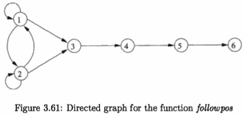

It should come as no surprise that the graph for *followpos* is almost an NFA without ε-transitions for the underlying regular expression, and would become one if we:

 1. Make all positions in firstpos of the root be initial states,
 2. Label each arc from i to j by the symbol at position i, and
 3. Make the position associated with endmarker # be the only accepting state.

--- 

<h2 id="fd0a77b3813cb5692d1689d95568daf7"></h2>


### 3.9.5 Converting a Regular Expression Directly to a DFA

**Algorithm 3.36** : Construction of a DFA from a regular expression *r*.

 - INPUT: A regular expression r.
 - OUTPUT: A DFA D that recognizes L(r).
 - METHOD:
     1. Construct a syntax tree T from the augmented regular expression (r)#.
     2. Compute *nullable*, *firstpos*, *lastpos* , and *followpos* for T, using the methods of Sections 3.9.3 and 3.9.4.
     3. Construct *Dstates*, the set of states of DFA D, and *Dtran*, the transition function for *D*, by the procedure of Fig. 3.62. 
         - The states of *D* are sets of positions in T. 
         - Initially, each state is "unmarked," and a state becomes "marked" just before we consider its out-transitions. 
         - The ***start state*** of *D* is *firstpos(n₀)*, where node n₀ is the ***root*** of T. 
             - 根节点的 firstpos -> start state
         - The accepting states are those containing the position for the endmarker symbol #.

```
initialize Dstates to contain only the unmarked state fistpos(n₀), 
    where n₀ is the root of syntax tree T for (r)#;

while ( there is an unmarked state S in Dstates ) { 
    mark S;
    for ( each input symbol a ) {
        let U be the union of followpos(p) for all p
            in S that correspond to a; 
        if( U is not in Dstates )
            add U as an unmarked state to Dstates; 
        Dtran[S, a] = U;
    } 
}
```

> Figure 3.62: Construction of a DFA directly from a regular expression


Example 3.37: We can now put together the steps of our running example to construct a DFA for the regular expression r = **(a|b)\*abb**. The syntax tree for (r)# appeared in Fig. 3.56. 

![][1]

We observed that for this tree, *nullable* is true only for the star-node, and we exhibited firstpos and lastpos in Fig. 3.59. The values of followpos appear in Fig. 3.60.

 - The value of firstpos for the root of the tree is {1, 2, 3}, so this set is the start state of D. 
     - Call this set of states A. 
 - We must compute Dtran[A,a] and Dtran[A, b] . 
     - Among the positions of A, 1 and 3 correspond to a, while 2 corresponds to b. 
     - Thus, Dtran[A, a] = followpos(1) U followpos(3) = {1, 2, 3, 4},
     - and Dtran[A, b] = followpos(2) = {1, 2, 3}. 
 - The latter is state A, and so does not have to be added to *Dstates*, but the former, B= {1,2,3,4},is new,so we add it to *Dstates* and proceed to compute its transitions. 
 - The complete DFA is shown in Fig. 3.63. 

![][363]

---

<h2 id="5f8d48865d5cddabffbed51ce176bcbb"></h2>


### 3.9.6 Minimizing the Number of States of a DFA

There can be many DFA's that recognize the same language. 

For instance, note that the DFA's of Figs. 3.36 and 3.63 both recognize language L((a|b)\*abb). 

> Fig 3.36: ![][336]

Not only do these automata have states with different names, but they don't even have the same number of states. 

If we implement a lexical analyzer as a DFA, we would generally prefer a DFA with as few states as possible, since each state requires entries in the table that describes the lexical analyzer.

The matter of the names of states is minor. We shall say that two automata are *the same up to state names* if one can be transformed into the other by doing nothing more than changing the names of states. Figures 3.36 and 3.63 are not the same up to state names. However, there is a close relationship between the
states of each. 

States A and C of Fig. 3.36 are actually equivalent, in the sense that neither is an accepting state, and on any input they transfer to the same state. Moreover, both states A and C behave like state 123 of Fig. 3.63. Likewise, state B of Fig. 3.36 behaves like state 1234 of Fig. 3.63, state D behaves like state 1235, and state E behaves like state 1236.

It turns out that there is always a unique (up to state names) minimum state DFA for any regular language. Moreover, this minimum-state DFA can be constructed from any DFA for the same language by grouping sets of equivalent states. In the case ofL ((a|b)\*abb), Fig.3.63 is the minimum-state DFA, and it can be constructed by partitioning the states of Fig. 3.36 as {A,C} {B} {D} {E}.

In order to understand the algorithm for creating the partition of states that converts any DFA into its minimum-state equivalent DFA, we need to see how input strings distinguish states from one another. We say that string *x* ***distinguishes*** state *s* from state *t* if exactly one of the states reached from *s* and *t* by following the path with label *x* is an accepting state. State *s* is ***distinguishable*** from state *t* if there is some string that distinguishes them.

> 存在一个 x, 状态 s 转移到一个 nonaccepting state , while 状态 t 转移到一个  accepting state.

Example 3.38 : The empty string distinguishes any accepting state from any nonaccepting state. In Fig. 3.36, the string bb distinguishes state A from state B, since bb takes A to a nonaccepting state C, but takes B to accepting state E.

The state-minimization algorithm works by partitioning the states of a DFA into groups of states that cannot be distinguished. Each group of states is then merged into a single state of the minimum-state DFA. The algorithm works by maintaining a partition, whose groups are sets of states that have not yet been distinguished, while any two states from different groups are known to be distinguishable. When the partition cannot be refined further by breaking any group into smaller groups, we have the minimum-state DFA.

Initially, the partition consists of two groups: the accepting states and the nonaccepting states. 

The fundamental step is to take some group of the current partition, say A={s₁,s₂,... ,s<sub>k</sub>}, and some input symbol *a*, and see whether *a* can be used to distinguish between any states in group A. We examine the transitions from each of s₁,s₂,... ,s<sub>k</sub> on input *a*, and if the states reached fall into two or more groups of the current partition, we split A into a collection of groups, so that sᵢ and sⱼ are in the same group if and only if they go to the same group on input *a*. We repeat this process of splitting groups, until for no group, and for no input symbol, can the group be split further. The idea is formalized in the next algorithm.

Algorithm 3.39 : Minimizing the number of states of a DFA.

 - INPUT: A DFA D with set of states S, input alphabet Σ , state state s₀ , and set of accepting states F.
 - OUTPUT: A DFA D' accepting the same language as D and having as few states as possible.
 - METHOD:
     1. Start with an initial partition ∏ with two groups, F and S - F, the accepting and nonaccepting states of D.
     2. Apply the procedure of Fig. 3.64 to construct a new partition a new partition ∏<sub>new</sub>·
         - Figure 3.64: Construction of  ∏<sub>new</sub> 
         ```
         initially, let ∏_new = ∏  ;
         for ( each group G of ∏ ) {
             partition G into subgroups such that two states s and t
                 are in the same subgroup if and only if for all
                 input symbols a, states s and t have transitions on a 
                 to states in the same group of ∏ ;
             /* at worst, a state will be in a subgroup by itself */
             replace G in ∏_new by the set of all subgroups formed; }
         ```
     3. If ∏<sub>new</sub> = ∏ , let ∏<sub>final</sub> = ∏  and continue with step (4). Otherwise, repeat step (2) with ∏<sub>new</sub> in place of ∏.
     4. Choose one state in each group of ∏<sub>final</sub> as the representative for that group. The representatives will be the states of the minimum-state DFA D'. The other components of D' are constructed as follows:
         - a) The start state of D' is the representative of the group containing the start state of D.
         - b) The accepting states of D' are the representatives of those groups that contain an accepting state of D. 
             - Note that each group contains either only accepting states, or only nonaccepting states, because we started by separating those two classes of states, and the procedure of Fig. 3.64 always forms new groups that are subgroups ofpreviously constructed groups.
         - c) Let *s* be the representative of some group G of ∏<sub>final</sub> , and let the transition of D from *s* on input *a* be to state *t*. Let *r* be the rep­resentative of t's group H. Then in D', there is a transition from *s* to *r* on input *a*. Note that in D, every state in group G must go to some state of group H on input *a*, or else, group G would have been split according to Fig. 3.64.


Example 340 : Let us reconsider the DFA of Fig. 3.36. The initial partition consists of the two groups {A, B, C, D} {E}, which are respectively the nonac­cepting states and the accepting states. 

To construct ∏<sub>new</sub>, the procedure of Fig. 3.64 considers both groups and inputs *a* and *b*. The group {E} cannot be split, because it has only one state, so {E} will remain intact in ∏<sub>new</sub> .

The other group {A, B, C, D} can be split, so we must consider the effect of each input symbol. On input *a*, each of these states goes to state B , so there is no way to distinguish these states using strings that begin with *a*. On input *b*, states A, B, and C go to members of group {A, B, C, D}, while state D goes to E, a member of another group. Thus, in ∏<sub>new</sub>, group {A, B, C, D} is split into {A, B, C}{D}, and ∏<sub>new</sub> for this round is {A, B, C}{D}{E}.

In the next round, we can split {A,B,C} into {A,C}{B}, since A and C each go to a member of {A,B,C} on input *b*, while B goes to a member of another group, {D}. Thus, after the second round, ∏<sub>new</sub> = {A,C}{B}{D}{E}. For the third round, we cannot split the one remaining group with more than one state, since A and C each go to the same state (and therefore to the same group) on each input. We conclude that ∏<sub>final</sub> = {A,C}{B}{D}{E}.

Now, we shall construct the minimum-state DFA. It has four states, corre­sponding to the four groups of ∏<sub>final</sub>, and let us pick A, B, D, and E as the representatives of these groups. The initial state is A, and the only accepting state is E. Figure 3.65 shows the transition function for the DFA. 

 STATE | a | b
:---:| --- | ---
 A | B | A
 B | B | D
 D | B | E
 E | B | A

> Figure 3.65: Transition table of minimum-state DFA

For instance, the transition from state E on input *b* is to A, since in the original DFA, E goes to C on input *b*, and A is the representative of C's group. For the same reason, the transition on *b* from state A is to A itself, while all other transitions are as in Fig. 3.36. 

---

***Eliminating the Dead State***

The minimization algorithm sometimes produces a DFA with one dead state - one that is not accepting and transfers to itself on each input symbol. 

This state is technically needed, because a DFA must have a transition from every state on every symbol. However, as discussed in Section 3.8.3, we often want to know when there is no longer any possibility of acceptance, so we can establish that the proper lexeme has already been seen. Thus, we may wish to eliminate the dead state and use an automaton that is missing some transitions. This automaton has one fewer state than the minimum-state DFA, but is strictly speaking not a DFA, because of the missing transitions to the dead state.

---

---

<h2 id="6968fda06e8f79559037d7f27f3360f9"></h2>


### 3.9.7  State Minimization in Lexical Analyzers

To apply the state minimization procedure to the DFA's generated in Sec­tion 3.8.3, we must begin Algorithm 3.39 with the partition that groups to­gether all states that recognize a particular token, and also places in one group all those states that do not indicate any token. An example should make the extension clear.

Example 3.41 : For the DFA of Fig. 3.54, the initial partition is

```
  {0137,7}{247}{8,58}{7}{68}{∅}
```

 - That is, states 0137 and 7 belong together because neither announces any token. 
 - States 8 and 58 belong together because they both announce token a*b+. 
 - Note that we have added a dead state ∅, which we suppose has transitions to itself on inputs a and b. 
     - The dead state is also the target of missing transitions on *a* from states 8, 58, and 68.

We must split 0137 from 7, because they go to different groups on input *a*. We also split 8 from 58, because they go to different groups on *b*. Thus, all states are in groups by themselves, and Fig. 3.54 is the minimum-state DFA recognizing its thress tokens.

Recall that a DFA serving as a lexical analyzer will normally drop the dead state, while we treat missing transitions as a signal to end token recognition.

---

<h2 id="af4e82fbb4a2e52c6d19d63130637e95"></h2>


### 3.9.8  Trading Time for Space in DFA Simulation

The simplest and fastest way to represent the transition function of a DFA is a two-dimensional table indexed by states and characters. 

Since a typical lexical analyzer has several hundred states in its DFA and involves the ASCII alphabet of 128 input characters, the array consumes less than a megabyte.

However, compilers are also appearing in very small devices, where even a megabyte of storage may be too much. 

For such situations, there are many methods that can be used to compact the transition table. For instance, we can represent each state by a list of transitions -- that is, character-state pairs -- ended by a default state that is to be chosen for any input character not on the list. If we choose as the default the most frequently occurring next state, we can often reduce the amount of storage needed by a large factor.

TODO 


---

[1]:  ../imgs/Compiler_F3.56.png
[336]: ../imgs/Compiler_F3.36.png
[363]: ../imgs/Compiler_F3.63.png


