...menustart

- [Syntax Analysis](#be60f384a98f420abf899da5f654f21f)
    - [4.1 Introduction](#903b7a00b2099a08e9d1369fffac33fc)
        - [4.1.1 The Role of the Parser](#db09e3b8eb4e613bf82a0fc49c46ef04)
        - [4.1.2 Representative Grammars](#404a734496a31abcde4eec096257e383)
        - [4.1.3 Syntax Error Handling](#0a62177a1bdeb055824f516840c228b4)
        - [4.1.4 Error-Recovery Strategies](#e1251b5a6af9cbf01527a7b7594bc9a0)
    - [4.2 Context-Free Grammars](#e18a685fdcbfe35bcf7b3ef29c5dbfee)
        - [4.2.1 The Formal Definition of a Context-free Grammar](#04d3df637c892628792484e05c357c42)
        - [4.2.2 Notational Conventions](#75f9deb3c12ebfe2f88ee567cbb334af)
        - [4.2.3 Derivations](#d4831fa5d1357d7549aa40ad8f772c8d)
        - [4.2.4 Parse Trees and Derivations](#b7e854d42d024d8174345cb2a65ac968)
        - [4.2.5 Ambiguity](#059218b78640920f2df8cc7048533516)
        - [4.2.6 Verifying the Language Generated by a Grammar](#408aaedc6f5c7d56c7665280fda51463)
        - [4.2.7 Context-free Grammars Versus Regular Expressions](#5d6cf78f50765ceea1883e6a1d34f709)
    - [4.3 Writing a Grammar](#f22e7c54d52c4644f7090084666537ee)
        - [4.3.1 Lexical Versus Syntactic Analysis](#950d4af77c33ba0f1745ad3990497880)
        - [4.3.2 Eliminating Ambiguity](#abe716f7277a95401ed271fa2ae04e46)
        - [4.3.3 Elimination of Left Recursion](#624a0832310d892b64c0055c925a43b5)
        - [4.3.4 Left Factoring](#be643cb3f54982ef5068037f07328208)
        - [4.3.5 Non-Context-Free Language Constructs](#6ab35fc39c91036ee511ab32ec742e63)
    - [4.4 Top-Down Parsing](#fdd5630c22d395b531ee91bd1e3729ac)
        - [4.4.1 Recursive-Descent Parsing](#47aaef28c6f12ae46c447c552fea2bfc)
        - [4.4.2 FIRST and FOLLOW](#0c9442bd1b7a93aefc72edca1708382f)
        - [4.4.3 LL(1) Grammars](#de9f8354ab89765d867d91fd4d65a576)
        - [4.4.4 Nonrecursive Predictive Parsing](#701a22fbfddb88b2efe7d4931f27ff61)
    - [4.5 Bottom-Up Parsing](#f9623de73450682a749169cc00ff525f)
        - [4.5.1 Reductions](#75dad4de7472da6fd89ec89afdeead2a)
        - [4.5.2 Handle Pruning](#9ccb465b120d57587de0becf98dc5d13)
        - [4.5.3 Shift-Reduce Parsing](#9b6a846be2d88d97f6ed2aee1262fac8)
        - [4.5.4 Conflicts During Shift-Reduce Parsing](#1a4801efb2e3561712ddc97ef0ee0039)
        - [4.6.1 Why LR Parsers?](#a2c6f8cde9a7fef6d36589483fdf000a)
        - [4.6.2 Items and the LR(O) Automaton](#4e6a3d241cec350eaca302f9ae19d4b3)
    - [4.8 Using Ambiguous Grammars](#becfa08423ca76c3b66ebef33635a92e)
        - [4.8.1 Precedence and Associativity to Resolve Conflicts](#b5c45cae2166b520f13ac35f70fe79df)
        - [4.8.2 The "Dangling-Else" Ambiguity](#74ef872b3b507835141a77ac0067aa66)
        - [4.8.3 Error Recovery in LR Parsing (TODO)](#90be1bacbbcce10de3867b08f49b8ca7)

...menuend


<h2 id="be60f384a98f420abf899da5f654f21f"></h2>


# Syntax Analysis

This chapter is devoted to parsing methods that are typically used in compilers. We first present the basic concepts , then techniques suitable for hand implemen­tation, and finally algorithms that have been used in automated tools. Since programs may contain syntactic errors, we discuss extensions of the parsing methods for recovery from common errors.

By design, every programming language has precise rules that prescribe the syntactic structure of well-formed programs. In C, for example, a program is made up of functions, a function out of declarations and statements, a statement out of expressions, and so on. 

The syntax of programming language constructs can be specified by context-free grammars or BNF (Backus-Naur Form) nota­fition, introduced in Section 2.2 . Grammars offer significant benefits for both language designers and compiler writers.

 - A grammar gives a precise, yet easy-to-understand, syntactic specification of a programming language.
 - From certain classes of grammars, we can construct automatically an efficient parser that determines the syntactic structure of a source program. 
     - As a side benefit, the parser-construction process can reveal syntactic ambiguities and trouble spots that might have slipped through the initial design phase of a language.
 - The structure imparted to a language by a properly designed grammar is useful for translating source programs into correct object code and for detecting errors.
 - A grammar allows a language to be evolved or developed iteratively, by adding new constructs to perform new tasks. 
     - These new constructs can be integrated more easily into an implementation that follows the gram­matical structure of the language.


---

<h2 id="903b7a00b2099a08e9d1369fffac33fc"></h2>


## 4.1 Introduction

In this section, we examine the way the parser fits into a typical compiler. We then look at typical grammars for arithmetic expressions. Grammars for ex­pressions suffice for illustrating the essence of parsing, since parsing techniques for expressions carry over to most programming constructs. This section ends with a discussion of error handling, since the parser must respond gracefully to finding that its input cannot be generated by its grammar.

---

<h2 id="db09e3b8eb4e613bf82a0fc49c46ef04"></h2>


### 4.1.1 The Role of the Parser

In our compiler model, the parser obtains a string of tokens from the lexical analyzer,  and verifies that the string of token names can be generated by the grammar for the source language. 

We expect the parser to report any syntax errors in an intelligible fashion and to recover from commonly occurring errors to continue processing the remainder of the program. 

Conceptually, for well-formed programs, the parser constructs a parse tree and passes it to the rest of the compiler for further processing. In fact, the parse tree need not be constructed explicitly, since checking and translation actions can be interspersed with parsing, as we shall see. Thus, the parser and the rest of the front end could well be implemented by a single module.

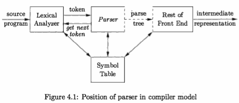

There are three general types of parsers for grammars: 

 - universal, 
    - such as the Cocke-Younger-Kasami algorithm and Earley's algorithm
    - too inefficient to use in production compilers.
 - top-down, 
    - commonly used
    - build parse trees from the top (root) to the bottom (leaves)
    - the input to the parser is scanned from left to right, one symbol at a time.
 - and bottom-up. 
    - commonly used
    - build parse trees start from the leaves and work their way up to the root
    - the input to the parser is scanned from left to right, one symbol at a time.

The most efficient top-down and bottom-up methods work only for sub­classes of grammars, but several of these classes, particularly, LL and LR gram­mars, are expressive enough to describe most of the syntactic constructs in modern programming languages. 

> LL : Left to Right, Leftmost derivation
> LR : Left to Right, Rightmost derivation

 - Parsers implemented by hand often use LL grammars; 
     - for example, the predictive-parsing approach of Section 2.4.2 works for LL grammars.  
 - Parsers for the larger class of LR grammars are usually constructed using automated tools.

In this chapter, we assume that the output of the parser is some represent­ action of the parse tree for the stream of tokens that comes from the lexical analyzer. In practice, there are a number of tasks that might be conducted during parsing, such as 

 - collecting information about various tokens into the symbol table, 
 - performing type checking and other kinds of semantic analysis, 
 - and generating intermediate code. 

We have lumped all of these activities into the "rest of the front end" box in Fig. 4.1. These activities will be covered in detail in subsequent chapters.

---

<h2 id="404a734496a31abcde4eec096257e383"></h2>


### 4.1.2 Representative Grammars

Some of the grammars that will be examined in this chapter are presented here for ease of reference. 

Constructs that begin with keywords like **while** or **int**, are relatively easy to parse, because the keyword guides the choice of the grammar production that must be applied to match the input. We therefore concentrate on expressions, which present more of challenge, because of the associativity and precedence of operators.

Associativity and precedence are captured in the following grammar, which is similar to ones used in Chapter 2 for describing expressions, terms, and factors. *E* represents expressions consisting of terms separated by + signs, *T* represents terms consisting of factors separated by \* signs, and *F* represents factors that can be either parenthesized expressions or identifiers:

```
E → E + T | T
T → T * F | F     (4.1) 
F → ( E ) | id
```

Expression grammar (4.1) belongs to the class of LR grammars that are suitable for bottom-up parsing. This grammar can be adapted to handle additional operators and additional levels of precedence. However, it cannot be used for top-down parsing because it is left recursive.

> left recursive 只能使用 bottom-up parsing

The following non-left-recursive variant of the expression grammar (4.1) will be used for top-down parsing:

```
E  → T E'
E' → + T E' | ε
T  → F T'            (4.2)
T' → * F T' | ε
F  → ( E ) | id  
```

The following grammar treats + and * alike, so it is useful for illustrating techniques for handling ambiguities during parsing:

```
E → E + E | E * E | ( E ) | id         (4.3)
```

Here, E represents expressions of all types. Grammar (4.3) permits more than one parse tree for expressions like a + b \* c.


<h2 id="0a62177a1bdeb055824f516840c228b4"></h2>


### 4.1.3 Syntax Error Handling

The remainder of this section considers the nature of syntactic errors and gen­eral strategies for error recovery. 

Two of these strategies, called panic-mode and phrase-level recovery, are discussed in more detail in connection with specific parsing methods.

A compiler is expected to assist the programmer in locating and tracking down errors that inevitably creep into programs.  Planning the error handling right from the start can both simplify the structure of a compiler and improve its handling of errors.

Common programming errors can occur at many different levels.

 - *Lexical* errors include misspellings of identifiers, keywords, or operators 
     - e.g., the use of an identifier *elipseSize* instead of *ellipseSize*
     - and missing quotes around text intended as a string.
 - *Syntactic* errors include misplaced semicolons or extra or missing braces; 
     - that is, "{" or "}." 
     - As another example, in C or Java, the appearance of a case statement without an enclosing switch is a syntactic error .
 - *Semantic* errors include type mismatches between operators and operands. 
     - An example is a return statement in a Java method with result type void.
 - *Logical* errors can be anything from incorrect reasoning on the part of the programmer 
     - to the use in a C program of the assignment operator = instead of the comparison operator ==. 

The precision of parsing methods allows syntactic errors to be detected very efficiently. Several parsing methods, such as the LL and LR methods, detect an error as soon as possible; that is, when the stream of tokens from the lexical analyzer cannot be parsed further according to the grammar for the language. 

More precisely, they have the **viable-prefix property**, meaning that they detect that an error has occurred as soon as they see a prefix of the input that cannot be completed to form a string in the language.

Another reason for emphasizing error recovery during parsing is that many errors appear syntactic, and are exposed when parsing cannot continue. A few semantic errors, such as type mismatches, can also be detected efficiently; however, accurate detection of semantic and logical errors at compile time is in general a difficult task.

The error handler in a parser has goals that are simple to state but challenging to realize:

 - Report the presence of errors clearly and accurately.
 - Recover from each error quickly enough to detect subsequent errors.
 - Add minimal overhead to the processing of correct programs.

Fortunately, common errors are simple ones, and a relatively straightforward error-handling mechanism often suffices.

How should an error handler report the presence of an error? At the very least, it must report the place in the source program where an error is detected, because there is a good chance that the actual error occurred within the previous few tokens. A common strategy is to print the offending line with a pointer to the position at which an error is detected.

---

<h2 id="e1251b5a6af9cbf01527a7b7594bc9a0"></h2>


### 4.1.4 Error-Recovery Strategies

Once an error is detected, how should the parser recover? 

The balance of this section is devoted to the following recovery strategies: panic-mode, phrase-level, error-productions, and global-correction.

**Panic-Mode Recovery**

With this method, on discovering an error, the parser discards input symbols one at a time until one of a designated set of ***synchronizing tokens*** is found. The synchronizing tokens are usually delimiters, such as semicolon or }, whose role in the source program is clear and unambiguous. 

The compiler designer must select the synchronizing tokens appropriate for the source language. While panic-mode correction often skips a considerable amount of input without check­ing it for additional errors, it has the advantage of simplicity, and, unlike some methods to be considered later, is guaranteed not to go into an infinite loop.


**Phrase-Level Recovery**

On discovering an error, a parser may perform local correction on the remaining input; that is, it may replace a prefix of the remaining input by some string that allows the parser to continue. A typical local correction is to replace a comma by a semicolon, delete an extraneous semicolon, or insert a missing semicolon. 

The choice of the local correction is left to the compiler designer. Of course, we must be careful to choose replacements that do not lead to infinite loops, as would be the case, for example, if we always inserted something on the input ahead of the current input symbol.

Phrase-level replacement has been used in several error-repairing compilers, as it can correct any input string. Its major drawback is the difficulty it has in coping with situations in which the actual error has occurred before the point of detection.

**Error Productions**

By anticipating common errors that might be encountered, we can augment the grammar for the language at hand with productions that generate the erroneous constructs. 

A parser constructed from a grammar augmented by these error productions detects the anticipated errors when an error production is used during parsing. The parser can then generate appropriate error diagnostics about the erroneous construct that has been recognized in the input.


**Global Correction**

Ideally, we would like a compiler to make as few changes as possible in processing an incorrect input string. 

There are algorithms for choosing a minimal sequence of changes to obtain a globally least-cost correction. 

Given an incorrect input string x and grammar G, these algorithms will find a parse tree for a related string y, such that the number of insertions, deletions, and changes of tokens required to transform x into y is as small as possible. 

Unfortunately, these methods are in general too costly to implement in terms of time and space, so these techniques are currently only of theoretical interest.

Do note that a closest correct program may not be what the programmer had in mind. Nevertheless, the notion of least-cost correction provides a yardstick for evaluating error-recovery techniques, and has been used for finding optimal replacement strings for phrase-level recovery.


---

<h2 id="e18a685fdcbfe35bcf7b3ef29c5dbfee"></h2>


## 4.2 Context-Free Grammars

---

<h2 id="04d3df637c892628792484e05c357c42"></h2>


### 4.2.1 The Formal Definition of a Context-free Grammar

A context-free grammar (grammar for short) consists of terminals, nonterminals, a start symbol, and productions.

 1. *Terminals* are the basic symbols from which strings are formed. 
     - The term "token name" is a synonym for "terminal" and frequently we will use the word "token" for terminal when it is clear that we are talking about just the token name. 
     - We assume that the terminals are the first components of the tokens output by the lexical analyzer. 
     - In (4.4) , the terminals are the keywords **if** and **else** and the symbols "(" and ")".
 2. *Nonterminals* are syntactic variables that denote sets of strings. 
     - In (4.4), *stmt* and *expr* are nonterminals. 
     - The sets of strings denoted by nontermi­nals help define the language generated by the grammar. 
     - Nonterminals impose a hierarchical structure on the language that is key to syntax analysis and translation.
 3. In a grammar, one nonterminal is distinguished as the *start symbol*, 
     - and the set of strings it denotes is the language generated by the grammar. 
     - Conventionally, the productions for the start symbol are listed first.
 4. The *productions* of a grammar specify the manner in which the termi­nals and nonterminals can be combined to form strings. Each production consists of:
     - (a) A nonterminal called the *head* or *left side* of the production; this production defines some of the strings denoted by the head.
     - (b) The symbol →. Sometimes ::= has been used in place of the arrow.
     - (c) A *body or right side* consisting of zero or more terminals and non­terminals. The components of the body describe one way in which strings of the nonterminal at the head can be constructed.


Example 4.5 : The grammar in Fig. 4.2 defines simple arithmetic expressions. In this grammar, the terminal symbols are

```
    id + - * / ( )
```

The nonterminal symbols are *expression*, *term* and *factor*, and *expression* is the start symbol

```
expression → expression + term 
expression → expression - term 
expression → term
      term → term * factor 
      term → term / factor
      term → factor
    factor → ( expression )
    factor → id
```

> Figure 4.2: Grammar for simple arithmetic expressions

---

<h2 id="75f9deb3c12ebfe2f88ee567cbb334af"></h2>


### 4.2.2 Notational Conventions

To avoid always having to state that "these are the terminals," "these are the nonterminals," and so on, the following notational conventions for grammars will be used throughout the remainder of this book.

 1. These symbols are terminals:
     - Lowercase letters early in the alphabet, such as *a*, *b*, *c*.
     - Operator symbols such as +, *, and so on.
     - Punctuation symbols such as parentheses, comma, and so on.
     - The digits 0,1, ... ,9.
     - Boldface strings such as **id** or **if**, each of which represents a single terminal symbol.
 2. These symbols are nonterminals:
     - Uppercase letters early in the alphabet, such as **A**, **B**, **C**.
     - The letter **S**, which, when it appears, is usually the start symbol.
     - Lowercase, italic names such as *expr* or *stmt*.
     - When discussing programming constructs, uppercase letters may be used to represent nonterminals for the constructs. For example, non­ terminals for expressions, terms, and factors are often represented by E, T, and F, respectively.
 3. Uppercase letters late in the alphabet, such as X, Y, Z, represent *grammar symbols*; that is, either nonterminals or terminals.
     - 注意，X,Y,Z 的特别之处
 4. Lowercase letters late in the alphabet, chie y u, v, . . . , z, represent (pos­ sibly empty) ***strings*** of terminals.
 5. Lowercase Greek letters, α,β,γ for example, represent (possibly empty) ***strings*** of grammar symbols. 
     - Thus, a generic production can be written as A → α  , where A is the head and α the body.
 6. A set of productions A → α₁ , A → α₂ , ... ,A → α<sub>k</sub>  with a common head A (call them **A-productions**), may be written A → α₁|α₂|...|α<sub>k</sub>. Call α₁, α₂, ... , α<sub>k</sub> the *alternatives* for A.
 7. Unless stated otherwise, the head of the first production is the *start* sym­ bol.

Example 4.6 : Using these conventions, the grammar of Example 4.5 can be rewritten concisely as

```
E → E + T | E - T | T 
T → T * F | T / F | F 
F → ( E ) | id
```

The notational conventions tell us that E, T, and F are nonterminals, with E the start symbol. The remaining symbols are terminals.

---

<h2 id="d4831fa5d1357d7549aa40ad8f772c8d"></h2>


### 4.2.3 Derivations

The construction of a parse tree can be made precise by taking a derivational view, in which productions are treated as rewriting rules. 

Beginning with the start symbol, each rewriting step replaces a nonterminal by the body of one of its productions. This derivational view corresponds to the ***top-down construction*** of a parse tree, but the precision a orded by derivations will be especially helpful when bottom-up parsing is discussed. As we shall see, *bottom-up parsing* is related to a class of derivations known as "rightmost" derivations, in which the rightmost nonterminal is rewritten at each step.

For example, consider the following grammar, with a single nonterminal E, which adds a production E → - E to the grammar (4.3):

```
E → E + E | E * E | - E | ( E ) | id    (4.7) 
```

The production E → - E signifies that if E denotes an expression, then - E must also denote an expression. The replacement of a single E by - E will be described by writing

```
  E ⇒ - E
```

which is read, "E derives -E." The production E → ( E ) can be applied to replace any instance of E in any string of grammar symbols by (E), e.g., E * E ⇒ (E) * E or E * E ⇒ E * (E). We can take a single E and repeatedly apply productiqns in any order to get a sequence of replacements. For example,

```
  E ⇒ - E ⇒ -(E) ⇒ -(id)
```

We call such a sequence of replacements a ***derivation*** of -(id) from E. This derivation provides a proof that the string -(**id**) is one particular instance of an expression.

For a general definition of derivation, consider a nonterminal A in the middle of a sequence of grammar symbols, as in αAβ , where α and β are arbitrary strings of grammar symbols. Suppose A → γ is a production. Then, we write αAβ ⇒ αγβ. The symbol ⇒ means, "derives in one step." When a sequence of derivation steps α₁ ⇒ α₂ ⇒ ... ⇒ αn rewrites α₁ to αn, we say α₁ ***derives*** an. 

Often, we wish to say, "derives in zero or more steps." For this purpose, we can use the symbol ⇒<sup>\*</sup>. Thus,

 1. α ⇒<sup>\*</sup> α, for any string α , and 
 2. If α ⇒<sup>\*</sup> β  and β ⇒<sup>\*</sup> γ , then α ⇒<sup>\*</sup> γ

Likewise, ⇒⁺ means, "derives in one or more steps."

If S ⇒<sup>\*</sup> α, where S is the start symbol of a grammar G, we say that α is a
*sentential form* of G. Note that a sentential form may contain both terminals and nonterminals, and may be empty. A *sentence* of G is a sentential form with no nonterminals. The *language generated by* a grammar is its set of sentences.

Thus, a string of terminals ω is in L(G), the language generated by G, if and only if ω is a sentence of G ( or S ⇒<sup>\*</sup> ω). A language that can be generated by a grammar is said to be a **context-free language**. If two grammars generate the same language, the grammars are said to be *equivalent*.

The string -(id + id) is a sentence of grammar (4.7) because there is a derivation 

```
E ⇒ -E ⇒ -(E) ⇒ -(E+E) ⇒ -(id+E) ⇒ -(id+id)   (4.8)
```

The strings E, -E, -(E), ... , -(id + id) are all sentential forms of this grammar. We write E ⇒<sup>\*</sup> -(id + id) to indicate that -(id + id) can be derived from E.

At each step in a derivation, there are two choices to be made. We need to choose which nonterminal to replace, and having made this choice, we must pick a production with that nonterminal as head.  For example, the following alternative derivation of -(id + id) differs from derivation (4.8) in the last two steps:

```
E ⇒ -E ⇒ -(E) ⇒ -(E+E) ⇒ -(E+ id) ⇒ -(id+id)   (4.9)
```

Each nonterminal is replaced by the same body in the two derivations, but the order of replacements is different.

To understand how parsers work, we shall consider derivations in which the nonterminal to be replaced at each step is chosen as follows:

 1. In *leftmost* derivations, the leftmost nonterminal in each sentential is al­ways chosen. 
     - If α ⇒ β is a step in which the leftmost nonterminal in α is replaced, we write 
     - α ⇒<sub>lm</sub>β
 2. In *rightmost* derivations, the rightmost nonterminal is always chosen; 
     - we write α ⇒<sub>rm</sub>β in this case.

Derivation (4.8) is leftmost, so it can be rewritten as

E ⇒<sub>lm</sub> -E ⇒<sub>lm</sub> -(E) ⇒<sub>lm</sub> -(E+E) ⇒<sub>lm</sub> -(id+E) ⇒<sub>lm</sub> -(id+id) 

Note that (4.9) is a rightmost derivation.

Using our notational conventions, every leftmost step can be written as ωAγ ⇒<sub>lm</sub> ωδγ, where ω consists of terminals only, A ⇒ δ is the production and γ is a string of grammar symbols. To emphasize that a derives by a leftmost derivation , we write α ⇒<sup>\*</sup><sub>lm</sub> β . If S ⇒<sup>\*</sup><sub>lm</sub> α, then we say that α is a *left-sentential form* of the grammar at hand.

Analogous definitions hold for rightmost derivations. Rightmost derivations are sometimes called *canonical* derivations.

--- 

<h2 id="b7e854d42d024d8174345cb2a65ac968"></h2>


### 4.2.4 Parse Trees and Derivations

A parse tree (CST)is a graphical representation of a derivation that filters out the order in which productions are applied to replace nonterminals. 

 - Each interior node of a parse tree represents the application of a production. 
 - The interior node is labeled with the nonterminal A in the head of the production; 
 - the children of the node are labeled, from left to right, by the symbols in the body of the production 
     - by which this A was replaced during the derivation.

For example, the parse tree for -(id + id) in Fig. 4.3, results from the derivation (4.8) as well as derivation (4.9).

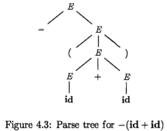

The leaves of a parse tree are labeled by ***nonterminals or terminals*** and, read from left to right, constitute a sentential form, called the ***yield*** or ***frontier*** of the tree.

To see the relationship between derivations and parse trees, consider any derivation α₁ ⇒ α₂ ⇒ ... ⇒ αn , where `α₁` is a single nonterminal A. For each sentential form αᵢ in the derivation, we can construct a parse tree whose yield is αᵢ.  The process is an induction on i.

**BASIS**: The tree for `α₁` = A is a single node labeled A.

**INDUCTION**: Suppose we already have constructed a parse tree with yield αᵢ₋₁ = X₁X₂...X<sub>k</sub> (note that according to our notational conventions, each grammar symbol Xᵢ is either a nonterminal or a terminal). Suppose αᵢ is derived from αᵢ₋₁ by replacing Xⱼ, a nonterminal, by β = Y₁Y₂...Y<sub>m</sub>. That is, at the *i*th step of the derivation, production Xⱼ → β is applied to αᵢ₋₁ to deriveai= X₁X₂...Xⱼ₋₁βXⱼ₊₁...X.

To model this step of the derivation, find the *j*th leaf from the left in the current parse tree. This leaf is labeled Xⱼ . Give this leaf m children, labeled Y₁Y₂...Y<sub>m</sub> from the left. Asaspecialcase,if m = 0, then β = ε, and we give the *j*th leaf one child labeled ε .

Example 4.10 : The sequence of parse trees constructed from the derivation (4.8) is shown in Fig. 4.4. 

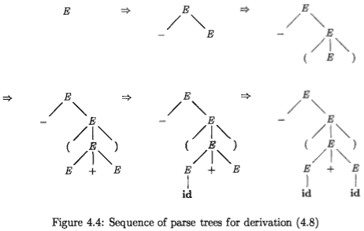

In the first step of the derivation, E ⇒ -E. To model this step, add two children, labeled `-` and `E`, to the root `E` of the initial tree. The result is the second tree.

In the secorid step of the derivation, -E ⇒ -(E) . Consequently, add three children, labeled `(`, `E`, and `)`, to the leaf labeled `E` of the second tree, to obtain the third tree with yield -(E) . Continuing in this fashion we obtain the complete parse tree as the sixth tree.

Since a parse tree ignores variations in the order in which symbols in senten­tial forms are replaced, there is a many-to-one relationship between derivations and parse trees. For example, both derivations (4.8) and (4.9), are associated with the same final parse tree of Fig. 4.4.

In what follows, we shall frequently parse by producing a leftmost or a rightmost derivation, since there is a one-to-one relationship between parse trees and either leftmost or rightmost derivations. Both leftmost and rightmost derivations pick a particular order for replacing symbols in sentential forms, so they too  filter out variations in the order. It is not hard to show that every parse tree has associated with it a unique leftmost and a unique rightmost derivation.

---

<h2 id="059218b78640920f2df8cc7048533516"></h2>


### 4.2.5 Ambiguity

From Section 2.2.4, a grammar that produces more than one parse tree for some sentence is said to be **ambiguous**. Put another way, an ambiguous grammar is one that produces more than one leftmost derivation or more than one rightmost derivation for the same sentence.

Example 4.11 : The arithmetic expression grammar (4.3) permits two distinct leftmost derivations for the sentence id + id * id:

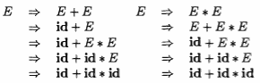

The corresponding parse trees appear in Fig. 4.5.

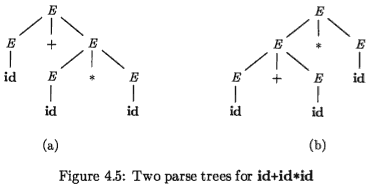

Note that the parse tree of Fig.4.5(a) reflects the commonly assumed prece­dence of + and \*, while the tree of Fig. 4.5(b) does not. 

For most parsers, it is desirable that the grammar be made unambiguous, for if it is not, we cannot uniquely determine which parse tree to select for a sentence. In other cases, it is convenient to use carefully chosen ambiguous grammars, together with ***disambiguating rules*** that "throw away" undesirable parse trees, leaving only one tree for each sentence.

---

<h2 id="408aaedc6f5c7d56c7665280fda51463"></h2>


### 4.2.6 Verifying the Language Generated by a Grammar

Although compiler designers rarely do so for a complete programming-language grammar, it is useful to be able to reason that a given set of productions gener­ates a particular language. 

Troublesome constructs can be studied by writing a concise, abstract grammar and studying the language that it generates. We shall construct such a grammar for conditional statements below.

A proof that a grammar G generates a language L has two parts: 

 - show that every string generated by G is in L, 
 - and conversely that every string in L can indeed be generated by G.

Example 4.12 : Consider the following grammar:

```
  S → (S)S | ε (4.13)
```

It may not be initially apparent, but this simple grammar generates all strings of balanced parentheses, and only such strings. To see why, we shall show first that every sentence derivable from S is balanced, and then that every balanced string is derivable from S. To show that every sentence derivable from S is balanced, we use an inductive proof on the number of steps *n* in a derivation.

**BASIS**: The basis is n = 1. The only string of terminals derivable from S in one step is the empty string, which surely is balanced.

**INDUCTION**: Now assume that all derivations of fewer than *n* steps produce balanced sentences, and consider a leftmost derivation of exactly *n* steps. Such a derivation must be of the form

&nbsp;&nbsp; S ⇒<sub>lm</sub> (S)S ⇒<sup>\*</sup><sub>lm</sub> (x)S ⇒<sup>\*</sup><sub>lm</sub> (x)y

The derivations of x and y from S take fewer than *n* steps, so by the inductive hypothesis x and y are balanced. Therefore, the string (x)y must be balanced. That is, it has an equal number of left and right parentheses, and every prefix has at least as many left parentheses as right.

Having thus shown that any string derivable from S is balanced, we must next show that every balanced string is derivable from S. To do so, use induction on the length of a string.

**BASIS**: If the string is of length 0, it must be ε, which is balanced.

**INDUCTION**: First, observe that every balanced string has even length. As­sume that every balanced string of length less than *2n* is derivable from S, and consider a balanced string *w* of length *2n*, n ≥ 1. Surely *w* begins with a left parenthesis. Let (x) be the shortest nonempty prefix of *w* having an equal number of left and right parentheses. Then *w* can be written as *w* = (x)y where  both x and y are balanced. Since x and y are of length less than 2n, they are derivable from S by the inductive hypothesis. Thus, we can find a derivation of the form

&nbsp;&nbsp; S ⇒ (S)S ⇒<sup>\*</sup> (x)S ⇒<sup>\*</sup> (x)y

proving that *w* = (x)y is also derivable from S.

---

<h2 id="5d6cf78f50765ceea1883e6a1d34f709"></h2>


### 4.2.7 Context-free Grammars Versus Regular Expressions

Before leaving this section on grammars and their properties, we establish that grammars are a more powerful notation than regular expressions. 

Every con­struct that can be described by a regular expression can be described by a gram­mar, but not vice-versa. Alternatively, every regular language is a context-free language, but not vice-versa.

For example, the regular expression **(a|b)\*abb** and the grammar


```
A₀ → aA₀ | bA₀ | aA₁ 
A₁ → bA₂
A₂ → bA₃
A₃ → ε
```

describe the same language, the set of strings of a's and b's ending in *abb*.

We can construct mechanically a grammar to recognize the same language as a nondeterministic finite automaton (NFA). The grammar above was con­structed from the NFA in Fig. 3.24 using the following construction:


 1. For each state i of the NFA, create a nonterminal Aᵢ.
 2. If state i has a transition to state j on input a, add the production Aᵢ → aAⱼ. If state i goes to state j on input ε, add the production Aᵢ → Aⱼ.
 3. IF i is an accepting state, add Aᵢ → ε.
 4. If i is the start state, make Aᵢ be the start symbol of the grammar.

On the other hand, the language L = {aⁿbⁿ | n ≥ 1} with an equal number of a's and b's is a prototypical example of a language that can be described by a grammar but not by a regular expression. 

To see why, suppose L were the language defined by some regular expression. We could construct a DFA D with a finite number of states, say k, to accept L. Since D has only k states, for an input beginning with more than k a's, D must enter some state twice, say sᵢ, as in Fig. 4.6. 

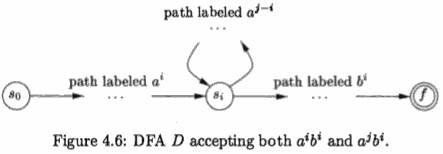

Suppose that the path from sᵢ back to itself is labeled with a sequence aʲ⁻ⁱ. Since aⁱbⁱ is in the language, there must be a path labeled bⁱ from sⁱ to an accepting state f. But, then there is also a path from the initial state s₀ through sⁱ to f labeled aʲbⁱ, as shown in Fig. 4.6. Thus, D also accepts aʲbⁱ, which is not in the language, contradicting the assumption that L is the language accepted by D.

Colloquially, we say that ***"finite automata cannot count,"*** meaning that a finite automaton cannot accept a language like {aⁿbⁿ | n ≥ 1} that would require it to keep count of the number of a's before it sees the b's. Likewise, "a grammar can count two items but not three," as we shall see when we consider non-context-free language constructs in Section 4.3.5.

---

<h2 id="f22e7c54d52c4644f7090084666537ee"></h2>


## 4.3 Writing a Grammar

Grammars are capable of describing most, but not all, of the syntax of pro­gramming languages. For instance, the requirement that identifiers be declared before they are used, cannot be described by a context-free grammar. Therefore, the sequences of tokens accepted by a parser form a superset of the program­ming language; subsequent phases of the compiler must analyze the output of the parser to ensure compliance with rules that are not checked by the parser.

This section begins with a discussion of how to divide work between a lexical analyzer and a parser. We then consider several transformations that could be applied to get a grammar more suitable for parsing. 

 - One technique can elim­inate ambiguity in the grammar, 
 - and other techniques -- left-recursion elimi­nation and left factoring -- are useful for rewriting grammars so they become suitable for top-down parsing. 

We conclude this section by considering some programming language constructs that cannot be described by any grammar.

---

<h2 id="950d4af77c33ba0f1745ad3990497880"></h2>


### 4.3.1 Lexical Versus Syntactic Analysis

As we observed in Section 4.2.7, everything that can be described by a regular expression can also be described by a grammar. We may therefore reasonably ask: "Why use regular expressions to define the lexical syntax of a language?" There are several reasons.

 1. Separating the syntactic structure of a language into lexical and non­ lexical parts provides a convenient way of modularizing the front end of a compiler into two manageable-sized components.
 2. The lexical rules of a language are frequently quite simple, and to describe them we do not need a notation as powerful as grammars.
 3. Regular expressions generally provide a more concise and easier-to-under­ stand notation for tokens than grammars.
 4. More efficient lexical analyzers can be constructed automatically from regular expressions than from arbitrary grammars.

There are no firm guidelines as to what to put into the lexical rules, as op­posed to the syntactic rules. 

 - Regular expressions are most useful for describing the structure of constructs such as identifiers, constants, keywords, and white space. 
 - Grammars, on the other hand, are most useful for describing nested structures such as balanced parentheses, matching begin-end's, corresponding if-then-else's, and so on. 

These nested structures cannot be described by regular expressions.

---

<h2 id="abe716f7277a95401ed271fa2ae04e46"></h2>


### 4.3.2 Eliminating Ambiguity

Sometimes an ambiguous grammar can be rewritten to eliminate the ambiguity. As an example, we shall eliminate the ambiguity from the following "dangling­ else" grammar:

```
stmt → if expr then stmt         (4.14)
     | if expr then stmt else stmt 
     | other
```

Here **"other"** stands for any other statement. According to this grammar, the compound conditional statement

```
if E₁ then S₁ else if E₂ then S₂ else E₃
```

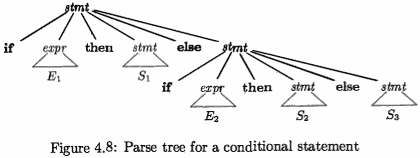

has the parse tree shown in Fig. 4.8.1 


Grammar (4.14) is ambiguous since the string

```
if E₁ then if E₂ then S₁ else S₂     (4.15)
```

has the two parse trees shown in Fig. 4.9.

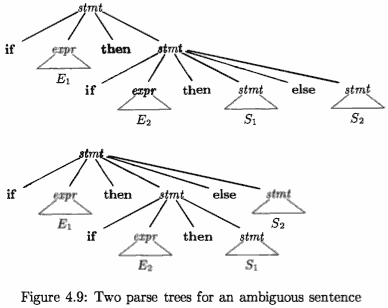

In all programming languages with conditional statements of this form, the first parse tree is preferred. The general rule is, "Match each **else** with the closest unmatched **then**."  

This disambiguating rule can theoretically be in­ corporated directly into a grammar, but in practice it is rarely built into the productions.

Example 4.16 : We can rewrite the dangling-else grammar (4.14) as the fol­lowing unambiguous grammar. 

The idea is that a statement appearing between a **then** and an **else** must be "matched"; that is, the interior statement must not end with an unmatched or open **then**. A *matched statement* is either an **if-then-else** statement containing no open statements or it is any other kind of unconditional statement. 

Thus, we may use the grammar in Fig. 4.10. This grammar generates the same strings as the dangling-else grammar (4.14), but it allows only one parsing for string (4.15); namely, the one that associates each **else** with the closest previous unmatched **then**.

```
            stmt → matched_stmt
                  | open_stmt
    matched_stmt → if expr then matched_stmt else matched_stmt
                 | other
       open_stmt → if expr then stmt
                    | if expr then matched_stmt else open_stmt
```

> Figure 4.10: Unambiguous grammar for if-then-else statements

---

<h2 id="624a0832310d892b64c0055c925a43b5"></h2>


### 4.3.3 Elimination of Left Recursion

> 所谓 immediate left recursion ，就是指 只要1步 derivation 就出现 左递归形态。

A grammar is ***left recursive*** if it has a nonterminal A such that there is a derivation A ⇒⁺ Aα for some string α. Top-down parsing methods cannot
handle left-recursive grammars, so a transformation is needed to eliminate left recursion. In Section 2.4.5, we discussed **immediate left recursion**, where there is a production of the form A → Aα. Here, we study the general case. In Section 2.4.5, we showed how the left-recursive pair of productions A → Aα | β   could be replaced by the non-left-recursive productions:

```
A  → βA'
A' → αA' | ε   
```

> α ≠ ε is assumed 

without changing the strings derivable from A. This rule by itself suffices for many grammars.

Example 4.17 : The non-left-recursive expression grammar (4.2), repeated here,

```
E  → T E'
E' → + T E'  | ε
T  → F T'            (4.2)
T' → * F T'  | ε
F  → ( E ) | id  
```

> 注意, 原书中, 第2，4行 没有了 `| ε`

is obtained by eliminating immediate left recursion from the expression gram­mar (4.1). The left-recursive pair of productions `E → E + T | T` are replaced by `E  → T E'` and `E' → + T E'  | ε` . The new productions for T and T' are obtained similarly by eliminating immediate left recursion.

Immediate left recursion can be eliminated by the following technique, which works for any number of A-productions. First, group the productions as

```
A → Aα₁ | Aα₂ | ... ｜ Aαm |  β₁ | β₂ | ... ｜βn
```

where no βᵢ begins with an A. Then, replace the A-productions by

```
A  → β₁A' | β₂A' | ... | βnA'        // 列出所有 非递归 production body
A' → α₁A' | α₂A' | ... | αmA' | ε        // right-recursive
```

The nonterminal A generates the same strings as before but is no longer left recursive. This procedure eliminates all left recursion from the A and A' pro­ductions (provided no aᵢ is ε), but it does not eliminate left recursion involving derivations of two or more steps. For example, consider the grammar

```
S → Aa | b              (4.18)
A → Ac | Sd | ε
```

The nonterminal S is left recursive because S ⇒ Aa ⇒ Sda, but it is ***not*** immediately left recursive.

Algorithm 4.19 : Eliminating left recursion.

 - INPUT: Grammar G with no cycles or ε-productions.
 - OUTPUT: An equivalent grammar with no left recursion.
 - METHOD: Apply the algorithm in Fig. 4.11 to G. 
     - Note that the resulting non-left-recursive grammar **may have ε-productions**.

```
arrange the nonterminals in some order A₁,A₂, ... ,An.
for ( each i from 1 to n) {
    for ( each j from 1 to i-1 ) {
        replace each production of the form Aᵢ → Aⱼγ  by the
        productions Aᵢ → δ₁γ | δ₂γ | ... | δ_kγ , where
        Aⱼ → δ₁ | δ₂ | ... | δ_k are all current Aⱼ-productions
    } 
    eliminate the immediate left recursion among the Aᵢ-productions
}
```

> Figure 4.11: Algorithm to eliminate left recursion from a grammar


Example 4.20 : Let us apply Algorithm 4.19 to the grammar (4.18). Techni­cally, the algorithm is not guaranteed to work, because of the ε-production, but in this case, the production A → ε turns out to be harmless.

We order the nonterminals S, A. There is no immediate left recursion among the S-productions, so nothing happens during the outer loop for i= 1. For i= 2, we substitute for S in A → Sd to obtain the following A-productions.

```
A → Ac | Aad | bd | ε
```

Eliminating the immediate left recursion among these A-productions yields the following grammar.

```
S  → Aa | b 
A  → bdA' | A' 
A' → cA' | adA' | ε
```

---

<h2 id="be643cb3f54982ef5068037f07328208"></h2>


### 4.3.4 Left Factoring

Left factoring is a grammar transformation that is useful for producing a gram­mar suitable for predictive, or top-down, parsing. 

When the choice between two alternative A-productions is not clear, we may be able to rewrite the pro­ductions to defer the decision until enough of the input has been seen that we can make the right choice.

For example, if we have the two productions

```
stmt → if expr then stmt else stmt
     | if expr then stmt
```

on seeing the input **if**, we cannot immediately tell which production to choose to expand stmt. In general, if A → αβ₁ | αβ₂ are two A-productions, and the input begins with a nonempty string derived from α, we do not know whether to expand A to αβ₁ or αβ₂. However, we may defer the decision by expanding A to αA'. Then, after seeing the input derived from a, we expand A' to β₁ or to β₂. That is, left-factored, the original productions become

```
A  → aA' 
A' → β₁ | β₂
```

Algorithm 4.21 : Left factoring a grammar.

 - INPUT: Grammar G.
 - OUTPUT: An equivalent left-factored grammar.
 - METHOD: For each nonterminal A, find the longest prefix α common to two or more of its alternatives. If α ≠ ε -- i.e., there is a nontrivial common prefix -- replace all of the A-productions A -> αβ₁ | αβ₂ | ... | αβn | γ , where γ represents all alternatives that do not begin with α,  by 

```
A  → aA' | γ
A' → β₁ | β₂ | ... | βn 
```

Here A' is a new nonterminal. Repeatedly apply this transformation until no two alternatives for a nonterminal have a common prefix.

Example 4.22 : The following grammar abstracts the "dangling-else" prob­lem:

```
S → i E t S | i E t S e S | α     (4.23)
E → b
```

Here, i, t, and e stand for **if**, **then**, and **else**; E and S stand for "conditional expression" and "statement." Left-factored, this grammar becomes:

```
S  → i E t S S' | α       (4.24)
S' → e S | ε
E → b
```

Thus, we may expand S to iEtSS' on input i, and wait until iEtS has been seen to decide whether to expand S' to eS or to ε. Of course, these grammars are both ambiguous, and on input e , it will not be clear which alternative for S' should be chosen. Example 4.33 discusses a way out of this dilemma.

---

<h2 id="6ab35fc39c91036ee511ab32ec742e63"></h2>


### 4.3.5 Non-Context-Free Language Constructs

A few syntactic constructs found in typical programming languages cannot be specified using grammars alone. Here, we consider two of these constructs, using simple abstract languages to illustrate the difficulties.

Example 4.25 : The language in this example abstracts the problem of check­ing that identifiers are declared before they are used in a program. The language consists of strings of the form *wcw*, where the first *w* represents the declaration of an identifier *w* , *c* represents an intervening program fragment , and the second *w* represents the use of the identifier.

The abstract language is L₁ = {*wcw* | *w* is in (**a**|**b**)\* }. L₁ consists of all words composed of a repeated string of a's and b's separated by c, such as *aabcaab*. While it is beyond the scope of this book to prove it, the non­ context-freedom of L₁ directly implies the non-context-freedom of programming languages like C and Java, which require declaration of identifiers before their use and which allow identifiers of arbitrary length.

For this reason, a grammar for C or Java does not distinguish among identi­fiers that are different character strings. Instead, all identifiers are represented by a token such as **id** in the grammar. In a compiler for such a language, the semantic-analysis phase checks that identifiers are declared before they are used.

Example 4.26 : The non-context-free language in this example abstracts the problem of checking that the number of formal parameters in the declaration of a function agrees with the number of actual parameters in a use of the function. The language consists of strings of the form *aⁿbᵐcⁿdᵐ* . (Recall aⁿ means a written n times.) Here aⁿ and bᵐ could represent the formal-parameter lists of two functions declared to have n and m arguments, respectively, while cⁿ and dᵐ represent the actual-parameter lists in calls to these two functions.

The abstract language is L₂ = { aⁿbᵐcⁿdᵐ | n ≥ 1 and m ≥ 1 }. That is, L₂ consists of strings in the language generated by the regular expression **a\*b\*c\*d\*_** such that the number of a's and c's are equal and the number of b's and d's are equal. This language is not context free.

Again, the typical syntax of function declarations and uses does not concern itself with counting the number of parameters. For example, a function call in C-like language might be specified by

```
     stmt → id ( expr_list ) 
expr_list → expr_list , expr
          | expr
```

with suitable productions for **expr**. Checking that the number of parameters in a call is correct is usually done during the semantic-analysis phase.


---

<h2 id="fdd5630c22d395b531ee91bd1e3729ac"></h2>


## 4.4 Top-Down Parsing

Top-down parsing can be viewed as the problem of constructing a parse tree for the input string, starting from the root and creating the nodes of the parse tree in preorder (depth-first, as discussed in Section 2.3.4). Equivalently, top-down parsing can be viewed as finding a leftmost derivation for an input string.

Example4.27: The sequence of parse trees in Fig.4.12 for the input **id+id\*id** is a top-down parse according to grammar (4.2), repeated here:

```
E  → T E'
E' → + T E' | ε
T  → F T'            (4.28)
T' → * F T' | ε
F  → ( E ) | id  
```

This sequence of trees corresponds to a leftmost derivation of the input.

At each step of a top-down parse, the key problem is that of determining the production to be applied for a nonterminal, say A. Once an A-production is chosen, the rest of the parsing process consists of "matching" the terminal symbols in the production body with the input string.

The section begins with a general form of top-down parsing, called *recursive­ descent parsing*, which may require backtracking to find the correct A-production to be applied. Section 2.4.2 introduced predictive parsing, a special case of recursive-descent parsing, where no backtracking is required. Predictive parsing chooses the correct A-production by looking ahead at the input a fixed number of symbols, typically we may look only at one (that is, the next input symbol).

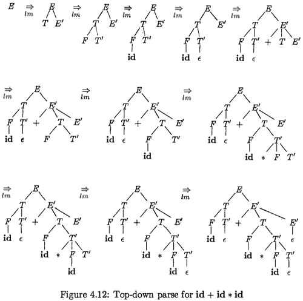

For example, consider the top-down parse in Fig. 4.12, which constructs a tree with two nodes labeled E'. At the first E' node (in preorder), the production E' → + T E'  is chosen; at the second E' node, the production E' → ε is chosen. A predictive parser can choose between E'-productions by looking at the next input symbol.

The class of grammars for which we can construct predictive parsers looking k symbols ahead in the input is sometimes called the LL(k) class. We discuss the LL(1) class in Section 4.4.3, but introduce certain computations, called FIRST and FOLLOW, in a preliminary Section 4.4.2.  From the **FIRST** and **FOLLOW** sets for a grammar, we shall construct "predictive parsing tables," which make explicit the choice of production during top-down parsing. These sets are also
useful during bottom-up parsing,

In Section 4.4.4 we give a nonrecursive parsing algorithm that maintains a stack explicitly, rather than implicitly via recursive calls. Finally, in Sec­ tion 4.4.5 we discuss error recovery during top-down parsing.

---

<h2 id="47aaef28c6f12ae46c447c552fea2bfc"></h2>


### 4.4.1 Recursive-Descent Parsing

```
void A() {
    Choose an A-production, A → X₁X₂...Xk ;  (1)
    for ( i = 1 to k ) {
        if ( Xi is a nonterminal )
            call procedure Xi();
        else if ( Xi equals the current input symbol α )
            advance the input to the next symbol;
        else /* an error has occurred */ ;  (7)
    }
}
```

> Figure 4.13: A typical procedure for a nonterminal in a top-down parser

A recursive-descent parsing program consists of a set of procedures, one for each nonterminal. Execution begins with the procedure for the start symbol, which halts and announces success if its procedure body scans the entire input string. Pseudocode for a typical nonterminal appears in Fig. 4.13. Note that this pseudocode is nondeterministic, since it begins by choosing the A-production to apply in a manner that is not specified.

General recursive-descent may require backtracking; that is, it may require repeated scans over the input. However, backtracking is rarely needed to parse programming language constructs, so backtracking parsers are **not seen fre­quently**. Even for situations like natural language parsing, backtracking is **not very efficient**, and tabular methods such as the dynamic programming algo­rithm of Exercise 4.4.9 or the method of Earley (see the bibliographic notes) are preferred.

To allow backtracking, the code of Fig. 4.13 needs to be modified. First, we cannot choose a unique A-production at line ( 1 ) , so we must try each of several productions in some order. Then, failure at line (7) is not ultimate failure, but suggests only that we need to return to line (1) and try another A-production. Only if there are no more A-productions to try do we declare that an input error has been found. In order to try another A-production, we need to be able to reset the input pointer to where it was when we first reached line (1). Thus, a local variable is needed to store this input pointer for future use.

Example 4.29 : Consider the grammar

```
S → cAd
A → ab | a
```

To construct a parse tree top-down for the input string w = cad, begin with a tree consisting of a single node labeled S, and the input pointer pointing to c, the first symbol of w. S has only one production, so we use it to expand S and obtain the tree of Fig. 4.14(a) . The leftmost leaf, labeled c, matches the first symbol of input w, so we advance the input pointer to a, the second symbol of w, and consider the next leaf, labeled A.

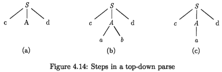

Now, we expand A using the first alternative A → ab to obtain the tree of Fig. 4.14(b). We have a match for the second input symbol, a, so we advance the input pointer to d, the third input symbol, and compare d against the next leaf, labeled b. Since b does not match d, we report failure and go back to A to see whether there is another alternative for A that has not been tried, but that might produce a match.

In going back to A, we must reset the input pointer to position 2, the position it had when we first came to A, which means that the procedure for A must store the input pointer in a local variable.

The second alternative for A produces the tree of Fig. 4.14(c). The leaf a matches the second symbol of w and the leaf d matches the third symbol. Since we have produced a parse tree for w, we halt and announce successful completion of parsing.

A left-recursive grammar can cause a recursive-descent parser, even one with backtracking, to go into an infinite loop. That is, when we try to expand a nonterminal A, we may eventually find ourselves again trying to expand A without having consumed any input.

---

<h2 id="0c9442bd1b7a93aefc72edca1708382f"></h2>


### 4.4.2 FIRST and FOLLOW

The construction of both top-down and bottom-up parsers is aided by two functions, FIRST and FOLLOW, associated with a grammar G. During top­ down parsing, FIRST and FOLLOW allow us to choose which production to apply, based on the next input symbol. During panic-mode error recovery, sets of tokens produced by FOLLOW can be used as synchronizing tokens.

Define FIRST(α), where α is any string of grammar symbols, to be the set of terminals that begin strings derived from α. if α ⇒<sup>\*</sup> ε, then ε is also in FIRST(α) . For example, in Fig. 4.15, A ⇒<sup>\*</sup> cγ , so c is in FIRST(A).

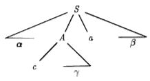

> Figure 4.15: Terminal *c* is in FIRST(A) and *a* is in FOLLOW(A)


For a preview of how FIRST can be used during predictive parsing, consider two A-productions A → α | β  , where FIRST(α) and FIRST(β) are disjoint sets. We can then choose between these A-productions by looking at the next input symbol *a* since *a* can be in at most one of FIRST(α) and FIRST(β), not both. For instance if *a* is in FIRST(β) choose the production A → β . This idea will be explored when LL(1) grammars are defined in Section 4.4.3.

Define *FOLLOW(A)* , for nonterminal A, to be the set of terminals *a* that can appear immediately to the right of A in some sentential form; that is, the set of terminals *a* such that there exists a derivation of the form S ⇒<sup>\*</sup> αAaβ for some α and β , as in Fig. 4.15. Note that there may have been symbols between A and *a* at some time during the derivation, but if so, they derived ε and disappeared. In addition, if A can be the rightmost symbol in some sentential form, then $ is in FOLLOW(A); recall that $ is a special "endmarker" symbol that is assumed not to be a symbol of any grammar.

To compute FIRST(X) for all grammar symbols X, apply the following rules until no more terminals or ε can be added to any FIRST set.

 1. If X is a terminal, then FIRST(X) = {X}.
 2. If X is a nonterminal and X → Y₁Y₂...Yk is a production for some k ≥ 1, then place *a* in FIRST(X) if for some i, *a* is in FIRST(Yᵢ), and ε is in all of FIRST(Y₁), ... , FIRST( Yᵢ₋₁); that is, Y₁...Yᵢ₋₁ ⇒<sup>\*</sup> ε . If ε is in FIRST(Yⱼ) for all j = 1, 2, ... , k, then add ε to FIRST(X). 
     - For example, everything in FIRST(Y₁) is surely in FIRST(X). If Y₁ does not derive ε , then we add nothing more to FIRST(X), but if Y₁ ⇒<sup>\*</sup> ε , then we add FIRST(Y₂), and so on.
 3. If X → ε is a production, then add ε to FIRST(X).

To compute FOLLOW(A) for all nonterminals A, apply the following rules until nothing can be added to any FOLLOW set.

 1. Place $ in FOLLOW(S), where S is the start symbol, and $ is the input right endmarker.
 2. If there is a production A → αBβ , then everything in FIRST( β ) except ε is in FOLLOW(B).
     - B have right brother β 
 3. If there is a production A → αB, or a production A → αBβ , where FIRST( β ) contains ε, then everything in FOLLOW(A) is in FOLLOW(B).
     - B have no right brother , or right bother β is rightmost , and β ⇒<sup>\*</sup> ε  , then check the right brother of B's parent -- A.
     - start symbol S 既没有 right brother , 也 没有  parent, 所以添加 $ 到 FOLLOW(S)


Example 4.30 : Consider again the non-left-recursive grammar (4.28) . Then:

```
E  → T E'
E' → + T E' | ε
T  → F T'            (4.28)
T' → * F T' | ε
F  → ( E ) | id  
```

 1. FIRST(F) = FIRST(T) = FIRST(E) = { `(`, `id` }. 
     - T has only one production, and its body starts with F. Since F does not derive ε, FIRST(T) must be the same as FIRST(F). 
     - The same argument covers FIRST(E).
 2. FIRST(E') = { `+`, `ε` }. 
 3. FIRST(T') = { `*`, `ε` }. 
 4. FOLLOW(E) = FOLLOW(E') = { `)`, `$` }. 
     - Since E is the start symbol, FOLLOW(E) must contain $. 
     - The production body `( E )` explains why the right parenthesis is in FOLLOW(E). 
     - For E', note that this nonterminal appears only at the ends of bodies of E-productions. Thus, FOLLOW(E') must be the same as FOLLOW(E).
 5. FOLLOW(T)= FOLLOW(T')= { `+`, `)` ,`$` }. 
     - Notice that T appears in bodies only followed by E'. Thus, everything except ε in FIRST(E') must be in FOLLOW(T); that explains the symbol `+`. 
     - However, since FIRST(E') contains `ε`, and E' is the entire string following T in the bodies of the E-productions, everything in FOLLOW(E) must also be in FOLLOW(T). That explains the symbols `$` and the right parenthesis `)`. 
     - As for T', since it appears only at the ends ofthe T-productions, it must be that FOLLOW(T') = FOLLOW(T).
 6. FOLLOW(F) = { `+`, `*`, `)`, `$` }. 
     - The reasoning is analogous to that for T in point (5),

---

<h2 id="de9f8354ab89765d867d91fd4d65a576"></h2>


### 4.4.3 LL(1) Grammars

Predictive parsers, that is, recursive-descent parsers needing no backtracking, can be constructed for a class of grammars called LL(I), The first "L" in LL(1) stands for scanning the input from left to right, the second "L" for producing a leftmost derivation, and the "1" for using one input symbol of lookahead at each step to make parsing action decisions.

The class of LL(1) grammars is rich enough to cover most programming constructs, although care is needed in writing a suitable grammar for the source language. For example, **no left-recursive or ambiguous grammar can be LL(1)**.

A grammar G is LL(1) if and only if whenever A → α|β are two distinct productions of G, the following conditions hold:

 1. For no terminal a do both α and β derive strings beginning with a.
 2. At most one of α and β can derive the empty string.
 3. If β ⇒<sup>\*</sup> ε , then α does not derive any string beginning with a terminal in FOLLOW(A). Likewise, if α ⇒<sup>\*</sup> ε  , then  β does not derive any string beginning with a terminal in FOLLOW(A) .

The first two conditions are equivalent to the statement that FIRST(α) and FIRST(β) are disjoint sets. The third condition is equivalent to stating that if ε is in FIRST(β), then FIRST(α) and FOLLOW(A) are disjoint sets, and likewise if ε is in FIRST(α).

Predictive parsers can be constructed for LL(1) grammars since the proper production to apply for a nonterminal can be selected by looking only at the current input symbol. Flow-of-control constructs, with their distinguishing key­ words, generally satisfy the LL(1) constraints. For instance, if we have the

Predictive parsers can be constructed for LL(1) grammars since the proper production to apply for a nonterminal can be selected by looking only at the current input symbol. Flow-of-control constructs, with their distinguishing key­ words, generally satisfy the LL(1) constraints. For instance, if we have the productions

```
stmt → if ( expr ) stmt else stmt 
     | while ( expr ) stmt
     | { stmLlist }
```

then the keywords **if**, **while**, and the symbol **{** tell us which alternative is the only one that could possibly succeed if we are to find a statement.

The next algorithm collects the information from FIRST and FOLLOW sets into a predictive parsing table M[A, a], a two-dimensional array, where A is a nonterminal, and a is a terminal or the symbol $, the input endmarker. The algorithm is based on the following idea: the production A → α is chosen if the next input symbol a is in FIRST(a). The only complication occurs when a = ε or, more generally, a ⇒<sup>\*</sup> ε. In this case, we should again choose A → α, if the current input symbol is i n FOLLOW (A) , or if the $ on the input has been reached and $ is in FOLLOW(A).

**Algorithm 4.31** : Construction of a predictive parsing table.

 - INPUT: Grammar G.
 - OUTPUT: Parsing table M.
 - METHOD: For each production A → α of the grammar, do the following:

TODO

---

**Transition Diagrams for Predictive Parsers**

Transition diagrams are useful for visualizing predictive parsers. For exam­ple, the transition diagrams for nonterminals E and E' of grammar (4.28) appear in Fig. 4.16(a). 


> Figure 4.16:  Transition diagrams for nonterminals E and E' of grammar 4.28.

To construct the transition diagram from a gram­mar, first eliminate left recursion and then left factor the grammar. Then, for each nonterminal A:

 1. Create an initial and final (return) state.
 2. For each production A -  X₁X₂...X<sub>k</sub> , create a path from the initial to the final state, with edges labeled X₁, X₂, ... , X<sub>k</sub> .   A → ε, the path is an edge labeled ε.

Tansition diagrams for predictive parsers differ from those for lexical analyzers. Parsers have one diagram for each nonterminal. The labels of edges can be tokens or nonterminals. A transition on a token (terminal) means that we take that transition if that token is the next input symbol. A transition on a nonterminal A is a call of the procedure for A.

With an LL(1) grammar, the ambiguity of whether or not to take an ε-edge can be resolved by making ε-transitions the default choice.

Tansition diagrams can be simplified, provided the sequence of gram­mar symbols along paths is preserved. We may also substitute the dia­gram for a nonterminal A in place of an edge labeled A. The diagrams in Fig. 4.16(a) and (b) are equivalent: if we trace paths from E to an accept­ing state and substitute for E' , then, in both sets of diagrams, the grammar symbols along the paths make up strings of the form T + T + ... + T. The diagram in (b) can be obtained from (a) by transformations akin to those in Section 2.5.4, where we used tail-recursion removal and substitution of procedure bodies to optimize the procedure for a nonterminal.

---

TODO


<h2 id="701a22fbfddb88b2efe7d4931f27ff61"></h2>


### 4.4.4 Nonrecursive Predictive Parsing

A nonrecursive predictive parser can be built by maintaining a stack explicitly, rather than implicitly via recursive calls. The parser mimics a leftmost deriva­tion. If *w* is the input that has been matched so far, then the stack holds a sequence of grammar symbols α such that S ⇒<sup>\*</sup><sub>lm</sub> wα .

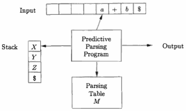

> Figure 4.19: Model of a table-driven predictive parser

The table-driven parser in Fig. 4.19 has an input buffer, a stack containing a sequence of grammar symbols, a parsing table constructed by Algorithm 4.31, and an output stream. The input buffer contains the string to be parsed, followed by the endmarker $. We reuse the symbol $ to mark the bottom of the stack, which initially contains the start symbol of the grammar on top of $.

The parser is controlled by a program that considers X, the symbol on top of the stack, and a, the current input symbol. If X is a nonterminal, the parser chooses an X-production by consulting entry M[X, a] of the parsing table M. (Additional code could be executed here, for example, code to construct a node in a parse tree.) Otherwise, it checks for a match between the terminal X and current input symbol a.

The behavior of the parser can be described in terms of its **configurations**, which give the stack contents and the remaining input. The next algorithm describes how configurations are manipulated.

***Algorithm 4.34*** : Table-driven predictive parsing.

 - INPUT: A string *w* and a parsing table M for grammar G.
 - OUTPUT: If *w* is ih L(G), a leftmost derivation of *w* ; otherwise, an error indication.
 - METHOD: 


TODO

---

<h2 id="f9623de73450682a749169cc00ff525f"></h2>


## 4.5 Bottom-Up Parsing

A bottom-up parse corresponds to the construction of a parse tree for an input string beginning at the leaves (the bottom) and working up towards the root (the top). It is convenient to describe parsing as the process of building parse trees, although a front end may in fact carry out a translation directly without building an explicit tree. The sequence of tree snapshots in Fig. 4.25 illustrates a bottom-up parse of the token stream **id \* id**, with respect to the expression grammar (4.1).

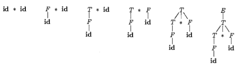

> Figure 4.25: A bottom-up parse for **id \* id**

This section introduces a general style of bottom-up parsing known as *shift­ reduce parsing*. 

The largest class of grammars for which shift-reduce parsers can be built, the LR grammars, will be discussed in Sections 4.6 and 4.7. 

Although it is too much work to build an LR parser by hand, tools called automatic parser generators make it easy to construct efficient LR parsers from suitable gram­mars. The concepts in this section are helpful for writing suitable grammars to make effective use of an LR parser generator. Algorithms for implementing parser generators appear in Section 4.7.


<h2 id="75dad4de7472da6fd89ec89afdeead2a"></h2>


### 4.5.1 Reductions

We can think of bottom-up parsing as the process of "reducing" a string *w* to the **start symbol** of the grammar. 

At each reduction step, a specific substring matching the body of a production is replaced by the nonterminal at the head of that production.

> matched production body -> production head 

The key decisions during bottom-up parsing are about when to reduce and about what production to apply, as the parse proceeds.

Example 4.37 : The snapshots in Fig. 4.25 illustrate a sequence of reductions; the grammar is the expression grammar (4.1). The reductions will be discussed in terms of the sequence of strings

```
id*id, F*id, T*id, T*F, T, E
```

The strings in this sequence are formed from the roots of all the subtrees in the snapshots. The sequence starts with the input string id \* id. The first reduction produces F \* id by reducing the leftmost **id** to F, using the production F → id. The second reduction produces T \* id by reducing F to T.

Now, we have a choice between *reducing the string T*, which is the body of E → T, and *the string consisting of the second* **id**, which is the body of F → id. 

Rather than reduce T to E, the second id is reduced to T, resulting in the string T \* F. This string then reduces to T. The parse completes with the reduction of T to the start symboi E.

By definition, a reduction is the reverse of a step in a derivation (recall that in a derivation, a nonterminal in a sentential form is replaced by the body of one of its productions) . The goal of bottom-up parsing is therefore to construct a derivation in reverse. The following derivation corresponds to the parse in Fig. 4.25:

```
E ⇒ T ⇒ T*F ⇒ T*id ⇒ F*id ⇒ id*id
```

This derivation is in fact a rightmost derivation.

> leftmost reduction `<=>` rightmost derivation

---

<h2 id="9ccb465b120d57587de0becf98dc5d13"></h2>


### 4.5.2 Handle Pruning

Bottom-up parsing during a left-to-right scan of the input constructs a right­most derivation in reverse. Informally, a "handle" is a substring that matches the body of a production, and whose reduction represents one step along the reverse of a rightmost derivation.

For example, adding subscripts to the tokens **id** for clarity, the handles during the parse of id₁ \* id₂ according to the expression grammar (4.1) are as in Fig. 4.26. 

RIGHT SENTENTIAL FORM | HANDLE | REDUCING PRODOCUTION
--- | --- | ---
id₁ \* id₂ | id₁ | F → id
F \* id₂ | F | T → F
T \* id₂ | id₂ | F → id
T \* F |  T \* F | E → T \* F

> Figure 4.26: Handles during a parse of id₁ \* id₂

Although T is the body of the production E → T, the symbol T is not a handle in the sentential form T \* id₂ . If T were indeed replaced by E, we would get the string E \* id2 , which cannot be derived from the start symbol E . Thus, the leftmost substring that matches the body of some production need not be a handle.

Formally, if S ⇒<sup>\*</sup><sub>rm</sub> αAw ⇒<sub>rm</sub> αβw , as in Fig. 4.27, 

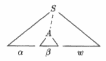

> Figure 4.27: A handle A → β in the parse tree for αβw

then production A → β in the position following α is a ***handle*** of αβw. Alternatively, a handle of a right-sentential form γ is a production A → β  and a position of γ where the string β may be found, such that replacing β at that position by A produces the previous right-sentential form in a rightmost derivation of γ.

Notice that the string w to the right of the handle must contain only terminal symbols. For convenience, we refer to the body β rather than A → β as a handle. Note we say "a handle" rather than "the handle," because the grammar could be ambiguous, with more than one rightmost derivation of αβw. If a grammar is unambiguous, then every right-sentential form of the grammar has exactly one handle.

A rightmost derivation in reverse can be obtained by "handle pruning." That is, we start with a string of terminals w to be parsed. If w is a sentence of the grammar at hand, then let w = γ<sub>n</sub>, where γ<sub>n</sub> is the **n**th right-sentential form of some as yet unknown rightmost derivation

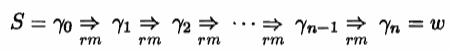

To reconstruct this derivation in reverse order, we locate the handle β<sub>n</sub> in γ<sub>n</sub> and replace β<sub>n</sub> by the head of the relevant production A<sub>n</sub> → β<sub>n</sub> to obtain the previous right-sentential form γ<sub>n-1</sub>. Note that we do not yet know how handles are to be found, but we shall see methods of doing so shortly.

We then repeat this process. That is; we locate the handle β<sub>n-1</sub> in γ<sub>n-1</sub> and reduce this handle to obtain the right-sentential form γ<sub>n-2</sub> .  by continuing this process we produce a right-sentential form consisting only of the start symbol S, then we halt and announce successful completion of parsing. The reverse of the sequence of productions used in the reductions is a rightmost derivation for the input string.

---

<h2 id="9b6a846be2d88d97f6ed2aee1262fac8"></h2>


### 4.5.3 Shift-Reduce Parsing

Shift-reduce parsing is a form of bottom-up parsing in which 

 - a stack holds grammar symbols 
 - and an input buffer holds the rest of the string to be parsed. 
 - the handle always appears at the top of the stack just before it is identified as the handle.

We use $ to mark the bottom of the stack and also the right end of the input. Conventionally, when discussing bottom-up parsing, we show the top of the stack on the right, rather than on the left as we did for top-down parsing. Initially, the stack is empty, and the string w is on the input, as follows:

STACK | INPUT
:--- | ---:
$ | w$

During a left-to-right scan of the input string, the parser shifts zero or more input symbols onto the stack, until it is ready to reduce a string β of grammar symbols on top of the stack. It then reduces β to the head of the appropriate production. The parser repeats this cycle until it has detected an error or until the stack contains the start symbol and the input is empty:

STACK | INPUT
:--- | ---:
$S | $

Upon entering this configuration, the parser halts and announces successful completion of parsing. Figure 4.28 steps through the actions a shift-reduce parser might take in parsing the input string id₁ \* id₂ according to the expression grammar (4.1).

STACK | INPUT | ACTION
:--- | ---:| ---
$ | id₁ \* id₂ $ | shift
$id₁ |  \* id₂ $ | reduce by F → id
$F |  \* id₂ $ | reduce by T → F
$T |  \* id₂ $ | shift
$T \* |   id₂ $ | shift
$T \* id₂ |   $ | reduce by F → id
$T \* F |   $ | reduce by T → T \* F
$T  |   $ | reduce by E → T
$E  |   $ | accept

> Figure 4.28: Configurations of a shift-reduce parser on input id₁ \* id₂

While the primary operations are shift and reduce, there are actually four possible actions a shift-reduce parser can make: (1) shift, (2) reduce, (3) accept, and (4) error.

 1. Shift 
     - Shift the next input symbol onto the top of the stack.
 2. Reduce
     - The right end of the string to be reduced must be at the top of the stack. 
     - Locate the left end of the string within the stack and decide with what nonterminal to replace the string.
 3. Accept
     - Announce successful completion of parsing.
 4. Error
     - Discover a syntax error and call an error recovery routine.

The use of a stack in shift-reduce parsing is justified by an important fact: the handle will always eventually appear on top of the stack, never inside. 

This fact can be shown by considering the possible forms of two successive steps in any rightmost derivation. Figure 4.29 illustrates the two possible cases. 

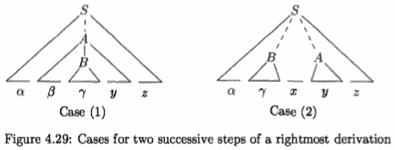

In case (1), A is replaced by βBy, and then the rightmost nonterminal B in the body  By is replaced by γ . In case (2), A is again expanded first, but this time the body is a string *y* of terminals only. The next rightmost nonterminal B will be somewhere to the left of *y* .

In other words:

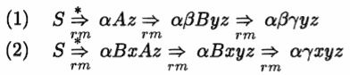

Consider case (1) in reverse, where a shift-reduce parser has just reached the configuration

STACK | INPUT
:--- | ---:
$αβγ | yz$


The parser reduces the handle γ to B to reach the configuration

STACK | INPUT
:--- | ---:
$αβB | yz$

The parser can now shift the string *y* onto the stack by a sequence of zero or more shift moves to reach the configuration

STACK | INPUT
:--- | ---:
$αβBy | z$

with the handle βBy on top of the stack, and it gets reduced to A.


Now consider case (2). In configuration

STACK | INPUT
:--- | ---:
$αγ | xyz$

the handle γ is on top of the stack. After reducing the handle γ to B, the parser can shift the string xy to get the next handle *y* on top of the stack, ready to be reduced to A:

STACK | INPUT
:--- | ---:
$αBxy | z$

In both cases, after making a reduction the parser had to shift zero or more symbols to get the next handle onto the stack. It never had to go into the stack to find the handle.

---

<h2 id="1a4801efb2e3561712ddc97ef0ee0039"></h2>


### 4.5.4 Conflicts During Shift-Reduce Parsing

**There are context-free grammars for which shift-reduce parsing cannot be used**. 

Every shift-reduce parser for such a grammar can reach a configuration in which the parser, knowing the entire stack contents and the next input symbol, cannot decide whether to shift or to reduce ( **a shift /reduce conflict**), or cannot decide which of several reductions to make ( **a reduce/reduce conflict**).

We now give some examples of syntactic constructs that give rise to such grammars. Techni­cally, these grammars are not in the LR(k) class of grammars defined in Section 4.7; we refer to them as non-LR grammars. The k in LR(k) refers to the number of symbols of lookahead on the input. Grammars used in compiling usually fall in the LR(1) class, with one symbol of lookahead at most.

Example 4.38 : An ambiguous grammar can never be LR. For example, con­sider the dangling-else grammar (4.14) of Section 4.3:

```
stmt → if expr then stmt         (4.14)
     | if expr then stmt else stmt 
     | other
```

If we have a shift-reduce parser in configuration

STACK | INPUT
:--- | ---:
$ ... if expr then stmt  | else ... $

we cannot tell whether `if expr then stmt` is the handle, no matter what appears below it on the stack. Here there is a shift/reduce conflict. 

Depending on what follows the **else** on the input, it might be correct to reduce `if expr then stmt` to **stmt**, or it might be correct to shift **else** and then to look for another **stmt** to complete the alternative `if expr then stmt else stmt`.

Note that shift-reduce parsing can be adapted to parse certain ambigu­ous grammars, such as the `if-then-else` grammar above. If we resolve the shift/reduce conflict on **else** in favor of shifting, the parser will behave as we expect, associating each **else** with the previous unmatched **then**. We discuss parsers for such ambiguous grammars in Section 4.8.


Another common setting for conflicts occurs when we know we have a han­dle, but the stack contents and the next input symbol are insufficient to de­termine which production should be used in a reduction. The next example illustrates this situation.

Example 4.39 : Suppose we have a lexical analyzer that returns the token name **id** for all names, regardless of their type. Suppose also that out lan­guage invokes procedures by giving their names, with parameters surrounded by parentheses, and that arrays are referenced by the same syntax. Since the translation of indices in array references and parameters in procedure calls are different, we want to use different productions to generate lists of actual parameters and indices. Our grammar might therefore have (among others) productions such as those in Fig. 4.30.

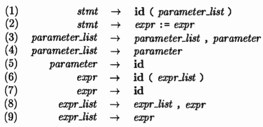

> Figure 4.30: Productions involving procedure calls and array references

A statement beginning with p(i , j) would appear as the token stream **id**(**id**, **id**) to the parser. After shifting the first three tokens onto the stack, a shift-reduce parser would be in configuration

STACK | INPUT
:--- | ---:
... id ( id | , id ) ...

It is evident that the **id** on top of the stack must be reduced, but by which production ? 

The correct choice is production (5) if p is a procedure, but pro­duction (7) if p is an array. The stack does not tell which; information in the symbol table obtained from the declaration of p must be used.

One solution is to change the token **id** in production (1) to **procid** and to use a more sophisticated lexical analyzer that returns the token name procid when it recognizes a lexeme that is the name of a procedure. Doing so would require the lexical analyzer to consult the symbol table before returning a token.

If we made this modification, then on processing p(i , j) the parser would be either in the configuration

STACK | INPUT
:--- | ---:
... procid ( id | , id ) ...

or in the configuration above. 

In the former case, we choose reduction by production (5); in the latter case by production (7). Notice how the symbol third from the top of the stack determines the reduction to be made, even though it is not involved in the reduction. Shift-reduce parsing can utilize information far down in the stack to guide the parse.

---

4.6 Introduction to LR Parsing: Simple LR

The most prevalent type of bottom-up parser today is based on a concept called LR(k) parsing; the "L" is for left-to-right scanning of the input, the "R" for constructing a rightmost derivation **in reverse**, and the k for the number of input symbols of lookahead that are used in making parsing decisions. The cases k = 0 or k = 1 are of practical interest, and we shall only consider LR parsers with k ≤ 1 here. When (k) is omitted, k is assumed to be 1.

This section introduces the basic concepts of LR parsing and the easiest method for constructing shift-reduce parsers, called "simple LR" (or SLR, for short). Some familiarity with the basic concepts is helpful even if the LR parser itself is constructed using an automatic parser generator. We begin with "items" and "parser states;" the diagnostic output from an LR parser generator typically includes parser states, which can be used to isolate the sources of parsing conflicts.
Section 4.7 introduces two, more complex methods - canonical-LR and LALR - that are used in the majority of LR parsers.

---

<h2 id="a2c6f8cde9a7fef6d36589483fdf000a"></h2>


### 4.6.1 Why LR Parsers?

LR parsers are table-driven, much like the nonrecursive LL parsers of Sec­ tion 4.4.4. A grammar for which we can construct a parsing table using one of the methods in this section and the next is said to be an *LR grammar*. Intu­itively, for a grammar to be LR it is sufficient that a left-to-right shift-reduce parser be able to recognize handles of right-sentential forms when they appear on top of the stack.

LR parsing is attractive for a variety of reasons:

 - LR parsers can be constructed to recognize virtually all programming­ language constructs for which context-free grammars can be written. Non­ LR context-free grammars exist, but these can generally be avoided for typical programming-language constructs.
 - The LR-parsing method is the most general nonbacktracking shift-reduce parsing method known, yet it can be implemented as efficiently as other, more primitive shift-reduce methods (see the bibliographic notes) .
 - An LR parser can detect a syntactic error as soon as it is possible to do so on a left-to-right scan of the input .
 - The class of grammars that can be parsed using LR methods is a proper superset of the class of grammars that can be parsed with predictive or LL methods. For a grammar to be LR(k), we must be able to recognize the occurrence of the right side of a production in a right-sentential form, with k input symbols of lookahead. This requirement is far less stringent than that for LL(k) grammars where we must be able to recognize the use of a production seeing only the first k symbols of what its right side derives. Thus, it should not be surprising that LR grammars can describe more languages than LL grammars.

The principal drawback of the LR method is that it is too much work to construct an LR parser by hand for a typical programming-language grammar. A specialized tool, an LR parser generator, is needed. Fortunately, many such generators are available, and we shall discuss one of the most commonly used ones, **Yacc**, in Section 4.9.  Such a generator takes a context-free grammar and automatically produces a parser for that grammar. If the grammar contains ambiguities or other constructs that are difficult to parse in a left-to-right scan of the input, then the parser generator locates these constructs and provides detailed diagnostic messages.

---

<h2 id="4e6a3d241cec350eaca302f9ae19d4b3"></h2>


### 4.6.2 Items and the LR(O) Automaton

How does a shift-reduce parser know when to shift and when to reduce? For example, with stack contents $T and next input symbol \* in Fig. 4.28, how does the parser know that T on the top of the stack is not a handle, so the appropriate action is to shift and not to reduce T to E ?

An LR parser makes shift-reduce decisions by maintaining states to keep track of where we are in a parse. States represent sets of "items." An LR(O) item (item for short) of a grammar G is a production of G with a dot at some position of the body. Thus, production A → XYZ yields the four items

```
A → ·XYZ 
A → X·YZ 
A → XY·Z 
A → XYZ·
```

The production A → ε generates only one item, `A → ·` .

Intuitively, an item indicates how much of a production we have seen at a given point in the parsing process. 

For example, the item `A → ·XYZ` indicates that we hope to see a string derivable from XYZ next on the input. Item `A → X·YZ` indicates that we have just seen on the input a string derivable from X and that we hope next to see a string derivable from YZ. Item `A → XYZ·` indicates that we have seen the body XYZ and that it may be time to reduce XYZ to A.

---

**Representing Item Sets**

 - A parser generator that produces a bottom-up parser may need to rep­resent items and sets of items conveniently. 
 - Note that an item can be represented by a pair of integers, 
     - the first of which is the number of one of the productions of the underlying grammar, 
     - and the second of which is the position of the dot. 
 - Sets of items can be represented by a list of these pairs. 
 - However, as we shall see, the necessary sets of items often include "closure" items, where the dot is at the beginning of the body. These can always be reconstructed from the other items in the set, and we do not have to include them in the list.

---

One collection of sets of LR(O) items, called the *canonical* LR(O) collection, provides the basis for constructing a deterministic finite automaton that is used to make parsing decisions. Such an automaton is called an *LR(O) automaton*. In particular, each state of the LR(O) automaton represents a set of items in the canonical LR(O) collection. The automaton for the expression grammar (4.1), shown in Fig. 4.31, will serve as the running example for discussing the canonical LR(0) collection for a grammar.

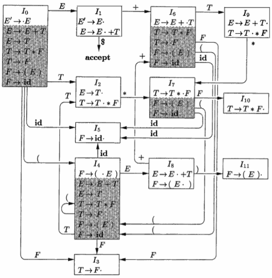

> Figure 4.31: LR(O) automaton for the expression grammar (4.1)

To construct the canonical LR(O) collection for a grammar, we define an augmented grammar and two functions, CLOSURE and GOTO. If G is a grammar with start symbol S, then G' , the *augmented grammar* for G , is G with a new start symbol S' and production S' → S . The purpose of this new starting production is to indicate to the parser when it should stop parsing and announce acceptance of the input. That is, acceptance occurs when and only when the parser is about to reduce by S' → S .

**Closure of Item Sets**

If *I* is a set of items for a grammar G, then CLOSURE(*I*) is the set of items constructed from *I* by the two rules:

 1. Initially, add every item in I to CLOSURE(I) .
 2. If A → α·Bβ is in CLOSURE(I) and B → γ is a production, then add the item B → ·γ to CLOSURE(I) , if it is not already there. 
     - Apply this rule until no more new items can be added to CLOSURE(I).

Intuitively, A → α·Bβ  in CLOSURE(/) indicates that, at some point in the parsing process, we think we might next see a substring derivable from Bβ input. The substring derivable from Bβ will have a prefix derivable from B by applying one of the B-productions. We therefore add items for all the B-productions; that is, if B → γ is a production, we also include B → ·γ in CLOSURE(I) .

Example 4.40 : Consider the augmented expression grammar:

```
E'→ E
E → E + T | T
T → T * F | F     (4.1 augmented) 
F → ( E ) | id
```

If I is the set of one item {[ E' → ·E ]}, then CLOSURE(I) contains the set of items I₀ in Fig. 4.31.


TODO

---

<h2 id="becfa08423ca76c3b66ebef33635a92e"></h2>


## 4.8 Using Ambiguous Grammars

It is a fact that every ambiguous grammar fails to be LR and thus is not in any of the classes of grammars discussed in the previous two sections.

How­ ever, certain types of ambiguous grammars are quite useful in the specification and implementation of languages. 

Although the grammars we use are ambiguous, in all cases we specify dis­ambiguating rules that allow only one parse tree for each sentence. In this way, the overall language specification becomes unambiguous, and sometimes it be­ comes possible to design an LR parser that follows the same ambiguity-resolving choices. 

We stress that ambiguous constructs should be used sparingly and in a strictly controlled fashion; otherwise, there can be no guarantee as to what language is recognized by a parser.

<h2 id="b5c45cae2166b520f13ac35f70fe79df"></h2>


### 4.8.1 Precedence and Associativity to Resolve Conflicts

```
E → E + E | E * E | (E) | id   (4.3)
```

This grammar is ambiguous because it does not specify the associativity or precedence of the operators + and \*.

The unambiguous grammar (4.1), which includes productions E → E + T and T → T * F, generates the same language, but gives + lower precedence than \* , and makes both operators left associative.

There are two reasons why we might prefer to use the ambiguous grammar.

 - First, as we shall see, we can easily change the associativity and precedence of the operators + and \* without disturbing the productions of (4.3) or the number of states in the resulting parser. 
 - Second, the parser for the unam­biguous grammar will spend a substantial fraction of its time reducing by the productions E → T and T → F, whose sole function is to enforce associativity and precedence. The parser for the ambiguous grammar (4.3) will not waste time reducing by these *single* productions (productions whose body consists of a single nonterminal).

The sets of LR(O) items for the ambiguous expression grammar (4.3) aug­mented by E' → E are shown in Fig. 4.48. Since grammar (4.3) is ambiguous, there will be parsing-action conflicts when we try to produce an LR parsing table from the sets of items. The states corresponding to sets of items I₇ and I₈ generate these conflicts. Suppose we use the SLR approach to constructing the parsing action table. The conflict generated by I₇ between reduction by E → E + E and shift on + or \* cannot be resolved, because + and \* are each in FOLLOW(E). Thus both actions would be called for on inputs + and \*. A similar conflict is generated by I₈, between reduction by E → E \* E and shift on inputs + and \*. In fact , each of our LR parsing table-construction methods will generate these conflicts.

***However, these problems can be resolved using the precedence and associa­tivity information for + and \*.*** 

Consider the input `id + id * id`, which causes a parser based on Fig. 4.48 to enter state 7 after processing `id + id`; in particular the parser reaches a configuration:

 PREFIX | STACK | INPUT
 --- | --- | ---
E + E | 0 1 4 7 | \* id $

For convenience, the symbols corresponding to the states 1, 4, and 7 are also shown under PREFIX.

If \* takes precedence over +, we know the parser should shift \* onto the stack, preparing to reduce the \* and its surrounding **id** symbols to an expression. This choice was made by the SLR parser of Fig. 4.37, based on an unambiguous grammar for the same language. On the other hand, if + takes precedence over \*, we know the parser should reduce E + E to E. Thus the relative precedence of + followed by \* uniquely determines how the parsing action conflict between reducing E → E + E and shifting on \* in state 7 should be resolved.

If the input had been `id + id + id` instead, the parser would still reach a configuration in which it had stack 0 1 4 7 after processing input `id + id`. On input + there is again a shift/reduce conflict in state 7. Now, however, the associativity of the + operator determines how this conflict should be resolved. If + is left associativy; the correct action is to reduce by E → E + E. That is, the **id** symbols surrounding the first + must be grouped first. Again this choice coincides with what the SLR parser for the unambiguous grammar would do.

In summary, assuming + is left associative, the action of state 7 on input + should be to reduce by E → E + E, and assuming that \* takes precedence over +, the action of state 7 on input \* should be to shift. Similarly, assuming that \* is left associative and takes precedence over +, we can argue that state 8, which can appear on top of the stack only when E \* E are the top three grammar symbols, should have the action reduce E → E * E on both + and \* inputs. In the case of input +, the reason is that \* takes precedence over +, while in the case of input \* , the rationale is that \* is left associative.


Proceeding in this way, we obtain the LR parsing table shown in Fig. 4.49.

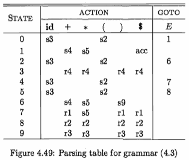

Productions 1 through 4 are `E → E+E`,`E → E*E`, `→ (E)`,and `E → id`, respectively. It is interesting that a similar parsing action table would be produced by eliminating the reductions by the single productions E → T and T → F from the SLR table for the unambiguous expression grammar (4.1) shown in Fig. 4.37. Ambiguous grammars like the one for expressions can be handled in a similar way in the context of LALR  and canonical LR parsing.

<h2 id="74ef872b3b507835141a77ac0067aa66"></h2>


### 4.8.2 The "Dangling-Else" Ambiguity

```
stmt → if expr then stmt         (4.14)
     | if expr then stmt else stmt 
     | other
```

This grammar is ambiguous because it does not resolve the dangling-else ambiguity.

To simplify the discussion, let us consider an abstraction of this grammar, where *i* stands for `if expr then`, *e* stands for `else`, and *a* stands for "all other productions." 

We can then write the grammar, with augmenting production S' → S , as

```
S' → S                         (4.67)
S  → i S e S | i S | a
```

The sets of LR(O) items for grammar (4.67) are shown in Fig. 4.50. 

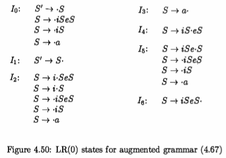

The ambi­guity in (4.67) gives rise to a shift/reduce conflict in I₄. There, `S  → iS·eS` calls for a shift of *e* and, since FOLLOW(S) = {e, $}, item `S  → iS·` calls for reduction by `S  → iS` on input *e*.

Translating back to the if-then-else terminology, given

```
    if expr then stmt
```

on the stack and **else** as the first input symbol, should we shift **else** onto the stack (i.e., shift *e*) or reduce `if expr then stmt` (i.e, reduce by S → iS)? The answer is that we should shift **else**, because it is "associated" with the previous **then**. In the terminology of grammar (4.67) , the *e* on the input, standing for **else**, can only form part of the body beginning with the `iS` now on the top of the stack. If what follows *e* on the input cannot be parsed as an `S`, completing body `iSeS`, then it can be shown that there is no other parse possible.

We conclude that the shift/reduce conflict in I₄ should be resolved in favor of shift on input *e*. The SLR parsing table constructed from the sets of items of Fig. 4.48, using this resolution of the parsing-action conflict in I₄ on input *e*, is shown in Fig. 4.51. Productions 1 through 3 are `S  → i S e S `, `S  → i S`, and `S  → a `, respectively.


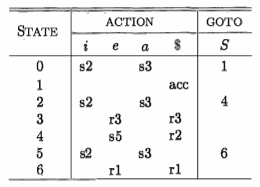
> Figure 4.51: LR parsing table for the "dangling-else" grammar

For example, on input `iiaea`, the parser makes the moves shown in Fig. 4.52, corresponding to the correct resolution ofthe "dangling-else." At line (5), state 4 selects the shift action on input e, whereas at line (9) , state 4 calls for reduction by `S  → i S` is on input $.

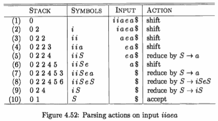

By way of comparison, if we are unable to use an ambiguous grammar to specify conditional statements, then we would have to use a bulkier (笨重的) grammar along the lines of Example 4.16.

---

<h2 id="90be1bacbbcce10de3867b08f49b8ca7"></h2>


### 4.8.3 Error Recovery in LR Parsing (TODO)

---


