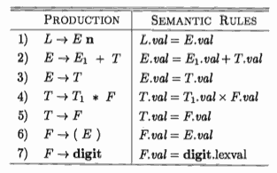

...menustart

- [Chapter 5 : Syntax-Directed Translation](#540b35b48067336ac81ed72b19b2d25d)
    - [5.1 Syntax-Directed Definitions](#c17f9eaa10ce812de9972d19e5f8c9d6)
        - [5.1.1 Inherited and Synthesized Attributes](#04ebabaa61165c801fcaf1d9edb7eb0e)
        - [5.1.2 Evaluating an SDD at the Nodes of a Parse Tree  (TODO)](#6a8f31023d1957d6a63144698dc91303)
    - [5.3 Applications of Syntax-Directed Translation](#b0f40c652517be0bfddc1eec315f7fc6)
        - [5.3.1 Construction of Syntax Trees  (TODO)](#e3e96ea672ac084ac9f816eef5a05639)

...menuend


<h2 id="540b35b48067336ac81ed72b19b2d25d"></h2>


# Chapter 5 : Syntax-Directed Translation

This chapter develops the theme of Section 2.3: the translation of languages guided by context-free grammars. The translation techniques in this chapter will be applied in Chapter 6 to type checking and intermediate-code generation.

The techniques are also useful for implementing little languages for specialized tasks; this chapter includes an example from typesetting.

We associate information with a language construct by attaching *attributes* to the grammar symbol(s) representing the construct, as discussed in Sec­ tion 2.3.2. A syntax-directed definition specifies the values of attributes by associating semantic rules with the grammar productions. For example, an infix-to-postfix translator might have a production and rule 

 PRODUCTION | SEMANTIC FULE
--- | ---
E → E₁ + T  |  E.code = E₁.code ‖ T.code ‖ '+'   (5.1)

This production has two nonterminals, E and T; the subscript in E₁ distin­guishes the occurrence of E in the production body from the occurrence of E as the head; Both E and T have a string-valued attribute code. The semantic rule specifies that the string E.code is formed by concatenating E₁.code , T.code, and the character '+'. While the rule makes it explicit that the translation of E is built up from the translations of E₁ , T, and '+', it may be inefficient to implement the translation directly by manipulating strings.

From Section 2.3.5, a syntax-directed translation scheme embeds program fragments called semantic actions within production bodies, as in

```
E → E₁ + T     { print '+'}     (5.2)
```

By convention, semantic actions are enclosed within curly braces. (If curly braces occur as grammar symbols, we enclose them within single quotes, as in '{' and '}'.)  The position of a semantic action in a production body determines the order in which the action is executed. In production (5.2), the action occurs at the end, after all the grammar symbbls; in general, semantic actions may occur at any position in a production body.


Between the two notations, 

- syntax-directed definitions can be more readable, and hence more useful for specifications. 
- However, translation schemes can be more efficient, and hence more useful for implementations. 

The most general approach to syntax-directed translation is to construct a parse tree or a syntax tree, and then to compute the values of attributes at the nodes of the tree by visiting the nodes of the tree. In many cases, translation can be done during parsing, without building an explicit tree. We shall therefore study a class of syntax-directed translations called "L-attributed translations" (L for left-to-right), which encompass virtually all translations that can be performed during parsing. We also study a smaller class, called "S-attributed translations" (S for synthesized), which can be performed easily in connection with a bottom-up parse.

---

<h2 id="c17f9eaa10ce812de9972d19e5f8c9d6"></h2>


## 5.1 Syntax-Directed Definitions

A *syntax-directed definition* (SDD) is a context-free grammar together with attributes and rules. Attributes are associated with grammar symbols and rules are associated with productions. If X is a symbol and a is one of its attributes, then we write X.a to denote the value of a at a particular parse-tree node labeled X. If we implement the nodes of the parse tree by records or objects, then the attributes of X can be implemented by data fields in the records that represent the nodes for X. Attributes may be of any kind: numbers, types, table references, or strings, for instance. The strings may even be long sequences of code, say code in the intermediate language used by a compiler.

---

<h2 id="04ebabaa61165c801fcaf1d9edb7eb0e"></h2>


### 5.1.1 Inherited and Synthesized Attributes

We shall deal with two kinds of attributes for nonterminals:

 1. A *synthesized attribute* for a nonterminal A at a parse-tree node N is defined by a semantic rule associated with the production at N. Note that the production must have A as its head. A synthesized attribute at node N is defined only in terms of attribute values at the children of N and at N itself.
 2. An *inherited attribute* for a nonterminal B at a parse-tree node N is defined by a semantic rule associated with the production at the parent of N. Note that the production must have B as a symbol in its body. An inherited attribute at node N is defined only in terms of attribute values at N's parent, N itself, and N's siblings.

While we do not allow an inherited attribute at node N to be defined in terms of attribute values at the children of node N, we do allow a synthesized attribute at node N to be defined in terms of inherited attribute values at node N itself.

Terminals can have synthesized attributes, but not inherited attributes. At­tributes for terminals have lexical values that are supplied by the lexical ana­lyzer; there are no semantic rules in the SDD itself for computing the value of an attribute for a terminal.

Example 5.1 : The SDD in Fig. 5.1 is based on our familiar grammar for arithmetic expressions with operators + and \*. It evaluates expressions termi­nated by an endmarker n. In the SDD, each of the nonterminals has a single synthesized attribute, called val. We also suppose that the terminal **digit** has a synthesized attribute *lexval*, which is an integer value returned by the lexical analyzer.



> Figure 5.1: Syntax-directed de nition of a simple desk calculator


An SDD that involves only synthesized attributes is called S-attributed; the SDD in Fig. 5.1 has this property. In an S-attributed SDD, each rule computes an attribute for the nonterminal at the head of a production from attributes taken from the body of the production.

For simplicity, the examples in this section have semantic rules without side effects. In practice, it is convenient to allow SDD's to have limited side effects, such as printing the result computed by a desk calculator or interacting with a symbol table. Once the order of evaluation of attributes is discussed in Section 5.2, we shall allow semantic rules to compute arbitrary functions, possibly involving side effects.

An S-attributed SDD can be implemented naturally in conjunction with an LR parser. In fact, the SDD in Fig. 5.1 mirrors the Yacc program of Fig. 4.58, which illustrates translation during LR parsing. The difference is that, in the rule for production 1, the Yacc program prints the value E.val as a side effect, instead of defining the attribute L.val.

An SDD without side effects is sometimes called an attribute grammar. The rules in an attribute grammar define the value of an attribute purely in terms of the values of other attributes and constants.

---

<h2 id="6a8f31023d1957d6a63144698dc91303"></h2>


### 5.1.2 Evaluating an SDD at the Nodes of a Parse Tree  (TODO)

---

<h2 id="b0f40c652517be0bfddc1eec315f7fc6"></h2>


## 5.3 Applications of Syntax-Directed Translation

The syntax-directed translation techniques in this chapter will be applied in Chapter 6 to type checking and intermediate-code generation. Here, we consider selected examples to illustrate some representative SDD's.

The main application in this section is the construction of syntax trees. Since some compilers use syntax trees as an intermediate representation, a common form of SDD turns its input string into a tree. To complete the translation to intermediate code, the compiler may then walk the syntax tree, using another set of rules that are in effect an SDD on the syntax tree rather than the parse tree. (Chapter 6 also discusses approaches to intermediate-code generation that apply an SDD without ever constructing a tree explicitly.) 

We consider two SDD's for constructing syntax trees for expressions. The first, an S-attributed definition, is suitable for use during bottom-up parsing. The second, L-attributed, is suitable for use during top-down parsing.

The final example of this section is an L-attributed definition that deals with basic and array types.


---

<h2 id="e3e96ea672ac084ac9f816eef5a05639"></h2>


### 5.3.1 Construction of Syntax Trees  (TODO)


