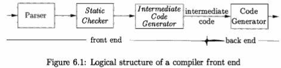
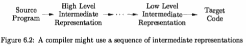

...menustart

 - [Chapter 6 : Intermediate-Code Generation](#2b9d12e2be9c88ae4472d67fb4f304a8)
     - [6.1 Variants of Syntax Trees](#12afec74d79e469881c523f301883f14)

...menuend

<h2 id="2b9d12e2be9c88ae4472d67fb4f304a8"></h2>

# Chapter 6 : Intermediate-Code Generation

In the analysis-synthesis model of a compiler, the front end analyzes a source program and creates an intermediate representation, from which the back end generates target code. 

Ideally, details of the source language are confined to the front end, and details of the target machine to the back end. With a suitably defined intermediate representation, a compiler for language i and machine j can then be built by combining the front end for language i with the back end for machine j. This approach to creating suite of compilers can save a considerable amount of effort: m x n compilers can be built by writing just m front ends and n back ends.

This chapter deals with intermediate representations, static type checking, and intermediate code generation. 

For simplicity, we assume that a com­piler front end is organized as in Fig. 6.1, 

where parsing, static checking, and intermediate-code generation are done sequentially; sometimes they can be com­bined and folded into parsing. We shall use the syntax-directed formalisms of Chapters 2 and 5 to specify checking and translation. Many of the translation schemes can be implemented during either bottom-up or top-down parsing, us­ing the techniques of Chapter 5. All schemes can be implemented by creating a syntax tree and then walking the tree.

Static checking includes **type checking**, which ensures that operators are ap­plied to compatible operands. It also includes any syntactic checks that remain after parsing.  For example, static checking assures that a break-statement in C is enclosed within a while-, for-, or switch-statement; an error is reported if such an enclosing statement does not exist.

The approach in this chapter can be used for a wide range of intermediate representations, including syntax trees and three-address code, both of which were introduced in Section 2.8. The term "three-address code" comes from instructions of the general form x = y ***op*** z with three addresses: two for the operands y and z and one for the result x.

In the process oftranslating a program in a given source language into code for a given target machine, a compiler may construct a sequence of intermediate representations, as in Fig. 6.2. 

High-level representations are close to the source language and low-level representations are close to the target machine. Syntax trees are high level; they depict the natural hierarchical structure of the source program and are well suited to tasks like static type checking.

A low-level representation is suitable for machine-dependent tasks like reg­ister allocation and instruction selection. Three-address code can range from high- to low-level, depending on the choice of operators. For expressions, the differences between syntax trees and three-address code are superficial, as we shall see in Section 6.2.3. For looping statements, for example, a syntax tree represents the components of a statement, whereas three-address code contains labels and jump instructions to represent the flow of control, as in machine language.

The choice or design of an intermediate representation varies from compiler to compiler. An intermediate representation may either be an actual language or it may consist of internal data structures that are shared by phases of the compiler. C is a programming language, yet it is often used as an intermediate form because it is flexible, it compiles into efficient machine code, and its com­pilers are widely available. The original C++ compiler consisted of a front end that generated C, treating a C compiler as a back end.

---

<h2 id="12afec74d79e469881c523f301883f14"></h2>

## 6.1 Variants of Syntax Trees

